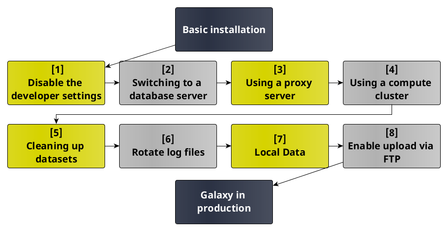

Move from dev instance to production instance
=============================================

:grey_question: ***Questions***

- *Why do I need to configure Galaxy for production ?* 
- *How to run a galaxy in a production environment ?*

:dart: ***Objectives***

- *Learn to install a Galaxy server.*
- *Upgrade a basic galaxy installation to a production environment*.
- *Get a basic understanding of entry points in the main galaxy configuration file.*

:heavy_check_mark: ***Requirements***

- *[Galaxy Server Administration](http://bgruening.github.io/training-material/Admin-Corner/slides/index.html)*

:hourglass: ***Time estimation*** *TODO*

# Introduction

In this tutorial you will learn to install and configure a galaxy instance. 
The basic installation instructions are suitable for developpement only.
For setting up a Galaxy for a multi-user production environment additonal steps are necessary.
After a basic installation, this tutorial present the main steps for moving from a basic installation to a production environment. 

# Basic Installation

## Clone it and run it  

:pencil2: ***Hands on!***

Galaxy's source code is hosted in a [GitHub](https://github.com/galaxyproject/galaxy) repository.

To get the code run:

	git clone -b release_16.07 https://github.com/galaxyproject/galaxy.git

To start the galaxy go to the galaxy directory and run:

	sh run.sh

This will start up the server on localhost and port 8080, so Galaxy can be accessed from your web browser at http://localhost:8080 . 

Galaxy's server will start printing its output to your terminal. To stop the Galaxy server, just hit Ctrl-c in the terminal from which Galaxy is running. 

## Access Galaxy over the network
In the basic installation Galaxy is bind to the loopback interface.
To bind Galaxy to any avalaible network interface edit the config/galaxy.ini file and change the host setting to:

	host = 0.0.0.0

## What did you just installed ?
The galaxy you have just installed is configured with the following:

- [SQLite](http://www.sqlite.org/): a servless database.
- A built-in HTTP server, written in Python.

The tools are run locally and the galaxy server itself run in a single process. 

## Usefull things to know ...

- The command: git clone -b release_16.07 https://github.com/galaxyproject/galaxy.git

*We use the "-b" option to clone a specific branch of the repository. 
In the example above we clone the branch release_16.07 because the lastest release is 16.07.
A new version of Galaxy is released every 3 months.
It is strongly encouraged to run this tutorial with the latest release. 
See the [GitHub](https://github.com/galaxyproject/galaxy) repository to get the latest one.*

- Galaxy configuration files

*In the config/ directory all the files are suffixed with ".sample".
Sample files are default files read by Galaxy when the server starts.
When you work on a configuration it is strongly encouraged to save these samples and to work on a file without prefix. 
So, go ahead: copy galaxy.ini.sample to galaxy.ini*

## What's next ?
Next, you will configure your Galaxy server for production.
The first thing to do is to disable the developer settings.

# Disable developer settings.
As previously mentionned the basic installation is for development only.

## Subpart 1

Short introduction about this subpart.

:pencil2: ***Hands on!***

1. First step
2. Second step
3. Third step

## Subpart 2

Short introduction about this subpart.

:pencil2: ***Hands on!***

1. First step
2. Second step
3. Third step

Some blabla

:pencil2: ***Hands on!***

1. First step
2. Second step
3. Third step

# Part 2

Short introduction about this subpart.

:pencil2: ***Hands on!***

1. First step
2. Second step
3. Third step

## Subpart 2

Short introduction about this subpart.

:pencil2: ***Hands on!***

1. First step
2. Second step
3. Third step

Some blabla

:pencil2: ***Hands on!***

1. First step
2. Second step
3. Third step

# Conclusion

Conclusion about the technical key points. And then relation between the technics and the biological question to end with a global view.

:grey_exclamation: ***Key Points***

- *Simple sentence to sum up the first key point of the tutorial (Take home message)*
- *Second key point*
- *Third key point*
- *...*

# :clap: Thank you
