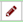

# Optimised de Bruijn Graph assemblies using the Velvet Optimiser and SPAdes
In this activity, we will perform *de novo* assemblies of a short read set using the Velvet Optimiser and the SPAdes assemblers. We are using the Velvet Optimiser for illustrative purposes. For real assembly work, a more suitable assembler should be chosen - such as SPAdes.

The Velvet Optimiser is a script written by Simon Gladman to optimise the k-mer size and coverage cutoff parameters for Velvet. More information can be found [here](http://github.com/slugger70/VelvetOptimiser)

SPAdes is a de novo genome assembler written by Pavel Pevzner's group in St. Petersburg. More details on it can be found [here](http://cab.spbu.ru/software/spades/)

> ### Agenda
>
> In this tutorial, we will deal with:
>
> 1. [Get the data](#get-the-data)
> 2. [Evaluate the input reads](#evaluate-the-input-reads)
> 3. [Assemble reads with Velvet](#assemble-reads-with-velvet)
> 4. [Collect some statistics on the contigs](#collect-some-statistics-on-the-contigs)
> 5. [Discussion](#discussion)
> {: .agenda}

# Get the data

We will be using the same data that we used in the introductory tutorial, so if you have already completed that and have the data, skip this section.

> ### :pencil2: Hands-on: Getting the data
>
> 1. Create and name a new history for this tutorial.
> 2. Import the sequence read raw data (\*.fastq) from [Zenodo](https://doi.org/10.5281/zenodo.582600)
>
>    > ### :bulb: Tip: Importing data via links
>    >
>    > * Copy the link location (Right-click on the filename <i class="fa fa-long-arrow-right"></i> Copy Link Address)
>    > * Open the Galaxy Upload Manager
>    > * Select **Paste/Fetch Data**
>    > * Paste the link into the text field
>    > * Change the data-type to **fastqsanger**
>    > * Press **Start**    
>    {: .tip}
>
>
> 3. Once the files have been uploaded, change their names to Mutant_R1.fastq and Mutant_R2.fastq respectively by clicking on the  icon next to the relevant history entry.
>
> Click on the View Data button (the ) next to one of the FASTQ sequence files.
>
>    > ### :question: Questions
>    >
>    > 1. What are four key features of a FASTQ file?
>    > 2. What is the main difference between a FASTQ and a FASTA file?
>    {: .question}
>
>
{: .hands_on}
