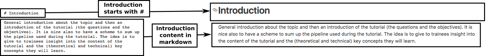
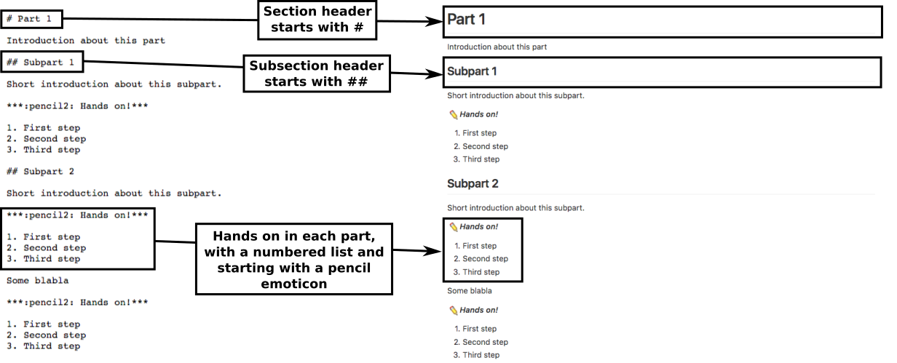
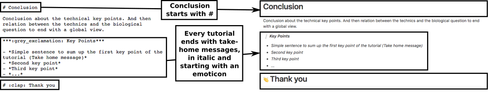

Contributing to Galaxy Training material
===

:+1::tada: First off, thanks for taking the time to contribute! :tada::+1:

The following is a set of guidelines for contributing to this training material on GitHub.

If you have any question, you can reach us using the [Gitter chat](https://gitter.im/Galaxy-Training-Network/Lobby?utm_source=share-link&utm_medium=link&utm_campaign=share-link).

# Table of contents

- [What should I know before I get started?](#what-should-i-know-before-i-get-started)
- [How can I contribute?](#how-can-i-contribute)
    - [Reporting mistakes or errors](#reporting-mistakes-or-errors)
    - [Your first content contribution](#your-first-content-contribution)
    - [Pull Requests](#pull-requests)
- [How the training material is structured?](#how-the-training-material-is-structured)
    - [`images` directory](#images-directory)
    - [`tutorials` directory](#tutorials-directory)
    - [`slides` directory](#slides-directory)
    - [`docker` directory](#docker-directory)
    - [`README.md` file](#README.md-file)
- [How the training material is maintained?](#how-the-training-material-is-maintained)
    - [Maintainers](#maintainers)
    - [Labels](#labels)

# What should I know before I get started?

This repository is a project of unification of the Galaxy training material. You can find more information about this project in this [small presentation](http://bgruening.github.io/training-material/shared/slides/project_presentation#/)

By contributing, you agree that we may redistribute your work under [our license](LICENSE.md).  

We will address your issues and/or assess your change proposal as promptly as we can, and help you become a member of our community.

# How can I contribute?

## Reporting mistakes or errors

The easiest way to start contributing is to file an issue to tell us about a spelling mistake or a factual error. You can then introduce yourself and meet some of our community members.

## Your first content contribution

Once, you are feeling more comfortable, you can propose changes to this training material.

In [issues](https://github.com/bgruening/training-material/issues) and [project management system](https://github.com/bgruening/training-material/projects), you will find lists of issues to fix and features to changes (with the "newcomer-friendly" label for example). Feel free to solve them.

We strongly recommend you to read and follow Software Carpentry's recommendations on [lesson design](https://swcarpentry.github.io/lesson-example/01-design/) and [lesson writing](http://swcarpentry.github.io/instructor-training/19-lessons/) if you planned to add or change some training material, and also to check the [structure of the training material](#how-the-training-material-is-structured).

## Pull Requests

To manage changes, we use [GitHub flow](https://guides.github.com/introduction/flow/) based on Pull Requests:

1. [Create a fork](https://help.github.com/articles/fork-a-repo/) of this repository on GitHub
2. Clone your fork of this repository to create a local copy on your computer
3. Create a new branch in your local copy for each significant change
4. Commit the changes in that branch
5. Push that branch to your fork on GitHub
6. Submit a pull request from that branch to the [master repository](https://github.com/bgruening/training-material)
7. If you receive feedback, make changes in your local clone and push to your branch on GitHub: the pull request will update automatically

For beginners, the GitHub interface will help you in the process in edition of one file. It will automatically create a fork of this repository where you can safely work and then submit the changes as a pull request.

# How the training material is structured?

Each each training material is related to a topic. All training material (slides, tutorials, ...) related to a topic is found in a dedicated directory (*e.g.* `Exome-seq` directory contains the material related to exome sequencing analysis). These repository have to have the following structure (as in `Exome-seq` directory):

```
├── docker
│   ├── Dockerfile
│   ├── README.md
│   ├── tools.yaml
├── images
├── README.md
├── slides
├── tutorials
```

## `images` directory

The `images` directory collect all images/pictures needed for the training materials related to the topic, *i.e* pictures for the slides or the tutorials.

Images shared between several topics are in the `shared/images` directory at the root.

All images for the slides must be in `images` directory. The images must be in good quality. The sources (`svg` or other) of the images must also be added to the `images` directory. We encourage you to use [yEd](http://www.yworks.com/products/yed) to easily generate diagrams and [Inkscape](https://inkscape.org/en/) for any other image.

## `tutorials` directory

This directory collect the tutorials related to the topic. The tutorials must
be written in `markdown` and follow the [`templates/tutorials/tutorial.md` template](templates/tutorials/tutorial.md). The tutorials must be well structured (to help the trainees) with:

1. Header

    

2. Introduction

    

3. Several parts

    

4. Conclusion and key points

    


We recommend to have at least one scheme or diagram to sum up the pipeline used.

The input data required for the tutorials must be upload on [Zenodo](https://zenodo.org/) to obtain a dedicated DOI (in the [Galaxy training network community](https://zenodo.org/communities/galaxy-training/?page=1&size=20)).

## `slides` directory

Several slide decks are expected for every topic:

- One slide deck with a general introduction of the topic
- One slide deck for for each tutorial (with the questions addressed in this tutorial, the objectives, an introduction of the type of analyses used, ...), following the same structure as the tutorial.

The slides must be in [`reveal.js`](https://github.com/hakimel/reveal.js/) format, in a `html` file. Template for the `html` files can be found in
[`templates/slides/`](templates/slides/).
You can also use the [`reveal.js` editor](https://slides.com/?ref=github)
to help you.

The slide decks are in the `slides` directory. The general introduction slide deck must be named `index.html` and the slide deck for each tutorial must have the same name as the tutorial `markdown` file. Once the slides are on the `master` branch, they will be available at `http://bgruening.github.io/training-material/<topic>/slides/<slide_name>.html`

## `docker` directory

For each topic, a flavored Docker image must integrate the needed tools for
the tutorials. The corresponding image must be based on official Galaxy Docker
images. We recommend you to use the content of [`templates/docker`](templates/docker) as a template.

The `docker` image must also integrate a Galaxy tour from the [`galaxy-tours` repository](https://github.com/galaxyproject/galaxy-tours)

## `README.md` file

The `README.md` introduces rapidly the topic, summarizes all this information about the training materials (where to find the slides, the tutorials and their
topics, the Docker image and the input dataset, references, contributors and maintainers) and add the needed references. We recommend you to use the [`templates/README.md`](templates/README.md) as a template.

# How the training material is maintained?

## Maintainers

Each training topic has one or two maintainers who act as editors. They are responsible for making sure issues and change requests are looked at. They have the final say over what is included in the training material related to the topic. But, they are not responsible for writing training material content or deciding what lessons ought to exist, both coming from the community.

## Labels

This repository is using the following labels for issues, pull requests and project management:

- Type
    - `bug`: errors to be fixed
    - `improvement`: enhancement to an existing functionality
    - `feature`: new functionality
    - `discussion`: discussion threads
    - `question`: often turn into discussion threads
- Status
    - `help-wanted`: requests for assistance
    - `newcomer-friendly`: suitable for people who wants to start contributing
    - `work-in-progress`: someone is working on this
    - `review-needed`: requests for review
- Topic: each topic has its own label to easily relate the issue or pull request to the topic, but the label `template-and-tools` is used for questions/issues/pull requests related to the templates and tools rather than the lessons themselves.
