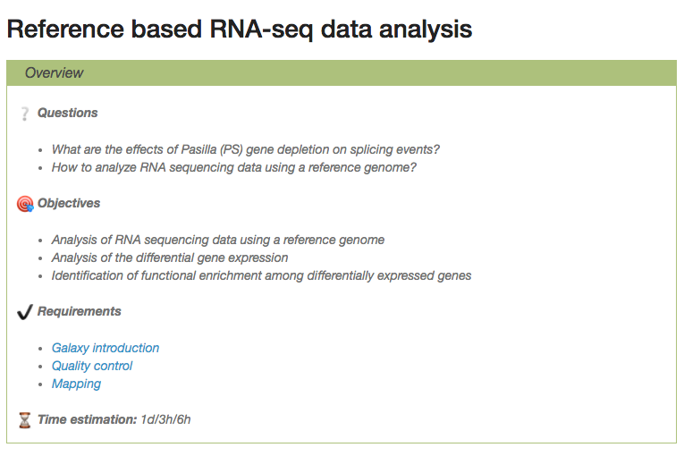

Contributing to Galaxy Training material
===

:+1::tada: First off, thanks for taking the time to contribute! :tada::+1:

The following is a set of guidelines for contributing to this training material on GitHub.

If you have any questions, you can reach us using the [Gitter chat](https://gitter.im/Galaxy-Training-Network/Lobby?utm_source=share-link&utm_medium=link&utm_campaign=share-link).

# Table of contents

- [What should I know before I get started?](#what-should-i-know-before-i-get-started)
- [How can I contribute?](#how-can-i-contribute)
    - [Reporting mistakes or errors](#reporting-mistakes-or-errors)
    - [Your first content contribution](#your-first-content-contribution)
    - [Pull Requests](#pull-requests)
- [How is the training material structured?](#how-is-the-training-material-structured)
    - [`images` directory](#images-directory)
    - [`tutorials` directory](#tutorials-directory)
    - [`slides` directory](#slides-directory)
    - [`docker` directory](#docker-directory)
- [How do I add new content?](#how-do-i-add-new-content)
    - [How do I add a new topic?](#how-do-i-add-a-new-topic)
    - [How do I add a new tutorial?](#how-do-i-add-a-new-tutorial)
    - [How do I fill a tutorial hands-on?](#how-do-i-fill-a-tutorial-hands-on)
    - [How do I fill introduction slides?](#how-do-i-fill-introduction-slides)
    - [How do I fill tutorial slides?](#how-do-i-fill-tutorial-slides)
- [How is the training material maintained?](#how-is-the-training-material-maintained)
    - [Maintainers](#maintainers)
    - [Labels](#labels)

# What should I know before I get started?

This repository is a project of unification of the Galaxy training material. You can find more information about this project in this [small presentation](http://galaxyproject.github.io/training-material/shared/slides/project_presentation#/)

By contributing, you agree that we may redistribute your work under [this repository's license](LICENSE.md).

We will address your issues and/or assess your change proposal as promptly as we can, and help you become a member of our community.

# How can I contribute?

## Reporting mistakes or errors

The easiest way to start contributing is to file an issue to tell us about a spelling mistake or a factual error. You can then introduce yourself and meet some of our community members.

## Your first content contribution

Once you are feeling more comfortable, you can propose changes to this training material.

In [issues](https://github.com/galaxyproject/training-material/issues) and [project management system](https://github.com/galaxyproject/training-material/projects), you will find lists of issues to fix and features to change (with the "newcomer-friendly" label for example). Feel free to solve them.

We strongly recommend you read and follow Software Carpentry's recommendations on [lesson design](https://swcarpentry.github.io/lesson-example/01-design/) and [lesson writing](http://swcarpentry.github.io/instructor-training/19-lessons/) if you plan to add or change some training materials, and also to check the [structure of the training material](#how-the-training-material-is-structured).

## Pull Requests

To manage changes, we use [GitHub flow](https://guides.github.com/introduction/flow/) based on Pull Requests:

1. [Create a fork](https://help.github.com/articles/fork-a-repo/) of this repository on GitHub
2. Clone your fork of this repository to create a local copy on your computer and init needed submodules (`git submodule init` and `git submodule update`)
3. Create a new branch in your local copy for each significant change
4. Commit the changes in that branch
5. Push that branch to your fork on GitHub
6. Submit a pull request from that branch to the [master repository](https://github.com/galaxyproject/training-material)
7. If you receive feedback, make changes in your local clone and push them to your branch on GitHub: the pull request will update automatically

For beginners, the GitHub interface will help you in the process of editing a file. It will automatically create a fork of this repository where you can safely work and then submit the changes as a pull request without having to touch the command line.

# How is the training material structured?

Each training material is related to a topic. All training materials (slides, tutorials, ...) related to a topic are found in a dedicated directory (e.g. `Exome-seq` directory contains the material related to exome sequencing analysis). Each topic have the following structure:

```
├── README.md
├── metadata.yaml
├── images
├── docker
│   ├── Dockerfile
├── slides
│   ├── index.html
├── tutorials
│   ├── tutorial1
│   │   ├── tutorial.md
│   │   ├── slides.html
│   │   ├── metadata.yaml
│   │   ├── tools.yaml
│   │   ├── data-library.yaml
│   │   ├── workflows
│   │   │   ├── workflow.ga
│   │   ├── tours
│   │   │   ├── tour.yaml
```

> Want to add a new topic? Check out [how to add a new topic](#how-do-i-add-a-new-topic).

## `images` directory

The `images` directory collects all images/pictures needed for the training materials related to the topic, *i.e* pictures for the slides or the tutorials.

Images shared between several topics are in the `shared/images` directory at the root.

All images for the slides must be in `images` directory. The images must be in good quality. The sources (`svg` or other) of the images must also be added to the `images` directory. We encourage you to use [yEd](http://www.yworks.com/products/yed) to easily generate diagrams and [Inkscape](https://inkscape.org/en/) for any other images.

## `slides` directory

A slide deck is expected for every topic: the one with a general introduction of the topic. The slides are rendered using `remark.js` but written in Markdown to facilitate collaboration.

> [Check out how to fill introduction slides](#how-do-i-fill-introduction-slides).

## `tutorials` directory

This directory collects the tutorials related to the topic, one per subdirectory. The tutorials are hands-on built for workshop and self-training, with description of the whole infrastructure needed to run the tutorial on any Galaxy instance (tools, data library, etc).

The templates for the tutorials are different from the other pages to help users to focus on the content of the tutorial. To improve the output of the tutorial, several metadata are mandatory for every tutorials, such as the requirements or the objectives of the tutorials. Boxes are also used to highlight some key points as the hands-on or the tips.

The content of each tutorial is generated with [Jekyll](http://jekyllrb.com/) from a Markdown file and some metadata (e.g. the requirements, the Zenodo link, the questions) defined inside the metadata of the related topic.

> Want to contribute to a tutorial?
> - [Check out how to add a new tutorial?](#how-do-i-add-a-new-tutorial)
> - [Check out how to fill a new tutorial?](#how-do-i-fill-a-tutorial-hands-on)

Sometimes, an hands-on tutorial is not the most appropriate format for a tutorial and slides are better. The content must be then added in the `slides` directory.

## `docker` directory

For each topic, a flavored Docker image must integrate the tools needed for
the tutorials. The corresponding image must be based on official Galaxy Docker
images. We recommend to use the content of [`templates/docker`](templates/docker) as a template.

The `docker` image must also integrate a Galaxy tour from the [`galaxy-tours` repository](https://github.com/galaxyproject/galaxy-tours)

# How do I add new content?

Most of the content is written in Markdown with some metadata (or variables) stored in YAML. To generate the website, we are using [Jekyll](http://jekyllrb.com/) and its templating system.

So if you want to visualise locally how the website will look like, you need to run a local Jekyll server. So, Jekyll must be installed using [RubyGems](https://rubygems.org/pages/download):

```
$ make install
```

If you encounter any errors make sure `ruby` and it's corresponding developer packages (e.g. `ruby-dev`, `ruby2.3-dev`) are installed.

If you are installing it on Mac OSX, you need to install it this way as `/usr/bin/` is not writable:

```
sudo gem update —system
sudo gem install -n /usr/local/bin/ gem name
sudo gem install -n /usr/local/bin/ jemoji
sudo gem install -n /usr/local/bin/ jekyll
sudo gem install -n /usr/local/bin/ jekyll-feed
sudo gem install -n /usr/local/bin/ bundler
```

To run a local Jekyll server and visualize the changes, launch using the [Makefile](Makefile):

```
$ make serve
```

You can then visualize locally ([http://localhost:4000/](http://localhost:4000/)) the website before pushing your changes.

## How do I add a new topic?

1. Copy the [`template`](template) directory, rename it and move it to the [`topic`](topic)
2. Fill the meta information about the topic in the `metadata.yaml` file
    - `name`: name of the topic (same name as the `yml` file and the directory)
    - `title`: title of the topic
    - `type`: targeted users (`"use"` or `""`)
    - `summary`: summary of the content of the topic
    - `docker_image`: name of the [Docker image](#docker-directory) with the tools for this topic
    - `requirements`: list of requirements general for this topic, with a `title`, a `link` (relative for internal (inside training material) requirement or full for external requirement) and the type of link (`internal` or `external`)
    - `maintainers`: the two maintainers of the topic with their `name`, `github_username`, `email`
    - `contributors`: list of people who contributed to the topic with `name`, `github_username`, `email`

    This information is used with [Jekyll](http://jekyllrb.com/) to generate the webpage related to the topic

3. Fill the introduction slides

    > Check out [how to fill introduction slides](#how-do-i-fill-introduction-slides)

4. Fill tutorials

    > Check out [how to add a new tutorial](#how-do-i-add-a-new-tutorial)  


## How do I add a new tutorial?

1. Add a new directory in the `tutorials` directory of the topic
2. Add a `metadata.yaml` file and fill it
    - `title`: title of the tutorial
    - `type: "tutorial"`
    - `name`: name of the tutorial (name of the subdirectory where the files related to the tutorial will be stored)
    - `zenodo_link`: link on Zenodo to the input data for the tutorial (not ideal but it can be empty)
    - `galaxy_tour`: name of the galaxy tour
    - `hands_on`(`"yes"` or `"no"`): tell if an hands on is available for this material
    - `slides` (`"yes"` or `"no"`): tell if slides are available for this material
    - `questions`: list of questions that are addressed in the tutorial
    - `objectives`: list of objectives of the tutorial
    - `requirements`: list of requirements specific to this tutorial (in addition to the one of the topic), with a `title`, a `link` (relative for internal (inside training material) requirement or full for external requirement) and the type of link (`internal` or `external`)
    - `time_estimation`: estimation of the time needed to complete the hands-on
    - `key_points`: take home messages

    This information will appear in the top and bottom of the online hands-on generated using [Jekyll](http://jekyllrb.com/)

    

2. Add and fill the `tutorial.md` hands-on

    > Check out [how to fill it](#how-do-i-fill-a-tutorial-hands-on)

3. (Not mandatory) Add and fill the `slides.html`
4. Add and fill the `tools.yaml` file with the neeed tools (from the ToolShed) to run the tutorial
5. Add and fill the `data-library.yaml` file with the input data linked to Zenodo
6. Generate and export a `workflow.ga` file with a workflow generated from the tutorial in the `workflows` directory
7. Add and fill the `tour.yaml` file with a Galaxy Interactive Tour running the tutorial in the `tours` directory
8. (Not mandatory) Add and fill the `data-manager.yaml`

## How do I fill a tutorial hands-on?

1. Check that the metadata about the tutorial in the `metadata.yaml` file are filled and correct

    They are used to automatically generate the header and the footer of the tutorials.

2. Fill the `tutorial.md` with the tutorial

The content of a tutorial hands-on is written in Markdown. They are rendered by [Jekyll](http://jekyllrb.com/) into the webpage for the tutorial.

    The header of the file must be something like:

    ```
    ---
    layout: tutorial_slides
    topic_name: "Dev-Corner"
    tutorial_name: tool_integration
    logo: "GTN"
    ---
    ```

To improve the learning experience, we strongly recommend you to:
- Add boxes to highlight:
    - Hands-on parts

        ```
        > ### :pencil2: Hands-on:
        >
        > 1. **Sort BAM dataset** :wrench:: Sort the paired-end BAM file by "Read names" with **Sort BAM dataset**
        {: .hands_on}
        ```

        

    - Questions (to make the learners think about what they are doing) and the collapsing and expanding answers

        ```
        > ### :question: Questions
        >
        > 1. Why are some tests filtered?
        > 2. Does it improve the *p*-value distribution?
        >
        >    <details>
        >    <summary>Click to view answers</summary>
        >    Content goes here.
        >    </details>
        {: .question}
        ```

        

    - Tips

        ```
        > ### :bulb: Tip: Importing data via links
        >
        > * Copy the link location
        > * Open the Galaxy Upload Manager
        > * Select **Paste/Fetch Data**
        > * Paste the link into the text field
        > * Press **Start**
        {: .tip}
        ```

        

    - Comments

        ```
        > ### :nut_and_bolt: Comments
        > - Edit the "Database/Build" to select "dm3"
        > - Rename the datasets according to the samples
        {: .comment}
        ```

        

    To render the boxes correctly, the previous syntaxes have to be followed. The boxes can be nested, e.g. for having tips inside hands-on.

- Add an agenda at the end of the introduction to indicate the plan of the tutorial

    ```
    > ### Agenda
    >
    > In this tutorial, we will analyze the data with:
    >
    > 1. [Pretreatments](#pretreatments)
    > 2. [Mapping](#mapping)
    > 3. [Analysis of the differential expression](#analysis-of-the-differential-expression)
    > {: .agenda}
    ```

    

- Add pictures of the expected results
- Add at least one scheme or diagram to sum up the pipeline used at the end.

The input data required for the tutorials must be upload on [Zenodo](https://zenodo.org/) to obtain a dedicated DOI (in the [Galaxy training network community](https://zenodo.org/communities/galaxy-training/?page=1&size=20)).

You can also add yourself as contributor for the topic in the `yml` file of the related topic that is in `metadata` directory.

> Sometimes, an hands-on tutorial is not the most appropriate format for a tutorial and slides are better. [Check out how to fill tutorial slides?](#how-do-i-fill-tutorial-slides).

## How do I fill introduction slides?

Before starting filling the slides, you have to add the metadata about the tutorial in `material` section in the `yml` file of the related topic that is in `metadata` directory:

- `title`
- `type: "introduction"`
- `slides` (`"yes"` or `"no"`): tell if slides are available for this material

The introduction slides must be in the `index.html` file in `slides` directory for each topic. Even if the extension is `html`, slides are written in Markdown. `---` is used to separate the slides.

```
---
layout: introduction_slides
topic_name: RNA-Seq
logo: "GTN"
---

# What is RNA sequencing?

---

### Where my data comes from?


<!-- add a resized image in percentage: 10%, 25%, 50%, or 75% -->
.image-25[]

<small>[*Ecker et al, Nature, 2012*](http://www.nature.com/nature/journal/v489/n7414/full/489052a.html)</small>

???

Slide notes
-> Pressing **P** will toggle presenter mode.

---
```

The first slides (with the title, the requirements,...) are automatically generated using the metadata of the topic. Then the content to fill starts with the introduction.

They are then rendered with [`Remark`](https://remarkjs.com/). Template for the `html` files can be found in
[`templates/slides/`](templates/slides/). Once the slides are on the `master` branch, they will be available at `http://galaxyproject.github.io/training-material/<topic>/slides/<slide_name>.html`

You can also add yourself as contributor for the topic in the `yml` file of the related topic that is in `metadata` directory

## How do I fill tutorial slides?

Filling tutorial slides are similar a combination of filling introduction slides and filling an hands-on tutorial:

1. Filling the metadata file with useful information about the tutorial and its format (`slides: "yes"`)
2. Filling an `html` file in the `slides` directory

    The name of the file must be the same as the name of the tutorial

    The header of the file must be something like:

    ```
    ---
    layout: tutorial_slides
    topic_name: "Dev-Corner"
    tutorial_name: tool_integration
    logo: "GTN"
    ---
    ```

    Filling the content is then similar to filling the content of [introduction slides](#how-do-i-fill-introduction-slides). The first slides (with the title, the requirements, the questions, the objectives) are automatically generated using the metadata of the topic and the tutorial.


# How is the training material maintained?

## Maintainers

Each training topic and tutorial has one or two maintainers who act as editors. They are responsible for making sure issues and change requests are looked at. They have the final say over what is included in the training material. But they are not responsible for writing training material content or deciding what lessons ought to exist, both will be coming from the community.

## Labels

This repository is using the following labels for issues, pull requests and project management:

- Type
    - `bug`: errors to be fixed
    - `improvement`: enhancement to an existing functionality
    - `feature`: new functionality
    - `discussion`: discussion threads
    - `question`: often turn into discussion threads
- Status
    - `help-wanted`: requests for assistance
    - `newcomer-friendly`: suitable for people who want to start contributing
    - `work-in-progress`: someone is working on this
    - `review-needed`: requests for review
- Topic: each topic has its own label to easily relate the issue or pull request to the topic, but the label `template-and-tools` is used for questions/issues/pull requests related to the templates and tools rather than the lessons themselves.
