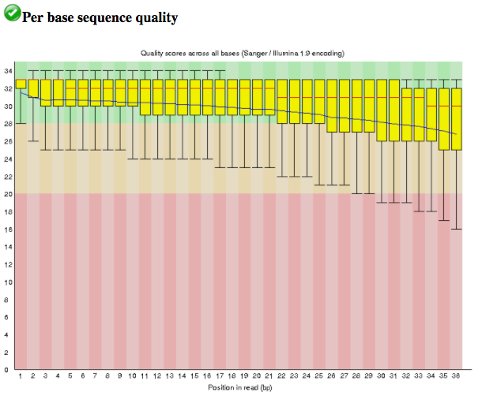
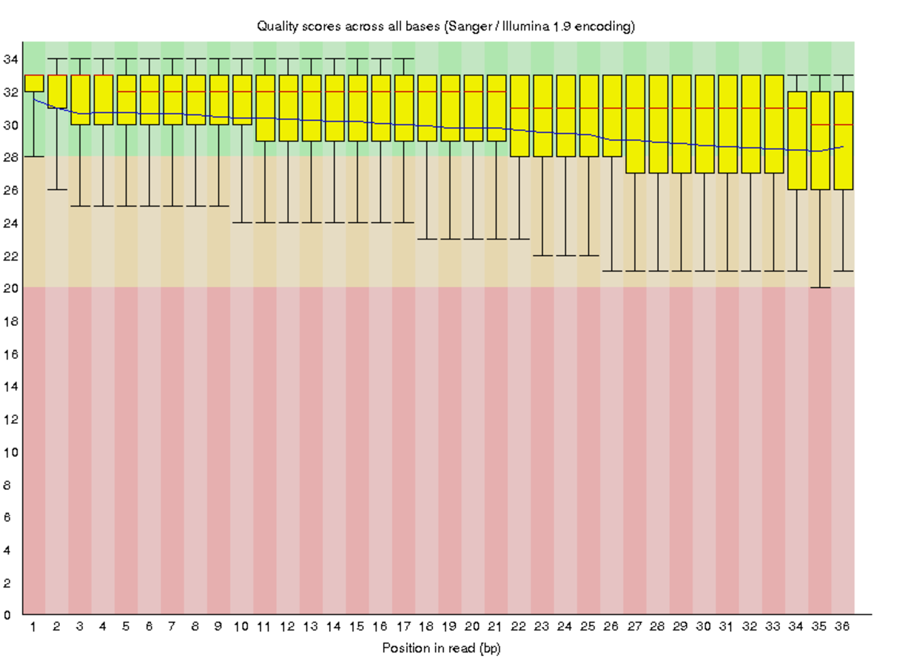
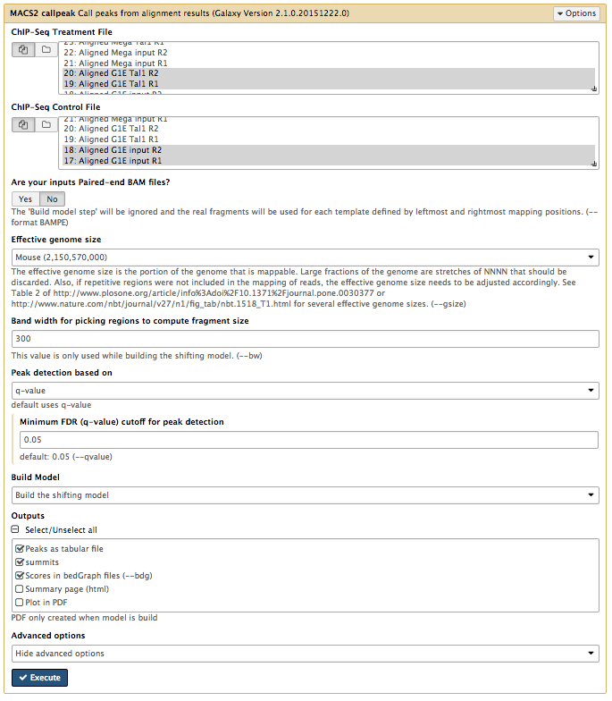
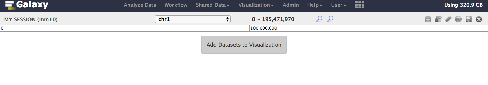
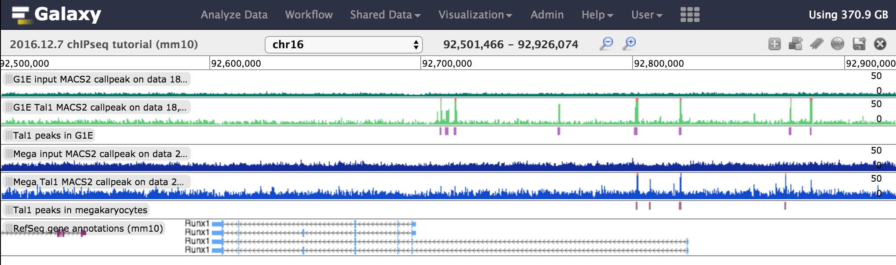

Identification of the binding sites of the T-cell acute lymphocytic leukemia protein 1 (TAL1) with ChIP-sequencing
=============

:grey_question: ***Questions***

- *How is raw chIP-seq data processed and analyzed?*
- *What are the binding sites of Tal1?*
- *Which genes are regulated by Tal1?*

:dart: ***Objectives***

- *Inspect read quality with FastQC*
- *Perform read trimming with Trimmomatic*
- *Align trimmed reads with BWA*
- *Assess quality and reproducibility of experiments*
- *Identify Tal1 binding sites with MACS2*
- *Determine unique/common Tal1 binding sites from G1E and Megakaryocytes*
- *Identify unique/common Tal1 peaks occupying gene promoters*
- *Visually inspect Tal1 peaks with Trackster*

:heavy_check_mark: ***Requirements***

- *Galaxy introduction* (add link)
- *NGS-QC* (add [link](../../NGS-QC/slides/dive_into_qc.md))
- *NGS-mapping* (add [link](../../NGS-mapping/slides/dive_into_mapping.md))
- *Trackster* (add link)

:hourglass: ***Time estimation*** *3h*

# Content

* [Introduction](#introduction)
* [Hands-on example of ChIP-seq analysis](#example)
  - [Step 1: Quality control](#step1)
  - [Step 2: Trimming/clipping reads](#step2)
  - [Step 3: Aligning reads to a genome](#step3)
  - [Step 4: Assessing correlation between samples](#step4)
  - [Step 5: Assessing GC bias](#step5)
  - [Step 6: Assessing IP strength](#step6)
  - [Step 7: Determining Tal1 binding sites](#step7)
  - [Step 8: Inspection of Tal1 peaks](#step8)
  - [Step 9: Identifying unique/common Tal1 peaks](#step9)
  - [Additional optional analyses](#stepA)
* [Concluding remarks](#conclusion)
* [Useful literature](#literature)
  

# Introduction
 
This tutorial uses ChIP-seq datasets from a study published by [Wu et al., 2014](http://genome.cshlp.org/content/24/12/1945.full.pdf+html).
The goal of this study was to investigate "the dynamics of occupancy and the role in gene regulation of the transcription factor Tal1, a critical regulator of hematopoiesis, at multiple stages of hematopoietic differentiation."
To this end, ChIP-seq experiments were performed in multiple mouse cell types including G1E - a GATA-null immortalized cell line derived from targeted disruption of GATA-1 in mouse embryonic stem cells - and megakaryocytes.
This dataset (GEO Accession: [GSE51338](https://www.ncbi.nlm.nih.gov/geo/query/acc.cgi?acc=GSE51338)) consists of biological replicate Tal1 ChIP-seq and input control experiments.
Input control experiments are used to identify and remove sampling bias, for example open/accessible chromatin or GC bias.

Because of the long processing time for the large original files, we have downsampled the original raw data files to include only reads that align to chromosome 19 and a subset of interesting genomic loci pulled from the Wu et al. (2014) publication.

**Table 1**: Metadata for ChIP-seq experiments in this tutorial. SE: single-end.

| Cellular state | Datatype | ChIP Ab | Replicate | SRA Accession | Library type | Read length | Stranded? | DS.3 size (MB) |
|---|---|:-:|:-:|---|:-:|:-:|:-:|---|
| G1E | chIP-seq | input | 1 | SRR507859 | SE | 50 | No | 35.8 |
| G1E | chIP-seq | input | 2 | SRR507860 | SE | 50 | No | 427.1 |
| G1E | chIP-seq | Tal1 | 1 | SRR492444 | SE | 50 | No | 32.3 |
| G1E | chIP-seq | Tal1 | 2 | SRR492445 | SE | 50 | No | 62.7 |
| Megakaryocyte | chIP-seq | input | 1	| SRR492453 | SE | 50 | No | 57.2 |
| Megakaryocyte | chIP-seq | input | 2 | SRR492454 | SE | 50 | No | 403.8 |
| Megakaryocyte | chIP-seq | Tal1 | 1 | SRR549006 | SE | 50 | No | 340.3 |
| Megakaryocyte | chIP-seq | Tal1 | 2 | SRR549007 | SE | 50 | No | 356.9 |

# Analysis

### Step 1: Quality control

As for any NGS data analysis, ChIP-seq data must be quality controlled before being aligned to a reference genome.

:pencil2: ***Hands on!***

1. Create and name a new history for this tutorial.

2. Import the ChIP-seq raw data (\*.fastqsanger) from [Zenodo](link). (**NEED TO MAKE THIS LINK/GET A DOI**)

    - In Zenodo: Right-click a FASTQ filename → Copy Link Address
    - In Galaxy: Get Data → Upload File from your computer → Paste/Fetch data
    - Paste the copied link into the dialog box and set the datatype to 'fastqsanger'
    - Click Start
    - Repeat for all FASTQ files

       
    <figcaption><b>Figure X:</b> Data can be imported directly with links.</figcaption>
    
    
       
    <figcaption><b>Figure X:</b> Imported datasets will appear in the history panel.</figcaption>
    
    
3. In Galaxy, examine the data in a FASTQ file by clicking on the eye icon.

    | :grey_question: Questions |
    |:---|
    | <ul><li>What are four key features of a FASTQ file?</li><li>What is the main difference between a FASTQ and a FASTA file?</li></ul> |
    
4. Run the tool `FastQC` on each FASTQ file to assess the quality of the raw data. An explanation of the results can be found on the [FastQC web page](http://www.bioinformatics.babraham.ac.uk/projects/fastqc/).

    **Hint**: You can run this tool - and many other tools - on all the FASTQ files at once! To do this, first select the "Multiple datasets" icon (two stacked pages) under the "Input FASTQ file" heading in the `FASTQC` Tool Form, then shift+click to select multiple FASTQ files.

       
    <figcaption><b>Figure X:</b> Sequence quality per base generated by FastQC <b>before</b> end trimming.</figcaption>
    
    | :grey_question: Questions |
    |:---|
    | <ul><li>What does the y-axis represent in Figure X?</li><li>Why is the quality score decreasing across the length of the reads?</li></ul> |

### Step 2: Trimming and clipping reads

It is often necessary to trim a sequenced read to remove bases sequenced with high uncertainty (*i.e.* low-quality bases). In addition, artificial adaptor sequences used in library preparation protocols need to be removed before attempting to align the reads to a reference genome. More explanation of quality trimming can be found in the [NGS-QC tutorial](./../NGS-QC/tutorials/dive_into_qc.md).

:pencil2: ***Hands on!***

1. Run the tool `Trimmomatic` on each FASTQ file to trim low-quality bases (remember how to run tools on all files at once?). Explore the full parameter list for `Trimmomatic` in the Tool Form and set the following `Trimmomatic` parameters:

    - **Paired end data?**: No
    - **Perform initial ILLUMINACLIP?**: No
    - **Select Trimmomatic operation to perform**: Sliding window trimming (SLIDINGWINDOW)
    - **Number of bases to average across**: 4
    - **Average quality required**: 20
    
    **Hint**: If the FASTQ files cannot be selected, check whether their format is FASTQ with Sanger-scaled quality values (*fastqsanger*). If not, you can edit the data type by clicking on the pencil symbol next to a file in the history, clicking the 'Datatype' tab, and choosing *fastqsanger* as the 'New Type'.

2. Rerun the tool `FastQC` on each trimmed/clipped FASTQ file to determine whether low-quality and adaptor sequences were correctly removed.

    | :grey_question: Questions |
    |:---|
    | <ul><li>How did the range of read lengths change after trimming/clipping?</li><li>What do you think could account for the enriched k-mers (**Kmer Content** heading in `FASTQC` output) observed in the Megakaryocytes Tal1 R2 ChIP-seq experiment?</li></ul> |
    

       
    <figcaption><b>Figure X:</b> Sequence quality per base generated by FastQC <b>after</b> end trimming.</figcaption>
    
    

### Step 3: Aligning reads to a reference genome

To determine where DNA fragments originated from in the genome, the sequenced reads must be aligned to a reference genome. This is equivalent to solving a jigsaw puzzle, but unfortunately, not all pieces are unique. In principle, you could do a BLAST analysis to figure out where the sequenced pieces fit best in the known genome. Aligning millions of short sequences this way, however, can take a couple of weeks.
Nowadays, there are many read alignment programs for sequenced DNA, `BWA` being one of them. You can read more about the BWA algorithm and tool [here](https://academic.oup.com/bioinformatics/article-lookup/doi/10.1093/bioinformatics/btp324).

:pencil2: ***Hands on!***

1. Run the tool `Map with BWA` to map the trimmed/clipped reads to the mouse genome. Set the following `Map with BWA` parameters:

    - **Using reference genome**: Mouse (mus musculus) mm10
    - **Single or Paired-end reads**: Single

       
    <figcaption><b>Figure X:</b> Select the trimmed read files to be aligned.</figcaption>
    
    
2. After `BWA` finishes, rename your files to reflect the origin and contents. Then, click on a file produced by running `BWA`.

    | :grey_question: Questions |
    |:---|
    | <ul><li>What datatype is the `BWA` output file?</li><li>How many reads were mapped from each file?</li></ul> |

3. Run the tool `IdxStats` and look at the output (poke it in the eye!).

    | :grey_question: Questions |
    |:---|
    | <ul><li>What does each column in the output represent (hint: look at the Tool Form)?</li><li>How many reads were mapped to chromosome 19 in each experiment?</li><li>If humans have 23 chromosomes, what are all the other reference chromosomes (e.g. what is chr1_GL456210_random)?</li></ul> |

### Step 4: Assessing correlation between samples

To assess the similarity between the replicates sequencing datasets, it is a common technique to calculate the correlation of read counts for the different samples.
We expect that the replicates of the ChIP-seq experiments should be clustered more closely to each other than the replicates of the input samples.
We will be use tools from the package `deepTools` for the next few steps. More information on `deepTools` can be found [here](http://deeptools.readthedocs.io/en/latest/content/list_of_tools.html).

1. Run the tool `multiBamSummary` from the `deepTools` package. This tool splits the reference genome into bins of equal size and counts the number of reads in each bin from each sample. Set the following `multiBamSummary` parameters:

    - Select all of the aligned BAM files
    - **Bin size in bp**: 10000

2. Run the tool `plotCorrelation` from the `deepTools` package to visualize the results from the previous step. Feel free to try different parameters. To start, set the following `plotCorrelation` parameters:

    - **Correlation method**: Spearman
    - **Plotting type**: Heatmap
    - **Plot the correlation value**: Yes
    - **Skip zeros**: Yes

| :grey_question: Questions |
|:---|
| <ul><li>Why do we want to skip zeros in `plotCorrelation`?</li><li>What happens if the Pearson correlation method is used instead of the Spearman method?</li></ul> |

For additional informaton on how to interpret the resulting plots, read the information [here](http://deeptools.readthedocs.io/en/latest/content/tools/plotCorrelation.html#background)

### Step 5: Assessing GC bias

A common problem of PCR-based protocols is the observation that GC-rich regions tend to be amplified more readily than GC-poor regions.
We will now check whether the samples have more reads from regions of the genome with high GC.
 
1. Run the tool `computeGCbias` from the `deepTools` package.

    - First, select an aligned BAM files for an input dataset
    - **Reference genome**: locally cached
    - **Using reference genome**: mm10
    - **Effective genome size**: user specified
    - **Effective genome size**: 10000000
    - **Fragment length used for the sequencing**: 50
    
      | :grey_question: Questions |
      |:---|
      | <ul><li>Why would we worry more about checking for GC bias in an input file?</li><li>Does this dataset have a GC bias?</li></ul> |

2. Explore the tool `correctGCbias` from the `deepTools` package.

    | :grey_question: Questions |
    |:---|
    | <ul><li>What does this tool do?</li><li>What is the output of this tool?</li><li>What are some caveats to be aware of if using the output of this tool in downstream analyses?</li></ul> |

For additional informaton on how to interpret the resulting plots, read the information [here](http://deeptools.readthedocs.io/en/latest/content/tools/computeGCBias.html#background)

### Step 6: Assessing IP strength

We will now evaluate the quality of the immuno-precipitation step in the ChIP-seq protocol.

1. Run the tool `plotFingerprint` from the `deepTools` package.

    - Select all of the aligned BAM files
    - **Show advanced options**: yes
    - **Bin size in bases**: 50
    - **Skip zeros**: Yes

2. View the output image.

    | :grey_question: Questions |
    |:---|
    | <ul><li>What does this graph represent?</li><li>How do input datasets differ from IP datasets?</li><li>What do you think about the quality of the IP for this experiment?</li></ul> |
    
For additional informaton on how to interpret the resulting plots, read the information [here](http://deeptools.readthedocs.io/en/latest/content/tools/plotFingerprint.html#background)

### Step 7: Determining Tal1 binding sites 

Now that `BWA` has aligned the reads to the genome, we will use the tool `MACS2` to identify regions of Tal1 occupancy, which are called "peaks". Peaks are determined from pileups of sequenced reads across the genome that correspond to where Tal1 binds.
`MACS2` will perform two tasks: 1) identify regions of Tal1 occupancy (peaks) and 2) generate bedgraph files for visual inspection of the data on a genome browser. More information about `MACS2` can be found [here](http://genomebiology.biomedcentral.com/articles/10.1186/gb-2008-9-9-r137).

:pencil2: ***Hands on!***

1. Run the tool `MACS2 callpeak` with the aligned read files from the previous step as Treatment (Tal1) and Control (input). 

    - Select replicate **ChIP-Seq Treatment Files** for one cell type
    - Select replicate **ChIP-Seq Control Files** for the same cell type

     
    <figcaption><b>Figure X:</b> Select the appropriate control and treatment files.</figcaption>
    
2. After `MACS2 callpeak` finishes, rename your files to reflect the origin and contents.

### Step 8: Inspection of peaks and aligned data

It is critical to visualize your NGS data on a genome browser after alignemnt. Evaluation criteria will differ for the various NGS experiment types, but for chIP-seq data we want to ensure reads from a Treatment sample are enriched at "peaks" and do not localize non-specifically (like the Control condition).
`MACS2` generated a bedgraph and a BED file that we'll use to visualize read abundance and peaks, respectively, at regions `MACS2` determined to be Tal1 peaks using Galaxy's in-house genome browser, Trackster. We'll first need to tidy up the peak file before we send it to Trackster. We'll also import a gene annotation file so we can visualize aligned reads and Tal1 peaks relative to gene features and positions.

:pencil2: ***Hands on!***

1. Run the tool `Cut` on the peak file choosing columns 'c1,c2,c3,c4' and rename this file to reflect the origin and contents. 

2. Import the gene annotations file from [Zenodo](link) (COMPLETE THIS MO!!!!)

3. Click 'Visualizations' on the page header and select 'New Track Browser'.

       
    <figcaption><b>Figure X:</b> Trackster can be accessed from the Visualizations button at the top of the screen.</figcaption>
    

4. Give this session a descriptive name and choose 'mm10' as the 'Reference genome build (dbkey)'.  
    
       
    <figcaption><b>Figure X:</b> Session name and assigning reference genome.</figcaption>

5. Click 'Add Datasets to visualization' and select the history containing the data from this analysis. Select the bedgraph files and the peak files that you renamed.

       
    <figcaption><b>Figure X:</b> Load your data into Trackster with the 'Add Datasets to visualization' feature. </figcaption>

        
    <figcaption><b>Figure X:</b> Select data from your histories to view in Trackster. </figcaption>

6. Navigate to the Runx1 locus (chr16:92501466-92926074) to inspect the aligned reads and Tal1 peak calls. 

    | :grey_question: Questions |
    |:---|
    | <ul><li>What do you see?</li><li>What gene(s) other than Runx1 could be regulated by Tal1?</li></ul> |
    

       
    <figcaption><b>Figure X:</b> The Runx1 locus.</figcaption>

### Step 9: Identifying unique and common Tal1 peaks between the G1E and megakaryocyte states

We've just processed ChIP-seq data from two stages of hematopoiesis and have lists of Tal1 occupied sites (peaks) in both cellular states. Now let's identify Tal1 peaks that are shared between the two cellular states and also those that are specific to one cellular state.

:pencil2: ***Hands on!***

1. Run the tool `bedIntersect` to find peaks that exist both in G1E and megakaryocytes. 

  - Select the "Tal1 G1E peaks" and "Tal1 Mega peaks" files as the inputs. Running this tool with the default settings will return overlapping peaks of both files. 
  
2. Run the tool `bedIntersect` to find peaks that exist only in G1E.

  - Select "Tal1 G1E peaks" as the first input and "Tal1 Mega peaks" as the second input file.
  - **Report only those alignments that \*\*do not\*\* overlap the BED file**: Yes
  
3. Run the tool `bedIntersect` to find peaks that exist only in megakaryocytes.

  - Select "Tal1 Mega peaks" as the first input and "Tal1 G1E peaks" as the second input file.
  - **Report only those alignments that \*\*do not\*\* overlap the BED file**: Yes  
  
4. Re-name the three files we generated to reflect their contents. 

    | :grey_question: Questions |
    |:---|
    | <ul><li>How many Tal1 binding sites are common to both G1E cells and megakaryocytes?</li><li>How many are unique to G1E cells?</li><li>How many are unique to megakaryocytes?</li></ul> |

# OPTIONAL ADDITIONAL ANALYSES

### Additional analyses in progress

# Conclusion

In this exercise you imported raw Illumina sequencing data, evaluated the quality before and after you trimmed reads with low confidence scores, algined the trimmed reads, identified Tal1 peaks relative to the negative control (background), and visualized the aligned reads and Tal1 peaks relative to gene structures and positions. Additional, you assessed the "goodness" of the experiments by looking at metrics such as GC bias and IP enrichment. 

:grey_exclamation: ***Key Points***

- *Sophisticated analysis of ChIP-seq data is possible using tools hosted by Galaxy.*
- *Genomic dataset analyses require multiple methods of quality assessment to ensure that the data are appropriate for answering the biology question of interest.*
- *By using the sharable and transparent Galaxy platform, data analyses can easily be shared and reproduced.*

## :clap: Congratulations on successfully completing this tutorial!

# Useful literature

### ChIP-seq

**Carroll et al. (2014):**  [Impact of artifact removal on ChIP quality metrics in ChIP-seq and ChIP-exo data](http://journal.frontiersin.org/article/10.3389/fgene.2014.00075/full),(doi:10.3389/fgene.2014.00075)  

**Landt et al. (2012):** [ChIP-seq guidelines and practices of the ENCODE and modENCODE consortia](http://genome.cshlp.org/content/22/9/1813.long), (doi:10.1101/gr.136184.111) - This is a very useful "encyclopedic" paper with many details about the tools the (mod)ENCODE consortia use. It also contains a long section about antibody validation etc.. It does not explain much of the reasoning behind the bioinformatics tools, though.

**Zentner and Henikoff (2012):** [Surveying the epigenomic landscape, one base at a time](http://genomebiology.biomedcentral.com/articles/10.1186/gb-2012-13-10-250), (doi:10.1186/gb-2012-13-10-250) - Overview of popular *-seq techniques; very nice description of DNase-seq, MNase-seq, FAIRE-seq etc.

**Kidder et al. (2011):** [Technical considerations to obtaining high-quality data](http://www.nature.com/ni/journal/v12/n10/abs/ni.2117.html), (doi:10.1038/ni.2117) - Nice, readable introduction into all aspects of ChIP-seq experiments (from antibodies to cell numbers to replicates to data analysis)

**Leleu et al. (2010):** [Processing and analyzing ChIP-seq data](http://www.ncbi.nlm.nih.gov/pubmed/20861161), (doi: 10.1093/bfgp/elq022) - Fairly detailed review of key concepts of ChIP-seq data processing (less detailed on analysis)

**Peter Park (2009):** [ChIP-seq: Advantages and challenges of a maturing technology](http://www.nature.com/nrg/journal/v10/n10/full/nrg2641.html), (doi:10.1038/nrg2641)

**Kharchenko et al. (2008):** [Design and analysis of ChIP-seq experiments for DNA-binding proteins](http://www.ncbi.nlm.nih.gov/pubmed/19029915), (doi:10.1038/nbt.1508)

**Liu et al. (2010):** [Q&A: ChIP-seq technologies and the study of gene regulation](http://bmcbiol.biomedcentral.com/articles/10.1186/1741-7007-8-56), (doi:10.1186/1741-7007-8-56) - Short overview of several (typical) issues of ChIP-seq analysis

### ChIP-seq peak calling - general

**Micsinai et al. (2012):** [Picking ChIP-seq peak detectors for analyzing chromatin modification experiments](http://www.ncbi.nlm.nih.gov/pubmed/22307239), (doi: 10.1093/nar/gks048) - How to choose the best peak caller for your data set - their finding: default parameters, surprisingly, yield the most reproducible results regardless of the data set type

**Wilbanks et al. (2010):** [Evaluation of Algorithm Performance in ChIP-Seq Peak Detection](http://www.ncbi.nlm.nih.gov/pubmed/20628599), (doi: 10.1371/journal.pone.0011471) - Another comparison of peak callers - focuses more on the evaluation of the peak callers performances than Pepke et al. (2009)

**Pepke et al. (2009):** [Computation for ChIP-seq and RNA-seq studies](http://www.ncbi.nlm.nih.gov/pubmed/19844228), (doi: 10.1038/nmeth.1371) - First comparison of peak callers, focuses on the explanation of basic principles of ChIP-seq data processing and general workflows of peak calling algorithms

### ChIP-seq peak calling - MACS

**Fen et al. (2012):** [Identifying ChIP-seq enrichment using MACS.](http://www.ncbi.nlm.nih.gov/pubmed/22936215), (doi:10.1038/nprot.2012.101) - How to use MACS - Nature Protocols

**Zhang et al. (2008):** [Model-based Analysis of ChIP-Seq (MACS)](http://genomebiology.biomedcentral.com/articles/10.1186/gb-2008-9-9-r137), (doi:10.1186/gb-2008-9-9-r137) - The original publication of MACS

### DNA motif analysis

**Das et al. (2007):** [A survey of DNA motif finding algorithms](http://bmcbioinformatics.biomedcentral.com/articles/10.1186/1471-2105-8-S7-S21), (doi:10.1186/1471-2105-8-S7-S21) - Review of motif analysis tools

### MEME suite

**Bailey and Machanick (2012):** [Inferring direct DNA binding from ChIP-seq](http://www.ncbi.nlm.nih.gov/pubmed/22610855), (doi:10.1093/nar/gks433) - Centrimo: position-specific motif analysis, especially useful for ChIP-seq data

**Machanick and Bailey (2011):** [MEME-ChIP: motif analysis of large DNA datasets](http://www.ncbi.nlm.nih.gov/pubmed/21486936), (doi: 10.1093/bioinformatics/btr189) - MEME-ChIP-paper

[TomTom](http://meme-suite.org/tools/tomtom) - Meme Suite Motif comparison tool: tool for the comparison of motifs from databases (not in Galaxy yet): [Manual](http://meme-suite.org/doc/tomtom.html?man_type=web)
