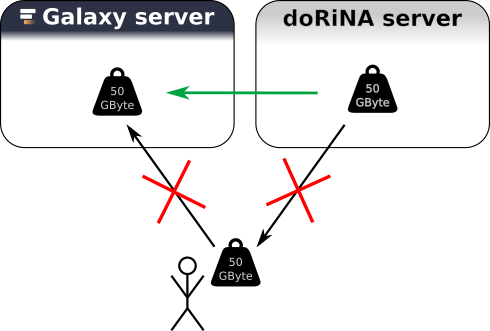

Data Source Integration
=======================

:grey_question: ***Questions***

- *Major question that would be addressed in this tutorial (mostly general biological questions)*
- *Second question*
- *Third question*
- *...*

:dart: ***Objectives***

- *First objective of this tutorial (It is a single sentence describing what a learner will be able to do once they have sat through the lesson. The objectives must be technical, but also theoretical, objectives. You can check [SWC lessons](http://swcarpentry.github.io/instructor-training/19-lessons/) to help you writing learning objectives.)*
- *Second objective*
- *Third objective*
- *...*

:heavy_check_mark: ***Requirements***

- *Galaxy introduction*
- *Second requirement*
- *Third requirement*
- *...*

:hourglass: ***Time estimation*** *1d/3h/6h*

# Data Source Integration

An important goal of Galaxy is scalability. A major bottleneck when it comes to analysis of big data sets is the time and space it takes of copying these data sets.

Galaxy provides an interface such that it can communicate with other servers to get data directly into the Galaxy environment of a user without the need of "downloading" the data. We (have used/will use) the UCSC table browser in this course, and in this hands on, we will use the resource from [DoRiNA Server](http://dorina.mdc-berlin.de/) [(Blin et al. 2014, Nucleic Acids Research.)](http://www.ncbi.nlm.nih.gov/pubmed/25416797),
but the main point about this short section is:
if you have a data source which you think is very important for your research with Galaxy let us know!

:pencil2: ***Hands on!***

1. Create a new history called "doRiNA"
2. Go to Get Data::doRiNA search
3. Choose hg19 from the drop-down list -> Search Database
4. Leave everything as is and choose from the Regulators (set A) drop-down list "hsa-let-7astar-CLASH" -> Search doRiNA
5. Use the "Send to Galaxy" button
6. Notice the new History Item

That was very easy for all of you! If you want your database of choice to be accessible as easy as this **let us know**!

:grey_exclamation: ***Key Points***

- *Simple sentence to sum up the first key point of the tutorial (Take home message)*
- *Second key point*
- *Third key point*
- *...*

# :clap: Thank you
