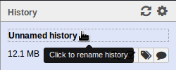
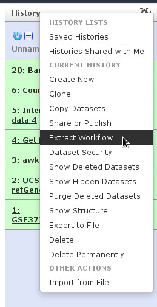

# Galaxy Introduction Exercise: From Peaks to Genes

## Introduction

Slides as PDF: [Introduction_to_Galaxy_Uni.pdf](../slides/Introduction_to_Galaxy_Uni.pdf) & [Manke_2015.09.21a.pdf](../slides/Manke_2015.09.21a.pdf)

## Scenario
We stumbled upon a paper [Li et al., Cell Stem Cell 2012](http://www.sciencedirect.com/science/article/pii/S1934590912003347) that contains the analysis of possible target genes of an interesting protein. The targets were obtained by ChIP-seq and the raw data is available through [GEO](http://www.ncbi.nlm.nih.gov/geo/query/acc.cgi?acc=GSE37268). The list of genes however is neither in the supplement of the paper nor part of the GEO submission. The closest thing we can find is a list of the regions where the signal is significantly enriched (peaks; you'll learn more on that tomorrow). The goal of this exercise is to __turn this list of genomic regions into a list of possible target genes__.

## Part 1: Naive approach

**Step 1: Upload peaks**

Download the list of peaks (the file `GSE37268_mof3.out.hpeak.txt.gz`) from GEO [click here to get to the GEO entry](http://www.ncbi.nlm.nih.gov/geo/query/acc.cgi?acc=GSE37268) to your computer. Use the [upload button](../images/upload_button.png) to upload the file to Galaxy and select "mm9" as the genome. Galaxy will automatically unpack the file.

Galaxy Dataset | [GSE37268_mof3.out.hpeak.txt](../input_data/Galaxy1-GSE37268_mof3.out.hpeak.txt)

This file is not in any standard format and just by looking at it, we cannot find out what the numbers in the different columns mean. In the paper the authors mention that they used the peak caller [HPeak](http://www.sph.umich.edu/csg/qin/HPeak/Readme.html). By looking at the HPeak manual we can find out that the columns contain the following information:

- chromosome name*
- start coordinate
- end coordinate
- length
- location within the peak that has the highest hypothetical DNA fragment coverage (summit)
- not relevant
- not relevant

(\*Note that the first column only contains the chromosome number, and X and Y are replaced by 20 and 21 for easier numerical manipulations.)

**Step 2: Get genes from UCSC**

We also need a list of genes in mouse, which we can obtain from UCSC. Galaxy has the UCSC table browser integrated as a tool, so we don't need to download the data to our computers.

***Tool***: Get Data -> UCSC main table browser
- Select clade "Mammal", genome "Mouse", assembly "mm9"
- Select group "Genes and Gene Prediction Tracks", track "RefSeq Genes"
- Select table "refGene"
- Select region "genome"
- Select output format "BED"
- Click button "get output"
- Click button "Send query to Galaxy"

Galaxy Dataset | [UCSC Main on Mouse: refGene (genome)](../input_data/Galaxy2-UCSC_Main_on_Mouse__refGene_genome.bed)

**Step 3: Adjust chromosome naming**

Have a look at both input files (either in the little preview window in the history or click on the eye icon to see one in the main frame) and find out what are the differences in the chromosome naming.
Apply the following workflow to GSE37268_mof3.out.hpeak.txt: [Workflow 'Add "chr" at beginning of each line'](http://galaxy.uni-freiburg.de/u/tutor/w/add-chr-at-beginning-of-line-imported-from-uploaded-file).
After importing you can in the future use it by scrolling to the bottom of the tool panel, click on "All workflows" and then on the workflow name.

From carefully reading the HPeak manual, we should remember that it puts "20" and "21" instead of "X" and "Y". So now the chromosome names all start properly with "chr", but we still have "chr20" and "chr21" instead of "chrX" and "chrY".

***Tool***: Text Manipulation -> Replace text
- Input: result of workflow (awk on data X)
- Find pattern: chr20
- Replace with: chrX
- Check "find whole words"
- Replace text in: specific column, in column c1
- Do the same for "chr21" and "chrY", make sure you use the result of the first replacement as input (use rerun button and change input and search/replace)
- Make sure the format of the output file is "interval", otherwise change it by clicking the pencil icon (do not convert to new format, but change data type).

**Step 4: Visualize peaks**

***Genomic Intervals to BED***:

To visualize the peaks it's best to convert them to BED format first, because most viewers cannot deal with interval (because interval format just exists in Galaxy).

- Click on the pencil icon of the latest dataset
- Under the header "Convert to new format" select "Convert Genomic Intervals to BED"
- Click "Convert"
- Look at the new dataset. Some columns with generic names have been added and others were removed to comply to BED format rules.
- This generated a new dataset in BED format which we'll use for visualization. We will however continue to work with the interval dataset.

***Display in UCSC browser***:

- Expand dataset in history panel
- Click on "display at UCSC main"

***Display in IGV***:

- Go to the [IGV website](http://www.broadinstitute.org/software/igv/download)
- Register or log-in to get access to the download area
- Click on any of the "Launch" buttons (the more data you want to visualize, the bigger the GBs should be; here 750 MB should be enough)
- Inside IGV select "Mouse mm9" in the upper left drop-down box
- Go back to Galaxy
- Click on the link "local" after "display with IGV" (expanded history view of BED dataset)
- Go back to IGV, which should now have a track named "galaxy_xxxx.bed"

The way presented here adds a new track to a running instance of IGV and thus keeps all other tracks which you may have visualized. However, you can also launch IGV directly from within Galaxy by selecting "web current" instead of "local", but then each time a new instance of IGV is started (and this way it's not possible to view several tracks from Galaxy side-by-side).

***Optional: Display in Galaxy's build-in browser Trackster***:

- Click on Visualization icon
- Click on "Trackster"
- Type in a name and select "mm9" as reference genome
- Click "Create"
- Wait until data preparation is finished
- Select a chromsome to look at
- Unfortunately Trackster doesn't already include gene tracks or other annotations, so we add our RefSeq genes as an additional track.

- Click on "Add tracks" icon (little plus in the upper right)
- Check your RefSeq genes dataset
- Click "Insert" at the bottom (you may have to scroll down)
- Wait for data preparation to finish
- Save the visualization by clicking on the disk icon next to the plus icon
- Unlike the UCSC browser, Trackster will remember the whole visualization including the chromosome location you looked at when you save it. You can go back any time by selecting "Visualization" in the top menu.

**Step 5: Add promoter region to gene records**
***Tool***: Text Manipulation -> Get flanks
- Input dataset: RefSeq genes from UCSC (UCSC Main on Mouse: refGene (genome))
- Options: Region: "Around Start", Location: "Upstream",  Offset: 10000, Length: 12000

Inspect the resulting BED file and through comparing with the input find out what this operation actually did. Just look at the contents and compare the rows in the input to the rows in the output to find out how the start and end positions changed. Rename the dataset (by clicking on the pencil icon) to reflect your findings.

**Step 6: Find overlaps**
***Tool***: Text Manipulation -> Intersect
- Return: Overlapping Intervals of: result of step 5 (Get flanks on data X)
that intersect: result of step 3 (second Find and Replace)

The order of the inputs is important! We want to end up with a list of genes, so the corresponding dataset needs to be the first input.

**Step 7: Count genes on different chromosomes**

To get a better overview of the genes we obtained, we want to look at their distribution across the different chromosomes.

***Tool***: Statistics -> Count occurrences of each record
- Input: result from step 6 (Intersect on data X and data X)
- Select column 1 (c1) with the chromosome names

Here you can double-check if the previous steps were correct by comparing the numbers.

Galaxy Dataset | [Count genes on different chromosomes](../input_data/Galaxy9-Count_genes_on_different_chromosomes.tabular)
Result of part 1, step 7

**Step 8: Draw barchart**
***Tool***: Bar chart (use tool search to find it)
- Input: result of step 7
- Use X Tick labels: Yes, column 2
- Numerical column: c1
- Plot title is up to you
- Label for Y axis: number of genes

Galaxy has a second option to visualise tabular data, with built-in dynamic visualisations:

- Expand the dataset view and click on the visualization icon (see step 4, same button as Trackster)
- Choose "Charts"
- Enter a chart title, e.g. "Genes on different chromsomes"
- Select "Bar diagrams" -> "Regular"
- On the top, click on "Add Data"
- Enter a label, e.g. "count"
- Values for x-axis: Column: 2 [str]
- Values for y-axis: Column: 1 [int]
- On the very top, click "Draw"
- [Visualization 'Genes on different chromosomes'](http://galaxy.uni-freiburg.de/u/tutor/v/genes-on-different-chromosomes)

**Step 9: Name  your history**

In the history column click on "Unnamed history" at the top to rename it.

**Step 10: Make a workflow out of steps 6 to 8**
- Click on the history options and select "Extract workflow"

 

- Do **not** include "awk",  either "Find and Replace", "Convert Genomic Intervals to strict BED" and "Get flanks"
- Click "Create Workflow"

To make sure our workflow is correct we look at it in the editor and make some small adjustments.

Top menu: Workflow
- Click on the name of your new workflow and select "Edit"

The individual steps are displayed as boxes and their outputs and inputs are connected through lines. When you click on a box you see the tool options on the right. Besides the tools you should see two additional boxes titled "Input dataset". These represent the data we want to feed into our workflow. Although we have our two inputs in the workflow they are missing their connection to the first tool (Intersect), because we didn't carry over the intermediate steps. Connect each input dataset to the Intersect tool by dragging the arrow pointing outwards on the right of its box (which denotes an output) to an arrow on the left of the Intersect box pointing inwards (which denotes an input). Connect each input dataset with a different input of Intersect.

You should also change the names of the input datasets to remember that the first one contains genes and the second one peaks. Don't forget to save it in the end by clicking on "Options" (top right) and selecting "Save".

**Step 11: Share workflow**
Share your new workflow with the person to your left.

Top menu: Workflow
- Click on your workflow's name and select "Share or publish"
- Click "Share with a user"
- Enter the email address of the person to your left (the same as he/she uses to login to Galaxy)
- Hit "Share"
- Wait for the person on your right to do the same
- Reload the workflows by clicking again on "Workflow" in the top menu
- Under the header "Workflows shared with you by others" you should now see your right neighbor's workflow
- Click on its name and select "View"
- Compare with your workflow

## Part 2: More sophisticated approach

**Step 12: Create new history**
- History options: Create New
- Rename new history

**Step 13: Copy over peak file to new history**

History options: Saved Histories
- Click on name of old history to reactivate it
History options: Copy Datasets
- Select result of step 3 (result of second Find and Replace)
- Select new history as destination
- Click "Copy History Items"
- In the green bar appearing on the top, click on the name of the new history to go back to it

**Step 14: Make peak summit file**

In part 1 we used an overlap definition of 1 bp (default setting). In order to get a more meaningful definition, we now want to use the information of the position of the peak summit and check for overlap of the summits with genes. So we need to generate a new BED file from the original peak file that contains the positions of the peak summits. The start of the summit is the start of the peak (column 2) plus the location within the peak that has the highest hypothetical DNA fragment coverage (column 5) and as the end we simply define start + 1.

We use the tool "Compute an expression on every row" twice to add two rows to the peak file containing start and end of the summit.

***Tool***: Compute an expression on every row
- Expression: c2+c5, as a new column to peak file, round: yes
- Expression: c8+1, as a new column to result of previous execution of compute tool, round: yes

Then we cut out just the chromosome and start, end of the summit.

***Tool***: Cut columns from a table
- Columns: c1,c8,c9
- Change the format of the output file to "interval" by clicking the pencil icon, selecting "interval" as new type and clicking "Save" (do not convert to new format, but change data type). Consider renaming this dataset to remember that it contains the peak summits.

**Step 15: Get new gene file from Data Library**

The RefSeq genes we downloaded from UCSC did only contain the RefSeq identifiers, but not the gene names. To get a list of gene names in the end, we use another BED file from the Data Libraries*.

Top menu: Shared Data -> Data Libraries
- Click on library "Genomes + Annotations"
- Expand folder "Annotations"
- Check the dataset "mm9.RefSeq_genes_from_UCSC"
- Select "Import to current history" on the bottom
- Hit "Go"

(* There are several ways to get the gene names in, if you need to do it yourself. On way is to retrieve a mapping through Biomart and then join the two files (tool: Join, Substract and Group -> Join two Datasets side by side on a specified field). Another to get the full RefSeq table from UCSC and manually convert it to BED format.)

**Step 16: Repeat workflow**

Execute the workflow you generated in part 1 on the peak summit file and the new RefSeq genes BED file.

Galaxy Dataset | [Count genes on different chromosomes](../input_data/Galaxy8-Count_genes_on_different_chromosomes.tabular)
Result of part 2, step 16

**Step 17: Generate list of unique gene names**

Run the public [Workflow 'Proper unique on a column'](http://galaxy.uni-freiburg.de/u/tutor/w/imported-proper-unique) on the result of the intersect and choose the column with the gene names. The result should be a dataset with one column and 10841 lines.

Galaxy Dataset | [unique gene names](../input_data/Galaxy12-unique_gene_names.tabular)
Result of part 2, step 17

**Step 18: Cleaning up**
Delete old history:

History options: Saved histories
- Check your old history from part 1
- Click "Delete Permanently" on the bottom

Download your workflow:

Top menu: Workflow
- Click on your workflow's name and select "Download or Export"
- Click on "Download workflow to file so that it can be saved or imported into another Galaxy server"
- Save the workflow file on your computer
- Clean up second history:
Delete all datasets that are neither initial input nor final results. Everything that can be easily recreated or is just part of an intermediate step can go. What I would keep are the peak summits, the intersect result, the bar chart and the list of unique gene names (for a real analysis I would recommend to also download all final results). Deleted datasets can be undeleted for some time (see history options) and will only be ultimately removed from the server if they aren't used somewhere else or by somebody else and stay deleted for several weeks.

## END
