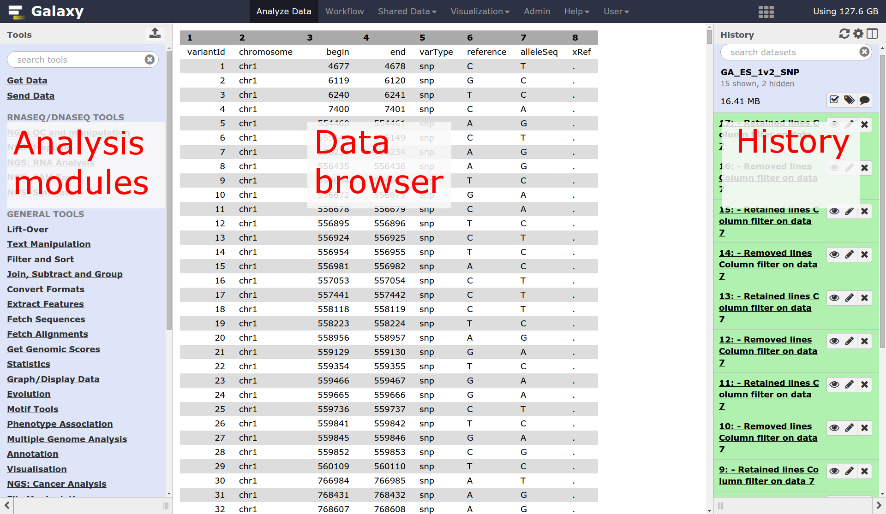
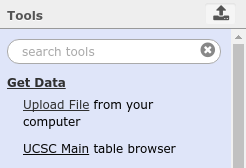
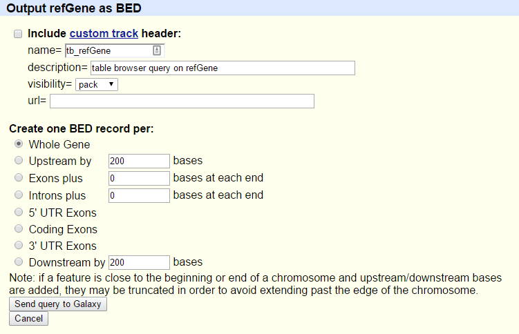
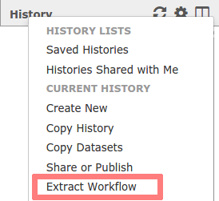
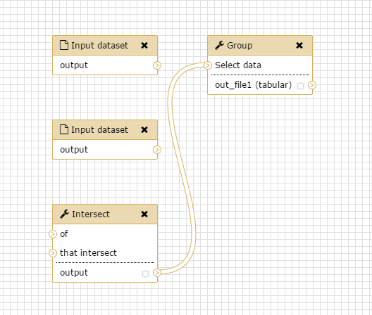
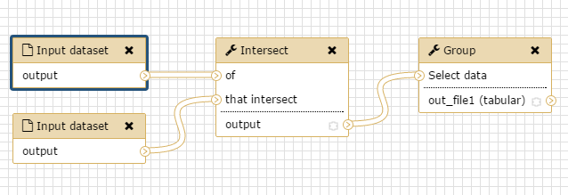

# From peaks to genes

# Introduction
We stumbled upon a paper [Li et al., Cell Stem Cell 2012](https://www.ncbi.nlm.nih.gov/pubmed/22862943) that contains the analysis of possible target genes of an interesting protein in mice. The targets were obtained by ChIP-seq and the raw data is available through [GEO](http://www.ncbi.nlm.nih.gov/geo/query/acc.cgi?acc=GSE37268).
The list of genes however is neither in the supplement of the paper nor part of the GEO submission.
The closest thing we can find is a list of the regions where the signal is
significantly enriched (so called *peaks*).
The goal of this exercise is to **turn this list of genomic regions into a list of possible target genes**.

# Pretreatments

Browse to your Galaxy instance and log in or register. The Galaxy interface consist of three main parts. The available tools are listed on the left, your analysis history is recorded on the right, and the middle pane will show the tools and datasets.

Let's start with a fresh history.

> ### :pencil2: Hands-on: Create history
>
> 1. Make sure you have an empty analysis history.
>
>    > ### :bulb: Starting a new history
>    >
>    > * Click the **Gear** icon at the top of the history panel
>    > * Select the option **Create New** from the menu
>    {: .tip}
>
> 2. **Rename your history** to make it easy to recognize. You can do this by clicking on the title of the history (by default the title is *Unnamed history*) and typing **Galaxy Introduction** as the name.
>   
{: .hands_on}

## Data upload

Download the list of peak regions (the file `GSE37268_mof3.out.hpeak.txt.gz`) from
[GEO](http://www.ncbi.nlm.nih.gov/geo/query/acc.cgi?acc=GSE37268) to your
computer and upload it to Galaxy.

> ### :pencil2: Hands-on: Data upload
>
> 1. Click on the upload button in the upper left ot the interface.
>
>    
>
> 2. Press **Choose local file** and search for your file.
>
> 3. As **Type** select `tabular`.
>
> 4. Press **Start** and wait for the upload to finish. Galaxy will automatically unpack the file.
>
>     > ### :nut_and_bolt: Comment
>     > After this you will see your first history item in Galaxy’s right pane. It will go through
>     > the gray (preparing/queued) and yellow (running) states to become green (success):
>     >
>     > 
>     {: .comment}
>
>    > ### :bulb: Tip: Importing data via links
>    >
>    > * Copy the link location
>    > * Open the Galaxy Upload Manager
>    > * Select **Paste/Fetch Data**
>    > * Paste the link into the text field
>    > * Press **Start**    
>    {: .tip}
>
>    > ### :bulb: Tip: Changing the file type once the data file is in your history
>    >
>    > * Click on the pencil button displayed in your dataset in the history
>    > * Choose **Datatype** on the top
>    > * Select `interval` in this case
>    > * Press **Save**
>    {: .tip}
> 
>    As default, Galaxy takes the link as name. It also doesn't link the dataset to a database or a reference genome.
> 
>    > ### :nut_and_bolt: Comments
>    > - Edit the "Database/Build" to select "mm9", the database build for mice used in the paper
>    > - Rename the datasets according to the samples
>    {: .comment}
> 
{: .hands_on}

In order to find the related genes to these peak regions,
we also need a list of genes in mice, which we can obtain from UCSC.

> ### :pencil2: Hands-on: Data upload from UCSC
>
> 1. In the tool menu, navigate to `Get Data -> UCSC Main - table browser`
>
>     
>
>     You will be taken to the **UCSC table browser**, which looks something like this:
>
>     
>
>     > ### :nut_and_bolt: Settings
>     >
>     >- **clade** should be set to `Mammal`
>     >- **genome** should be set to `Mouse`
>     >- **assembly** should be set to `July 2007 (NCBI37/mm9)`
>     >- **group** should be set to `Genes and Gene Predictions`
>     >- **track** should be set to `RefSeq Genes`
>     >- **table** should be `refGene`
>     >- **region** should be `genome`
>     >- **output format** should be set to `BED - browser extensible data`
>     >- **Send output to** should have the option `Galaxy` checked
>     {: .comment}
>
> 2. Click on the **get output** button and you will see the next screen:
>
>    
>
>    Make sure that **Create one BED record per** is set to `Whole Gene` and click on the **Send Query to Galaxy** button.
>
> 3. Let's rename our dataset to something more recognizable.
>    - Click on the **pencil icon** to edit a file's attributes.
>      
>    - In the next screen change the name of the dataset to `Genes`.
>    - Click the **Save** button at the bottom of the screen.
> 
{: .hands_on}

Now we collected all the data we need to start our analysis.

# Part 1: Naive approach

## File preperation

Let's have a look at our files to see what we actually have here.

> ### :pencil2: Hands-on: View file content
>
> To **view the contents** of the file, click on the **eye icon**. For our peak file, it should look something like this:
>
>    
>
> While the regions of the genes from UCSC look slightly different:
>
>    
>
>    > ### :question: Questions
>    >
>    > While the file from UCSC has labels for the columns, the peak file does not. Can you guess what the columns stand for?
>    >
>    {: .question}
>
{: .hands_on}

This peak file is not in any standard format and just by looking at it, we cannot find out what the numbers in the different columns mean. In the paper the authors mention that they used the peak caller [HPeak](https://www.ncbi.nlm.nih.gov/pubmed/20598134). By looking at the HPeak manual we can find out that the columns contain the following information:

 - chromosome name by number
 - start coordinate
 - end coordinate
 - length
 - location within the peak that has the highest hypothetical DNA fragment coverage (summit)
 - not relevant
 - not relevant

In order to compare the the two files, we have to make sure that the chromosome names follow the same format.
As we directly see, the peak file lacks `chr` before any chromosome number. But what happens with chromosome 20 and 21? Will it be X and Y instead? Let's check:

> ### :pencil2: Hands-on: View end of file
>
> 1. **Select last** :wrench:: Search for the **Select last** tool in the tool panel to the left and select the following settings:
>     - As **Text file** our peak file `GSE37268_mof3.out.hpeak.txt`
>     - **Operation**: `Keep last lines`
>     - **Number of lines**: Choose a value, e.g. `100`
> 2. Click **Execute**
> 3. Wait for the job to finish and inspect the file through the **eye icon**.
>
>    > ### :question: Questions
>    >
>    > 1. Are the chromosomes 20 and 21 named X and Y?
>    >
>    >    

>    >    
Click to view answers

>    >    <ol type="1">
>    >    <li>Not at all. One more thing to fix.</li>
>    >    </ol>
>    >    

>    {: .question}
{: .hands_on}

In order to convert the chromosome names we have therefore two things to do:
- add `chr`
- change 20 and 21 to X and Y

> ### :pencil2: Hands-on: Adjust chromosome names
>
> 1. **Replace Text** :wrench:: Run **Replace Text in a specific column**  with the following settings:
>     - As **File to process** our peak file `GSE37268_mof3.out.hpeak.txt`
>     - **in column**: `1`
>     - **Find pattern**: `[0-9]+`- this will look for numerical digits
>     - **Replace with**: `chr&` - `&` is a placeholder for the find result
> 2. Click **Execute**
> 3. Let's rerun the tool for the final changes two times. You can shortcut this by pressing the **rerun icon** in the history, but don't forget to adjust the settings:
>    - As **File to process** use the output from the last run, e.g. something like `Replace Text on data ...`
>    - **in column**: `1`
>    - **Find pattern**: `chr20`
>    - **Replace with**: `chrX`
> 4. Rerun this tool accordingly for chromosome Y.
> 5. Wait for the jobs to finish and inspect the latest file through the **eye icon**. Have we been successful?
>
{: .hands_on}

We have quite some files now and should take care that we don't loose track. Let's rename our latest result to something more handy, e.g. `Peak regions`.

## Analysis

Before we compare both region files we will add the promoter region to the gene records.

> ### :pencil2: Hands-on: Add promoter region to gene records
>
> 1. **Get Flanks** :wrench:: Run **Get Flanks**, which returns flanking regions for every gene with the following settings:
>     - As **Select data** use the file from UCSC
>     - **Region**: `Around Start`
>     - **Location**: `Upstream`
>     - **Offset**: `10000`
>     - **Length**: `12000`
{: .hands_on}

Compare the resulting BED file with the input.
Look at the contents and compare the rows in the input to the rows in the output to find out how the start and end positions changed.
Rename the dataset (by clicking on the pencil icon) to reflect your findings.

You might have noticed that the UCSC file is in `BED` format and has a database associated to it. That's what we want for our peak file as well:

> ### :pencil2: Hands-on: Change format and database
>
> 1. Click on the **pencil icon** in the history entry of our peak region file:
>      
> 2. In the next screen select as **Database/Build**: `Mouse July 2007 (NCBI37/mm9) (mm9)`
> 3. Click **Save**
> 4. Click on the **pencil icon** again and switch to the `Convert Format` tab
> 5. Select `Convert Genomic Intervals To BED` and press **Convert**
{: .hands_on}

It's time to find the overlapping intervals (finally!):

> ### :pencil2: Hands-on: Find Overlaps
>
> 1. **Intersect** :wrench:: Run **Intersect** with the following settings:
>     - **Return**: `Overlapping Intervals`
>     - **of**: the UCSC file with promoter regions
>     - **that intersect**: our converted peak region file
>     - **for at least**: `1`
> 
>    > ### :nut_and_bolt: Comments
>    > The order of the inputs is important! We want to end up with a list of genes, so the corresponding dataset needs to be the first input.
>    {: .comment}
{: .hands_on}

We do have a the list of genes (column 4 ) which correspond to the peak regions.
To get a better overview of the genes we obtained, we want to look at their distribution across the different chromosomes.

> ### :pencil2: Hands-on: Count genes on different chromosomes
>
> 1. **Group** :wrench:: Run **Group** with the following settings:
>     - **Select data**: The result of the intersection
>     - **Group by column**: `Column 1`
>     - Press **Insert Operation** and choose:
>     - **Type**: `Count`
>     - **On column**: `Column 1`
>
>    > ### :question: Questions
>    >
>    > Which chromosome contained the highest number of target genes?
>    >
>    >    

>    >    
Click to view answers

>    >    <ol type="1">
>    >    <li>The result varies with different settings. If you followed step by step it should be chromosome 7 with 1671 genes.</li>
>    >    </ol>
>    >    

>    {: .question}
> 
{: .hands_on}

## Visualization

Since we have some nice data, let's draw a barchart out of it!

> ### :pencil2: Hands-on: Draw barchart
>
> 1. **Charts** : Select the **Visualize icon** at the latest history item and select `Charts`
> 2. Choose a title at **Provide a title**, e.g. `Gene counts per chromosome`
> 3. Switch to the **Select data** tab and play around with the settings
> 4. Press **Visualize** and the top right to inspect your result
> 5. Click on **Editor** and repeat with different settings
>
{: .hands_on}

## Deploy your analysis

When you look carefully at your history, you can see that it contains all steps of our analysis, from the beginning to the end. By building this history we have actually built a complete record of our analysis with Galaxy preserving all parameter settings applied at every step.
Wouldn't it be nice to just convert this history into a workflow that we’ll be able to execute again and again?

Galaxy makes this very easy with the `Extract workflow` option. This means any time you want to build a workflow, you can just perform it manually once, and then convert it to a workflow, so that next time it will be a lot less work to do the same analysis. It also allows you to share or publish your analysis with ease.

> ### :pencil2: Hands-on: Extract workflow
>
> 1. **Clean up** your history. If you had any failed jobs (red), please remove those datasets from your history by clicking on the `x` button. This will make the creation of a workflow easier.
>
> 2. Go to the history **Options menu** (gear symbol) and select the `Extract Workflow` option.
>
>    
>
>    The center pane will change and you will be able to choose which steps to include/exclude and how to name the newly created workflow.
>
> 3. **Uncheck** any steps that shouldn't be included in the workflow. Since we did some steps which where specific to our custom peak file, we might to exclude:
>   - all **Replace Text** steps
>   - **Convert Genomic Intervals to strict BED**
>   - **Get flanks**
> 4. Rename the workflow to something descriptive, for example `From peaks to genes`
>
> 5. Click on the **Create Workflow** button near the top.
>
>    You will get a message that the workflow was created. But where did it go?
>
> 6. Click on **Workflow** in the top menu of Galaxy. Here you have a list of all your workflows. 
> 7. Select the newly generated workflow and click on **Edit**. You should see something similar to this:
>   
>
>    > ### :nut_and_bolt: The workflow editor
>    > We can examine the workflow in Galaxy's workflow editor. Here you can view/change the parameter settings of each step, add and remove tools, and connect an output from one tool to the input of another, all in an easy and graphical manner. You can also use this editor to build workflows from scratch.
>    {: .comment}
> 8. Although we have our two inputs in the workflow they are missing their connection to the first tool (Intersect), because we didn't carry over some of the intermediate steps. Connect each input dataset to the Intersect tool by dragging the arrow pointing outwards on the right of its box (which denotes an output) to an arrow on the left of the Intersect box pointing inwards (which denotes an input). Connect each input dataset with a different input of Intersect.
> 9. Rename the Input datasets: The upper one should be the `Reference regions` and the lower the `Peak regions`
> 10. Click on the **gear icon** at the top right and press **Auto Re-layout** to clean up our view:
>    
> 11. Click on the **gear icon** at the top right and press **Save** to save your changes:
>
>    > ### :bulb: Tip: Hiding intermediate steps
>    > When a workflow is executed, the user is usually primarily interested in the final product and not in all intermediate steps. By default all the outputs of a workflow will be shown, but we can explicitly tell Galaxy which output to show and which to hide for a given workflow. This behaviour is controlled by the little asterisk next to every output dataset:
>    > 
>    >
>    > If you click on this asterisk for any of the output datasets, then *only* files with an asterisk will be shown, and all outputs without an asterisk will be hidden (Note that clicking *all* outputs has the same effect as clicking *none* of the outputs, in both cases all the datasets will be shown).
>    {: .tip}
{: .hands_on}

Now it's time to reuse our workflow for a more sophisticated approach.

# Part 2: More sophisticated approach

In part 1 we used an overlap definition of 1 bp (default setting). In order to get a more meaningful definition, we now want to use the information of the position of the peak summit and check for overlap of the summits with genes. 

## Preperation

Create a new history and name it. If you forgot how to do that, you can have a look at the beginning of this tutorial.
The history is now empty, but we need our peak file again. Before we upload it twice we can copy it from our former history:

> ### :pencil2: Hands-on: Copy history items
>
> 1. Click on the **View all histories icon** at the top right of your history
> 2. You should see both of your histories side-by-side now. Use drag-and-drop with your mouse to copy the edited peak file (after the replace steps) but still in interval format, which contains the summit information, to your new history.
> 2. Press **Done** in the top left to go back to your analysis window
>
{: .hands_on}

## Create peak summit file

We need to generate a new BED file from the original peak file that contains the positions of the peak summits. The start of the summit is the start of the peak (column 2) plus the location within the peak that has the highest hypothetical DNA fragment coverage (column 5). As the end we simply define `start + 1`.

> ### :pencil2: Hands-on: Create peak summit file
>
> 1. **Compute** :wrench:: Run **Compute an expression on every row** with the following settings:
>   - **Add expression**: `c2+c5`
>   - **as a new column to**: our peak file
>   - **Round result?**: `YES`
> 2. Rerun this tool on the last result with:
>   - **Add expression**: `c8+1`
>   - **as a new column to**: the result from step 1
>
{: .hands_on}

Now we cut out just the chromosome plus the start and end of the summit:

> ### :pencil2: Hands-on: Cut out columns
> 1. **Cut** :wrench:: Run **Cut columns from a table** with the following settings:
>   - **Cut columns**: `c1,c8,c9`
>   - **From**: our latest history item
> 2. The output from **Cut** will have the format `tabular`. Change it to `interval` since that's what the tool **Intersect** expects.
>
{: .hands_on}

## Get gene names

The RefSeq genes we downloaded from UCSC did only contain the RefSeq identifiers, but not the gene names. To get a list of gene names in the end, we use another BED file from the Data Libraries.

> ### :nut_and_bolt: Comments
> There are several ways to get the gene names in, if you need to do it yourself. On way is to retrieve a mapping through Biomart and then join the two files (Tool: **Join, Substract and Group** - **Join two Datasets side by side on a specified field**). Another is to get the full RefSeq table from UCSC and manually convert it to BED format.
{: .comment}

> ### :pencil2: Hands-on: Get new gene file from Data Library
> 1. Click in the top menu on **Shared Data**
> 2. Navigate to `Genomes + Annotations -> Annotations`
> 3. Check the dataset `mm9.RefSeq_genes_from_UCSC`
> 4. Click **to History**, select it and press **Import**
> 5. Click in the top menu on **Analyze Data** to get back to your main page. You should see a new item in your history.
> 6. Inspect the file content to check if it contains gene names.
{: .hands_on}

## Repeat workflow

It's time to reuse the workflow we created earlier.

> ### :pencil2: Hands-on: Run a workflow
> 1. Open the workflow menu (top menu bar). Find the workflow you made in the previous section, and select the option **Run**
> 2. Choose as inputs our imported gene BED file and the result of the **Cut** tool
> 3. Click **Run workflow**. The outputs should appear in the history but it might take some time until they are finished.
{: .hands_on}

We used our workflow to rerun our analysis with the peak summits. The **Group** tool again produced a list containing the amount of genes found in each chromosome.
But woudln't it be more interesting to know about the amount of peaks in each unique gene? Let's rerun the workflow with different settings:

> ### :pencil2: Hands-on: Run a workflow with changed settings
> 1. Open the workflow menu (top menu bar). Find the workflow you made in the previous section, and select the option **Run**
> 2. Choose as inputs our imported gene BED file and the result of the **Cut** tool
> 3. Click on the title of the Group tool to expand the options.
> 4. Change the following settings by clicking at the **edit icon** on the left:
>   - **Group by column**: `7`
>   - **Operation -> On column**: `7`
> 5. Click **Run workflow**
{: .hands_on}

Congratulations! You should have a file with all the unique gene names and a count on how many peaks they contained.

> ### :question: Questions
>
> The list of unique genes is not sorted. Try to sort it on your own!
>
>    

>    
Click to view answers

>    You can use the tool "Sort data in ascending or descending order" on column 2 and a numerical sort.
>    

{: .question}

# Share your work

One of the most important features of Galaxy comes at the end of an analysis. When you have published striking findings, it is important that other researchers are able to reproduce your in-silico experiment. Galaxy enables users to easily share their workflows and histories with others.

To share a history, click on the gear symbol in the history pane and select `Share or Publish`. On this page you can do 3 things:

1. **Make accessible via Link**. This generates a link that you can give out to others. Anybody with this link will be able to view your history.
2. **Publish History**. This will not only create a link, but will also publish your history. This means your history will be listed under `Shared Data → Published Histories` in the top menu.
3. **Share with Individual Users**. This will share the history only with specific users on the Galaxy instance.

> ### :pencil2: Hands-on: Share history and workflow
>
> 1. Share one of your histories with your neighbour.
> 2. See if you can do the same with your workflow!
> 3. Find the history and/or workflow shared by your neighbour. Histories shared with specific users can be accessed by those users in their history menu (gear icon) under `Histories shared with me`.
{: .hands_on}

# Conclusion

Well done! You have just performed your first analysis in Galaxy. You also created a workflow from your analysis so you can easily repeat the exact same analysis on other datasets. Additionally you shared your results and methods with others.
