Galaxy Introduction: My First Analysis
========================================

:grey_question: ***Questions***

- *What is Galaxy and how do I use it?*

:dart: ***Objectives***

- *Familiarize yourself with the basics of Galaxy*
- *Learn how to obtain data from external sources*
- *Learn how to run tools*
- *Learn how histories work*
- *Learn how to create a workflow*
- *Learn how to share your work*

:heavy_check_mark: ***Requirements***

- *No prior knowledge is required*

:hourglass: ***Time estimation*** *1-1,5h*

# Introduction

This practical aims to familiarize you with the Galaxy user interface. It will teach you how to perform basic tasks such as importing data, running tools, working with histories, creating workflows, and sharing your work.

# Getting started

In this very simple example analysis we will introduce you to the basics of Galaxy. In this tutorial you will perform the following tasks:

- Getting data from UCSC
- Running simple data manipulation tools
- Displaying your data at the UCSC main genome viewer
- Understanding Galaxy’s Tool and History system
- Extracting a workflow from your analysis history
- Running a workflow on new data

Suppose you get the following question:

*Mom (or Dad) ... Which coding exon has the highest number of single nucleotide polymorphisms on chromosome 22?*

You think to yourself Wow! This is a simple question ... I know exactly where the data is (at UCSC) but how do I actually compute this? The truth is, there is really no straightforward way of answering this question in a time frame comparable to the attention span of a 7-year-old. Well ... actually there is and it is called Galaxy. So let’s try it...

## Preparations

Time to get started, browse to your Galaxy instance and log in or register. The Galaxy interface consist of three main parts. The available tools are listed on the left, your analysis history is recorded on the right, and the middle pane will show the tools and datasets.

:pencil2: ***Hands on!***

1. Make sure you have an empty analysis history. To start a new history, click on the **gear icon** at the top of the history pane, and select the option **Create New** from the menu.
2. **Rename your history** to make it easy to recognize. You can do this by clicking on the title of the history (by default the title is *Unnamed history*) and typing **Galaxy 101** as the name.

 

## Getting data from UCSC genome browser

Now we are ready to do some analysis, but first we will need to get some data into our history. Galaxy can fetch data directly from external data sources. We will now get a list of all the exon locations on chromosome 22 from the UCSC geneme browser.

:pencil2: ***Hands on!***

1. In the tool menu, navigate to `Get Data -> UCSC Main`

 

2. You will be taken to the **UCSC table browser**, which looks something like this:

 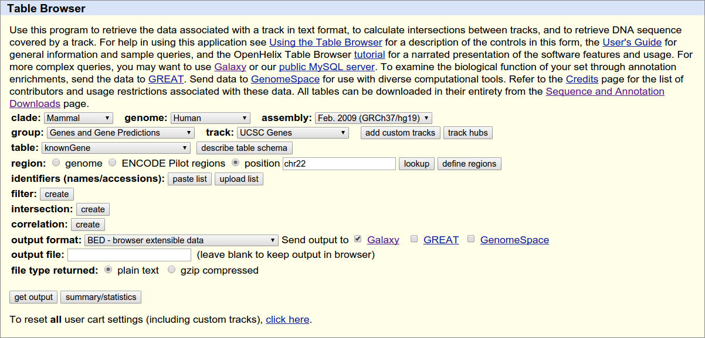

 Make sure that your settings are exactly the same as shown on the screen:
 - **assembly** should be set to Feb. 2009 (GRCh37/hg19)
 - **group** should be set to `Genes and Gene Predictions`
 - **position** should be set to `chr22`
 - **output format** should be set to `BED - browser extensible data`
 - **Send output to** should have the option `Galaxy` checked

3. Click on **get output** and you will see the next screen:

 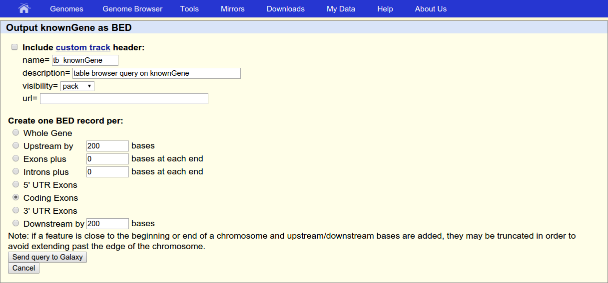

 Make sure **Create one BED record per** is set to `Coding Exons` and then click **Send Query to
 Galaxy**.

 After this you will see your first History item in Galaxy’s right pane. It will go through
 the gray (preparing/queued) and yellow (running) states to become green (success):

 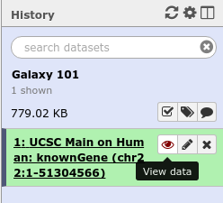

4. To **view the contents** of the file, click on the **eye icon**. Your file should look something like this:

 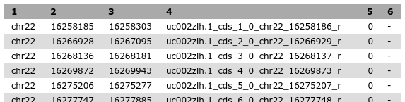

 The first three colums are the location of the exon, and the fourth column contains the ID (name) of the exons.

5. Let's rename our dataset to something more recognizable. Click on the **pencil icon** to edit a file's attributes, in the next screen change the name of the dataset to `Exons`, then click the **Save** button at the bottom of the screen. Your history should now look something like this:

 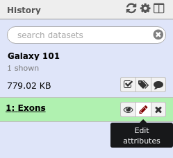

### Obtaining SNP information from UCSC

Now we have information about the exon locations, but our question was which exon contains the largest number of SNPs, so let's get this information from UCSC as well:

:pencil2: ***Hands on!***

1. Return to the UCSC tool `Get Data -> UCSC Main`
2. This time change the setting in **group** to `Variation`

 

3. The **track** setting shows the version of the SNP database to get. In this example it is version 142, but you may select the latest one. Your results may vary slightly from the ones in this tutorial when you select a different version, but in general it is a good idea to select the latest version.

4. Click `get output` to find a menu similar to this:

 

 Make sure that **Create one BED per** is set to `Whole Gene` (Whole Gene here really means Whole Feature), and click **Send Query to Galaxy**. You will get your second item in your analysis history.

5. Now **rename** your new dataset to `SNPs` so we can easily remember what the file contains.

# Finding Exons with the highest number of SNPs

Let’s remind ourselves that our objective was to find which exon contains the most SNPs. This  first step in answering this question will be joining the file with the exon locations with the file containing the SNP locations (here `join` is just a fancy word for printing the SNPs and exons that overlap side-by-side).

:pencil2: ***Hands on!***

1. Different galaxy servers may have tools available under different sections, therefore it is often useful to use the **search bar** at the top of the tools panel to find your tool. Enter the word `join` in the search bar of the tool panel, and select the tool named `Join - the intervals of two datasets side-by-side`

2. Select your file with exons as the first file, and the file with SNPs as the second file, and make sure **return** is set to `INNER JOIN` so that only matches are included in the output (i.e. only exons with SNPs in it and only SNPs that fall in exons)

 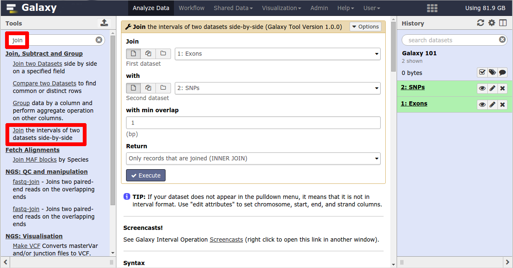

 **Note** if you scroll down on this page, you will find an explanation of the tool.

3. Click the **Execute** button and view the resulting file (with the eye icon). If everything went okay, you should see a file that looks similar to this:

 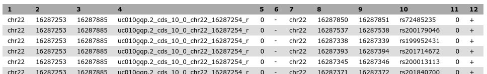

 Remember that variations are possible due to using different versions of UCSC databases, as long as you have similar looking columns you did everything right :)

Let’s take a look at this dataset. The first six columns correspond to exons, and the last six columns correspond to the SNPs. Column 4 conains the exon IDs, and column 10 contains the SNP IDs. In our screenshot you see that the first 5 lines in the file all have the same exon ID (`uc010gqp.2_cds_10_0_chr22_16287254_r`) but different SNP IDs, this means these lines represent 5 different SNPs that all overlapped with the same exon. So we can find the total number of SNPs in an exon simply by counting the number of lines that have the exon ID in the fourth column.

:question: Question: for the first 3 exons in your file, what is the number of SNPs that fall into that exon?

## Counting the number of SNPs per exon
We've just seen how to count the number of SNPs in each exon, so let's do this for all the exons in our file.

:pencil2: ***Hands on!***

1. Open the tool `Group - data by a column and perform aggregate operation on other columns`

 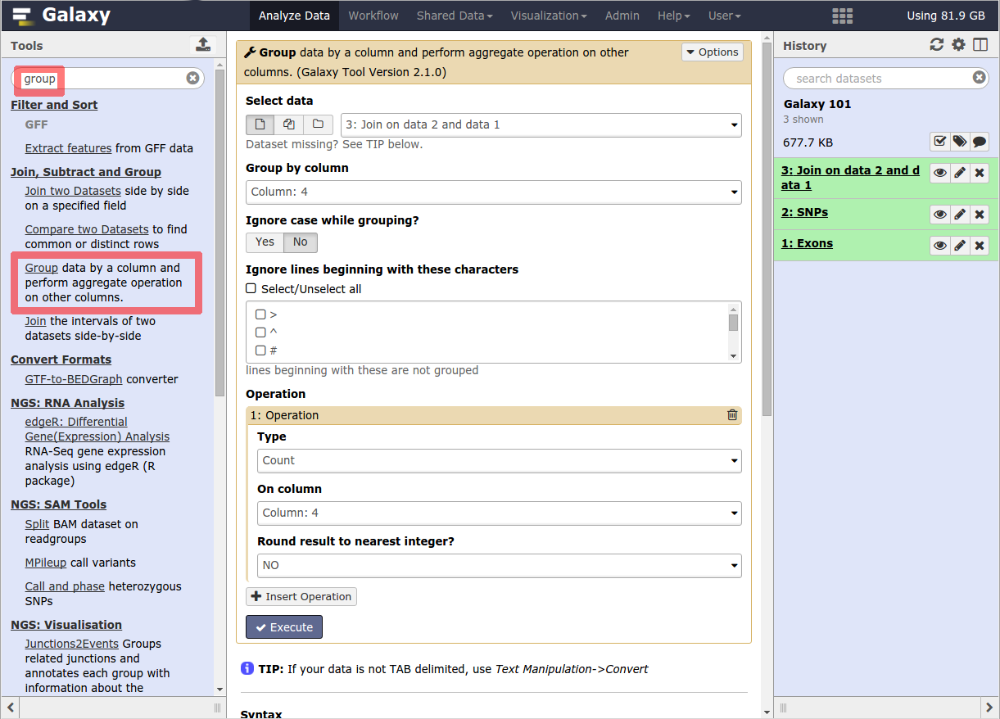

2. Set the parameters as follows:

 - **Select data**: select dataset 3 (the output from the join tool)
 - **Group by column**: `4` (the column with the exon IDs)
 - **Insert operation**: click on this button, then set **Type** to `Count` and set **On column** to `Column: 4`

3. Make sure your screen looks like the image above and click **Execute** to perform the grouping. Your output dataset will look something like this:

 

This file contains only two columns, the first contains the exon IDs, and the second the number of times that exon ID appeared in the file (in other words, how many SNPs were present in that exon)

:question: Question: How many exons are there in total in your file? (*Hint: each line now represents a different exon, so you can see the answer to this when you expand the history item, as in the image above*)

## Sorting exons by SNPs count

Now we have a list of all exons and the number of SNPs they contain, but we would like to know which exons has the *highest number* of SNPs, we can do this by sorting the file on the second column.

:pencil2: ***Hands on!***

1. Navigate to the tool `Sort - data in ascending or descencing order`
2. Set the **on column** parameter to `Column: 2`, by default it will select a numerical sort in descending order, which is exactly what we want in this case.

 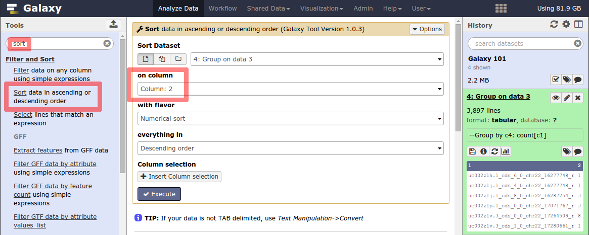

3. Click **Execute** and examine the output file

 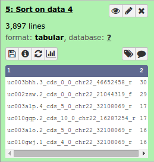

You should now see the same file as we had before, but the exons with the highest number of SNPs on top.

:question: Question: Which exon has the highest number of SNPs in your file (remember, it is okay if this is different to the screenshot above)

## Selecting top five exons

Let's say we want a list with just the top-5 exons with highest number of SNPs.

:pencil2: ***Hands on!***

1. Open the tool `Select first - lines from a dataset`
2. Set **select first** to `5` and choose the sorted dataset from the previous step as the input.

 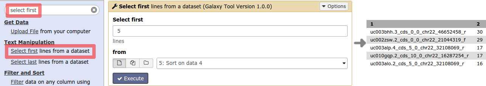

3. Click **Execute** and examine the output file, this should contain only the first 5 lines of the previous dataset.

## Recovering exon info and displaying data in genome browsers

Congratulations! you have now determined which exons on chromosome 22 have the highest number of SNPS, but what else can we learn about them? One way to learn more about a genetic location is to view it in a genome browser. However, in the process of getting our answer, we have lost information about the location of these exons on the chromosome. But fear not, Galaxy never deletes any of your data, so we can recover this information back into our file quite easily.

:pencil2: ***Hands on!***

1. Open the tool `Compare two Datasets - to find common or distinct rows`
2. Set the parameters to compare the column 4 of the exon file with column one of the top-5 exons file to find mathing rows.

 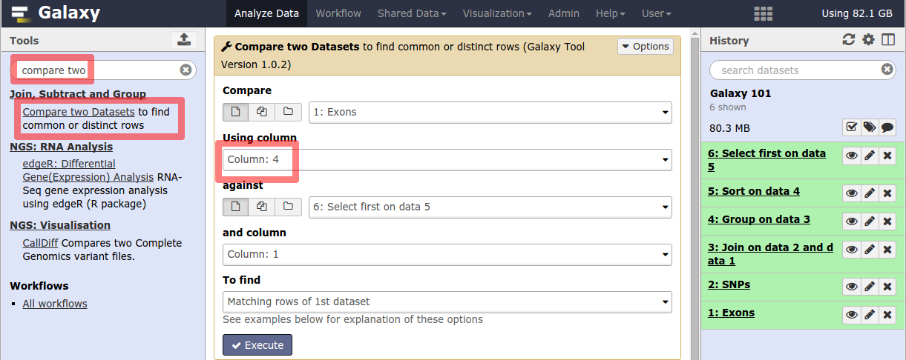

3. Click **Execute** and examine your output file. It should contain the locations of your top 5 exons:

 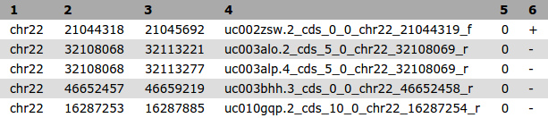

4. A good way to learn about these exons is to look at their genomic surrounding. This can be done by using genome browsers. First, we have to tell galaxy to which **Genome build** this data uses (hg19), we can do this as follows:

 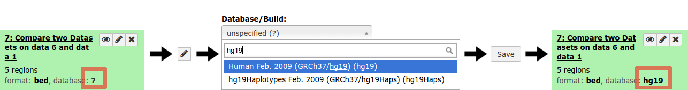

5. To **visualize the data in UCSC genome browser**, click on `display at UCSC main` option visible when you expand the history item.

 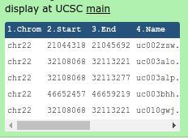

6. This will upload the data to UCSC as custom track. To see your data look at the `User Supplied Track` near the top. You can enter the coordinates of one of your exons at the top to jump to that location.

 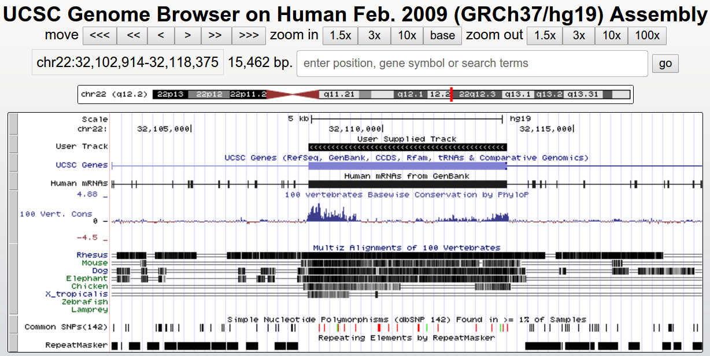

UCSC provides a large number of tracks that can help you get a sense of your genomic area, it contains common SNPS, repeats, genes, and much much more (scroll down to find all possible tracks)

## Understanding histories

In Galaxy your analyses live in histories such as your current one. Histories can be very large, you can have as many histories as you want. You can control your histories (switching, copying, sharing, creating a fresh history, etc) in the **Options** menu on the top of the history pane (gear symbol):

If you create a new history, your current history does not disappear. If you would like to list all of your histories just choose `Saved Histories` from the history menu and you will see a list of all your histories in the center pane:

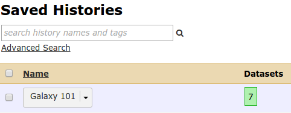

An alternative overview of your histories can be accessed by clicking on the **View all histories** button at top of your history pane (window icon)

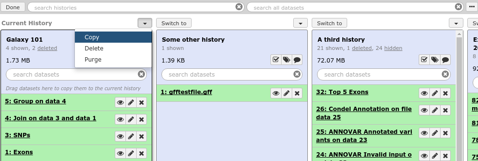

Here you see a more detailed view of each history, and can perform the same operations, such as switching to a different history, deleting a history, purging it (permanently deleting it, this action cannot be reversed), or copying a history.

## Converting your analysis history to a workflow

When you look carefully at your history, you can see that it contains all steps of our analysis, from the beginning to the end. By building this history we have actually built a complete record of our analysis with Galaxy preserving all parameter settings applied at every step. Wouldn’t it be nice to just convert this history into a workflow that we’ll be able to execute again and again?

Galaxy makes this very easy with the `Extract workflow` option. This means any time you want to build a workflow, you can just perform it manually once, and then convert it to a workflow, so that next time it will be a lot less work to do the same analysis.

:pencil2: ***Hands on!***

1. First step
2. Second step
3. Third step

## section

:pencil2: ***Hands on!***

1. First step
2. Second step
3. Third step

# Conclusion

Conclusion about the technical key points. And then relation between the technics and the biological question to end with a global view.

:grey_exclamation: ***Key Points***

- *Simple sentence to sum up the first key point of the tutorial (Take home message)*
- *Second key point*
- *Third key point*
- *...*

# :clap: Thank you
