Galaxy Introduction: My First Analysis
========================================

:grey_question: ***Questions***

- *What is Galaxy and how do I use it?*

:dart: ***Objectives***

- *Familiarize yourself with the basics of Galaxy*
- *Learn how to obtain data from external sources*
- *Learn how to run tools*
- *Learn how histories work*
- *Learn how to create a workflow*
- *Learn how to share your work*

:heavy_check_mark: ***Requirements***

- *No prior knowledge is required*

:hourglass: ***Time estimation*** *1-1,5h*

# Introduction

This practical aims to familiarize you with the Galaxy user interface. It will teach you how to perform basic tasks such as importing data, running tools, working with histories, creating workflows, and sharing your work.

# Getting started

In this very simple example analysis we will introduce you to the basics of Galaxy. In this tutorial you will perform the following tasks:

- Getting data from UCSC
- Running simple data manipulation tools on this data
- Displaying your data at the UCSC main genome viewer
- Understanding Galaxy’s tool and history system
- Extracting a workflow from your analysis history
- Running a workflow on new data
- Sharing your work with others

Suppose you get the following question:

*Mom (or Dad) ... Which coding exon has the highest number of single nucleotide polymorphisms on chromosome 22?*

You think to yourself Wow! This is a simple question ... I know exactly where the data is (at UCSC) but how do I actually compute this? The truth is, there is really no straightforward way of answering this question in a time frame comparable to the attention span of a 7-year-old. Well ... actually there is and it is called Galaxy. So let’s try it...

## Preparations

Time to get started, browse to your Galaxy instance and log in or register. The Galaxy interface consist of three main parts. The available tools are listed on the left, your analysis history is recorded on the right, and the middle pane will show the tools and datasets.

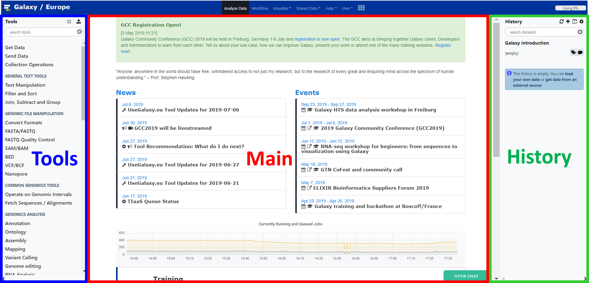

:pencil2: ***Hands on!***

1. Make sure you have an empty analysis history.

 :bulb: **Starting a new history**
 * Click the **gear icon** at the top of the history panel
 * Select the option **Create New** from the menu

2. **Rename your history** to make it easy to recognize. You can do this by clicking on the title of the history (by default the title is *Unnamed history*) and typing **Galaxy 101** as the name.

 

## Getting data from the UCSC table browser

Now we are ready to do some analysis, but first we will need to get some data into our history. You can upload files from your computer, but Galaxy can also fetch data directly from external sources. We will now import a list of all the exon locations on chromosome 22 directly from the UCSC table browser.

:pencil2: ***Hands on!***

1. In the tool menu, navigate to `Get Data -> UCSC Main - table browser`

 

 You will be taken to the **UCSC table browser**, which looks something like this:

 

 Make sure that your settings are exactly the same as shown on the screen:
 
 - **clade** should be set to `Mammal`
 - **genome** should be set to `Human`
 - **assembly** should be set to `Feb. 2009 (GRCh37/hg19)`
 - **group** should be set to `Genes and Gene Predictions`
 - **position** should be set to `chr22`
 - **output format** should be set to `BED - browser extensible data`
 - **Send output to** should have the option `Galaxy` checked

2. Click on the **get output** button and you will see the next screen:

 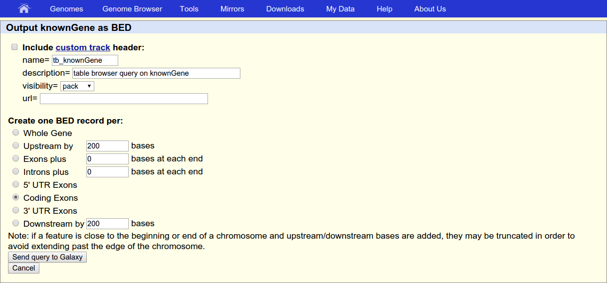

 Make sure that **Create one BED record per** is set to `Coding Exons` and then click on the **Send Query to Galaxy** button.

 After this you will see your first history item in Galaxy’s right pane. It will go through
 the gray (preparing/queued) and yellow (running) states to become green (success):

 

3. To **view the contents** of the file, click on the **eye icon**. Your file should look something like this:

 

 Each line represents an exon, the first three columns are the genomic location, and the fourth column contains the ID (name) of the exon.

4. Let's rename our dataset to something more recognizable.
 - Click on the **pencil icon** to edit a file's attributes.
 - In the next screen change the name of the dataset to `Exons`.
 - Click the **Save** button at the bottom of the screen.

 Your history should now look something like this:

 

### Obtaining SNP information from UCSC

Now we have information about the exon locations, but our question was which exon contains the largest number of SNPs, so let's get some information about SNP locations from UCSC as well:

:pencil2: ***Hands on!***

1. Return to the UCSC tool `Get Data -> UCSC Main - table browser`

2. Change the setting in **group** to `Variation`

 

 The **track** setting shows the version of the SNP database to get. In this example it is version 142, but you may select the latest one. Your results may vary slightly from the ones in this tutorial when you select a different version, but in general it is a good idea to select the latest version, as this will contain the most up-to-date SNP information.

3. Click on the `get output` button to find a menu similar to this:

 

 Make sure that **Create one BED per** is set to `Whole Gene` (Whole Gene here really means Whole Feature), and click on **Send Query to Galaxy**. You will get your second item in your analysis history.

4. Now **rename** your new dataset to `SNPs` so we can easily remember what the file contains.

# Finding Exons with the highest number of SNPs

Let’s remind ourselves that our objective was to find which exon contains the most SNPs. This  first step in answering this question will be joining the file with the exon locations with the file containing the SNP locations (here `join` is just a fancy word for printing the SNPs and exons that overlap side-by-side).

Different Galaxy servers may have tools available under different sections, therefore it is often useful to use the **search bar** at the top of the tool panel to find your tool.

:pencil2: ***Hands on!***

1. Enter the word `join` in the search bar of the tool panel, and select the tool named `Join - the intervals of two datasets side-by-side`

2. Select your file with exons as the first file, and the file with SNPs as the second file, and make sure **return** is set to `INNER JOIN` so that only matches are included in the output (i.e. only exons with SNPs in it and only SNPs that fall in exons)

 

 **Note:** if you scroll down on this page, you will find an explanation of the tool.

3. Click the **Execute** button and view the resulting file (with the eye icon). If everything went okay, you should see a file that looks similar to this:

 

 Remember that variations are possible due to using different versions of UCSC databases, as long as you have similar looking columns you did everything right :)

Let’s take a look at this dataset. The first six columns correspond to the exons, and the last six columns correspond to the SNPs. Column 4 contains the exon IDs, and column 10 contains the SNP IDs. In our screenshot you see that the first 5 lines in the file all have the same exon ID (`uc010gqp.2_cds_10_0_chr22_16287254_r`) but different SNP IDs, this means these lines represent 5 different SNPs that all overlapped with the same exon. So we can find the total number of SNPs in an exon simply by counting the number of lines that have the exon ID in the fourth column.

:question: For the first 3 exons in your file, what is the number of SNPs that fall into that exon?

## Counting the number of SNPs per exon
We've just seen how to count the number of SNPs in each exon, so let's do this for all the exons in our file.

:pencil2: ***Hands on!***

1. Open the tool `Group - data by a column and perform aggregate operation on other columns`

 

2. Set the parameters as follows:

 - **Select data**: select dataset 3 (the output from the join tool)
 - **Group by column**: `4` (the column with the exon IDs)
 - **Insert operation**: click on this button, then set **Type** to `Count` and set **On column** to `Column: 4`

3. Make sure your screen looks like the image above and click **Execute** to perform the grouping. Your output dataset will look something like this:

 

This file contains only two columns, the first contains the exon IDs, and the second the number of times that exon ID appeared in the file (in other words, how many SNPs were present in that exon)

:question: How many exons are there in total in your file? (*Hint: each line now represents a different exon, so you can see the answer to this when you expand the history item, as in the image above*)

## Sorting exons by SNPs count

Now we have a list of all exons and the number of SNPs they contain, but we would like to know which exons has the *highest number* of SNPs, we can do this by sorting the file on the second column.

:pencil2: ***Hands on!***

1. Navigate to the tool `Sort - data in ascending or descending order`

2. Set the **on column** parameter to `Column: 2`, by default it will select a numerical sort in descending order, which is exactly what we want in this case.

 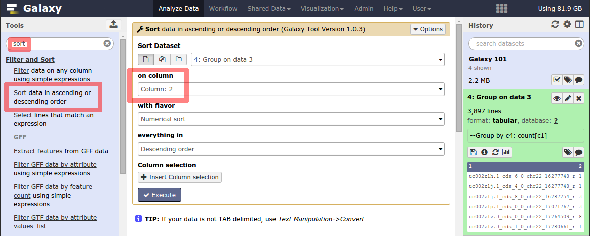

3. Click **Execute** and examine the output file.

 

You should now see the same file as we had before, but the exons with the highest number of SNPs are now on top.

:question: Which exon has the highest number of SNPs in your file (remember, it is okay if this is different to the screenshot above)

## Selecting top five exons

Let's say we want a list with just the top-5 exons with highest number of SNPs.

:pencil2: ***Hands on!***

1. Open the tool `Select first - lines from a dataset`

2. Set **select first** to `5` and choose the sorted dataset from the previous step as the input.

 

3. Click **Execute** and examine the output file, this should contain only the first 5 lines of the previous dataset.

## Recovering exon info and displaying data in genome browsers

Congratulations! you have now determined which exons on chromosome 22 have the highest number of SNPS, but what else can we learn about them? One way to learn more about a genetic location is to view it in a genome browser. However, in the process of getting our answer, we have lost information about the location of these exons on the chromosome. But fear not, Galaxy saves all of your data, so we can recover this information quite easily.

:pencil2: ***Hands on!***

1. Open the tool `Compare two Datasets - to find common or distinct rows`

2. Set the parameters to compare the column 4 of the exon file with column 1 of the top-5 exons file to find matching rows.

 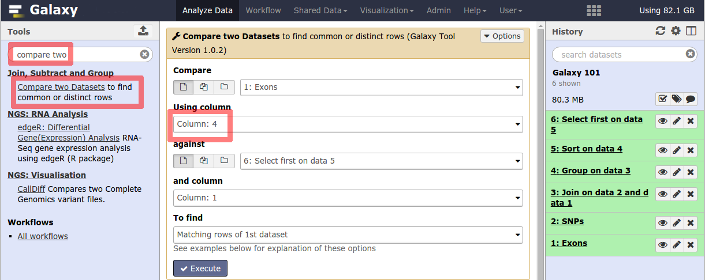

3. Click **Execute** and examine your output file. It should contain the locations of your top 5 exons:

 

A good way to learn about these exons is to look at their genomic surrounding. This can be done by using genome browsers. Galaxy can launch a genome browser such as IGV on your local machine, and it can connect to online genome browsers as well. An example of such an online genome browser is the UCSC genome browser.

:pencil2: ***Hands on!***

1. First, we have to tell Galaxy which **Genome build** this data uses (hg19), we can do this as follows:

 

2. To **visualize the data in UCSC genome browser**, click on `display at UCSC main` option visible when you expand the history item.

 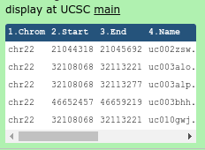

 This will upload the data to UCSC as custom track. To see your data look at the `User Track` near the top. You can enter the coordinates of one of your exons at the top to jump to that location.

 

UCSC provides a large number of tracks that can help you get a sense of your genomic area, it contains common SNPS, repeats, genes, and much much more (scroll down to find all possible tracks)

## Understanding histories

In Galaxy your analyses live in histories such as your current one. Histories can be very large, and you can have as many histories as you want. You can control your histories (switching, copying, sharing, creating a fresh history, etc) in the **Options** menu on the top of the history pane (gear symbol):

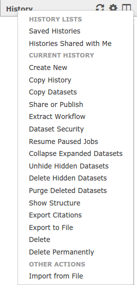

If you create a new history, your current history does not disappear. If you would like to list all of your histories just choose `Saved Histories` from the history menu and you will see a list of all your histories in the center pane:

An alternative overview of your histories can be accessed by clicking on the **View all histories** button at top of your history pane (window icon).

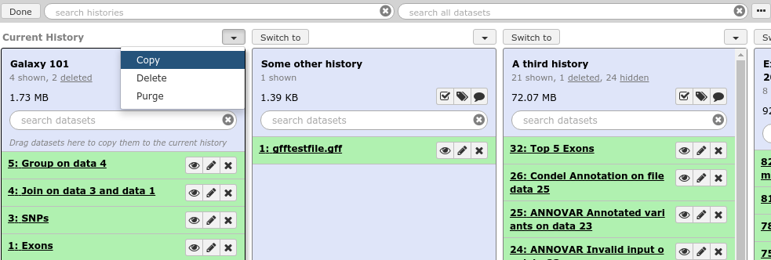

Here you see a more detailed view of each history, and can perform the same operations, such as switching to a different history, deleting a history, purging it (permanently deleting it, this action cannot be reversed), or copying datasets or even entire histories.

You can always return to your analysis view by clicking on **Analyze Data** in the top menu bar.

## Converting your analysis history to a workflow

When you look carefully at your history, you can see that it contains all steps of our analysis, from the beginning to the end. By building this history we have actually built a complete record of our analysis with Galaxy preserving all parameter settings applied at every step. Wouldn’t it be nice to just convert this history into a workflow that we’ll be able to execute again and again?

Galaxy makes this very easy with the `Extract workflow` option. This means any time you want to build a workflow, you can just perform it manually once, and then convert it to a workflow, so that next time it will be a lot less work to do the same analysis.

:pencil2: ***Hands on!***

1. **Clean up** your history. If you had any failed jobs (red), please remove those datasets from your history by clicking on the `x` button. This will make the creation of a workflow easier.

2. Go to the history **Options menu** (gear symbol) and select the `Extract Workflow` option.

 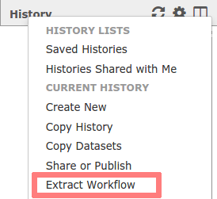

 The center pane will change as shown below and you will be able to choose which steps to include/exclude and how to name the newly created workflow.

 

3. **Uncheck** any steps that shouldn't be included in the workflow (if any), and **rename** the workflow to something descriptive, for example `Find exons with the highest number of SNPs`.

4. Click on the **Create Workflow** button near the top.

  You will get a message that the workflow was created. But where did it go?

5. Click on **Workflow** in the top menu of Galaxy. Here you have a list of all your workflows. Your newly created workflow should be listed at the top:

 

## The Worklow Editor

We can examine the workflow in Galaxy's workflow editor. Here you can view/change the parameter settings of each step, add and remove tools, and connect an output from one tool to the input of another, all in an easy and graphical manner. You can also use this editor to build workflows from scratch.

:pencil2: ***Hands on!***

1. Click on the triangle to the right of your workflow name.

 

2. Select **Edit** to launch the workflow editor. You should see something like this:

 

 When you click on a component, you will get a view of all the parameter settings for that tool on the right-hand side of your screen.

 **Hiding intermediate steps**  
 When a workflow is executed, the user is usually primarily interested in the final product and not in all intermediate steps. By default all the outputs of a workflow will be shown, but we can explicitly tell Galaxy which output to show and which to hide for a given workflow. This behaviour is controlled by the little asterisk next to every output dataset:

 

 If you click on this asterisk for any of the output datasets, then *only* files with an asterisk will be shown, and all outputs without an asterisk will be hidden. (Note that clicking *all* outputs has the same effect as clicking *none* of the outputs, in both cases all the datasets will be shown.)

3. **Click the asterisk** next to `out_file1` in the `Select First` and `Compare two Datasets` tools.

 Now when we run the workflow, we will only see the final two outputs, our list with the top-5 exons and their SNP counts, and the file with exons ready for viewing in a genome browser. Once you have done this, you will notice that the **minimap** at the bottom-right corner of your screen will have a colour-coded view of your workflow, with orange boxes representing a tool with an output that will be shown.

 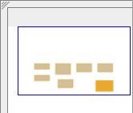

 **Renaming inputs**  
 Right now both inputs to the workflow look exactly the same, both are labelled `Input dataset`. It will be very confusing to know which input should be the exons and which should be the SNPs:

 

 To remedy this, let us rename the inputs. In the image above, you see that the top input dataset (with the blue border), connects to the first input of the join tool, so this corresponds to the exon data.

4. **Click** on the box corresponding to the exon input dataset, and **rename** it to `Exons` on the right-hand side of your screen.

 

5. **Repeat** this process for the other input dataset. Name it `Features`. We used it to calculate highest number of SNPS, but this workflow would also work with other features, so we give it a bit more generic name.

6. Let's also **rename the outputs**. Click on the `Select first` tool and in the menu on the right click on `Configure Output` and enter a descriptive name for the output dataset in the `Rename dataset` box.

 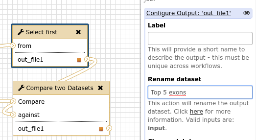

7. **Repeat** this for the output of the `Compare two Datasets` tool.

8. **Save your workflow** (important!) by clicking on the gear icon at the top right of the screen, and selecting `Save`.

 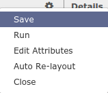

9. **Return** to the analysis view by clicking on `Analyze Data` at the top menu bar.

## Run workflow on different data

Now that we have built our workflow, let's use it on some different data. For example, let's find out which exons have the highest number of repeat elements.

:pencil2: ***Hands on!***

1. Create a **new history** (gear icon) and give it a name.

2. We will need the list of exons again. We don't have to get this from UCSC again, we can just **copy** it from our previous history. The easiest way to do this is to go to the history overview
(window icon at top of history pane). Here you can just drag and drop datasets from one history to another.

 

3. We wanted to know something about the repetitive elements per exon. We get this data from UCSC.

 - **assembly** should be set to `Feb. 2009 (GRCh37/hg19)`
 - **group** parameter should be `Repeats`
 - **position** should be `chr22`
 - leave the rest of the settings to the defaults

 Click on `Get output` and then `send query to Galaxy` on the next screen.

4. Open the **workflow menu** (top menu bar). Find the workflow you made in the previous section, and select the option `Run`.

 

 The center pane will change to allow you to configure and launch the workflow.

5. Select appropriate datasets for the inputs as shown below, then scroll down and click `Run workflow`.

 

 Once the workflow has started you will initially be able to see all its steps (you may need to click the refresh button at the top of your history if the steps do not show up):

 

 **Note:** because most intermediate steps of the workflow were hidden, once it is finished you will only see the final two datasets. If we want to view the intermediate files after all, we can unhide all hidden datasets by selecting `Include Hidden datasets` from the history options menu.

:question: Which exon had the highest number of repeats? How many repeats were there?

## Share your work

One of the most important features of Galaxy comes at the end of an analysis. When you have published striking findings, it is important that other researchers are able to reproduce your in-silico experiment. Galaxy enables users to easily share their workflows and histories with others.

To share a history, click on the gear symbol in the history pane and select `Share or Publish`. On this page you can do 3 things:

1. **Make accessible via Link**. This generates a link that you can give out to others. Anybody with this link will be able to view your history (even without a Galaxy account).
2. **Publish History**. This will not only create a link, but will also publish your history. This means your history will be listed under `Shared Data → Published Histories` in the top menu.
3. **Share with Individual Users**. This will share the history only with specific users on the Galaxy instance.

:pencil2: ***Hands on!***

1. Share one of your histories with your neighbour, or publish it.
2. See if you can do the same with your workflow!
3. Find the history and/or workflow shared by your neighbour. Published histories are available under the `Shared data` menu in the top menu. Histories shared with specific users can be accessed by those users in their history menu (gear icon) under `Histories shared with me`.

# Conclusion

Well done! You have just performed your first analysis in Galaxy. You also created a workflow from your analysis so you can easily repeat the exact same analysis on other datasets, and you shared your results and methods with others.

:grey_exclamation: ***Key Points***

- *Galaxy provides an* **easy-to-use** *graphical user interface for often complex commandline tools*
- *Galaxy keeps a* **full record of your analysis** *in a history*
- **Workflows** *enable you to repeat your analysis on different data*
- *Galaxy can connect to* **external sources** *for data import and visualization purposes*
- *Galaxy provides ways to* **share** *your results and methods with othes*

# :clap: Thank you
