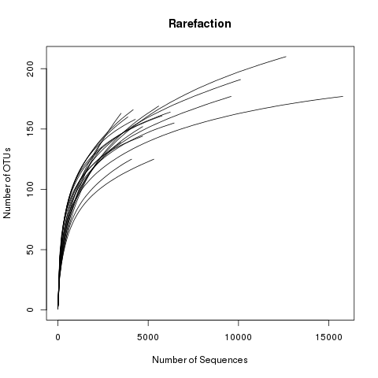
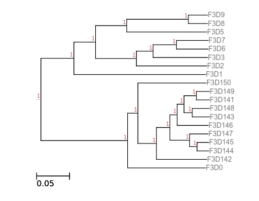

Metagenomics with Mothur: MiSeq SOP
==================================

:grey_question: ***Questions***

- *What is the effect of normal variation in the gut microbiome on host health?*

:dart: ***Objectives***

- *Learn how to analyse 16S rRNA sequences in Galaxy using the Mothur toolsuite*
- *Learn how to use dataset collections to process a large number of samples at once*

:heavy_check_mark: ***Requirements***

- *Basic knowledge of Galaxy (e.g. Galaxy Introduction module)*

:hourglass: ***Time estimation*** *3h*

# Introduction

This tutorial will demonstrate how to perform the *standard operating procedure (SOP)* for the analysis of 16S rRNA gene sequences generated using Illumina's MiSeq platform, with the [Mothur toolsuite](http://www.mothur.org/wiki) within Galaxy. This SOP was developed by the Schloss lab and described [here](http://www.mothur.org/wiki/MiSeq_SOP) on the Mothur wiki.

<!-- TODO: add citation
Kozich JJ, Westcott SL, Baxter NT, Highlander SK, Schloss PD. (2013): Development of a dual-index sequencing strategy and curation pipeline for analyzing amplicon sequence data on the MiSeq Illumina sequencing platform. Applied and Environmental Microbiology. 79(17):5112-20. -->

## Overview
In this tutorial we will perform the following steps:

1. Obtaining and preparing input data
2. Quality Control
  - Reducing sequencing and PCR errors
  - Processing improved sequences
  - Assessing error rate
  - Preparing for analysis  
3. OTU-based analysis
  - alpha diversity
  - beta diversity
  - population-level analysis
4. Vizualisations
  - Phinch
  - Krona

Each of the Mothur tools in Galaxy contains a link to the mothur wiki in the help section. Here you can find more details about all the inputs, outputs and parameters for the tool.

:information_source: Your results may deviate slightly from the ones presented in this tutorial due to differing tool or reference data versions or stochastic processes in the algorithms.

# Part 1: Obtaining and preparing data

## Understanding our input data
In this tutorial we are interested in understanding the effect of normal variation in the gut microbiome on host health. To that end fresh feces from mice were collected on a daily basis for 365 days post weaning. During the first 150 days post weaning (dpw), nothing was done to our mice except allow them to eat, get fat, and be merry. We were curious whether the rapid change in weight observed during the first 10 dpw affected the stability microbiome compared to the microbiome observed between days 140 and 150. We will address this question in this tutorial using a combination of OTU, phylotype, and phylogenetic methods.

To make this tutorial easier to execute, we are providing only part of the data - you are given the flow files for one animal at 10 time points (5 early and 5 late). In addition, to sequencing samples from mice fecal material, we resequenced a mock community composed of genomic DNA from 21 bacterial strains. We will use the 10 fecal samples to look at how to analyze microbial communities and the mock community to measure the error rate and its effect on other analyses.

:information_source: **Dataset details**  
Because of the large size of the original dataset (3.9 GB) you are given 21 of the 362 pairs of fastq files. For example, you will see two files: `F3D0_S188_L001_R1_001.fastq` and `F3D0_S188_L001_R2_001.fastq`. These two files correspond to Female 3 on Day 0 (i.e. the day of weaning). The first and all those with R1 correspond to read 1 while the second and all those with R2 correspond to the second or reverse read. These sequences are 250 bp and overlap in the V4 region of the 16S rRNA gene; this region is about 253 bp long. So looking at the datasets you will see 22 fastq files representing 10 time points from Female 3 and 1 mock community. You will also see `HMP_MOCK.v35.fasta` which contains the sequences used in the mock community that were sequenced in fasta format.

:pencil2: ***Hands on!***

Now that we know what our input data is, let's get it into our history:

1. Create a **new history** and name it "Mothur MiSeq SOP"

2. **Import** the training data to your history. There are two ways to do this. The easiest is using the data available from a *Shared Data Library*, if this is not possible on your Galaxy instance, you can download the data yourself and upload it to your Galaxy instance.
 - From data library:
    - Navigate to the shared data library named *Galaxy training: Metagenomics with Mothur - MiSeq SOP* and import all files listed in the *Input Data* folder
  - From your computer:
    - obtain data directly from [here](http://www.mothur.org/w/images/d/d6/MiSeqSOPData.zip)  <!-- TODO: zenodo link-->
    - download `inputdata.zip` and unzip it
    - upload all files to your history.

3. Create a **paired collection**. Since we have paired end data, each sample consist of two seperate fastq files, one containing the forward reads, and one containing the reverse reads. We can recognize the pairing from the file names, which will differ only by `_R1` or `_R2` in the filename. We can tell Galaxy about this paired naming convention, so that our tools will know which files belong together.

 - Click on the **checkmark icon** at top of your history.

    

 - Select all the fastq files (40 in total), then click on **for all selected..** and select **Build List of Dataset Pairs** from the dropdown menu.

 - In the next dialog window you can create the list of pairs. By default Galaxy will look for pairs of files that differ only by a `_1` and `_2` part in their names. In our case however, these should be `_R1` and `_R2`. Please change these values accordingly. You should now see a list of pairs suggested by Galaxy,

     

 - Examine the pairings, if it looks good, you can click on **auto-pair** to create the suggested pairs.

     

    The middle segment is the name for each pair. You can change these names by clicking on them. These names will be used as sample names in the downstream analysis so always make sure they are informative.

 - Once you are happy with your pairings, enter a name for your new collection at the bottom right of the screen.

 - Click the **Create List** button. A new dataset collection item will now appear in your history.

## Reference Data

Apart from our input data we will also need some additional reference data.

:pencil2: ***Hands on!***

1. Go back to the data library and import all files from the *Reference Data* folder, or download them from Zenodo (`inputdata.zip`) and upload them to your history:
  - `silva.v4.fasta`
  - `HMP_MOCK.v35.fasta`
  - `trainset9_032012.pds.fasta`
  - `trainset9_032012.pds.tax`

# Step 2: Quality Control

## Reducing sequencing and PCR errors

The first thing we want to do is combine our two sets of reads for each sample and then to combine the data from all of the samples. This is done using the make.contigs command, which requires the paired collection as input. This command will extract the sequence and quality score data from your fastq files, create the reverse complement of the reverse read and then join the reads into contigs.

:information_source: **Algorithm details**  
We have a very simple algorithm to do this. First, we align the pairs of sequences. Next, we look across the alignment and identify any positions where the two reads disagree. If one sequence has a base and the other has a gap, the quality score of the base must be over 25 to be considered real. If both sequences have a base at that position, then we require one of the bases to have a quality score 6 or more points better than the other. If it is less than 6 points better, then we set the consensus base to an N.

:pencil2: ***Hands on!***

**1: Combine forward and reverse reads**  
  - **Tool:** Make.contigs
  - **Parameters:**
    - Set `Fastq pair` to the collection you created in the previous step
    - Leave all other parameters to the default settings
  - Execute

The output from this tool will be 6 new collections, one for each type of output file (e.g. one collection with the `trim.contig.fasta` files for each pair, and another for all `scrap.contig.fasta` files). Before we continue with the analysis, we would like to combine this data into a single file. To this end we will merge all the trimmed fasta files and create a group file:

**2: Merge fasta outputs**
  - **Tool:** Merge.files
  - **Parameters:**
    - Set **merge** to *fasta files*
    - Set **inputs** to the `trim.contigs.fasta` collection output of the previous step

This will simply concatenate all the fasta files into a single file. In order to retain the knowledge of which reads came from which samples, we also create a group file.

:bulb: ***Collections as input***  
To provide a collection as input for a tool, click on the `Dataset collection` button in front of the parameter. The dropdown menu will now list collections as possible inputs.

 


**3: Make group file**
  - **Tool:** Make.group
  - **Parameters:**
    - Set **Method** to *Automatically from collection*
    - Set **fasta collection** to the `trim.contigs.fasta` output of the make.contigs step

Examine the output. The *group file* consists of two columns, the first is the sequence read name, and the second is the group (sample) it belongs to. The sample names were generated from the dataset names of the pairs in our collection.

```
seq1  sample1
seq2  sample1
seq3  sample2
..
```

**4: Summarize data**  
To get more information about the resulting fasta files, we can use the `Summary.seqs` tool.

  - **Tool:** Summary.seqs
  - **Parameters:**
    - Set `fasta` parameter to the merged fasta file from step 2
    - We do not need to supply a names or count file

The `summary` output files give information per read. The `logfile` outputs also contain some summary statistics:

```
             Start    End        NBases     Ambigs   Polymer  NumSeqs
Minimum:     1        248        248        0        3        1
2.5%-tile:   1        252        252        0        3        3810
25%-tile:    1        252        252        0        4        38091
Median:      1        252        252        0        4        76181
75%-tile:    1        253        253        0        5        114271
97.5%-tile:  1        253        253        6        6        148552
Maximum:     1        502        502        249      243      152360
Mean:        1        252.811    252.811    0.70063  4.44854
# of Seqs:   152360
```

This tells us that we have 152360 sequences that for the most part vary between 248 and 253 bases. Interestingly, the longest read in the dataset is 502 bp. Be suspicious of this. Recall that the reads are supposed to be 251 bp each. This read clearly didn't assemble well (or at all). Also, note that at least 2.5% of our sequences had some ambiguous base calls. We'll take care of these issues in the next step when we run `screen.seqs`.

**5: Filter reads based on quality and length**  

The following tool will remove any sequences with ambiguous bases and anything longer than 275 bp.

- **Tool:** Screen.seqs
- **Parameters:**
  - Set **fasta** parameter to the merged fasta file from step 2
  - Set **group** parameter to the group file created in step 3
  - Set **maxlength** parameter to `275`
  - Set **maxambig** parameter to `0`

After the tool has finished, run **summary.seqs** tool on the filtered fasta (`good.fasta`) and examine the logfile output.

:question: How many reads were removed in this screening step?

<!-- collapsible section until we have templating for answers -->
<details>
  <summary>Click to view answer</summary>
  :white_check_mark: 23,488. This can be determined by looking at the number of lines in bad.accnos output of screen.seqs or by comparing the total number of seqs between the two summary.seqs logfiles
</details>


## Processing improved sequences
We anticipate that many of our sequences are duplicates of each other. Because it's computationally wasteful to align the same thing a bazillion times, we'll unique our sequences using the `unique.seqs` command:

:pencil2: ***Hands on!***

**1: Remove duplicate sequences**  

- **Tool:** Unique.seqs
- **Parameters:**
  - Set **fasta** to the `good.fasta` output from Screen.seqs

This tool outputs two files, one is a fasta file containing only unique sequences, and a *names files*. The names file consists of two columns, the first contains the sequence names for each of the unique sequences, and the second column contains all other sequence names that are identical to the representative sequence in the first column.

```
name    representatives
seq1    seq2,seq3,seq5,seq11
seq4    seq6,seq9,seq10
seq7    seq8
...
```

:question: How many sequences were unique? how many duplicates were removed?

<!-- collapsible section until we have templating for answers -->
<details>
  <summary>Click to view answer</summary>
  :white_check_mark: 16,426 unique sequences and 112,446 duplicates.
</details>


**2: Generate count table**

To reduce file sizes further and streamline analysis, we can now summarize the data in a *count table*.

- **Tool:** Count.seqs
- **Parameters:**
  - Set **name** to the `names` output from Unique.seqs
  - Set **Use a Group file** to `yes`
  - Set **group** to the group file output by the Screen.seqs tools
  - Set **groups** to all (or leave blank)

The *count_table* output will look something like this:

```
Representative_Sequence                      total   F3D0   F3D1  F3D141  F3D142  ...
M00967_43_000000000-A3JHG_1_1101_14069_1827  4402    370    29    257     142
M00967_43_000000000-A3JHG_1_1101_18044_1900  28      1      0     1       0
M00967_43_000000000-A3JHG_1_1101_13234_1983  10522   425    281   340     205
...
```

The first column contains the representative sequence, and the subsequent columns contain the number of duplicates of this sequence observed per sample.

**3: Align sequences**

- **Tool:** Align.seqs
- **Parameters:**
  - Set **fasta** to the fasta output from Unique.seqs
  - Set **reference** to the `silva.v4.fasta` reference file
    - If your Galaxy is preconfigured with this reference data you will be able to find it in dropdown menu.
    - If not, set **Select Reference Template From** to `Your History` and select the appropriate file from your history.

This can take a minute or two. After the job completes, let's create another summary to see what is going on

- **Tool:** Summary.seqs
- **Parameters:**
  - Set **fasta** parameter to the aligned output from previous step
  - Set **count** parameter to count_table we made earlier

```
            Start    End      NBases  Ambigs   Polymer  NumSeqs
Minimum:    1250     10693    250     0        3        1
2.5%-tile:  1968     11550    252     0        3        3222
25%-tile:   1968     11550    252     0        4        32219
Median:     1968     11550    252     0        4        64437
75%-tile:   1968     11550    253     0        5        96655
97.5%-tile: 1968     11550    253     0        6        125651
Maximum:    1982     13400    270     0        12       128872
Mean:       1967.99  11550    252.462 0        4.36693
# of unique seqs:   16426
total # of seqs:    128872
```

So what does this mean? You'll see that the bulk of the sequences start at position 1968 and end at position 11550. Some sequences start at position 1250 or 1982 and end at 10693 or 13400. These deviants from the mode positions are likely due to an insertion or deletion at the terminal ends of the alignments. Sometimes you'll see sequences that start and end at the same position indicating a very poor alignment, which is generally due to non-specific amplification.

**4: Remove poorly aligned sequences**

To make sure that everything overlaps the same region we'll re-run screen.seqs to get sequences that start at or before position 1968 and end at or after position 11550. We'll also set the maximum homopolymer length to 8 since there's nothing in the database with a stretch of 9 or more of the same base in a row (this really could have been done in the first execution of screen.seqs above).

- **Tool:** Screen.seqs
- **Parameters:**
  - Set **fasta** parameter to the aligned fasta file
  - Set **start** parameter to 1968
  - Set **end** parameter to 11550
  - Set **maxhomop** to 8
  - Set **count** to our count_table

**Note:** we supply the count table so that it can be updated for the sequences we're removing.

:question: How many sequences were removed in this step?
<!-- collapsible section until we have templating for answers -->
<details>
  <summary>Click to view answer</summary>
  :white_check_mark: 128 sequences were removed. This is the number of lines in the `bad.accnos` output.
</details>

Now we know our sequences overlap the same alignment coordinates, we want to make sure they only overlap that region. So we'll filter the sequences to remove the overhangs at both ends. Since we've done paired-end sequencing, this shouldn't be much of an issue, but whatever. In addition, there are many columns in the alignment that only contain gap characters (i.e. "."). These can be pulled out without losing any information. We'll do all this with filter.seqs:

- **Tool:** Filter.seqs
- **Parameters:**
  - Set **fasta** to good.fasta output from the last Sreen.seqs run
  - Set **vertical** to Yes
  - Set **trump** to `.`

In the log file we see the following information:

```
Length of filtered alignment: 376
Number of columns removed: 13049
Length of the original alignment: 13425
Number of sequences used to construct filter: 16298
```

This means that our initial alignment was 13425 columns wide and that we were able to remove 13049 terminal gap characters using `trump=.` and vertical gap characters using `vertical=yes`. The final alignment length is 376 columns. Because we've perhaps created some redundancy across our sequences by trimming the ends, we can re-run unique.seqs:

- **Tool:** Unique.seqs
- **Parameters:**
  - Set **fasta** to the `filtered fasta` output from Filter.seqs
  - Set **name file or count table** to the count table from the last Screen.seqs

This identified 3 duplicate sequences that we've now merged with previous unique sequences.

**5: Perform preliminary clustering of sequences**

The next thing we want to do to further de-noise our sequences is to pre-cluster the sequences using the `pre.cluster` command allowing for up to 2 differences between sequences. This command will split the sequences by group and then sort them by abundance and go from most abundant to least and identify sequences that are within 2 nt of each other. If they are then they get merged. We generally favor allowing 1 difference for every 100 bp of sequence:

- **Tool:** Pre.cluster
- **Parameters:**
  - Set **fasta** to the fasta output from the last Unique.seqs run
  - Set **name file or count table** to the count table from the last Unique.seqs
  - Set **diffs** to 2

We now have 5672 unique sequences.

**6: Remove chimeric sequences**

At this point we have removed as much sequencing error as we can and it is time to turn our attention to removing chimeras. We'll do this using the UCHIME algorithm that is called within mothur using the chimera.uchime command. Again, this command will split the data by sample and check for chimeras. Our preferred way of doing this is to use the abundant sequences as our reference. In addition, if a sequence is flagged as chimeric in one sample, the the default (dereplicate=No) is to remove it from all samples. Our experience suggests that this is a bit aggressive since we've seen rare sequences get flagged as chimeric when they're the most abundant sequence in another sample. This is how we do it:

- **Tool:** Chimera.uchime
- **Parameters:**
  - Set **fasta** to the fasta output from Pre.cluster
  - Set **Select Reference Template from** to `Self`
    - Set **count** to the count table from the last Pre.cluster
  - Set **dereplicate** to Yes

Running chimera.uchime with the count file will remove the chimeric sequences from the count file. But you still need to remove those sequences from the fasta file. We do this using remove.seqs:

- **Tool:** Remove.seqs
- **Parameters:**
  - Set **accnos** to the uchime.accnos file from Chimera.uchime
  - Set **fasta** to the fasta output from Pre.cluster


If we run summary.seqs again with latest fasta and count table we see:

```
            Start   End    NBases    Ambigs    Polymer    NumSeqs
Minimum:    1       376    249        0        3          1
2.5%-tile:  1       376    252        0        3          2984
25%-tile:   1       376    252        0        4          29833
Median:     1       376    252        0        4          59666
75%-tile:   1       376    253        0        5          89498
97.5%-tile: 1       376    253        0        6          116347
Maximum:    1       376    256        0        8          119330
Mean:       1       376    252.467    0        4.37281
# of unique seqs:    2628
total # of seqs:    119330
```

Note that we went from 128,655 to 119,330 sequences for a reduction of 7.3%; this is a reasonable number of sequences to be flagged as chimeric.

**7: Remove unwanted sequences**

As a final quality control step, we need to see if there are any "undesirables" in our dataset. Sometimes when we pick a primer set they will amplify other stuff that gets to this point in the pipeline such as 18S rRNA gene fragments or 16S rRNA from Archaea, chloroplasts, and mitochondria. There's also just the random stuff that we want to get rid of. Now you may say, "But wait I want that stuff". Fine. But, the primers we use, are only supposed to amplify members of the Bacteria and if they're hitting Eukaryota or Archaea, then its a mistake. Also, realize that chloroplasts and mitochondria have no functional role in a microbial community. But I digress. Let's go ahead and classify those sequences using the Bayesian classifier with the **classify.seqs** command:

- **Tool:** Classify.seqs
- **Parameters:**
  - Set **fasta** to the fasta output from Remove.seqs
  - Set **reference** to `trainset9032012.pds.fasta` from your history
  - Set **taxonomy** to `trainset9032012.pds.tax` from your history
  - Set **count** to the count table file from Chimera.uchime
  - Set **cutoff** to 80

Have a look at the taxonomy output. You will see that every read now has a classification.

Now that everything is classified we want to remove our undesirables. We do this with the remove.lineage command:

- **Tool:** Remove.lineage
- **Parameters:**
  - Set **taxonomy** to the taxonomy output from Classify.seqs
  - Set **taxon** to `Chloroplast-Mitochondria-unknown-Archaea-Eukaryota` in the textbox under *Manually select taxons for filtering*
  - Set **fasta** to the fasta output from Remove.seqs
  - Set **count** to count table from Chimera.uchime

Also of note is that *unknown* only pops up as a classification if the classifier cannot classify your sequence to one of the domains.

:question: How many representative sequences were removed in this step?  
:question: How many total sequences were removed in this step? (Hint: run `summary.seqs` with count table)
<!-- collapsible section until we have templating for answers -->
<details>
  <summary>Click to view answer</summary>
  :white_check_mark: 20 representative sequences were removed. The fasta file output by Remove.seqs had 2628 sequences while the fasta output from `remove.lineages` contained 2608 sequences.

  :white_check_mark: If you run summary.seqs you'll see that we now have 2608 unique sequences representing a total of 119168 total sequences. This means about 200 of our sequences were in these various groups. At this point we have curated our data as far as possible and we're ready to see what our error rate is.
</details>


## Assessing error rates

Measuring the error rate of your sequences is something you can only do if you have co-sequenced a mock community. This is something we include for every 95 samples we sequence. You should too because it will help you gauge your error rates and allow you to see how well your curation is going and whether something is wrong with your sequencing set up. First we want to pull the sequences out that were from our "Mock" sample using the get.groups command:

- **Tool:** Get.groups
- **Parameters:**
  - Set **group file or count table** to the count table from Remove.lineage
  - Set **groups** to `Mock`
  - Set **fasta** to fasta output from Remove.lineage

In the log file we see the following

```
Selected 67 sequences from your fasta file.
Selected 4060 sequences from your count file
```
This tells us that we had 67 unique sequences and a total of 4,060 total sequences in our Mock sample. We can now use the **seq.error** command to measure the error rates:

- **Tool:** Seq.error
- **Parameters:**
  - Set **fasta** to the fasta from Get.groups
  - Set **reference** to `HMP_MOCK.v35.fasta` file from your history
  - Set **count** to the count table from Get.groups

In the log file we see something like this:

```
It took 0 to read 32 sequences.
Overall error rate:    6.5108e-05
Errors    Sequences
0    3998
1    3
2    0
3    2
4    1
```

That rocks, eh? Our error rate is 0.0065%. We can now cluster the sequences into OTUs to see how many spurious OTUs we have:

- **Tool:** Dist.seqs
- **Parameters:**
  - Set **fasta** to the fasta from Get.groups
  - Set **cutoff** to `0.20`

- **Tool:** Cluster
- **Parameters:**
  - Set **column** to the dist output from Dist.seqs
  - Set **count** to the count table from Get.groups

- **Tool:** Make.shared
- **Parameters:**
    - Set **list** to the OTU list from Cluster
    - Set **count** to the count table from Get.groups
    - Set **label** to `0.03`

- **Tool:** Rarefaction.single
- **Parameters:**
  - Set **shared** to the shared file from Make.shared

Open the rarefaction output (dataset named `sobs` inside the `rarefaction curves` output collection). You'll see that for 4060 sequences, we'd have 34 OTUs from the Mock community. This number of course includes some stealthy chimeras that escaped our detection methods. If we used 3000 sequences, we would have about 31 OTUs. In a perfect world with no chimeras and no sequencing errors, we'd have 20 OTUs. This is not a perfect world. But this is pretty darn good!

Now that we have assessed our error rates we are ready for some real analysis.

## Preparing for analysis

**1: Remove Mock community from our dataset**

We're almost to the point where you can have some fun with your data (I'm already having fun, aren't you?). We'd like to do two things - assign sequences to OTUs and phylotypes. But first, we want to remove the Mock sample from our dataset using the remove.groups command:

- **Tool:** Remove.groups
- **Parameters:**
  - Set **Select input type** to `fasta , name, taxonomy, or list with a group file or count table`
  - Set **count table**, **fasta**, and **taxonomy** to the respective outputs from Remove.lineage
  - Set **groups** to `Mock`


**2: Cluster sequences into OTUs**

Now we have a couple of options for clustering sequences into OTUs. For a small dataset like this, we could do the traditional approach using `dist.seqs` and `cluster` as we did with the Mock sample.

The alternative is to use the cluster.split command. In this approach, we use the taxonomic information to split the sequences into bins and then cluster within each bin. The Schloss lab have published results showing that if you split at the level of Order or Family, and cluster to a 0.03 cutoff, you'll get just as good of clustering as you would with the "traditional" approach. The advantage of the `cluster.split` approach is that it should be faster, use less memory, and can be run on multiple processors. In an ideal world we would prefer the traditional route because "Trad is rad", but we also think that kind of humor is funny.... In this command we use `taxlevel=4`, which corresponds to the level of *Order*. This is the approach that we generally use in the Schloss lab.

- **Tool:** Cluster.split
- **Parameters:**  
  - Set **Split by** to `Classification`
  - Set **fasta** to the fasta output from Remove.groups
  - Set **taxonomy** to the taxonomy output from Remove.groups
  - Set **taxlevel** to `4`
  - Set **count** to the count table output from Remove.groups
  - Set **cutoff** to `0.15`

Next we want to know how many sequences are in each OTU from each group and we can do this using the `Make.shared` command. Here we tell mothur that we're really only interested in the 0.03 cutoff level:

- **Tool:** Make.shared
- **Parameters:**  
  - Set **Select input type** to `OTU list`
  - Set **list** to list output from Cluster.split
  - Set **count** to the count table from Remove.groups
  - Set **label** to `0.03`

We probably also want to know the taxonomy for each of our OTUs. We can get the consensus taxonomy for each OTU using the `Classify.otu` command:

- **Tool:** Classify.otu
- **Parameters:**  
  - Set **list** to output from Cluster.split
  - Set **count** to the count table from Remove.groups
  - Set **taxonomy** to the taxonomy output from Remove.groups
  - Set **label** to `0.03`

Opening the taxonomy output for level 0.03 shows a file like the following:

```
OTU       Size    Taxonomy
Otu001    17      Bacteria(100);"Verrucomicrobia"(100);Verrucomicrobiae(100);Verrucomicrobiales(100);Verrucomicrobiaceae(100);Akkermansia(100);
Otu002    1       Bacteria(100);"Proteobacteria"(100);Gammaproteobacteria(100);Aeromonadales(100);Aeromonadaceae(100);Aeromonas(100);
Otu003    6       Bacteria(100);"Proteobacteria"(100);Betaproteobacteria(100);Neisseriales(100);Neisseriaceae(100);Neisseria(100);
Otu004    1       Bacteria(100);"Proteobacteria"(100);Gammaproteobacteria(100);unclassified(100);unclassified(100);unclassified(100);
Otu005    1       Bacteria(100);"Proteobacteria"(100);Gammaproteobacteria(100);Xanthomonadales(100);Xanthomonadaceae(100);Stenotrophomonas(100);
Otu006    598     Bacteria(100);Firmicutes(100);Clostridia(100);Clostridiales(100);Ruminococcaceae(100);unclassified(100);
Otu007    513     Bacteria(100);Firmicutes(100);Clostridia(100);Clostridiales(100);Lachnospiraceae(100);unclassified(100);
Otu008    1442    Bacteria(100);Firmicutes(100);Clostridia(100);Clostridiales(100);Lachnospiraceae(100);unclassified(100);
```

This is telling you that Otu001 was observed 17 times in your samples and that all of the sequences (100%) were classified as being members of the Akkermansia.

In this tutorial we will continue with this otu-based approach, for the phylotype and phylogenic approaches, please see the extra credit section at the end of this tutorial.

# OTU-based Analysis

Let's do something more interesting and actually analyze our data. We'll focus on the OTU-based dataset. The analysis using the phylotype-based analysis is essentially the same. Also, remember that our initial question had to do with the stability and change in community structure in these samples when comparing early and late samples. Keep in mind that the group names have either a F or M (sex of animal) followed by a number (number of animal) followed by a D and a three digit number (number of days post weaning).

:pencil2: ***Hands on!***

What we now want to do is see how many sequences we have in each sample. We'll do this with the `Count.groups` command:

- **Tool:** Count.groups
- **Parameters:**
  - Set **shared** to the shared file from Make.shared

Take a look at the output. We see that our smallest sample had 2440 sequences in it. That is a reasonable number. Despite what some say, subsampling and rarefying your data is an important thing to do. We'll generate a subsampled file for our analyses with the `Sub.sample` command:

- **Tool:** Sub.sample
- **Parameters:**
  - Set **Select type of data to subsample** to `OTU Shared`
  - Set **shared** to output from Make.shared from the OTU section above
  - Set **size** to `2440`

**NOTE:** since subsampling is a stochastic process, your results from any tools using this subsampled data may vary slightly from the ones presented here.

## Alpha diversity

Let's start our analysis by analyzing the alpha diversity of the samples. First we will generate rarefaction curves describing the number of OTUs observed as a function of sampling effort. We'll do this with the `Rarefaction.single` command:

- **Tool:** Rarefaction.single
- **Parameters:**
  - Set **shared** to shared file from Make.shared

<!-- TODO: plot rarefaction curves -->
Examine the rarefaction curve output.

```
numsampled    0.03-F3D0    lci-F3D0    hci-F3D0    0.03-F3D1   ...
1              1.0000       1.0000      1.0000      1.0000
100           41.6560      35.0000     48.0000     45.0560
200           59.0330      51.0000     67.0000     61.5740
300           70.5640      62.0000     79.0000     71.4700
400           78.8320      71.0000     87.0000     78.4730
500           85.3650      77.0000     94.0000     83.9990
...
```

This file displays the number of OTUs identified per amount of sequences used (numsampled). What we would like to see is the number of additional OTUs identified when adding more sequences reaching a plateau. Then we know we have covered our full diversity. This information would be easier to interpret in the form of a graph. Let's plot the rarefaction curve for a couple of our sequences:

<!-- the following is because plotting tool will not detect columns in file in collections yet -->
First let's make our life a little bit easier. As we only have one dataset in our collection anyways, we can collapse it into a single file.

- **Tool:** Collapse Collection
- **Parameters:**
  - Set **Collection of files to collapse to a single dataset** to the rarefaction curve collection

Now we are ready to plot our rarefaction curves

- **Tool:** Plotting tool
- **Parameters:**
  - Set **Plot Title** to `Rarefaction`
  - Set **Label for x axis** to `Number of Sequences`
  - Set **Label for y axis** to `Number of OTUs`
  - Set **Output File Type** to `PNG`
  - Click on Insert Series,
      - Set **Dataset** to the collapsed rarefaction curve collection
      - Set **Header in first line?** to `Yes`
      - Set **Column for x axis** to `Column 1`
      - Set **Column for y-axis** to `Column 2` and `Column 5` and every third column until end (as many as you like)

  From the resulting image we can see that all rarefaction curves had already started to level off so we are confident we cover a large part of our sample diversity.

  

Alas, rarefaction is not a measure of richness, but a measure of diversity. If you consider two communities with the same richness, but different evenness then after sampling a large number of individuals their rarefaction curves will asymptote to the same value. Since they have different evennesses the shapes of the curves will differ. Therefore, selecting a number of individuals to cutoff the rarefaction curve isn't allowing a researcher to compare samples based on richness, but their diversity. Finally, let's get a table containing the number of sequences, the sample coverage, the number of observed OTUs, and the Inverse Simpson diversity estimate using the `Summary.single` command. To standardize everything, let's randomly select 2441 sequences from each sample 1000 times and calculate the average:

- **Tool:** Summary.single
- **Parameters:**
  - Set **share** to shared file from Make.shared
  - Set **calc** to `nseqs,coverage,sobs,invsimpson`
  - Set **size** to 2440

These data will be outputted to a table called the summary file. Interestingly, the sample coverages were all above 97%, indicating that we did a pretty good job of sampling the communities. Plotting the richness or diversity of the samples would show that there was little difference between the different animals or between the early and late time points. You could follow this up with a repeated-measures ANOVA and find that there was no significant difference based on sex or early vs. late.

## Beta diversity

Let's calculate the similarity of the membership and structure found in the various samples. We'll do this with the `Dist.shared` command that will allow us to rarefy our data to a common number of sequences.

- **Tool:** Dist.shared
- **Parameters:**
  - Set **shared** to the shared file from Make.shared
  - Set **calc** to thetayc,jclass
  - Set **subsample** to 2440

- **Tool:** Heatmap.sim
- **Parameters:**
  - Set **Generate Heatmap for** to `phylip`
  - Set **phylip** to collection of dist files output by Dist.shared

<!-- TODO: way to view the SVGs inside Galaxy -->

Look at some of the resulting heatmaps (you may have to download the svg images). In all of these heatmaps the red colors indicate communities that are more similar than those with black colors. For example this is the heatmap for th `thetayc` calculator


When generating Venn diagrams we are limited by the number of samples that we can analyze simultaneously. Let's take a look at the Venn diagrams for the first 4 time points of female 3 using the `venn` command:
- **Tool:** Collapse Collection
  - Set **Collection** to subsample.shared output collection from Sub.sample step

- **Tool:** Venn
- **Parameters:**
  - Set `OTU Shared` to shared file from previous step
  - Set `groups` to `F3D0,F3D1,F3D2,F3D3`

This generates a 4-way Venn diagram and a table listing the shared OTUs.


 This shows that there were a total of 180 OTUs observed between the 4 time points. Only 76 of those OTUs were shared by all four time points. We could look deeper at the shared file to see whether those OTUs were numerically rare or just had a low incidence.

 Next, let's generate a dendrogram to describe the similarity of the samples to each other. We will generate a dendrogram using the jclass and thetayc calculators within the `tree.shared` command:

- **Tool:** Tree.shared
- **Parameters:**
  - Set **Select input format** to Phylip Distance Matrix
  - Set **phylip** to dist files collection from Dist.shared


<!-- TODO: is there Galaxy tool that can do this? -->
open the output file `thetayc.0.03.lt.ave` and copy its contents to this online treeviewer: http://etetoolkit.org/treeview/



Inspection of the the tree shows that the early and late communities cluster with themselves to the exclusion of the others. We can test to deterine whether the clustering within the tree is statistically significant or not using by choosing from the parsimony, unifrac.unweighted, or unifrac.weighted commands. To run these we will first need to create a design file that indicates which treatment each sample belongs to. There is a file called mouse.time.design in the shared data library and on Zenodo. Make sure the datatype is set to `mothur.design`. If this is not the case, please change the datatype using the pencil icon.

 :bulb: Changing datatype of a datasets
   - Click on **pencil icon** on dataset
   - Click on the **Datatype** tab
   - Select the new datatype from dropdown menu
   - Click **Save**

The design file look something like this:

```
group    time
F3D0     Early
F3D1     Early
F3D141   Late
F3D142   Late
F3D143   Late
F3D144   Late
F3D145   Late
F3D146   Late
F3D147   Late
F3D148   Late
F3D149   Late
F3D150   Late
F3D2     Early
F3D3     Early
F3D5     Early
F3D6     Early
F3D7     Early
F3D8     Early
F3D9     Early
```

Using the `parsimony` command let's look at the pairwise comparisons. Specifically, let's focus on the early vs. late comparisons for each mouse:

- **Tool:** Parsimony
- **Parameters:**
  - Set **tree** to the `tre` output collection from Tree.Shared
  - Set **group** to the design file described above

In the logfile for `thetayc.0.03.lt.ave` we see

```
Tree#   Groups      ParsScore   ParsSig
1       Early-Late  1           0.001
```

There was clearly a significant difference between the clustering of the early and late time points. Recall that this method ignores the branch length.

The two distance matrices that we generated earlier (i.e. `jclass.0.03.lt.ave.dist` and `thetayc.0.03.lt.ave.dist`) can then be visualized using the pcoa or nmds plots. Principal Coordinates (PCoA) uses an eigenvector-based approach to represent multidimensional data in as few dimensions as possible. Our data is highly dimensional (~9 dimensions).

- **Tool:** Pcoa
- **Parameters:**
  - Set **phylip** to dist files collection from Dist.shared

The loadings files will tell you what fraction of the total variance in the data are represented by each of the axes. For instance the loading file for `thetayc.0.03.lt.ave` looks something like:

```
axis  loading
1     45.354207
2     13.526582
3     11.791424
4     4.493544
5     4.012474
...
```

In this case the first and second axis represent about 45 and 14% of the variation (59% of the total) for the thetaYC distances. The output to the logfile:

```
Processing...
Rsq 1 axis: 0.736369
Rsq 2 axis: 0.882025
Rsq 3 axis: 0.978093
```

indicates that the R-squared between the original distance matrix and the distance between the points in 2D PCoA space was 0.88, but that if you add a third dimension the R-squared value increases to 0.98. All in all, not bad.

Alternatively, non-metric multidimensional scaling (NMDS) tries to preserve the distance between samples using a user defined number of dimensions. We can run our data through NMDS with 2 dimensions with the following tool:

- **Tool:** Nmds
- **Parameters:**
  - Set **phylip** to dist files collection from Dist.shared

Opening the `stress` file for `thetayc.0.03.lt.ave` we can inspect the stress and R^2 values, which describe the quality of the ordination. Each line in this file represents a different iteration and the configuration obtained in the iteration with the lowest stress is reported in the `axes` file. In the logfile:

```
Number of dimensions:           2
Lowest stress :                 0.113657
R-squared for configuration:    0.947622
```

we find that the lowest stress value was 0.11 with an R-squared value of 0.95; that stress level is actually pretty good. You can test what happens with three dimensions in the following way:

- **Tool:** Nmds
- **Parameters:**
  - Set **phylip** to dist files collection from Dist.shared
  - Set **mindim** to `3`
  - Set **maxdim** to `3`

The stress value drops to 0.05 and the R2 value goes up to 0.99 (see logfile). Not bad. In general, you would like a stress value below 0.20 and a value below 0.10 is even better. Thus, we can conclude that, NMDS is better than PCoA. We can plot the three dimensions of the NMDS data by plotting the contents of the `axes` file. <!-- TODO: tool for 3D plots in Galaxy? -->

Again, it is clear that the early and late samples cluster separately from each other. Ultimately, ordination is a data visualization tool. We might ask if the spatial separation that we see between the early and late plots in the NMDS plot is statistically significant. To do this we have two statistical tools at our disposal. The first analysis of molecular variance (amova), tests whether the centers of the clouds representing a group are more separated than the variation among samples of the same treatment. This is done using the distance matrices we created earlier and does not actually use ordination.

- **Tool:** Amova
- **Parameters:**
  - Set **phylip** to dist files collection from Dist.shared
  - Set **design** to mouse.time.design file from your history

in logfile for thetaYC we find:

```
Early-Late    Among       Within     Total
SS            0.628379    0.552221   1.1806
df            1           17         18
MS    0.628379    0.0324836

Fs:    19.3445
p-value: <0.001*
```

Here we see from the AMOVA that the "cloud" early and late time points has a significantly different centroid for this mouse. Thus, the observed separation in early and late samples is statistically significant. We can also see whether the variation in the early samples is significantly different from the variation in the late samples using the homova command:

- **Tool:** Homova
- **Parameters:**
  - Set **phylip** to dist files collection from Dist.shared
  - Set **design** to mouse.time.design file from your history

```
HOMOVA        BValue     P-value    SSwithin/(Ni-1)_values
Early-Late    7.51408    <0.001*    0.0603208    0.00773943
```

We see that there is a significant difference in the variation with the early samples having a larger amount of variation (0.061) than the late samples (0.008). This was what we found in the original study - the early samples were less stable than the late samples.

Next, we might ask which OTUs are responsible for shifting the samples along the two axes. We can determine this by measuring the correlation of the relative abundance of each OTU with the two axes in the NMDS dataset. We do this with the `corr.axes` tool:

- **Tool:** Corr.axes
- **Parameters:**
  - Set **axes** to axes output from Nmds in 3 dimension
  - Set **shared** to shared output from collapse collection on Sub.sample
  - Set **method** to `Spearman`
  - Set **numaxes** to `3`

Examinig the axes output, we see the data for the first five OTUs look something like this..

```
OTU         axis1       p-value      axis2       p-value     axis3       p-value     length
Otu0001     0.285213    0.226258    -0.742431    0.000272    0.676613    0.001466    1.044201
Otu0002     0.283582    0.228923    -0.636524    0.003387    0.873574    0.000001    1.117458
Otu0003     0.461270    0.046828    -0.586271    0.008337    0.767610    0.000125    1.070378
Otu0004    -0.131579    0.576679    -0.240351    0.307860    0.408772    0.082266    0.492114
Otu0005    -0.315327    0.180955     0.046553    0.843432    0.097497    0.679135    0.333323
...
```

What these results show is that OTUs 1 and 2 are responsible for moving points in a negative direction along axis 3. Recalling that we classified each OTU earlier (see taxonomy output from `Classify.otu`), we can see that these first five OTUs are mainly members of the Porphyromonadaceae:

```
OTU        Size   Taxonomy
Otu0001    12329   Bacteria(100);"Bacteroidetes"(100);"Bacteroidia"(100);"Bacteroidales"(100);"Porphyromonadaceae"(100);unclassified(100);
Otu0002    8912    Bacteria(100);"Bacteroidetes"(100);"Bacteroidia"(100);"Bacteroidales"(100);"Porphyromonadaceae"(100);unclassified(100);
Otu0003    7857    Bacteria(100);"Bacteroidetes"(100);"Bacteroidia"(100);"Bacteroidales"(100);"Porphyromonadaceae"(100);unclassified(100);
Otu0004    7483    Bacteria(100);"Bacteroidetes"(100);"Bacteroidia"(100);"Bacteroidales"(100);"Porphyromonadaceae"(100);Barnesiella(100);
Otu0005    7479    Bacteria(100);"Bacteroidetes"(100);"Bacteroidia"(100);"Bacteroidales"(100);"Porphyromonadaceae"(100);unclassified(100);
...
```

This helps to illustrate the power of OTUs over phylotypes since each of these OTUs is behaving differently. These data can be plotted in what's known as a biplot where lines radiating from the origin (axis1=0, axis2=0, axis3=0) to the correlation values with each axis are mapped on top of the PCoA or NMDS plots. <!-- TODO: make this plot -->

Later, using the metastats command, we will see another method for describing which populations are responsible for differences seen between specific treatments. An alternative approach to building a biplot would be to provide data indicating metadata about each sample. For example, we may know the weight, height, blood pressure, etc. of the subjects in these samples. For discussion purposes the file `mouse.dpw.metadata` is provided and looks something like this:

```
group    dpw
F3D0     0
F3D1     1
F3D141   141
F3D142   142
F3D143   143
F3D144   144
F3D145   145
F3D146   146
F3D147   147
F3D148   148
F3D149   149
F3D150   150
F3D2     2
F3D3     3
F3D5     5
F3D6     6
F3D7     7
F3D8     8
F3D9     9
```

- **Tool:** Corr.axes
- **Parameters:**
  - Set **axes** to axes output from Nmds in 3 dimension
  - Set **metadata table** to `mouse.dpw.metadata`
  - Set **method** to `Spearman`
  - Set **numaxes** to `3`

```
Feature    axis1       p-value      axis2       p-value     axis3       p-value     length
dpw        0.205263    0.383832    -0.292982    0.213861    0.821053    0.000016    0.895600
```
Indicating that as the dpw increases the communities shift to in the positive direction along axis 3.

Another tool we can use is get.communitytype to see whether our data can be partitioned in to separate community types

<!-- TODO: add this tool to mothur suite -->
- **Tool:** Get.communitype
- **Parameters:**
  - Set **shared** to subsample.shared

In logfile we find the following output:

```
K    NLE        logDet    BIC         AIC         Laplace
1    9612.15    522.97    10070.01    9923.15     9587.84
2    9688.76    464.05    10605.95    10311.76    9348.28
3    10329.39   329.18    11705.91    11264.39    9634.77
4    11026.12   97.78     12861.98    12273.12    9929.10
5    11662.52  -250.61    13957.71    13221.52    10104.59
```

We see that the minimum Laplace value is for a K value of 2 (9348.28). This indicates that our samples belonged to two community types. Opening stability.an.0.03.subsample.0.03.dmm.mix.design we see that all of the late samples and the Day 0 sample belonged to Partition_1 and the other early samples belonged to Partition_2. We can look at the stability.an.0.03.subsample.0.03.dmm.mix.summary file to see which OTUs were most responsible for separating the communities:

```
OTU        P0.mean  P1.mean  P1.lci  P1.uci  P2.mean  P2.lci  P2.uci  Difference   CumFraction
Otu0006    3.36     10.48    9.17    11.97   0.46     0.28    0.78    10.01        0.15
Otu0014    6.17     8.45     7.35    9.72    3.76     2.98    4.73    4.70         0.22
Otu0002    5.63     7.14     6.17    8.25    3.83     3.05    4.81    3.31         0.27
Otu0008    4.01     2.92     2.41    3.54    5.85     4.80    7.12    2.92         0.31
Otu0019    2.07     3.48     2.90    4.18    0.94     0.63    1.40    2.54         0.35
...
```

Again we can cross reference these OTU labels with the consensus classifications in the stability.an.cons.taxonomy file to get the names of these organisms.


## Population-level Analysis

In addition to the use of `corr.axes` and `get.communitytype` we have several tools to differentiate between different groupings of samples. The first we'll demonstrate is `metastats`, which is a non-parametric T-test that determines whether there are any OTUs that are differentially represented between the samples from men and women in this study.

- **Tool:** Metastats
- **Parameters:**
  - Set **shared** to subsample.shared
  - Set **design** to `mouse.time.design`

Looking at the first 5 OTUs from `Late-Early` output file we see the following:

```
OTU        mean(group1)  variance(group1)  stderr(group1)  mean(group2)  variance(group2)  stderr(group2)  p-value     q-value
Otu0001    0.026104      0.000079          0.002807        0.011304      0.000031          0.001856        0.000999    0.030012
Otu0002    0.072869      0.000101          0.003176        0.041946      0.000208          0.004805        0.000999    0.030012
Otu0003    0.015261      0.000023          0.001531        0.002182      0.000003          0.000539        0.000999    0.030012
Otu0004    0.029451      0.000064          0.002536        0.020427      0.000140          0.003947        0.074925    0.677694
Otu0005    0.068139      0.000087          0.002957        0.070058      0.000163          0.004254        0.729271    1.000000
...
```

These data tell us that OTUs 1, 2, and 3 was significantly different between the early and late samples.

Another non-parametric tool we can use as an alternative to metastats is lefse:


- **Tool:** Lefse
- **Parameters:**
  - Set **shared** to subsample.shared
  - Set **design** to `mouse.time.design`

Looking at the top of the lefse summary file we see:

```
OTU        LogMaxMean  Class   LDA         pValue
Otu0001    4.41671     Late    3.91585    0.000601825
Otu0002    4.86254     Late    4.20329    0.000695271
Otu0003    4.18358     Late    3.82749    0.00022674
Otu0004    4.4691      -
Otu0005    4.84546     -
```

Again, OTUs 1, 2, and 3 are significantly different between the two groups and are significantly elevated in the late samples

Finally, mothur has an implementation of the random forest algorithm build into her as classify.rf. This will tell us which features (i.e. OTUs) are useful in discriminating between the two groups of samples:

- **Tool:** Classify.rf
- **Parameters:**
  - Set **shared** to subsample.shared
  - Set **design** to `mouse.time.design`

in the logfile we see:

```
Creating 100 (th) Decision tree
numCorrect = 19
forrestErrorRate = 0
confusion matrix:
        Early    Late    time
Early   9        0       0
Late    0        10      0
time    0        0       0
```

We can ignore the time row and column and see that our samples were all correctly assigned to the proper groups. Looking at stability.an.0.03.subsample.RF.0.03.summary, we see the top 10 OTUs that resulted in the greatest mean decrease in activity were:

```
OTU        MDA
Otu0038    0.21
Otu0003    0.15
Otu0091    0.14
Otu0096    0.13
Otu0024    0.12
Otu0006    0.1
Otu0011    0.1
Otu0015    0.09
Otu0082    0.08
Otu0042    0.07
```

# Step 4: Visualisations


:pencil2: ***Hands on!***

1. First step
2. Second step
3. Third step

# Conclusion

Conclusion about the technical key points. And then relation between the technics and the biological question to end with a global view.

:grey_exclamation: ***Key Points***

- *Simple sentence to sum up the first key point of the tutorial (Take home message)*
- *Second key point*
- *Third key point*
- *...*

# :clap: Thank you
