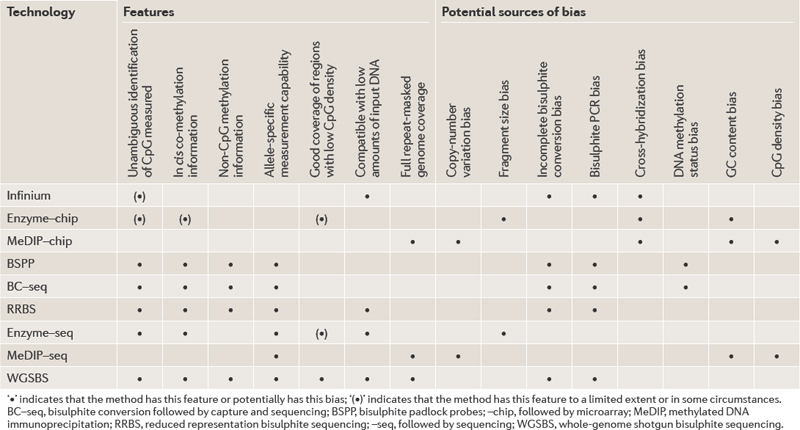

# GALAXY WORKSHOP on DNA Methylation DATA ANALYSIS

DNA methylation is an epigentic mechanism used by higher eukaryotes and involved. Methylation of DNA is involved in eg. gene expression, X-Chromosome inactivating, imprinting, and gene silencing of germ-line specific gene and repetitive elements. CpG methylations are stably maintained and can be inherited through generations (Uhh ... reminds me on Darwin vs. Lamarck). CpG dinucleotides are often highly methylated (~60-80% in mammals). In contrast non-CpG cytosines are generally unmethylated in differentiated tissues (~0.3-3%). Methylated cytosines tend to spontaneously convert from mC to T through chemical deamination -> selection pressure -> underrepresented in the genome.  

Techniques:

- Reduced representation BS sequencing (RRBS) [(Meissner et al. 2005)](http://nar.oxfordjournals.org/content/33/18/5868.long)
- MethylC-seq [(Lister et al. 2009)](http://www.nature.com/nature/journal/v462/n7271/full/nature08514.html)
- BS-seq [(Cokus et al. 2008)](http://www.nature.com/nature/journal/v452/n7184/full/nature06745.html)
- MeDIP-seq [(Jacinto et al. 2008)](http://www.biotechniques.com/BiotechniquesJournal/2008/January/Methyl-DNA-immunoprecipitation-MeDIP-Hunting-down-the-DNA-methylome/biotechniques-44645.html)  

# Hands on!  
# Bismark BS Mapper  

Publication: [Bismark BS Mapper](http://bioinformatics.oxfordjournals.org/content/27/11/1571.long)

**0. Import the dataset from ENA**

This dataset comes from "Tissue-specific methylomes reveal epigenetic memory in adult mouse tissue". This dataset is available on ENA, which we can import directly into Galaxy:

- "Get Data" -> "EBI SRA"
- Search for "SRR630216", which is a "short read archive" run accession number.
- Select the run.
- Scroll down and select the fastq file in the "Fastq Files Galaxy" column.

This sample is from a mouse heart, though I'll provide additional datasets. Annoyingly, this is an old dataset that uses "Illumina 1.5" encoding. Consequently, I've gone ahead and converted this to "fastqsanger" format for you.

**1. Run FastQC/Trim Galore!**  

- Run FastQC.
- Note the GC distribution and percentage of "T" and "C". Why is this so weird?
- Run "Trim Galore!" (under the "Trim Galore! Advanced Settings", select a "Trim low quality ends..." value of 5 rather than the default 20).

Note that the default base quality score threshold of 20 is...excessive and can be safely lowered in most types of analyses.

Should you decide to do this yourself, please note that you'll need about an hour. You will now have a performed the initial QC and have a trimmed fastq file.

**2. Align with Bismark and mark duplicates**

The genome to use is "GRCm38", which is the most recent version for mouse.
- Under "Bismark settings to use", set "Non strand-specific sequence library" to "yes" and "Non-directional library options" to "Non directional (--non_directional)".
- On the output BAM file, run the "MarkDuplicates" tool. The default options should suffice.

Should you decide to do this yourself, please note that you'll need a few hours. You will now have a sorted BAM file with possible PCR/optical duplicates marked.

**3. Methylation bias and metric extraction**

- Import the BAM files from "Shared Data" -> "Data Libraries" -> "Galaxy Courses" -> "MethylSeq"
- Open [PileOMeth](https://github.com/dpryan79/PileOMeth) and run it on one of the BAM files. First choose "Determine the position-dependent ..." from "What do you want to do?". Then run the tool again with the default setting of "Extract methylation metrics", though you might want to also set "Merge cytosine metrics..." to "yes".

You now have a visualization of if/where there's methylation bias and modified bedGraph files with methylation metrics in them. This could be used for downstream statistical analysis (typically in an R package).

**4. Make methylation tracks in bigWig format**

- Strip the header and the last two columns from the file (you can use the "Text reformatting" tool with the following "program"):

    BEGIN{OFS="\t"}{if(NR>1) print $1, $2, $3, $4}

This is just a quick method of writing a tab-delimited file (OFS="\t") skipping the first line (NR>1) and using only the first four columns (print $1, $2, $3, $4).
- Use the output of step #1 with the "Wig/bedGraph-to-bigWig" converter.  

**5. Visualize**

- Import other samples/convert to bigWig from "Shared Data"
- Import "mm10_genes.bed" from "Shared Data"
- Plot some correlations, or compute methylation around genes/TSS/TES, maybe do some clustering (beware of what this entails), play around with the data.

