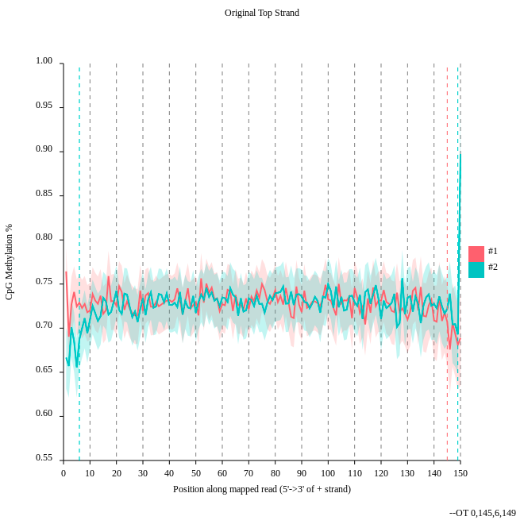

# Galaxy workshop on DNA Methylation data analysis

> ### Agenda
>
> In this tutorial we will:
>
> 1. [Load data and quality control](#Load\ data\ and\ quality\ control)
> 2. [Align the data](#alignment)
> 3. [Methylation bias and metric extraction](#Methylation\ bias\ and\ metric\ extraction)
> 4. [Visualize the mapped data](#visualization)
> 5. [Metilene](#Metilene)
> 
> 
> {: .agenda}


# Load data and quality control
> ### :pencil2: Hands-on: Get the data and look at the quality
> 
> We load now one example data set which will be used for the tutorial. 
>
> 1. Load the two example dataset from our data library: subset_1.fastq.gz and subset_2.fastq.gz. 
>   
>
> 2. **FastQC**
> 
>    > ### :bulb: Tip: Search for tools
>    >
>    > * Clink into the search field on the left
>    > * Type **fastqc**
>    > * Select **FastQC**
>    > * Select the uploaded datasets ```subset_1.fastq.gz``` and ```subset_1.fastq.gz``` as the fastq files
>    {: .tip}
>   The computation will take a while and we continue with the theory. 
>
> 3. Go to the webpage result page and have a closer look at 'Per base sequence content'
>
>    
>
>    > ### :question: Questions
>    >
>    > - Note the GC distribution and percentage of "T" and "C". Why is this so weird?
>    > - Is everything as expected?
>    > 
>    >
>    >    <details>
>    >    <summary>Click to view answers</summary>
>    >    <ol type="1">
>    >    <li>The attentive audience of the theory part knows: Every C-meth stays a C and every normal C becomes a T during the bisulfite conversion. </li>
>    >    <li>Yes it is. Always be careful and have the specific characteristics of your data in mind during the interpretation of FastQC results.</li>
>    >    </ol>
>    >    </details>
>    {: .question}
>
{: .hands_on}

# Alignment

> ### :pencil2: Hands-on: Mapping with bwameth
> 
> We will map now the imported dataset against a reference genome.
> 
> 1. **Galaxy** :wrench:: Search for the tool ```bwameth```
> 2. **bwameth** :wrench:: Select for the option ```Select a genome reference from your history or a built-in index?``` ```Use a built-in idex``` and here the human ```hg38``` genome.
> 3. **bwameth** :wrench:: Choose for the option ```Is this library mate-paired?``` ```Paired-end``` and use the two imported datasets as an input. 
> 4. **bwameth** :wrench:: Please do not compute the alignment now because it would need about 45 minutes. We provide for you a precomputed alignment in the data library. Import ```aligned_subset.bam``` to your history.
>
>    > ### :question: Questions
>    >
>    > -  Why we need other alignment tools for bisulfite sequencing data?
>    > 
>    >
>    >    <details>
>    >    <summary>Click to view answers</summary>
>    >    <ol type="1">
>    >    <li>You may have noticed that all the C's are C-meth's and a T can be a T or a C. A mapper for methylation data needs to find out what is what.</li>
>    >    </ol>
>    >    </details>
>    {: .question}
>
{: .hands_on}

# Methylation bias and metric extraction

> ### :pencil2: Hands-on: Methylation bias
> 
> We will extract the methylation on the resulting BAM file of the alignment step.
> 
> 1. **Galaxy** :wrench:: Search for the tool ```PileOMeth```
> 2. **PileOMeth** :wrench:: Choose at the first option ```Load reference genome from``` ```Local cache``` and for ```Using reference genome``` the value ```hg38```.
> 3. **PileOMeth** :wrench:: Select for the option ```sorted_alignments.bam``` the imported bam file which was the result of the ```bwameth``` alignment.
> 4. **PileOMeth** :wrench:: Use for ```What do you want to do?``` the value ```Determine the position-dependent methylation bias in the dataset, producing diagnostic SVG images```.
> 5. **PileOMeth** :wrench:: Click ```Execute```.
>
>    
>
>    > ### :question: Questions
>    >
>    > - Consider the ```original top strand``` output. Is there methylation bias in the distribution? 
>    > - If we would trim, what would be the start and the end positions?
>    > 
>    > 
>    >
>    >    <details>
>    >    <summary>Click to view answers</summary>
>    >    <ol type="1">
>    >    <li>The distribution of the methylation is more or less equal. Only at the start and the end we could trim a bit but a +- 5% variation is acceptable. </li>
>    >    <li>To trim the reads we would include for the first strand only the postions 0 to 145, for the second 6 to 149.</li>
>    >    </ol>
>    >    </details>
>    {: .question}
>
> 
{: .hands_on}

# CpG island extraction with PileOMeth 

> ### :pencil2: Hands-on: Methylation extraction with PileOMeth
> 
> We will extract the methylation on the resulting BAM file of the alignment step.
> 
> 1. **Galaxy** :wrench:: Search for the tool 'PileOMeth'
> 2. **PileOMeth** :wrench:: Choose at the first option ```Load reference genome from``` ```Local cache``` and for ```Using reference genome``` the value ```hg38```.
> 3. **PileOMeth** :wrench:: Select for the option ```sorted_alignments.bam``` the imported bam file which was the result of the ```bwameth``` alignment.
> 4. **PileOMeth** :wrench:: Use for ```What do you want to do?``` the value ```Extract methylation metrics from an alignment file in BAM/CRAN format```.
> 5. **PileOMeth** :wrench:: Choose ```Yes``` for the option ```Merge per-Cytosine metrics from CpG and CHG contexts into per-CPG or per-CHG metrics```.
> 5. **PileOMeth** :wrench:: All other options use the default value.
>
> 
>
{: .hands_on}

# Metilene 

> ### :pencil2: Hands-on: Metilene
> 
> We compute now the 
> 
> 1. **Galaxy** :wrench:: Import from the data library the files ```NB1_CpG.meth.bedGraph```, ```NB2_CpG.meth.bedGraph```, ```BT089_CpG.meth.bedGraph```, ```BT126_CpG.meth.bedGraph``` and  ```BT198_CpG.meth.bedGraph```.
> 2. **Galaxy** :wrench:: Search for the tool ```Metilene```
> 3. **Metilene** :wrench:: Choose for the first option ```Input group 1``` the imported files starting with ``NB`` and for ```Input group 2``` the imported files ```Input group 2```.
> 4. **Metilene** :wrench:: Select for the option ```BED file containing regions of interest``` the imported BAM file CpGIslands.bed. //the computed bam file from PileOMeth.
> 5. The computation will take now some time. Maybe it is a good time to do a coffee break :)
> 6. Have a look at the produced pdf document. What is the data showing?
>
> 
>
{: .hands_on}

# Visualization 

> ### :pencil2: Hands-on: 
> 
> We will extract the methylation on the resulting BAM file of the alignment step.
> 
> 0. Convert with awk: 'BEGIN{OFS="\t"}{$1="chr"$1; print}' 
> 1. **Galaxy** :wrench:: Search for the tool ```Wig/BedGraph-to-bigWig```
> 2. **Wig/BedGraph-to-bigWig** :wrench:: Use all computed bedGraph files which were computed by Metilene and transform it to a bigWig file.
> 3. **Galaxy** :wrench:: Search for the tool ```computeMatrix```.
> 4. **computeMatrix** :wrench:: Use the file ```CpGIslands.bed``` and the result of PileOMeth as input for computeMatrix.
> 5. **computeMatrix** :wrench:: Use the converted bigWig file as the score file.
> 6. **Galaxy** :wrench:: Search for the tool ```plotProfile```.
> 7. **plotProfile** :wrench:: Choose for ```Matrix file from the computeMatrix tool``` the computed matrix from the tool ```computeMatrix```. 
> 
>
{: .hands_on}