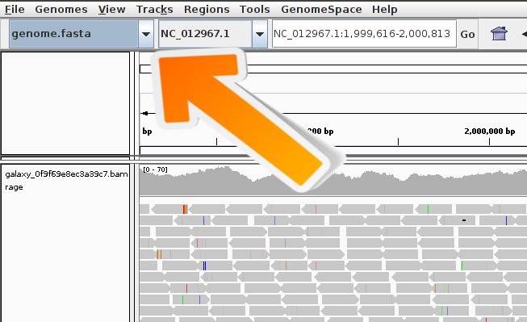

# Mapping of data

1. Load the file xxx into Galaxy. Go to zenodo and download file.fastq and file2.fastq
2. Search in the tool bar on the left the mapper "bowtie2"
3. Select the uploaded dataset file.fastq as the fastq file and choose as a reference genome human hg19
4. Click on "Execute"

# IGV Browser

1. Click on the right history panel on the Bowtie2 item. Here you can see that a BAM file was computed and you can see additional information like how many reads are successfully mapped, how many reads there were in total and so on. 
2. To display the result in IGV open the IGV browser local on your computer. Afer it, check if the needed reference genome is available. 
. If it is not there check if its available via "More...". Is this is not the case you can add it manually via the menu "Genomes -> Load Genome from..."
3. Now go back to Galaxy and choose in the history on the computed bowtie2 results and click on "display with IGV local".
4.  
