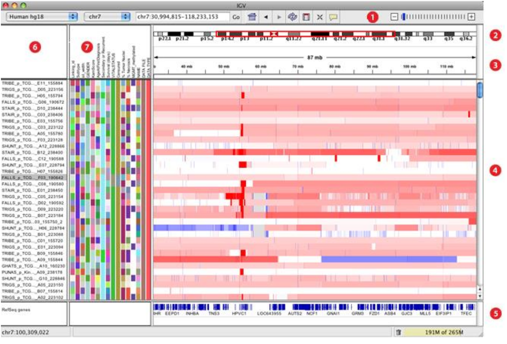

# Mapping of data
In the following we will consider two datasets. One will be a "bad" one the other a "good" in 
terms of the data quality. We want to show how the quality of 
your reads can influence the result of the mapping and thereof how good your insight will be.

We start with the bad dataset.

1. Load the dataset from 
[zenodo](https://zenodo.org/record/61771/files/GSM461180_treat_paired_subset_2.fastq) into Galaxy.

2. Search in the tool bar on the left the mapper "bowtie2"

3. The dataset can not be selected because a "fastqsanger" format is accepted as the only 
valid format. To change the format, click in the history at your dataset on the 'pencil' button. 
Select the tab 'data type' and choose as a new data type 'fastqsanger'. Click on save and go
 back to bowtie2. Now the dataset should be in the list of fastq files that can be processed.

4. Select the uploaded dataset GSM461180_treat_paired_subset_2.fastq as the fastq file.

5. Choose as a reference genome human hg19. To do that, select 'Use a built-in genome index'
 for the item 'Will you select a reference genome from your history or use a built-in index?' 
 and for the item 'Select reference genome' the human hg19 genome. 

6. All other parameters use there default value. Click on "Execute". It will take now a while
 to process this dataset. Please upload in the meanwhile the 'good' dataset to galaxy and change 
 its format to 'fastqsanger' as it is described above.

7. Click on the right history panel on the Bowtie2 item. Here you can see that a BAM file was 
computed and you can see additional information like how many reads are successfully mapped, 
how many reads there were in total and so on. 

8. Look careful at the information which is given here. Is everything as expected?

```
100000 reads; of these: 100000 (100.00%) were unpaired; 
of these: 99953 (99.95%) aligned 0 times 
19 (0.02%) aligned exactly 1 time 
28 (0.03%) aligned >1 times 
0.05% overall alignment rate
```

The careful observing reader may have noticed the following: 

```
'100000 (100.00%) were unpaired'
```

which is more or less the worst possible result that could happen.
Before continue reading think a moment what could be the reason.

9. The reason for the bad result is that the wrong reference genome was selected. We used 'hg19' 
for humans but our data is 'Drosophila melanogaster' or short 'dm3'.
Be always careful at this step to select the right reference genome! Even within the same species 
there are multiple versions like for humans 'hg18' and 'hg19'.

10. Rerun now Bowtie2 with the correct reference genome. To speed up things we compute now the 
'good' and the 'bad' fastq file at once. 
For the parameter 'FASTQ file' select the second item 'multiple datasets'. You can select multiple 
datasets by holding the 'Ctrl' button (German keyboard: 'Strg', macOS: 'cmd') on your keyboard and clicking with the 
mouse on the datasets.

# Load data to the IGV Browser

1. Click on the right history panel on the Bowtie2 item.

2. To display the result in IGV open the IGV browser local on your computer. 

3. Choose in the history on the computed Bowtie2 results for the bad mapping and click on 'local' at 'display with IGV'.

4. Now the BAM file should be opened in the IGV browser and the genome should be loaded automatical. If this is not the case 
check if the needed reference genome is available. 

 

If it is not there check if its 
available via "More...". Is this is not the case you can add it manually via the menu 
"Genomes -> Load Genome from..."

# The IGV Browser

The IGV browser helps you to discover insights about your data. It is structured as follows:


1. The tool bar provides access to commonly used functions. The menu
bar and pop-up menus (not shown) provide access to all other functions.

2. The red box on the chromosome ideogram indicates which portion of the
chromosome is displayed. When zoomed out to display the full
chromosome, the red box disappears from the ideogram.

3. The ruler reflects the visible portion of the chromosome. The tick marks
indicate chromosome locations. The span lists the number of bases
currently displayed.

4. IGV displays data in horizontal rows called tracks. Typically, each track
represents one sample or experiment. This example shows methylation,
gene expression, copy number and mutation data.

5. IGV also displays features, such as genes, in tracks. By default, IGV
displays data in one panel and features in another, as shown here. Drag-
and-drop a track name to move a track from one panel to another. Combine
data and feature panels by selecting that option on the General tab of
the Preferences window.

6. Track names are listed in the far left panel. Legibility of the names depends
on the height of the tracks; i.e., the smaller the track the less legible the
name.

7. Attribute names are listed at the top of the attribute panel. Colored blocks
represent attribute values, where each unique value is assigned a unique
color. Hover over a colored block to see the attribute value. Click an
attribute name to sort tracks based on that attribute value.