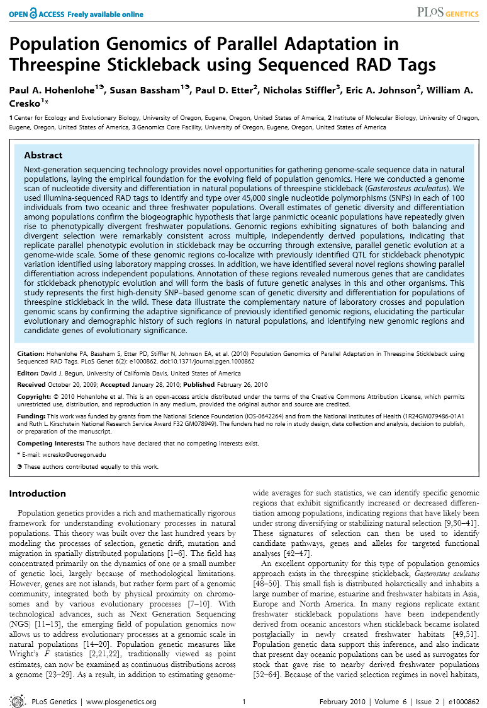
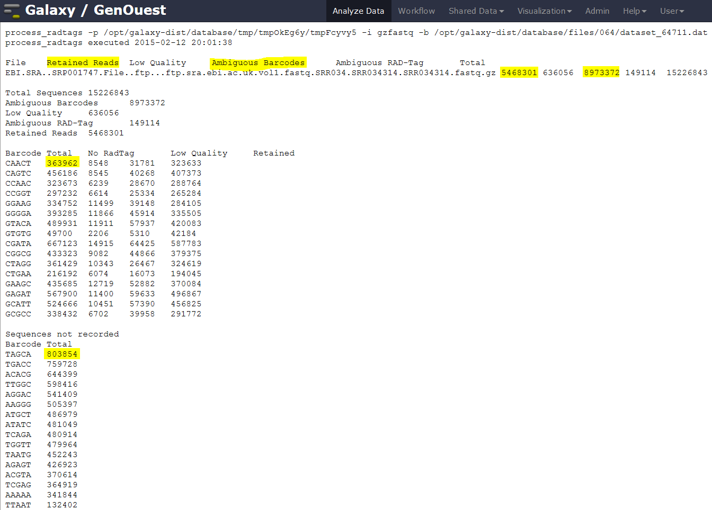
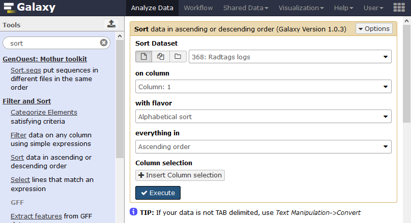

# Introduction

In the study of [Hohenlohe *et al.* 2010](http://journals.plos.org/plosgenetics/article?id=10.1371/journal.pgen.1000862), a genome scan of nucleotide diversity and differentiation in natural populations of threespine stickleback *Gasterosteus aculeatus* was conducted. Authors used Illumina-sequenced RAD tags to identify and type over 45,000 single nucleotide polymorphisms (SNPs) in each of 100 individuals from two oceanic and three freshwater populations.

We here proposed to re-analyze these data at least until the population genomics statistics calculation step using STACKS pipeline. Existing *Gasterosteus aculeatus* draft genome will not be used here so the analysis will be performed de novo. In a de novo RAD-seq data analysis, the reads are aligned one on each other to create stacks and then clustered to build loci. A reference approach can also be conducted (see [ref_based tutorial](ref_based_rad.md), allowing to work on existing assembled loci).

> ### Agenda
>
> In this tutorial, we will deal with:
>
> 1. [Pretreatments](#pretreatments)
> 2. [Building loci using STACKS](#building-loci-using-stacks)
> 3. [Calculate population genomics statistics](#calculate-population-genomics-statistics)

# Pretreatments

## Data upload

The original data is available at NCBI SRA ENA under accession number [SRR034310](https://trace.ncbi.nlm.nih.gov/Traces/sra/?run=SRR034310) as part of the NCBI SRA ENA study accession number [SRP001747](https://trace.ncbi.nlm.nih.gov/Traces/sra/?study=SRP001747). 

We will look at the first run SRR034316 out of 7:

- Here are 16 samples from 2 populations, 8 from Bear Paw (freshwater) and 8 from Rabbit Slough (oceanic)

You can directly used archive from the Sequence Read Archive (SRA) for raw reads.

To download all training datasets (i.e reads, population map file and barcodes file), you can use the corresponding [CeSGO hub](https://cesgo.genouest.org/resources/370/supportingdocs) repository.

> ### :pencil2: Hands-on: Data upload
>
> 1. Create a new history for this RAD-seq exercise. If you are not inspired, you can name it "STACKS 1.42 RAD: population genomics with reference genome" for example...
> 2. Import FASTQ files (*e.g.*  [`SRR034310`](ftp://ftp.sra.ebi.ac.uk/vol1/fastq/SRR034/SRR034310/SRR034310.fastq.gz) as population map information file [`Population_map.txt`](https://cesgo.genouest.org/resources/373/download/Population_map.txt) and barcodes file [`Barcodes_SRR034310`](https://cesgo.genouest.org/resources/374/download/Barcodes_SRR034310.tabular)) from SRA and [CeSGO](https://cesgo.genouest.org/)
>
>    > ### :nut_and_bolt: Comments
>    >    If you are using the [GenOuest Galaxy instance](http://galaxy.genouest.org), you can load the dataset using 'Shared Data' -> 'Data Libraries' -> '1 Galaxy teaching folder' -> 'EnginesOn' -> 'RADseq' -> 'Stickelback population genomics' -> 'SRR034310' 
>
>    > ### :bulb: Tip: Importing data via links
>    >
>    > * Open the Galaxy Upload Manager
>    > * Select **Paste/Fetch Data**
>    > * Paste the following links into the text field
>    >     * ftp://ftp.sra.ebi.ac.uk/vol1/fastq/SRR034/SRR034310/SRR034310.fastq.gz
>    >     * https://cesgo.genouest.org/resources/373/download/Population_map.txt
>    >     * https://cesgo.genouest.org/resources/374/download/Barcodes_SRR034310.tabular
>    > * Press **Start**  
>
>    > ### :bulb: Tip:
>    >    Changing the file type `fastq` to `fastqsanger` once the data file is in your history (warning! Be cautious because there is closed datatpes as `fastqcssanger`). As we know here that the datatype is `fastqsanger`, we can directly change it through the upcoming method. Normally, you need to execute `FastQGroomer` tool to be sure to have a correct `fastqsanger` file format. And if you don't know how your quality score is encoded on raw fastQ files, please, use the `FastQC` tool to determine it!
>    >
>    >    * Click on the pencil button displayed in your dataset in the history
>    >    * Choose **Datatype** on the top
>    >    * Select `fastqsanger`
>    >    * Press **Save**
> 
> 

The sequences are raw sequences from the sequencing machine, without any pretreatments. They need to be demultiplexed. To do so, we can use the Process Radtags tool from STACKS.

## Demultiplexing reads

For demultiplexing, we use the Process Radtags tool from [STACKS](http://www.g3journal.org/content/1/3/171.full) . 

> ### :pencil2: Hands-on: Demultiplexing reads
>
> 1. **Process Radtags** :wrench:: Run `Stacks: process radtags` on FastQ file to demultiplex the reads. You have to 1/point a tabular file mapping sample names and barcodes, 2/select the sbfI enzyme used for restriction. Finally, ask to capture discarded reads to a file and execute.
>
> 
>
> As we are exporting demultiplexed reads in data collections, you have hidden datasets on your history. These datasets are in fact symlinks on the data collections and are by default hidden on the history. If you want to see these datasets, you can click on the `hidden` statement just under the history name.
>
>    > ### :question: Questions
>    >
>    > 1. How many reads where on the original dataset?
>    > 2. How many are kept?
>    > 3. Can you try to explain the reason why we loose a lot of reads here?
>    > 4. What kind of infiormation this result gives concerning the upcoming data analysis and the barcodes design in general ?
>    >
>    >    

>    >    
Click to view answers

>    >    <ol type="1">
>    >    <li>8895289 total reads</li>
>    >    <li>8139531 retained reads</li>
>    >    <li>Exploring the `results.log` file allows you to see that there is no sequences filtered for low quality statement. As we don't specify the corresponding advanced option, Process radtags didn't apply quality related filtering. So here, all not retained sequences are not recorded because of an ambiguous barcode or an ambiguous RAD-Tag. This means that some barcodes are not exactly what was specified on the barcode file and that sometimes, no SbfI restriction enzyme site was found. This can be due to some sequencing problems but here, this is also due to the addition, in the original sequencing library, of RAD-seq samples from another study. This is something often used to avoid having too much sequences beginning with the exact same nucleotides sequences and thus Illumina related issues during sequencing and clusters analysis </li>
>    >    <li>Sequencing quality is essential! Each time your sequencing quality decreases, you loose data and thus essential biological information!</li>
>    >    </ol>
>    >    

> 
>
> 2. **Process Radtags** :wrench:: Re-Run `Stacks: process radtags` on FastQ file playing with parameters 
>
> In `advanced options`, activate the `Discard reads with low quality scores` option and play with the score limit (default vs 20 for example) and examine the change in reads retained. Note that you can play also with the sliding window score threshold, by default 15% of the length of the read. This sliding window parameter allows notably the user to deal with the declining quality at the 3' end of reads.
>
> 
>
> 
>
> To do that, you can use data handling Galaxy tools to cut the interesting lines of each `result.log with Stacks: process radtags` files OR, as I made, just copy/paste these lines on the Galaxy upload tool using Paste/fetch data section and modifying the File header by sample and filename by Score 10 / Score 20 and noscorelimit for example... Before Starting the upload, you can select the `Convert spaces to tabs` option through the `Upload configuration` wheel.
>
> 
>
> 
>
> You can use the `Charts` functionality through the Visualize button reachable on the `Radtags logs` file you just generated. 
>
> 
>
> If like me you don't have payed attention to the organization of you file for the graphical representation you obtain a non optimal bars diagram with a not intelligent X-axis ordering. There is a lot of diffferent manner to fix this. You can use the copy/paste "bidouille" like seen previously, or you can use Galaxy tools to manipulate the `radtags logs` (did you change the filename from `pasted entry` to another label ?) file to generate a better graph. For example, you can use `Select lines that match an expression` tool to select rows then use the `Concatenate datasets tail-to-head` tool to reorganize these lines in a new file... OR, as I made, you can just sort the file using the first column.
>
> 
>
> And you obtain a file like this one, ready to generate a beautiful and smart bar diagram!
>
> 
>
> 
>
>Using filter like `clean data, remove any read with an uncalled base` has here few impact:
>
> 
>

The demultiplexed sequences are raw sequences from the sequencing machine, without any pretreatments. They need to be controlled for their quality.

## Quality control

For quality control, we use similar tools as described in [NGS-QC tutorial](../../NGS-QC/tutorials/dive_into_qc): [FastQC](http://www.bioinformatics.babraham.ac.uk/projects/fastqc/).

> ### :pencil2: Hands-on: Quality control
>
> 1. **FastQC** :wrench:: Run FastQC on FastQ files to control the quality of the reads
>
>    > ### :question: Questions
>    >
>    > 1. What is the read length?
>    >
>    >    

>    >    
Click to view answers

>    >    <ol type="1">
>    >    <li>The read length is 32 bp</li>
>    >    </ol>
>    >    

>

As it exists a draft genome for *Gasterosteus aculeatus*, we can use this information and map the sequences on this genome to identify polymorphism.

# Building loci using STACKS

Run `Stacks: De novo map` Galaxy tool. This program will run ustacks, cstacks, and sstacks on the members of the population, accounting for the alignments of each read.

> ### :nut_and_bolt: Comment
>
> Information on denovo_map.pl and its parameters can be found online: http://creskolab.uoregon.edu/stacks/comp/denovo_map.php.

> **Stacks: De novo map** :wrench:: Run **Stacks** selecting the population usage. Specify each individual as a sample, a population map and a minimum depth of coverage of 3.
>
>    

>    > ### :nut_and_bolt: Comment
>    >
>    > If you are using a file presenting population information and individual name in a different manner than expected by STACKS, you can use Galaxy tools like `Regex Replace` or `Cut columns from a table` to generate it.

> Once Stacks has completed running, investigate the output files: `result.log` and `catalog.*` (snps, alleles and tags).
>
>    
>

# Calculate population genomics statistics
> **Stacks: populations** :wrench:: Run the last step of **Stacks: De novo map** pipeline specifying data filtering options (minimum percentage of individuals in a population required to process a locus for that population: 0.75 , output options (VCF and Structure) and enabling SNP and haplotype-based F statistics calculation.
>
>    
>
>    

>	Now look at the output in the file `batch_1.sumstats` nammed `SNP and Haplotype-based F statistics with Stacks: populations ...` on your history. This file is also reachable on the data collection nammed `Full output from denovo_map .....` with his original name `batch_1.sumstats`. There are a large number of statistics calculated at each SNP, so use Galaxy tools like filter, cut, and sort to focus on some.

>
>    > ### :question: Question
>    >
>    > 1. What is the maximum value of FST at any SNP?
>    > 2. How many SNPs reach this FST value?
>    >
>    >    

>    >    
Click to view answers

>    >    <ol type="1">
>    >    <li>0.75</li>
>    >    <li>3500</li>
>    >    </ol>
>    >    

# Conclusion

In this tutorial, we have analyzed real RAD sequencing data to extract useful information, such as which loci are candidate regarding the genetic differentiation between freshwater and oceanic Stickelback populations. To answer these questions, we analyzed RAD sequence datasets using a de novo RAD-seq data analysis approach. This approach can be sum up with the following scheme:

