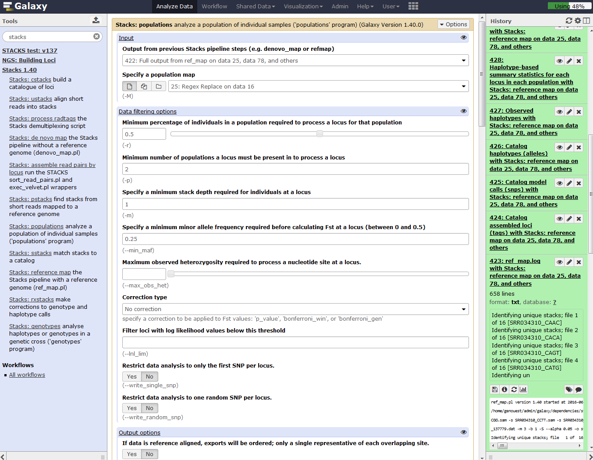

# Introduction

In the study of [Hohenlohe *et al.* 2010](http://journals.plos.org/plosgenetics/article?id=10.1371/journal.pgen.1000862), a genome scan of nucleotide diversity and differentiation in natural populations of threespine stickleback *Gasterosteus aculeatus* was conducted. Authors used Illumina-sequenced RAD tags to identify and type over 45,000 single nucleotide polymorphisms (SNPs) in each of 100 individuals from two oceanic and three freshwater populations.

We here proposed to re-analyze these data at least until the population genomics statistics calculation step using STACKS pipeline. *Gasterosteus aculeatus* draft genome will be used here as reference genome. In a reference-based RAD-seq data analysis, the reads are aligned (or mapped) against a reference genome to constrain our analysis to focus on already discovered loci. A de-novo approach can also be conduct (see [de_novo tutorial]()), enhancing discoverability of new loci of interest but also of false positive one.

> ### Agenda
>
> In this tutorial, we will deal with:
>
> 1. [Pretreatments](#pretreatments)
> 2. [Mapping](#mapping)
> 3. [SNP calling from RAD tags](#snp-calling-from-radtags)
> 4. [Calculate population genomics statistics](#pop-genomics-stat)
> {: .agenda}

# Pretreatments

## Data upload

The original data is available at NCBI SRA ENA under accession number [SRR034316](https://trace.ncbi.nlm.nih.gov/Traces/sra/?run=SRR034316) as part of the NCBI SRA ENA study accession number [SRP001747](https://trace.ncbi.nlm.nih.gov/Traces/sra/?study=SRP001747). 

We will look at the first run SRR034316 out of 7:

- Here are 16 samples from 2 populations

You can directly used archive from the Sequence Read Archive (SRA) for raw reads.

To download all training datasets (i.e reads, reference genome, population map file and barcodes file), you need to use the corresponding Zenodo repository.

> ### :pencil2: Hands-on: Data upload
>
> 1. Create a new history for this RAD-seq exercise. If you are not inspired, you can name it "STACKS 1.42 RAD: population genomics with reference genome" for example...
> 2. Import FASTQ file (*e.g.*  [`SRR034310`](https://zenodo.org/record/218574/files/ftp___ftp.sra.ebi.ac.uk_vol1_fastq_SRR034_SRR034310_SRR034310.fastq.gz)) and corresponding reference genome FASTA file [`Reference_genome_11_chromosomes`](https://zenodo.org/record/218574/files/Reference_genome_11_chromosomes.fa)) as population map information file [`Population_map.txt`](https://zenodo.org/record/218574/files/Population_map)) and barcodes file [`Barcodes_SRR034310`](https://zenodo.org/record/218574/files/Barcodes_SRR034310.tabular)) from [Zenodo](http://doi.org/10.5281/zenodo.218574)
>
>    > ### :nut_and_bolt: Comments
>    > If you are using the [GenOuest Galaxy instance](http://galaxy.genouest.org), you can load the dataset using 'Shared Data' <i class="fa fa-long-arrow-right"></i> 'Data Libraries' <i class="fa fa-long-arrow-right"></i> '1 Galaxy teaching folder' <i class="fa fa-long-arrow-right"></i> 'EnginesOn' <i class="fa fa-long-arrow-right"></i> 'RADseq' <i class="fa fa-long-arrow-right"></i> 'Stickelback population genomics' <i class="fa fa-long-arrow-right"></i> 'SRR034310' 
>    {: .comment}
>
>    > ### :bulb: Tip: Importing data via links
>    >
>    > * Copy the link location
>    > * Open the Galaxy Upload Manager
>    > * Select **Paste/Fetch Data**
>    > * Paste the link into the text field
>    > * Press **Start**    
>    {: .tip}
>
>    > ### :bulb: Tip: Changing the file type `fastq` to `fastqsanger` once the data file is in your history. As we know here that the datatype is fastqsanger, we can directly change it through the upcoming method. Normally, you need to execute FastQGroomer to be sure to have a correct fastqsanger file format. And if you don't know how your quality score is encoded on raw fastQ files, please, use the FastQC tool to determine it!
>    >
>    > * Click on the pencil button displayed in your dataset in the history
>    > * Choose **Datatype** on the top
>    > * Select `fastqsanger`
>    > * Press **Save**
>    {: .tip}
> 
>    As default, Galaxy takes the link as name. It also do not link the dataset to a database or a reference genome.
> 
>    > ### :nut_and_bolt: Comments
>    > - Add the "stickleback" custom build from the Fasta reference genome file
>    > - Edit the "Database/Build" to select "stickleback"
>    > - Rename the datasets according to the samples
>    {: .comment}
> 
{: .hands_on}

The sequences are raw sequences from the sequencing machine, without any pretreatments. They need to be demultiplexed. To do so, we can use the Process Radtags tool from STACKS.

## Demultiplexing reads

For demultiplexing, we use the Process Radtags tool from [STACKS](http://www.g3journal.org/content/1/3/171.full) . 

> ### :pencil2: Hands-on: Demultiplexing reads
>
> 1. **Process Radtags** :wrench:: Run `Stacks: process radtags` on FastQ file to demultiplex the reads
>
> 
>
>
>    > ### :question: Questions
>    >
>    > 1. How many reads where on the original dataset?
>    > 2. How many are kept?
>    > 3. Can you try to explain the reason why we loose a lot of reads here?
>    > 4. What kind of infiormation this result gives concerning the upcoming data analysis and the barcodes design in general ?
>    >
>    >    

>    >    
Click to view answers

>    >    <ol type="1">
>    >    <li>8895289 total reads</li>
>    >    </ol>
>    >    <ol type="2">
>    >    <li>8139531 retained reads</li>
>    >    </ol>
>    >    <ol type="3">
>    >    <li>Exploring the `results.log` file allows to see that there is no sequences filtered for low quality statement. As we don't specify the corresponding advanced option, Process radtags didn't apply quality related filtering. So here, all not retained sequences are not recorded because of an ambiguous barcode or an ambiguous RAD-Tag. This means that some barcodes are not exactly what was specified on the barcode file and that sometimes, no SbfI restriction enzyme site was found. This can be due to some sequencing problems but here, this is also due to the addition, in the original sequencing library, of RAD-seq samples from another study. This is something often used to avoid having too much sequences beginning with the exact same nucleotides sequences and thus Illumina related issues during sequencing and clusters analysis </li>
>    >    </ol>
>    >    <ol type="4">
>    >    <li>Sequencing quality is essential! Each time your sequencing quality decreases, you loose data and thus essential biological information!</li>
>    >    </ol>
>    >    

>    {: .question}
> 
>
> 2. **Process Radtags** :wrench:: Re-Run `Stacks: process radtags` on FastQ file playing with parameters 
>
> In `advanced options`, activate the `Discard reads with low quality scores` option and play with the score limit (default vs 20 for example) and examine the change in reads retained. Note that you can play also with the sliding window score threshold, by default 15% of the length of the read. This sliding window parameter allows notably the user to deal with the declining quality at the 3' end of reads.
>
> 
>
> 
>
> To do that, you can use data handling Galaxy tools to cut the interesting lines of each `result.log with Stacks: process radtags` files OR, as I made, just copy/paste these lines on the Galaxy upload tool using Paste/fetch data section and modifying the File header by sample and filename by Score 10 / Score 20 and noscorelimit for example... Before Starting the upload, you can select the `Convert spaces to tabs` option through the `Upload configuration` wheel.
>
> 
>
> 
>
> You can use the `Charts` functionality through the Visualize button reachable on the `Radtags logs` file you just generated. 
>
> 
>
> If like me you don't have payed attention to the organization of you file for the graphical representation you obtain a non optimal bars diagram with a not intelligent X-axis ordering. There is a lot of diffferent manner to fix this. You can use the copy/paste "bidouille" like seen previously, or you can use Galaxy tools to manipulate the `radtags logs` (did you change the filename from `pasted entry` to another label ?) file to generate a better graph. For example, you can use `Select lines that match an expression` tool to select rows then use the `Concatenate datasets tail-to-head` tool to reorganize these lines in a new file... OR, as I made, you can just sort the file using the first column.
>
> 
>
> And you obtain a file like this one, ready to generate a beautiful and smart bar diagram!
>
> 
>
> 
>
>Using filter like `clean data, remove any read with an uncalled base` has here few impact:
>
> 
>

The demultiplexed sequences are raw sequences from the sequencing machine, without any pretreatments. They need to be controlled for their quality.

## Quality control

For quality control, we use similar tools as described in [NGS-QC tutorial](../../NGS-QC/tutorials/dive_into_qc): [FastQC](http://www.bioinformatics.babraham.ac.uk/projects/fastqc/).

> ### :pencil2: Hands-on: Quality control
>
> 1. **FastQC** :wrench:: Run FastQC on FastQ files to control the quality of the reads
>
>    > ### :question: Questions
>    >
>    > 1. What is the read length?
>    >
>    >    

>    >    
Click to view answers

>    >    <ol type="1">
>    >    <li>The read length is 32 bp</li>
>    >    </ol>
>    >    

>    {: .question}
>

As it exists a draft genome for *Gasterosteus aculeatus*, we can use this information and map the sequences on this genome to identify polymorphism.

# Mapping

To make sense of the reads, their positions within *Gasterosteus aculeatus* genome must be determined. This process is known as aligning or 'mapping' the reads to the reference genome.

> ### :nut_and_bolt: Comment
>
> Do you want to learn more about the principles behind mapping? Follow our [training](../../NGS-mapping)
> {: .comment}

Here we will use BWA. BWA is a fast light-weighted tool that aligns relatively short sequences (queries) to a sequence database (large), such as the human reference genome. It is developed by Heng Li at the Sanger Insitute.

*[Li et Durbin, Bioinformatics, 2009](https://www.ncbi.nlm.nih.gov/pubmed/19451168)*

> 1. **BWA** :wrench:: Run **BWA** with the Commonly Used settings after specifying the fasta reference genome file from history, the fact that you are working with single-end libraries and finally the collection of demultiplexed FastQ files.
>
>    

**BWA** generates BAM files with the mapped reads.

We next want to run Stacks on the freshwater and anadromous populations.

# Building loci using STACKS

Run `Stacks: Reference map` Galaxy tool. This program will run pstacks, cstacks, and sstacks on the members of the population, accounting for the alignments of each read.

> ### :nut_and_bolt: Comment
>
> Information on ref_map.pl and its parameters can be found online: http://creskolab.uoregon.edu/stacks/comp/ref_map.php.
> {: .comment}

> 1. **Stacks: Reference map** :wrench:: Run **Stacks** selecting the population usage. Specify each BWA-aligned individual as a sample, a population map and a minimum depth of coverage of 3.
>
>    

>    > ### :nut_and_bolt: Comment
>    >
>    > If you are using a file presenting population information and individual name in a different manner than expected by STACKS, you can use Galaxy tools like `Regex Replace` or `Cut columns from a table` to generate it.
>    > {: .comment}

> Once Stacks has completed running, investigate the output files: `result.log` and `catalog.*` (snps, alleles and tags). Notice that each locus now has a chromosome/base pair specified in each of the *tags.tsv files and in the catalog files.
>
>    
>
> 2. **Stacks: populations** :wrench:: Run the last step of **Stacks: Reference map** pipeline specifying data filtering options (minimum percentage of individuals in a population required to process a locus for that population: 0.75 , output options (VCF and Structure) and enabling SNP and haplotype-based F statistics calculation.
>
>    

>	Now look at the output in the file `batch_1.sumstats` nammed `SNP and Haplotype-based F statistics with Stacks: populations ...` on your history. This file is also reachable on the data collection nammed `Full output from ref_map .....` with his original name `batch_1.sumstats`. There are a large number of statistics calculated at each SNP, so use Galaxy tools like filter, cut, and sort to focus on some. What is the maximum value of FST at any SNP? How many SNPs reach this FST value?

> ### :pencil2: (Optional) Hands-on: Map other datasets
>
> You can do the same process on the other sequence files available on [Zenodo](http://dx.doi.org/10.5281/zenodo.61771)
> 
> - Paired-end data
>     - `[GSM461178_untreat_paired_subset_1](GSM461178_untreat_paired_subset_1.fastq)` and `[GSM461178_untreat_paired_subset_2](GSM461178_untreat_paired_subset_2.fastq)`
>     - `[GSM461180_treat_paired_subset_1](GSM461180_treat_paired_subset_1.fastq)` and `[GSM461180_treat_paired_subset_2](GSM461180_treat_paired_subset_2.fastq)`
>     - `[GSM461181_treat_paired_subset_1](GSM461181_treat_paired_subset_1.fastq)` and `[GSM461181_treat_paired_subset_2](GSM461181_treat_paired_subset_2.fastq)`
> - Single-end data
>     - `[GSM461176_untreat_single_subset](GSM461176_untreat_single_subset.fastq)`
>     - `[GSM461179_treat_single_subset](GSM461179_treat_single_subset.fastq)`
>     - `[GSM461182_untreat_single_subset](GSM461182_untreat_single_subset.fastq)`
>
> This is really interesting to redo on the other datasets, specially to check how the parameters are inferred given the different type of data.
{: .hands_on}

## Inspection of TopHat results

However, the datasets we used were a subset of the original data. They are then too small to give you a good impression of how real data looks like. So we have run TopHat for you on the real datasets. We extracted only the reads mapped to chromosome 4 of *Drosophila*.

> ### :pencil2: Hands-on: Inspection of TopHat results
>
> 1. Create a new history
> 2. Import from [Zenodo](http://dx.doi.org/10.5281/zenodo.61771) into the new history the following files:
>    - [`GSM461177_untreat_paired_chr4.bam`](https://zenodo.org/record/61771/files/GSM461177_untreat_paired_chr4.bam)
>    - [`GSM461177_untreat_paired_deletions_chr4.bed`](https://zenodo.org/record/61771/files/GSM461177_untreat_paired_deletions_chr4.bed)
>    - [`GSM461177_untreat_paired_insertions_chr4.bed`](https://zenodo.org/record/61771/files/GSM461177_untreat_paired_insertions_chr4.bed)
>    - [`GSM461177_untreat_paired_junctions_chr4.bed`](https://zenodo.org/record/61771/files/GSM461177_untreat_paired_junctions_chr4.bed)
> 
>    > ### :nut_and_bolt: Comments
>    > If you are using the [Freiburg Galaxy instance](http://galaxy.uni-freiburg.de), you can load the dataset using 'Shared Data' <i class="fa fa-long-arrow-right"></i> 'Data Libraries' <i class="fa fa-long-arrow-right"></i> 'Galaxy Courses' <i class="fa fa-long-arrow-right"></i> 'RNA-Seq' <i class="fa fa-long-arrow-right"></i> 'sample_tophat2_out'
>    {: .comment}
>
> 3. **IGV** :wrench:: Visualize this BAM file and the three BED files, particularly the region on chromosome 4 between 560 kb to 600 kb (`chr4:560,000-600,000`)
>
>    > ### :nut_and_bolt: Comment
>    > - Change the data type from "tabular" to "bed"
>    > - Rename the datasets according to the samples
>    {: .comment}
>
>    > ### :nut_and_bolt: Comment
>    >
>    > Check [IGV documentation](http://software.broadinstitute.org/software/igv/AlignmentData)
>    {: .comment}
>
>    > ### :question: Question
>    >
>    > 1. Which information does the `GSM461177_untreat_paired_junctions_chr4.bed` BED file contain?
>    > 2. How is this information represented in the BED file? And in IGV?
>    > 3. Where is the "JUNC00013368" junction situated? What is its score?
>    > 4. How many reads are concerned by the "JUNC00013368" junction, visible when we zoom on `chr4:568,476-571,814`? Can you relate that to the score?
>    > 5. And how many are concerned by the "JUNC00013369" junction? 
>    >
>    >    

>    >    
Click to view answers

>    >    <ol type="1">
>    >    <li>`GSM461177_untreat_paired_junctions_chr4.bed` BED file contain the splicing events, *i.e.* when at least a single read splits across two exons in the alignment track</li>
>    >    <li>The BED file is a tabular with: Chrom, Start, End, Name, Score, Strand, ThickStart, ThickEnd, ItemRGB, BlockCount, BlockSizes, BlockStart. In IGV, the junctions are represented by an arc from the beginning to the end of the junction. The color of the arc represent the strand on which the junction is found. The height of the arc, and its thickness, are proportional to the depth of read coverage. </li>
>    >    <li>The "JUNC00013368" junction starts at 568,736 and ends at 569,905. It has a score of 6.</li>
>    >    <li>6 reads split across "JUNC00013368", exactly the score</li>
>    >    <li>8 reads split across "JUNC00013369". 3 reads are also mapped in the junction chromosome part: these reads are then part of the exon and be implied in a different splicing.</li>
>    >    </ol>
>    >    

>    {: .question}
>
> 3. **IGV** :wrench:: Unzoom to `chr4:560,000-600,000` and inspect the splice junctions using a **Sashimi plot**
>
>    > ### :bulb: Tip: Creation of a Sashimi plot
>    >
>    > * Right click on the BAM file
>    > * Select **Sashimi Plot** from the context menu
>    {: .tip}
>
>    
>
>    > ### :question: Question
>    >
>    > 1. What does the bar graph represent? And the numbered line?
>    > 2. What does the number means?
>    > 3. What is the name of the junction where 10 reads split? What is its position on the genome?
>    > 
>    >    

>    >    
Click to view answers

>    >    <ol type="1">
>    >    <li>The coverage for each alignment track is plotted as a bar graph. Arcs representing splice junctions connecting exons</li>
>    >    <li>Arcs display the number of reads split across the junction (junction depth). </li>
>    >    <li>JUNC00013370 starts at 574338 and ends at 578091.</li>
>    >    </ol>
>    >    

>    {: .question}
>
>    > ### :nut_and_bolt: Comment
>    >
>    > Check [IGV documentation on Sashimi plots](http://software.broadinstitute.org/software/igv/Sashimi) to find some clues
>    {: .comment}
>
> 4. **IGV** :wrench:: Look around to find other regions with interesting junctions, *e.g.* `chr4:870,000-940,000`
{: .hands_on}

# Analysis of the differential gene expression

To identify exons that are regulated by the Pasilla gene, we need to identify genes and exons which are differentially expressed between samples with PS gene depletion and control samples.

## Count the number of reads per annotated gene

To compare the expression of single genes between different conditions (*e.g.* with or without PS depletion), an first essential step is to quantify the number of reads per gene. [**HTSeq-count**](http://www-huber.embl.de/users/anders/HTSeq/doc/count.html) is one of the most popular tool for gene quantification.

To quantify the number of reads mapped to a gene, an annotation of the genomic features as it is in the genes is needed. We already upload on Galaxy the [`Drosophila_melanogaster.BDGP5.78.gtf`](https://zenodo.org/record/61771/files/Drosophila_melanogaster.BDGP5.78.gtf) with the Ensembl gene annotation for *Drosophila melanogaster*.

In principle, the counting of reads overlapping with genomic features is a fairly simple task, but there are some details that need to be decided. **HTSeq-count** offers 3 choices ("union", "intersection_strict" and "intersection_nonempty") to handle read mapping to multiple locations, reads overlapping introns, or reads that overlap more than one genomic feature:

*[HTSeq documentation](http://www-huber.embl.de/users/anders/HTSeq/doc/count.html)*

The recommended mode is "union", which counts overlaps even if a read only shares parts of its sequence with a genomic feature and disregards reads that overlap more than one feature.

> ### :pencil2: Hands-on: Counting the number of reads per annotated gene
>
> 1. Copy the `Drosophila_melanogaster.BDGP5.78.gtf` file from the first history
>
>    > ### :bulb: Tip: Copying a file from an history to an other
>    >
>    > * Click on "View all histories" in the top right
>    > * Drag and drop the file you want to copy to your new history
>    > * Click on "Done" on the top left
>    {: .tip}
>
> 2. **HTSeq-count** :wrench:: Run **HTSeq-count** on the sorted BAM file with
>    - `Drosophila_melanogaster.BDGP5.78.gtf` as "GFF file"
>    - The "union" mode
>    - A "Minimum alignment quality" of 10
> 3. Inspect the result files
>
>    > ### :question: Question
>    >
>    > Which feature has the most reads mapped on it?
>    > 
>    >    

>    >    
Click to view answers

>    >    To display the most found feature, we need first to sort the output file with the feature and the number of reads found for these feature. We do that using Sort tool, on the second column and in descending order. And we found that FBgn0017545 is the feature with the most reads mapped on it with 4,030 reads.
>    >    

>    {: .question}
{: .hands_on}

## Analysis of the differential gene expression

In the previous section, we counted only reads that mapped to chromosome 4 for only one sample. To be able to identify differential gene expression induced by PS depletion, all datasets (3 treated and 4 untreated) must be analyzed with the similar procedure.

You can export a workflow from the previous steps and rerun it on the 7 samples whose the raw sequences are available on [Zenodo](http://dx.doi.org/10.5281/zenodo.61771). For time saving, we run the previous steps for you and obtain 7 count files, available on [Zenodo](http://dx.doi.org/10.5281/zenodo.61771)

These files contain for each gene the number of reads mapped to it. We could compare directly the files and then having the differential gene expression. But the number of sequenced reads mapped to a gene depends on:

- Its own expression level
- Its length
- The sequencing depth
- The expression of all other genes within the sample

Either for within or for inter-sample comparison, the counts need to be normalized. We can then use the Differential Gene Expression (DGE) analysis, whose two basic tasks are:

- Estimate the biological variance using the replicates for each condition
- Estimate the significance of expression differences between any two conditions

This expression analysis is estimated from read counts and attempts are made to correct for variability in measurements using replicates that are absolutely essential accurate results. For your own analysis, we advice you to use at least 3, better 5 biological replicates. 

[**DESeq2**](https://bioconductor.org/packages/release/bioc/html/DESeq2.html) is a great tool for DGE analysis. It takes read counts produced by **HTseq-count** and applies size factor normalization:

- Computation for each gene of the geometric mean of read counts across all samples
- Division of every gene count by the geometric mean
- Use of the median of these ratios as sample's size factor for normalization

Multiple factors can then be incorporated in the analysis. In our example, we have samples with two varying factors:

- Treatment (either treated or untreated)
- Sequencing type (paired-end or single-end)

Here treatment is the primary factor which we are interested in.The sequencing type is some further information that we know about the data that might effect the analysis. This particular multi-factor analysis allows us to assess the effect of the treatment taking also the sequencing type into account.

> ### :pencil2: Hands-on:
>
> 1. Create a new history
> 2. Import the seven count files from [Zenodo](http://dx.doi.org/10.5281/zenodo.61771)
>    - [GSM461176_untreat_single.counts](https://zenodo.org/record/61771/files/GSM461176_untreat_single.counts)
>    - [GSM461177_untreat_paired.counts](https://zenodo.org/record/61771/files/GSM461177_untreat_paired.counts)
>    - [GSM461178_untreat_paired.counts](https://zenodo.org/record/61771/files/GSM461178_untreat_paired.counts)
>    - [GSM461179_treat_single.counts](https://zenodo.org/record/61771/files/GSM461179_treat_single.counts)
>    - [GSM461180_treat_paired.counts](https://zenodo.org/record/61771/files/GSM461180_treat_paired.counts)
>    - [GSM461181_treat_paired.counts](https://zenodo.org/record/61771/files/GSM461181_treat_paired.counts)
>    - [GSM461182_untreat_single.counts](https://zenodo.org/record/61771/files/GSM461182_untreat_single.counts)
>
>    > ### :nut_and_bolt: Comments
>    > If you are using the [Freiburg Galaxy instance](http://galaxy.uni-freiburg.de), you can load the dataset using 'Shared Data' <i class="fa fa-long-arrow-right"></i> 'Data Libraries' <i class="fa fa-long-arrow-right"></i> 'Galaxy Courses' <i class="fa fa-long-arrow-right"></i> 'RNA-Seq' <i class="fa fa-long-arrow-right"></i> 'count_tables'
>    {: .comment}
>
> 3. **DESeq2** :wrench:: Run **DESeq2** with:
>    - "Treatment" as first factor with "treated" and "untreated" as levels and selection of count files corresponding to both levels
>
>       > ### :nut_and_bolt: Comment
>       >
>       > You can select several files by keeping the CTRL (or COMMAND) key pressed and clicking on the interesting files 
>       {: .comment}
>
>    - "Sequencing" as second factor with "PE" and "SE" as levels and selection of count files corresponding to both levels
>
>    > ### :nut_and_bolt: Comment
>    >
>    > File names have all information needed
>    {: .comment}
{: .hands_on}

The first output of **DESeq2** is a tabular file. The columns are:

1.	Gene identifiers
2.	Mean normalized counts, averaged over all samples from both conditions
3.	Logarithm (to basis 2) of the fold change

    The log2 fold changes are based on primary factor level 1 vs. factor level 2. The order of factor levels is then important. For example, for the factor 'Treatment', DESeq2 computes fold changes of 'treated' samples against 'untreated', *i.e.* the values correspond to up- or downregulations of genes in treated samples.

4.	Standard error estimate for the log2 fold change estimate
5.	[Wald](https://en.wikipedia.org/wiki/Wald_test) statistic
6.	*p*-value for the statistical significance of this change
7.	*p*-value adjusted for multiple testing with the Benjamini-Hochberg procedure which controls false discovery rate ([FDR](https://en.wikipedia.org/wiki/False_discovery_rate))

> ### :pencil2: Hands-on:
>
>1. **Filter** :wrench:: Run **Filter** to extract genes with a significant change in gene expression (adjusted *p*-value equal or below 0.05) between treated and untreated samples
>
>    > ### :question: Question
>    >
>    > How many genes have a significant change in gene expression between these conditions?
>    > 
>    > 

>    > 
Click to view answers

>    > To filter, you need to add the expression "c7&lt;0.05". And we get 751 genes (5.05%) with a significant change in gene expression between treated and untreated samples.
>    > 

>    {: .question}
>
>    > ### :nut_and_bolt: Comment
>    >
>    > The file with the independent filtered results can be used for further downstream analysis as it excludes genes with only few read counts as these genes will not be considered as significantly differentially expressed.
>    {: .comment}
>
> 2. **Filter** :wrench:: Extract genes that are significantly up and downregulated in treated samples
>
>    > ### :nut_and_bolt: Comments
>    > Rename your datasets for the downstream analyses
>    {: .comment}
>
>    > ### :question: Question
>    >
>    > Are there more upregulated or downregulated genes in the treated samples?
>    > 
>    > 

>    > 
Click to view answers

>    > To obtain the up-regulated genes, we filter the previously generated file (with the significant change in gene expression) with the expression "c3>0" (the log2 fold changes must be greater than 0). We obtain 331 genes (44.07% of the genes with a significant change in gene expression). For the down-regulated genes, we did the inverse and we 420 genes (55.93% of the genes with a significant change in gene expression)
>    > 

>    {: .question}
{: .hands_on}

In addition to the list of genes, **DESeq2** outputs a graphical summary of the results, useful to evaluate the quality of the experiment:

1. Histogram of *p*-values for all tests

    

2. [MA plot](https://en.wikipedia.org/wiki/MA_plot): global view of the relationship between the expression change of conditions (log ratios, M), the average expression strength of the genes (average mean, A), and the ability of the algorithm to detect differential gene expression. The genes that passed the significance threshold (adjusted p-value < 0.1) are colored in red.

    

3. Principal Component Analysis ([PCA](https://en.wikipedia.org/wiki/Principal_component_analysis)) and the first two axes

    

    Each replicate is plotted as an individual data point. This type of plot is useful for visualizing the overall effect of experimental covariates and batch effects.

    > ### :question: Questions
    >
    > 1. What is the first axis separating?
    > 2. And the second axis?    
    > 
    >    

    >    
Click to view answers

    >    <ol type="1">
    >    <li>The first axis is seperating the treated samples from the untreated samples, as defined when DeSeq was launched</li>
    >    <li>The second axis is separating the single-end datasets from the paired-end datasets</li>
    >    </ol>
    >    

    {: .question}

4. Heatmap of sample-to-sample distance matrix: overview over similarities and dissimilarities between samples

    

    > ### :question: Questions
    >
    > How are the samples grouped?
    > 
    >    

    >    
Click to view answers

    >    They are first grouped depending on the treatment (the first factor) and after on the library type (the second factor), as defined when DeSeq was launched
    >    </ol>
    >    

    {: .question}

5. Dispersion estimates: gene-wise estimates
(black), the fitted values (red), and the final maximum a posteriori estimates used in testing
(blue)

    

    This dispersion plot is typical, with the final estimates shrunk from the gene-wise estimates towards the fitted estimates. Some gene-wise estimates are flagged as outliers and not shrunk towards the fitted value. The amount of shrinkage can be more or less than seen here, depending on the sample size, the number of coefficients, the row mean and the variability of the gene-wise estimates.

For more information about **DESeq2** and its outputs, you can have a look at [**DESeq2** documentation](https://www.bioconductor.org/packages/release/bioc/manuals/DESeq2/man/DESeq2.pdf).

## Analysis of the functional enrichment among differentially expressed genes

We have extracted genes that are differentially expressed in treated (with PS gene depletion) samples compared to untreated samples. We would like to know the functional enrichment among the differentially expressed genes.

The Database for Annotation, Visualization and Integrated Discovery ([DAVID](https://david.ncifcrf.gov/)) provides a comprehensive set of functional annotation tools for investigators to understand the biological meaning behind large lists of genes.

We use then DAVID to identify functional annotations of the upregulated genes and the downregulated genes.

> ### :pencil2: Hands-on:
>
> 1. **Sort** :wrench:: Sort the 2 datasets generated previously (upregulated genes and downregulated genes) given the log2 fold change, in descending or ascending order (to obtain the higher absolute log2 fold changes on the top)
> 1. **Select first lines from a dataset** :wrench:: Extract the first 100 lines of sorted files
> 2. **DAVID** :wrench:: Run **DAVID** on these files with
>     - First column as "Column with identifiers"
>     - "FLYBASE_GENE_ID" as "Identifier type"
>
>    The output of the **DAVID** tool is a HTML file with a link to the DAVID website.
>
> 2. Inspect the Functional Annotation Chart
>
>    > ### :question: Questions
>    >
>    > What functional categories are the most represented? 
>    >  
>    > 

>    > 
Click to view answers

>    > The up-regulated genes are mostly related to membrane (in the number of genes). The most represented functional categories are linked to signal and pathways for the down-regulated genes.
>    > 

>    {: .question}
>
> 3. Inspect the Functional Annotation Clusterings
>
>    > ### :question: Questions
>    >
>    > What functional annotations are the first clusters related to?
>    >  
>    > 

>    > 
Click to view answers

>    > For the up-regulated genes, the first cluster is more composed of functions related to chaperone and stress response. The down-regulated genes are more linked to ligase activity.
>    > 

>    {: .question}
{: .hands_on}

# Inference of the differential exon usage

Now, we would like to know the differential exon usage between treated (PS depleted) and untreated samples using RNA-seq exon counts. We will rework on the mapping results ([`GSM461177_untreat_paired_chr4.bam`](https://zenodo.org/record/61771/files/GSM461177_untreat_paired_chr4.bam)).

We use [DEXSeq](http://www.bioconductor.org/packages/release/bioc/html/DEXSeq.html). DEXSeq detects high sensitivity genes, and in many cases exons, that are subject to differential exon usage. 

First, we need to count the number of reads mapping the exons. 

## Count the number of reads per exon

This step is similar to the step of [counting the number of reads per annotated gene](#count-the-number-of-reads-per-annotated-gene). Here instead of HTSeq-count, we are using DEXSeq-Count. 

> ### :pencil2: Hands-on: Counting the number of reads per exon
>
> 1. Copy the `Drosophila_melanogaster.BDGP5.78.gtf` file from the first history
> 2. **DEXSeq-Count** :wrench:: Use the **DEXSeq-Count** to prepare the *Drosophila* annotations to extract only exons with corresponding gene ids
>     - "Prepare annotation" of "Mode of operation" 
>
>    The output is again a GTF file that is ready to use for counting
>   
> 3. Copy the `GSM461177_untreat_paired_chr4.bam` file from the second history
> 4. **DEXSeq-Count** :wrench:: Count reads using **DEXSeq-Count** with
>     - `GSM461177_untreat_paired_chr4.bam` as "Input bam file"
>     - The formatted GTF file
> 5. Inspect the result files
>
>    > ### :question: Question
>    >
>    > Which exon has the most read mapped on it? From which gene has this exon beed extracted? Is it similar to the previous result with HTSeq-count?
>    > 
>    > 

>    > 
Click to view answers

>    > FBgn0017545:004 is the exon with the most read mapped on it. It is part of FBgn0017545, the feature with the most reads mapped with HTSeq-count
>    > 

>    {: .question}
{: .hands_on}

## Differential exon usage

DEXSeq usage is similar to DESeq2. It uses similar statistics to find differentially used exons. 

As for DESeq2, we counted only reads that mapped to exons on chromosome 4 for only one sample in the previous step. To be able to identify differential exon usage induced by PS depletion, all datasets (3 treated and 4 untreated) must be analyzed with the similar procedure. For time saving, we did that for you. The results are available on [Zenodo](http://dx.doi.org/10.5281/zenodo.61771):

- [dexseq.gtf](https://zenodo.org/record/61771/files/dexseq.gtf): the results of the running DEXSeq-count in 'Prepare annotation' mode
- Seven files, counts files generated in 'Count reads' mode

> ### :pencil2: Hands-on:
>
> 1. Create a new history
> 2. Import the seven count files and the dexseq.gtf from [Zenodo](http://dx.doi.org/10.5281/zenodo.61771)
>    - [dexseq.gtf](https://zenodo.org/record/61771/files/dexseq.gtf)
>    - [treated1_single.txt](https://zenodo.org/record/61771/files/treated1_single.txt)
>    - [treated2_paired.txt](https://zenodo.org/record/61771/files/treated2_paired.txt)
>    - [treated3_paired.txt](https://zenodo.org/record/61771/files/treated3_paired.txt)
>    - [untreated1_single.txt](https://zenodo.org/record/61771/files/untreated1_single.txt)
>    - [untreated2_single.txt](https://zenodo.org/record/61771/files/untreated2_single.txt)
>    - [untreated3_paired.txt](https://zenodo.org/record/61771/files/untreated3_paired.txt)
>    - [untreated4_paired.txt](https://zenodo.org/record/61771/files/untreated4_paired.txt)
>
>    > ### :nut_and_bolt: Comments
>    > If you are using the [Freiburg Galaxy instance](http://galaxy.uni-freiburg.de), you can load the dataset using 'Shared Data' <i class="fa fa-long-arrow-right"></i> 'Data Libraries' <i class="fa fa-long-arrow-right"></i> 'Galaxy Courses' <i class="fa fa-long-arrow-right"></i> 'RNA-Seq' <i class="fa fa-long-arrow-right"></i> 'dexseq'
>    {: .comment}
>
> 3. **DEXSeq** :wrench:: Run **DEXSeq** with
>    - "Condition" as first factor with "treated" and "untreated" as levels and selection of count files corresponding to both levels
>    - "Sequencing" as second factor with "PE" and "SE" as levels and selection of count files corresponding to both levels
>
>    > ### :nut_and_bolt: Comment
>    >
>    > Unlike DESeq2, DEXSeq does not allow flexible primary factor names. Always use your primary factor name as "condition"
>    {: .comment}
{: .hands_on}

Similarly to DESeq2, DEXSeq generates a table with:

1.  Exon identifiers
2.  Gene identifiers
3.  Exon identifiers in the Gene
4.  Mean normalized counts, averaged over all samples from both conditions
5.  Logarithm (to basis 2) of the fold change

    The log2 fold changes are based on primary factor level 1 vs. factor level 2. The order of factor levels is then important. For example, for the factor 'Condition', DESeq2 computes fold changes of 'treated' samples against 'untreated', *i.e.* the values correspond to up- or downregulations of genes in treated samples.

6.  Standard error estimate for the log2 fold change estimate
7.  *p*-value for the statistical significance of this change
8.  *p*-value adjusted for multiple testing with the Benjamini-Hochberg procedure which controls false discovery rate ([FDR](https://en.wikipedia.org/wiki/False_discovery_rate))

> ### :pencil2: Hands-on:
>
> 1. **Filter** :wrench:: Run **Filter** to extract exons with a significant usage (adjusted *p*-value equal or below 0.05) between treated and untreated samples
>
>    > ### :question: Question
>    >
>    > How many exons have a significant change in usage between these conditions?
>    > 
>    > 

>    > 
Click to view answers

>    > We get 38 exons (12.38%) with a significant usage change between treated and untreated samples
>    > 

>    {: .question}
{: .hands_on}

# Annotation of the result tables with gene information

Unfortunately, in the process of counting, we loose all the information of the gene except its identifiant. In order to get the information back to our final counting tables, we can use a tool to make the correspondance between identifiant and annotation.

> ### :pencil2: Hands-on:
>
> 1. **Annotate DE(X)Seq result** :wrench:: Run **Annotate DE(X)Seq result** on a counting table (from DESeq or DEXSeq) using the `Drosophila_melanogaster.BDGP5.78.gtf` as annotation file
{: .hands_on}

# Conclusion

In this tutorial, we have analyzed real RNA sequencing data to extract useful information, such as which genes are up- or downregulated by depletion of the Pasilla gene and which genes are regulated by the Pasilla gene. To answer these questions, we analyzed RNA sequence datasets using a reference-based RNA-seq data analysis approach. This approach can be sum up with the following scheme:

