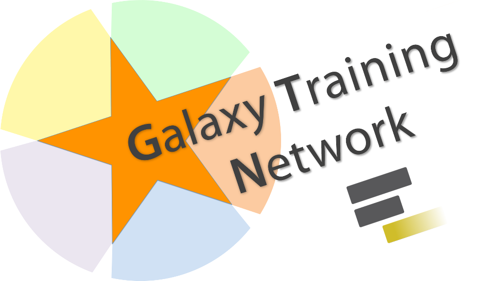

|Gitter|Build|Links|
|------|-----|-----|
| | | |

Galaxy training material
========================

This repository collects tutorials, slides, and exercises developed and maintained by the Galaxy community.

# Usage

The content of the material is developed in Markdown and a templating system ([Jekyll](http://jekyllrb.com/)) is used to format the tutorials and generate a website ([http://training.galaxyproject.org](http://training.galaxyproject.org)).

Do you want to help with this project? Have a question? Please have a look at the [`CONTRIBUTING`](CONTRIBUTING.md) file and our [tutorials dedicating to training material development](https://galaxyproject.github.io/training-material//topics/training).

If you want to build the website locally, please have a look at the [tutorial](https://galaxyproject.github.io/training-material//topics/training/tutorials/create-new-tutorial-jekyll/tutorial.html).

# License

This work is licensed under the [Creative Commons Attribution 4.0 International License](https://creativecommons.org/licenses/by/4.0).

# Acknowledgment and Funding

We would like to thank all contributors, especially those mentioned in the [Contributors list](CONTRIBUTORS.yaml), the Galaxy community for their constant support, and our funding partners.

 	&emsp; 	&emsp; 	&emsp;

 &emsp;
