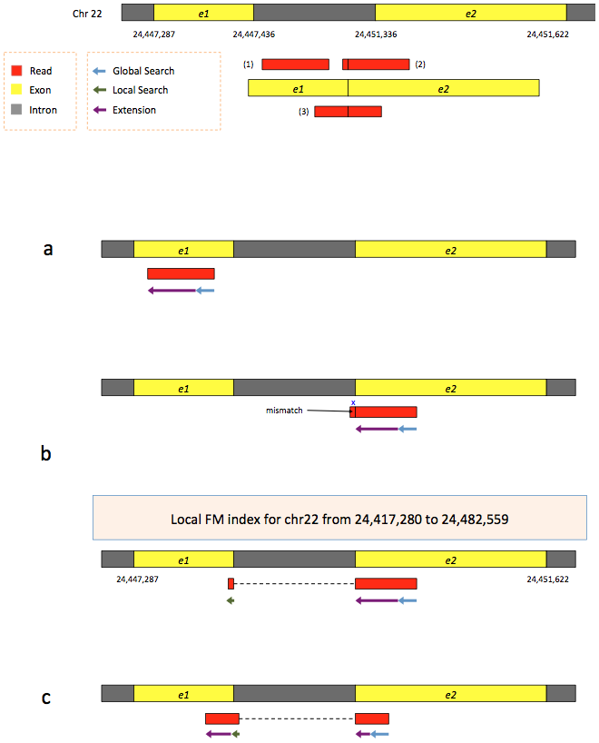

---
layout: tutorial_hands_on
topic_name: RNA-Seq
tutorial_name: de_novo
---

# Introduction

The data provided here are part of a Galaxy tutorial that analyzes RNA-seq data from a study published by *Wu et al.*, 2014 (DOI:10.1101/gr.164830.113). The goal of this study was to investigate "the dynamics of occupancy and the role in gene regulation of the transcription factor Tal1, a critical regulator of hematopoiesis, at multiple stages of hematopoietic differentiation." To this end, RNA-seq libraries were constructed from multiple mouse cell types including G1E - a GATA-null immortalized cell line derived from targeted disruption of GATA-1 in mouse embryonic stem cells - and megakaryocytes. This RNA-seq data was used to determine differential gene expression between G1E and megakaryocytes and later correlated with Tal1 occupancy. This dataset (GEO Accession: GSE51338) consists of biological replicate, paired-end, polyA selected RNA-seq libraries. Because of the long processing time for the large original files, we have downsampled the original raw data files to include only reads that align to chromosome 19 and a subset of interesting genomic loci identified by Wu et al.

# Analysis strategy

The goal of this exercise is to identify what transcripts are present in the G1E and megakaryocyte cellualr states and which of these are differentially expressed between the two. We will use a 'de novo transcript reconstruction' stratgey to infer transcript structures from the mapped reads in the absence of the actual annotated transcript structures. This will allow us to identify novel genes and novel isoforms of annotated genes, as well as identify differentially expressed transcripts. 

> ### Agenda
> 
> In this tutorial, we will:
>
> 1. Data upload
> 2. Read trimming
> 3. Read mapping
> 4. De novo transcript reconstriction
> 5. Transcriptome assembly
> 6. Read counting and differential expression analysis
> 7. Visualization

## Data upload

Due to the large size of this dataset, we have downsampled it to only inlcude reads mapping to chromosome 19 and certain loci with relevance to hematopoeisis. This data is avaialble at [`Zenodo`](https://zenodo.org/record/254485#.WIeQKbYrLUp), where you can find the forward and reverse reads corresponding to replicate RNA-seq libraries from G1E and megakaryocyte cells and an annotation file of RefSeq transcripts we will use to generate our transcriptome database. 

> ### :pencil2: Hands-on: Data upload
>
> 1. Create a new history for this RNA-seq exercise
> 2. Open the data upload manager (Get Data -> Upload file)
> 3. Copy and paste the links for the reads and annotation file 
> 4. Select **Paste/Fetch Data**
> 5. Paste the link(s) into the text field
> 6. Change the datatype of the read files to **fastqsanger**
> 7. Change the datatype of the annotation file to **gtf** and assign the Genome as **mm10**
> 8. Press **Start**
> 9. Rename the files in your history to retain just the necessary information (eg. "G1E R1 forward reads")
>
>    > 

>    > 
:bulb: Tip: Importing data via links

>    > <ol type="2">
>    > <li>For ease, we've included links to the read files </li>
>    > <li>https://zenodo.org/record/254485/files/G1E_R1_forward_downsampled_SRR549355.fastqsanger.gz
>    > https://zenodo.org/record/254485/files/G1E_R1_reverse_downsampled_SRR549355.fastqsanger.gz
>    > https://zenodo.org/record/254485/files/G1E_R2_forward_downsampled_SRR549356.fastqsanger.gz
>    > https://zenodo.org/record/254485/files/G1E_R2_reverse_downsampled_SRR549356.fastqsanger.gz
>    > https://zenodo.org/record/254485/files/Megakaryocyte_R1_forward_downsampled_SRR549357.fastqsanger.gz
>    > https://zenodo.org/record/254485/files/Megakaryocyte_R1_reverse_downsampled_SRR549357.fastqsanger.gz
>    > https://zenodo.org/record/254485/files/Megakaryocyte_R2_forward_downsampled_SRR549358.fastqsanger.gz
>    > https://zenodo.org/record/254485/files/Megakaryocyte_R2_reverse_downsampled_SRR549358.fastqsanger.gz</li>
>    > <li>You'll need to fetch the link to the annotation file yourself ;)</li>
>    > </ol>
>    > 

>
> 
> {: .hands_on}

## Quality control

For quality control, we use similar tools as described in [NGS-QC tutorial](../../NGS-QC/tutorials/dive_into_qc): [FastQC](http://www.bioinformatics.babraham.ac.uk/projects/fastqc/) and [Trimmomatic](http://www.usadellab.org/cms/?page=trimmomatic).

> ### :pencil2: Hands-on: Quality control
>
> 1. **FastQC** :wrench:: Run FastQC on the forward and reverse read files to assess the quality of the reads
>
>    > ### :question: Questions
>    >
>    > 1. What is the read length?
>    > 2. Is there anything interesting about the quality of the base calls based on the position in the reads? 
>    >
>    >    

>    >    
Click to view answers

>    >    <ol type="1">
>    >    <li>The read length is 99 bp</li>
>    >    <li>The quality of base calls declines throughout a sequencing run. ADD MORE HERE</li>
>    >    </ol>
>    >    

>    {: .question}
>
> 2. **Trimmomatic** :wrench:: Trim off the low quality bases from the ends of the reads to increase mapping efficiency. Run Trimmomatic on each pair of forward and reverse reads. 
>
> 
>
>
>
> 3. **FastQC** :wrench:: Re-run FastQC on Trimmomatics's outputs and inspect the differences
>
>
>
>    > ### :question: Questions
>    >
>    > 1. What is the read length?
>    > 2. Is there anything interesting about the quality of the base calls based on the position in the reads? 
>    >
>    >    

>    >    
Click to view answers

>    >    <ol type="1">
>    >    <li>The read length is 99 bp</li>
>    >    <li>The quality of base calls declines throughout a sequencing run. ADD MORE HERE</li>
>    >    </ol>
>    >    

>    {: .question}
> {: .hands_on}

Now that we have trimmed our reads and are fortuante that there is a great reference genome assembly for mouse, we will map our trimmed reads to the genome

# Mapping

To make sense of the reads, their positions within mouse genome must be determined. This process is known as aligning or 'mapping' the reads to the reference genome.

> ### :nut_and_bolt: Comment
>
> Do you want to learn more about the principles behind mapping? Follow our [training](../../NGS-mapping)
> {: .comment}

Because in the case of a eukaryotic transcriptome, most reads originate from processed mRNAs lacking exons, they cannot be simply mapped back to the genome as we normally do for DNA data. Instead the reads must be separated into two categories:

- Reads that map perfectly to the genomic sequence (exons)
- Reads with mature splice junctions that need to be mapped across introns

Spliced mappers have been developed to efficiently map transcript-derived reads against genomes. [HISAT2](https://ccb.jhu.edu/software/hisat2/index.shtml) is an accurate and fast tool for mapping spliced reads to a genome. 

>    > ### :nut_and_bolt: Comment
>    > As it is sometimes quite difficult to find out which settings correspond to those of other programs, the following table might be helpful to identify the library type:
>    > 
>    > Library type | **Infer Experiment** | **TopHat** | **HISAT2** | **htseq-count** | **featureCounts**
>    > --- | --- | --- | --- | --- | ---
>    > PE | "1++,1--,2+-,2-+" | "FR Second Strand" | "FR" | "yes" | "1"
>    > PE | "1+-,1-+,2++,2--" | "FR First Strand" | "RF" | "reverse" | "2"
>    > SE | "++,--" | "FR Second Strand" | "F" | "yes" | "1"
>    > SE | "+-,-+" | "FR First Strand" | "R" | "reverse" | "2"
>    > SE,PE | undecided | "FR Unstranded" | default | "no" | "0"
>    > 
>    {: .comment}
>    
> ### :pencil2: Hands-on: Spliced mapping
>
> 1. **** :wrench:: Run **HISAT2** on one forward/reverse read pair and modify the following settings:
>    - "Paired-end (as individual datasets)" instead of "Single-end"
>    - "Mouse (Mus Musculus): mm10" as reference genome
>    - "Spliced alignment parameters" choose to "Specify spliced alignment parameters"
>    - "Specify strand-specific information" choose "First Strand (R/RF)"
>    - "Transcriptome assembly reporting" to "Report alignments tailored for transcript assemblers including StringTie."
>
> 
>
> 2. **** :wrench:: Run **HISAT2** on the remaining forward/reverse read pairs with the same parameters.
>

# De novo transcript reconstruction
Now that we have mapped our reads to the mouse genome with HISAT2, we want to determine transcript structures that are represented by the aligned reads, this is called 'de novo transcriptome reconstruction'. This unbiased approach permits the comprehensive identification of all transcripts present in a sample, including annotated genes, novel isoforms of annotated genes, and novel genes. While common gene/transcript databases are quite large, they are not comprehensive and this 'de novo transcriptome reconstruction' approach ensures you are truly analyzing the complete transcriptome(s) from your experiemntal samples. The leading tool for transcript reconstruction is Stringtie. Here, we will use Stringtie to predict transcript structures soley based on the reads aligned by HISAT2. 

> ### :pencil2: Hands-on: Transcriptome reconstruction
>
> 1. **** :wrench:: Run **Stringtie** on the HISAT alignments using the default parameters. 
> 
>    - Use batch mode to run all four samples from one tool form. 

# Transcriptome assembly

We just generated four transcriptomes with Stringtie representing each of the four RNA-seq libraries we're analyzing. Since these were generated in the absence of a reference transcriptome and we ultimately would like to know what transcript structure corresponds to which annotated transcript (if any) we have to make a **transcriptome database**. We will use the tool Cuffmerge to combine redundant transcript structures across the four samples, provide non-redundant identifiers, and with the help of the reference annotation file we provide to annotate the nature/origin of each transcript (reference, novel isoform, intergenic transcript, antisense, etc.) 

> ### :pencil2: Hands-on: Transcriptome assembly
>
> 1. **** :wrench:: Run **Cuffmerge** on the Stringtie assembled transcripts along with the RefSeq annotation file we imported earlier. 
>    - Use batch mode to inlcude all four Stringtie assemblies. 
>    - Choose "Use Reference Annotation" -> "Yes" and select the "RefSeq GTF mm10" file. 
> 
>
>
>    > Transcript categorization used by Cuffmerge
>
>    > |**Class code** | **Transcript category**| 
>    > |---|---|
>    > |= | Annotated in reference|
>    > |j | Novel isoform of reference| 
>    > |u | Intergenic|
>    > |x | Anti-sense|
>    > |r | Repetitive|
>    > |c | Contained in exon of reference| 
>    > |s | Anti-sense spliced intronic|

# Analysis of the differential gene expression

We just generated a transriptome database that represents the transcripts present in our RNA-seq libraries generated from G1E and megakaryocytes. This database provides the location of our transcripts with non-redundant identifiers, as well as information regarding the origin of the transcript. 

We now want to identify which transcripts are expressed and which of those are differentially expressed between the Gf1E and megakaryocyte cellular states. To do this we will use a counting approach using FeatureCounts to count reads per transcript and providing this information to DESeq2 to generate normalized transcript counts (abundance estimates) and significance testing for differential expression   

## Count the number of reads per transcript

To compare the abundance of transcripts between different cellular states, a first essential step is to quantify the number of reads per transcript. [**FeatureCounts**](http://bioinf.wehi.edu.au/featureCounts/) is one of the most popular tools for counting reads in genomic features, in our case, we'll be using FeatureCounts to count reads aligning in exons of our Cuffmerge generated transcriptome database.

The recommended mode is "union", which counts overlaps even if a read only shares parts of its sequence with a genomic feature and disregards reads that overlap more than one feature.

> ### :pencil2: Hands-on: Counting the number of reads per transcript
>
> 1. **HTSeq-count** :wrench:: Run FeatureCounts on the aligned reads (HISAT output) using the Cuffmerge transcriptome database as the annotation file.
>
>    - "Gene annotation file" choose "in your history" and select the GTF file output by Cuffmerge. >    - The "union" mode
>    - Expand the "Options for paired end reads" section and under "Orientation of the two read from the same pair" select "Forward, Reverse (fr)".
>    - Expand the "Advanced options" and under "GFF gene identifier" specify "transcript_id"
> 
>
>
>
> 3. Inspect the result files
>
>    > ### :question: Question
>    >
>    > Which feature has the most reads mapped on it?
>    > 
>    >    

>    >    
Click to view answers

>    >    To display the most found feature, we need first to sort the output file with the feature and the number of reads found for these feature. We do that using Sort tool, on the second column and in descending order. And we found that FBgn0017545 is the feature with the most reads mapped on it with 4,030 reads.
>    >    

>    {: .question}
{: .hands_on}

## Analysis of the differential gene expression

In the previous section, we counted only reads that mapped to chromosome 4 for only one sample. To be able to identify differential gene expression induced by PS depletion, all datasets (3 treated and 4 untreated) must be analyzed with the similar procedure.

You can export a workflow from the previous steps and rerun it on the 7 samples whose the raw sequences are available on [Zenodo](http://dx.doi.org/10.5281/zenodo.61771). For time saving, we run the previous steps for you and obtain 7 count files, available on [Zenodo](http://dx.doi.org/10.5281/zenodo.61771)

These files contain for each gene the number of reads mapped to it. We could compare directly the files and then having the differential gene expression. But the number of sequenced reads mapped to a gene depends on:

- Its own expression level
- Its length
- The sequencing depth
- The expression of all other genes within the sample

Either for within or for inter-sample comparison, the counts need to be normalized. We can then use the Differential Gene Expression (DGE) analysis, whose two basic tasks are:

- Estimate the biological variance using the replicates for each condition
- Estimate the significance of expression differences between any two conditions

This expression analysis is estimated from read counts and attempts are made to correct for variability in measurements using replicates that are absolutely essential accurate results. For your own analysis, we advice you to use at least 3, better 5 biological replicates. 

[**DESeq2**](https://bioconductor.org/packages/release/bioc/html/DESeq2.html) is a great tool for DGE analysis. It takes read counts produced by **HTseq-count** and applies size factor normalization:

- Computation for each gene of the geometric mean of read counts across all samples
- Division of every gene count by the geometric mean
- Use of the median of these ratios as sample's size factor for normalization

Multiple factors can then be incorporated in the analysis. In our example, we have samples with two varying factors:

- Treatment (either treated or untreated)
- Sequencing type (paired-end or single-end)

Here treatment is the primary factor which we are interested in.The sequencing type is some further information that we know about the data that might effect the analysis. This particular multi-factor analysis allows us to assess the effect of the treatment taking also the sequencing type into account.

> ### :pencil2: Hands-on:
>
> 1. Create a new history
> 2. Import the seven count files from [Zenodo](http://dx.doi.org/10.5281/zenodo.61771)
>    - [GSM461176_untreat_single.counts](https://zenodo.org/record/61771/files/GSM461176_untreat_single.counts)
>    - [GSM461177_untreat_paired.counts](https://zenodo.org/record/61771/files/GSM461177_untreat_paired.counts)
>    - [GSM461178_untreat_paired.counts](https://zenodo.org/record/61771/files/GSM461178_untreat_paired.counts)
>    - [GSM461179_treat_single.counts](https://zenodo.org/record/61771/files/GSM461179_treat_single.counts)
>    - [GSM461180_treat_paired.counts](https://zenodo.org/record/61771/files/GSM461180_treat_paired.counts)
>    - [GSM461181_treat_paired.counts](https://zenodo.org/record/61771/files/GSM461181_treat_paired.counts)
>    - [GSM461182_untreat_single.counts](https://zenodo.org/record/61771/files/GSM461182_untreat_single.counts)
>
>    > ### :nut_and_bolt: Comments
>    > If you are using the [Freiburg Galaxy instance](http://galaxy.uni-freiburg.de), you can load the dataset using 'Shared Data' <i class="fa fa-long-arrow-right"></i> 'Data Libraries' <i class="fa fa-long-arrow-right"></i> 'Galaxy Courses' <i class="fa fa-long-arrow-right"></i> 'RNA-Seq' <i class="fa fa-long-arrow-right"></i> 'count_tables'
>    {: .comment}
>
> 3. **DESeq2** :wrench:: Run **DESeq2** with:
>    - "Treatment" as first factor with "treated" and "untreated" as levels and selection of count files corresponding to both levels
>
>       > ### :nut_and_bolt: Comment
>       >
>       > You can select several files by keeping the CTRL (or COMMAND) key pressed and clicking on the interesting files 
>       {: .comment}
>
>    - "Sequencing" as second factor with "PE" and "SE" as levels and selection of count files corresponding to both levels
>
>    > ### :nut_and_bolt: Comment
>    >
>    > File names have all information needed
>    {: .comment}
{: .hands_on}

The first output of **DESeq2** is a tabular file. The columns are:

1.	Gene identifiers
2.	Mean normalized counts, averaged over all samples from both conditions
3.	Logarithm (to basis 2) of the fold change

    The log2 fold changes are based on primary factor level 1 vs. factor level 2. The order of factor levels is then important. For example, for the factor 'Treatment', DESeq2 computes fold changes of 'treated' samples against 'untreated', *i.e.* the values correspond to up- or downregulations of genes in treated samples.

4.	Standard error estimate for the log2 fold change estimate
5.	[Wald](https://en.wikipedia.org/wiki/Wald_test) statistic
6.	*p*-value for the statistical significance of this change
7.	*p*-value adjusted for multiple testing with the Benjamini-Hochberg procedure which controls false discovery rate ([FDR](https://en.wikipedia.org/wiki/False_discovery_rate))

> ### :pencil2: Hands-on:
>
>1. **Filter** :wrench:: Run **Filter** to extract genes with a significant change in gene expression (adjusted *p*-value equal or below 0.05) between treated and untreated samples
>
>    > ### :question: Question
>    >
>    > How many genes have a significant change in gene expression between these conditions?
>    > 
>    > 

>    > 
Click to view answers

>    > To filter, you need to add the expression "c7&lt;0.05". And we get 751 genes (5.05%) with a significant change in gene expression between treated and untreated samples.
>    > 

>    {: .question}
>
>    > ### :nut_and_bolt: Comment
>    >
>    > The file with the independent filtered results can be used for further downstream analysis as it excludes genes with only few read counts as these genes will not be considered as significantly differentially expressed.
>    {: .comment}
>
> 2. **Filter** :wrench:: Extract genes that are significantly up and downregulated in treated samples
>
>    > ### :nut_and_bolt: Comments
>    > Rename your datasets for the downstream analyses
>    {: .comment}
>
>    > ### :question: Question
>    >
>    > Are there more upregulated or downregulated genes in the treated samples?
>    > 
>    > 

>    > 
Click to view answers

>    > To obtain the up-regulated genes, we filter the previously generated file (with the significant change in gene expression) with the expression "c3>0" (the log2 fold changes must be greater than 0). We obtain 331 genes (44.07% of the genes with a significant change in gene expression). For the down-regulated genes, we did the inverse and we 420 genes (55.93% of the genes with a significant change in gene expression)
>    > 

>    {: .question}
{: .hands_on}

In addition to the list of genes, **DESeq2** outputs a graphical summary of the results, useful to evaluate the quality of the experiment:

1. Histogram of *p*-values for all tests

    

2. [MA plot](https://en.wikipedia.org/wiki/MA_plot): global view of the relationship between the expression change of conditions (log ratios, M), the average expression strength of the genes (average mean, A), and the ability of the algorithm to detect differential gene expression. The genes that passed the significance threshold (adjusted p-value < 0.1) are colored in red.

    

3. Principal Component Analysis ([PCA](https://en.wikipedia.org/wiki/Principal_component_analysis)) and the first two axes

    

    Each replicate is plotted as an individual data point. This type of plot is useful for visualizing the overall effect of experimental covariates and batch effects.

    > ### :question: Questions
    >
    > 1. What is the first axis separating?
    > 2. And the second axis?    
    > 
    >    

    >    
Click to view answers

    >    <ol type="1">
    >    <li>The first axis is seperating the treated samples from the untreated samples, as defined when DeSeq was launched</li>
    >    <li>The second axis is separating the single-end datasets from the paired-end datasets</li>
    >    </ol>
    >    

    {: .question}

4. Heatmap of sample-to-sample distance matrix: overview over similarities and dissimilarities between samples

    

    > ### :question: Questions
    >
    > How are the samples grouped?
    > 
    >    

    >    
Click to view answers

    >    They are first grouped depending on the treatment (the first factor) and after on the library type (the second factor), as defined when DeSeq was launched
    >    </ol>
    >    

    {: .question}

5. Dispersion estimates: gene-wise estimates
(black), the fitted values (red), and the final maximum a posteriori estimates used in testing
(blue)

    

    This dispersion plot is typical, with the final estimates shrunk from the gene-wise estimates towards the fitted estimates. Some gene-wise estimates are flagged as outliers and not shrunk towards the fitted value. The amount of shrinkage can be more or less than seen here, depending on the sample size, the number of coefficients, the row mean and the variability of the gene-wise estimates.

For more information about **DESeq2** and its outputs, you can have a look at [**DESeq2** documentation](https://www.bioconductor.org/packages/release/bioc/manuals/DESeq2/man/DESeq2.pdf).

## Analysis of the functional enrichment among differentially expressed genes

We have extracted genes that are differentially expressed in treated (with PS gene depletion) samples compared to untreated samples. We would like to know the functional enrichment among the differentially expressed genes.

The Database for Annotation, Visualization and Integrated Discovery ([DAVID](https://david.ncifcrf.gov/)) provides a comprehensive set of functional annotation tools for investigators to understand the biological meaning behind large lists of genes.

We use then DAVID to identify functional annotations of the upregulated genes and the downregulated genes.

> ### :pencil2: Hands-on:
>
> 1. **Sort** :wrench:: Sort the 2 datasets generated previously (upregulated genes and downregulated genes) given the log2 fold change, in descending or ascending order (to obtain the higher absolute log2 fold changes on the top)
> 1. **Select first lines from a dataset** :wrench:: Extract the first 100 lines of sorted files
> 2. **DAVID** :wrench:: Run **DAVID** on these files with
>     - First column as "Column with identifiers"
>     - "FLYBASE_GENE_ID" as "Identifier type"
>
>    The output of the **DAVID** tool is a HTML file with a link to the DAVID website.
>
> 2. Inspect the Functional Annotation Chart
>
>    > ### :question: Questions
>    >
>    > What functional categories are the most represented? 
>    >  
>    > 

>    > 
Click to view answers

>    > The up-regulated genes are mostly related to membrane (in the number of genes). The most represented functional categories are linked to signal and pathways for the down-regulated genes.
>    > 

>    {: .question}
>
> 3. Inspect the Functional Annotation Clusterings
>
>    > ### :question: Questions
>    >
>    > What functional annotations are the first clusters related to?
>    >  
>    > 

>    > 
Click to view answers

>    > For the up-regulated genes, the first cluster is more composed of functions related to chaperone and stress response. The down-regulated genes are more linked to ligase activity.
>    > 

>    {: .question}
{: .hands_on}

# Inference of the differential exon usage

Now, we would like to know the differential exon usage between treated (PS depleted) and untreated samples using RNA-seq exon counts. We will rework on the mapping results ([`GSM461177_untreat_paired_chr4.bam`](https://zenodo.org/record/61771/files/GSM461177_untreat_paired_chr4.bam)).

We use [DEXSeq](http://www.bioconductor.org/packages/release/bioc/html/DEXSeq.html). DEXSeq detects high sensitivity genes, and in many cases exons, that are subject to differential exon usage. 

First, we need to count the number of reads mapping the exons. 

## Count the number of reads per exon

This step is similar to the step of [counting the number of reads per annotated gene](#count-the-number-of-reads-per-annotated-gene). Here instead of HTSeq-count, we are using DEXSeq-Count. 

> ### :pencil2: Hands-on: Counting the number of reads per exon
>
> 1. Copy the `Drosophila_melanogaster.BDGP5.78.gtf` file from the first history
> 2. **DEXSeq-Count** :wrench:: Use the **DEXSeq-Count** to prepare the *Drosophila* annotations to extract only exons with corresponding gene ids
>     - "Prepare annotation" of "Mode of operation" 
>
>    The output is again a GTF file that is ready to use for counting
>   
> 3. Copy the `GSM461177_untreat_paired_chr4.bam` file from the second history
> 4. **DEXSeq-Count** :wrench:: Count reads using **DEXSeq-Count** with
>     - `GSM461177_untreat_paired_chr4.bam` as "Input bam file"
>     - The formatted GTF file
> 5. Inspect the result files
>
>    > ### :question: Question
>    >
>    > Which exon has the most read mapped on it? From which gene has this exon beed extracted? Is it similar to the previous result with HTSeq-count?
>    > 
>    > 

>    > 
Click to view answers

>    > FBgn0017545:004 is the exon with the most read mapped on it. It is part of FBgn0017545, the feature with the most reads mapped with HTSeq-count
>    > 

>    {: .question}
{: .hands_on}

## Differential exon usage

DEXSeq usage is similar to DESeq2. It uses similar statistics to find differentially used exons. 

As for DESeq2, we counted only reads that mapped to exons on chromosome 4 for only one sample in the previous step. To be able to identify differential exon usage induced by PS depletion, all datasets (3 treated and 4 untreated) must be analyzed with the similar procedure. For time saving, we did that for you. The results are available on [Zenodo](http://dx.doi.org/10.5281/zenodo.61771):

- [dexseq.gtf](https://zenodo.org/record/61771/files/dexseq.gtf): the results of the running DEXSeq-count in 'Prepare annotation' mode
- Seven files, counts files generated in 'Count reads' mode

> ### :pencil2: Hands-on:
>
> 1. Create a new history
> 2. Import the seven count files and the dexseq.gtf from [Zenodo](http://dx.doi.org/10.5281/zenodo.61771)
>    - [dexseq.gtf](https://zenodo.org/record/61771/files/dexseq.gtf)
>    - [treated1_single.txt](https://zenodo.org/record/61771/files/treated1_single.txt)
>    - [treated2_paired.txt](https://zenodo.org/record/61771/files/treated2_paired.txt)
>    - [treated3_paired.txt](https://zenodo.org/record/61771/files/treated3_paired.txt)
>    - [untreated1_single.txt](https://zenodo.org/record/61771/files/untreated1_single.txt)
>    - [untreated2_single.txt](https://zenodo.org/record/61771/files/untreated2_single.txt)
>    - [untreated3_paired.txt](https://zenodo.org/record/61771/files/untreated3_paired.txt)
>    - [untreated4_paired.txt](https://zenodo.org/record/61771/files/untreated4_paired.txt)
>
>    > ### :nut_and_bolt: Comments
>    > If you are using the [Freiburg Galaxy instance](http://galaxy.uni-freiburg.de), you can load the dataset using 'Shared Data' <i class="fa fa-long-arrow-right"></i> 'Data Libraries' <i class="fa fa-long-arrow-right"></i> 'Galaxy Courses' <i class="fa fa-long-arrow-right"></i> 'RNA-Seq' <i class="fa fa-long-arrow-right"></i> 'dexseq'
>    {: .comment}
>
> 3. **DEXSeq** :wrench:: Run **DEXSeq** with
>    - "Condition" as first factor with "treated" and "untreated" as levels and selection of count files corresponding to both levels
>    - "Sequencing" as second factor with "PE" and "SE" as levels and selection of count files corresponding to both levels
>
>    > ### :nut_and_bolt: Comment
>    >
>    > Unlike DESeq2, DEXSeq does not allow flexible primary factor names. Always use your primary factor name as "condition"
>    {: .comment}
{: .hands_on}

Similarly to DESeq2, DEXSeq generates a table with:

1.  Exon identifiers
2.  Gene identifiers
3.  Exon identifiers in the Gene
4.  Mean normalized counts, averaged over all samples from both conditions
5.  Logarithm (to basis 2) of the fold change

    The log2 fold changes are based on primary factor level 1 vs. factor level 2. The order of factor levels is then important. For example, for the factor 'Condition', DESeq2 computes fold changes of 'treated' samples against 'untreated', *i.e.* the values correspond to up- or downregulations of genes in treated samples.

6.  Standard error estimate for the log2 fold change estimate
7.  *p*-value for the statistical significance of this change
8.  *p*-value adjusted for multiple testing with the Benjamini-Hochberg procedure which controls false discovery rate ([FDR](https://en.wikipedia.org/wiki/False_discovery_rate))

> ### :pencil2: Hands-on:
>
> 1. **Filter** :wrench:: Run **Filter** to extract exons with a significant usage (adjusted *p*-value equal or below 0.05) between treated and untreated samples
>
>    > ### :question: Question
>    >
>    > How many exons have a significant change in usage between these conditions?
>    > 
>    > 

>    > 
Click to view answers

>    > We get 38 exons (12.38%) with a significant usage change between treated and untreated samples
>    > 

>    {: .question}
{: .hands_on}

# Annotation of the result tables with gene information

Unfortunately, in the process of counting, we loose all the information of the gene except its identifiant. In order to get the information back to our final counting tables, we can use a tool to make the correspondance between identifiant and annotation.

> ### :pencil2: Hands-on:
>
> 1. **Annotate DE(X)Seq result** :wrench:: Run **Annotate DE(X)Seq result** on a counting table (from DESeq or DEXSeq) using the `Drosophila_melanogaster.BDGP5.78.gtf` as annotation file
{: .hands_on}

# Conclusion

In this tutorial, we have analyzed real RNA sequencing data to extract useful information, such as which genes are up- or downregulated by depletion of the Pasilla gene and which genes are regulated by the Pasilla gene. To answer these questions, we analyzed RNA sequence datasets using a reference-based RNA-seq data analysis approach. This approach can be sum up with the following scheme:

