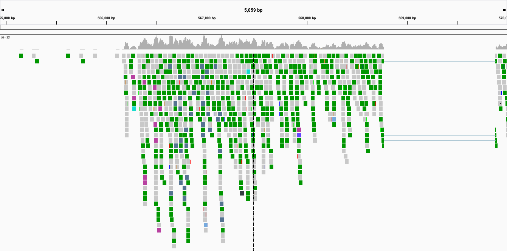

Reference based RNA-seq data analysis
=====================================

:grey_question: ***Questions***

- *What are the effects of Pasilla (PS) gene depletion on splicing events?*
- *How to analyze RNA sequencing data using a reference genome?*

:dart: ***Objectives***

- *Analysis of RNA sequencing data using a reference genome*
- *Analysis of differentially expressed genes*
- *Identification of functional enrichment among differentially expressed genes*

:heavy_check_mark: ***Requirements***

- *Galaxy introduction*
- *Quality control*
- *Mapping*
- *IGV*

:hourglass: ***Time estimation*** *1d/3h/6h*

[:book: **Associated slide deck**](http://bgruening.github.io/training-material/RNA-Seq/slides/ref_based.html)

# Introduction

In the study of [Brooks *et al.* 2011](http://genome.cshlp.org/content/21/2/193.long), the Pasilla (PS) gene, *Drosophila* homologue of the Human splicing regulators Nova-1 and Nova-2 Proteins, was depleted in *Drosophila melanogaster* by RNAi. The authors wanted to identify exons that are regulated by Pasilla gene using RNA sequencing data.

Total RNA was isolated and used for preparing either single-end or paired-end RNA-seq libraries for 3 treated (PS depleted) samples and 4 untreated samples. These libraries were sequenced to obtain a collection of RNA sequencing reads for each sample. The effects of Pasilla gene depletion on splicing events can then be analyzed. The genome of *Drosophila melanogaster* is known and can be used as reference genome to ease this analysis.  

Reference based RNA-seq data analysis is ...
*add a small introduction about reference based RNA-seq data analysis*

In this tutorial, we will analyze the data with:

1. [Pretreatments](#pretreatments)
2. [Mapping](#mapping)
3. [Analysis of the differential expression](#analysis-of-the-differential-expression)

# Pretreatments

## Data upload

We will look at 7 samples:
- 3 treated samples with Pasilla (PS) gene depletion
- 4 untreated samples

Each sample constitutes a separate biological replicate of the corresponding condition (treated or untreated). Moreover, two of the treated and two of the untreated samples are from a paired-end sequencing assay, while the remaining samples are from a single-end sequencing experiment.

:pencil2: ***Hands on!*** Data upload

1. Create a new history for this RNA-seq exercise
2. Import a FASTQ file pair (*e.g.* [`GSM461177_untreat_paired_subset_1`](https://zenodo.org/record/61771/files/GSM461177_untreat_paired_subset_1.fastq) and [`GSM461177_untreat_paired_subset_2`](https://zenodo.org/record/61771/files/GSM461177_untreat_paired_subset_2.fastq)) from [Zenodo](http://dx.doi.org/10.5281/zenodo.61771)

    > :bulb: **Importing data via links**
    > * Copy the link location
    > * Open the Galaxy Upload Manager
    > * Select **Paste/Fetch Data**
    > * Paste the link into the text field
    > * Press **Start**    
     

    > :bulb: **Changing the file type `fastq` to `fastqsanger` once data is in history**
    > * Click on the pencil button displayed in your dataset in the history
    > * Choose **Datatype** on the top
    > * Select `fastqsanger`
     
     

    > :+1: **Edit the "Database/Build" to select "dm3"**
     

    > :+1: **Rename the datasets according to the samples**
    > As default, Galaxy takes the link as name.
     

Both files contain the first 100.000 paired-end reads of one sample. The sequences are raw sequences from sequencing. They needs to be controlled for their quality.

## Quality control

For quality control, we use similar tools as described in [NGS-QC tutorial](https://github.com/bgruening/training-material/blob/master/NGS-QC/tutorials/dive_into_qc.md).

:pencil2: ***Hands on!*** Quality control

1. **FastQC** :wrench:: Run FastQC on one of the two FASTQ files to control the quality of the reads to know

    :question: What is the read length? Is there anything what you find striking?

2. **Trim Galore** :wrench:: Trim low quality bases from the 3' end using on both paired-end datasets.
3. **FastQC** :wrench:: Re-run and inspect the differences.

As the genome of *Drosophila melanogaster* is known, we can use this information and map the sequences on this genome to identify the effects of Pasilla gene depletion on splicing events.

# Mapping

To make sense of the reads, their positions within *Drosophila melanogaster* genome must be determined. This process is known as aligning or 'mapping' the reads to the reference genome.

> Want to learning more about mapping? Follow our [training](http://bgruening.github.io/training-material/NGS-mapping/slides)

In the case of an eukaryotic transcriptome, most reads originate from processed mRNAs lacking exons. Therefore, they cannot be simply mapped back to the genome. Instead they can be separated into two categories:

- Reads that map entirely within exons
- Reads that cannot be mapped within an exon across their entire length because they span two or more exons

Spliced mappers have been developed to efficiently map transcript-derived reads against genomes. [TopHat](https://ccb.jhu.edu/software/tophat/index.shtml) was one of the first tools designed specifically to address this problem:

1. Identification of potential exons using reads that do map to the genome
2. Generation of possible splices between neighboring exons
3. Comparison of reads that did not initially map to the genome against these *in silico* created junctions

*[Kim et al., Genome Biology, 2013](https://genomebiology.biomedcentral.com/articles/10.1186/gb-2013-14-4-r36)*

To help annotating RNA sequences, we can take advantage from already known reference gene annotations.

:pencil2: ***Hands on!***

1. Load the Ensembl gene annotation for *Drosophila melanogaster* ([`Drosophila_melanogaster.BDGP5.78.gtf`](https://zenodo.org/record/61771/files/Drosophila_melanogaster.BDGP5.78.gtf)) from [Zenodo](http://dx.doi.org/10.5281/zenodo.61771) into your current Galaxy history

TopHat needs to know two important parameters about the sequencing library

- The library type and its strandedness type
- The inner distance between the two reads for paired-end data

These information should usually come with your FASTQ files, ask your sequencing facility! If not, try to find them on the site where you downloaded the data or in the corresponding publication. Another option is to estimate these parameters with a *preliminary mapping* of a *downsampled* file and some analysis programs. Afterward, the actual mapping can be redone on the original files with the optimized parameters.

## Preliminary mapping

*This step is not necessary if you don't need to estimate parameters*

:pencil2: ***Hands on!***

1. **Select first** :wrench:: Downsample the FASTQ file to 200k to 1M reads

    :warning: For the provided files downsampling is not necessary as they only contain 100k reads.

2. **TopHat** :wrench:: Run **TopHat** on the trimmed samples with:
    - "Paired-end (as individual datasets)" instead of "Single-end"
    - "Drosophila melanogaster: dm3" as reference genome
    - the defaults for *strandedness* and *insert size*

3. **Inner Distance** :wrench:: Run **Inner Distance** on the BAM file using the `Drosophila_melanogaster.BDGP5.78.gtf` reference gene model to estimate the *inner distance*
4. Inspect the resulting PDF

    :question: What is the mean value for the inner distance?

    If you already have read the corresponding paper carefully you might know that the fragment size is ~200bp. With read lengths of 2x37bp, an educated guess for the inner distance could be `125`. Does this correspond with the calculated value?

5. **Infer Experiment** :wrench:: Run **Infer Experiment** with the same files
6. Check the results and search the tool's documentation for help on the meaning.

As it is sometimes quite difficult to find out which settings correspond to those of other programs, the following table might be helpful to identify the library type:

Library type | **Infer Experiment** | **TopHat** | **HISAT2** | **htseq-count** | **featureCounts**
--- | --- | --- | --- | --- | ---
PE | "1++,1--,2+-,2-+" | "FR Second Strand" | "FR" | "yes" | "1"
PE | "1+-,1-+,2++,2--" | "FR First Strand" | "RF" | "reverse" | "2"
SE | "++,--" | "FR Second Strand" | "F" | "yes" | "1"
SE | "+-,-+" | "FR First Strand" | "R" | "reverse" | "2"
SE,PE | undecided | "FR Unstranded" | default | "no" | "0"

## Actual mapping

With the sequencing library parameters, the full RNA sequences can be mapped on the *Drosophila melanogaster* genome.

:pencil2: ***Hands on!***

1. **TopHat** :wrench:: Run **TopHat** with the full parameter set to get the best mapping results:
    - "Paired-end (as individual datasets)" instead of "Single-end"
    - "Mean Inner Distance" to the value of **Inner Distance**
    - "Drosophila melanogaster: dm3" as reference genome
    - "Full parameter list" for "TopHat settings to use"
    - "Library type" according to the **Infer Experiment**
    - "18" for the "Minimum length of read segments"

        By default, TopHat proposes to fix the minimum length of read segments to 25, but a value of `18` seems to be a more appropriate value for this input data.

        :question: Why?

    - "Yes" for use of own junction data
    - "Yes" for use of Gene Annotation Model
    - `Drosophila_melanogaster.BDGP5.78.gtf` as Gene Model Annotations (to enable transcriptome alignment)
    - "Yes (--coverage-search)" to use coverage-based search for junctions

        The TopHat algorithm splits reads into segments to map the reads across splice junctions. Coverage-based search for junctions increases the sensitivity.

**TopHat** generates a BAM file with the mapped reads and three BED files containing splice junctions, insertions and deletions.

The mapping exercise worked for you? Great! :tada:

## Inspection of TopHat results

However, the datasets are too small to give you a good impression of how real data looks like. That's why we run TopHat for you on a real dataset. We extract only the reads mapped to Chromosome 4 of *Drosophila*.

:pencil2: ***Hands on!***

1. Import from [Zenodo](http://dx.doi.org/10.5281/zenodo.61771) the following files:
    - [`GSM461177_untreat_paired_chr4.bam`](https://zenodo.org/record/61771/files/GSM461177_untreat_paired_chr4.bam)
    - [`GSM461177_untreat_paired_deletions_chr4.bed`](https://zenodo.org/record/61771/files/GSM461177_untreat_paired_deletions_chr4.bed)
    - [`GSM461177_untreat_paired_insertions_chr4.bed`](https://zenodo.org/record/61771/files/GSM461177_untreat_paired_insertions_chr4.bed)
    - [`GSM461177_untreat_paired_junctions_chr4.bed`](https://zenodo.org/record/61771/files/GSM461177_untreat_paired_junctions_chr4.bed)
2. **IGV** :wrench:: Visualize this BAM file and the three BED files, particularly the region on Chromosome 4 between 560 kb to 600 kb (`chr4:560,000-600,000`).

    > :+1: **Change the data type from "tabular" to "bed"**
     

    :question: What do the different colors for the mapped read mean when we zoom on `chr4:565,805-569,143`?

    

    > Check [IGV documentation](http://software.broadinstitute.org/software/igv/AlignmentData) to find some clues.

    :question: Which information does the `GSM461177_untreat_paired_junctions_chr4.bed` BED files contain? How is this information represented in IGV? What do these reads represent?

    :question: Which information does the `GSM461177_untreat_paired_insertions_chr4.bed` and `GSM461177_untreat_paired_deletions_chr4.bed` BED files contain? How is this information represented in IGV? How many reads are mapped and contain the insertion found at 566,827?

3. **IGV** :wrench:: Inspect the results using a **Sashimi plot**

    > :bulb: **Creation of a Sashimi plot**
    > * Right click on the BAM file
    > * Select **Sashimi Plot** from the context menu
     

    

    :question: What does the numbered line represent? And the number on these lines?

    > Check [IGV documentation on Sashimi plots](http://software.broadinstitute.org/software/igv/Sashimi) to find some clues.

4. **IGV** :wrench:: Look around to find other regions with in interesting junctions, *e.g.* `chr4:870,000-940,000`

# Analysis of the differential expression

To identify exons that are regulated by Pasilla gene, we need to identify genes and exons which are differentially expressed between samples with PS gene depletion and control samples.

## Count the number of reads per annotated gene

To compare the expression of single genes between different conditions (*e.g.* with or without PS depletion), an essential step is the quantification
of reads per gene. [**HTSeq-count**](http://www-huber.embl.de/users/anders/HTSeq/doc/count.html) is one of the most popular tools for gene quantification.

In principle, the counting of reads overlapping with genomic features is a fairly simple task, but there are some details that need to be decided. **HTSeq-count** offers 3 choices ("union", "intersection_strict" and "intersection_nonempty") to handle read mapping to multiple locations, reads overlapping introns, or reads that overlap more than one genomic feature:

*[HTSeq documentation](http://www-huber.embl.de/users/anders/HTSeq/doc/count.html)*

The recommended mode is "union", which counts overlaps even if a read only shares parts of its sequence with a genomic feature and disregards reads that overlap more than one feature.

:pencil2: ***Hands on!***

To quantify the number of reads mapped to a gene, an annotation of the genomic features as it is in the genes is needed.

1. Load the Ensembl gene annotation for *Drosophila melanogaster* ([`Drosophila_melanogaster.BDGP5.78.gtf`](https://zenodo.org/record/61771/files/Drosophila_melanogaster.BDGP5.78.gtf)) from [Zenodo](http://dx.doi.org/10.5281/zenodo.61771) into your current Galaxy history

2. **HTSeq-count** :wrench:: Run **HTSeq-count** on the BAM file with
    - `Drosophila_melanogaster.BDGP5.78.gtf` as "GFF file"
    - The "union" mode
    - A "Minimum alignment quality" of 10
3. Inspect the result files

    :question: How many reads could not have been assigned to any feature?

    :question: Which feature is the most found one?

## Analysis of the differential gene expression

In the previous section, we counted only reads that mapped to Chromosome 4 for only one sample. To be able to identify differentially gene expression induced by PS depletion, all datasets (3 treated and 4 untreated) must be analyzed with the similar procedure.

You can export a workflow from the previous steps and rerun it on the 7 samples whose the raw sequences are available on [Zenodo](http://dx.doi.org/10.5281/zenodo.61771). For time saving, we run the previous steps for you and obtain 7 count files.

:pencil2: ***Hands on!***

1. Create a new history
2. Import the seven count files from [Zenodo](http://dx.doi.org/10.5281/zenodo.61771)

These files contains for each gene the number of sequences reads mapped to it. We could compare directly the files and then having the differential gene expression. But the number of sequenced reads mapped to a gene depends on:

- Its own expression level
- Its length
- The sequencing depth
- The expression of all other genes within the sample

Either for within or inter-sample comparison, the counts need to be normalized. We can then use the Differential Gene Expression (DGE) analysis, whose two basic tasks are:

- Estimate the magnitude of expression differences between the samples
- Estimate the significance of expression differences between the samples

This expression analysis is estimated from read counts and attempts are made to correct for variability in measurements using replicates that are absolutely essential for accurate results. Indeed, [**DESeq2**](https://bioconductor.org/packages/release/bioc/html/DESeq2.html) is great tool for DGE analysis. It takes read counts produced by **HTSeq-count** and apply size factor normalization:

- Computation for each gene of the geometric mean of read counts across all samples
- Division of every gene count by the geometric mean
- Use of the median of these ratios as sample's size factor for normalization

Multiple factors can then been incorporated in the analysis. In our example, we have samples with two varying factors:

- Condition (either treated or untreated)
- Sequencing type (paired-end or single-end)

A multi-factor analysis allows us to assess the effect of the treatment as well as taking the sequencing type into account.

:pencil2: ***Hands on!***

1. **DESeq2** :wrench:: Run **DESeq2** with:
    - "Condition" as first factor with "treated" and "untreated" as levels and selection of count files corresponding to both levels
    - "Sequencing" as second factor with "PE" and "SE" as levels and selection of count files corresponding to both levels

    > :bulb: File names have all information needed

The first output of **DESeq2** is a tabular file. The columns are:

1.	Gene Identifiers
2.	Mean normalised counts, averaged over all samples from both conditions
3.	Logarithm (to basis 2) of the fold change

    The log2 fold changes are based on primary factor level 1 vs. factor level 2. The order of factor levels is then important. For example, for the factor 'Condition' given in above table, DESeq2 computes fold changes of 'treated' samples against 'untreated', i.e. the values correspond to up or down regulations of genes in treated samples.

4.	standard error estimate for the log2 fold change estimate
5.	[Wald](https://en.wikipedia.org/wiki/Wald_test) statistic
6.	*p*-value for the statistical significance of this change
7.	*p*-value adjusted for multiple testing with the Benjamini-Hochberg procedure which controls false discovery rate ([FDR](https://en.wikipedia.org/wiki/False_discovery_rate))

:pencil2: ***Hands on!***

1. **Filter** :wrench:: Run **Filter** to extract genes with a significant change in gene expression (adjusted *p*-value equal or below 0.05) between treated and untreated sample

    :question: How many genes have a significant change in gene expression between conditions?

    > :bulb: The file with the independent filtering results can be used for further downstream analysis as it excludes genes with only few read counts as these genes will not be called as significantly differentially expressed.

2. **Filter** :wrench:: Extract genes that are significantly upregulated and those downregulated in treated samples

    :question: Are there more upregulated or downregulated genes in the treated samples?

3. **Summary Statistics for any numerical column** :wrench: and **Histogram of a numeric column** :wrench:: Build the log2 fold change distribution of up regulated and down regulated genes

    :question: Are upregulated genes more expressed than the downregulated genes? Is the distribution similar to those from step 2?

In addition to the list of genes, **DESeq2** outputs a graphical summary of the result, useful to evaluate the quality of the experiment:

1. Histogram of *p*-values for all tests

    

    The area shaded in blue indicates the subset of the tests that passes    the filtering after Benjamini-Hochberg procedure, the area in khaki those that do not pass.

    :question: Why are some tests filtered? Does it improve the *p*-value distribution?

2. [MA plot](https://en.wikipedia.org/wiki/MA_plot): global view of the relationship between the expression change between conditions (log ratios, M), the average expression strength of the genes (average mean, A) and the ability of the algorithm to detect differential gene expression: genes that pass the significance threshold (adjusted p-value < 0.1) are colored in red

    

    :question: Are the expression changes symmetrically dispersed? Is it similar to previous observations?

    :question: Why can we observe a shrinkage of fold changes for genes with low counts?

3. Principal Component Analysis ([PCA](https://en.wikipedia.org/wiki/Principal_component_analysis)) and the first two axes

    

    Each replicate is plotted as an individual data point. This type of plot is useful for visualizing the overall effect of experimental covariates and batch effects.

    :question: What is the first axis separating? And the second axis?

4. Heatmap of sample-to-sample distance matrix: overview over similarities and dissimilarities between samples

    

    :question: How are the samples grouped? Which samples are most similar?

5. Dispersion estimates: gene-wise estimates
(black), the fitted values (red), and the final maximum a posteriori estimates used in testing
(blue)

    

    > This dispersion plot is typical, with the final estimates shrunk from the gene-wise estimates towards the fitted estimates. Some gene-wise estimates are flagged as outliers and not shrunk towards the fitted value. The amount of shrinkage can be more or less than seen here, depending on the sample size, the number of coefficients, the row mean and the variability of the gene-wise estimates.

For more information about **DESeq2** and its outputs, you can have a look at [**DESeq2** documentation](https://www.bioconductor.org/packages/devel/bioc/vignettes/DESeq2/inst/doc/DESeq2.pdf).

## Analysis of the functional enrichment among differentially expressed genes

We have extracted genes that are differentially expressed in treated (with PS gene depletion) samples compared to untreated samples. We would like to know functional enrichment among the differentially expressed genes.

The Database for Annotation, Visualization and Integrated Discovery ([DAVID](https://david.ncifcrf.gov/)) provides a comprehensive set of functional annotation tools for investigators to understand the biological meaning behind large list of genes.

We use then DAVID to assign functional annotations to the upregulated and downregulated genes.

:pencil2: ***Hands on!***

1. **Select first lines from a dataset** :wrench:: Extract the first 300 lines of the 2 datasets generated previously (upregulated and downregulated genes)
2. **DAVID** :wrench:: Run **DAVID** on these files with
    - First column as "Column with identifiers"
    - "FLYBASE_GENE_ID" as "Identifier type"

    The output of the **DAVID** tool is a HTML file with a link to the DAVID website.

3. Inspect the Functional Annotation Chart

    :question: What functional categories are the most represented? How to interpret that?

4. Inspect the Functional Annotation Clusterings

    :question: To what functional annotations are the first clusters related to? How to interpret that?

# Conclusion

In this tutorial, we analyze real RNA sequencing data to extract useful information, such as which genes are up- or downregulated by depletion of Pasilla gene, and which genes are regulated by Pasilla gene. To answer these questions, we analyze RNA sequence datasets using a reference based RNA-seq data analysis approach. This approach can be sum up with the following scheme:

:grey_exclamation: ***Key Points***

- *Simple sentence to sum up the first key point of the tutorial (Take home message)*
- *Second key point*
- *Third key point*
- *...*

# :clap: Thank you
