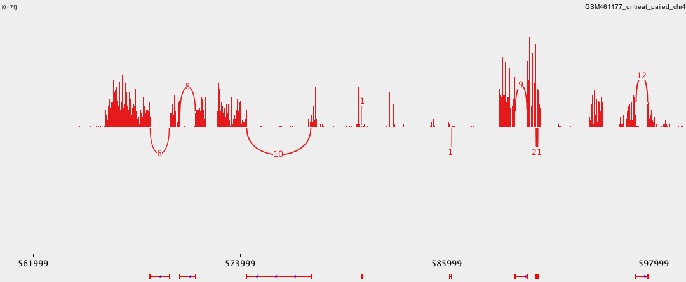
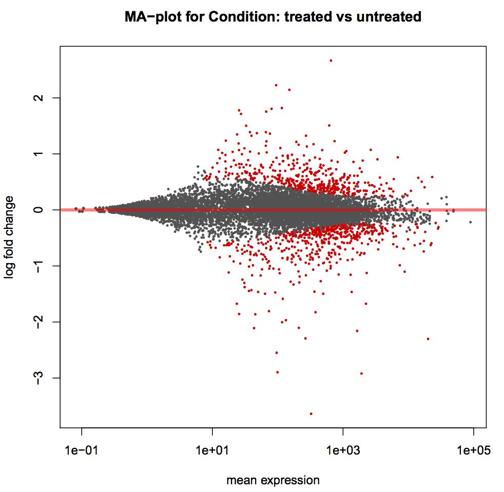
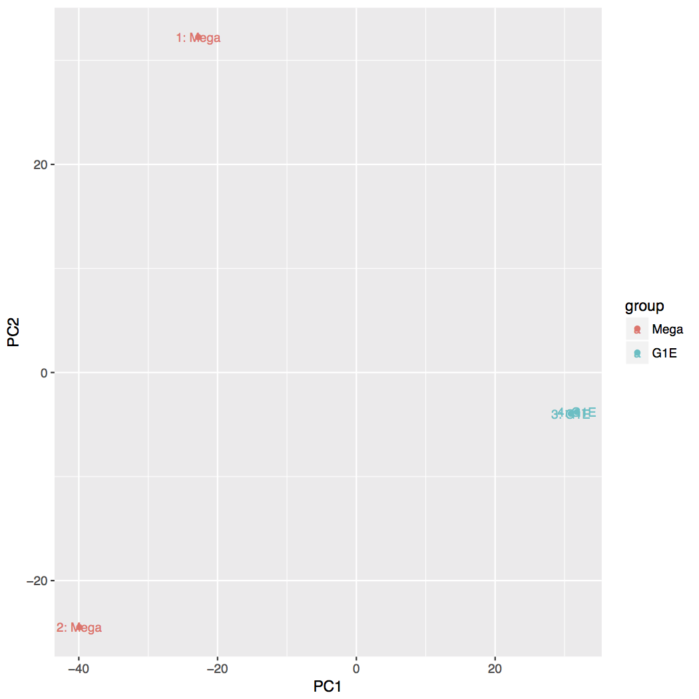
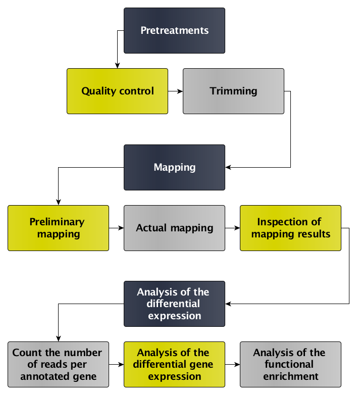

# Introduction

In the study of [Brooks *et al.* 2011](http://genome.cshlp.org/content/21/2/193.long), the Pasilla (PS) gene, *Drosophila* homologue of the Human splicing regulators Nova-1 and Nova-2 Proteins, was depleted in *Drosophila melanogaster* by RNAi. The authors wanted to identify exons that are regulated by Pasilla gene using RNA sequencing data.

Total RNA was isolated and used for preparing either single-end or paired-end RNA-seq libraries for treated (PS depleted) samples and untreated samples. These libraries were sequenced to obtain a collection of RNA sequencing reads for each sample. The effects of Pasilla gene depletion on splicing events can then be analyzed by comparison of RNA sequencing data of the treated (PS depleted) and the untreated samples. 

The genome of *Drosophila melanogaster* is known and assembled. It can be used as reference genome to ease this analysis.  In a reference based RNA-seq data analysis, the reads are aligned (or mapped) against a reference genome, *Drosophila melanogaster* here, to significantly improve the ability to reconstruct transcripts and then identify differences of expression between several conditions.

> ### Agenda
>
> In this tutorial, we will deal with:
>
> 1. [Pretreatments](#pretreatments)
> 2. [Mapping](#mapping)
> 3. [Analysis of the differential expression](#analysis-of-the-differential-expression)
> {: .agenda}

# Pretreatments

## Data upload

The original data is available at NCBI Gene Expression Omnibus (GEO) under accession number [GSE18508](http://www.ncbi.nlm.nih.gov/geo/query/acc.cgi?acc=GSE18508). 

We will look at the 7 first samples:

- 3 treated samples with Pasilla (PS) gene depletion: [GSM461179](https://www.ncbi.nlm.nih.gov/geo/query/acc.cgi?acc=GSM461179), [GSM461180](https://www.ncbi.nlm.nih.gov/geo/query/acc.cgi?acc=GSM461180), [GSM461181](https://www.ncbi.nlm.nih.gov/geo/query/acc.cgi?acc=GSM4611810)
- 4 untreated samples: [GSM461176](https://www.ncbi.nlm.nih.gov/geo/query/acc.cgi?acc=GSM461176), [GSM461177](https://www.ncbi.nlm.nih.gov/geo/query/acc.cgi?acc=GSM461177), [GSM461178](https://www.ncbi.nlm.nih.gov/geo/query/acc.cgi?acc=GSM461178), [GSM461182](https://www.ncbi.nlm.nih.gov/geo/query/acc.cgi?acc=GSM461182)

Each sample constitutes a separate biological replicate of the corresponding condition (treated or untreated). Moreover, two of the treated and two of the untreated samples are from a paired-end sequencing assay, while the remaining samples are from a single-end sequencing experiment.

We have extracted sequences from the Sequence Read Archive (SRA) files to build FASTQ files.

> ### :pencil2: Hands-on: Data upload
>
> 1. Create a new history for this RNA-seq exercise
> 2. Import a FASTQ file pair (*e.g.*  [`GSM461177_untreat_paired_subset_1`](https://zenodo.org/record/61771/files/GSM461177_untreat_paired_subset_1.fastq) and [`GSM461177_untreat_paired_subset_2`](https://zenodo.org/record/61771/files/GSM461177_untreat_paired_subset_2.fastq)) from [Zenodo](http://dx.doi.org/10.5281/zenodo.61771)
>
>    > ### :nut_and_bolt: Comments
>    > If you are using the [Freiburg Galaxy instance](http://galaxy.uni-freiburg.de), you can load the dataset using 'Shared Data' <i class="fa fa-long-arrow-right"></i> 'Data Libraries' <i class="fa fa-long-arrow-right"></i> 'Galaxy Courses' <i class="fa fa-long-arrow-right"></i> 'RNA-Seq' <i class="fa fa-long-arrow-right"></i> 'fastq'
>    {: .comment}
>
>    > ### :bulb: Tip: Importing data via links
>    >
>    > * Copy the link location
>    > * Open the Galaxy Upload Manager
>    > * Select **Paste/Fetch Data**
>    > * Paste the link into the text field
>    > * Press **Start**    
>    {: .tip}
>
>    > ### :bulb: Tip: Changing the file type `fastq` to `fastqsanger` once the data file is in your history
>    >
>    > * Click on the pencil button displayed in your dataset in the history
>    > * Choose **Datatype** on the top
>    > * Select `fastqsanger`
>    > * Press **Save**
>    {: .tip}
> 
>    As default, Galaxy takes the link as name. It also do not link the dataset to a database or a reference genome.
> 
>    > ### :nut_and_bolt: Comments
>    > - Edit the "Database/Build" to select "dm3"
>    > - Rename the datasets according to the samples
>    {: .comment}
> 
{: .hands_on}

Both files contain the first 100.000 paired-end reads of one sample. The sequences are raw sequences from the sequencing machine, without any pretreatments. They need to be controlled for their quality.

## Quality control

For quality control, we use similar tools as described in [NGS-QC tutorial](../../NGS-QC/tutorials/dive_into_qc): [FastQC](http://www.bioinformatics.babraham.ac.uk/projects/fastqc/) and [Trim Galore](http://www.bioinformatics.babraham.ac.uk/projects/trim_galore/).

> ### :pencil2: Hands-on: Quality control
>
> 1. **FastQC** :wrench:: Run FastQC on both FastQ files to control the quality of the reads
>
>    > ### :question: Questions
>    >
>    > 1. What is the read length?
>    > 2. Is there anything what you find striking when you compare both reports?
>    >
>    >    

>    >    
Click to view answers

>    >    <ol type="1">
>    >    <li>The read length is 37 bp</li>
>    >    <li>The report for GSM461177_untreat_paired_subset_1 is quite good compared to the one for GSM461177_untreat_paired_subset_2. For the latter, the per base sequence quality is bad around the 25th bp (same for the per base N content), because the quality in the 2nd tile is bad (maybe because of some event during sequencing). We need to be careful for the quality treatment and to do it with paired-end information</li>
>    >    </ol>
>    >    

>    {: .question}
>
> 2. **Trim Galore** :wrench:: Treat for the quality of sequences by running Trim Galore on the paired-end datasets
> 3. **FastQC** :wrench:: Re-run FastQC on Trim Galore's outputs and inspect the differences
{: .hands_on}

As the genome of *Drosophila melanogaster* is known and assembled, we can use this information and map the sequences on this genome to identify the effects of Pasilla gene depletion on splicing events.

# Mapping

To make sense of the reads, their positions within *Drosophila melanogaster* genome must be determined. This process is known as aligning or 'mapping' the reads to the reference genome.

> ### :nut_and_bolt: Comment
>
> Do you want to learn more about the principles behind mapping? Follow our [training](../../NGS-mapping)
> {: .comment}

Because in the case of a eukaryotic transcriptome, most reads originate from processed mRNAs lacking exons, they cannot be simply mapped back to the genome as we normally do for DNA data. Instead the reads must be separated into two categories:

- Reads that map entirely within exons
- Reads that cannot be mapped within an exon across their entire length because they span two or more exons

Spliced mappers have been developed to efficiently map transcript-derived reads against genomes. [TopHat](https://ccb.jhu.edu/software/tophat/index.shtml) was one of the first tools designed specifically to address this problem:

1. Identification of potential exons using reads that do map to the genome
2. Generation of possible splices between neighboring exons
3. Comparison of reads that did not initially map to the genome against these *in silico* created junctions

*[Kim et al., Genome Biology, 2013](https://genomebiology.biomedcentral.com/articles/10.1186/gb-2013-14-4-r36)*

TopHat needs to know two important parameters about the sequencing library

- The library type
- The mean inner distance between the mate pairs for paired-end data

These information should usually come with your FASTQ files, ask your sequencing facility! If not, try to find them on the site where you downloaded the data or in the corresponding publication. Another option is to estimate these parameters with a *preliminary mapping* of a *downsampled* file and some analysis programs. Afterward, the actual mapping can be redone on the original files with the optimized parameters.

To help finding the needed previous information and afterward annotating RNA sequences, we can take advantage from already known reference gene annotations.

> ### :pencil2: Hands-on: Drosophila annotation file upload
>
> 1. Load the Ensembl gene annotation for *Drosophila melanogaster* ([`Drosophila_melanogaster.BDGP5.78.gtf`](https://zenodo.org/record/61771/files/Drosophila_melanogaster.BDGP5.78.gtf)) from [Zenodo](http://dx.doi.org/10.5281/zenodo.61771) into your current Galaxy history and rename it
>
>    > ### :nut_and_bolt: Comments
>    > If you are using the [Freiburg Galaxy instance](http://galaxy.uni-freiburg.de), you can load the dataset using 'Shared Data' <i class="fa fa-long-arrow-right"></i> 'Data Libraries' <i class="fa fa-long-arrow-right"></i> 'Galaxy Courses' <i class="fa fa-long-arrow-right"></i> 'RNA-Seq' <i class="fa fa-long-arrow-right"></i> 'annotation'
>    {: .comment}
{: .hands_on}

## Preliminary mapping

In a preliminary mapping, we will estimate the needed parameters (library type and inner distance) to run TopHat efficiently afterwards.

> ### :nut_and_bolt: Comment
> This step is not necessary if you don't need to estimate the library type and the mean inner distance between the mate pairs for paired-end data.
{: .comment}

> ### :pencil2: Hands-on: Preliminary mapping and parameter estimation
>
> 1. **Select first** :wrench:: Downsample the FastQ files to 200k or 1M reads
>
>    > ### :nut_and_bolt: Comment
>    >
>    > For the provided files downsampling is not necessary as they only contain 100k reads
>    {: .comment}
>
> 2. **TopHat** :wrench:: Run **TopHat** with:
>    - "Paired-end (as individual datasets)" instead of "Single-end"
>    - The Trim Galore outputs in the correct order (forward and reverse reads)
>    - "Drosophila melanogaster: dm3" as reference genome
>    - Default values for *strandedness* and *insert size*
>
> 3. **Inner Distance** :wrench:: Run **Inner Distance** on the BAM file generated by TopHat using the imported `Drosophila_melanogaster.BDGP5.78.gtf` reference gene model to estimate the *inner distance* between the two reads for paired-end data
> 4. Inspect the resulting PDF
>
>    > ### :question: Question
>    > What is the mean value for the inner distance?
>    >
>    > 

>    > 
Click to view answer

>    > The mean value is 112. But, if you already have read the corresponding paper carefully you might know that the fragment size is ~200bp. With read lengths of 2x37bp an educated guess could also be 125 for the inner distance. It's up to your decision, which value you prefer. 
>    > 

>    {: .question}
>
> 5. **Infer Experiment** :wrench:: Run **Infer Experiment** with the same files
> 6. Check the results and search the tool's documentation for help on the meaning
>    
>    > ### :nut_and_bolt: Comment
>    > As it is sometimes quite difficult to find out which settings correspond to those of other programs, the following table might be helpful to identify the library type:
>    > 
>    > Library type | **Infer Experiment** | **TopHat** | **HISAT2** | **htseq-count** | **featureCounts**
>    > --- | --- | --- | --- | --- | ---
>    > PE | "1++,1--,2+-,2-+" | "FR Second Strand" | "FR" | "yes" | "1"
>    > PE | "1+-,1-+,2++,2--" | "FR First Strand" | "RF" | "reverse" | "2"
>    > SE | "++,--" | "FR Second Strand" | "F" | "yes" | "1"
>    > SE | "+-,-+" | "FR First Strand" | "R" | "reverse" | "2"
>    > SE,PE | undecided | "FR Unstranded" | default | "no" | "0"
>    > 
>    {: .comment}
>    
>    > ### :question: Question
>    > 
>    > 1. Which fraction of the different type of library type?
>    > 2. Which library type do you chose? What is the correspondance in **TopHat**?
>    >
>    >    

>    >    
Click to view answer

>    >    <ol type="1">
>    >    <li>Fraction of reads explained by "1++,1--,2+-,2-+": 0.5176 and Fraction of reads explained by "1+-,1-+,2++,2--": 0.4824</li>
>    >    <li>As reads are not explained by any configuration significantly, it is an "unstranded" library.</li>
>    >    </ol>
>    >    

>    {: .question}
{: .hands_on}

## Actual mapping

With these estimated parameters, we can now map all the RNA sequences on the *Drosophila melanogaster* genome using TopHat.

> ### :pencil2: Hands-on: Spliced mapping
>
> 1. **TopHat** :wrench:: Run **TopHat** with the full parameter set to get the best mapping results:
>    - "Paired-end (as individual datasets)" instead of "Single-end"
>    - "Mean Inner Distance" to the previously determined value
>    - "Drosophila melanogaster: dm3" as reference genome
>    - "Full parameter list" for "TopHat settings to use"
>    - "Library type" to the previously determined value
>    - "18" for the "Minimum length of read segments"
>
>        By default, TopHat proposes to fix the minimum length of read segments to 25, but a value of 18 seems to be a more appropriate value for this input data.
>
>        > ### :question: Question
>        >
>        > Why?
>        > 
>        > 

>        > 
Click to view answer

>        > Remember that the total length of the reads are 37 bases. With 25, we left with segments of lengths 25 (or more) and 12 (or less) bases. The 12 base long reads lead to huge number of multi mappings. Setting this option to 18 results in bit longer segments and in best case both of them can be mapped properly.           
>        > 

>        {: .question}
>
>    - "Yes" for use of own junction data
>    - "Yes" for use of Gene Annotation Model
>    - `Drosophila_melanogaster.BDGP5.78.gtf` as Gene Model Annotations (to enable transcriptome alignment)
>    - "No (--coverage-search)" to use coverage-based search for junctions as it needs a lot a time. But consider this option for real world data.
>
>        The TopHat algorithm splits reads into segments to map the reads across splice junctions. Coverage-based search for junctions increases the sensitivity.
>
> 2. Inspect the "align summary" file
>
>    > ### :question: Question
>    >
>    > 1. How many forward reads were mapped? And how many reverse reads?
>    > 2. What is the "overall read mapping rate"? And the "concordant pair alignment rate"?
>    > 3. Why do some reads have multiple alignments?
>    > 
>    >    

>    >    
Click to view answer

>    >    <ol type="1">
>    >    <li>90.7% of the forward reads were mapped and 85.8% of the reverse reads</li>
>    >    <li>The "overall read mapping rate" is the rate of mapping when we take into account all reads (forward and reverse reads). Here it is 88.3%. The "concordant pair alignment rate" is (number of aligned pair - number of discordant alignments)/(number of paired reads). Here the value is 80.3%, a quite good value. Maximizing this value is the goal.</li>
>    >    <li>The reads are small and with pseudogenes and other valid genome duplications, it is possible that the reads are mapped multiple times</li>
>    >    </ol>
>    >    

>    {: .question}
{: .hands_on}

**TopHat** generates a BAM file with the mapped reads and three BED files containing splice junctions, insertions and deletions.

The mapping exercise worked for you? Great! :tada:

> ### :pencil2: (Optional) Hands-on: Map other datasets
>
> You can do the same process on the other sequence files available on [Zenodo](http://dx.doi.org/10.5281/zenodo.61771)
> 
> - Paired-end data
>     - `[GSM461178_untreat_paired_subset_1](GSM461178_untreat_paired_subset_1.fastq)` and `[GSM461178_untreat_paired_subset_2](GSM461178_untreat_paired_subset_2.fastq)`
>     - `[GSM461180_treat_paired_subset_1](GSM461180_treat_paired_subset_1.fastq)` and `[GSM461180_treat_paired_subset_2](GSM461180_treat_paired_subset_2.fastq)`
>     - `[GSM461181_treat_paired_subset_1](GSM461181_treat_paired_subset_1.fastq)` and `[GSM461181_treat_paired_subset_2](GSM461181_treat_paired_subset_2.fastq)`
> - Single-end data
>     - `[GSM461176_untreat_single_subset](GSM461176_untreat_single_subset.fastq)`
>     - `[GSM461179_treat_single_subset](GSM461179_treat_single_subset.fastq)`
>     - `[GSM461182_untreat_single_subset](GSM461182_untreat_single_subset.fastq)`
>
> This is really interesting to redo on the other datasets, specially to check how the parameters are inferred given the different type of data.
{: .hands_on}

## Inspection of TopHat results

However, the datasets we used were a subset of the original data. They are then too small to give you a good impression of how real data looks like. So we have run TopHat for you on the real datasets. We extracted only the reads mapped to chromosome 4 of *Drosophila*.

> ### :pencil2: Hands-on: Inspection of TopHat results
>
> 1. Create a new history
> 2. Import from [Zenodo](http://dx.doi.org/10.5281/zenodo.61771) into the new history the following files:
>    - [`GSM461177_untreat_paired_chr4.bam`](https://zenodo.org/record/61771/files/GSM461177_untreat_paired_chr4.bam)
>    - [`GSM461177_untreat_paired_deletions_chr4.bed`](https://zenodo.org/record/61771/files/GSM461177_untreat_paired_deletions_chr4.bed)
>    - [`GSM461177_untreat_paired_insertions_chr4.bed`](https://zenodo.org/record/61771/files/GSM461177_untreat_paired_insertions_chr4.bed)
>    - [`GSM461177_untreat_paired_junctions_chr4.bed`](https://zenodo.org/record/61771/files/GSM461177_untreat_paired_junctions_chr4.bed)
> 
>    > ### :nut_and_bolt: Comments
>    > If you are using the [Freiburg Galaxy instance](http://galaxy.uni-freiburg.de), you can load the dataset using 'Shared Data' <i class="fa fa-long-arrow-right"></i> 'Data Libraries' <i class="fa fa-long-arrow-right"></i> 'Galaxy Courses' <i class="fa fa-long-arrow-right"></i> 'RNA-Seq' <i class="fa fa-long-arrow-right"></i> 'sample_tophat2_out'
>    {: .comment}
>
> 3. **IGV** :wrench:: Visualize this BAM file and the three BED files, particularly the region on chromosome 4 between 560 kb to 600 kb (`chr4:560,000-600,000`)
>
>    > ### :nut_and_bolt: Comment
>    > - Change the data type from "tabular" to "bed"
>    > - Rename the datasets according to the samples
>    {: .comment}
>
>    > ### :nut_and_bolt: Comment
>    >
>    > Check [IGV documentation](http://software.broadinstitute.org/software/igv/AlignmentData)
>    {: .comment}
>
>    > ### :question: Question
>    >
>    > 1. Which information does the `GSM461177_untreat_paired_junctions_chr4.bed` BED file contain?
>    > 2. How is this information represented in the BED file? And in IGV?
>    > 3. Where is the "JUNC00013368" junction situated? What is its score?
>    > 4. How many reads are concerned by the "JUNC00013368" junction, visible when we zoom on `chr4:568,476-571,814`? Can you relate that to the score?
>    > 5. And how many are concerned by the "JUNC00013369" junction? 
>    >
>    >    

>    >    
Click to view answers

>    >    <ol type="1">
>    >    <li>`GSM461177_untreat_paired_junctions_chr4.bed` BED file contain the splicing events, *i.e.* when at least a single read splits across two exons in the alignment track</li>
>    >    <li>The BED file is a tabular with: Chrom, Start, End, Name, Score, Strand, ThickStart, ThickEnd, ItemRGB, BlockCount, BlockSizes, BlockStart. In IGV, the junctions are represented by an arc from the beginning to the end of the junction. The color of the arc represent the strand on which the junction is found. The height of the arc, and its thickness, are proportional to the depth of read coverage. </li>
>    >    <li>The "JUNC00013368" junction starts at 568,736 and ends at 569,905. It has a score of 6.</li>
>    >    <li>6 reads split across "JUNC00013368", exactly the score</li>
>    >    <li>8 reads split across "JUNC00013369". 3 reads are also mapped in the junction chromosome part: these reads are then part of the exon and be implied in a different splicing.</li>
>    >    </ol>
>    >    

>    {: .question}
>
> 3. **IGV** :wrench:: Unzoom to `chr4:560,000-600,000` and inspect the splice junctions using a **Sashimi plot**
>
>    > ### :bulb: Tip: Creation of a Sashimi plot
>    >
>    > * Right click on the BAM file
>    > * Select **Sashimi Plot** from the context menu
>    {: .tip}
>
>    
>
>    > ### :question: Question
>    >
>    > 1. What does the bar graph represent? And the numbered line?
>    > 2. What does the number means?
>    > 3. What is the name of the junction where 10 reads split? What is its position on the genome?
>    > 
>    >    

>    >    
Click to view answers

>    >    <ol type="1">
>    >    <li>The coverage for each alignment track is plotted as a bar graph. Arcs representing splice junctions connecting exons</li>
>    >    <li>Arcs display the number of reads split across the junction (junction depth). </li>
>    >    <li>JUNC00013370 starts at 574338 and ends at 578091.</li>
>    >    </ol>
>    >    

>    {: .question}
>
>    > ### :nut_and_bolt: Comment
>    >
>    > Check [IGV documentation on Sashimi plots](http://software.broadinstitute.org/software/igv/Sashimi) to find some clues
>    {: .comment}
>
> 4. **IGV** :wrench:: Look around to find other regions with interesting junctions, *e.g.* `chr4:870,000-940,000`
{: .hands_on}

# Analysis of the differential gene expression

To identify exons that are regulated by the Pasilla gene, we need to identify genes and exons which are differentially expressed between samples with PS gene depletion and control samples.

## Count the number of reads per annotated gene

To compare the expression of single genes between different conditions (*e.g.* with or without PS depletion), an first essential step is to quantify the number of reads per gene. [**HTSeq-count**](http://www-huber.embl.de/users/anders/HTSeq/doc/count.html) is one of the most popular tool for gene quantification.

To quantify the number of reads mapped to a gene, an annotation of the genomic features as it is in the genes is needed. We already upload on Galaxy the [`Drosophila_melanogaster.BDGP5.78.gtf`](https://zenodo.org/record/61771/files/Drosophila_melanogaster.BDGP5.78.gtf) with the Ensembl gene annotation for *Drosophila melanogaster*.

In principle, the counting of reads overlapping with genomic features is a fairly simple task, but there are some details that need to be decided. **HTSeq-count** offers 3 choices ("union", "intersection_strict" and "intersection_nonempty") to handle read mapping to multiple locations, reads overlapping introns, or reads that overlap more than one genomic feature:

*[HTSeq documentation](http://www-huber.embl.de/users/anders/HTSeq/doc/count.html)*

The recommended mode is "union", which counts overlaps even if a read only shares parts of its sequence with a genomic feature and disregards reads that overlap more than one feature.

> ### :pencil2: Hands-on: Counting the number of reads per annotated gene
>
> 1. Copy the `Drosophila_melanogaster.BDGP5.78.gtf` file from the first history
>
>    > ### :bulb: Tip: Copying a file from an history to an other
>    >
>    > * Click on "View all histories" in the top right
>    > * Drag and drop the file you want to copy to your new history
>    > * Click on "Done" on the top left
>    {: .tip}
>
> 2. **HTSeq-count** :wrench:: Run **HTSeq-count** on the sorted BAM file with
>    - `Drosophila_melanogaster.BDGP5.78.gtf` as "GFF file"
>    - The "union" mode
>    - A "Minimum alignment quality" of 10
> 3. Inspect the result files
>
>    > ### :question: Question
>    >
>    > Which feature has the most reads mapped on it?
>    > 
>    >    

>    >    
Click to view answers

>    >    To display the most found feature, we need first to sort the output file with the feature and the number of reads found for these feature. We do that using Sort tool, on the second column and in descending order. And we found that FBgn0017545 is the feature with the most reads mapped on it with 4,030 reads.
>    >    

>    {: .question}
{: .hands_on}

## Analysis of the differential gene expression

In the previous section, we counted only reads that mapped to chromosome 4 for only one sample. To be able to identify differential gene expression induced by PS depletion, all datasets (3 treated and 4 untreated) must be analyzed with the similar procedure.

You can export a workflow from the previous steps and rerun it on the 7 samples whose the raw sequences are available on [Zenodo](http://dx.doi.org/10.5281/zenodo.61771). For time saving, we run the previous steps for you and obtain 7 count files, available on [Zenodo](http://dx.doi.org/10.5281/zenodo.61771)

These files contain for each gene the number of reads mapped to it. We could compare directly the files and then having the differential gene expression. But the number of sequenced reads mapped to a gene depends on:

- Its own expression level
- Its length
- The sequencing depth
- The expression of all other genes within the sample

Either for within or for inter-sample comparison, the counts need to be normalized. We can then use the Differential Gene Expression (DGE) analysis, whose two basic tasks are:

- Estimate the biological variance using the replicates for each condition
- Estimate the significance of expression differences between any two conditions

This expression analysis is estimated from read counts and attempts are made to correct for variability in measurements using replicates that are absolutely essential accurate results. For your own analysis, we advice you to use at least 3, better 5 biological replicates. 

[**DESeq2**](https://bioconductor.org/packages/release/bioc/html/DESeq2.html) is a great tool for DGE analysis. It takes read counts produced by **HTseq-count** and applies size factor normalization:

- Computation for each gene of the geometric mean of read counts across all samples
- Division of every gene count by the geometric mean
- Use of the median of these ratios as sample's size factor for normalization

Multiple factors can then be incorporated in the analysis. In our example, we have samples with two varying factors:

- Treatment (either treated or untreated)
- Sequencing type (paired-end or single-end)

Here treatment is the primary factor which we are interested in.The sequencing type is some further information that we know about the data that might effect the analysis. This particular multi-factor analysis allows us to assess the effect of the treatment taking also the sequencing type into account.

> ### :pencil2: Hands-on:
>
> 1. Create a new history
> 2. Import the seven count files from [Zenodo](http://dx.doi.org/10.5281/zenodo.61771)
>    - [GSM461176_untreat_single.counts](https://zenodo.org/record/61771/files/GSM461176_untreat_single.counts)
>    - [GSM461177_untreat_paired.counts](https://zenodo.org/record/61771/files/GSM461177_untreat_paired.counts)
>    - [GSM461178_untreat_paired.counts](https://zenodo.org/record/61771/files/GSM461178_untreat_paired.counts)
>    - [GSM461179_treat_single.counts](https://zenodo.org/record/61771/files/GSM461179_treat_single.counts)
>    - [GSM461180_treat_paired.counts](https://zenodo.org/record/61771/files/GSM461180_treat_paired.counts)
>    - [GSM461181_treat_paired.counts](https://zenodo.org/record/61771/files/GSM461181_treat_paired.counts)
>    - [GSM461182_untreat_single.counts](https://zenodo.org/record/61771/files/GSM461182_untreat_single.counts)
>
>    > ### :nut_and_bolt: Comments
>    > If you are using the [Freiburg Galaxy instance](http://galaxy.uni-freiburg.de), you can load the dataset using 'Shared Data' <i class="fa fa-long-arrow-right"></i> 'Data Libraries' <i class="fa fa-long-arrow-right"></i> 'Galaxy Courses' <i class="fa fa-long-arrow-right"></i> 'RNA-Seq' <i class="fa fa-long-arrow-right"></i> 'count_tables'
>    {: .comment}
>
> 3. **DESeq2** :wrench:: Run **DESeq2** with:
>    - "Treatment" as first factor with "treated" and "untreated" as levels and selection of count files corresponding to both levels
>
>       > ### :nut_and_bolt: Comment
>       >
>       > You can select several files by keeping the CTRL (or COMMAND) key pressed and clicking on the interesting files 
>       {: .comment}
>
>    - "Sequencing" as second factor with "PE" and "SE" as levels and selection of count files corresponding to both levels
>
>    > ### :nut_and_bolt: Comment
>    >
>    > File names have all information needed
>    {: .comment}
{: .hands_on}

The first output of **DESeq2** is a tabular file. The columns are:

1.	Gene identifiers
2.	Mean normalized counts, averaged over all samples from both conditions
3.	Logarithm (to basis 2) of the fold change

    The log2 fold changes are based on primary factor level 1 vs. factor level 2. The order of factor levels is then important. For example, for the factor 'Treatment', DESeq2 computes fold changes of 'treated' samples against 'untreated', *i.e.* the values correspond to up- or downregulations of genes in treated samples.

4.	Standard error estimate for the log2 fold change estimate
5.	[Wald](https://en.wikipedia.org/wiki/Wald_test) statistic
6.	*p*-value for the statistical significance of this change
7.	*p*-value adjusted for multiple testing with the Benjamini-Hochberg procedure which controls false discovery rate ([FDR](https://en.wikipedia.org/wiki/False_discovery_rate))

> ### :pencil2: Hands-on:
>
>1. **Filter** :wrench:: Run **Filter** to extract genes with a significant change in gene expression (adjusted *p*-value equal or below 0.05) between treated and untreated samples
>
>    > ### :question: Question
>    >
>    > How many genes have a significant change in gene expression between these conditions?
>    > 
>    > 

>    > 
Click to view answers

>    > To filter, you need to add the expression "c7&lt;0.05". And we get 751 genes (5.05%) with a significant change in gene expression between treated and untreated samples.
>    > 

>    {: .question}
>
>    > ### :nut_and_bolt: Comment
>    >
>    > The file with the independent filtered results can be used for further downstream analysis as it excludes genes with only few read counts as these genes will not be considered as significantly differentially expressed.
>    {: .comment}
>
> 2. **Filter** :wrench:: Extract genes that are significantly up and downregulated in treated samples
>
>    > ### :nut_and_bolt: Comments
>    > Rename your datasets for the downstream analyses
>    {: .comment}
>
>    > ### :question: Question
>    >
>    > Are there more upregulated or downregulated genes in the treated samples?
>    > 
>    > 

>    > 
Click to view answers

>    > To obtain the up-regulated genes, we filter the previously generated file (with the significant change in gene expression) with the expression "c3>0" (the log2 fold changes must be greater than 0). We obtain 331 genes (44.07% of the genes with a significant change in gene expression). For the down-regulated genes, we did the inverse and we 420 genes (55.93% of the genes with a significant change in gene expression)
>    > 

>    {: .question}
{: .hands_on}

In addition to the list of genes, **DESeq2** outputs a graphical summary of the results, useful to evaluate the quality of the experiment:

1. Histogram of *p*-values for all tests

    

2. [MA plot](https://en.wikipedia.org/wiki/MA_plot): global view of the relationship between the expression change of conditions (log ratios, M), the average expression strength of the genes (average mean, A), and the ability of the algorithm to detect differential gene expression. The genes that passed the significance threshold (adjusted p-value < 0.1) are colored in red.

    

3. Principal Component Analysis ([PCA](https://en.wikipedia.org/wiki/Principal_component_analysis)) and the first two axes

    

    Each replicate is plotted as an individual data point. This type of plot is useful for visualizing the overall effect of experimental covariates and batch effects.

    > ### :question: Questions
    >
    > 1. What is the first axis separating?
    > 2. And the second axis?    
    > 
    >    

    >    
Click to view answers

    >    <ol type="1">
    >    <li>The first axis is seperating the treated samples from the untreated samples, as defined when DeSeq was launched</li>
    >    <li>The second axis is separating the single-end datasets from the paired-end datasets</li>
    >    </ol>
    >    

    {: .question}

4. Heatmap of sample-to-sample distance matrix: overview over similarities and dissimilarities between samples

    

    > ### :question: Questions
    >
    > How are the samples grouped?
    > 
    >    

    >    
Click to view answers

    >    They are first grouped depending on the treatment (the first factor) and after on the library type (the second factor), as defined when DeSeq was launched
    >    </ol>
    >    

    {: .question}

5. Dispersion estimates: gene-wise estimates
(black), the fitted values (red), and the final maximum a posteriori estimates used in testing
(blue)

    

    This dispersion plot is typical, with the final estimates shrunk from the gene-wise estimates towards the fitted estimates. Some gene-wise estimates are flagged as outliers and not shrunk towards the fitted value. The amount of shrinkage can be more or less than seen here, depending on the sample size, the number of coefficients, the row mean and the variability of the gene-wise estimates.

For more information about **DESeq2** and its outputs, you can have a look at [**DESeq2** documentation](https://www.bioconductor.org/packages/release/bioc/manuals/DESeq2/man/DESeq2.pdf).

## Analysis of the functional enrichment among differentially expressed genes

We have extracted genes that are differentially expressed in treated (with PS gene depletion) samples compared to untreated samples. We would like to know the functional enrichment among the differentially expressed genes.

The Database for Annotation, Visualization and Integrated Discovery ([DAVID](https://david.ncifcrf.gov/)) provides a comprehensive set of functional annotation tools for investigators to understand the biological meaning behind large lists of genes.

We use then DAVID to identify functional annotations of the upregulated genes and the downregulated genes.

> ### :pencil2: Hands-on:
>
> 1. **Sort** :wrench:: Sort the 2 datasets generated previously (upregulated genes and downregulated genes) given the log2 fold change, in descending or ascending order (to obtain the higher absolute log2 fold changes on the top)
> 1. **Select first lines from a dataset** :wrench:: Extract the first 100 lines of sorted files
> 2. **DAVID** :wrench:: Run **DAVID** on these files with
>     - First column as "Column with identifiers"
>     - "FLYBASE_GENE_ID" as "Identifier type"
>
>    The output of the **DAVID** tool is a HTML file with a link to the DAVID website.
>
> 2. Inspect the Functional Annotation Chart
>
>    > ### :question: Questions
>    >
>    > What functional categories are the most represented? 
>    >  
>    > 

>    > 
Click to view answers

>    > The up-regulated genes are mostly related to membrane (in the number of genes). The most represented functional categories are linked to signal and pathways for the down-regulated genes.
>    > 

>    {: .question}
>
> 3. Inspect the Functional Annotation Clusterings
>
>    > ### :question: Questions
>    >
>    > What functional annotations are the first clusters related to?
>    >  
>    > 

>    > 
Click to view answers

>    > For the up-regulated genes, the first cluster is more composed of functions related to chaperone and stress response. The down-regulated genes are more linked to ligase activity.
>    > 

>    {: .question}
{: .hands_on}

# Inference of the differential exon usage

Now, we would like to know the differential exon usage between treated (PS depleted) and untreated samples using RNA-seq exon counts. We will rework on the mapping results ([`GSM461177_untreat_paired_chr4.bam`](https://zenodo.org/record/61771/files/GSM461177_untreat_paired_chr4.bam)).

We use [DEXSeq](http://www.bioconductor.org/packages/release/bioc/html/DEXSeq.html). DEXSeq detects high sensitivity genes, and in many cases exons, that are subject to differential exon usage. 

First, we need to count the number of reads mapping the exons. 

## Count the number of reads per exon

This step is similar to the step of [counting the number of reads per annotated gene](#count-the-number-of-reads-per-annotated-gene). Here instead of HTSeq-count, we are using DEXSeq-Count. 

> ### :pencil2: Hands-on: Counting the number of reads per exon
>
> 1. Copy the `Drosophila_melanogaster.BDGP5.78.gtf` file from the first history
> 2. **DEXSeq-Count** :wrench:: Use the **DEXSeq-Count** to prepare the *Drosophila* annotations to extract only exons with corresponding gene ids
>     - "Prepare annotation" of "Mode of operation" 
>
>    The output is again a GTF file that is ready to use for counting
>   
> 3. Copy the `GSM461177_untreat_paired_chr4.bam` file from the second history
> 4. **DEXSeq-Count** :wrench:: Count reads using **DEXSeq-Count** with
>     - `GSM461177_untreat_paired_chr4.bam` as "Input bam file"
>     - The formatted GTF file
> 5. Inspect the result files
>
>    > ### :question: Question
>    >
>    > Which exon has the most read mapped on it? From which gene has this exon beed extracted? Is it similar to the previous result with HTSeq-count?
>    > 
>    > 

>    > 
Click to view answers

>    > FBgn0017545:004 is the exon with the most read mapped on it. It is part of FBgn0017545, the feature with the most reads mapped with HTSeq-count
>    > 

>    {: .question}
{: .hands_on}

## Differential exon usage

DEXSeq usage is similar to DESeq2. It uses similar statistics to find differentially used exons. 

As for DESeq2, we counted only reads that mapped to exons on chromosome 4 for only one sample in the previous step. To be able to identify differential exon usage induced by PS depletion, all datasets (3 treated and 4 untreated) must be analyzed with the similar procedure. For time saving, we did that for you. The results are available on [Zenodo](http://dx.doi.org/10.5281/zenodo.61771):

- [dexseq.gtf](https://zenodo.org/record/61771/files/dexseq.gtf): the results of the running DEXSeq-count in 'Prepare annotation' mode
- Seven files, counts files generated in 'Count reads' mode

> ### :pencil2: Hands-on:
>
> 1. Create a new history
> 2. Import the seven count files and the dexseq.gtf from [Zenodo](http://dx.doi.org/10.5281/zenodo.61771)
>    - [dexseq.gtf](https://zenodo.org/record/61771/files/dexseq.gtf)
>    - [treated1_single.txt](https://zenodo.org/record/61771/files/treated1_single.txt)
>    - [treated2_paired.txt](https://zenodo.org/record/61771/files/treated2_paired.txt)
>    - [treated3_paired.txt](https://zenodo.org/record/61771/files/treated3_paired.txt)
>    - [untreated1_single.txt](https://zenodo.org/record/61771/files/untreated1_single.txt)
>    - [untreated2_single.txt](https://zenodo.org/record/61771/files/untreated2_single.txt)
>    - [untreated3_paired.txt](https://zenodo.org/record/61771/files/untreated3_paired.txt)
>    - [untreated4_paired.txt](https://zenodo.org/record/61771/files/untreated4_paired.txt)
>
>    > ### :nut_and_bolt: Comments
>    > If you are using the [Freiburg Galaxy instance](http://galaxy.uni-freiburg.de), you can load the dataset using 'Shared Data' <i class="fa fa-long-arrow-right"></i> 'Data Libraries' <i class="fa fa-long-arrow-right"></i> 'Galaxy Courses' <i class="fa fa-long-arrow-right"></i> 'RNA-Seq' <i class="fa fa-long-arrow-right"></i> 'dexseq'
>    {: .comment}
>
> 3. **DEXSeq** :wrench:: Run **DEXSeq** with
>    - "Condition" as first factor with "treated" and "untreated" as levels and selection of count files corresponding to both levels
>    - "Sequencing" as second factor with "PE" and "SE" as levels and selection of count files corresponding to both levels
>
>    > ### :nut_and_bolt: Comment
>    >
>    > Unlike DESeq2, DEXSeq does not allow flexible primary factor names. Always use your primary factor name as "condition"
>    {: .comment}
{: .hands_on}

Similarly to DESeq2, DEXSeq generates a table with:

1.  Exon identifiers
2.  Gene identifiers
3.  Exon identifiers in the Gene
4.  Mean normalized counts, averaged over all samples from both conditions
5.  Logarithm (to basis 2) of the fold change

    The log2 fold changes are based on primary factor level 1 vs. factor level 2. The order of factor levels is then important. For example, for the factor 'Condition', DESeq2 computes fold changes of 'treated' samples against 'untreated', *i.e.* the values correspond to up- or downregulations of genes in treated samples.

6.  Standard error estimate for the log2 fold change estimate
7.  *p*-value for the statistical significance of this change
8.  *p*-value adjusted for multiple testing with the Benjamini-Hochberg procedure which controls false discovery rate ([FDR](https://en.wikipedia.org/wiki/False_discovery_rate))

> ### :pencil2: Hands-on:
>
> 1. **Filter** :wrench:: Run **Filter** to extract exons with a significant usage (adjusted *p*-value equal or below 0.05) between treated and untreated samples
>
>    > ### :question: Question
>    >
>    > How many exons have a significant change in usage between these conditions?
>    > 
>    > 

>    > 
Click to view answers

>    > We get 38 exons (12.38%) with a significant usage change between treated and untreated samples
>    > 

>    {: .question}
{: .hands_on}

# Annotation of the result tables with gene information

Unfortunately, in the process of counting, we loose all the information of the gene except its identifiant. In order to get the information back to our final counting tables, we can use a tool to make the correspondance between identifiant and annotation.

> ### :pencil2: Hands-on:
>
> 1. **Annotate DE(X)Seq result** :wrench:: Run **Annotate DE(X)Seq result** on a counting table (from DESeq or DEXSeq) using the `Drosophila_melanogaster.BDGP5.78.gtf` as annotation file
{: .hands_on}

# Conclusion

In this tutorial, we have analyzed real RNA sequencing data to extract useful information, such as which genes are up- or downregulated by depletion of the Pasilla gene and which genes are regulated by the Pasilla gene. To answer these questions, we analyzed RNA sequence datasets using a reference-based RNA-seq data analysis approach. This approach can be sum up with the following scheme:

