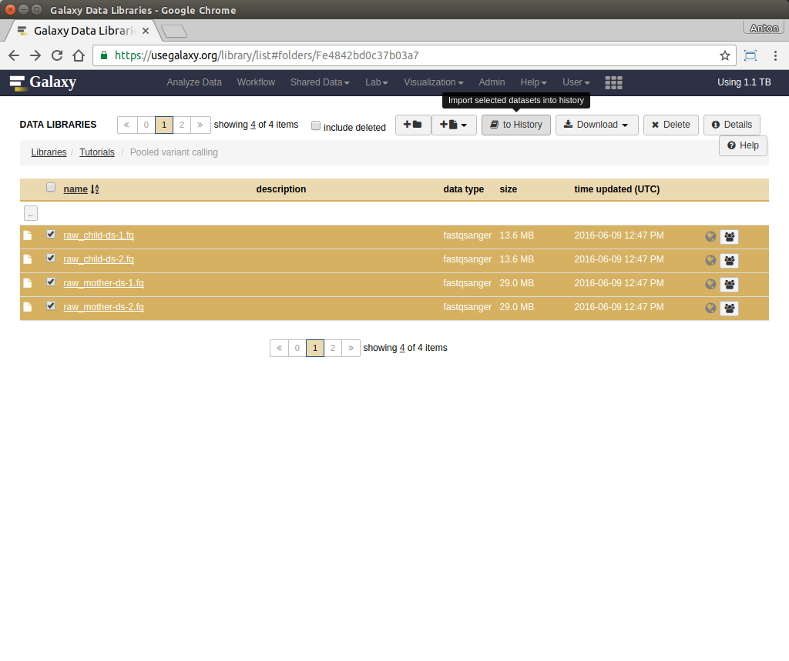

# Introduction

The majority of life on Earth is non-diploid and represented by prokaryotes, viruses and their derivatives such as our own mitochondria or plant's chloroplasts. In non-diploid systems allele frequencies can range anywhere between 0 and 100% and there could be multiple (not just two) alleles per locus. The main challenge associated with non-diploid variant calling is the difficulty in distinguishing between sequencing noise (abundant in all NGS platforms) and true low frequency variants. Some of the early attempts to do this well have been accomplished on human mitochondrial DNA although the same approaches will work equally good on viral and bacterial genomes:

* 2014 - [Maternal age effect and severe germ-line bottleneck in the inheritance of human mitochondrial DNA](http://www.pnas.org/content/111/43/15474.abstract)
* 2015 - [Extensive tissue-related and allele-related mtDNA heteroplasmy suggests positive selection for somatic mutations](http://www.pnas.org/content/112/8/2491.abstract).

As an example of non-diploid system we will be using human mitochondrial genome as an example. However, this approach will also work for most bacterial and viral genomes as well.

> ### Agenda
>
> In this tutorial, we will deal with:
>
> 1. [Pretreatments](#pretreatments)
> 2. [Mapping](#mapping)
> 3. [Analysis of the differential expression](#analysis-of-the-differential-expression)
> {: .agenda}

# Mapping and pre-processing

There are two ways one can call variants: 

1. By comparing reads against an existing genome assembly
2. By assembling genome first and then mapping against that assembly

|                          |
|--------------------------|
|  |
| <small>This figure from a manuscript by [Olson:2015](https://www.ncbi.nlm.nih.gov/pmc/articles/PMC4493402/) contrasts the two approaches.</small> |

In this tutorials we will take the *first* path is which we map reads against an existing assembly. Later in the course (after we learn about assembly approaches) we will try the second approach as well. 

## Finding variants in human mitochondria

The goal of this example is to detect heteroplasmies (variants within mitochondrial DNA). Mitochondria is transmitted maternally and heteroplasmy frequencies may change dramatically and unpredictably during the transmission, due to a germ-line bottleneck [Cree:2008](http://www.nature.com/ng/journal/v40/n2/abs/ng.2007.63.html). As we mentioned above the procedure for finding variants in bacterial or viral genomes will be essentially the same.

[A Galaxy Library](https://usegalaxy.org/library/list#folders/Fe4842bd0c37b03a7) contains datasets representing a child and a mother. These datasets are obtained by paired-end Illumina sequencing of human genomic DNA enriched for mitochondria. The enrichment was performed using long-range PCR with two primer pairs that amplify the entire mitochondrial genome. This means that these samples still contain a lot of DNA from the nuclear genome, which, in this case, is a contaminant. 

But first lets import data into Galaxy:

> ### :pencil2: Data upload
>
> 
>
>Select four datasets from [a library](https://usegalaxy.org/library/list#folders/Fe4842bd0c37b03a7) and click **to History**. 
{: .hands_on}

Let's QC the datasets first by running  **NGS: QC and manipulation &#8594; FastQC**:

>
>
>QC'ing reads using [FastQC](http://www.bioinformatics.babraham.ac.uk/projects/fastqc/). Note that we selected all four datasets at once by pressing the middle button  adjacent to the **Short read data from your current history** widget. 

The data have generally high quality in this example:

>
>
>FastQC plot for one of the mitochondrial datasets shows that qualities are acceptable for 250 bp reads (mostly in the green, which is at or above [phred score](https://en.wikipedia.org/wiki/Phred_quality_scorescore) of 30). 

## Subpart 1

Short introduction about this subpart.

> ### :pencil2: Hands-on: Data upload
>
> 1. Step1
> 2. Step2
>
>    > ### :nut_and_bolt: Comments
>    > A comment
>    {: .comment}
>
>    > ### :bulb: Tip: A tip
>    >
>    > * Step1
>    > * Step2
>    {: .tip}
{: .hands_on}

## Subpart 2

Short introduction about this subpart.

> ### :pencil2: Hands-on: Data upload
>
> 1. Step1
> 2. Step2
>
>    > ### :question: Question
>    >
>    > Question?
>    >
>    > 

>    > 
Click to view answers

>    > Answer to question
>    > 

>    {: .question}
{: .hands_on}

Some blabla
> ### :pencil2: Hands-on: Data upload
>
> 1. Step1
> 2. Step2
>
>    > ### :question: Questions
>    >
>    > 1. Question1?
>    > 2. Question2?
>    >
>    >    

>    >    
Click to view answers

>    >    <ol type="1">
>    >    <li>Answer for question1</li>
>    >    <li>Answer for question2</li>
>    >    </ol>
>    >    

>    {: .question}
>
> 3. Step3
{: .hands_on}

# Part 2

Short introduction about this subpart.

> ### :nut_and_bolt: Comment
>
> Do you want to learn more about the principles behind mapping? Follow our [training](../../NGS-mapping)
> {: .comment}

# Conclusion

Conclusion about the technical key points. And then relation between the technics and the biological question to end with a global view.
