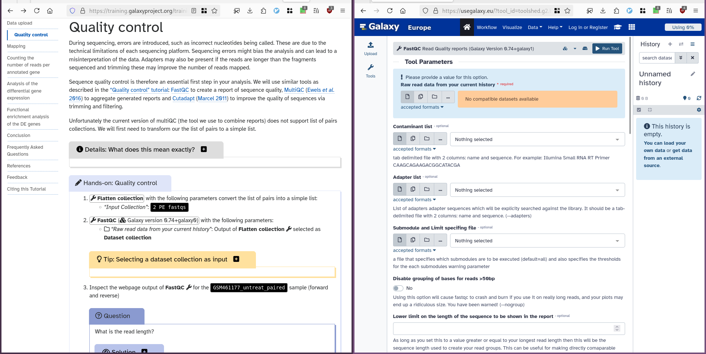

1. TOC
{:toc}

# Overview Questions

## What is this website?

This website is a collection of hands-on tutorials that are designed to be interactive and are built around Galaxy:

This material is developed and maintained by the [worldwide Galaxy community](https://galaxyproject.org/). You can learn more about this effort by reading our [article](https://doi.org/10.1016/j.cels.2018.05.012).

## What is Galaxy?

[Galaxy](https://galaxyproject.org/) is an open data integration and analysis platform for the life sciences, and it is particularly well-suited for data analysis training in life science research.

## What are the tutorials for?

These tutorials can be used for learning and teaching how to use Galaxy for general data analysis, and for learning/teaching specific domains such as assembly and differential gene expression analysis with RNA-Seq data.

## What audiences are the tutorials for?

There are two distinct audiences for these materials.

1. **Self-paced individual learners.** These tutorials provide everything you need to learn a topic, from explanations of concepts to detailed hands-on exercises.
2. **Instructors.** They are also designed to be used by instructors in teaching/training settings. Slides, and detailed tutorials are provided. Most tutorials also include computational support with the needed tools, data as well as Docker images that can be used to scale the lessons up to many participants.

## How is the content licensed?

The content of this website is Creative Commons Attribution 4.0 ([License]({{ site.github_repository }}/tree/master/LICENSE.md)).

## How can I cite this effort?

We wrote an [article](https://www.biorxiv.org/content/early/2018/04/05/225680) about our efforts.

## How can I advertise the training materials on my posters?

We provide some QR codes and logos in the [images folder](https://github.com/galaxyproject/training-material/tree/master/assets/images).

# For Individual Learners

Learning Galaxy and data analysis on your own and at your own pace?  This material is for you.

## Where do I start?

If you are new to Galaxy then start with one of the introductory topics.  These introduce you to concepts that are useful in Galaxy, no matter what domain you are doing analysis in.

If you are already familiar with Galaxy basics and want to learn how to use it in a particular domain (for example, ChIP-Seq), then start with one of those topics.

If you are already well informed about bioinformatics data analysis and you just want to get a feel for how it works in Galaxy, then many tutorials include *Instructions for the impatient* sections.

## How do I use this material?

Many topics include slide decks and if the topic you are interested in has slides then start there.  These will introduce the topic and important concepts.

Most of your learning will happen in the next step - the hands-on tutorials.  This is where you'll become familiar with using the Galaxy interface and experiment with different ways to use Galaxy and the tools in Galaxy.

## Where can I run the hands-on tutorials?

To run the hands-on tutorials you need a Galaxy server to run them on.

Each tutorial is annotated with information about which [public Galaxy servers](https://galaxyproject.org/public-galaxy-servers/) it can be run on. These servers are available to anyone on the world wide web and some may have all the tools that are needed by a specific tutorial.

If your organization/consortia/community has its own Galaxy server, then you may  want to run tutorials on that. You will need to confirm that all necessary tools and reference genomes are available on your server and possible install missing tools and data. To learn how to do that, you can follow our [dedicated tutorial]({{ site.baseurl }}/topics/instructors/tutorials/setup-galaxy-for-training/tutorial.html).

Some topics have a [Docker](https://www.docker.com/) image that can be installed and run on participants' laptops.  These Docker images contain Galaxy instances that include all tools and datasets used in a tutorial, as well as saved analyses and repeatable workflows that are relevant. You will need to [install Docker](https://docs.docker.com/install/).

Finally, you can also run your tutorials on cloud-based infrastructures.  Galaxy is [available on many national research infrastructures](https://galaxyproject.org/galaxy-services/) such as [Jetstream](https://galaxyproject.org/cloud/jetstream/) (United States), [GenAP](https://www.genap.ca/) (Canada), [GVL](https://launch.genome.edu.au/launch) (Australia), [CLIMB](http://www.climb.ac.uk/) (United Kingdom), and more.  These instances are typically easy to launch, and easy to shut down when you are done.

If you are already familiar with, and have an account on [Amazon Web Services](https://aws.amazon.com/) then you can also launch a Galaxy server there using [CloudLaunch](https://launch.usegalaxy.org/).

## How can I get help?

If you have questions about this training material, you can reach us using the [Gitter chat]({{ site.gitter_url }}).  You'll need a [GitHub](https://github.com/) or [Twitter](https://twitter.com/) account to post questions.  If you have questions about Galaxy outside the context of training, see the [Galaxy Support page](https://galaxyproject.org/support/).

# For Instructors

This material can also be used to teach Galaxy and data analysis in a group setting to students and researchers.

## Where do I start?

Spend some time exploring the different tutorials and the different resources that are available. Become familiar with the structure of the tutorials and think about how you might use them in your teaching.

## What Galaxy instance should I use for my training?

To teach the hands-on tutorials you need a Galaxy server to run the examples on.

Each tutorial is annotated with the information on which [public Galaxy servers](https://galaxyproject.org/public-galaxy-servers/) it can be run. These servers are available to anyone on the world wide web and some may have all the tools that are needed by a specific tutorial. If you choose this option then you should work with that server's admins to confirm that think the server can handle the workload for a workshop. For example, the [usegalaxy.eu](https://usegalaxy.eu/)

If your organization/consortia/community has its own Galaxy server, then you may  want to run tutorials on that. This can be ideal because then the instance you are teaching on is the same you your participants will be using after the training. They'll also be able to revisit any analysis they did during the training. If you pursue this option you'll need to work with your organization's Galaxy Admins to confirm that

- the server can support a room full of people all doing the same analysis at the same time.
- all tools and reference datasets needed in the tutorial are locally installed.  To learn how to setup a Galaxy instance for a tutorial, you can follow our [dedicated tutorial]({{ site.baseurl }}/topics/instructors/tutorials/setup-galaxy-for-training/tutorial.html).
- all participants will be able to create/use accounts on the system.

Some training topics have a Docker image that can be installed and run on all participants' laptops.  These images contain Galaxy instances that include all tools and datasets used in a tutorial, as well as saved analyses and repeatable workflows that are relevant.

Finally, you can also run your tutorials on cloud-based infrastructures.  Galaxy is [available on many national research infrastructures](https://galaxyproject.org/galaxy-services/) such as [Jetstream](https://galaxyproject.org/cloud/jetstream/) (United States), [GenAP](https://www.genap.ca/) (Canada), [GVL](https://launch.genome.edu.au/launch) (Australia), [CLIMB](http://www.climb.ac.uk/) (United Kingdom), and more.

## What are the best practices for teaching with Galaxy?

We started to collect some best practices for instructors inside our [Good practices slides]({{ site.baseurl }}/topics/instructors/)

## How do I get help?

The support channel for instructors is the same as for individual learners.  We suggest you start by posting a question to the Galaxy Training Network [Gitter chat]({{ site.gitter_url }}). Anyone can view the discussion, but you'll need to login (using your GitHub or Twitter account) to add to the discussion.

If you have questions about Galaxy in general (that are not training-centric) then there are [several support options](https://galaxyproject.org/support/).

# Contributing

First off, thanks for your interest in contributing to the Galaxy training materials!

Individual learners and instructors can make these training more effective by contributing back to them. You can report mistakes and errors, create more content, etc. Whatever is your background, there is a way to contribute: via the GitHub website, via command-line or even without dealing with GitHub.

We will address your issues and/or assess your change proposal as promptly as we can, and help you become a member of our community. You can also check our [tutorials]({{ site.baseurl }}/topics/contributing) for more details.

## How can I get started with contributing?

If you would like to get involved in the project but are unsure where to start, there are some easy ways to contribute which will also help you familiarize yourself with the project.

### 1. Checking existing tutorials

A great way to help out the project is to test/edit existing tutorials. Pick a tutorial and check the contents. Does everything work as expected? Are there things that could be improved?

Below is a checklist of things to look out for to help you get started. If you feel confident in making changes yourself, please open a pull request, otherwise please file an issue with any problems you run into or suggestions for improvements.

*Basic*
- **Test** the tutorial on a running Galaxy instance
   - For example [Galaxy Main](https://usegalaxy.org), [Galaxy Europe](https://usegalaxy.eu), or [Galaxy Australia](https://usegalaxy.org.au)
   - Report any issues you run into
- **Language** editing
  - Fix spelling and grammar mistakes
  - Simplify the English (to make it more accessible)

*Intermediate*
- **Metadata**
  - Are the objectives, keypoints and time estimate filled in?
  - Do they fit with the contents of the tutorial?
- **Content**
  - Is there enough background information provided in the introduction section and throughout the tutorial?
  - **Question boxes**
    - Add questions or question boxes where you think they might be useful (make people think about results they got, test their understanding, etc)
    - Check that answers are still up-to-date
  - **Screenshots and Videos**
    - Make sure there is also a textual description of the image/video contents
    - Does the screenshot add value to the tutorial or can it be removed?

*Advanced*
- **Workflows**
  - Add a workflow definition file `.ga` if none is present
  - Check that the existing workflow is up-to-date with the tutorial contents
  - Enable [workflow testing](https://github.com/usegalaxy-eu/workflow-testing)
- **Tours**
  - Add a tour if none exists
  - [Run the existing tour](#how-can-i-test-an-interactive-tour) and check that it is up-to-date with the tutorial contents
- **Datasets**
  - Check that all datasets used in the tutorial are present in Zenodo
  - Add a data-library.yaml file if none exists

### 2. Reviewing pull requests

Another great way to help out the project is by reviewing [open pull requests](https://github.com/galaxyproject/training-material/pulls?q=is%3Apr+is%3Aopen+sort%3Aupdated-desc). You can use the above checklist as a guide for your review. Some documentation about how to add your review in the GitHub interface can be found [here](https://help.github.com/articles/about-pull-request-reviews/)

## How can I give feedback?

At the end of each tutorial, there is a link to [a feedback form](https://docs.google.com/forms/d/1BILuBp8bPv42odpZ55Kcf2rqzR-k0Czx46agVVSRgm4/edit). We use this information to improve our tutorials.

For global feedbacks, you can open an [issue on GitHub]({{ site.github_repository }}/issues/new), write us on [Gitter]({{ site.gitter_url }}) or send us an [email](mailto:{{ site.email }}).

## How can I report mistakes or errors?

The easiest way to start contributing is to [file an issue]({{ site.github_repository }}/issues/new) to tell us about a problem such as a typo, spelling mistake, or a factual error. You can then introduce yourself and meet some of our community members.

## How can I test an Interactive Tour?

Perhaps you've been asked to review an interactive tour, or maybe you just want to try one out. The easiest way to run an interactive tour is to use the [Tour builder](https://tailordev.fr/blog/2017/07/19/the-galaxy-tour-builder-extension/) browser extension.

1. Install the Tour Builder extension to your browser ([Chrome Web Store](https://chrome.google.com/webstore/detail/galaxy-tour-builder/mdfbapknmcpnbmggahhaegehbbbmhmgg), [Firefox add-on](https://addons.mozilla.org/en-US/firefox/addon/galaxy-tour-builder/), [Opera add-on](https://addons.opera.com/en/extensions/details/galaxy-tour-builder/)).
2. Navigate to a Galaxy instance supporting the tutorial. To find which Galaxy instances support each tutorial, please see the dropdown menu next to the tutorial on the training website. Using one of the usegalaxy.\* instances ([Galaxy Main](https://usegalaxy.org), [Galaxy Europe](https://usegalaxy.eu), or [Galaxy Australia](https://usegalaxy.org.au)
) is usually a good bet.
3. Start the Tour Builder plugin by clicking on the icon in your browser menu bar
4. Copy the contents of the `tour.yaml` file into the Tour builder editor window
5. Click `Save` and then `Run`

## How can I fix mistakes or expand an existing tutorial using the GitHub interface?

Check our tutorial to learn how to use the GitHub interface (soon...)

## How can I create new content without dealing with git?

If you feel uncomfortable with using the git and the [GitHub flow](https://guides.github.com/introduction/flow/), you can write a new tutorial with any text editor and then contact us (via [Gitter]({{ site.gitter_url }}) or [email](mailto:{{ site.email }})). We will work together to integrate the new content.

## How can I contribute in "advanced" mode?

Most of the content is written in [GitHub Flavored Markdown](https://guides.github.com/features/mastering-markdown/) with some metadata (or variables) found in [YAML](http://yaml.org/) files. Everything is stored on our [GitHub repository]({{ site.github_repository }}). Each training material is related to a topic. All training materials (slides, tutorials, etc) related to a topic are found in a dedicated directory (*e.g.* `transcriptomics` directory contains the material related to transcriptomic analysis). Each topic has the following <a name="structure">structure</a>:

{: width="400px"}

- a metadata file in YAML format
- a directory with the topic introduction slide deck in Markdown with introductions to the topic
- a directory with the tutorials:

    Inside the tutorials directory, each tutorial related to the topic has its own subdirectory with several files:
    - a tutorial file written in Markdown with hands-on
    - an optional slides file in Markdown with slides to support the tutorial
    - a directory with Galaxy Interactive Tours to reproduce the tutorial
    - a directory with workflows extracted from the tutoria
    - a YAML file with the links to the input data needed for the tutorial
    - a YAML file with the description of needed tools to run the tutorial

- a directory with the Dockerfile describing the details to build a container for the topic (self-study environments).

To manage changes, we use [GitHub flow](https://guides.github.com/introduction/flow/) based on Pull Requests (check our [tutorial]({{ site.baseurl }}/topics/contributing/tutorials/create-new-tutorial-content/tutorial.html)):

1. [Create a fork](https://help.github.com/articles/fork-a-repo/) of this repository on GitHub
2. Clone your fork of this repository to create a local copy on your computer and initialize the required submodules (`git submodule init` and `git submodule update`)
3. Create a new branch in your local copy for each significant change
4. Commit the changes in that branch
5. Push that branch to your fork on GitHub
6. Submit a pull request from that branch to the [master repository]({{ site.github_repository }})
7. If you receive feedback, make changes in your local clone and push them to your branch on GitHub: the pull request will update automatically
8. Pull requests will be merged by the training team members after at least one other person has reviewed the Pull request and approved it.

Globally, the process of development of new content is open and transparent:

1. Creation of a branch derived from the master branch of the GitHub repository
2. Initialization of a new directory for the tutorial
3. Filling of the metadata with title, questions, learning objectives, etc
4. Generation of the input dataset for the tutorial
5. Filling of the tutorial content
6. Extraction of the workflows of the tutorial
7. Automatic extraction of the required tools to populate the tool file
8. Automatic annotation of the public Galaxy servers
9. Generation of an interactive tour for the tutorial with the [Tourbuilder](https://tailordev.fr/blog/2017/07/19/the-galaxy-tour-builder-extension/) web-browser extension
10. Upload of the datasets to Zenodo and addition of the links in the data library file.
11. Once ready, opening a Pull Request
12. Automatic checks of the changes are automatically checked for the right format and working links using continuous integration testing on Travis CI
13. Review of the content by several other instructors via discussions
14. After the review process, merge of the content into the main branch, starting a series of automatic steps triggered by Travis CI
15. Regeneration of the website and publication on [{{site.url}}{{site.baseurl}}]({{site.url}}{{site.baseurl}})
16. Generation of PDF artifacts of the tutorials and slides and upload on the FTP server
18. Population of [TeSS](https://tess.elixir-europe.org/), the ELIXIR’s Training Portal, via the metadata

To learn how to add new content, check out our [series of tutorials on creating new content]({{ site.baseurl }}/topics/contributing/):


<ol>


 
  
<li><a href="{{ site.baseurl }}/topics/{{ topic.name }}/slides/{{ material.tutorial_name }}.html">{{ material.title }}</a></li>
 
  
<li><a href="{{ site.baseurl }}/topics/{{ topic.name  }}/tutorials/{{ material.tutorial_name }}/tutorial.html">{{ material.title }}</a></li>
  
<li><a href="{{ site.baseurl }}/topics/{{ topic.name }}/tutorials/{{ material.tutorial_name }}/slides.html">{{ material.title }}</a></li>
   
  
 

 </ol>

We also strongly recommend you read and follow [Software Carpentry's](https://software-carpentry.org/) recommendations on [lesson design](https://carpentries.github.io/lesson-example/01-design/) and [lesson writing](https://carpentries.github.io/instructor-training/14-lesson-study/) if you plan to add or change some training materials, and also to check the [structure of the training material](#structure).

## What can I do to help the project?

In [issues](https://github.com/galaxyproject/training-material/issues), you will find lists of issues to fix and features to implement (with the ["newcomer-friendly"]({{ site.github_repository }}/issues?q=is%3Aissue+is%3Aopen+sort%3Aupdated-desc+label%3Anewcomer-friendly) label for example). Feel free to work on them!

# Other Questions

## Are there any upcoming events focused on Galaxy Training?

Yes, always! Have a look at the [Galaxy Community Events Calendar](https://galaxyproject.org/events/) for what coming up right now.

## Sustainability of the training-material and metadata

This repository is hosted on [GitHub](https://github.com/) using git as a [DVCS](https://en.wikipedia.org/wiki/Distributed_version_control). Therefore the community is hosting backups of this
repository in a decentralised way. The repository is self-contained and contains all needed content and all metadata.
In addition we mirror snapshops of this repo on [Zenodo](http://zenodo.org). 
