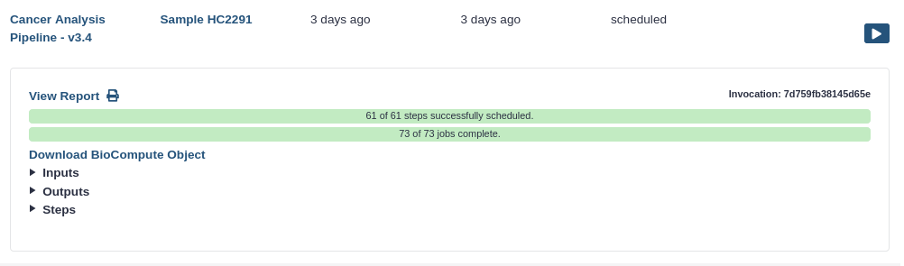

- Click on the **User** on the top menu bar of Galaxy.
- Click on **Workflow invocations**
  - Here you will find a list of all the workflows you have run
- Click on the name of a workflow invocation to expand it
  
- Click on **View Report** to go to the workflow report page
- **Note:** The report can also be downloaded in PDF format by clicking on the  icon.

