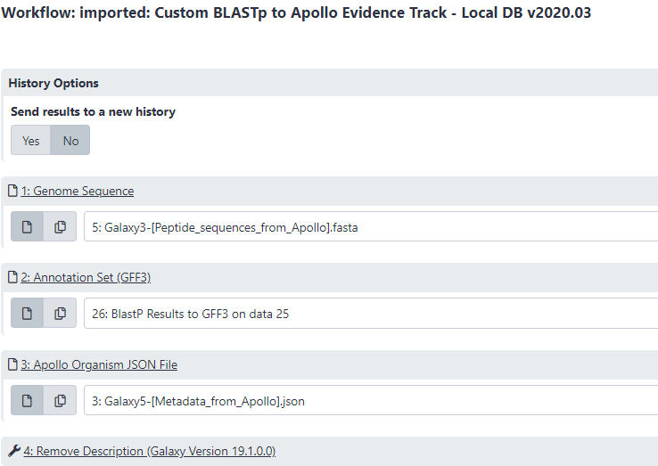
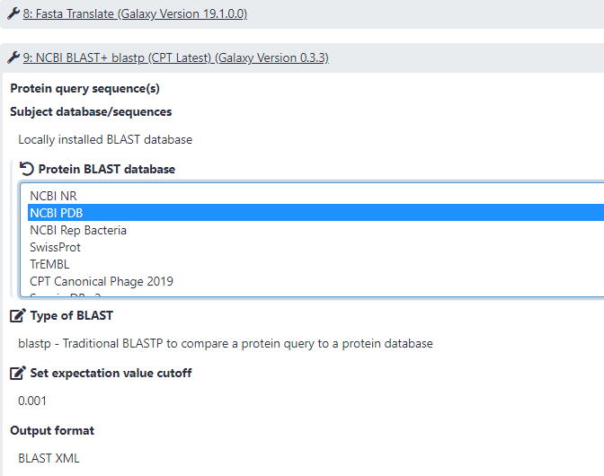
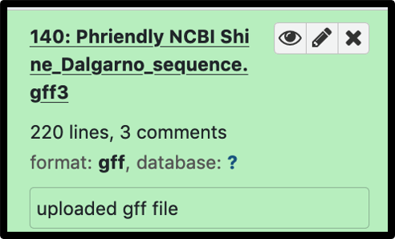
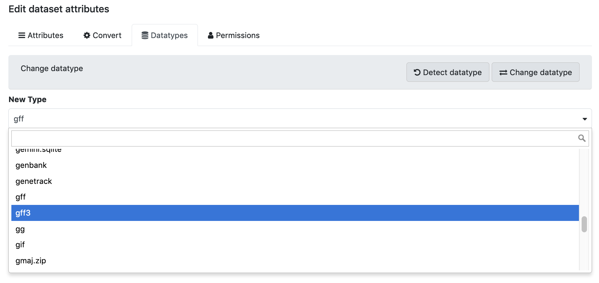
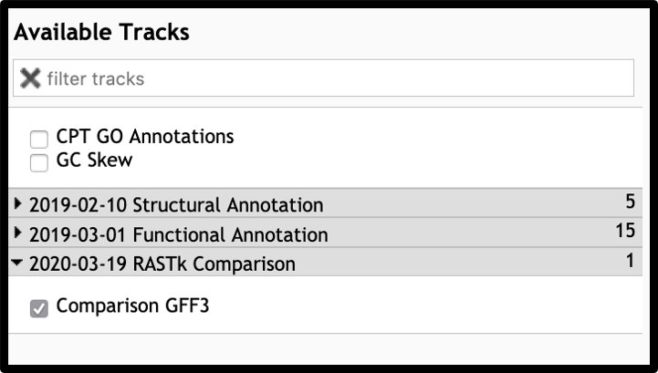
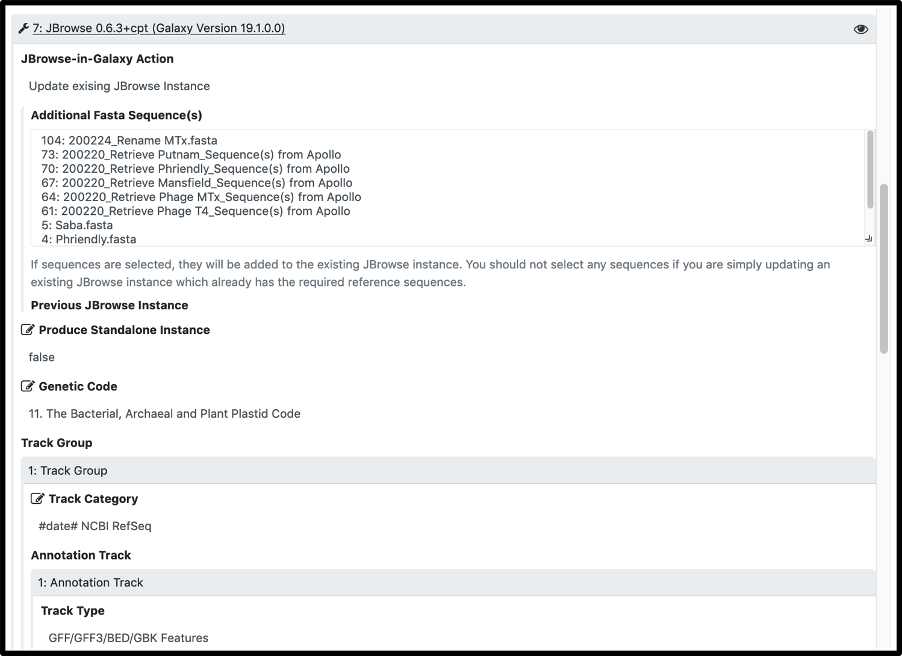
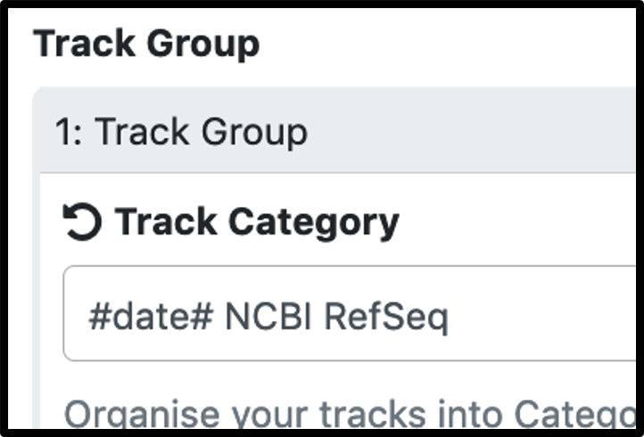
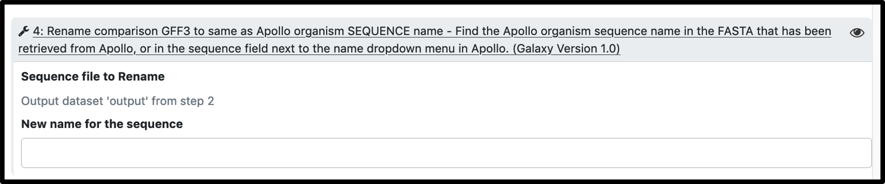

Sometimes annotation in Apollo can be enhanced with evidence that is not generated in the structural and functional workflows. This tutorial will introduce how to add custom evidence tracks to an Apollo organism from Galaxy data. 

> ### Agenda
>>
> 1. Introduction
> 2. Custom Workflows
> 3. Troubleshooting
> {:toc}
>
{: .agenda}

# Introduction
The analyses that the basic [Structural](https://cpt.tamu.edu/training-material/topics/phage-annotation-pipeline/tutorials/structural-annotation-workflow/tutorial.html) and [Functional](https://cpt.tamu.edu/training-material//topics/phage-annotation-pipeline/tutorials/functional-annotation-workflow/tutorial.html) workflows provide are a good start for phage genome annotation. When additional, updated, or custom analyses are performed, those data can also be added to Apollo as evidence tracks, if they are in the appropriate format. This includes custom BLAST analyses, comparison annotation data, or any properly formatted GFF3 data with coordinates that match the genome for the organism in question.
**Note that all the workflows below requires the Apollo JSON organism object to be in your history in order to properly transfer the results of these analyses to the organism in Apollo**. Once in the appropriate history, lauch the [Retrieve Data tool](https://cpt.tamu.edu/galaxy/root?tool_id=export), select the name of your phage under the Organism drop-down menu, click “Execute.” Note that by default the tool retrieves the “GFF annotations + whole genome”, which gives you two files, “Annotation and Sequence from Apollo” and “Metadata from Apollo”. The “Metadata from Apollo” is the JSON file.  *The “Annotation and Sequence from Apollo” is a .gff3 file that combines the GFF3 annotation and the genome FASTA sequence. You will need to run this [Split tool](https://cpt.tamu.edu/galaxy/root?tool_id=edu.tamu.cpt2.gff3.splitGff) to separate the “Annotation and Sequence from Apollo” file into a separate GFF3 file (containing only the GFF3 annotation) and a FASTA file (containing only the genome sequence)*.

# Custom Workflows
The following are useful workflows in the [published workflows](https://cpt.tamu.edu/galaxy-pub/workflows/list_published) list on Galaxy that add custom evidence tracks to Apollo.  Search for the appropriate one to run for your experimental needs.

### Published workflow: **GFF3 to Apollo Evidence Track**
> * Adds gff3 evidence track to Apollo organisms. Includes regulatory features like terminators, CDSs, and repeat regions.
> * _Note:_ This is usually used on data coming from Genbank and allows comparison to features called by others.
> * _Note:_ Many special annotation features are currently not supported by the Apollo and thus may not be displayed correctly. The team are working on improvement to this issue.

### Published workflow: **Custom BLASTp to Apollo Evidence Track** with LocalDB
> * Runs BlASTp against a locally installed database and creates a new Apollo evidence track.

After importing and launching the the newest **Custom BLASTp to Apollo Evidence Track - LocalDB**, select the genome sequence file and the annotation file you want to conduct analysis with, and the Apollo Json organism you want the new evidence track to be added to.  Select the local database by click on the "Protein BLAST database" pendil icon at the NCBI BLAST+blastp step (Step 9). Run the workflow.  After the workflow is finished, click on "Annotaion on data XX" to view the new track in Apollo. 

### Published workflow: **Custom BLASTp to Apollo Evidence Track** using user-created DB
> * Runs BlASTp against a user-created database and creates a new Apollo evidence track.
Run [makeblastdb tool](https://cpt.tamu.edu/galaxy/root?tool_id=ncbi_makeblastdb_latest), selecte the protein FASTA file as your "Input FASTA file" to create the database you want to run BLAST against. Import and lauch the newest **Custom BLASTp to Apollo Evidence Track - UserDB** workflow, select the genome sequence file and the annotation file you want to conduct analysis with, the user-created DB, and the Apollo Json organism you want the new evidence track to be added to. Run the workflow.  After the workflow is finished, click on "Annotaion on data XX" to view the new track in Apollo. 

### Published workflow: **BLAST antiCRISPRdb to Apollo Evidence track**
> * Runs BLASTp with specified input query proteins against the current anti-CRISPR database (import from Shared Data) and adds an evidence track to Apollo.

# Troubleshooting
When adding custom evidence tracks is not working for you, consider the following reasons for remediating the problem.

1. If your custom data is not properly formatted, the category may be added to Apollo, but with empty evidence tracks. In that case, the data formatting needs to be carefully inspected to ensure it fits the spec required for that file type. Users are encouraged to compare their data files to datasets in Galaxy that are known to be successfully added to Apollo. Additionally, check to make sure that any conversions performed in Galaxy did not yield empty datasets.

2. When your uploaded gff3 is not listed as an input option, it is usually because the auto-detect classified it a a gff file, and it must be manually changed as illustrated below.

3.To ensure the evidence track categories have the desired name, change the preset "Category label" (gray header name) in  the workflow by changing it to set at runtime in the JBrowse settings.

The most common reason for workflow failure in these cases is name mismatch between the comparison gff3 and the Apollo organism. Workflow prompts for a name change, but the parameters have to be manually expanded.

