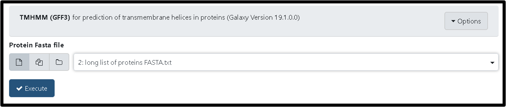

> ### Agenda
>
> 1. Tools for Finding Spanins
> 2. Tools for Finding Holins
> 3. Tools for Finding Endolysins
> 4. Tools for Checking the Proximity of Potential Lysis Genes
> {:toc}
>
{: .agenda}

This tutorial expands on what has been discussed in the [Finding and Annotating Lysis Genes Tutorial](https://cpt.tamu.edu/training-material/topics/additional-analyses/tutorials/finding-lysis-genes/tutorial.html). When lysis genes were not identified by inspection of Functional Workflow outputs, try some of the tools described below.

> ###  Reminder!
> Bioinformatic tools cannot always be used to identify novel lysis genes. A conservative approach is preferred to calling something a lysis gene when it isn't, but researchers should still do their due diligence before concluding that their phage's lysis genes are not identifiable with the tools/databases in their current state.
{: .tip}

# Tools for Finding Spanins
*Brief para on spanin features, and what functional workflow looks for.*

There are three tools one can use to help find spanins. The [ISP Candidates tool](https://cpt.tamu.edu/galaxy-pub/root?tool_id=edu.tamu.cpt2.spanin.generate-putative-isp) constructs a putative list of potential i-spanin proteins. To run the tool, input your phage's genomic FASTA and click "Execute". The default parameters for the tool should not have to be changed. Below is an example run with Lambda. 

After this tool successfully runs it generates FASTA, gff3, and txt files consisting of potential i-spanins of your phage.

A second useful spanin tool is the [OSP candidates tool](https://cpt.tamu.edu/galaxy-pub/root?tool_id=edu.tamu.cpt2.spanin.generate-putative-osp). Similar to the ISP Candidate tool, this tool constructs a putative list of potential o-spanin from an input genomic FASTA file. To run this tool, select the genomic FASTA file as input again and click "Execute." The default parameters for this tool should also not have to be changed.

Successful completeion of the OSP candidates tool will generate FASTA, gff3, and txt files consisting of potential o-spanins of your phage.

Finally, the [Find Spanin tool](https://cpt.tamu.edu/galaxy-pub/root?tool_id=edu.tamu.cpt2.spanin.findSpanin) can be run to narrow down the putative spanins lists to hopefully obtain more accurate candidate i-spanin and o-spanin pairs. To run this tool, use the FASTA output files from the ISP candidates and OSP candidates tools, select the preferred distance between each spanin gene, choose the strand, and click "Execute".

Upon successful completion, the tool will output a file for each potential type of candidates (eg. overlap_results.txt) and  a basic summary statistics file (findSpanin_summary.txt).

> ###  Note:
> Alternatively, you can import the workflow to run all three tools together. To do this, go to this [page](https://cpt.tamu.edu/galaxy/workflows/list_published) for a list of all the public and shared workflows developed at the CPT and search for the newest "Find Spanin" workflows.
{: .tip}

*Describe how gff3 can be piped to Apollo.*

> ###  Note:
> Some additional tools that may prove helpful include the following
> * [LipoP tool](https://cpt.tamu.edu/galaxy-pub/root?tool_id=geiger.tamu.edu/toolshed/repos/esr/cpt_external_programs/LipoP/1.0.0)
>    > * prediction of lipoproteins and for discriminating between lipoprotein signalpetides, other signal peptides and n-terminal membrane helices in Gram negative bacteria
> * [LipoP to GFF3 Tool](https://cpt.tamu.edu/galaxy-pub/root?tool_id=edu.tamu.cpt.gff3.lipoP_to_gff3)
>    > * adds LipoP results to GFF3
> * [Identify Lipoboxes Tool](https://cpt.tamu.edu/galaxy-pub/root?tool_id=edu.tamu.cpt.fasta.lipory)
>    > * identifies possible LipoBoxes from an input GFF3 and FASTA
{: .tip}

# Tools for Finding Holins
*Brief description of holin types.*

The TMHMM tool is a functional prediction tool used to find transmembrane helices in proteins. Since holins are known to have at least two or more TMDs, this tool is helpful in accessing if a protein could be a possible holin. In Galaxy, their are two different TMHMM tools. One TMHMM tool found [here](https://cpt.tamu.edu/galaxy-pub/root?tool_id=geiger.tamu.edu/toolshed/repos/esr/cpt_external_programs/TMHMM/1.0.2) provides a graphical output. To run this tool, select the input FASTA file and change the parameters as shown below.

The HTML output will result in a graphical output depicted below

The other TMHMM tool found [here](https://cpt.tamu.edu/galaxy-pub/root?tool_id=TMHMM_to_gff3) outputs GFF3 formated results which can then be exported to Apollo. 

Another useful tool to find holins is the [Search File Tool](https://cpt.tamu.edu/galaxy-pub/root?tool_id=edu.tamu.cpt.proximity.searchFile). This tool can be used to search through blast or InterPro scan results. Just click "Insert Input File", choose the correct file format from the drop down menu, select the desired input file to search, and check the holin/antiholin boxes before executing the search.

# Tools for Finding Endolysins
*Brief description of endolysins?*

The [Search File Tool](https://cpt.tamu.edu/galaxy-pub/root?tool_id=edu.tamu.cpt.proximity.searchFile) can also be used here to search for endolysins in blast or InterPro scan results. Run the tool as described in **Tools for Finding Holins** section, but this time make sure to select "endolysin" boxes before executing the search. 

# Tools for Checking the Proximity of Potential Lysis Genes
*Discuss cassettes, which doesn't apply to some larger phages.* 

*Leave space to describe prox to lysis concept.* 

> ###  Note:
> Tools for this section are currently being developed and will be coming soon!
{: .tip}
