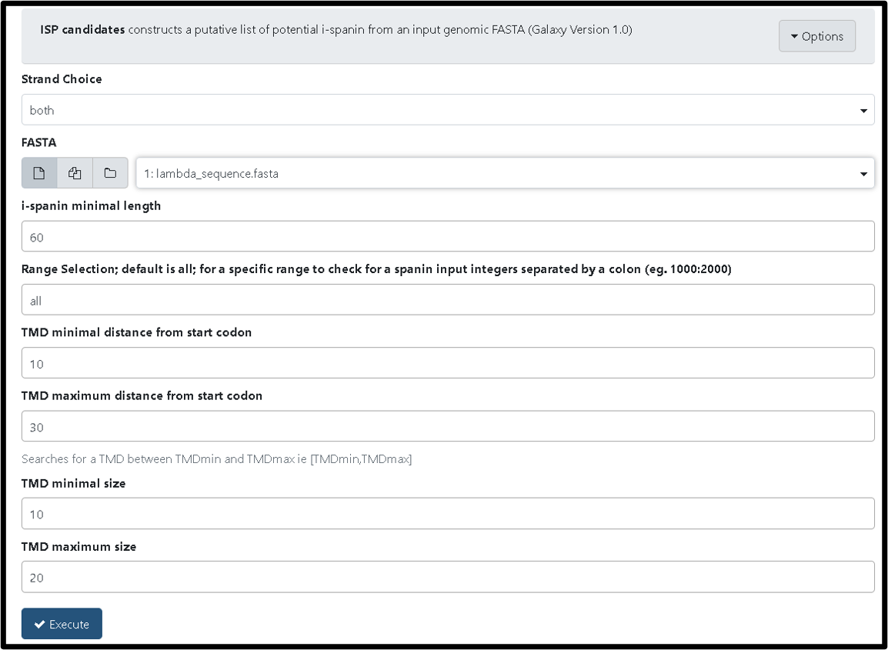
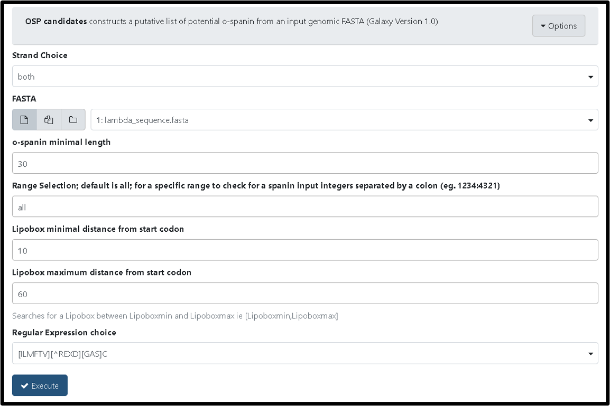
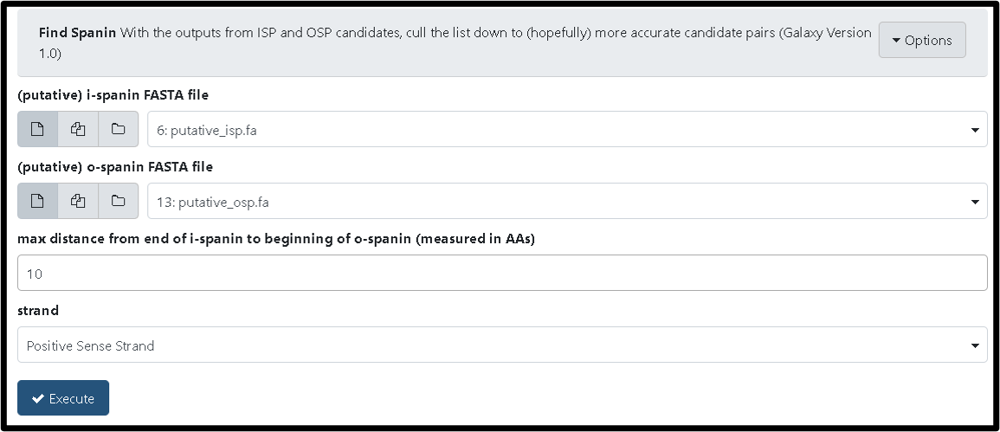
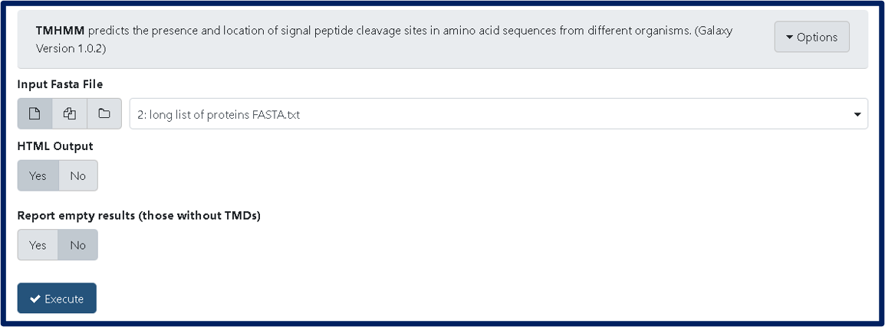
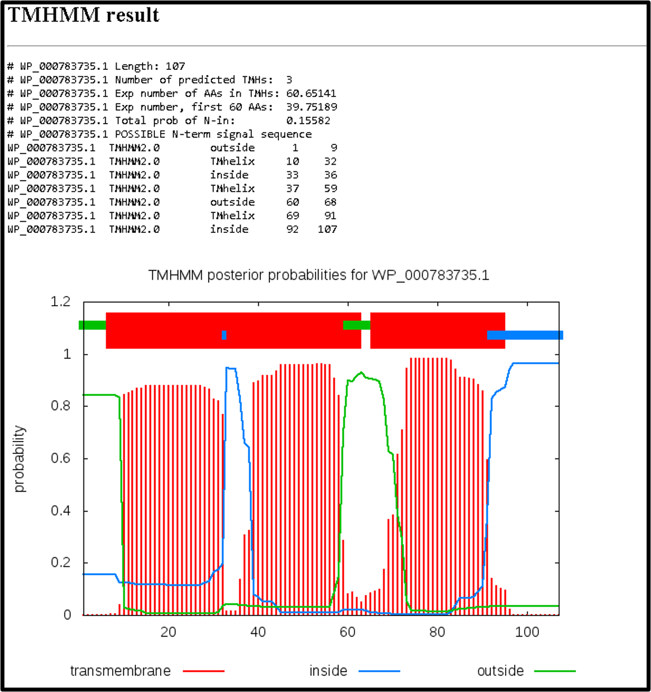

> ### Agenda
>
> 1. Tools for Finding Spanins
> 2. Tools for Finding Holins
> 3. Tools for Finding Endolysins
> 4. Tools for Checking the Proximity of Potential Lysis Genes
> {:toc}
>
{: .agenda}

This tutorial expands on what has been discussed in the [Finding and Annotating Lysis Genes Tutorial](https://cpt.tamu.edu/training-material/topics/additional-analyses/tutorials/finding-lysis-genes/tutorial.html). When lysis genes were not identified by inspection of Functional Workflow outputs, try some of the tools described below.

> ###  Reminder!
> Bioinformatic tools cannot always be used to identify novel lysis genes. A conservative approach is preferred to calling something a lysis gene when it isn't, but researchers should still do their due diligence before concluding that their phage's lysis genes are not identifiable with the tools/databases in their current state.
{: .tip}

# Tools for Finding Spanins
The only systematic study that looked for spanin genes in phages, found them in ~87% of genomes (see (Kongari et al 2018)[https://www.ncbi.nlm.nih.gov/pubmed/30219026]). Therefore it is expected that many phages will have the detectable signatures of spanin genes: a TMD and a lipobox in one or two close or even overlapped genes. For an overview, see the Finding and Annotating Lysis Genes Tutorial](https://cpt.tamu.edu/training-material/topics/additional-analyses/tutorials/finding-lysis-genes/tutorial.html). The Functional Workflow includes TMD searches through TMHMM and Phobius (part of InterProScan), and lipobox finding using both LipoP and a custom, less stringent search. Pairs of naively-called ORFs are displayed as candidates spanins. Finally, BLAST analyses against the curated, local spanin database are a key output. 

There are three additional tools built to help find spanins. The [ISP Candidates tool](https://cpt.tamu.edu/galaxy-pub/root?tool_id=edu.tamu.cpt2.spanin.generate-putative-isp) (TAMU user [link](https://cpt.tamu.edu/galaxy/root?tool_id=edu.tamu.cpt2.spanin.generate-putative-isp)) constructs a putative list of potential i-spanin proteins from all naive ORFs. To run the tool, input your phage's genomic FASTA and click "Execute". Below is an example run with Lambda. 

After this tool successfully runs it generates FASTA, gff3, and txt files consisting of potential i-spanins in your phage.

A second useful spanin tool is the [OSP candidates tool](https://cpt.tamu.edu/galaxy-pub/root?tool_id=edu.tamu.cpt2.spanin.generate-putative-osp) (TAMU user [link](https://cpt.tamu.edu/galaxy/root?tool_id=edu.tamu.cpt2.spanin.generate-putative-osp)). Similar to the ISP Candidate tool, this tool constructs a putative list of potential o-spanin after naive ORF-finding from an input genomic FASTA file. To run this tool, select the genomic FASTA file as input and click "Execute."

Successful completeion of the OSP candidates tool will generate FASTA, gff3, and txt files consisting of the potential o-spanins of your phage.

Finally, the [Find Spanin tool](https://cpt.tamu.edu/galaxy-pub/root?tool_id=edu.tamu.cpt2.spanin.findSpanin) (TAMU ser [link](https://cpt.tamu.edu/galaxy/root?tool_id=edu.tamu.cpt2.spanin.findSpanin)) can be run to narrow down the putative spanins lists to candidate i-spanin and o-spanin pairs. To run this tool, use the FASTA output files from the ISP candidates and OSP candidates tools, select the preferred distance between each spanin gene, designate the strand, and click "Execute". Find Spanin should be run twice, once for each strand. 

Upon successful completion, the Find Spanin tool will output a file for each potential candidate type (eg. overlap_results.txt) and  a basic summary statistics file (findSpanin_summary.txt). Inspect the pairs individually to verify the output. 

> ###  Note:
> Alternatively, you can import the workflow to run all three tools together. To do this, go to the [published workflows](https://cpt.tamu.edu/galaxy/workflows/list_published) list and search for the newest "Find Spanin" workflows.
{: .tip}

The gff3 output can be funneled as an evidence track into an Apollo organism using a [published workflow](https://cpt.tamu.edu/galaxy/workflows/list_published). Search for the latest version of GFF3 to Apollo evidence track. 

> ###  Note:
> The following tools can also be run independently when searching for motifs contained by spanins:
> * [LipoP tool](https://cpt.tamu.edu/galaxy-pub/root?tool_id=geiger.tamu.edu/toolshed/repos/esr/cpt_external_programs/LipoP/1.0.0) (TAMU user [link](https://cpt.tamu.edu/galaxy/root?tool_id=geiger.tamu.edu/toolshed/repos/esr/cpt_external_programs/LipoP/1.0.0))
>    > * prediction of lipoproteins and for discriminating between lipoprotein signal petides, other signal peptides and N-terminal membrane helices in Gram negative bacteria
> * [LipoP to GFF3 Tool](https://cpt.tamu.edu/galaxy-pub/root?tool_id=edu.tamu.cpt.gff3.lipoP_to_gff3) (TAMU user [link](https://cpt.tamu.edu/galaxy/root?tool_id=edu.tamu.cpt.gff3.lipoP_to_gff3))
>    > * converts LipoP results to GFF3 format, which can be loaded into Apollo
> * [Identify Lipoboxes Tool](https://cpt.tamu.edu/galaxy-pub/root?tool_id=edu.tamu.cpt.fasta.lipory) (TAMU user [link](https://cpt.tamu.edu/galaxy/root?tool_id=edu.tamu.cpt.fasta.lipory))
>    > * identifies possible Lipoboxes from an input GFF3 and FASTA
{: .tip}

# Tools for Finding Holins
Holins are membrane proteins. Experimentally verified holins contain 1-3 TMDs of varying topologies, though more are possible. Unless there is BLAST similarity to a *verified* holin or there are only 1-2 TMD-containing protein-encoding genes in the phage genome, it is not possible to be certain of a bioinformatic holin prediction, though often any predicted TMD-containing  protein near an endolysin and/or spanin gene is called a possible holin. In Galaxy, there are two tools that predict TMDs. Both are run as part of the functional workflow.

The [TMHMM tool](https://cpt.tamu.edu/galaxy-pub/root?tool_id=geiger.tamu.edu/toolshed/repos/esr/cpt_external_programs/TMHMM/1.0.2) (TAMU user [link](https://cpt.tamu.edu/galaxy/root?tool_id=geiger.tamu.edu/toolshed/repos/esr/cpt_external_programs/TMHMM/1.0.2)) can also be run independently with a graphical output. To run this tool, select the input protein FASTA file and adjust the parameters as shown below.

The HTML output will result in a graphical output as depicted below

Another useful tool for finding holins is the [Search File Tool](https://cpt.tamu.edu/galaxy-pub/root?tool_id=edu.tamu.cpt.proximity.searchFile) (TAMU user [link](https://cpt.tamu.edu/galaxy/root?tool_id=edu.tamu.cpt.proximity.searchFile)). This tool will query various files type for specific terms. By selecting the holin/antiholin terms in the list, all known synonyms and conserved domains associated with holins will be retrieved from the input files with their context. This is useful when domains or BLAST hits were missed by the user looking through evidence tracks in Apollo, and can be used to search through BLAST, InterPro scan, or other results. Just click "Insert Input File", choose the correct file format from the drop down menu, select the desired dataset to search, and check the holin/antiholin boxes before executing the search.

# Tools for Finding Endolysins
As enzymes, these phage-encoded cell wall hydrolases are the most conserved and easily identifiable of the lysis genes. However, not all endolysin classes have been experimentally defined. When new classes are defined, their annotations will take time to propagate through the databases used for bioinformatic searches.

The [Search File Tool](https://cpt.tamu.edu/galaxy-pub/root?tool_id=edu.tamu.cpt.proximity.searchFile) (TAMU user [link](https://cpt.tamu.edu/galaxy/root?tool_id=edu.tamu.cpt.proximity.searchFile)) can also be used here to search for endolysins in blast or InterPro scan results. Run the tool as described in **Tools for Finding Holins** section, but instead select "endolysin" boxes before executing the search. 

# Tools for Checking the Proximity of Potential Lysis Genes
Especially in smaller phages, such as the T7-like phages, genes often appear grouped according to function. This is also true of the lysis genes. Larger phages, such as the T4-like phages, however, do not contain co-localized lysis genes, making them more difficult to locate if they are novel. When attempting to predict novel lysis genes, it can be helpful to know if candidates are genetic neighbors. A set of tools to aid in that task are under development. Check back later for more details. 

> ###  Note:
> Tools for this section are currently being developed and will be coming soon!
{: .tip}
