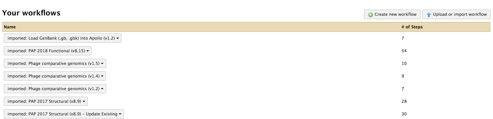
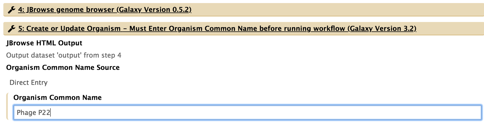
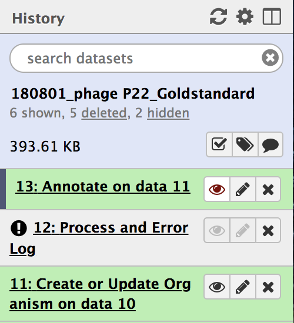

# Introduction
{:.no_toc}

When you want to update annotations for a phage genome that has previously been sequenced, annotated, and deposited in GenBank, you can use Apollo. Here, the genome of phage P22 will be used as an example.

> ### Agenda
>
> In this tutorial, we will acquire an annotated genome and prepare it for further annotation editing in Apollo. The three steps in this process are:
>
> 1. From GenBank to Local Device
> 
> 2. From Local Device to Galaxy
>
> 3. Preparing for Annotation in Apollo
>
{: .agenda}

# From GenBank to Local Device

The NIH genetic sequence database, GenBank, is an open access collection of annotated, publicly available nucleotide sequences and protein translations. It is also one of of the largest repositories for phage genomes.

1. Access [the NCBI website.](https://www.ncbi.nlm.nih.gov/)

2. Using specific key words, search for your desired genome in the search box at the top of the page.

3. Look through the results for hits that appear to align with your search. Most likely, there are multiple hits for the same organism. It is important that the file contains the whole genome, and is the most recently updated version of that genome.

> ###  Comment: RefSeq
> When possible, use the Reference Sequence (RefSeq) file. RefSeq files are comprehensive, well-annotated sequences that have been selected by NCBI for standardization. They provide a stable reference for genome annotation and many other analyses. 
{: .comment}

> ###  Tip: Searching
> * Adjust the drop-down menu to the left of the search bar to ‘Nucleotide.’ This will narrow your results to genome, gene, and transcript sequence data from databases including GenBank.
> * If your search yields many seemingly unrelated results, consider using the ‘Advanced Search’ option to further refine results.
{: .tip}

> ###  Hands-on: Genome download
> * When you’ve found the optimal genome file, click on the ‘Send to:’ drop down menu towards the top right of the page.
> * Once the download parameters have been set, click ‘Create file,’ and the genome file will be downloaded to your computer.
>  
>
>    > ###  Tip
>    >
>    > *In theory,* this file can be directly imported into Galaxy through the [NCBI EFetch tool](https://cpt.tamu.edu/galaxy-pub/root?tool_id=ncbi_eutils_efetch) (TAMU user [tool link](https://cpt.tamu.edu/galaxy/root?tool_id=ncbi_eutils_efetch)).
>    >
>    {: .tip}
{: .hands_on}

# From Local Device to Galaxy

Now that the genome has been downloaded in the proper format, it is ready to be transferred to Apollo.

1. Open [Galaxy](https://cpt.tamu.edu/galaxy-pub) and log in.

2. On the right side of the web page is the History column. Ensure that you are in the desired history, or create a new one.

3. Once you have an empty, new history ready, click on the ‘load your own data’ option in the blue box in the empty history. An empty, white box should appear on your screen. 

> ###  Hands-on: Genome loading into Galaxy
> 4. You can drag the downloaded genome file into the box, or search files on your local device by clicking ‘Choose local file’ and locating the downloaded genome on your local device.
> 5. Click ‘Start’ to begin loading the GenBank genome file into Galaxy. Upon completion of this loading, there should be a green box now in your History column that says, “1: sequence.gb.”
>    > * If you click on the eye symbol of this step, it will open up the contents of that step. Because it is the full GenBank file, it should resemble what was on the NCBI webpage for that genome when you downloaded it.
{: .hands_on}

> ###  Tip: File name
>
> Rename the file prior to uploading for ease. Use the NCBI number for reference.
>
{: .tip}

# Preparing Genome for Annotation in Apollo

You have successfully uploaded a genome into Galaxy. The next step is creating an organism for annotation editing in Apollo. To do this, you will need to import and run a workflow called “Load GenBank (.gb, .gbk) into Apollo.”

1. At the top of the Galaxy page, click on the “Shared Data” drop-down menu. Select “workflows,” and you will be brought to a new page containing workflows that execute different functions within Galaxy.

2. Find “Load GenBank (.gb, .gbk) into Apollo (v#)” where ‘#’ is the number indicating the most recent version of this workflow. Click on the drop-down menu on that workflow, and select “Import.”

3. A message in a green box will appear on the next page, confirming that the workflow was imported. Click on the “… start using this workflow …” link to be taken to a page containing the list of imported workflows.

4. Find the “Load GenBank (.gb, .gbk) into Apollo (v#)” workflow in that list; it should be the first, as it was the most recent. Click on the drop down menu for that workflow, and select “Run.”

5. Review the adjusted workflow parameters to ensure everything is correct before moving on.
> * For “1: Input GenBank File,” check that the GenBank sequence (“1: sequence.gb) is selected. If not, click the drop-down menu and select it.
> * For “5: Create or Update Organism,” type in the organism’s common name.
 

6. Click “Run workflow” at either the top or bottom of the page. You will then see another message in a green box indicating the successful invocation of the workflow. 

7. All workflow steps will appear in the history panel. Wait until all the steps turn green. Note that step “Annotate on data (#),” may complete before the penultimate step, “Process and Error Log,”is loading the gene products into Apollo, and that will take time. 

8. Once the penultimate step, “Process and Error Log,” has completed it’s function and has turned green, clicking on the eye symbol  on the final step (highlighted above in red) will direct you to the genome formatted for Apollo. From there, you are ready to annotate!

# Conclusion
{:.no_toc}

Now you have successfully imported an annotated genome for editing into the Apollo interface.

For guidance on tools and analysis that can be performed on this genome you’ve loaded into Apollo in the Galaxy interface, read [this tutorial.](https://cpt.tamu.edu/training-material/topics/phage-annotation-pipeline/tutorials/annotation-in-apollo/tutorial.html) 

