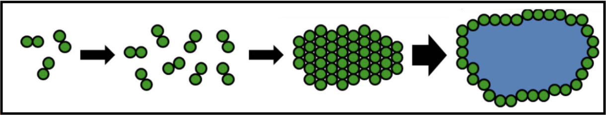
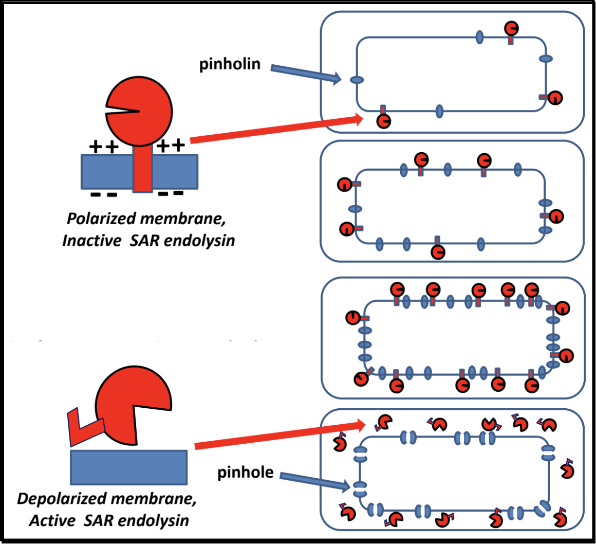
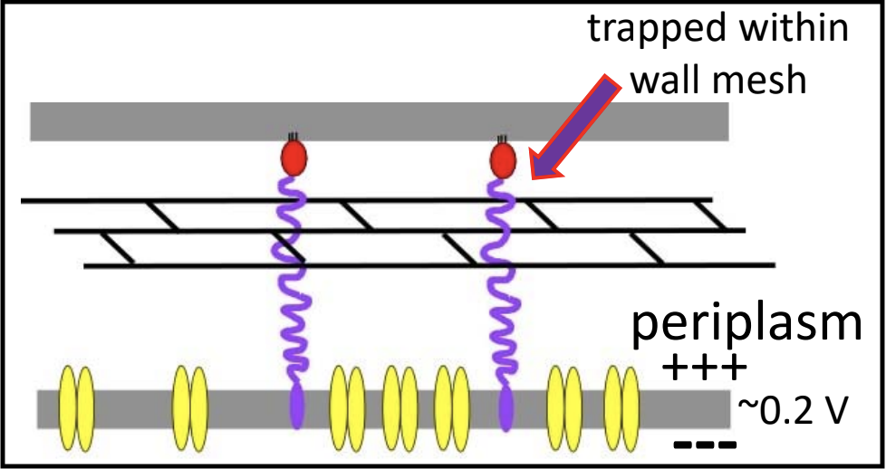

> ### Agenda
>
> 1. A Background on Lysis Genes
> 2. Finding the Endolysin
> 3. Finding Holins and Antiholins
> 4. Spanin Genes
> 5. Missing Lysis Genes
> {:toc}
>
{: .agenda}

# A Background on Lysis Genes

Lysis is an essential stage of the phage in section process, in which phage proteins cause the bacterial cell wall to break and allows for the release of the newly formed phage. There are a few different proteins that work together executing different roles in this process:

> * A **holin** is a small cytoplasmic membrane protein that forms the lethal membrane "hole" at a programmed time. By doing so, it controls the timing of lysis, thus the length  of the cycle. In lambda, this is the S gene.
> * An **antiholin** is a protein that binds to and inhibits a holin. This exerts additional control lysis timing.
> * An **endolysin** is a muralytic enzyme that degrades the peptidoglycan layer of the bacterial cell. Endolysin activity is controlled by holin activity. In lambda, this is the R gene.
> * A **spanin** is a protein that disrupts the outer membrane in Gram-negative hosts, causing the breakage of the membrane and subsequent release of phage. Spanin activity is controlled by endolysin action. In lambda, the spanin genes are Rz and Rz1. 
> * A **mycolase** is an enzyme that degrades the mycelia acid layer in *Mycolata* hosts.

Together, these proteins target the different layers of a bacterial cell. In the paradigm phage lambda, lysis is completed via the activities of holiness, endolysins, and two different kinds of spanins.

> ###  What are the different bacterial cell envelope structures?
>    > ### 
>    > 
> {: .solution}
{: .question}

## Holin-Endolysin Pathway

> ###  Classes of Holins
> There are at least 4 topological classes of holins, and multiple families exist within each class except for class III.
>
> 
>
> Most of these consist of two or more TMDs linked with shorts loops, and have a short cytoplasmic C-terminus that is rich in positively charged amino acids. **Only class III** has a globular periplasmic domain (circled in red above). Class III holins are found in T-even phages as well as T5.
{: .tip}

When holins are translated, they harmlessly accumulate as dimers in the cytoplasmic membrane. They are able to move around the membrane without affecting bacterial function  and maintaining the membrane potential. Once a critical concentration in the membrane is reached, the holins suddenly aggregate into "rafts," and these rafts undergo a conformational change into micron-scale holes; this marks the end of the infection cycle.

The formations of these holes collapses the membrane potential and stops macromolecular synthesis, effectively killing the cell. Once the holins have formed holes in the membrane, the **endolysin** can be released from the cytoplasm to attack the peptidoglycan. Holin-mediated lysis benefits the infecting phage by preserving macromolecular stability of the host cell until the instant that lysis begins.

> ###  What is the current model of hole formation?
>    > ### 
>    > It is believed that the raft formation int the membrane squeezes out lipids that may be between the holins at that point in the infection cycle. The lipids, potentially acting as a sort of insulator, being lost may cause a "short circuiting" and subsequent loss of the proton motive force (PMF); losing the PMF causes the rearrangement of holins into holes.
> {: .solution}
{: .question}

>  Pinholins and SAR Endolysins
> * A **pinholin** has similar functionality to a holin, but will instead form ~1000 small heptameric holes in the membrane, called "pinholes." The diameter of the pinholes is less than 2 nm, which is too small to allow an endolysin to pass through the hole. This system requires a particular endolysin called a SAR endolysin.
> * A **SAR endolysin** (SAR = **S**ignal **A**nchor **R**elease domain) accumulates in the cytoplasmic membrane as an inactive enzyme, tethered by an N-terminal transmembrane domain (TMD). When the pinholes collapses the membrane potential, the TMD is able to exist the bilayer; the SAR endolysin is released, allowing it to refold into its active form and attack the peptidoglycan.
> * The primary difference between the holin-endolysin and pinholin-SAR endolysin pathways is *how* the holiness/pinholin activates the endolysin/SAR endolysin (respectively).
> * 
{: .comment}

## Spanins

Spanin proteins span the periplasm from the inner membrane to the outer membrane. Lambda codes for two spanins - Rz, an **i-spanin** (inner membrane protein), and Rz1, an **o-spanin** (outer membrane lipoprotein). The i-spanin has a single TMD; the C-termini of the two spanins interact to form complexes that reach from the inner membrane to the outer membrane. During the infection cycle, spanins are accumulating in the inner and outer membranes. Before lysis begins, however, the spanins are trapped within the peptidoglycan. This prevents the spanins from oligomerizing, thus are unable to execute their function of disrupting the outer membrane.

To complete lysis, the endolysin activity is necessary to free the spanins from the peptidoglycan layer.

Once the spanins have been liberated from the peptidoglycan that was keeping them apart, they can oligomerize and destroy the outer membrane by membrane fusion; this allows for the release of all the phage particles that were made within the bacterial host.

>  U-Spanins
> **U-spanins** are unimolecular spanins that reach from the inner membrane (anchored by a C-terminus TMD) to the outer membrane. A u-spanin is present in phage T1 as gp*11*, associated with a pinholin and a SAR endolysin. *U-spanins found in nature are only associated with pinholes and SAR endolyins.* The figure below shows a structural comparison between lambda's i-spanin and o-spanin (Rz and Rz1) and phage T1's u-spanin.
>
> 
>
{: .comment}
