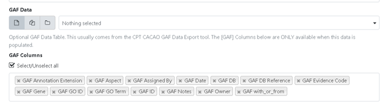

> ### Agenda
>
> 1. Generating the Genome Annotation Table
>
> 2. Uses for the Genome Annotation Table
> 
>
{: .agenda}

# Generating the Genome Annotation Table

First you will need to export sequence data and annotations of the desired phage from Apollo. Begin by running the [Retrieve Data from Apollo into Galaxy](https://cpt.tamu.edu/galaxy/root?tool_id=edu.tamu.cpt2.webapollo.export) tool. Use the **Organism** drop-down menu to select the desired phage then click "Execute." 

Once completed, three output datasets will be in your history named Annotations from Apollo (gff3), Sequence(s) from Apollo (FASTA), and Metadata from Apollo (json).

Next, run the [Phage Annotation Table Tool](https://cpt.tamu.edu/galaxy/root?tool_id=edu.tamu.cpt2.phage.annotation_table). This tool creates an annotation Table from gff3 formatted datasets. Run the tool by using the retrieved data from Apollo as input and selecting tabular table as the report format output then click "Execute."

> ###  Note that...
> The "GAF Data" is an optional part of the Phage Annotation Table Tool and can be left blank.
{: .tip}

Upon completion of the Phage Annotation Table tool,  you will download the annotation table to your local machine by clicking on the save/download icon in the expanded dataset view within the history. 

Finally, open the downloaded genome annotation table file in a spreadsheet in order to visualize the data.

# Uses for the Genome Annotation Table

Once you have opened the genome annotation table in a spreadsheet. The annotation table can be used for viewing all names and notes associated with features in an Apollo record. 

> ###  Remember...
> This is a snapshot in time and does not update when things are changed in Apollo. The annotation table can be generated again at any time.
{: .tip}

Using the annotation table as a temporary holding place for names and notes is fine as viewing these next to each other can be convenient. In a way it also doubles the amount of work in assigning functional predictions since the values have to manually entered into Apollo.

The annotation table can also help you organize your thoughts, impressions, and notes relevant to consider when trying to decide on a final name. They are all right next to each other if opened in an excel-type spreadsheet. It also reduces all the clicking required to simply view notes for any feature in Apollo. 

> ###  Note that...
> A future goal is to be able to convert the changes made in the annotation table back into the gff3 file so that Apollo can also be updated. Doing it this way would allow mass application of needed changes for misspelling, capitalization problems, or other formatting issues with the name and notes text.
{: .tip}

