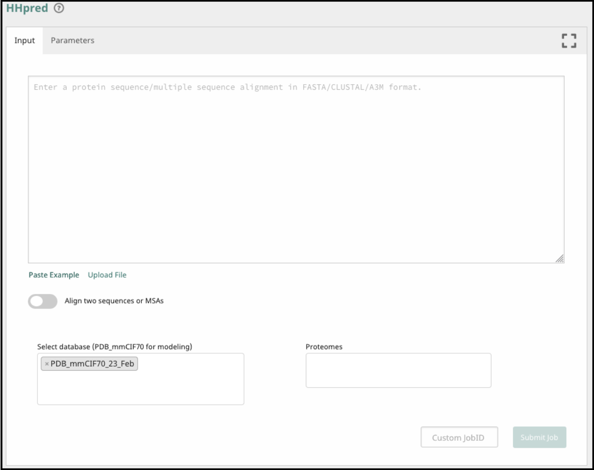
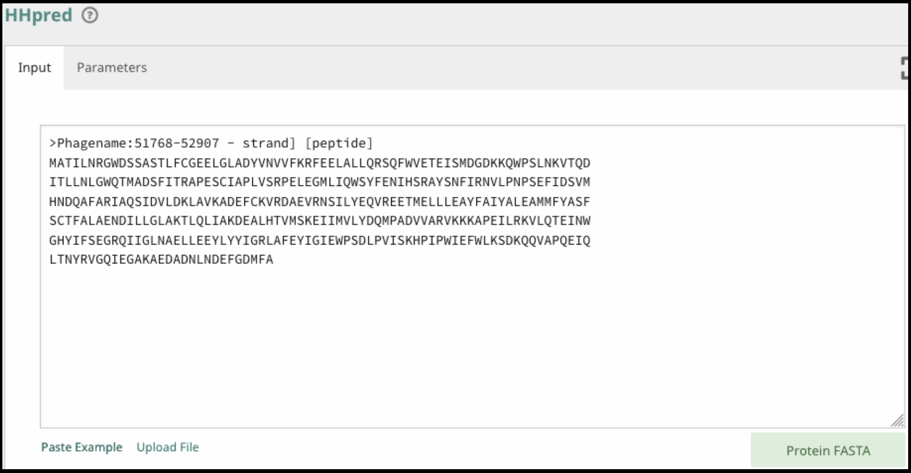
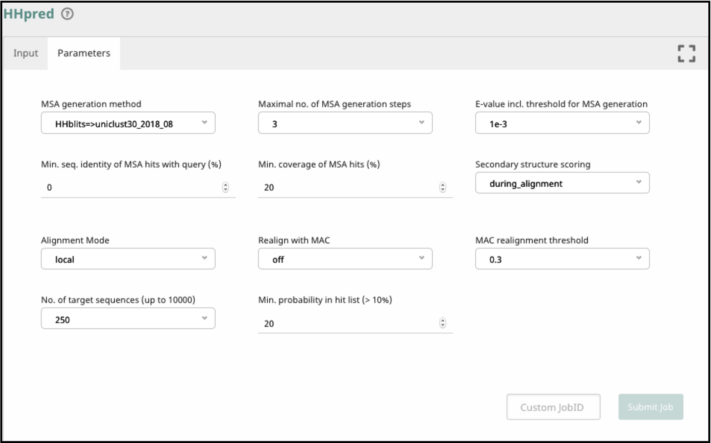
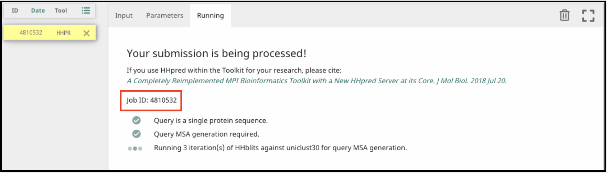
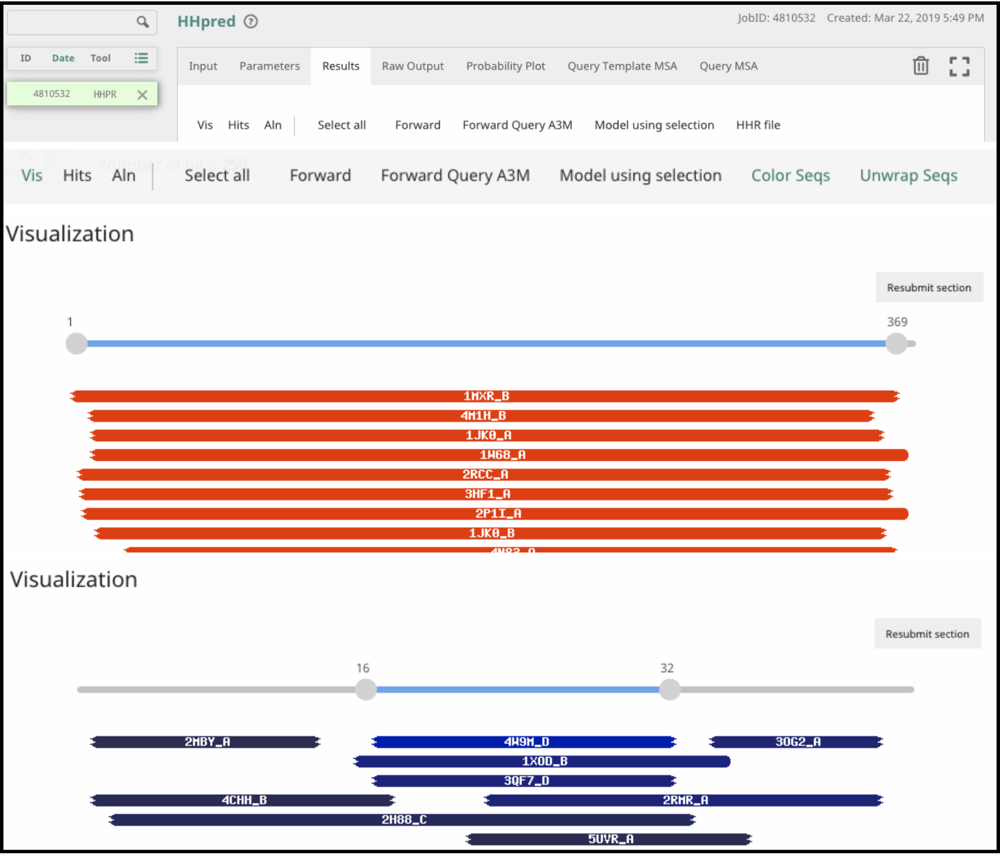
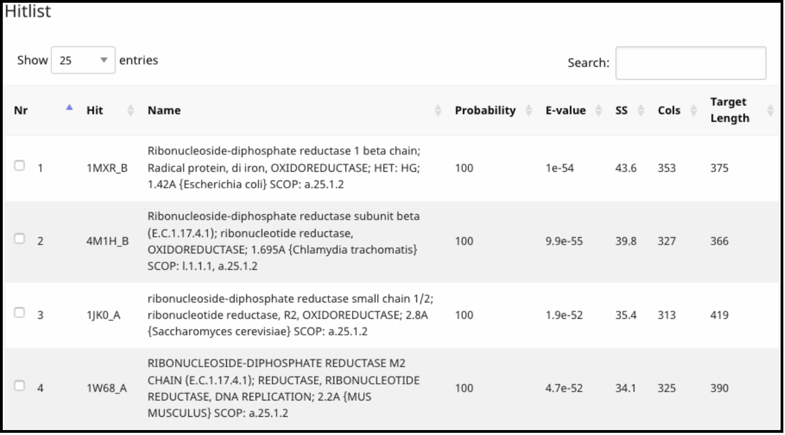
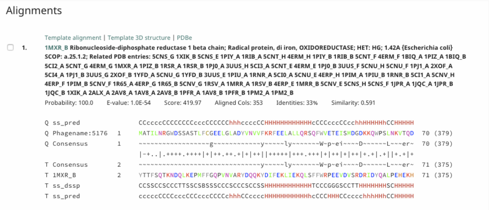

> ### Agenda
>
> Background: Using Protein Structure Prediction Tools to Predict Function
>    > * Protein Structure Prediction
>    > * Tools That Predict Protein Structure
>    > * Caveats
>
> Using & Interpreting HHPred with Caution
>
> Annotation in Apollo Based on HHPred Results
>    > * Directions on Naming the Protein
>    > * What to Include in the Notes
>
{: .agenda}

# Background: Using Protein Structure Prediction Tools to Predict Function

## Protein Structure Prediction
There are a variety of tools that have been developed to predict protein structure using the amino acid sequence. Often these rely on protein alignments and usually threading through the published structures of similar proteins. These are incredibly computationally intensive tasks, and sometimes very wrong. For this reason, online servers typically limit the number of prediction jobs that can be run at a time, and we do not host them here in the CPT Galaxy. It is not very useful to run protein sequence through these tools if you have high confidence of its function based on high-confidence similarity to phage or bacterial proteins of known function, or with good domain hits and reasonable genomic context. Sometimes, the predicted structures, or similarity to structures of proteins with known function is helpful to making a novel phage protein functional prediction, but their use and interpretation should be done judiciously.

## Tools That Predict Protein Structure

 A few of the tools in the field are:
> * [Phyre2](http://www.sbg.bio.ic.ac.uk/phyre2/html/page.cgi?id=index)
> * [I-TASSER](https://zhanglab.ccmb.med.umich.edu/I-TASSER/)
> * [HHPred](https://toolkit.tuebingen.mpg.de/#/tools/hhpred) (discussed here)

> ###  A Relevant Read
> [A Completely Reimplemented MPI Bioinformatics Toolkit with a New HHpred Server at its Core. J Mol Biol. 2017 Dec 16.](https://www.ncbi.nlm.nih.gov/pubmed/29258817)
{: .comment}

## Caveats
The outputs from these tools are *predictions* with varying levels of accuracy. At their very best, structure prediction serves to generate hypotheses that can be tested experimentally. Similar to cautions that apply to domain-swapping (as discussed with regard to InterPro domain hits), pay careful attention to each hit. Small regions of predicted structural similarity and low-confidence in the predictions should be considered weak evidence, and **not** used for confident structural prediction. Be conservative in your use of protein structural prediction tools for functional prediction. Use it last and be *most* suspicious of its results.

# Using & Interpreting HHPred with Caution

##### **Input -  Getting your protein sequence from Apollo to HHPred**

Right-click on a feature and select *Get Sequence*. 
Copy the amino acid sequence. Including the genomic coordinates is useful as well.
Navigate to the HHPred tool. Paste the protein sequence in FASTA format into the query box. To do this, add a '>', then paste the copied sequence with the feature coordinates as the header and all the amino acids on a new line. 

##### **Parameters to run the tool**
Use the standard parameters, unless you have read the help documentation and have good reason to change the defaults. 
Click Submit Job after it detects that you have entered your protein sequence in FASTA format.
Jobs can take from 1-30 minutes typically.

> ###  Note that...
> Jobs are stored for 3 weeks. If you want to come back to these analyses in another browser or session, write down the job ID.
{: .comment}

##### **Looking at the results**

The results are displayed in the browser under several new tabs. The most interesting results are usually in the Results tab and are divided into three parts: Visualization, Hits, and Alignment. 

Under Visualization, colored boxes show where there is alignment of the query protein to hits in the structure database. The color indicates probability score, where red is best and blue is worst. Pay close attention to how much of the query protein is similar to these hits. A good hit that covers a small percentage of the query may be enough to give you a reasonable functional prediction. A low probability hit over a majority of the protein, on the other hand, may not be enough to allow confident prediction of the function.

Under Hits, the proteins that align, with their probability, coverage, and external links to their Protein Data Bank entry (Under Hit column) are listed.

Under Alignment, a detailed alignment between the query and target is given.

> ###  Note that...
> *Probability* takes into consideration secondary structure, and uses the weighted conservation of amino acids at each position for homology determination for prediction.
>
> *E-value* indicates how many chance hits with a better score than this would be expected in a fully unrelated database (I. E.: Smaller is better, and smaller than one is **absolutely** required).
{: .comment}

> ###  Alignment Guide
> * In the alignments, the amino acids are colored based on their physio-chemical properties (E. G.: positive charge = red, negative charge = blue, aliphatic = green).
>
> * Query-related rows start with 'Q' and target-related ones with 'T'.
>
> * While ss_pred indicates secondary structure (SS) states as predicted by PSIPRED, ss_dssp indicates SS states calculated using DSSP from known structures (e = beta-strand, h = alpha-helix).
>
> * Consensus rows show the conservation pattern of residues in the query and target alignments.
{: .tip}

> ###  Questions About Interpreting Results?
>    > ### 
>    > For more comprehensive definitions of symbols and interpreting the output, go to the documentation at [https://github.com/soedinglab/hh-suite/wiki](https://github.com/soedinglab/hh-suite/wiki) and search: **HMM-HMM pairwise alignments**
>    {: .solution}
{: .question}

##### **Sorting through results critically**

HHPred on hypothetical proteins

> * 95% probability = in the bag
> * 50% probability = should be checked for reasonableness
> * 30% probability AND in the top three hits = should be checked for reasonableness, but safer to ignore if there are no other reasonable lines of evidence from Apollo (other BLAST hits, InterPro domains, genomic context, expected synteny to a canonical phage). It is better practice in this case to ignore these and call your feature 'hypothetical protein'. Be conservative in your use of HHPred for functional prediction. Use it last and be *most* suspicious of its results.

What HHPred developers have to say about checking homology. Go to the documentation at [https://github.com/soedinglab/hh-suite/wiki](https://github.com/soedinglab/hh-suite/wiki) and search: **How can I verify if a database match is homologous?**

# Annotation in Apollo Based on HHPred Results

## Directions on Naming the Protein

> ###  A Reminder of Naming Guidelines
>It is imperative to follow suit with the [UniProt](https://www.uniprot.org/docs/International_Protein_Nomenclature_Guidelines.pdf) and [NCBI](https://www.ncbi.nlm.nih.gov/genome/doc/internatprot_nomenguide/) international naming conventions. It allows for standardization and consistency in naming proteins, subsequently aiding data retrieval and improving communication. Follow the convention for capitalization and hypothetical protein naming.
{: .comment}

## What to Include in Notes

**HHPred** *(at minimum)*:
> * Reference to HHPred prediction 
> * Organism name, protein name, and Protein Data Bank IDs of hits (looks something like: 3NJX_A)
> * Probability score and general description of coverage
> * Example note: **HHPred** predicted structural similarity at **99 probability** to **phage T4 portal protein gp20 Protein Data Bank entry 3JA7_I over most of protein**

