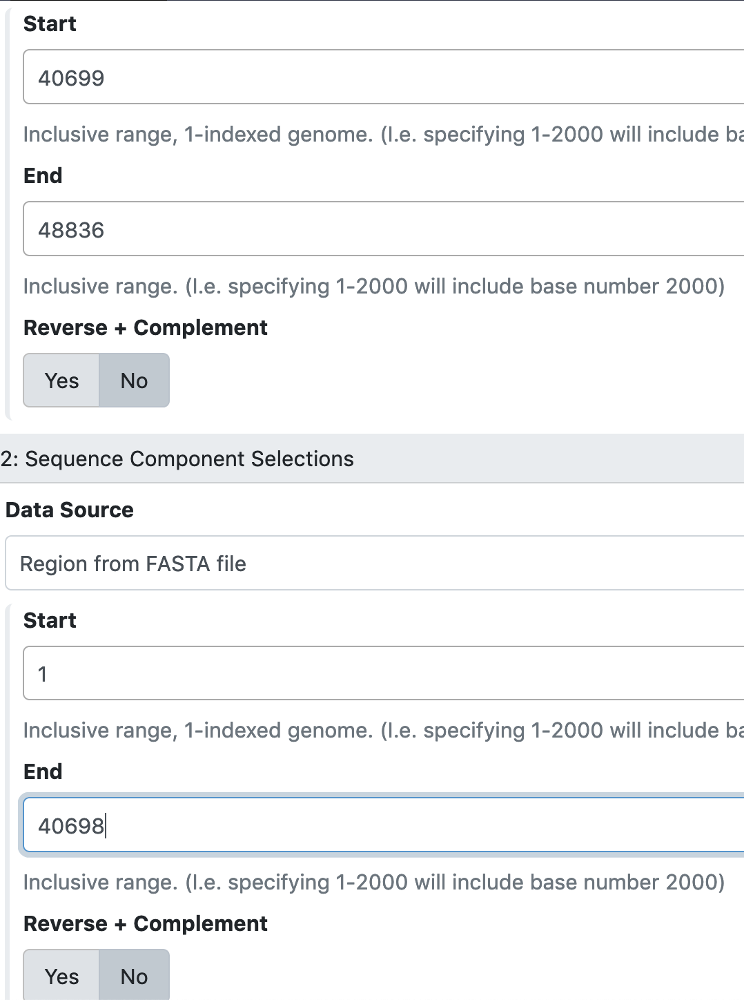

> ### Agenda
>>
> 1. Import Apollo data into Galaxy
> 2. Rearrange the Genome
> 3. Re-upload the Organism into Apollo
>
{: .agenda}

# Import Apollo data into Galaxy

Import Apollo data into Galaxy using the [Retrieve Data](https://cpt.tamu.edu/galaxy-pub/root?tool_id=export) tool (use this [tool link](https://cpt.tamu.edu/galaxy/root?tool_id=export) if you are TAMU user). *Note that by default the tool retrieves the "GFF annotations + whole genome", which gives you two files, "Annotation and Sequence from Apollo" and "Metadata from Apollo".* The "Annotation and Sequence from Apollo" is a .gff3 file that combines the GFF3 annotation and the genome FASTA sequence. You will need to run this [Split tool](https://cpt.tamu.edu/galaxy-pub/root?tool_id=edu.tamu.cpt2.gff3.splitGff) (use this [link](https://cpt.tamu.edu/galaxy/root?tool_id=edu.tamu.cpt2.gff3.splitGff) if you are TAMU user) to separate the "Annotation and Sequence from Apollo" file into a separate GFF3 file (containing only the GFF3 annotation) and a FASTA file (containing only the genome sequence).    

# Rearrange the Genome

Then, use the [Genome Editor](https://cpt.tamu.edu/galaxy-pub/root?tool_id=edu.tamu.cpt.gff3.genome_editor) tool (use this [link](https://cpt.tamu.edu/galaxy/root?tool_id=edu.tamu.cpt.gff3.genome_editor) if you are TAMU user) in Galaxy to edit the genome appropriately: delete extra sequence, add missing sequence, or re-open at the appropriate position.  

Select the GFF3 and FASTA data associated with your genome as input files, click on “Insert sequence component selections” to concatenate them together. You need to fill in a new ID name for the edited genome (like Phage.v2). 

> ###  Please note...
> If you add missing sequences, new gene calls may be needed at the newly added region.  You will lose any annotation that is split by reopening.
{: .tip}

# Re-upload Organism into Apollo

After the organism is edited/reopened, import and run the **“Upload Previously Annotated Sequence to Apollo (v2020.XX)” workflow** in [Published workflows](https://cpt.tamu.edu/galaxy-pub/workflows/list_published) to upload and view the new Apollo record.  

> ###  Note that…
> This creates a new organism, which you must give a new name (like Phage.v2) . Check the features in the re-opened genome to ensure accuracy.  You may need to re-run structural and functional workflow for the re-opened genome to add annotation tracks to the new Apollo record, and to fix gene calls and annotations, especially for the edited regions.
{: .tip}
