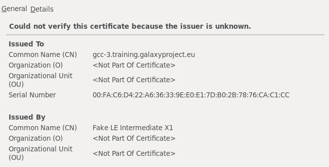

# Overview
{:.no_toc}

This tutorial assumes you have some familiarity with [Ansible](https://www.ansible.com/resources/get-started) and are comfortable with writing and running playbooks. Here we'll see how to install a Galaxy server using an Ansible playbook. The Galaxy Project has decided on Ansible for all of its deployment recipes. For our project, Ansible is even more fitting due to its name:

> An ansible is a category of fictional device or technology capable of instantaneous or faster-than-light communication. It can send and receive messages to and from a corresponding device over any distance or obstacle whatsoever with no delay, even between star systems (Source: [Wikipedia](https://en.wikipedia.org/wiki/Ansible))
{: .quote}

We want to give you a comprehensive understanding of how the Galaxy installation occurs, but we want to avoid you having to write a "custom" Galaxy installation playbook which you would eventually throw away, in order to use the official playbooks. Given these goals, we will go through the playbook in depth first, and then move to a hands-on portion later. If you are not interested in the inner workings, you can [skip to that section now](#installing-galaxy).

> ### Agenda
>
> 1. TOC
> {:toc}
>
{: .agenda}


# Playbook Overview


## Configuration

We'll be using the [official Galaxy role](https://github.com/galaxyproject/ansible-galaxy) to install and manage Galaxy. This role is found in [Ansible Galaxy](https://galaxy.ansible.com/) (no relation - it is Ansible's ) as [galaxyproject.galaxy](https://galaxy.ansible.com/galaxyproject/galaxy).

The official role is extremely configurable, everything that you want to change is exposed as a variable, and then tasks will change behaviour based on that. The [role documentation](https://github.com/galaxyproject/ansible-galaxy#role-variables) is the most up-to-date source of documentation for the variables. You should take a minute and read over the variables listed there.

The important variables for this tutorial are:

- `galaxy_root`
- `galaxy_server_dir`
- `galaxy_commit_id`
- `galaxy_config`

These are largely self explanatory: a directory for all of Galaxy's code and configuration, which commit should be installed, and the Galaxy configuration. We will not explain Galaxy configuration variables in detail as they are covered sufficiently in the `galaxy.yml` sample file or the [online documentation](https://docs.galaxyproject.org/en/master/admin/config.html#configuration-options).

The official recommendation is that you should have a variables file such as a `group_vars/galaxy.yml` for storing all of the Galaxy configuration.

## Tasks

As with every role, the entry point for execution is the `tasks/main.yml` file. For the [ansible-galaxy](https://github.com/galaxyproject/ansible-galaxy/blob/master/tasks/main.yml) file, this includes a few groups of important tasks:

- [Clone (or Download) Galaxy](#cloning-galaxy)
- [Managing Configuration](#managing-configuration)
- [Fetching Dependencies](#dependencies)
- [Managing Mutable Setup](#mutable-setup)
- [Managing the Database](#managing-the-database)

### Cloning Galaxy

The [clone](https://github.com/galaxyproject/ansible-galaxy/blob/master/tasks/clone.yml) task is the one which is primarily interesting to us, it downloads Galaxy, using git, to a specific commit.

1. Ansible tries to update Galaxy, cloning it if it is missing, or otherwise attempting to update to the correct commit (or latest commit of that branch.)
2. Any change is reported.
3. The virtualenv is set up:
    1. An empty virtualenv is created.
    2. Pip is updated within the virtualenv.
4. Any `.pyc` files are removed, as this can occasionally result in Python loading the cached code, even if the corresponding `.py` file is no more present at the checked-out commit. For safety, all of these are removed.

With that Galaxy is cloned to disk and is ready to be configured by the next task.

### Managing Configuration

The [static configuration setup](https://github.com/galaxyproject/ansible-galaxy/blob/master/tasks/static_setup.yml) is relatively straightforward:

1. The directories for Galaxy configuration data and for the shed tools are created
2. Any config files are copied over
3. Any templates are copied over
4. The `galaxy.yml` (or `.ini`) is deployed

The setup for deploying templates and configuration files is a little bit non-standard by Ansible standards. Here you are expected to provide your own templates and static config files, and then describe them as a list of files and where they should be deployed to.

Using the [UseGalaxy.eu](https://github.com/usegalaxy-eu/infrastructure-playbook/blob/02ca578211bfee45044facf36635d28208e5dbb3/group_vars/galaxy.yml#L578) configuration as an example, we have something like:



```yaml
galaxy_config_files:
  - src: files/galaxy/config/builds.txt
    dest: "{{ galaxy_config['galaxy']['builds_file_path'] }}"
  - src: files/galaxy/config/data_manager_conf.xml
    dest: "{{ galaxy_config['galaxy']['data_manager_config_file'] }}"
  - src: files/galaxy/config/datatypes_conf.xml
    dest: "{{ galaxy_config['galaxy']['datatypes_config_file'] }}"
  - src: files/galaxy/config/dependency_resolvers_conf.xml
    dest: "{{ galaxy_config['galaxy']['dependency_resolvers_config_file'] }}"
  - src: files/galaxy/config/disposable_email_blacklist.conf
    dest: "{{ galaxy_config['galaxy']['blacklist_file'] }}"
```


The configuration here is a bit different, it references the `galaxy_config`, which is structured like:


```yaml
galaxy_config:
  galaxy:
    builds_file_path: "{{ galaxy_config_dir  }}/builds.txt"
    datatypes_config_file: "{{ galaxy_config_dir  }}/datatypes_conf.xml"
```


So the references in `galaxy_config_files` to `galaxy_config` are done to ensure that the setting for e.g. "location of the blacklist file" is the same between where we have configured Galaxy to looking for it, and where the file has been deployed, without requiring us to make variables changes in numerous places.

### Dependencies

Now that Galaxy is available on disk, Ansible is ready to start processing [dependencies](https://github.com/galaxyproject/ansible-galaxy/blob/master/tasks/dependencies.yml) of Galaxy.

1. The virtualenv is updated with data from the `galaxy_requirements_file`, by default pointing to the requirements file in the codebase: `{{ galaxy_server_dir  }}/lib/galaxy/dependencies/pinned-requirements.txt`.
2. Any necessary conditional dependencies of Galaxy are [collected by processing the config file](https://github.com/galaxyproject/galaxy/blob/dev/lib/galaxy/dependencies/__init__.py)
2. and then installed to the virtualenv.

### Mutable Setup

[This task](https://github.com/galaxyproject/ansible-galaxy/blob/master/tasks/mutable_setup.yml) creates a directory and deploys any hand-managed mutable configuration files. It is unlikely that you want to manage these, as Galaxy does a sufficient job. Any changes you make to Galaxy like installing tools would result in the tools being "forgotten about", if you re-ran the playbook and overwrote that file.


### Managing the Database

The [database management tasks](https://github.com/galaxyproject/ansible-galaxy/blob/master/tasks/database.yml) are extremely convenient; any time you run the playbook to update Galaxy, this will automatically run the database schema migration as needed.

1. Galaxy first obtains the current DB version and the maximum possible DB version based on the codebase.
2. If needed, the database is created.
3. Both numbers are reported for the runner of the playbook.
4. If the numbers are different, then Ansible runs the command to upgrade the database to the latest version.

As an administrator who often forgot to run the upgrade, and would only notice it once Galaxy crashed during startup, having this process completely automated is extremely nice.

## Handlers

A number of the tasks that are executed will trigger a restart of Galaxy. Currently there is no auto-magic implementation of this, and you will have to do something that fits for your setup. The role provides a way to reference your own [handler](https://docs.ansible.com/ansible/latest/user_guide/playbooks_intro.html#handlers-running-operations-on-change), which we will do in this exercise. As Galaxy continues to standardise on setup, something will be implemented directly in the role to automatically restart the correct processes.

## Defaults

As with other roles, numerous [default values](https://github.com/galaxyproject/ansible-galaxy/blob/master/defaults/main.yml) are provided, but these are useful mostly as reference, and not to go through individually.

## Summary

Installation of Galaxy with the playbook follows generally the steps you would expect:

- Galaxy is cloned (or updated)
- A virtualenv is created if it doesn't exist
- Configuration files are installed
- Any missing dependencies are installed
- Any database updates are applied

It would not be difficult to write a role that does this yourself, but by using
the `galaxyproject.galaxy` role, you know that you're getting all of the Galaxy
best practices and knowledge from previous admins codified for you.

# Installing Galaxy

With the necessary background in place, you are ready to install Galaxy with Ansible. The playbooks will start simple, and grow over time. We will start with the minimal Galaxy playbook which only requires setting the `galaxy_server_dir` and expand from there. First, however, we need a database for Galaxy to connect to, so we will do that now.

To proceed from here it is expected that:

1. You have [Ansible installed](https://docs.ansible.com/ansible/latest/installation_guide/intro_installation.html) on your local machine
   > ###  Comment: Running Ansible on your remote machine
   > It is possible to have Ansible installed on the remote machine and run it there as well. You will need to update your inventory file to pass `ansible_connection=local`. Be **certain** that the playbook that you're building is stored somewhere safe like your user home directory. We will remove data at one point during this tutorial and would not want you to lose your progress.
   {: .comment}
2. Your `ansible` version is `>=2.7`, you can check this by running `ansible --version`
3. You have an [inventory file](../ansible/tutorial.html#inventory-file) with the VM or host specified where you will deploy Galaxy. We will refer to this group of hosts as "galaxyservers."
4. Your VM has a public DNS name: this tutorial sets up SSL certificates from the start and as an integral part of the tutorial.
5. Your VM has `python2.7` installed.
6. In your inventory file, you have written the full DNS hostname that has been provided, and **not** `localhost`, as we will be requesting SSL certificates.


## Requirements

We have codified all of the dependencies you will need into a yaml file that `ansible-galaxy` can install

> ###  Hands-on: Minimal Galaxy Playbook
>
> 1. Create a new directory `galaxy` in your home folder, and `cd` into that directory
>
> 2. Create a new file in your working directory called `requirements.yml` and include the following contents:
>
>    ```yaml
>    - src: galaxyproject.galaxy
>      version: 0.8.4
>    - src: galaxyproject.nginx
>      version: 0.6.0
>    - src: galaxyproject.postgresql
>      version: 1.0.1
>    - src: natefoo.postgresql_objects
>      version: 1.1
>    - src: geerlingguy.pip
>      version: 1.0.0
>    - src: uchida.miniconda
>      version: 0.3.0
>    - src: https://github.com/usegalaxy-eu/ansible-role-supervisor
>      name: usegalaxy-eu.supervisor
>    - src: https://github.com/usegalaxy-eu/ansible-certbot
>      name: usegalaxy-eu.certbot
>    ```
>
> 3. In the same directory, run:
>
>    ```
>    ansible-galaxy install -p roles -r requirements.yml
>    ```
>
>    This will install all of the required modules for this training into the `roles/` folder. We choose to install to a folder to give you easy access to look through the different roles when you have questions on their behaviour.
>
> 4. Create the `hosts` inventory file if you have not done so, include a group for `[galaxyservers]` with the address of the host where you want to install Galaxy. Remember, if you are running ansible on the same machine as Galaxy will be installed to, you should set `ansible_connection=local`.
>
>    > ###  Question
>    >
>    > How does your hosts file look?
>    >
>    > > ###  Solution
>    > >
>    > > Your hostname is probably different
>    > >
>    > > ```yaml
>    > > [galaxyservers]
>    > > training-0.example.org ansible_connection=local
>    > > ```
>    > >
>    > {: .solution}
>    {: .question}
>
> 5. Inspect the contents of the newly created `roles` directory in your working directory.
>
{: .hands_on}

## PostgreSQL

Galaxy is capable of talking to multiple databases through SQLAlchemy drivers. SQLite is the development database, but PostgreSQL is recommended in production. MySQL is a possibility, but does not receive the same testing or bugfixes from the main development team as PostgreSQL, so we will only show installation with PostgreSQL.

PostgreSQL maintains its own user database apart from the system user database. By default, PostgreSQL uses the "peer" authentication method which allows access for system users with matching PostgreSQL usernames (other authentication mechanisms are available, see the [PostgreSQL Client Authentication documentation](https://www.postgresql.org/docs/current/static/client-authentication.html).

For this tutorial, we will use the default "peer" authentication, so we need to create a PostgreSQL user matching the system user under which Galaxy will be running, i.e. `galaxy`. This is normally done with the PostgreSQL `createuser` command, and it must be run as the `postgres` user. In our case, we will use the `natefoo.postgresql_objects` role to handle this step.

> ###  Hands-on: Installing PostgreSQL
>
> 1. Create and edit `group_vars/galaxyservers.yml` and add some variables to configure PostgreSQL:
>
>    ```yaml
>    postgresql_objects_users:
>      - name: galaxy
>    postgresql_objects_databases:
>      - name: galaxy
>        owner: galaxy
>    ```
>
> 2. Create and open `galaxy.yml` which will be our playbook. Add the following:
>
>    - Add a pre-task to install the necessary dependency, `python-psycopg2`
>    - A role for `galaxyproject.postgresql`. This will handle the installation of PostgreSQL.
>    - A role for `natefoo.postgresql_objects`, run as the postgres user. (You will need `become`/`become_user`.) This role allows for managing users and databases within postgres.
>
>    > ###  Question
>    >
>    > How does your current playbook look?
>    >
>    > > ###  Solution
>    > >
>    > > ```yaml
>    > > - hosts: galaxyservers
>    > >   become: true
>    > >   pre_tasks:
>    > >     - name: Install Dependencies
>    > >       package:
>    > >         name: 'python-psycopg2'
>    > >   roles:
>    > >     - galaxyproject.postgresql
>    > >     - role: natefoo.postgresql_objects
>    > >       become: true
>    > >       become_user: postgres
>    > > ```
>    > >
>    > {: .solution }
>    >
>    {: .question}
>
> 3. Run the playbook:
>
>    ```
>    ansible-playbook -i hosts galaxy.yml
>    ```
>
>    > ###  Comment: When running Ansible
>    > Always pay close attention to tasks reported as **changed** and ensure that the changes were expected!
>    {: .comment}
>
> 4. Inspect the changes that have been made on your Galaxy server. Places to look include:
>     - `/etc/postgresql`
>     - Databases and users in PostgreSQL. You can now login and access the database, but only as the `postgres` user. You will need to `sudo -iu postgres` first, and then you can run `psql galaxy`. The database will currently be empty as Galaxy has never connected to it yet. Once you install Galaxy in the next step, the database will be populated. Hint: try the commands `\du` and `\l`.
{: .hands_on}


## Galaxy

Next we will dive right in to deploying a copy of Galaxy onto our server, but it will just be a static copy of the code without anything running.

For a normal Galaxy instance there are a few configuration changes you make very early during deployment:

- Changing the database connection
- Configuring the admin user list
- Changing the "brand"

Additionally we'll go ahead and set up the production-ready [uWSGI Mules](https://uwsgi-docs.readthedocs.io/en/latest/Mules.html) which will handle processing Galaxy jobs. With Mules, uWSGI launches as many as you request, and then they take turns placing a lock, accepting a job, releasing that lock, and then going on to process that job.

Finally, best admin practices are to not run Galaxy as a user with `sudo` access, like your login user probably has. Additionally, it is best to install the Galaxy code and configs as a separate user, for security purposes. So we will instruct the `galaxyproject.galaxy` role to create a new user account specifically to run Galaxy under.

> ###  Mules are not the only option
>
> Galaxy can be run in a [couple of other configurations](https://docs.galaxyproject.org/en/master/admin/scaling.html#deployment-options) depending on your needs. Mules are generally a good solution for most production needs.
>
{: .details}

The configuration is quite simple thanks to the many sensible defaults that are provided in the Ansible roles.

> ###  Hands-on: Minimal Galaxy Playbook
>
> 1. Open `galaxy.yml` with your text editor and set the following:
>
>    - Amend the [package installation](https://docs.ansible.com/ansible/latest/modules/package_module.html#package-module) pre-task to install some additional necessary dependencies: `git`, `make`, and `python-virtualenv`
>    - Add the roles `geerlingguy.pip`, `galaxyproject.galaxy` and `uchida.miniconda` (in this order) at the end
>
>    > ###  Question
>    >
>    > How does your final configuration look?
>    >
>    > > ###  Solution
>    > >
>    > > ```yaml
>    > > - hosts: galaxyservers
>    > >   become: true
>    > >   pre_tasks:
>    > >     - name: Install Dependencies
>    > >       package:
>    > >         name: ['git', 'make', 'python-psycopg2', 'python-virtualenv']
>    > >   roles:
>    > >     - galaxyproject.postgresql
>    > >     - role: natefoo.postgresql_objects
>    > >       become: true
>    > >       become_user: postgres
>    > >     - geerlingguy.pip
>    > >     - galaxyproject.galaxy
>    > >     - uchida.miniconda
>    > > ```
>    > >
>    > {: .solution }
>    >
>    {: .question}
>
> 2. Edit your group variables file for your group (`group_vars/galaxyservers.yml`).
>
>    We need to set the following variables at the top level:
>
>    
>    Variable                     | Value                                     | Purpose
>    ---                          | -----                                     | ---
>    `galaxy_create_user`         | `true`                                    | Instruct the role to create a Galaxy user
>    `galaxy_separate_privileges` | `true`                                    | Enable separation mode to install the Galaxy code as `root` but run the Galaxy server as `galaxy`
>    `galaxy_manage_paths`        | `true`                                    | Instruct thre role to create the needed directories.
>    `galaxy_layout`              | `root-dir`                                | This enables the `galaxy_root` Galaxy deployment layout:all of the code, configuration, and data folders will live beneath `galaxy_root`.
>    `galaxy_root`                | `/srv/galaxy`                             | This is the root of the Galaxy deployment.
>    `galaxy_user`                | `{name: galaxy, shell: /bin/bash}`        | The user that Galaxy will run as.
>    `galaxy_commit_id`           | `release_19.05`                           | The git reference to check out, which in this case is the branch for Galaxy Release 19.05
>    `galaxy_config_style`        | `yaml`                                    | We want to opt-in to the new style YAML configuration.
>    `galaxy_force_checkout`      | `true`                                    | If we make any modifications to the Galaxy codebase, they will be removed. This way we know we're getting an unmodified Galaxy and no one has made any unexpected changes to the codebase.
>    `miniconda_prefix`           | `{{ galaxy_tool_dependency_dir }}/_conda` | We will manually install conda as well. Normally Galaxy will attempt to auto-install this, but since we will set up a production-ready instance with multiple handlers, there is the chance that they can get stuck.
>    
>
>
> 3. Again edit the group variables file and add a variable for `galaxy_config`. It will be a hash with one key, `galaxy` which will also be a hash. Inside here you can place all of your Galaxy configuration.
>
>    So the structure looks like:
>    ```yaml
>    galaxy_config:
>       galaxy:
>           key: value
>    ```
>
>    Now you should set:
>    1. `admin_users` to the email address you will use with this Galaxy.
>    2. `brand` to something fun!
>    3. `database_connection` to point to the database you setup earlier (`postgresql:///galaxy?host=/var/run/postgresql`).
>    4. `file_path` to a place to store data, `/data` for this lesson.
>    5. `check_migrate_tools` must be set to `false` due to a new installation of Galaxy.
>    6. `shed_tool_data_dir` to `{{ galaxy_mutable_data_dir }}/tool-data`, so that when tools are installed, due to privilege separation, this will happen in a directory Galaxy can actually write into.
>
>    > ###  Question
>    >
>    > How does your current group variables file look?
>    >
>    > > ###  Solution
>    > > 
>    > > ```yaml
>    > > ---
>    > > # PostgreSQL
>    > > postgresql_objects_users:
>    > >   - name: galaxy
>    > >     password: null
>    > > postgresql_objects_databases:
>    > >   - name: galaxy
>    > >     owner: galaxy
>    > >
>    > > # Galaxy
>    > > galaxy_create_user: true
>    > > galaxy_separate_privileges: true
>    > > galaxy_manage_paths: true
>    > > galaxy_layout: root-dir
>    > > galaxy_root: /srv/galaxy
>    > > galaxy_user: {name: galaxy, shell: /bin/bash}
>    > > galaxy_commit_id: release_19.05
>    > > galaxy_config_style: yaml
>    > > galaxy_force_checkout: true
>    > > miniconda_prefix: "{{ galaxy_tool_dependency_dir }}/_conda"
>    > >
>    > > galaxy_config:
>    > >   galaxy:
>    > >     brand: "My Galaxy"
>    > >     admin_users: admin@example.org
>    > >     database_connection: "postgresql:///galaxy?host=/var/run/postgresql"
>    > >     file_path: /data
>    > >     check_migrate_tools: false
>    > >     shed_tool_data_dir: "{{ galaxy_mutable_data_dir }}/tool-data"
>    > > ```
>    > > 
>    > {: .solution }
>    >
>    {: .question}
>
>    > ###  Ansible Variable Templating
>    > In this step we use some templated variables. These are seen in our group variables, among other places, and look like `miniconda_prefix: "{{ galaxy_tool_dependency_dir  }}/_conda"`.
>    >
>    > When Ansible runs:
>    >
>    > 1. It collects variables defined in group variables and other places
>    > 2. The first task for each machine is the [`setup` module](https://docs.ansible.com/ansible/latest/modules/setup_module.html) which gathers facts about the host, which are added to the available variables
>    > 3. As roles are executed:
>    >    1. Their defaults are added to the set of variables (the group variables having precedence over these variables)
>    >    2. They can also dynamically define more variables which may not be set until that role is run
>    > 4. Before use (in templates, commands, etc.), variables are resolved to their final value
>    > So it is not always easy to tell what variables will be set, or what their finaly value will be, without running the playbook. It is possible, but non trivial.
>    >
>    {: .comment}
>
> 4. In order to use mule messaging, we need to edit the uWSGI configuration of Galaxy. This has a default value, but we will have to override it. Add the following configuration as a child of the `galaxy_config` variable:
>
>    
>    ```yaml
>    galaxy_config:
>      galaxy:
>      ...
>      uwsgi:
>        # Default values
>        http: 0.0.0.0:8080
>        buffer-size: 16384
>        processes: 1
>        threads: 4
>        offload-threads: 2
>        static-map:
>          - /static/style={{ galaxy_server_dir }}/static/style/blue
>          - /static={{ galaxy_server_dir }}/static
>        master: true
>        virtualenv: "{{ galaxy_venv_dir }}"
>        pythonpath: "{{ galaxy_server_dir }}/lib"
>        module: galaxy.webapps.galaxy.buildapp:uwsgi_app()
>        thunder-lock: true
>        die-on-term: true
>        hook-master-start:
>          - unix_signal:2 gracefully_kill_them_all
>          - unix_signal:15 gracefully_kill_them_all
>        py-call-osafterfork: true
>        enable-threads: true
>        # Our additions
>        mule:
>          - lib/galaxy/main.py
>          - lib/galaxy/main.py
>        farm: job-handlers:1,2
>    ```
>    
>
>    > ###  Question
>    >
>    > How does your current group variables file look?
>    >
>    > > ###  Solution
>    > > 
>    > > ```yaml
>    > > # PostgreSQL
>    > > postgresql_objects_users:
>    > >   - name: galaxy
>    > >     password: null
>    > > postgresql_objects_databases:
>    > >   - name: galaxy
>    > >     owner: galaxy
>    > >
>    > > # Galaxy
>    > > galaxy_create_user: true
>    > > galaxy_separate_privileges: true
>    > > galaxy_manage_paths: true
>    > > galaxy_layout: root-dir
>    > > galaxy_root: /srv/galaxy
>    > > galaxy_user: {name: galaxy, shell: /bin/bash, home: "{{ galaxy_root }}"}
>    > > galaxy_commit_id: release_19.05
>    > > galaxy_config_style: yaml
>    > > galaxy_force_checkout: true
>    > > miniconda_prefix: "{{ galaxy_tool_dependency_dir }}/_conda"
>    > >
>    > > galaxy_config:
>    > >   galaxy:
>    > >     brand: "My Galaxy"
>    > >     admin_users: admin@example.org
>    > >     database_connection: "postgresql:///galaxy?host=/var/run/postgresql"
>    > >     file_path: /data
>    > >     check_migrate_tools: false
>    > >     shed_tool_data_dir: "{{ galaxy_mutable_data_dir }}/tool-data"
>    > >   uwsgi:
>    > >     # Default values
>    > >     http: 0.0.0.0:8080
>    > >     buffer-size: 16384
>    > >     processes: 1
>    > >     threads: 4
>    > >     offload-threads: 2
>    > >     static-map:
>    > >       - /static/style={{ galaxy_server_dir }}/static/style/blue
>    > >       - /static={{ galaxy_server_dir }}/static
>    > >     master: true
>    > >     virtualenv: "{{ galaxy_venv_dir }}"
>    > >     pythonpath: "{{ galaxy_server_dir }}/lib"
>    > >     module: galaxy.webapps.galaxy.buildapp:uwsgi_app()
>    > >     thunder-lock: true
>    > >     die-on-term: true
>    > >     hook-master-start:
>    > >       - unix_signal:2 gracefully_kill_them_all
>    > >       - unix_signal:15 gracefully_kill_them_all
>    > >     py-call-osafterfork: true
>    > >     enable-threads: true
>    > >     # Our additions
>    > >     mule:
>    > >       - lib/galaxy/main.py
>    > >       - lib/galaxy/main.py
>    > >     farm: job-handlers:1,2
>    > > ```
>    > > 
>    > {: .solution }
>    >
>    {: .question}
>
>
> 5. Run the playbook.
>
>    ```
>    ansible-playbook -i hosts galaxy.yml
>    ```
>
> 6. Explore what has been set up for you.
>     - Galaxy has been deployed to `/srv/galaxy/server`
>     - The configuration lives in `/srv/galaxy/config/galaxy.yml` - be sure to look through it to see what default options have been set for you
>     - Note the permissions of the contents of `/srv/galaxy`
>     - Some config files that Galaxy maintains itself, such as `shed_tool_conf.xml`, which controls what tools that you have installed from the Tool Shed will be loaded, have been instantiated in `/srv/galaxy/var/config`
>     - A Python virtualenv - an isolated Python environment - with all of the Galaxy framework's dependencies has been installed in `/srv/galaxy/venv`
>
{: .hands_on}

> ###  Simplifying the command line with ansible.cfg
> Typing `-i hosts` every time can be a bit repetitive, you can save having to type this flag by creating an `ansible.cfg` file (next to your playbook) with the following contents:
>
> ```ini
> [defaults]
> inventory = hosts
> ```
>
> There are some additional useful options that you might want to add to your `ansible.cfg` file:
>
> ```ini
> [ssh_connection]
> pipelining = true
> [defaults]
> retry_files_enabled = false
> ```
>
> Pipelining will make [ansible run faster](https://docs.ansible.com/ansible/latest/reference_appendices/config.html#ansible-pipelining) by significantly reducing the number of new SSH connections that must be opened. Setting `retry_files_enabled = false` will prevent Ansible from creating `playbook.retry` files whenever a playbook crashes before finishing. These are rarely useful for the cases in which we run Ansible.
>
> For users running with the local connection, you can specify this in your `hosts` inventory file:
>
> ```ini
> [galaxyservers]
> your.host.name ansible_connection=local
> ```
{: .details}

Galaxy is now configured with an admin user, a database, and a place to store data. Additionally we've immediately configured the mules for production Galaxy serving. So we're ready to set up supervisord which will manage the Galaxy processes!

> ###  Hands-on: (Optional) Launching uWSGI by hand
>
> 1. SSH into your server
> 2. Switch user to Galaxy account (`sudo -iu galaxy`)
> 3. Change directory into `/srv/galaxy/server`
> 4. Activate virtualenv (`. ../venv/bin/activate`)
> 5. `uwsgi --yaml ../config/galaxy.yml`
> 6. Access at port `<ip address>:8080` once the server has started
{: .hands_on}

## Supervisord

Launching Galaxy by hand is not a good use of your time, so we will immediately switch to a process manager for that, [supervisord](http://supervisord.org/). If you're familiar with systemd, supervisord does many of the same things. We use supervisord instead of the native init system as it supports some of Galaxy's use cases better and was fully featured long before SystemD became common.

> ###  Hands-on: Supervisord
>
> 1. Add the role `usegalaxy-eu.supervisor` to your playbook. This should run **after** all of the roles we have already added so far.
>
> 2. Supervisor defines `programs` which should be executed with additional metadata like whether or not they should be restarted, what user they should run as, etc. Just like SystemD or any other init system you may be familiar with. We will define a program for Galaxy which will directly invoke uWSGI, rather than `run.sh`, as `run.sh` does some extra tasks that are not needed in a true production environment. Supervisor communicates over a unix or tcp socket; we will use the unix socket without password authentication, instead of using user/group authentication. We will thus need to set a couple of variables to allow our Galaxy user to access this. Lastly, since we now define how the Galaxy processes will be managed, we can inform `galaxyproject.galaxy` how to automatically restart the server whenever it is changed.
>
>    Add the following to the bottom of your `group_vars/galaxyservers.yml` file:
>
>    
>    ```yaml
>    # Automatically restart Galaxy by calling a handler named 'Restart
>    # Galaxy', whenever the server changes.
>    galaxy_restart_handler_name: Restart Galaxy
>
>    # supervisord
>    supervisor_socket_user: galaxy
>    supervisor_socket_chown: galaxy
>    supervisor_programs:
>      - name: galaxy
>        state: present
>        command: "uwsgi --yaml {{ galaxy_config_dir }}/galaxy.yml"
>        configuration: |
>          autostart=true
>          autorestart=true
>          startretries=1
>          startsecs=10
>          user=galaxy
>          umask=022
>          directory={{ galaxy_server_dir }}
>          environment=HOME={{ galaxy_mutable_data_dir }},VIRTUAL_ENV={{ galaxy_venv_dir }},PATH={{ galaxy_venv_dir }}/bin:%(ENV_PATH)s
>    ```
>    
>
>    Here we've defined a `galaxy` command that should be `present`. It will run the command `uwsgi ...` and is set to automatically start when supervisord starts and restart if it crashes, with 1 second between the retries. It will wait 10 seconds to see if the program has not crashed, and if it reaches this threshold it will be marked as `running`. It starts as the `galaxy` user with a umask of `022` (files created will be world readable by default). Its working directory on startup is the root of the Galaxy (cloned) code, and will run with the defined environment variables set.
>
> 3. Now that we have defined a process manager for Galaxy, we can also instruct `galaxyproject.galaxy` to use Supervisor to restart it when Galaxy is upgraded or other configuration changes are made. To do so, open `galaxy.yml` and add a `handlers:` section at the same level as `pre_tasks:` and `roles:`, and add a handler to restart Galaxy using the [supervisorctl Ansible module](https://docs.ansible.com/ansible/latest/modules/supervisorctl_module.html). Handlers are structured just like tasks:
>
>    ```yaml
>    - hosts: galaxyservers
>      pre_tasks:
>        - name: Install Dependencies
>          package:
>            name: ['git', 'make', 'python-psycopg2', 'python-virtualenv']
>      handlers:
>        - name: Restart Galaxy
>          supervisorctl:
>            name: galaxy
>            state: restarted
>      roles:
>        ...
>    ```
>
> 4. Run the playbook
>
> 5. Log in and check the status with `supervisorctl status` (remember to change to the Galaxy user)
>
>    > ###  Question
>    >
>    > How does the output look?
>    >
>    > > ###  Solution
>    > >
>    > > If everything went correctly you should see something like
>    > >
>    > > ```yaml
>    > > galaxy                  RUNNING   pid 2246972, uptime 0:02:00
>    > > ```
>    > >
>    > {: .solution }
>    >
>    {: .question}
>
>    Take a look at the supervisor configs that have been written in `/etc/supervisor` and `/etc/supervisor/conf.d`.
>
> 6. Some things to note:
>
>    1. Refreshing the page before Galaxy has restarted will hang until the process is ready, a nice feature of uWSGI
>    2. Although the playbook will restart Galaxy upon config changes, you will sometimes need to restart it by hand, which can be done with `supervisorctl restart galaxy`
>    3. You can use `supervisorctl tail -f galaxy` and `supervisorctl tail -f galaxy stderr` to see the logs of Galaxy
>
{: .hands_on}

Galaxy should now be accessible over port :8080, again try connecting to your VM now and checking that Galaxy is working. Note that the welcome page is broken, this is a known issue, and a good reminder to write your own :)

> ###  Ansible, failures, and notifications
>
> Sometimes Ansible tasks will fail. Usually due to misconfiguration, but occasionally due to other issues like your coworker restarted the server while you were doing maintenance, or network failures, or any other possible error. It happens. An unfortunate side effect can be observed in specific situations:
>
> Let's say you're running a playbook that updates the `galaxy.yml`, which will in turn notify the handler `Restart Galaxy`. If this change is made, and notification triggered, but a failure occurs before Ansible can reach the step where it runs the handlers. The handlers will not run during this Ansible execution.
>
> The next time you run the playbook, Ansible will not observe any configuration files changing (because they were changed in the last run.) And so the `Restart Galaxy` handler will not run.
>
> If you encounter this situation you just have to be mindful of the fact, and remember to manually restart the handler. There is no general solution to this problem unfortunately. This applies mostly to development setups. In production you're probably running that playbook somewhat regularly and do not expect failures as everything is quite stable.
>
{: .details}

## NGINX

With this we have:

- PostgreSQL running
- Galaxy running (managed by supervisord)

When we first configured Galaxy, we used the setting `http: 0.0.0.0:8080`, which instructed uWSGI to handle the serving of Galaxy, and to process the HTTP requests itself. This has some overhead and is not as efficient as is desired in production. So we will set up a reverse proxy to handle the HTTP processing, and translate this into the more efficient uWSGI protocol. Additionally it can handle serving static files for us without the requests going through uWSGI, allowing it to spend more time on useful tasks like processing jobs.

Additionally, by moving to NGINX or another reverse proxy, it can automatically compress selected content, we can easily apply caching headers to specific types of content like CSS or images. It is also necessary if we want to serve multiple sites at once, e.g. with a group website at `/` and Galaxy at `/galaxy`. Lastly, it can provide authentication as well, as noted in the [External Authentication]({{ site.baseurl }}/topics/admin/tutorials/external-auth/tutorial.html) tutorial.


For this, we will use NGINX. It is possible to configure Galaxy with Apache and potentially other webservers but this is not the configuration that receives the most testing. We recommend NGINX unless you have a specific need for Apache. [Google's PageSpeed Tools](https://developers.google.com/speed/pagespeed/insights/) can identify any compression or caching improvements you can make.

> ###  Hands-on: NGINX
>
> 1. Edit your `group_vars/galaxyservers.yml`, we will update the line that `http: 0.0.0.0:8080` to be `socket: 127.0.0.1:8080`. This will cause uWSGI to only respond to uWSGI protocol, and only to requests originating on localhost.
>
>    ```diff
>    --- group_vars/galaxyservers.yml.orig
>    +++ group_vars/galaxyservers.yml
>    @@ -29,7 +29,7 @@
>         shed_tool_data_dir: "{{ galaxy_mutable_data_dir }}/tool-data"
>       uwsgi:
>         # Default values
>    -    http: 0.0.0.0:8080
>    +    socket: 127.0.0.1:8080
>         buffer-size: 16384
>         processes: 1
>         threads: 4
>    ```
>
> 2. Add the role `galaxyproject.nginx` to the end of your playbook and have it run as root.
>
> 3. We need to configure the virtualhost. This is a slightly more complex process as we have to write the proxying configuration ourselves. This may seem annoying, but it is often the case that sites have individual needs to cater to, and it is difficult to provide a truly generic webserver configuration. Additionally, we will enable secure communication via HTTPS using SSL/TLS certificates provided by [certbot](https://certbot.eff.org/).
>
>    Add the following to your group variables file:
>    
>    ```yaml
>    # Certbot
>    certbot_auto_renew_hour: "{{ 23 |random(seed=inventory_hostname)  }}"
>    certbot_auto_renew_minute: "{{ 59 |random(seed=inventory_hostname)  }}"
>    certbot_auth_method: --webroot
>    certbot_install_method: virtualenv
>    certbot_auto_renew: yes
>    certbot_auto_renew_user: root
>    certbot_environment: staging
>    certbot_well_known_root: /srv/nginx/_well-known_root
>    certbot_share_key_users:
>      - nginx
>    certbot_post_renewal: |
>        systemctl restart nginx || true
>    certbot_domains:
>     - "{{ inventory_hostname }}"
>    certbot_agree_tos: --agree-tos
>
>    # NGINX
>    nginx_selinux_allow_local_connections: true
>    nginx_servers:
>      - redirect-ssl
>    nginx_enable_default_server: false
>    nginx_ssl_servers:
>      - galaxy
>    nginx_conf_http:
>      client_max_body_size: 1g
>    nginx_remove_default_vhost: true
>    nginx_ssl_role: usegalaxy-eu.certbot
>    nginx_conf_ssl_certificate: /etc/ssl/certs/fullchain.pem
>    nginx_conf_ssl_certificate_key: /etc/ssl/user/privkey-nginx.pem
>    ```
>    
>
>    > ###  Certbot details
>    >
>    > This is a lot of configuration but it is not very complex to understand. We'll go through it step by step:
>    >
>    > - `certbot_auto_renew_hour/minute`: Certbot certificates are short lived, they only last 90 days. As a consequence, automated renewal is a significant part of the setup and well integrated. The certbot role installs a cron job which checks if the certificate needs to be renewed (when it has <30 days of lifetime left) and attempts to renew the certificate as needed. In order to reduce load on the certbot servers, we randomly set the time when the request will be made, so not all of the requests occur simultaneously. For training VMs this will likely never be reached. For real-life machines, this is more important.
>    > - `certbot_auth_method`: [Multiple authentication methods](https://certbot.eff.org/docs/using.html) are supported, we will use the webroot method since that integrates nicely with `galaxyproject.nginx`. This writes out a file onto the webserver's root (that we specify in `certbot_well_known_root`) which certbot's servers will check.
>    > - `certbot_auto_renew`: Automatically attempt renewing the certificate as the `certbot_auto_renew_user`
>    > - `certbot_environment`: The options here are `production` and `staging`, we will set this to staging and obtain a verified but invalid certificate as browsers are intentionally not configured to trust the certbot staging certificates. The staging environment has higher [rate limits](https://letsencrypt.org/docs/rate-limits/) and allows requesting more certificates during trainings. If you are deploying on a production machine you should set this to `production`.
>    > - `certbot_share_key_users`: This variable automatically shares the certificates with any system users that might need to access them. Here just nginx needs access.
>    > - `certbot_post_renewal`: Often services need to be notified or restarted once the certificates have been updated.
>    > - `certbot_domains`: These are the domains that are requested for verification. Any entries you place here **must** all be publicly resolvable.
>    > - `certbot_agree_tos`: We automatically agree to the certbot TOS. You can read the current one on [their website](https://letsencrypt.org/repository/)
>    {: .details}
>
>    > ###  Nginx details
>    >
>    > Likewise the nginx configuration has a couple of important points:
>    > - `nginx_selinux_allow_local_connections`: Specific to CentOS hosts where Nginx will need to access Galaxy
>    > - `nginx_enable_default_server/vhost`: Most Nginx packages come with a default configuration for the webserver. We do not want this.
>    > - `nginx_conf_http`: Here we can write any extra configuration we have, `client_max_body_size: 1g` increases the POST limit to 1Gb which makes uploads easier.
>    >
>    > These control the SSL configuration
>    > - `nginx_conf_ssl_certificate/key`: Location of the certificate / private key.
>    >
>    > The configuration variables we added in our group variables file has the following variables
>    > ```yaml
>    > nginx_servers:
>    >   - redirect-ssl
>    > nginx_ssl_servers:
>    >   - galaxy
>    > ```
>    >
>    > The `galaxyproject.galaxy` role expects to find two files with these names in `templates/nginx/redirect-ssl.j2` and `templates/nginx/galaxy.j2`
>    >
>    {: .details}
>
>    > ###  Running this tutorial *without* SSL
>    >
>    > If you want, you can run this tutorial without SSL. We will provide a sketch of the configuration changes needed, but this is of course not recommended for production, so we will not go into detail here:
>    >
>    > Instead of the above step you should do:
>    >
>    > 
>    > ```yaml
>    > # Certbot
>    > # You can comment these out if you wish; they will never be used if no role tries to access them.
>    > certbot_auto_renew_hour: "{{ 23 |random(seed=inventory_hostname)  }}"
>    > certbot_auto_renew_minute: "{{ 59 |random(seed=inventory_hostname)  }}"
>    > certbot_auth_method: --webroot
>    > certbot_install_method: virtualenv
>    > certbot_auto_renew: yes
>    > certbot_auto_renew_user: root
>    > certbot_environment: staging
>    > certbot_well_known_root: /srv/nginx/_well-known_root
>    > certbot_share_key_users:
>    >   - nginx
>    > certbot_post_renewal: |
>    >     systemctl restart nginx || true
>    > certbot_domains:
>    >  - "{{ inventory_hostname }}"
>    > certbot_agree_tos: --agree-tos
>    >
>    > # NGINX
>    > nginx_selinux_allow_local_connections: true
>    > nginx_servers:
>    >   - galaxy # NOT redirect-ssl
>    > nginx_enable_default_server: false
>    > # nginx_ssl_servers:
>    > #   - galaxy
>    > nginx_conf_http:
>    >   client_max_body_size: 1g
>    > nginx_remove_default_vhost: true
>    > # nginx_ssl_role: usegalaxy-eu.certbot
>    > # nginx_conf_ssl_certificate: /etc/ssl/certs/fullchain.pem
>    > # nginx_conf_ssl_certificate_key: /etc/ssl/user/privkey-nginx.pem
>    > ```
>    > 
>    >
>    {: .details}
>
> 4. Create the directory `templates/nginx`, where we will place our configuration files which should be templated out to the server.
>
>    Create the `templates/nginx/redirect-ssl.j2` with the following contents:
>
>    
>    ```nginx
>    server {
>        listen 80 default_server;
>        listen [::]:80 default_server;
>
>        server_name "{{ inventory_hostname }}";
>
>        location /.well-known/ {
>            root {{ certbot_well_known_root }};
>        }
>
>        location / {
>            return 302 https://$host$request_uri;
>        }
>    }
>    ```
>    
>
>    This will redirect all requests to use HTTPS.
>
> 5. Create `templates/nginx/galaxy.j2` with the following contents:
>
>    
>    ```nginx
>    server {
>        # Listen on port 443
>        listen        *:443 ssl default_server;
>        # The virtualhost is our domain name
>        server_name   "{{ inventory_hostname }}";
>
>        # Our log files will go here.
>        access_log  /var/log/nginx/access.log;
>        error_log   /var/log/nginx/error.log;
>
>        # The most important location block, by default all requests are sent to uWSGI
>        location / {
>            # This is the backend to send the requests to.
>            uwsgi_pass 127.0.0.1:8080;
>            uwsgi_param UWSGI_SCHEME $scheme;
>            include uwsgi_params;
>        }
>
>        # Static files can be more efficiently served by Nginx. Why send the
>        # request to uWSGI which should be spending its time doing more useful
>        # things like serving Galaxy!
>        location /static {
>            alias {{ galaxy_server_dir }}/static;
>            expires 24h;
>        }
>
>        # The style directory is in a slightly different location
>        location /static/style {
>            alias {{ galaxy_server_dir }}/static/style/blue;
>            expires 24h;
>        }
>
>        # In Galaxy instances started with run.sh, many config files are
>        # automatically copied around. The welcome page is one of them. In
>        # production, this step is skipped, so we will manually alias that.
>        location /static/welcome.html {
>            alias {{ galaxy_server_dir }}/static/welcome.html.sample;
>            expires 24h;
>        }
>
>        # serve visualization and interactive environment plugin static content
>        location ~ ^/plugins/(?<plug_type>[^/]+?)/((?<vis_d>[^/_]*)_?)?(?<vis_name>[^/]*?)/static/(?<static_file>.*?)$ {
>            alias {{ galaxy_server_dir }}/config/plugins/$plug_type/;
>            try_files $vis_d/${vis_d}_${vis_name}/static/$static_file
>                      $vis_d/static/$static_file =404;
>        }
>
>        location /robots.txt {
>            alias {{ galaxy_server_dir }}/static/robots.txt;
>        }
>
>        location /favicon.ico {
>            alias {{ galaxy_server_dir }}/static/favicon.ico;
>        }
>    }
>    ```
>    
>
>    > ###  Running this tutorial *without* SSL
>    >
>    > In your `galaxy.j2` in the above step, you should change the `listen` parameter:
>    >
>    > 
>    > ```nginx
>    > # Change this
>    > listen        *:443 ssl default_server;
>    > # to this
>    > listen        *:80 default_server;
>    > ```
>    > 
>    >
>    {: .details}
>
> 6. Run the playbook. At the very end, you should see output like the following indicating that Galaxy has been restarted:
>
>    ```
>    RUNNING HANDLER [restart galaxy] ****************************************
>    changed: [galaxy.example.org]
>    ```
>
>    If you didn't, you might have missed the first step in this hands-on.
>
> 7. Check out the changes made to your server in `/etc/nginx/sites-enabled/`, particularly the directory containing the Galaxy virtualhost.
>
{: .hands_on}

> ###  "Potential Security Risk" / LetsEncrypt Staging Environment
>
> LetsEncrypt has rate limits on requesting trusted certificates to prevent abuse of their service.
> In a training setting there is no need to request certificates that will be trusted by all browsers. So we will request a testing certificate to show how it works, and by changing `staging` to `production`, you can request browser trusted certificates.
>
> You will probably see an error like this, when trying to access your Galaxy:
>
> 
>
> If you view the details of the certificate, you can see that it is trusted, but by the Fake LE Intermediate, which browsers do not trust.
>
> 
>
> Clicking through the warnings (with full knowledge of why) we will see our secured Galaxy:
>
> 
>
{: .details}

> ###  Role Dependencies
>
> Throughout the playbook we added roles in a specific order. Partially this was to mimic the original training and build up a working Galaxy server from nothing, but partially this is also because of some hidden role dependencies on each other. Some must run before others, in order to set certain variables. Looking at the dependencies in detail:
>
>  Role                         | Role-Role Dependencies
>  ----                         | ------------
>  `galaxyproject.postgresql`   | None
>  `natefoo.postgresql_objects` | None
>  `geerlingguy.pip`            | None
>  `galaxyproject.galaxy`       | None
>  `uchida.miniconda`           | In our group variables, we define the path to `{{ galaxy_tool_dependency_dir }}/_conda`, so Galaxy needs to have set those variables
>  `usegalaxy-eu.supervisor`    | This requires Galaxy to be configured + functional, or it will fail to start the handler. Additionally there are a couple of Galaxy variables used in the group vars.
>  `galaxyproject.nginx`        | This requires Galaxy variables to find the static assets.
{: .comment}


## Disaster Strikes! (Optional)

Because you're an admin, you need to be prepared for any situation, including the worst case scenarios. So we're going to simulate a disaster and show you how you can recover from it. It'll be fun!

For this "disaster", we will pretend that:

1. Your database is on another machine
2. Your datasets are on an NFS server or some other remote machine.

> ###  Hands-on: Summon the Apocalypse
>
> So let's have a "worst case scenario", where your Galaxy server gets destroyed
>
> 1. Log on to your machine.
> 2. **Carefully**, as root, `rm -rf /srv/galaxy`, completely wipe out your Galaxy home directory.
>
{: .hands_on}

Your entire Galaxy server is gone. You were a responsible admin and had your user data and database stored on a separate system (and backed up), so at least those survived. Nevertheless, this is when most of us start feeling really bad; bosses start yelling, we start crying or reaching for bad coping habits.

But not you! You spent the day writing this Ansible playbook that describes your environment completely; all of the software that was installed, all of the configuration changes you have made. It leverages many community maintained roles and can be used to completely rebuild the server! With minimal effort on your part.

> ###  Hands-on: Revert the Apocalypse
>
> 1. `ansible-playbook -i hosts galaxy.yml`
>
{: .hands_on}

And with that, Galaxy should be up and running again. If you log in, you should see the results of any jobs you ran earlier, you should still be able to log in with your old account, and everything should just work.

Ansible can save you from some really bad scenarios, *if and only if*:

- You can replace the hardware or find somewhere new to re-deploy
- You've made absolutely certain that every change made to a system is recorded within your playbooks and roles (i.e. no manual package installation)

Then you can potentially use it to recover.

> ###  We have experience
>
> We can tell you this, we can repeat it over and over, but unless you really have a disaster happen to you, it is hard to appreciate how important it is that machines are completely controlled in terms of configuration and software deployment.
>
> We've experienced these incidents and we know how horribly stressful it can be if an important service like Galaxy goes down and you cannot immediately replace it with another instance. We hope you will immediately apply the lessons from this training material, it can potentially save you a lot of stress and worry.
>
{: .comment}


## Keeping Galaxy Updated

If you have set your `galaxy_commit_id` group variable to a branch name like `release_19.09`, then all you need to do to keep Galaxy up to date (e.g. for security and bug fixes) is to run the playbook regularly. The `git` module in Ansible checks if you are on the latest commit of a given branch, and will update the clone of the repository if it is not.

## Upgrading Galaxy (Optional)

With Ansible, upgrading Galaxy to a new release is incredibly easy. Here is a commit from UseGalaxy.eu's upgrade:

```diff
diff --git a/group_vars/galaxy.yml b/group_vars/galaxy.yml
index ce17525..54d0746 100644
--- a/group_vars/galaxy.yml
+++ b/group_vars/galaxy.yml
@@ -345,7 +345,7 @@ galaxy_instance_hostname: usegalaxy.eu
 galaxy_config_style: ini

 galaxy_repo: 'https://github.com/usegalaxy-eu/galaxy.git'
-galaxy_commit_id: 'release_19.05'
+galaxy_commit_id: 'release_19.09'
 galaxy_force_checkout: true # discard any modified files
```

This is all that is required, changing the `galaxy_commit_id` and re-running the playbook. Everything else (building the client, database migrations, etc.) are taken care of for you.

It is recommend that you also do the following during an upgrade:

- [**Read the release notes**](https://docs.galaxyproject.org/en/latest/releases/index.html) for the new version of Galaxy
- Check out the latest [`galaxy.yml.sample`](https://github.com/galaxyproject/galaxy/blob/master/config/galaxy.yml.sample) for the new release, and see if there are any variables you want to set for your server
- Compare the [other configuration files](https://github.com/galaxyproject/galaxy/tree/master/config) to see if there are new features you want to take advantage of (e.g. new job runner options or metrics you wish to capture.)

When you've read the documentation and checked out the new features, you can then run the playbook and you're done!

# Final Notes

If you've been following along you should have a production-ready Galaxy, secured, everything ready to go.

If you missed any steps, you can compare against a reference [playbook.yml](./playbook.txt), and [group_vars/galaxyservers.yml](./galaxyservers.txt)
