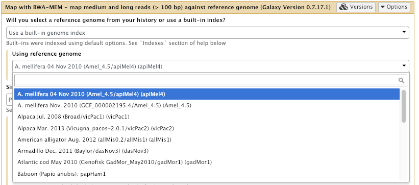

# Overview


Celery is a distributed task queue written in Python that can spawn multiple workers and enables asynchronous task processing on multiple nodes. It supports scheduling, but can be used for real-time operations.

From the Celery website:

> "Task queues are used as a mechanism to distribute work across threads or machines.
>
>A task queue’s input is a unit of work called a task. Dedicated worker processes constantly monitor task queues for new work to perform.
>
>Celery communicates via messages, usually using a broker to mediate between clients and workers. To initiate a task the client adds a message to the queue, the broker then delivers that message to a worker.
>
>A Celery system can consist of multiple workers and brokers, giving way to high availability and horizontal scaling.
>
>Celery is written in Python, but the protocol can be implemented in any language. In addition to Python there’s node-celery and node-celery-ts for Node.js, and a PHP client.
>
>Language interoperability can also be achieved exposing an HTTP endpoint and having a task that requests it (webhooks)."
>
> -- [https://docs.celeryq.dev/en/stable/getting-started/introduction.html#what-s-a-task-queue](https://docs.celeryq.dev/en/stable/getting-started/introduction.html#what-s-a-task-queue)
{: .quote id="celery-quote"}

[A slideshow presentation on this subject is available](slides.html). 

> <agenda-title></agenda-title>
>
> 1. TOC
> {:toc}
>
{: .agenda}



> The agenda we're going to follow today is: We're going to enable and configure celery, install a Redis server, the Flower dashboard and start Celery workers.
{: .spoken data-visual="gtn" data-target="#agenda"}

# Installing and Configuring

To proceed from here it is expected that:

> <comment-title>Requirements for Running This Tutorial</comment-title>
>
> 1. You have set up a working Galaxy instance as described in the [ansible-galaxy](../ansible-galaxy/tutorial.html) tutorial.
>
> 2. You have a working RabbitMQ server installed and added the connection string to the galaxy configuration. (RabbitMQ is installed when doing the [Pulsar](../pulsar/tutorial.html) tutorial.)
>
> 3. Your VM has a public DNS name: this tutorial sets up SSL certificates from the start and as an integral part of the tutorial.
>
> 4. You have the following ports exposed:
>
>    - 22 for SSH, this can be a different port or via VPN or similar.
>    - 80 for HTTP, this needs to be available to the world if you want to follow the LetsEncrypt portion of the tutorial.
>    - 443 for HTTPs, this needs to be available to the world if you want to follow the LetsEncrypt portion of the tutorial.
>    - 5555 for the Flower dashboard
>    - 5671 for AMQP for Pulsar, needed if you plan to setup Pulsar for remote job running.
>    - 6379 for Redis
>
{: .comment}

> Redis is a very popular key-value-store database. It is very fast and a good backend for Celery.
> If you want to learn more about Redis, visit their website: (https://redis.io/)[https://redis.io/]
{: .spoken data-visual="gtn" data-target="#preparations:redis" }

Good news: Celery is already installed in your Galaxy's virtual environment if you followed the last tutorials and completed the Galaxy installation successfully.  
Also RabbitMQ should be up and running after you completed the Pulsar tutorial.
Still we need to add a few things to out Playbooks.
 - Redis is a very popular key-value-store database. It is very fast and a good backend for Celery.
If you want to learn more about Redis, visit their website: [https://redis.io/](https://redis.io/)
Installing Redis with Galaxy-EU's Ansible role is fast and simple, too!
 - Flower is a powerful dashboard for Celery and can be installed in Galaxy's venv using our role.
 - GalaxyEU's [Systemd Ansible Role](https://github.com/usegalaxy-eu/ansible-galaxy-systemd ), which we need to spin up workers automatically and as background processes.


# Installing and Configuring


First we need to add our new Ansible Roles to the `requirements.yml`:

If the terms "Ansible", "role" and "playbook" mean nothing to you, please checkout [the Ansible introduction slides]() and [the Ansible introduction tutorial]()



> Okay, so let's get started. If we go back to our
> tutorial here, it says that we need to install the roles mentioned above into our
> requirements.yml and then add it to our Ansible.
{: .spoken data-visual="gtn" data-target="#hands-on-set-up-redis-flower-systemd-and-celery-with-ansible"}

> <hands-on-title>Set up Redis, Flower, Systemd and Celery with Ansible</hands-on-title>
>
> 1. In your working directory, add the roles to your `requirements.yml`
>
>    
>    ```diff
>    --- a/requirements.yml
>    +++ b/requirements.yml
>    @@ -36,3 +36,9 @@
>       version: 2.1.3
>     - src: galaxyproject.proftpd
>       version: 0.3.1
>    +- name: geerlingguy.redis
>    +  version: 1.8.0
>    +- name: usegalaxy_eu.flower
>    +  version: 1.0.0
>    +- name: usegalaxy_eu.galaxy_systemd
>    +  version: 2.1.0
>    
>    ```
>    {: data-commit="Add requirement" data-ref="add-req"}
>
>    
>
>    > Okay, so the first thing I'm going to do is I'm going to add the Redis, Flower and Systemd
>    > roles to the requirements.yml.
>    > Edit requirements.yml and we need to add this to the bottom of that file. Copy. Paste. And save it.
>    {: .spoken data-visual="terminal" data-ref="add-req"}
>
> 2. Install the role with:
>
>    > <code-in-title>Bash</code-in-title>
>    > ```bash
>    > ansible-galaxy install -p roles -r requirements.yml
>    > ```
>    > {: data-cmd="true" data-ref="req-install"}
>    {: .code-in}
>
>    > And now install the role into our local Ansible scripts using the
>    > ansible-galaxy command. And as you can see, it's downloading the
>    > roles.
>    {: .spoken data-visual="terminal" data-ref="req-install"}
>
>    > And if we look into roles now you can see that we have them.
>    {: .spoken data-visual="terminal" data-cmd="ls roles/"}
>
>    > Right, clear the screen.
>    {: .spoken data-visual="terminal" data-cmd="clear"}
>
> 3. Let's go now through all the Roles step-by-step:
>
>     1. Redis  
>        Since we can stick to the basic default settings, we will look only at a few variables:
>
>        | Variable             | Type          | Description                                                                                                                                                                    |
>        | ----------           | -------       | -------------                                                                                                                                                                  |
>        | `redis_port`         | integer        | The port Redis should listen on. 6379 by default.                               |
>        | `redis_bind_interface`         | string | The interface Redis should listen to. 127.0.0.1 is default.  |
>        | `redis_conf_path`  | string | The path where your redis configuration will be stored. Default: /etc/redis |
>        {: id="redis-variables-table"}
>
>        Luckily we can leave them all on default and don't need to change anything for Redis in the vars.  
>        Let's add the role to our playbook then:
>        
>        ```diff
>        --- a/galaxy.yml
>        +++ b/galaxy.yml
>        @@ -51,6 +51,7 @@
>             - galaxyproject.tusd
>             - galaxyproject.cvmfs
>             - dj-wasabi.telegraf
>        +    - geerlingguy.redis
>           post_tasks:
>             - name: Setup gxadmin cleanup task
>               ansible.builtin.cron:
>        
>        ```
>        {: data-commit="Add requirement" data-ref="add-req"}
>
>     2. RabbitMQ Users  
>        Since Flower needs it's own RabbitMQ user, we should add that to the respective part of our vars
>        Edit your `group_vars/secret.yml` and define some random passwords:
>
>        ><code-in-title>Bash</code-in-title>
>        > ```
>        > ansible-vault edit group_vars/secret.yml
>        > ```
>        {: .code-in}
>    
>        ```yaml
>        vault_rabbitmq_password_flower: "a-really-long-password-here"
>        vault_rabbitmq_password_galaxy: "a-different-really-long-password"
>        vault_flower_user_password: "another-different-really-long-password"
>        ```
>
>        <!-- Ignore this, just for the gat-automation. Vaults are ugly to work with :(
>
>        
>        ```diff
>        --- a/group_vars/secret.yml
>        +++ b/group_vars/secret.yml
>        @@ -1,7 +1,13 @@
>         $ANSIBLE_VAULT;1.1;AES256
>        -32653961383866636531396135663630386630346237333333653633313436663439643535323964
>        -6363626330336430363332643638646262316338313937320a666566306539373462386266383166
>        -30326165393863633463353234613561393939326164376432633732316264636464313061383161
>        -3532373937656138320a616361343664353264613332616236623231326137316635323465623562
>        -66656539346130353639623736633034653932373438663330646436656336666637313933666264
>        -3636313438626533633831323239373461373538646635613637
>        +62346261323266656232393034396134316636376533376139666437363535393562663838613938
>        +6336666266633563346337623265353935646361326337610a393834333233313461346439376438
>        +63383338346530656561636631666134373238366364363164313166346461383736613162653237
>        +3461363334323431370a656132303965653262386130353332623937376261396530393761353834
>        +38336565666437666436643163363831633331333766653266356163613138393734656465323634
>        +39366362383433366437353534663134313330316337393335383962613961386665633261616237
>        +35366635373063313631323939396164336330356361393464326636353037336461323531336434
>        +35613933303333623031353936393265636130363335376533393335663266313863376135383338
>        +36613464373231623938373434306266373234633036343636633963353361356631363533353066
>        +39323064336237646432323530313065303331326636353334343862373330313133326363363063
>        +38383564636161396435666164643334656435393533643163393434623434656238633631633939
>        +33353232666432376661
>        
>        ```
>        {: data-commit="Add rabbitmq passwords to the vault"}
>
>        -->
>
>        This is going in the vault as they are secrets we need to set. Both of our services, Galaxy and Pulsar, need these variables, so we'll need to make sure they're in both playbooks. Both Galaxy in the job configuration, and Pulsar in its configuration.
>
>        Replace both with long random (or not) string.  
>        Now add new users to the RabbitMQ configuration:
>        
>        ```diff
>        --- a/group_vars/galaxyservers.yml
>        +++ b/group_vars/galaxyservers.yml
>        @@ -305,9 +305,16 @@ rabbitmq_users:
>        rabbitmq_vhosts:
>          - /pulsar/galaxy_au
>        + - galaxy
>        @@ .... @@
>             password: "{{ vault_rabbitmq_admin_password }}"
>             tags: administrator
>             vhost: /
>        +  - user: galaxy
>        +    password: "{{ vault_rabbitmq_password_galaxy }}"
>        +    vhost: galaxy
>           - user: galaxy_au
>             password: "{{ vault_rabbitmq_password_vhost }}"
>             vhost: /pulsar/galaxy_au
>        +  - user: flower
>        +    password: "{{ vault_rabbitmq_password_flower }}"
>        +    tags: administrator
>        +    vhost: galaxy
>         
>         # Proftpd:
>         proftpd_galaxy_auth: yes
>        
>        ```
>        {: data-commit="Add requirement" data-ref="add-req"}
>     2. Flower
>        Flower has a few variables, too, for example, we need to point it to our virtual environment:
>
>        | Variable             | Type          | Description                                                                                                                                                                    |
>        | ----------           | -------       | -------------                                                                                                                                                                  |
>        | `flower_python_version`         | string        | Python version to use when installing flower to a venv. Default: python39                               |
>        | `flower_port`         | integer        | The port Flower should listen on. 5555 by default.                               |
>        | `flower_bind_interface`         | string | The interface Flower should listen to. 0.0.0.0 is default.  |
>        | `flower_conf_dir`  | string | The path where your Flower configuration will be stored. Default: /etc/flower |
>        | `flower_venv_dir`  | string | The path to the venv where Flower should be installed. Default: `/home/{{ flower_user }}/.local` |
>        | `flower_user`  | string | User that owns the flower process. Default: galaxy |
>        | `flower_group`  | string | Group that owns the flower process. Default: galaxy |
>        | `flower_ui_users`  | list of dicts | Name and password of the UI users for basic auth. |
>        | `flower_app_dir`  | string | Root directory of your Python app to run with Celery. In our case `galaxy_root` |
>        | `flower_app_name`  | string | Python module to import. In our case 'galaxy.celery' |
>        | `flower_python_path`  | string | Should point to galaxy's `server/lib` directory (default) |
>        | `flower_broker_api`  | string | URL to broker's API with login credentials. |
>        | `flower_broker_url`  | string | Flower's RabbitMQ connection string. |
>        {: id="flower-variables-table"}
>        Let's add variables to our `group_vars/galaxyservers.yml`:
>
>        
>        ```diff
>        --- a/group_vars/galaxyservers.yml
>        +++ b/group_vars/galaxyservers.yml
>        @@ -370,3 +370,20 @@ tusd_instances:
>               - "-upload-dir={{ galaxy_config.galaxy.tus_upload_store }}"
>               - "-hooks-http=https://{{ inventory_hostname }}/api/upload/hooks"
>               - "-hooks-http-forward-headers=X-Api-Key,Cookie"
>        +
>        +# Flower
>        +flower_python_version: python3
>        +flower_app_dir: "{{ galaxy_root }}"
>        +flower_log_file: /var/log/flower
>        +flower_python_path: server/lib
>        +flower_venv_dir: "{{ galaxy_venv_dir }}"
>        +flower_app_name: galaxy.celery
>        +flower_db_file: "{{ galaxy_root }}/var/flower.db"
>        +flower_persistent: true
>        +
>        +flower_broker_api: "https://flower:{{ vault_rabbitmq_password_flower }}@localhost:5671/api/"
>        +flower_broker_url: "amqp://flower:{{ vault_rabbitmq_password_flower }}@localhost:5671/galaxy?ssl=true"
>        +
>        +flower_ui_users:
>        +  - name: admin
>        +    password: "{{ vault_flower_user_password}}"
>        
>        ```
>        {: data-commit="Add requirement" data-ref="add-req"}
>        Now we can add the Flower Role to our Playbook:
>        
>        ```diff
>        --- a/galaxy.yml
>        +++ b/galaxy.yml
>        @@ -52,6 +52,7 @@
>             - galaxyproject.cvmfs
>             - dj-wasabi.telegraf
>             - geerlingguy.redis
>        +    - usegalaxy_eu.flower
>           post_tasks:
>             - name: Setup gxadmin cleanup task
>               ansible.builtin.cron:
>        
>        ```
>        {: data-commit="Add flower role" data-ref="add-req"}
>
> 4. Now it is time to change the `group_vars/galaxyservers.yml` and enable celery in galaxy config.
>    Add the following lines to your file:
>     
>     ```diff
>     --- a/group_vars/galaxyservers.yml
>     +++ b/group_vars/galaxyservers.yml
>     @@ -174,6 +174,11 @@ galaxy_config:
>            preload: true
>          celery:
>            concurrency: 2
>     +      enable_celery_beat: true
>     +      enable: true
>     +      queues: celery,galaxy.internal,galaxy.external
>     +      pool: threads
>     +      memory_limit: 2G
>            loglevel: DEBUG
>          handlers:
>            handler
>     
>     ```
>     {: data-commit="Add celery" data-ref="add-req"}
{: .hands_on}

# Test Celery
Now that everything is running, we want to test celery and watch it processing tasks.
We can simply do that by starting an upload to our Galaxy.

> <hands-on-title>Test Celery and monitor tasks with Flower</hands-on-title>
> 1. First, open a new tab and type `localhost:5555` then log in with `username: admin` and you password.
>    You should see an overview with active workers.  
>    Keep that tab open
> 2. In split view, open a second browser window and open you Galaxy page.
>    Click on Upload Data, select a file from your computer and click `upload`.
> 3. The Workers should now receive a new tasks. Click on `Succeeded` and then on the UUID of the last upload task.  
>    You should see all its details here and the info that is was successful.
>
{: .hands_on}


>    > <tip-title>What is a good size for this?</tip-title>
>    > In production UseGalaxy.org.au uses 100GB, different sites have different needs and you can make your cache smaller depending on your usage. E.g. if your users only use one dataset from the reference data (e.g. just hg38) then perhaps you don't need such a large cache.
>    {: .tip}
>
>    > Okay but instead of just modifying galaxyservers.yml and adding in some
>    > of these variables - instead what we're going to do here is - we're
>    > going to create a new group file called all.yml.
>    >
>    > Because one of the things that we may want to do in the future - is we
>    > may want to create other machines. We might want to have worker nodes
>    > for our Galaxy cluster; or we may want to have other machines that we
>    > want to be able to create using these Ansible scripts that also have the
>    > CVMFS role installed. And instead of reproducing these variables in each
>    > of the group var files for those particular machines, we can create a
>    > special group vars file called all.yml. And whatever we put in there
>    > will be automatically available to all machines that we create with
>    > Ansible from this directory. Hopefully that makes a bit of sense and
>    > we're going to use that a bit later on if you come along to the pulsar
>    > tutorial where we will also be installing CVMFS on another machine - on
>    > a remote machine to run Pulsar.
>    {: .spoken data-visual="terminal" data-cmd="ls group_vars/"}
>
>    Add the following lines to your `group_vars/all.yml` file, creating it if it doesn't exist:
>
>    
>    ```diff
>    --- /dev/null
>    +++ b/group_vars/all.yml
>    @@ -0,0 +1,4 @@
>    +# CVMFS vars
>    +cvmfs_role: client
>    +galaxy_cvmfs_repos_enabled: config-repo
>    +cvmfs_quota_limit: 500
>    
>    ```
>    {: data-commit="Configure CVMFS variables" data-ref="vars-all"}
>
>    > So what we're going to do, is we're going to create a new file called
>    > groupvars/all.yml and we're going to put some of these CVMFS variables
>    > inside it. So i'll just copy that. Okay, groupvars all dot yaml. And
>    > I'll paste this in. So basically the CVMFS role we want this machine to
>    > have is client. Which means that we just want it to be able to access
>    > all of our CVMFS reference data. And then we want we're going to set
>    > this one here to say that, "yes we want to set this up for Galaxy." And
>    > the config repo is the one that tells CVMFS how to set everything else
>    > up. And then this is the other important one - the CVMFS quota limit.
>    > We're setting to 500 megabytes and that's just so we don't fill the root
>    > disk of these machines. So I'll save that.
>    {: .spoken data-visual="terminal" data-ref="vars-all"}
>
>    > <tip-title>Why all.yml?</tip-title>
>    > We've integrated the cvmfs and pulsar tutorials better, such that CVMFS will be used for Pulsar as well, this configuration will be needed on all of our machines. This mirrors real life where you want CVMFS on every node that does computation.
>    {: .tip}
>
> 4. Add the new role to the list of roles under the `roles` key in your playbook, `galaxy.yml`:
>
>    
>    ```diff
>    --- a/galaxy.yml
>    +++ b/galaxy.yml
>    @@ -20,3 +20,4 @@
>           become_user: "{{ galaxy_user.name }}"
>         - galaxyproject.nginx
>         - galaxyproject.tusd
>    +    - galaxyproject.cvmfs
>    
>    ```
>    {: data-commit="Add role to playbook" data-ref="pb"}
>
>    > And now we need to add the role - we need to add the role to our Galaxy
>    > playbook. So we edit galaxy.yml which is our playbook and we just need to
>    > add the galaxyproject.cvmfs to the bottom of this. galaxyproject.cvmfs.
>    > And that's pretty much it.
>    {: .spoken data-visual="terminal" data-ref="pb"}
>
> 5. Run the playbook
>
>    > <code-in-title>Bash</code-in-title>
>    > ```bash
>    > ansible-playbook galaxy.yml
>    > ```
>    > {: data-cmd="true" data-ref="run-pb1"}
>    {: .code-in }
{: .hands_on}

> Okay now we just run the playbook. ansible-playbook. We want to run the
> Galaxy one. So. All right, we're about to get to the CVMFS repo here. We are
> now it's installing the um the apt package of CVMFS. It's going to get
> that out of this special um Cern apt repository. Okay, it's installing
> it. Hopefully it won't take too long. Okay, now setting up the
> repositories. And it's done.
{: .spoken data-visual="terminal" data-ref="run-pb1"}

Congratulations, you've set up CVMFS.

## Exploring the CVMFS Installation


> Okay, that was completed. We've now installed CVMFS client onto our machine
> and we've told it to go looking for certain repositories. Now to get access
> to them. We'll see what's in them. uh They'll be located at slash cvmfs. So
> under the cvmfs directory in your root directory. So, we can go to that. cd
> /
{: .spoken data-visual="terminal" data-cmd="cd /"}

> Do an ll. You can see here there's a directory here called cvmfs.
{: .spoken data-visual="terminal" data-cmd="ls -al"}

>  So we'll go in there and have a look and see what's in there.
{: .spoken data-visual="terminal" data-cmd="cd /cvmfs"}

> So let's have a look. Oh there's nothing in there!
> Well actually, what what's going to happen is; as soon as we go looking for
> something in this directory, so autofs will automatically mount the
> particular thing we're looking for. And so what we're going to do here is I'm
> going to go: cd data.galaxyproject.org, because I know that's one of the one
> of the repositories that should have been installed.
{: .spoken data-visual="terminal" data-cmd="ls -al"}

> And when I do that, autofs is automatically going to mount it for me on the
> fly. Like that.
{: .spoken data-visual="terminal" data-cmd="cd data.galaxyproject.org"}

> And now I've cd'd into it and if I do an ll, you can see here I've got some
> things in here now. I've got byhand and managed.
{: .spoken data-visual="terminal" data-cmd="ls -al"}

>  If I go into byhand you can see here that I have quite a lot of different
>  genomes and their tool indices.
{: .spoken data-visual="terminal" data-cmd="cd byhand; ls"}

> So if I'm going to, say, sacCer2, I can see in here there are bowtie index,
> the bwa index, the uh the picard index, the sam index; a whole bunch of
> other different things - including the original sequences etc. So yeah,
> quite a lot of data and we just have access to that on the fly. And then as
> soon as we try and look at any of these files, what will happen is CVMFS
> will automatically cache it to the local disk within within that 500
> megabyte cache that we uh we set up earlier. This is really cool. And we can
> tell Galaxy to look at all of this data and use it as its reference data.
{: .spoken data-visual="terminal" data-cmd="ls -al sacCer2/"}

> <hands-on-title>Exploring CVMFS</hands-on-title>
>
> 1. SSH into your machine
>
> 2. Change directory into `/cvmfs/` and list the files in that folder
>
>    > <question-title></question-title>
>    >
>    > What do you see?
>    >
>    > > <solution-title></solution-title>
>    > > You should see nothing, as CVMFS uses `autofs` in order to mount paths only upon request.
>    > >
>    > {: .solution }
>    >
>    {: .question}
>
>
> 3. Change directory into `/cvmfs/data.galaxyproject.org/`.
>
>    > <code-in-title>Bash</code-in-title>
>    > ```
>    > cd /cvmfs/data.galaxyproject.org/
>    > ls
>    > ls byhand
>    > ls managed
>    > ```
>    {: .code-in}
>
>    > <question-title></question-title>
>    >
>    > What do you see now?
>    >
>    > > <solution-title></solution-title>
>    > >  You'll see `.loc` files, genomes and indices.
>    > > AutoFS only mounts the files when they're accessed, so it appears like there is no folder there.
>    > {: .solution }
>    >
>    {: .question}
>
>    And just like that we all have access to all the reference genomes and associated tool indices thanks to the Galaxy Project, IDC, and Nate's hard work!
>
{: .hands_on}

## Configuring Galaxy to use the CVMFS references.

Now that we have mounted the CVMFS repository we need to tell Galaxy how to find it and use it.

There are two primary directories in the reference data repository:

| Directory   | Contents                                                                                                                                                                  |
| ----------- | ----------                                                                                                                                                                |
| `/managed`  | Data generated with Galaxy Data Managers, organized by data table (index format), then by genome build.                                                                   |
| `/byhand`   | Data generated prior to the existence/use of Data Managers, manually curated. (For legacy reasons, this directory is shared as `/indexes` on the HTTP and rsync servers.) |

These directories have somewhat different structures:

* `/managed` is organized by index type, then by genome build (Galaxy dbkey)
* `/byhand` is organzied by genome build, then by index type

Both directories contain a location subdirectory, and each of these contain a `tool_data_table_conf.xml` file:

* `/managed/location/tool_data_table_conf.xml`
* `/byhand/location/tool_data_table_conf.xml`

Galaxy consumes these `tool_data_table_conf.xml` files and the `.loc` "location" files they reference. The paths contained in these files are valid if the data is mounted via CVMFS.

Examples of data include:

* twoBit (`.2bit`) and FASTA (`.fa`) sequence files
* Bowtie 2 and BWA indexes
* Multiple Alignment Format (`.maf`) files
* SAMTools FASTA indexes (`.fai`)

Now all we need to do is tell Galaxy how to find it! This tutorial assumes that you have run the tutorial in the requirements, [Galaxy Installation with Ansible](). The hands-on below will use the Galaxy Project Ansible role to configure everything.
{: id="spoken-7"}

> So that's what we're going to do now. Okay. So now we're going to try and
> configure Galaxy to use this CVMFS data. And and to have it so that we can run
> things like bwa and bwa mem and run them against the human genome or the bee
> genome or the mouse genome and take advantage of the fact that a lot of other
> people in the Galaxy community have done a lot of work for reference data for
> us already.
>
> So the way to do this is we're going to edit the groupvars galaxyservers
> file and we're going to add a variable called tool_data_table_config_path.
> And then we're going to point it to the two files that are in - there's one
> in byhand and one in managed.
{: .spoken  data-visual="gtn" data-target="#spoken-7"}


> If we go into byhand you can see here. And then we're going to location. As
> you can see in here, are all the lock files, but you'll also see there's an
> xml file here called tool_data_table_conf xml and we're going to point Galaxy
> at this file and there's another one in the same position in managed.
{: .spoken data-visual="terminal" data-cmd="cd /cvmfs/data.galaxyproject.org/byhand;  ls location;"}

> And you can see here there's another one in managed there. And so we're going to
> add both of these files to our Galaxy configuration and then Galaxy will be
> able to use all of the data contained within this repository.
{: .spoken data-visual="terminal" data-cmd="cd ../; ls managed/location"}

> Okay, so we'll go back to our Ansible directory.
{: .spoken data-visual="terminal" data-cmd="cd ~/galaxy/"}

> <hands-on-title>Configuring Galaxy to use CVMFS</hands-on-title>
>
> 1. Edit the `group_vars/galaxyservers.yml` file and add a `tool_data_table_config_path` entry under the `galaxy` key of the `galaxy_config` section in the `group_vars/galaxyservers.yml` file. This new entry should be a list containing the paths to both `tool_data_table_conf.xml` files referenced above.
>
>    
>    ```diff
>    --- a/group_vars/galaxyservers.yml
>    +++ b/group_vars/galaxyservers.yml
>    @@ -29,6 +29,7 @@ miniconda_manage_dependencies: false
>     
>     galaxy_config:
>       galaxy:
>    +    tool_data_table_config_path: /cvmfs/data.galaxyproject.org/byhand/location/tool_data_table_conf.xml,/cvmfs/data.galaxyproject.org/managed/location/tool_data_table_conf.xml
>         brand: "🧬🔬🚀"
>         admin_users: admin@example.org
>         database_connection: "postgresql:///galaxy?host=/var/run/postgresql"
>    
>    ```
>    {: data-commit="Add tool_data_table_config_path to group variables" data-ref="gvconf"}
>
>    > This time I'm going to edit the groupvars galaxyservers.yml file. And in
>    > our Galaxy section. Which is here. Which is here. At the bottom of that
>    > I'm going to add a variable called tool_data_table_config_path. And I'm
>    > going to point it to the locations that we um I showed you before. um I
>    > can't remember what they are off the top of my head but luckily they're
>    > inside this solution box and so I will just copy them. And paste. And as
>    > you can see pointing to /cvmfs/data.galaxyproject.org/byhand/location
>    > and then that tool data table conf xml file. And then we have a list
>    > here and we separate it by commas and then we point it to the second
>    > one. Right, so we save this file.
>    {: .spoken data-visual="terminal" data-ref="gvconf"}
>
> 2. Re-run the playbook
>
>    > <code-in-title>Bash</code-in-title>
>    > ```bash
>    > ansible-playbook galaxy.yml
>    > ```
>    > {: data-cmd="true" data-ref="pb-run2"}
>    {: .code-in }
>
>    > So this time what we're going to do, all we're doing is making a minor change
>    > to the Galaxy yaml file in the Galaxy config to add that one line and then
>    > we're going to restart Galaxy. And yeah, Galaxy will suddenly automatically
>    > have access to all of that data. So you can see here we've changed the Galaxy
>    > configuration file. And then Galaxy is now restarting and it's done.
>    {: .spoken data-visual="terminal" data-ref="pb-run2"}
>
> 3. Install the BWA-MEM tool, if needed.
>
>    
>
> 4. In your Galaxy server, open the **Map with BWA-MEM**  tool. Now check that there are a lot more reference genomes available for use!
>
>    
>
> 5. Login to Galaxy as the admin user, and go to **Admin → Data Tables → bwa_mem indexes**
>
>    
>
{: .hands_on}

> Okay let's go and have a look at our Galaxy server and see if bwa can
> suddenly see all of those - that stuff. All right so we're back on our Galaxy
> server. I'll click on Analyze Data to just to reload the page.
{: .spoken data-visual="galaxy" data-target="#analysis a" data-action="click"}

> I'll go back to Mapping
{: .spoken data-visual="galaxy" data-target=".search-input input" data-action="click"}

>  and load bwa-mem.
{: .spoken data-visual="galaxy" data-target=".search-input input" data-action="fill" data-value="bwa-mem"}

> And then suddenly, instead of
> having no options available, you can see here we've got the Bee genome.
{: .spoken data-visual="galaxy" data-target="/?tool_id=bwa_mem" data-action="goto"}

>  Now click on that. Oh look at that, there are lots and lots and lots of
>  available genomes now including: lots of human, mouse, rat, yeast, all sorts
>  of things. And in fact if you want to see the list of all the different
>  available genomes now, that we have available to us.
>
>  If you go to admin. We go to data tables over here. You can see here that we
>  have um a couple of data tables for managed and for all fasta. So if we
>  click on that one, you can see that we have a lot of genomes available now
>  in the all fasta data table that Galaxy can get access to. If we go back to
>  the data tables again, and go down to bwa indexes or bwa mem indexes here.
>  You can see we have access to a lot of pre-built indexes for bwa for all of
>  these different genomes. That is pretty powerful.
>
>  So what did that take us? Maybe 30 minutes? And uh suddenly our Galaxy
>  server has access to all the uh the data the reference data and the tool
>  indices that the community have built over a number of years and it's super
>  simple.
{: .spoken data-visual="galaxy" data-target="s2id_field-uid-12_select a" data-action="click"}

> ```bash
> 1.sh
> ```
> {: data-test="true"}
{: .hidden}



# Common Production Questions

> <question-title>For the most used datasets (for ex. hg38) could we have a local copy, or would that be irrelevant?</question-title>
> This would be irrelevant, the most used datasets will stay in the cache. CVMFS uses a Least Recently Used (LRU) cache (see their [docs](https://cvmfs.readthedocs.io/en/latest/cpt-details.html#disk-cache)), so whenever it runs out of space, it will remove the least recently used file. If you have a file that is very commonly used, it will remain in the cache.
{: .question}

> <question-title>Could you explain how to calculate a good cache space?</question-title>
> Here are two approaches, there are others:
> 1. Allocate some cache, see how it is, make it larger if it is fully used + users complain of speed.
> 2. Enable reference data, and collect a week or two of data, analyse which reference datasets are being used, and allocate enough space for all of them.
>
> Essentially you just need data on how your users will behave and what reference data they want, combined with "when will they accept a wait period" to determine how much space you must allocate.
{: .question}

> <question-title>If I use a cluster, will I need to configure this FS in each node (given that the folder is at / directly)?</question-title>
> Yes. Often admins with a cluster keep a smaller cache local to each compute node, and then setup a Squid proxy to hold the most commonly accessed data on a machine with more storage. E.g. each compute node could have 10-50GB of CVMFS storage while you might setup a Squid proxy with 200-300 GB of storage that will store everything your site uses.
{: .question}

> <tip-title>Debugging failed mounting</tip-title>
>
> Are you having issues mounting your CVMFS mount? Is it giving strange errors like "Endpoint not connected"
> Try running this command as root:
>
> > > <code-in-title>Bash</code-in-title>
> > > ```console
> > > /usr/bin/cvmfs2 -d -o rw,system_mount,fsname=cvmfs2,allow_other,grab_mountpoint singularity.galaxyproject.org /mnt
> > > ```
> > {: .code-in}
> >
> > > <code-out-title>Consolue</code-out-title>
> > > ```console
> > > Debug: using library /usr/lib/libcvmfs_fuse3_stub.so
> > > CernVM-FS: running in debug mode
> > > CernVM-FS: loading Fuse module... (cvmfs) Parsing config file /etc/cvmfs/default.conf    [07-21-2022 11:11:20 UTC]
> > > (cvmfs) execve'd /bin/sh (PID: 280373)    [07-21-2022 11:11:20 UTC]
> > > (cvmfs) Parsing config file /etc/cvmfs/default.d/50-cern-debian.conf    [07-21-2022 11:11:20 UTC]
> > > (cvmfs) execve'd /bin/sh (PID: 280375)    [07-21-2022 11:11:20 UTC]
> > > (cvmfs) Parsing config file /etc/cvmfs/default.d/80-ansible-galaxyproject-cvmfs.conf    [07-21-2022 11:11:20 UTC]
> > > (cvmfs) execve'd /bin/sh (PID: 280378)    [07-21-2022 11:11:20 UTC]
> > > [...]
> > > (dns) empty hostname    [07-21-2022 11:11:20 UTC]
> > > (download) installed 1 proxies in 1 load-balance groups    [07-21-2022 11:11:20 UTC]
> > > (cvmfs) DNS roaming is disabled for this repository.    [07-21-2022 11:11:20 UTC]
> > > (catalog) constructing client catalog manager    [07-21-2022 11:11:20 UTC]
> > > (catalog) Initialize catalog    [07-21-2022 11:11:20 UTC]
> > > (cache) unable to read local checksum    [07-21-2022 11:11:20 UTC]
> > > (download) escaped http://cvmfs1-psu0.galaxyproject.org/cvmfs/singularity.galaxyproject.org/.cvmfspublished to http://cvmfs1-psu0.galaxyproject.org/cvmfs/singularity.galaxyproject.org/.cvmfspublished    [07-21-2022 11:11:20 UTC]
> > > (download) Verify downloaded url /.cvmfspublished, proxy DIRECT (curl error 0)    [07-21-2022 11:11:20 UTC]
> > > (cache) miss ./e2/ab48b0984729d99951cb62c4312f501b3ddc6b (-2)    [07-21-2022 11:11:20 UTC]
> > > (download) escaped http://cvmfs1-psu0.galaxyproject.org/cvmfs/singularity.galaxyproject.org/data/e2/ab48b0984729d99951cb62c4312f501b3ddc6bX to http://cvmfs1-psu0.galaxyproject.org/cvmfs/singularity.galaxyproject.org/data/e2/ab48b0984729d99951cb62c4312f501b3ddc6bX    [07-21-2022 11:11:20 UTC]
> > > (download) Verify downloaded url /data/e2/ab48b0984729d99951cb62c4312f501b3ddc6bX, proxy DIRECT (curl error 0)    [07-21-2022 11:11:20 UTC]
> > > (download) escaped http://cvmfs1-psu0.galaxyproject.org/cvmfs/singularity.galaxyproject.org/.cvmfswhitelist to http://cvmfs1-psu0.galaxyproject.org/cvmfs/singularity.galaxyproject.org/.cvmfswhitelist    [07-21-2022 11:11:20 UTC]
> > > [...]
> > > (download) escaped http://cvmfs1-psu0.galaxyproject.org/cvmfs/singularity.galaxyproject.org/data/c7/f1555f421b1868b979291dc23f34a83132eadbC to http://cvmfs1-psu0.galaxyproject.org/cvmfs/singularity.galaxyproject.org/data/c7/f1555f421b1868b979291dc23f34a83132eadbC    [07-21-2022 11:11:20 UTC]
> > > (download) Verify downloaded url /data/c7/f1555f421b1868b979291dc23f34a83132eadbC, proxy DIRECT (curl error 0)    [07-21-2022 11:11:25 UTC]
> > > (cache) finished downloading of /data/c7/f1555f421b1868b979291dc23f34a83132eadbC    [07-21-2022 11:11:25 UTC]
> > > (cache) commit ./c7/f1555f421b1868b979291dc23f34a83132eadb ./txn/fetchJWcwtt    [07-21-2022 11:11:25 UTC]
> > > (quota) pin into lru c7f1555f421b1868b979291dc23f34a83132eadb, path file catalog at singularity.galaxyproject.org:/ (c7f1555f421b1868b979291dc23f34a83132eadb)    [07-21-2022 11:11:25 UTC]
> > > (cache) commit failed: cannot pin c7f1555f421b1868b979291dc23f34a83132eadb    [07-21-2022 11:11:25 UTC]
> > > (catalog) failed to load catalog '' (2 - not enough space to load catalog)    [07-21-2022 11:11:25 UTC]
> > > (catalog) failed to initialize root catalog    [07-21-2022 11:11:25 UTC]
> > > Failed to initialize root file catalog (16 - file catalog failure)
> > > (cache) unpinning / unloading all catalogs    [07-21-2022 11:11:25 UTC]
> > > ```
> > {: .code-out}
> {: .code-2col}
{: .tip}

# Other Aspects

> Right, we'll go back to our tutorial. um Yeah. Just finally, just before we
> finish up. um If we are developing a new tool and you want to add a reference
> genome or a different index just give us - drop us a line on Gitter and we'll
> be able to add it into our - into the reference data for the community. um
> We're looking at automating the process of building all of this material
> using data managers and ephemeris. And we're working with a group of people
> called the IDC, which is the Intergalactic Data Commission, which is a funny
> name for everyone in Galaxy - in the Galaxy community who likes reference
> data. And we're looking at making a community controlled resource that will
> be semi-automatic. One of the other things that you can do is have automatic
> fallbacks. So, if say, you're in Australia and you're hooked up to the
> Australian mirror of the CVMFS repository and the Australian mirror dies, the
> CVMFS client is smart enough to automatically go to the next closest one and
> so you won't lose anything. If you're interested in looking at plant data
> there's a link here for that.
{: .spoken data-visual="gtn" data-target="#other-aspects" }

## Development

If you are developing a new tool, and want to add a reference genome, we recommend you [talk to us on Gitter](https://gitter.im/galaxy-iuc/iuc). You can also look at one of the tools that uses reference data, and try and copy from that. If you’re developing the location files completely new, you need to write the data manager.

## Automation

You can automate the process of installing and setting up data managers and data with ephemeris. We're working in the [IDC](https://github.com/galaxyproject/idc) to democratise this CVMFS repository, and make this a community-controlled resource. You can also look here for ideas on automating your data management.

## Access Control

It is not easily possible to filter access to reference data depending on the user's role or group.

You could set up a tool per user/group, [secure access to running this tool](https://galaxyproject.org/admin/config/access-control/), and then allow this private tool to access a private tool data table. But you will not get tool updates, you will have to copy and edit this tool every time it gets updated. Or write more advanced job control rules to reject specific jobs which use specific datasets.

## Proxying Recap

The client talks directly to the stratum 1 (or to a proxy), and manages the data, and exposes it to the user. The proxy stores an opaque cache, that can't really be used, except as a proxy to a stratum 1.

## Plant Data

If you are working with plants, you can find separate reference data here: [frederikcoppens/galaxy_data_management](https://github.com/frederikcoppens/galaxy_data_management)

> And finally if you could please click on this link here and give us some
> feedback on how you think the tutorial went, whether it was useful, if you
> enjoyed it or um if you have any criticisms, could you please put them in
> here as well. And if you end up using this to build a Galaxy server and you
> publish that Galaxy server um could you cite the tutorial for us please. That
> would be make a big difference to us. All right, thank you very much and I
> hope you enjoyed it and hopefully I'll get to meet some of you in person one
> day soon at a Galaxy conference. Thank you and goodbye.
{: .spoken data-visual="gtn" data-target="#feedback"}
