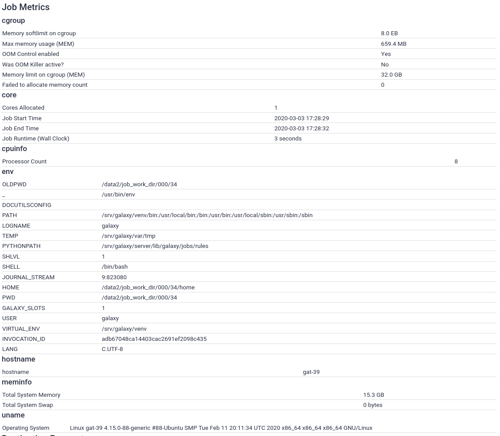

The tools that are added to Galaxy can have a wide variance in the compute resources that they require and work efficiently on.
To account for this, Galaxy's job configuration needs to be tuned to run these tools properly. In addition, site-specific variables must
be taken into consideration when choosing where to run jobs and what parameters to run them with.



> <agenda-title></agenda-title>
>
> 1. TOC
> {:toc}
>
{: .agenda}



## Installing Slurm

> <comment-title>Ansible Best Practices</comment-title>
> If you've set up your Galaxy server using the [Galaxy Installation with Ansible]() tutorial, you will have created a `galaxyservers` group in your inventory file, `hosts`, and placed your variables in `group_vars/galaxyservers.yml`. Although for the purposes of this tutorial, the Galaxy server and Slurm controller/node are one and the same, in a real world deployment they are very likely to be different hosts. We will continue to use the `galaxyservers` group for simplicity, but in your own deployment you should consider creating some additional groups for Slurm controller(s), Slurm nodes, and Slurm clients.
{: .comment}

> <tip-title>Do you need a DRM?</tip-title>
> If you have a smaller server, do you still need a DRM? Yes! You should definitely run Slurm or a similar option. If you don't, as soon as you restart Galaxy with local runners, any running jobs will be killed. Even with a handful of users, it is a good idea to keep 1-2 CPU cores/4GB RAM reserved for Galaxy.
{: .tip}

> <hands-on-title>Installing Slurm</hands-on-title>
>
> 1. Edit your `requirements.yml` and include the following contents:
>
>    
>    ```diff
>    --- a/requirements.yml
>    +++ b/requirements.yml
>    @@ -20,3 +20,7 @@
>       version: 048c4f178077d05c1e67ae8d9893809aac9ab3b7
>     - src: gantsign.golang
>       version: 2.6.3
>    +- src: galaxyproject.repos
>    +  version: 0.0.2
>    +- src: galaxyproject.slurm
>    +  version: 0.1.3
>    
>    ```
>    {: data-commit="Add requirements"}
>
>    
>
>    The `galaxyproject.repos` role adds the [Galaxy Packages for Enterprise Linux (GPEL)](https://depot.galaxyproject.org/yum/) repository for RedHat/CentOS, which provides both Slurm and Slurm-DRMAA (neither are available in standard repositories or EPEL). For Ubuntu versions 18.04 or newer, it adds the [Slurm-DRMAA PPA](https://launchpad.net/~natefoo/+archive/ubuntu/slurm-drmaa) (Slurm-DRMAA was removed from Debian/Ubuntu in buster/bionic).
>
> 2. In the same directory, run:
>
>    > <code-in-title>Bash</code-in-title>
>    > ```bash
>    > ansible-galaxy install -p roles -r requirements.yml
>    > ```
>    > {: data-cmd="true"}
>    {: .code-in}
>
> 3. Add `galaxyproject.repos`, `galaxyproject.slurm` to the *beginning* of your roles section in your `galaxy.yml` playbook:
>
>    
>    ```diff
>    --- a/galaxy.yml
>    +++ b/galaxy.yml
>    @@ -12,6 +12,8 @@
>             repo: 'https://github.com/usegalaxy-eu/libraries-training-repo'
>             dest: /libraries/
>       roles:
>    +    - galaxyproject.repos
>    +    - galaxyproject.slurm
>         - galaxyproject.postgresql
>         - role: galaxyproject.postgresql_objects
>           become: true
>    
>    ```
>    {: data-commit="Add the repos and slurm roles"}
>
> 4. Add the slurm variables to your `group_vars/galaxyservers.yml`:
>
>    
>    ```diff
>    --- a/group_vars/galaxyservers.yml
>    +++ b/group_vars/galaxyservers.yml
>    @@ -157,6 +157,16 @@ golang_gopath: '/opt/workspace-go'
>     singularity_version: "3.7.4"
>     singularity_go_path: "{{ golang_install_dir }}"
>     
>    +# Slurm
>    +slurm_roles: ['controller', 'exec'] # Which roles should the machine play? exec are execution hosts.
>    +slurm_nodes:
>    +- name: localhost # Name of our host
>    +  CPUs: 2         # Here you would need to figure out how many cores your machine has. For this training we will use 2 but in real life, look at `htop` or similar.
>    +slurm_config:
>    +  SlurmdParameters: config_overrides   # Ignore errors if the host actually has cores != 2
>    +  SelectType: select/cons_res
>    +  SelectTypeParameters: CR_CPU_Memory  # Allocate individual cores/memory instead of entire node
>    +
>     # TUS
>     galaxy_tusd_port: 1080
>     tusd_instances:
>    
>    ```
>    {: data-commit="Add slurm configuration"}
>
> 5. Run the playbook
>
>    > <code-in-title>Bash</code-in-title>
>    > ```bash
>    > ansible-playbook galaxy.yml
>    > ```
>    > {: data-cmd="true"}
>    {: .code-in}
>
{: .hands_on}

Note that the above Slurm config options are only those that are useful for this training exercise. In production, you would want to use a more appropriate configuration specific to your cluster (and setting `SlurmdParameters` to `config_overrides` is not recommended).

Installed with Slurm is MUNGE (MUNGE Uid 'N Gid Emporium...) which authenticates users between cluster hosts. You would normally need to ensure the same Munge key is distributed across all cluster hosts (in `/etc/munge/munge.key`) - A great task for Ansible. However, the installation of the munge package has created a random key for you, and you will not need to distribute this since you'll run jobs only on a single host.

You can now check that all of the daemons are running with the command `systemctl status munge slurmd slurmctld`

```console
$ sudo systemctl status munge slurmd slurmctld
● munge.service - MUNGE authentication service
  Loaded: loaded (/usr/lib/systemd/system/munge.service; enabled; vendor preset: disabled)
   Active: active (running) since Sa 2019-01-26 22:38:13 CET; 28min ago
     Docs: man:munged(8)
 Main PID: 22930 (munged)
    Tasks: 4
   Memory: 128.0K
   CGroup: /system.slice/munge.service
           └─22930 /usr/sbin/munged

Jan 26 22:38:13 helena-test.novalocal systemd[1]: Starting MUNGE authentication service...
Jan 26 22:38:13 helena-test.novalocal systemd[1]: Started MUNGE authentication service.

● slurmd.service - Slurm node daemon
   Loaded: loaded (/usr/lib/systemd/system/slurmd.service; enabled; vendor preset: disabled)
   Active: active (running) since Sa 2019-01-26 23:04:21 CET; 2min 25s ago
  Process: 15051 ExecStart=/usr/sbin/slurmd $SLURMD_OPTIONS (code=exited, status=0/SUCCESS)
 Main PID: 15054 (slurmd)
    Tasks: 1
   Memory: 628.0K
   CGroup: /system.slice/slurmd.service
           └─15054 /usr/sbin/slurmd

Jan 26 23:04:21 helena-test.novalocal systemd[1]: Starting Slurm node daemon...
Jan 26 23:04:21 helena-test.novalocal systemd[1]: PID file /var/run/slurmd.pid not readable (yet?) after start.
Jan 26 23:04:21 helena-test.novalocal systemd[1]: Started Slurm node daemon.

● slurmctld.service - Slurm controller daemon
   Loaded: loaded (/usr/lib/systemd/system/slurmctld.service; enabled; vendor preset: disabled)
   Active: active (running) since Sa 2019-01-26 23:04:20 CET; 2min 26s ago
  Process: 15040 ExecStart=/usr/sbin/slurmctld $SLURMCTLD_OPTIONS (code=exited, status=0/SUCCESS)
 Main PID: 15042 (slurmctld)
    Tasks: 7
   Memory: 1.1M
   CGroup: /system.slice/slurmctld.service
           └─15042 /usr/sbin/slurmctld

Jan 26 23:04:20 helena-test.novalocal systemd[1]: Starting Slurm controller daemon...
Jan 26 23:04:20 helena-test.novalocal systemd[1]: PID file /var/run/slurmctld.pid not readable (yet?) after start.
Jan 26 23:04:20 helena-test.novalocal systemd[1]: Started Slurm controller daemon.
```

Running the playbook, the Slurm configuration, `/etc/slurm/slurm.conf` (or `/etc/slurm-llnl/slurm.conf` on Debian-based distributions) was created for you automatically. All of the variables were set by default. If you need to override the configuration yourself, Slurm provides [an online tool](https://slurm.schedmd.com/configurator.html) which will help you configure it.

## Using Slurm

You should now be able to see that your Slurm cluster is operational with the `sinfo` command. This shows the state of nodes and partitions (synonymous with queues in other DRMs). The "node-oriented view" provided with the `-N` flag is particularly useful:

```console
$ sinfo
PARTITION AVAIL  TIMELIMIT  NODES  STATE NODELIST
debug*       up   infinite      1   idle localhost
$ sinfo -Nel
Fri Nov  4 16:51:24 2016
NODELIST   NODES PARTITION       STATE CPUS    S:C:T MEMORY TMP_DISK WEIGHT FEATURES REASON
localhost      1    debug*        idle    1    2:1:1      1        0      1   (null) none
```

If your node state is not `idle`, something has gone wrong. If your node state ends with an asterisk \*, the Slurm controller is attempting to contact the Slurm execution daemon but has not yet been successful (the \* next to the partition name is normal, it indicates the default partition).

We want to ensure that Slurm is actually able to run jobs. There are two ways this can be done:

- `srun`: Run an interactive job (e.g. a shell, or a specific program with its stdin, stdout, and stderr all connected to your terminal.
- `sbatch`: Run a batch job, with stdin closed and stdout/stderr redirected to a file.

Galaxy runs `sbatch` jobs but we can use both `srun` and `sbatch` to test:


> <hands-on-title>Running commands with `srun`</hands-on-title>
>
> 1. Use [`srun`](https://slurm.schedmd.com/srun.html) to run the command `uname -a`
>
>    > <code-in-title>Bash</code-in-title>
>    > ```
>    > srun uname -a
>    > ```
>    {: .code-in}
>
>    > <code-out-title></code-out-title>
>    > Your output may look slightly different:
>    > ```console
>    > $ srun uname -a
>    > Linux gat-1.oz.training.galaxyproject.eu 5.4.0-48-generic #52-Ubuntu SMP Thu Sep 10 10:58:49 UTC 2020 x86_64 x86_64 x86_64 GNU/Linux
>    > ```
>    {: .code-out}
>
{: .hands_on}

Although it looks like this command ran as if I had not used `srun`, it was in fact routed through Slurm.

> <hands-on-title>Running commands with `sbatch`</hands-on-title>
>
> 1. Create a test job script somewhere, such as in `~/sbatch-test.sh`. It should be a batch script which runs `uname -a`, `uptime`, and sleeps for 30 seconds.
>
>    > <question-title></question-title>
>    >
>    > What does your shell script look like?
>    >
>    > > <solution-title></solution-title>
>    > > ```bash
>    > > #!/bin/bash
>    > > uname -a
>    > > uptime
>    > > sleep 30
>    > > ```
>    > {: .solution }
>    {: .question}
>
> 2. Make the script executable:
>
>    > <code-in-title>Bash</code-in-title>
>    > ```
>    > chmod +x ~/sbatch-test.sh
>    > ```
>    {: .code-in}
>
> 3. Use [`sbatch`](https://slurm.schedmd.com/sbatch.html) to submit the job script
>
>    > <question-title></question-title>
>    >
>    > What command did you run?
>    >
>    > > <solution-title></solution-title>
>    > > ```console
>    > > $ sbatch ~/sbatch-test.sh
>    > > ```
>    > {: .solution }
>    {: .question}
>
> 4. Use [`squeue`](https://slurm.schedmd.com/squeue.html) to check the queue
>
>    > <code-in-title>Bash</code-in-title>
>    > ```
>    > squeue
>    > ```
>    {: .code-in}
>
>    > <code-out-title></code-out-title>
>    > Your output may look slightly different:
>    > ```console
>    >JOBID PARTITION     NAME     USER ST       TIME  NODES NODELIST(REASON)
>    >    3     debug sbatch-t   ubuntu  R       0:22      1 localhost
>    > ```
>    {: .code-out}
>
{: .hands_on}

If you've made it this far, your Slurm installation is working!

## Slurm-DRMAA

Above Slurm in the stack is slurm-drmaa, a library that provides a translational interface from the Slurm API to the generalized DRMAA API in C.

> <hands-on-title>Installing Slurm-DRMAA</hands-on-title>
>
> 1. Add a `post_task` to your playbook to install `slurm-drmaa1` (Debian/Ubuntu) or `slurm-drmaa` (RedHat/CentOS).
>
>    
>    ```diff
>    --- a/galaxy.yml
>    +++ b/galaxy.yml
>    @@ -11,6 +11,10 @@
>         - git:
>             repo: 'https://github.com/usegalaxy-eu/libraries-training-repo'
>             dest: /libraries/
>    +  post_tasks:
>    +    - name: Install slurm-drmaa
>    +      package:
>    +        name: slurm-drmaa1
>       roles:
>         - galaxyproject.repos
>         - galaxyproject.slurm
>    
>    ```
>    {: data-commit="Add post task to install slurm-drmaa"}
>
> 2. Run the playbook (`ansible-playbook galaxy.yml`)
>
>    > <code-in-title>Bash</code-in-title>
>    > ```bash
>    > ansible-playbook galaxy.yml
>    > ```
>    > {: data-cmd="true"}
>    {: .code-in}
>
{: .hands_on}

Moving one level further up the stack, we find DRMAA Python. This is a Galaxy framework *conditional dependency*. Conditional dependencies are only installed if, during startup, a configuration option is set that requires that dependency. The `galaxyproject.galaxy` Ansible role will install these conditional dependencies, automatically.

# Galaxy and Slurm

At the top of the stack sits Galaxy. Galaxy must now be configured to use the cluster we've just set up. The DRMAA Python documentation (and Galaxy's own documentation) instruct that you should set the `$DRMAA_LIBRARY_PATH` environment variable so that DRMAA Python can find `libdrmaa.so` (aka slurm-drmaa). Because Galaxy runs under systemd, the environment that Galaxy starts under is controlled by the `environment` option in systemd service unit that the ansible role manages. The galaxy task should thus be updated to refer to the path to slurm-drmaa, which is `/usr/lib/slurm-drmaa/lib/libdrmaa.so.1`:


> <hands-on-title>Making Galaxy aware of DRMAA</hands-on-title>
>
> 1. Open your group variables and add the environment variable:
>
>    
>    ```diff
>    --- a/group_vars/galaxyservers.yml
>    +++ b/group_vars/galaxyservers.yml
>    @@ -98,6 +98,7 @@ galaxy_config_templates:
>     
>     # systemd
>     galaxy_manage_systemd: true
>    +galaxy_systemd_env: [DRMAA_LIBRARY_PATH="/usr/lib/slurm-drmaa/lib/libdrmaa.so.1"]
>     
>     # Certbot
>     certbot_auto_renew_hour: "{{ 23 |random(seed=inventory_hostname)  }}"
>    
>    ```
>    {: data-commit="Configure DRMAA_LIBRARY_PATH"}
>
>    This environment variable will then be supplied to any web process (zerglings or mules).
>
> 3. Next, we need to configure the Slurm job runner. First, we instruct Galaxy's job handlers to load the Slurm job runner plugin, and set the Slurm job submission parameters. A job runner plugin definition must have the `id`, `type`, and `load` attributes. Since we already have a good default destination that uses singularity, we will simply modify that to use the slurm runner. Galaxy will do the equivalent of submitting a job as `sbatch /path/to/job_script.sh`. <!-- Note that we also need to set a default destination now that more than one destination is defined. --> In a `<destination>` tag, the `id` attribute is a unique identifier for that destination and the `runner` attribute must match the `id` of a defined plugin:
>
>    
>    ```diff
>    --- a/templates/galaxy/config/job_conf.yml.j2
>    +++ b/templates/galaxy/config/job_conf.yml.j2
>    @@ -2,12 +2,24 @@ runners:
>       local_runner:
>         load: galaxy.jobs.runners.local:LocalJobRunner
>         workers: 4
>    +  slurm:
>    +    load: galaxy.jobs.runners.slurm:SlurmJobRunner
>     
>     execution:
>    -  default: singularity
>    +  default: slurm
>       environments:
>         local_dest:
>           runner: local_runner
>    +    slurm:
>    +      runner: slurm
>    +      singularity_enabled: true
>    +      env:
>    +      - name: LC_ALL
>    +        value: C
>    +      - name: SINGULARITY_CACHEDIR
>    +        value: /tmp/singularity
>    +      - name: SINGULARITY_TMPDIR
>    +        value: /tmp
>         singularity:
>           runner: local_runner
>           singularity_enabled: true
>    
>    ```
>    {: data-commit="Configure slurm destination"}
>
> 4. Run your Galaxy playbook
>
>    > <code-in-title>Bash</code-in-title>
>    > ```bash
>    > ansible-playbook galaxy.yml
>    > ```
>    > {: data-cmd="true"}
>    {: .code-in}
>
> 5. Watch the logs to check that everything loads correctly
>
>    > <code-in-title>Bash</code-in-title>
>    > ```
>    > journalctl -f -u galaxy
>    > ```
>    {: .code-in}
>
>    > <code-out-title></code-out-title>
>    > Your output may look slightly different:
>    > ```console
>    > Jan 12 15:46:01 gat-1.oz.training.galaxyproject.eu gunicorn[1821134]: galaxy.jobs.runners DEBUG 2021-01-12 15:46:01,109 [p:1821134,w:0,m:1] [MainThread] Starting 4 SlurmRunner workers
>    > Jan 12 15:46:01 gat-1.oz.training.galaxyproject.eu gunicorn[1821134]: galaxy.jobs DEBUG 2021-01-12 15:46:01,110 [p:1821134,w:0,m:1] [MainThread] Loaded job runner 'galaxy.jobs.runners.slurm:SlurmJobRunner' as 'slurm'
>    > ```
>    {: .code-out}
>
{: .hands_on}


## Running a Job

You should now be able to run a Galaxy job through Slurm. The simplest way to test is using the upload tool to upload some text.

> <hands-on-title>Testing a Slurm Job</hands-on-title>
>
> 1. If you're not still following the log files with `journalctl`, do so now.
>
>    > <code-in-title>Bash</code-in-title>
>    > ```
>    > journalctl -f -u galaxy
>    > ```
>    {: .code-in}
>
> 2. Click the upload button at the top of the tool panel (on the left side of the Galaxy UI).
> 3. In the resulting modal dialog, click the "Paste/Fetch data" button.
> 4. Type some random characters into the text field that has just appeared.
> 5. Click "Start" and then "Close"
>
>    > <code-out-title></code-out-title>
>    > Your output may look slightly different. In your `journalctl` terminal window you should see the following messages:
>    >
>    > ```
>    > galaxy.jobs.mapper DEBUG 2020-02-10 09:37:17,946 [p:9859,w:0,m:2] [JobHandlerQueue.monitor_thread] (1) Mapped job to destination id: slurm
>    > galaxy.jobs.handler DEBUG 2020-02-10 09:37:17,976 [p:9859,w:0,m:2] [JobHandlerQueue.monitor_thread] (1) Dispatching to slurm runner
>    > galaxy.jobs DEBUG 2020-02-10 09:37:18,016 [p:9859,w:0,m:2] [JobHandlerQueue.monitor_thread] (1) Persisting job destination (destination id: slurm)
>    > galaxy.jobs DEBUG 2020-02-10 09:37:18,021 [p:9859,w:0,m:2] [JobHandlerQueue.monitor_thread] (1) Working directory for job is: /srv/galaxy/jobs/000/1
>    > galaxy.jobs.runners DEBUG 2020-02-10 09:37:18,358 [p:9859,w:0,m:2] [JobHandlerQueue.monitor_thread] Job [1] queued (380.809 ms)
>    > galaxy.jobs.handler INFO 2020-02-10 09:37:18,372 [p:9859,w:0,m:2] [JobHandlerQueue.monitor_thread] (1) Job dispatched
>    > galaxy.jobs.command_factory INFO 2020-02-10 09:37:18,564 [p:9859,w:0,m:2] [SlurmRunner.work_thread-0] Built script [/srv/galaxy/jobs/000/1/tool_script.sh] for tool command [python '/srv/galaxy/server/tools/data_source/upload.py' /srv/galaxy/server /srv/galaxy/jobs/000/1/registry.xml /srv/galaxy/jobs/000/1/upload_params.json 1:/srv/galaxy/jobs/000/1/working/dataset_1_files:/data/000/dataset_1.dat]
>    > ...
>    > galaxy.jobs.runners.drmaa DEBUG 2020-02-10 09:37:18,645 [p:9859,w:0,m:2] [SlurmRunner.work_thread-0] (1) submitting file /srv/galaxy/jobs/000/1/galaxy_1.sh
>    > galaxy.jobs.runners.drmaa INFO 2020-02-10 09:37:18,654 [p:9859,w:0,m:2] [SlurmRunner.work_thread-0] (1) queued as 4
>    > galaxy.jobs DEBUG 2020-02-10 09:37:18,654 [p:9859,w:0,m:2] [SlurmRunner.work_thread-0] (1) Persisting job destination (destination id: slurm)
>    > ```
>    >
>    > At this point the job has been accepted by Slurm and is awaiting scheduling on a node. Once it's been sent to a node and starts running, Galaxy logs this event:
>    >
>    > ```
>    > galaxy.jobs.runners.drmaa DEBUG 2020-02-10 09:37:19,537 [p:9859,w:0,m:2] [SlurmRunner.monitor_thread] (1/4) state change: job is running
>    > ```
>    >
>    > Finally, when the job is complete, Galaxy performs its job finalization process:
>    >
>    > ```
>    > galaxy.jobs.runners.drmaa DEBUG 2020-02-10 09:37:24,700 [p:9859,w:0,m:2] [SlurmRunner.monitor_thread] (1/4) state change: job finished normally
>    > galaxy.model.metadata DEBUG 2020-02-10 09:37:24,788 [p:9859,w:0,m:2] [SlurmRunner.work_thread-1] loading metadata from file for: HistoryDatasetAssociation 1
>    > galaxy.jobs INFO 2020-02-10 09:37:24,883 [p:9859,w:0,m:2] [SlurmRunner.work_thread-1] Collecting metrics for Job 1 in /srv/galaxy/jobs/000/1
>    > galaxy.jobs DEBUG 2020-02-10 09:37:24,917 [p:9859,w:0,m:2] [SlurmRunner.work_thread-1] job_wrapper.finish for job 1 executed (154.514 ms)
>    > ```
>    >
>    > Note a few useful bits in the output:
>    > - `Persisting job destination (destination id: slurm)`: Galaxy has selected the `slurm` destination we defined
>    > - `submitting file /srv/galaxy/server/database/jobs/000/2/galaxy_2.sh`: This is the path to the script that is submitted to Slurm as it would be with `sbatch`
>    > - `(1) queued as 4`: Galaxy job id "1" is Slurm job id "4", this can also be seen with the `(1/4)` in other output lines.
>    > - If `job <id> ended` is reached, the job should show as done in the UI
>    {: .code-out}
>
{: .hands_on}

> ```bash
> 1-test-cat1.sh
> ```
> {: data-test="true"}
{: .hidden}

Slurm allows us to query the exit state of jobs for a time period of the value of Slurm's `MinJobAge` option, which defaults to 300 (seconds, == 5 minutes):

> <code-in-title>Bash</code-in-title>
> Your job number is potentially different.
> ```
> scontrol show job 4
> ```
{: .code-in}

> <code-out-title></code-out-title>
> Your output may also look slightly different:
> ```console
> JobId=4 JobName=g1_upload1_admin_example_org
>    UserId=galaxy(999) GroupId=galaxy(999) MCS_label=N/A
>    Priority=4294901757 Nice=0 Account=(null) QOS=(null)
>    JobState=COMPLETED Reason=None Dependency=(null)
>    Requeue=1 Restarts=0 BatchFlag=1 Reboot=0 ExitCode=0:0
>    RunTime=00:00:05 TimeLimit=UNLIMITED TimeMin=N/A
>    SubmitTime=2020-02-10T09:37:18 EligibleTime=2020-02-10T09:37:18
>    StartTime=2020-02-10T09:37:19 EndTime=2020-02-10T09:37:24 Deadline=N/A
>    PreemptTime=None SuspendTime=None SecsPreSuspend=0
>    LastSchedEval=2020-02-10T09:37:19
>    Partition=debug AllocNode:Sid=gcc-1:9453
>    ReqNodeList=(null) ExcNodeList=(null)
>    NodeList=localhost
>    BatchHost=localhost
>    NumNodes=1 NumCPUs=1 NumTasks=1 CPUs/Task=1 ReqB:S:C:T=0:0:*:*
>    TRES=cpu=1,mem=1M,node=1,billing=1
>    Socks/Node=* NtasksPerN:B:S:C=0:0:*:* CoreSpec=*
>    MinCPUsNode=1 MinMemoryNode=1M MinTmpDiskNode=0
>    Features=(null) DelayBoot=00:00:00
>    Gres=(null) Reservation=(null)
>    OverSubscribe=OK Contiguous=0 Licenses=(null) Network=(null)
>    Command=(null)
>    WorkDir=/srv/galaxy/jobs/000/1
>    StdErr=/srv/galaxy/jobs/000/1/galaxy_1.e
>    StdIn=StdIn=/dev/null
>    StdOut=/srv/galaxy/jobs/000/1/galaxy_1.o
>    Power=
> ```
{: .code-out}

After the job has been purged from the active jobs database, a bit of information (but not as much as `scontrol` provides) can be retrieved from Slurm's logs. However, it's a good idea to set up Slurm's accounting database to keep old job information in a queryable format.

> <tip-title>Which directories need to be shared on a cluster?</tip-title>
> The following directories need to be accesible via the same path on both the head node and compute nodes:
> - `galaxy_shed_tools_dir`
> - `galaxy_tool_dependency_dir`
> - `galaxy_file_path`
> - `galaxy_job_working_directory`
> - `galaxy_server_dir`
> - `galaxy_venv_dir`
{: .tip}

# Recording Job Metrics

Job metrics record properties of the jobs that are executed, information that can help you plan for trainings or plan capacity for further expansions of your Galaxy server. These properties include details such as the number of slots (cores) assigned to a job, the amount of memory available, details about the node on which the job executed, environment variables that were set at execution time, and more.

Galaxy collects and records very few job metrics by default, enabling more metrics plugins is recommended for any cluster-enabled Galaxy deployment. The metrics are stored in the Galaxy database, which can be queried externally to generate reports and debug job problems.

Some work has been done to try to analyse job runtime metrics to optimise cluster allocation based on job inputs, and enhance job submission (). More work will be done in this area.

> <comment-title>Note</comment-title>
>
> Job metrics are only visible to Galaxy *admin users*, unless you set `expose_potentially_sensitive_job_metrics: true`, like UseGalaxy.eu does. EU's intention with this is to empower users and make everything as transparent as possible.
>
> This is the only option controlling which metrics general users see. Admins see all metrics collected, and by default general users see none.
> However most of the metrics exposed by this setting are quite safe (e.g. cgroups information on resource consumption, walltime, etc.)
>
{: .comment}

## Setting up Galaxy

By default, Galaxy enables the `core` metrics:


These include very basic submission parameters. We want more information!

> <hands-on-title>Setting up the job metrics plugin configuration</hands-on-title>
>
> 1. Edit the **global** (for all hosts) group variables file, `group_vars/all.yml`:
>
>    > <details-title>Why are we editing "all" instead of "galaxyservers" vars?</details-title>
>    > Both Galaxy and Pulsar use job metrics plugins, and when we configure Pulsar later, we will want it to have the same metrics plugin configuration as Galaxy. Putting this variable in `all.yml` will allow us to refer to it later when setting the corresponding variable for Pulsar.
>    {: .details}
>
>    The variable we'll set is named `galaxy_job_metrics_plugins`:
>
>    
>    ```diff
>    --- a/group_vars/all.yml
>    +++ b/group_vars/all.yml
>    @@ -2,3 +2,13 @@
>     cvmfs_role: client
>     galaxy_cvmfs_repos_enabled: config-repo
>     cvmfs_quota_limit: 500
>    +
>    +# Galaxy vars that will be reused by Pulsar
>    +galaxy_job_metrics_plugins:
>    +  - type: core
>    +  - type: cpuinfo
>    +  - type: meminfo
>    +  - type: uname
>    +  - type: env
>    +  - type: cgroup
>    +  - type: hostname
>    
>    ```
>    {: data-commit="Configure job metrics plugins"}
>
> 2. Run your Galaxy playbook
>
>    > <code-in-title>Bash</code-in-title>
>    > ```bash
>    > ansible-playbook galaxy.yml
>    > ```
>    > {: data-cmd="true"}
>    {: .code-in}
>
{: .hands_on}

Currently, the job metrics plugin configuration is stored in a separate configuration file from Galaxy's main configuration file (`galaxy.yml`). By setting `galaxy_job_metrics_plugins`, we instructed the `galaxyproject.galaxy` role to create this file, and update the option (`job_metrics_config_file`) in `galaxy.yml` that sets the path to this file. You can inspect the contents of the new config file on your Galaxy server:

> <code-in-title>Bash</code-in-title>
> ```bash
> cat /srv/galaxy/config/job_metrics_conf.yml
> ```
{: .code-in}

> <code-out-title>Bash</code-out-title>
> ```yaml
> ---
> ##
> ## This file is managed by Ansible.  ALL CHANGES WILL BE OVERWRITTEN.
> ##
> -   type: core
> -   type: cpuinfo
> -   type: meminfo
> -   type: uname
> -   type: env
> -   type: cgroup
> -   type: hostname
> ```
{: .code-out.code-max-300}


## Generating Metrics

With this, the job metrics collection and recording should be set up. Now when you run a job, you will see many more metrics:

> <hands-on-title>Generate some metrics</hands-on-title>
>
> 1. Run a job (any tool is fine, even upload)
>
> 2. View the information of the output dataset ()
>
{: .hands_on}




## What should I collect?

There is not a good rule we can tell you, just choose what you think is useful or will be. Numeric parameters are "cheaper" than the text parameters (like uname to store), eventually you may find yourself wanting to remove old job metrics if you decide to collect the environment variables or similar.


## Accessing the data

You can access the data via BioBlend ([`JobsClient.get_metrics`](https://bioblend.readthedocs.io/en/latest/api_docs/galaxy/all.html#bioblend.galaxy.jobs.JobsClient.get_metrics)), or via SQL with [`gxadmin`](https://usegalaxy-eu.github.io/gxadmin/#/README.query?id=query-tool-metrics).




## Further Reading

- [Galaxy's cluster documentation](https://docs.galaxyproject.org/en/latest/admin/cluster.html) describes in detail alternative cluster configurations.
- [The job_conf.xml documentation](https://docs.galaxyproject.org/en/latest/admin/jobs.html) fully describes the syntax of the job configuration file.
- The [Distributed Resource Management Application API (DRMAA)](https://www.drmaa.org/) page contains the DRMAA specification as well as documentation for various implementations. It also includes a list of DRMs supporting DRMAA.
- The [Slurm documentation](http://slurm.schedmd.com/) is extensive and covers all the features and myriad of ways in which you can configure slurm.
- [PSNC slurm-drmaa](http://apps.man.poznan.pl/trac/slurm-drmaa)'s page includes documentation and the SVN repository, which has a few minor fixes since the last released version. PSNC also wrote the initial implementations of the DRMAA libraries for PBSPro and LSF, so all three are similar.
- [Our own fork of slurm-drmaa](http://github.com/natefoo/slurm-drmaa) includes support for Slurms `-M`/`--clusters` multi-cluster functionality and newer versions of Slurm.
- [Slurm Accounting documentation](http://slurm.schedmd.com/accounting.html) explains how to set up SlurmDBD.
