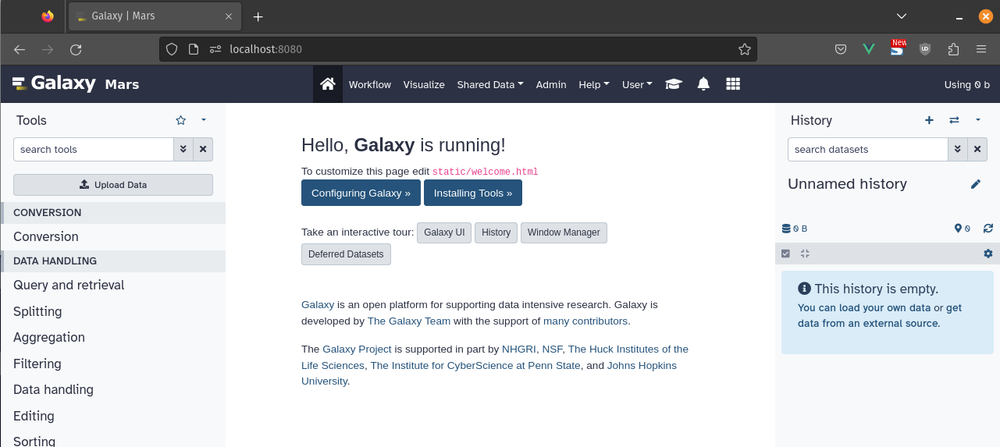

Customizing your Galaxy instance makes it more recognizable at a glance, and can help communicate its purpose to its users.
This tutorial will teach you three basic customizations you can make to Galaxy:

  - Setting a brand text
  - Adding a custom welcome page
  - Customizing the masthead using themes

For this tutorial we will be setting up a fictional instance called "Galaxy Mars".
Feel free to use the included material in the hands-on sections, or provide your own.

> <agenda-title></agenda-title>
>
> 1. TOC
> {:toc}
>
{: .agenda}

## Custom Branding

The brand text in Galaxy refers to the text you can see in the masthead of some Galaxy instances.
This text will appear in the masthead, as well as the sites title.
It is an easy way to set your instance apart, and make it more identifiable.


> <hands-on-title>Customising the Branding</hands-on-title>
> 
> 1. Open your galaxy config file `config/galaxy.yml` and add the following option under `galaxy:`
> 
>    ```yaml
>    brand: Mars
>    logo_src: "https://training.galaxyproject.org/training-material/topics/admin/tutorials/customization/images/logo.png"
>    ```
>
> 2. Start your galaxy server using `sh run.sh`
>
> 3. Navigate to `https://localhost:8080`
>
>    
{: .hands_on}

## Custom Welcome Page

The welcome page is an html document embedded in Galaxy's start page.
It is what users see when first navigating to your instance.
This page can be used to communicate what your instance is about, and share news and updates with your users.

> <hands-on-title>Creating a custom welcome page</hands-on-title>
>
> 0. (optional) Set the location of your welcome page in `galaxy.yml`
> 
>    Under `galaxy:` add the following option:
>
>    ```yaml
>    welcome_url: /static/your-welcome-page.html
>    ```
>
>    Not setting this will cause the url to default to `/static/welcome.html`
>
> 1. Open `/static/welcome.html`, or create a new html file at the location set in Step 0
>
>    It is advisable to keep a copy of the default `welcome.html`, as it can serve as a useful reference.
>
> 2. Add some Content
>
>    Let's add a title and some text to our welcome page:
>
>    ```html
>    <!DOCTYPE html>
>    <html lang="en">
>        <head>
>            <meta charset="utf-8">
>        </head>
>        <body>
>            <h1>Welcome to the Galaxy Mars instance!</h1>
>            <p>The only Galaxy instance on mars.</p>
>        </body>
>    </html>
>    ```
>
>    This works the same as any other html page. You can add styles in the head, or import some scripts.
>    
>    Make sure your welcome page has exactly one `h1` element, which describes the page.
>    This will act as the heading for your start-page, which can help assistive technologies.
{: .hands_on}

> <tip-title>Use an IFrame!</tip-title>
> A lot of the UseGalaxy.* instances choose to use their `welcome.html` to display an IFrame to a different site,
> e.g. the GalaxyProject.org site, or a sub-site thereof.
>
> This makes it easier for non-administrators to keep the homepage's contents
> up to date. By embedding (for example) a Wordpress blog in the center,
> non-technical contributors can still publish articles and announcements
> without having to re-deploy Galaxy every time.
{: .tip}

> <tip-title>Styling your Welcome</tip-title>
> As in our example welcome.html, we've loaded the default Galaxy CSS to keep
> it consistent with the surrounding material. If you wish to load a different
> CSS file, or set a different font for the main panel, you can easily do that
> by adding whatever CSS you like.
{: .tip}

## Custom Masthead Theme

Galaxy's theming system allows you to easily change the color of your Masthead, to give your instance an even more distinct look.
You can even offer several options, to allow users to switch to the default if they prefer it, or another look all together.

> <hands-on-title>Configuring Themes</hands-on-title>
>
> 0. (optional) Set the location of the themes configuration `galaxy.yml`
> 
>    Under `galaxy:` add the following option:
>
>    ```yaml
>    themes_config_file: your-themes-file.yml
>    ```
>
>    This location is relative to the config directory.
>    If unset, the default file `themes_conf.yml` will be used, if present.
>
> 1. Create your themes config file.
>
>    Open `themes_conf.yml.sample`, and copy its contents into a new file, either called `themes_conf.yml`, or the custom path you set in step 0.
>    Do not copy the conf file and remove the ending, as this file is a symbolic link.
>    Copying it copies a reference to the source file, not its contents.
>
> 2. Understanding Themes
>
>    The themes file can contain several themes.
>    Each theme is identified by its id, eg `blue`, and followed by a set of rules, which style the client.
>    The first theme in your theme file will be used as the default theme, which users see when visiting your instance,
>    and which users who haven't logged in will see.
>
>    At the time of writing, themes only support styling the masthead, but this is subject to change.
>    The first example theme should contain all available values you can change.
>
> 3. Creating our own Theme
>
>    Let's create a theme more fitting for our Mars instance.
>
>    Create a new theme, by adding `mars:` to the top of the themes config file.
>    Now add `masthead:` underneath, and then `color:`.
>    Set color to `"#e03e1d"`, a nice deep martian red.
>
>    Your theme file should now begin with:
>
>    ```yaml
>    mars:
>      masthead:
>        color: "#e03e1d"
>    ```
>
>    Restart your instance, and look at the masthead. It should be colored red.
>
> 4. You can also try logging in, and changing your theme under `Preferences`
{: .hands_on}
