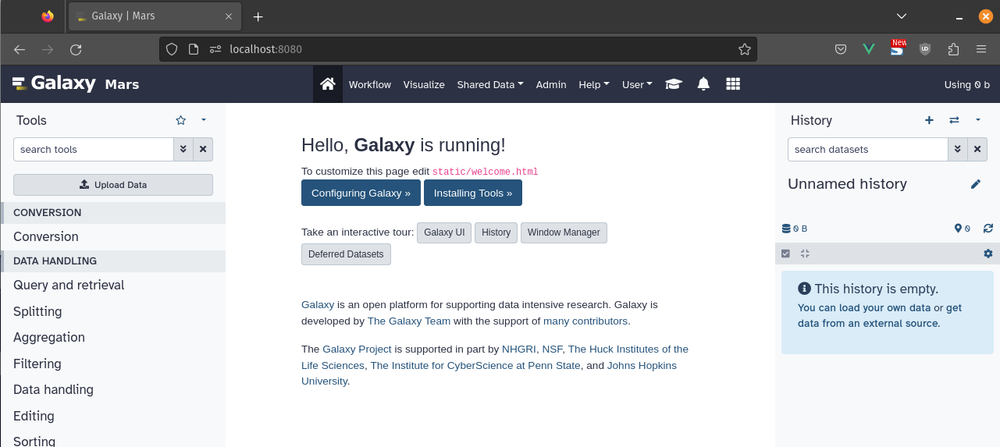

Customizing your Galaxy instance makes it more recognizable at a glance, and can help communicate its purpose to its users.
This tutorial will teach you three basic customizations you can make to Galaxy:

  - Setting a brand text
  - Adding a custom welcome page
  - Customizing the masthead using themes

For this tutorial we will be setting up a fictional instance called "Galaxy Mars".
Feel free to use the included material in the hands-on sections, or provide your own.

> <agenda-title></agenda-title>
>
> 1. TOC
> {:toc}
>
{: .agenda}

## Custom Branding

The brand text in Galaxy refers to the text you can see in the masthead of some Galaxy instances.
This text will appear in the masthead, as well as the sites title.
It is an easy way to set your instance apart, and make it more identifiable.


> <hands-on-title>Customising the Branding</hands-on-title>
> 
> 1. Open your `group_vars/galaxyserers.yml` and the following option under `galaxy_config.galaxy`:
> 
>    
>    ```diff
>    --- a/group_vars/galaxyservers.yml
>    +++ b/group_vars/galaxyservers.yml
>    @@ -32,6 +32,9 @@ galaxy_job_config:
>     
>     galaxy_config:
>       galaxy:
>    +    # Branding
>    +    brand: Mars 🚀
>    +    logo_src: "https://training.galaxyproject.org/training-material/topics/admin/tutorials/customization/images/logo.png"
>         # Main Configuration
>         admin_users:
>         - admin@example.org
>    
>    ```
>    {: data-commit="Add brand"}
>
> 1. Run the playbook.
>
>    > <code-in-title>Bash</code-in-title>
>    > ```bash
>    > ansible-playbook galaxy.yml
>    > ```
>    > {: data-cmd="true"}
>    {: .code-in}
>
>    
{: .hands_on}

## Custom Welcome Page

The welcome page is an html document embedded in Galaxy's start page.
It is what users see when first navigating to your instance.
This page can be used to communicate what your instance is about, and share news and updates with your users.

> <hands-on-title>Creating a custom welcome page</hands-on-title>
>
> 1. Set the location of your welcome page in `group_vars/galaxyservers.yml`
> 
>    Under `galaxy_config.galaxy` specify the location of your welcome page
>
>    
>    ```diff
>    --- a/group_vars/galaxyservers.yml
>    +++ b/group_vars/galaxyservers.yml
>    @@ -93,6 +93,10 @@ galaxy_config:
>               - job-handlers
>               - workflow-schedulers
>     
>    +galaxy_config_files_public:
>    +  - src: files/galaxy/welcome.html
>    +    dest: "{{ galaxy_mutable_config_dir }}/welcome.html"
>    +
>     galaxy_extra_dirs:
>       - /data
>     
>    
>    ```
>    {: data-commit="Add welcome url to the config"}
>
> 2. Let's then develop the associated template, add a title and some text to our welcome page:
>
>    
>    ```diff
>    --- /dev/null
>    +++ b/files/galaxy/welcome.html
>    @@ -0,0 +1,11 @@
>    +<!DOCTYPE html>
>    +<html lang="en">
>    +    <head>
>    +        <meta charset="utf-8">
>    +        <link href="/static/dist/base.css" rel="stylesheet" type="text/css" />
>    +    </head>
>    +    <body>
>    +        <h1>Welcome to the Galaxy Mars instance!</h1>
>    +        <p>The only Galaxy instance on mars.</p>
>    +    </body>
>    +</html>
>    
>    ```
>    {: data-commit="Add the template"}
>
>    This works the same as any other html page. You can add styles in the head, or import some scripts.
>
>    Make sure your welcome page has exactly one `h1` element, which describes the page.
>    This will act as the heading for your start-page, which can help assistive technologies.
>
> 1. Now that we have a proper welcome page, we'll also need to correct our nginx routes:
>
>    
>    ```diff
>    --- a/templates/nginx/galaxy.j2
>    +++ b/templates/nginx/galaxy.j2
>    @@ -40,7 +40,7 @@ server {
>     	# automatically copied around. The welcome page is one of them. In
>     	# production, this step is skipped, so we will manually alias that.
>     	location /static/welcome.html {
>    -		alias {{ galaxy_server_dir }}/static/welcome.html.sample;
>    +		alias {{ galaxy_mutable_config_dir }}/welcome.html;
>     		expires 24h;
>     	}
>     
>    
>    ```
>    {: data-commit="Fix the nginx routes for the welcome page"}
>
> 1. Run the playbook.
>
>    > <code-in-title>Bash</code-in-title>
>    > ```bash
>    > ansible-playbook galaxy.yml
>    > ```
>    > {: data-cmd="true"}
>    {: .code-in}
>
{: .hands_on}

> <tip-title>Use an IFrame!</tip-title>
> A lot of the UseGalaxy.* instances choose to use their `welcome.html` to display an IFrame to a different site,
> e.g. the GalaxyProject.org site, or a sub-site thereof.
>
> This makes it easier for non-administrators to keep the homepage's contents
> up to date. By embedding (for example) a Wordpress blog in the center,
> non-technical contributors can still publish articles and announcements
> without having to re-deploy Galaxy every time.
{: .tip}

> <tip-title>Styling your Welcome</tip-title>
> As in our example welcome.html, we've loaded the default Galaxy CSS to keep
> it consistent with the surrounding material. If you wish to load a different
> CSS file, or set a different font for the main panel, you can easily do that
> by adding whatever CSS you like.
{: .tip}

## Custom Masthead Theme

Galaxy's theming system allows you to easily change the color of your Masthead, to give your instance an even more distinct look.
You can even offer several options, to allow users to switch to the default if they prefer it, or another look all together.

> <hands-on-title>Configuring Themes</hands-on-title>
>
> 0. Set the location of the themes configuration in your `group_vars/galaxyservers.yml`
>
>    
>    ```diff
>    --- a/group_vars/galaxyservers.yml
>    +++ b/group_vars/galaxyservers.yml
>    @@ -35,6 +35,7 @@ galaxy_config:
>         # Branding
>         brand: Mars 🚀
>         logo_src: "https://training.galaxyproject.org/training-material/topics/admin/tutorials/customization/images/logo.png"
>    +    themes_config_file: "{{ galaxy_config_dir }}/themes.yml"
>         # Main Configuration
>         admin_users:
>         - admin@example.org
>    @@ -97,6 +98,10 @@ galaxy_config_files_public:
>       - src: files/galaxy/welcome.html
>         dest: "{{ galaxy_mutable_config_dir }}/welcome.html"
>     
>    +galaxy_config_files:
>    +  - src: files/galaxy/themes.yml
>    +    dest: "{{ galaxy_config.galaxy.themes_config_file }}"
>    +
>     galaxy_extra_dirs:
>       - /data
>     
>    
>    ```
>    {: data-commit="Add brand"}
>
> 1. Create your themes config file in `files/galaxy/themes.yml`:
>
>    
>    ```diff
>    --- /dev/null
>    +++ b/files/galaxy/themes.yml
>    @@ -0,0 +1,76 @@
>    +blue:
>    +  masthead:
>    +    color: "#2c3143"
>    +    text:
>    +      color: "#f8f9fa"
>    +      hover: gold
>    +      active: white
>    +    link:
>    +      color: transparent
>    +      hover: transparent
>    +      active: "#181a24"
>    +    logo:
>    +      img: "/static/favicon.svg"
>    +      img-secondary: null
>    +
>    +lightblue:
>    +  masthead:
>    +    color: "#384E77"
>    +    text:
>    +      color: white
>    +      hover: "#E6F9AF"
>    +      active: white
>    +    link:
>    +      color: transparent
>    +      hover: transparent
>    +      active: "#18314F"
>    +    logo:
>    +      img: "/static/favicon.svg"
>    +
>    +pride:
>    +  masthead:
>    +      color: >
>    +        linear-gradient(120deg,
>    +          #3c476d 0px 130px,
>    +          #fdda0f 131px 139px,
>    +          #fff 140px 148px,
>    +          #f4b0c9 149px 157px,
>    +          #7ccee6 158px 166px,
>    +          #93540c 167px 175px,
>    +          #000 176px 184px,
>    +          transparent 185px),
>    +        linear-gradient(270deg,
>    +          #3c476d 0px 110px,
>    +          #3c476d00 110px),
>    +        linear-gradient(180deg,
>    +          #FE0000 16.66%,
>    +          #FD8C00 16.66% 33.32%,
>    +          #FFE500 33.32% 49.98%,
>    +          #119F0B 49.98% 66.64%,
>    +          #0644B3 66.64% 83.3%,
>    +          #C22EDC 83.3%)
>    +      text:
>    +        color: white
>    +        hover: gold
>    +        active: white
>    +      link:
>    +        color: "#3c476d"
>    +        hover: "#323a53"
>    +        active: "#6170a6"
>    +      logo:
>    +        img: "/static/favicon.svg"
>    +        img-secondary: null
>    +
>    +smoky:
>    +  masthead:
>    +    color: "#0C0F0A"
>    +    text:
>    +      color: white
>    +      hover: "#FBFF12"
>    +      active: white
>    +    link:
>    +      color: transparent
>    +      hover: transparent
>    +      active: "#FF206E"
>    +    logo:
>    +      img: "/static/favicon.svg"
>    
>    ```
>    {: data-commit="Add themes file"}
>
>    The themes file can contains themes for users to select in Galaxy.
>
>    Each theme is identified by its id, eg `blue`, and followed by a set of
>    rules, which style the client. The first theme in your theme file will be
>    used as the default theme, which users see when visiting your instance,
>    and which users who haven't logged in will see.
>
> 3. Creating our own Theme
>
>    Let's create a theme more fitting for our Mars instance.
>
>    Create a new theme, by adding `mars:` to the top of the themes config file.
>    Now add `masthead:` underneath, and then `color:`.
>    Set color to `"#e03e1d"`, a nice deep martian red.
>
>    Your theme file should now begin with:
>
>    
>    ```diff
>    --- a/files/galaxy/themes.yml
>    +++ b/files/galaxy/themes.yml
>    @@ -1,3 +1,8 @@
>    +# Our Martian Theme
>    +mars:
>    +  masthead:
>    +    color: "#e03e1d"
>    +
>     blue:
>       masthead:
>         color: "#2c3143"
>    
>    ```
>    {: data-commit="Add new default theme"}
>
> 3. Run the playbook
>
>    > <code-in-title>Bash</code-in-title>
>    > ```bash
>    > ansible-playbook galaxy.yml
>    > ```
>    > {: data-cmd="true"}
>    {: .code-in}
>
> 4. You can also try logging in, and changing your theme under `Preferences`
{: .hands_on}




