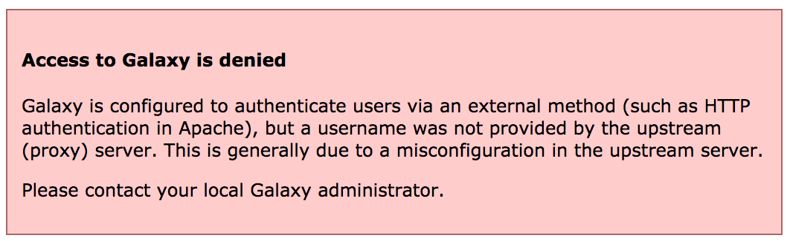

# Overview


For this exercise we will use a basic password file method for authenticating - this is probably not a very useful method in production, but it demonstrates how the proxy server can be configured to provide the correct header to Galaxy, and how Galaxy integrates with upstream authentication providers. This same method can be used with NGINX and Apache modules for CAS or SAML authentication.

> <agenda-title></agenda-title>
>
> 1. TOC
> {:toc}
>
{: .agenda}

# Configuring Authentication

> <hands-on-title>Configuring everything</hands-on-title>
>
> 1. Edit the galaxy.j2 template file in the templates/nginx directory and update the main location block defined for serving galaxy. Add the parameters:
>      - `auth_basic galaxy;`
>      - `auth_basic_user_file /etc/nginx/passwd;`
>      - `proxy_set_header HTTP_REMOTE_USER $remote_user;`
>      - `proxy_set_header HTTP_GX_SECRET SOME_SECRET_STRING;`
>
>    It should look like:
>
>    ```diff
>    @@ -14,6 +14,10 @@
>    +        auth_basic           galaxy;
>    +        auth_basic_user_file /etc/nginx/passwd;
>    +        proxy_set_header          HTTP_REMOTE_USER $remote_user;
>    +        proxy_set_header          HTTP_GX_SECRET SOME_SECRET_STRING;
>         }
>     
>         # Static files can be more efficiently served by Nginx. Why send the
>    ```
>
>    
>
>    > <tip-title>Running this tutorial <i>just</i> for Reports?</tip-title>
>    > Add the `auth_basic` and `auth_basic_user_file` lines to your `location /reports/`
>    {: .tip}
>
>
>    `auth_basic` enables validation of username and password using the "HTTP Basic Authentication" protocol. Its value `galaxy` is used as a realm name to be displayed to the user when prompting for credentials.
>    `auth_basic_user_file` specifies the file that keeps usernames and passwords.
>    `proxy_set_header` adds `HTTP_REMOTE_USER` to the special variables passed by nginx to Galaxy, with value `$remote_user`, which is a nginx embedded variable containing the username supplied with the Basic authentication.
>
>    `GX_SECRET` is added as a header for security purposes, to prevent any other users on the system impersonating nginx and sending requests to Galaxy. NGINX and other webservers like Apache will strip any user-sent `REMOTE_USER` headers, as that header defines the authenticated user. If you can talk directly to Galaxy (e.g. via curl) and provide the `REMOTE_USER` header, you can impersonate any other use. While having Galaxy listen on `127.0.0.1` prevents any requests from outside of the system reaching Galaxy, anyone on the system can still send requests to that port. Here you can choose to switch to a unix socket with permissions only permitting Galaxy and Nginx to connect. `GX_SECRET` adds additional security as it needs to match `remote_user_secret` in your galaxy configutation.
>
>    > <tip-title>Proxy bypass</tip-title>
>    > Users can bypass the authentication only if they can talk directly to the gunicorn processes (if you have socket/http: 0.0.0.0, or if it is directly responsible for serving galaxy, and there is no proxy.)
>    > This can happen mostly when some users have command line access to the Galaxy server, which is considered a bad practice.
>    {: .tip}
>
> 2. Add a pre_task using the [`pip`](https://docs.ansible.com/ansible/2.9/modules/pip_module.html) module which installs the library `passlib`, which is required for `htpasswd`.
>
>    Add a pre_task using the [`htpasswd`](https://docs.ansible.com/ansible/2.4/htpasswd_module.html) module which sets up a password file in `/etc/nginx/passwd`, with owner and group set to root, and a name and password, and a mode of 0640.
>    > <question-title></question-title>
>    >
>    > How does your final configuration look?
>    >
>    > > <solution-title></solution-title>
>    > >
>    > > ```diff
>    > > @@ -7,6 +7,15 @@
>    > >          name: galaxy
>    > >          state: restarted
>    > >    pre_tasks:
>    > > +    - pip:
>    > > +        name: passlib
>    > > +    - htpasswd:
>    > > +        path: /etc/nginx/passwd
>    > > +        name: user1        # Pick a username
>    > > +        password: changeme # and a password
>    > > +        owner: www-data    # nginx on centos
>    > > +        group: root
>    > > +        mode: 0640
>    > >      - name: Install Dependencies
>    > >        package:
>    > >          name: ['git', 'make', 'python3-psycopg2', 'virtualenv']
>    > > ```
>    > {: .solution }
>    >
>    {: .question}
>
> 3. Galaxy needs to be instructed to expect authentication to come from the upstream proxy. In order to do this, set the following two options in your Galaxy group variables:
>
>    ```yaml
>    ...
>    galaxy_config:
>      galaxy:
>        ...
>        use_remote_user: true
>        remote_user_maildomain: "{{ inventory_hostname }}"
>        remote_user_secret: SOME_SECRET_STRING
>    ```
>
>    > <tip-title>Running this tutorial <i>just</i> for Reports?</tip-title>
>    > You don't need to make the above changes for Galaxy then.
>    {: .tip}
>
>    Set the `remote_user_maildomain` option to the appropriate domain name for your site.
>
> 4. Run the playbook
>
{: .hands_on}

> <comment-title>Access denied</comment-title>
>
> If you see this message, it is because nginx is not correctly sending the `REMOTE_USER` or the `GX_SECRET` values.
>
> 
>
{: .comment}


# Testing

You should now be presented with a password dialog when attempting to load the Galaxy UI.

> <hands-on-title>Testing</hands-on-title>
>
> 1. Log in using the username and password you provided when creating the `passwd` file. If your username and the value of `remote_user_maildomain` match an existing user, you will be logged in to that account. If not, a new account will be created for that user.
>
> 2. Click on the "User" menu at the top, to see how the username appears.
>
> 3. Note that some user features are not available when remote user support is enabled.
>
>    Try logging out by selecting **User** -> **Logout**. You will discover that when returning to the user interface, you are still logged in. This is because Galaxy has no way of logging you out of the proxy's authentication system. Instead, you should set `remote_user_logout_href` in `galaxy.yml` to point to the URL of your authentication system's logout page.
>
{: .hands_on}

# API access

If you wish your Galaxy to be accessible to command line clients (e.g. bioblend, blend4j, parsec), you will need to add an exception for authentication on the API. Galaxy will still be secure and protected, but non-browser access will be permitted with an API key.

```
location /api/ {
    satisfy any;
    allow all;
}
```

> <tip-title>Notification of Registration</tip-title>
> There is no built-in way to be notified if users are registered, with external authentication or built-in. However, you could automate this easily. There is a [gxadmin](https://github.com/usegalaxy-eu/gxadmin) command we use called `gxadmin query latest-users` which Björn uses often. Other sites have other methods, e.g. Nicola's [cron script](https://gist.github.com/nsoranzo/f023e26aa60024ef6a7e3a3fe5fb2e4f) which runs daily on his server, to add new users to a group according to their email domain name.
{: .tip}

# Reverting

We don't want to leave Galaxy this way for the rest of our workshop.

> <hands-on-title>Reverting the changes</hands-on-title>
>
> 1. Edit your group variables file and comment out:
>
>    - the NGINX changes
>    - `use_remote_user: true`
>
> 2. Run the playbook
>
{: .hands_on}
