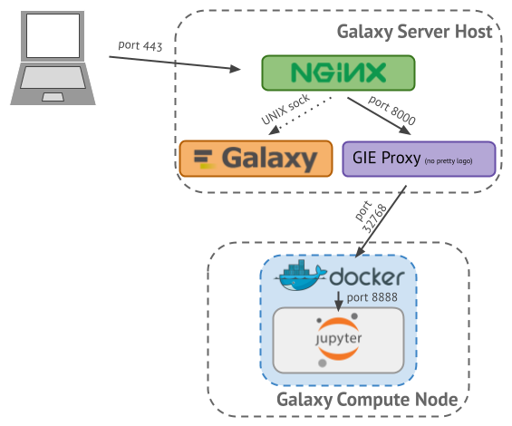
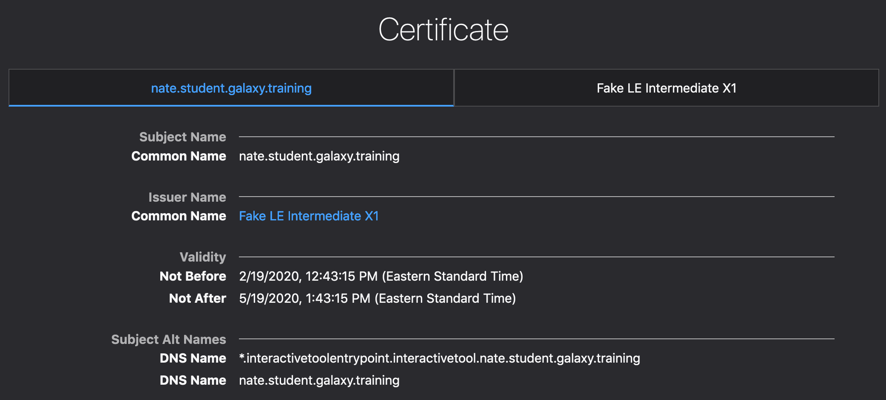

> <warning-title>Evolving Topic</warning-title>
> Galaxy Interactive Tools are a **new feature** and there are some rough edges. Work to improve the experience of deploying and using them is ongoing.
{: .warning}

# Overview


Galaxy Interactive Tools (GxITs) are a method to run containerized tools that are interactive in nature. Interactive Tools typically run a persistent service accessed on a specific port and run until terminated by the user. One common example of such a tool is [Jupyter Notebook][jupyter]. Galaxy Interactive Tools are similar in purpose to [Galaxy Interactive Environments][gie-docs] (GIEs), but are implemented in a significantly different manner. Most notably, instead of directly invoking containers on the Galaxy server, dedicated Docker node, or as a Docker Swarm service (as is done for GIEs), Interactive Tools are submitted through Galaxy's job management system and thus are scheduled the same as any other Galaxy tool - on a Slurm cluster, for instance. Galaxy Interactive Tools were introduced in Galaxy Release 19.09.

> <warning-title>Before You Continue</warning-title>
> If you are *not* completing this tutorial as part of a [Galaxy Admin Training][gat] course, **you will need a wildcard DNS record for your Galaxy server and a method for obtaining a wildcard SSL certificate for your Galaxy server**.
>
> <br/>
>
> Galaxy Interactive Tools require a [wildcard SSL certificate][wildcard-cert]. Because the **Galaxy Installation with Ansible** tutorial fetches [Let's Encrypt][lets-encrypt] certificates, this tutorial fetches Let's Encrypt wildcard certificates. However, this process is only valid for Galaxy Admin Training courses, because Let's Encrypt wildcard certificates [can only be fetched using the DNS-01 challenge method][lets-encrypt-faq], which requires control of a [dynamic DNS][ddns] server (which we have preconfigured for use at training courses). Configuring your DNS service for dynamic updates is outside the scope of this tutorial, but it will show you how to request certificates using DNS-01, which can be adapted for your site.
>
> <br/>
>
> If you are using Let's Encrypt, [a list of available DNS plugins for Certbot][certbot-dns-plugins] can be found in the Certbot documentation. If you are not using Let's Encrypt, please consult your certificate vendor's documentation for information on how to obtain a wildcard certificate. You will need a certificate with (at least) the [subject alternative name][san]s `galaxy.example.org` and `*.interactivetoolentrypoint.interactivetool.galaxy.example.org` (where `galaxy.example.org` is the hostname of your Galaxy server).
>
> <br/>
>
> You will also need a wildcard DNS `CNAME` record for `*.interactivetoolentrypoint.interactivetool.galaxy.example.org`. You can verify that your Galaxy server has such a record using the `host` or `dig` command line tools like so:
>
>    ```console
>    $ host -t cname foo.interactivetoolentrypoint.interactivetool.live.usegalaxy.eu
>    foo.interactivetoolentrypoint.interactivetool.live.usegalaxy.eu is an alias for usegalaxy.eu.
>    $ host -t cname bar.interactivetoolentrypoint.interactivetool.live.usegalaxy.eu
>    bar.interactivetoolentrypoint.interactivetool.live.usegalaxy.eu is an alias for usegalaxy.eu.
>    ```
>
> Please consult your DNS server software or cloud provider's documentation for information on how to set up a wildcard record.
{: .warning}

[wildcard-cert]: https://en.wikipedia.org/wiki/Wildcard_certificate
[lets-encrypt]: https://letsencrypt.org/
[gat]: https://github.com/galaxyproject/dagobah-training
[lets-encrypt-faq]: https://letsencrypt.org/docs/faq/
[ddns]: https://en.wikipedia.org/wiki/Dynamic_DNS
[certbot-dns-plugins]: https://certbot.eff.org/docs/using.html#dns-plugins
[san]: https://en.wikipedia.org/wiki/Subject_Alternative_Name

There are two sections to this exercise. The first shows you how to use Ansible to setup and configure Galaxy Interactive Tools. The second shows you how to do everything manually. It is recommended that you use the Ansible method. The manual method is included here mainly for a more in depth understanding of what is happening.

[jupyter]: https://jupyter.org/
[gie-docs]: https://docs.galaxyproject.org/en/release_19.09/admin/special_topics/interactive_environments.html

> <agenda-title></agenda-title>
>
> 1. TOC
> {:toc}
>
{: .agenda}

# Configuring Galaxy Interactive Tools using Ansible

If the terms "Ansible," "role," and "playbook" mean nothing to you, please checkout [the Ansible introduction slides]() and [the Ansible introduction tutorial]().

**This section of the tutorial builds upon the work in the [Galaxy Installation with Ansible]() tutorial, please ensure that you have completed that tutorial first.**

> <comment-title>Ansible Best Practices</comment-title>
> If you've set up your Galaxy server using the [Galaxy Installation with Ansible]() tutorial, you will have created a `galaxyservers` group in your inventory file, `hosts`, and placed your variables in `group_vars/galaxyservers.yml`. Although for the purposes of this tutorial, the Galaxy server and cluster node are one and the same, in a real world deployment they are very likely to be different hosts. We will continue to use the `galaxyservers` group for simplicity, but in your own deployment you should consider creating an additional group for cluster nodes.
{: .comment}

## Installing Ansible Roles

We will use several Ansible roles for this tutorial. In order to avoid repetetively adding them to `requirements.yml` and installing them, we can simply install them all before getting started. Each role will be discussed in further detail later in the tutorial.

> <hands-on-title>Installing New Ansible Roles</hands-on-title>
>
> 1. In your working directory, add the docker role to your `requirements.yml`:
>
>    ```yaml
>    - src: geerlingguy.docker
>      version: 2.6.0
>    - src: usegalaxy_eu.gie_proxy
>      version: 0.0.2
>    ```
>
> 2. Install the requirements with `ansible-galaxy`:
>
>    ```
>    ansible-galaxy role install -p roles -r requirements.yml
>    ```
{: .hands_on}

## Installing Docker

Currently, Galaxy Interactive Tools must be run in Docker containers. It may be possible to run them in Singularity or other types of containers in the future. Thus, the first step is ensuring that the *nodes* where Galaxy will run have Docker installed. Both the Galaxy Project and Galaxy Project EU organizations have their own docker roles, but these are not published to Ansible Galaxy because they were mostly developed for internal purposes. For now, we will use the [docker role][geerlingguy-docker] by the prolific Ansible Galaxy publisher, [Jeff Geerling (geerlingguy)][geerlingguy]. Have a look at the geerlingguy.docker [README][geerlingguy-docker-readme] and [defaults/main.yml][geerlingguy-docker-defaults] to get an understanding of what variables are used to control the role.

[geerlingguy-docker]: https://galaxy.ansible.com/geerlingguy/docker
[geerlingguy]: https://galaxy.ansible.com/geerlingguy
[geerlingguy-docker-readme]: https://github.com/geerlingguy/ansible-role-docker/blob/master/README.md
[geerlingguy-docker-defaults]: https://github.com/geerlingguy/ansible-role-docker/blob/master/defaults/main.yml

> <question-title></question-title>
>
> What variables might be relevant to using this role?
>
> > <solution-title></solution-title>
> >
> > The `docker_users` variable (a *list*) controls which users are able to interact with the Docker daemon, which our Galaxy user will need to do. Additionally, Docker Compose is configured by default, which we do not need, so it can be disabled with `docker_install_compose: false`.
> >
> {: .solution }
>
{: .question}

> <hands-on-title>Installing Docker with Ansible</hands-on-title>
>
> 1. Edit the group variables file, `group_vars/galaxyservers.yml`:
>
>    The relevant variables to set for this role are:
>
>    | Variable                 | Type            | Description                                     |
>    | ----------               | -------         | -------------                                   |
>    | `docker_users`           | list of strings | List of users to be added to the `docker` group |
>    | `docker_install_compose` | boolean         | Whether to install and configure Docker Compose |
>
>    Add the following lines to your `group_vars/galaxyservers.yml` file:
>
>    
>    ```yaml
>    # Interactive Tools
>    docker_install_compose: false
>    docker_users:
>      - "{{ galaxy_user.name }}"
>    ```
>    
>
>    > <question-title></question-title>
>    >
>    > 
>    > Why is `"{{ galaxy_user.name }}"` specified instead of just the user `galaxy`?
>    > 
>    >
>    > > <solution-title></solution-title>
>    > > Duplicating values is never a good idea. If we needed to change the Galaxy user down the line or wanted to reuse this playbook on another host where the Galaxy username was different, we would have to change the value in multiple locations.
>    > >
>    > {: .solution }
>    >
>    {: .question}
>
> 2. Add the new role to the list of roles under the `roles` key in your playbook, `galaxy.yml`:
>
>    ```yaml
>    ---
>    - hosts: galaxyservers
>      become: true
>      roles:
>        # ... existing roles ...
>        - geerlingguy.docker
>    ```
>
> 3. Run the playbook:
>
>    ```
>    ansible-playbook galaxy.yml
>    ```
{: .hands_on}

Congratulations, you've set up Docker. Verify the installation using the `docker info` command (but keep in mind: what users did we authorize to interact with Docker?).

## Installing the Interactive Tools Proxy

When an Interactive Tool's Docker container starts, it will be assigned a random port. In order to connect clients to the Interactive Tool, Galaxy needs to determine this port (and the node on which the tool is running) and configure a *proxy* from Galaxy to the GxIT's host and port. Consider the following example of running the Jupyter Notebook Interactive Tool, shown in Figure 1 below:

- nginx listens for requests from the client on **port 443** (https)
- Requests for Galaxy are delivered from nginx to Galaxy over a UNIX domain socket
- Requests for Interactive Tools are delivered from nginx to the Interactive Tools Proxy over (by default) **port 8000** (http)
  - GxIT http requests are forwarded by the proxy to Docker on the node on the container's (randomly assigned) **port 32768**
  - GxIT http requests are again forwarded by Docker to Jupyter on its in-container "published" **port 8888**

[//]: # The source for this figure can be found at: https://docs.google.com/presentation/d/1_4PtfM6A4mOxOlgGh6OGWvzFcxD1bdw4CydEWtm5n8k/



As you can see, the client only ever speaks to nginx on the Galaxy server running on the standard https port (443), never directly to the interactive tool (which may be running on a node that does not even have a public IP address). The mapping of GxIT invocation and its corresponding host/port is kept in a SQLite database known as the *Interactive Tools Session Map*, and the path to this database is important, since both Galaxy and the proxy need access to it.

The GIE Proxy is written in [Node.js][nodejs] and requires some configuration. Thankfully there is an Ansible role, [usegalaxy_eu.gie_proxy][usegalaxy_eu-gie_proxy], that can install the proxy and its dependencies, and configure it for you. As usual, have a look through the [README][usegalaxy_eu-gie_proxy-readme] and [defaults][usegalaxy_eu-gie_proxy-defaults] to investigate which variables you might need to set before continuing.

[nodejs]: https://nodejs.org/
[usegalaxy_eu-gie_proxy]: https://galaxy.ansible.com/usegalaxy_eu/gie_proxy
[usegalaxy_eu-gie_proxy-readme]: https://github.com/usegalaxy-eu/ansible-gie-proxy/blob/master/README.md
[usegalaxy_eu-gie_proxy-defaults]: https://github.com/usegalaxy-eu/ansible-gie-proxy/blob/master/defaults/main.yml

> <hands-on-title>Installing the Proxy with Ansible</hands-on-title>
>
> 1. Edit the group variables file, `group_vars/galaxyservers.yml`:
>
>    The relevant variables to set for this role are:
>
>    | Variable                       | Type          | Description                                                           |
>    | ----------                     | -------       | -------------                                                         |
>    | `gie_proxy_dir`                | path (string) | Path of directory into which the proxy application will be installed  |
>    | `gie_proxy_git_version`        | string        | Git reference to clone                                                |
>    | `gie_proxy_setup_nodejs`       | string        | Whether to install Node.js, options are `package` and `nodeenv`       |
>    | `gie_proxy_virtualenv_command` | string        | Command to create virtualenv when using `nodeenv` method              |
>    | `gie_proxy_nodejs_version`     | string        | Version of Node.js to install if using `nodeenv` method               |
>    | `gie_proxy_virtualenv`         | path (string) | Path of virtualenv into which nodeenv/Node.js/npm will be installed   |
>    | `gie_proxy_setup_service`      | string        | Whether to configure the proxy as a service, only option is `systemd` |
>    | `gie_proxy_sessions_path`      | path (string) | Path of Interactive Tools sessions map                                |
>
>    Add the following lines to your `group_vars/galaxyservers.yml` file:
>
>    
>    ```yaml
>    gie_proxy_dir: /srv/galaxy/gie-proxy/proxy
>    gie_proxy_git_version: main
>    gie_proxy_setup_nodejs: nodeenv
>    gie_proxy_virtualenv_command: "{{ pip_virtualenv_command }}"
>    gie_proxy_nodejs_version: "10.13.0"
>    gie_proxy_virtualenv: /srv/galaxy/gie-proxy/venv
>    gie_proxy_setup_service: systemd
>    gie_proxy_sessions_path: "{{ galaxy_mutable_data_dir }}/interactivetools_map.sqlite"
>    ```
>    
>
>    We have chosen to install Node.js using [nodeenv][] because the version in the training image's package manager is fairly old.
>
> 2. Add the new role to `galaxy.yml`:
>
>    ```yaml
>    - hosts: galaxyservers
>      become: true
>      roles:
>        # ... existing roles ...
>        - geerlingguy.docker
>        - usegalaxy_eu.gie_proxy
>    ```
>
> 3. Run the playbook:
>
>    ```
>    ansible-playbook galaxy.yml
>    ```
>
{: .hands_on}

[nodeenv]: https://github.com/ekalinin/nodeenv

> <question-title></question-title>
>
> What did running the playbook change?
>
> > <solution-title></solution-title>
> >
> > 1. A new Python venv was created at `/srv/galaxy/gie-proxy/venv`
> > 2. Node.js version 10.13.0 was installed in to the venv
> > 3. The proxy was cloned to `/srv/galaxy/gie-proxy/proxy`
> > 4. The proxy's Node dependencies were installed to `/srv/galaxy/gie-proxy/proxy/node_modules` using the venv's `npm`
> > 5. A systemd service unit was installed at `/etc/systemd/system/galaxy-gie-proxy.service`
> > 6. The systemd daemon was reloaded to read this new service unit
> > 7. The service was set to start on boot and started
> >
> {: .solution }
>
{: .question}

Because the proxy runs as a systemd service, you can inspect the log of the service using `journalctl`. The service name is `galaxy-gie-proxy`:

```console
$ sudo journalctl -eu galaxy-gie-proxy
Feb 14 17:38:49 gcc-4 systemd[1]: Started Galaxy IE/IT Proxy.
Feb 14 17:38:49 gcc-4 node[3679]: Watching path /srv/galaxy/var/interactivetools_map.sqlite
```

> <comment-title>Note</comment-title>
>
> You can ignore errors about failing to read the sessions map file for now - Galaxy will create it when it's needed.
>
{: .comment}

## Proxying the Proxy

As explained in the previous section, we will proxy the Interactive Tools Proxy with nginx so that it can serve requests on the standard HTTPS port, 443. Because we've configured nginx with Ansible, this is relatively simple.

> <hands-on-title>Installing the Proxy with Ansible</hands-on-title>
>
> 1. Edit the group variables file, `group_vars/galaxyservers.yml` and add a new item to the **existing** `nginx_ssl_servers` so it matches:
>
>    
>    ```yaml
>    nginx_ssl_servers:
>      - galaxy
>      - galaxy-gie-proxy
>    ```
>    
>
>    The nginx configuration `galaxy-gie-proxy` doesn't exist yet, but we'll create it in a moment.
>
> 2. Create `templates/nginx/galaxy-gie-proxy.j2` with the following contents:
>
>    
>    ```nginx
>    server {
>        # Listen on port 443
>        listen       *:443 ssl;
>        # Match all requests for the interactive tools subdomain
>        server_name  *.interactivetool.{{ inventory_hostname }};
>
>        # Our log files will go here.
>        access_log  syslog:server=unix:/dev/log;
>        error_log   syslog:server=unix:/dev/log;
>
>        # Proxy all requests to the GIE Proxy application
>        location / {
>            proxy_redirect off;
>            proxy_http_version 1.1;
>            proxy_set_header Host $host;
>            proxy_set_header X-Real-IP $remote_addr;
>            proxy_set_header Upgrade $http_upgrade;
>            proxy_set_header Connection "upgrade";
>            proxy_pass http://localhost:{{ gie_proxy_port }};
>        }
>    }
>    ```
>    
>
> 3. Run the playbook:
>
>    ```
>    ansible-playbook galaxy.yml
>    ```
>
{: .hands_on}

## Getting a Wildcard SSL Certificate

During the [Galaxy Installation with Ansible]() tutorial, we acquired an SSL certificate for our Galaxy server from [Let's Encrypt][lets-encrypt]. This certificate was issued for the hostname of your Galaxy server (e.g. `galaxy.example.org`). SSL certificates are valid *only for the name to which they were issued*. This presents a problem for us due to the way that Galaxy Interactive Tools work.

In order to ensure each Interactive Tool's cookies are unique, and to provide each tool with a unique entry point, they are served from a subdomain of your Galaxy server (e.g. `<unique-id>.interactivetoolentrypoint.interactivetool.galaxy.example.org`). Your SSL cert is not valid for this subdomain. Further, in order to support the random `<unique-id>` in the hostname, we need a *wildcard certificate* for `*.interactivetoolentrypoint.interactivetool.galaxy.example.org`.

This process is highly dependent on your site; specifically, your SSL certificate vendor, and your DNS server software or cloud provider.

Let's Encrypt, the SSL certificate vendor we use in our tutorials, [can only generate wildcard certificates using the DNS-01 challenge method][lets-encrypt-faq], which works by issuing a [dynamic DNS][ddns] update to set the requested domain's `TXT` record.

If you are completing this tutorial as part of a [Galaxy Admin Training][gat] course, we might have precreated a dynamic DNS server that you will use for this step. The *TSIG key* that allows you to perform dynamic DNS updates will be provided to you. Your instructor will also tell you which option to follow (1 or 2), depending on the DNS provider that was chosen for this course.

As we use Let's Encrypt in staging mode, the wildcard certificates generated with either option 1 or 2 will still be invalid, and you will still see a warning in your web browser when accessing an Interactive Tool. If this warning is not a problem for you, you can just skip this section of the tutorial, and move on to "Enabling Interactive Tools in Galaxy".

> <hands-on-title>Requesting a Wildcard Certificate with Certbot using Ansible - Option 1 (rfc2136)</hands-on-title>
>
> This method uses a DNS provider hosted by the Galaxy Project.
>
> 1. Edit the group variables file, `group_vars/galaxyservers.yml`:
>
>    The relevant variables to set for this role are:
>
>    | Variable                  | Type       | Description                                                                                                      |
>    | ----------                | -------    | -------------                                                                                                    |
>    | `certbot_domains`         | list       | List of domains to include as subject alternative names (the first will also be the certificate's *common name*) |
>    | `certbot_dns_provider`    | string     | Name of [Certbot DNS plugin][certbot-dns-plugins] to use                                                         |
>    | `certbot_dns_credentials` | dictionary | Plugin-specific credentials for performing dynamic DNS updates                                                   |
>    | `certbot_expand`          | boolean    | Whether to "expand" an existing certificate (add new domain names to it)                                         |
>
>    - Add a new item to the **existing** `certbot_domains` list so it matches:
>
>      
>      ```yaml
>      certbot_domains:
>        - "{{ inventory_hostname }}"
>        - "*.interactivetoolentrypoint.interactivetool.{{ inventory_hostname }}"
>      ```
>      
>
>    - Comment out the existing `certbot_auth_method` like so:
>
>      ```yaml
>      #certbot_auth_method: --webroot
>      ```
>
>        Although this is not explicitly required (setting `cerbot_dns_provider` as we do overrides this setting), doing so is less confusing in the future, since it makes it clear that the "webroot" method for Let's Encrypt WEB-01 challenges is no longer in use for this server.
>
>    - Add the following lines to your `group_vars/galaxyservers.yml` file:
>
>      ```yaml
>      certbot_dns_provider: rfc2136
>      certbot_dns_credentials:
>        server: ns-training.galaxyproject.org
>        port: 53
>        name: certbot-training.
>        secret: <SECRET PROVIDED BY INSTRUCTOR>
>        algorithm: HMAC-SHA512
>      ```
>
> 2. Run the playbook **with `certbot_expand`**:
>
>    ```
>    ansible-playbook galaxy.yml -e certbot_expand=true
>    ```
>
>    > <question-title></question-title>
>    >
>    > What is the `-e` flag to `ansible-playbook` and why did we use it?
>    >
>    > > <solution-title></solution-title>
>    > >
>    > > As per `ansible-playbook --help`:
>    > >
>    > > ```
>    > >   -e EXTRA_VARS, --extra-vars EXTRA_VARS
>    > >                         set additional variables as key=value or YAML/JSON, if
>    > >                         filename prepend with @
>    > > ```
>    > >
>    > > We used this flag because `certbot_expand` only needs to be set *once*, when we are adding a new domain to the certificate. It should not be enabled on subsequent runs of the playbook, or else we would request a new certificate on each run! Thus, it does not make sense to add it to a vars file.
>    > >
>    > {: .solution }
>    >
>    {: .question}
>
>    Be patient! The certificate request step can take time due to the time allowed for DNS propagation to occur.
>
{: .hands_on}


> <hands-on-title>Requesting a Wildcard Certificate with Certbot using Ansible - Option 2 (route53)</hands-on-title>
>
> This method uses route53, the Amazon Web Services DNS provider. To manage connection to AWS, we will first install a specific role.
>
> 1. In your working directory, add the aws_cli role to your `requirements.yml`:
>
>    ```yaml
>    - src: usegalaxy_eu.aws_cli
>      version: 0.0.1
>    ```
>
> 2. Install the requirements with `ansible-galaxy`:
>
>    ```
>    ansible-galaxy role install -p roles -r requirements.yml
>    ```
> 3. Open `galaxy.yml` with your text editor to add the role `usegalaxy_eu.aws_cli` just before the nginx role:
>
>    ```diff
>    diff --git a/galaxy.yml b/galaxy.yml
>    --- a/galaxy.yml
>    +++ b/galaxy.yml
>    @@ -21,6 +21,7 @@
>           become: true
>           become_user: galaxy
>         - usegalaxy_eu.galaxy_systemd
>    +    - usegalaxy_eu.aws_cli
>         - galaxyproject.nginx
>         - geerlingguy.docker
>         - usegalaxy_eu.gie_proxy
>    ```
>
>    
>
> 4. Edit the group variables file, `group_vars/galaxyservers.yml`:
>
>    The relevant variables to set for this role are:
>
>    | Variable                  | Type       | Description                                                                                                      |
>    | ----------                | -------    | -------------                                                                                                    |
>    | `certbot_domains`         | list       | List of domains to include as subject alternative names (the first will also be the certificate's *common name*) |
>    | `certbot_dns_provider`    | string     | Name of [Certbot DNS plugin][certbot-dns-plugins] to use                                                         |
>    | `certbot_dns_credentials` | dictionary | Plugin-specific credentials for performing dynamic DNS updates                                                   |
>    | `certbot_expand`          | boolean    | Whether to "expand" an existing certificate (add new domain names to it)                                         |
>
>    - Add a new item to the **existing** `certbot_domains` list so it matches:
>
>      
>      ```yaml
>      certbot_domains:
>        - "{{ inventory_hostname }}"
>        - "*.interactivetoolentrypoint.interactivetool.{{ inventory_hostname }}"
>      ```
>      
>
>    - Comment out the existing `certbot_auth_method` like so:
>
>      ```yaml
>      #certbot_auth_method: --webroot
>      ```
>
>        Although this is not explicitly required (setting `cerbot_dns_provider` as we do overrides this setting), doing so is less confusing in the future, since it makes it clear that the "webroot" method for Let's Encrypt WEB-01 challenges is no longer in use for this server.
>
>    - Add the following lines to your `group_vars/galaxyservers.yml` file:
>
>      ```yaml
>      certbot_dns_provider: route53
>      aws_cli_credentials:
>        - access_key: "<SECRET PROVIDED BY INSTRUCTOR>"
>          secret_key: "<SECRET PROVIDED BY INSTRUCTOR>"
>          homedir: /root
>          owner: root
>          group: root
>      ```
>
> 5. Run the playbook **with `certbot_expand`**:
>
>    ```
>    ansible-playbook galaxy.yml -e certbot_expand=true
>    ```
>
>    > <question-title></question-title>
>    >
>    > What is the `-e` flag to `ansible-playbook` and why did we use it?
>    >
>    > > <solution-title></solution-title>
>    > >
>    > > As per `ansible-playbook --help`:
>    > >
>    > > ```
>    > >   -e EXTRA_VARS, --extra-vars EXTRA_VARS
>    > >                         set additional variables as key=value or YAML/JSON, if
>    > >                         filename prepend with @
>    > > ```
>    > >
>    > > We used this flag because `certbot_expand` only needs to be set *once*, when we are adding a new domain to the certificate. It should not be enabled on subsequent runs of the playbook, or else we would request a new certificate on each run! Thus, it does not make sense to add it to a vars file.
>    > >
>    > {: .solution }
>    >
>    {: .question}
>
{: .hands_on}

You can verify that your certificate has been expanded using your browser's developer tools:



## Enabling Interactive Tools in Galaxy

A few Interactive Tool wrappers are provided with Galaxy, but they are [commented out in Galaxy's default tool config file][tool-conf-gxits]. As a result, we need to instruct the [galaxyproject.galaxy role][galaxy-role] to install a tool panel configuration file containing at least one of these tools in order to try them out. For the purposes of this tutorial, a good choice is the [EtherCalc][ethercalc] GxIT, because it has a relatively small [Docker image][ethercalc-docker-image].

[tool-conf-gxits]: https://github.com/galaxyproject/galaxy/blob/9d788cb144a18570e7e5e948ac1f7bc04fec4e75/lib/galaxy/config/sample/tool_conf.xml.sample#L126
[galaxy-role]: https://github.com/galaxyproject/ansible-galaxy
[ethercalc]: https://ethercalc.net/
[ethercalc-docker-image]: https://hub.docker.com/r/shiltemann/ethercalc-galaxy-ie

> <hands-on-title>Enabling Interactive Tools in Galaxy</hands-on-title>
>
> 1. Rather than modifying the default tool configuration file, we'll add a new one that only references the Interactive Tools. This way, the default set of tools will still load without us having to incorporate the entire default tool config into our playbook.
>
>    If the folder does not exist, create `templates/galaxy/config` next to your `galaxy.yml` (`mkdir -p templates/galaxy/config/`)
>
>    Create `templates/galaxy/config/tool_conf_interactive.xml.j2` with the following contents:
>
>    ```xml
>    <toolbox monitor="true">
>        <section id="interactivetools" name="Interactive Tools">
>            <tool file="interactive/interactivetool_ethercalc.xml" />
>        </section>
>    </toolbox>
>    ```
>
> 2. We need to modify `job_conf.xml` to instruct Galaxy on how run Interactive Tools (and specifically, how to run them in Docker). We will begin with a basic job conf:
>
>    Create `templates/galaxy/config/job_conf.xml.j2` with the following contents:
>
>    ```xml
>    <job_conf>
>        <plugins workers="4">
>            <plugin id="local" type="runner" load="galaxy.jobs.runners.local:LocalJobRunner"/>
>        </plugins>
>        <destinations>
>            <destination id="local" runner="local"/>
>        </destinations>
>    </job_conf>
>    ```
>
>    > <comment-title>Note</comment-title>
>    > Depending on the order in which you are completing this tutorial in relation to other tutorials, you may have already created the `job_conf.xml.j2` file, as well as defined `galaxy_config_templates` and set the `job_config_file` option in `galaxy_config` (step 4). If this is the case, be sure to **merge the changes in this section with your existing playbook**.
>    {: .comment}
>
> 3. Next, we need to configure the interactive tools destination. First, we explicitly set the destination to the default `local` destination since there will now be two destinations defined. Then we add a destination for submitting jobs as docker containers using the [advanced sample job configuration][job-conf-docker] as a guide. Finally, use the [EtherCalc GxIT's][ethercalc-tool-wrapper] tool ID to route executions of the EtherCalc GxIT to the newly created destination:
>
>    ```diff
>    --- a/templates/galaxy/config/job_conf.xml.j2
>    +++ b/templates/galaxy/config/job_conf.xml.j2
>         <plugins workers="4">
>             <plugin id="local" type="runner" load="galaxy.jobs.runners.local:LocalJobRunner"/>
>         </plugins>
>    -    <destinations>
>    +    <destinations default="local">
>             <destination id="local" runner="local"/>
>    +        <destination id="interactive_local" runner="local">
>    +            <param id="docker_enabled">true</param>
>    +            <param id="docker_volumes">$defaults</param>
>    +            <param id="docker_sudo">false</param>
>    +            <param id="docker_net">bridge</param>
>    +            <param id="docker_auto_rm">true</param>
>    +            <param id="docker_set_user"></param>
>    +            <param id="require_container">true</param>
>    +        </destination>
>         </destinations>
>    +    <tools>
>    +        <tool destination="interactive_local" id="interactive_tool_ethercalc" />
>    +    </tools>
>     </job_conf>
>    ```
>
>    Of considerable note is the `docker_volumes` param: the variable expansions are explained in the [advanced sample job configuration][job-conf-docker].  We'll use this volume configuration for now but it has some considerable data security problems. We'll discuss a better solution at the end of this tutorial.
>
> 4. Inform `galaxyproject.galaxy` of what tool configuration files to load in your group variables (`group_vars/galaxyservers.yml`):
>
>    
>    ```yaml
>    galaxy_tool_config_files:
>      - "{{ galaxy_server_dir }}/config/tool_conf.xml.sample"
>      - "{{ galaxy_config_dir }}/tool_conf_interactive.xml"
>    ```
>    
>
>    Next, inform `galaxyproject.galaxy` of where you would like the `job_conf.xml` to reside, that GxITs should be enabled, and where the GxIT map database can be found:
>
>    
>    ```yaml
>    galaxy_config:
>      galaxy:
>        # ... existing configuration options in the `galaxy` section ...
>        job_config_file: "{{ galaxy_config_dir }}/job_conf.xml"
>        interactivetools_enable: true
>        interactivetools_map: "{{ gie_proxy_sessions_path }}"
>    ```
>    
>
>    And then deploy the new config templates using the `galaxy_config_templates` var in your group vars:
>
>    
>    ```yaml
>    galaxy_config_templates:
>      # ... possible existing config file definitions
>      - src: templates/galaxy/config/tool_conf_interactive.xml.j2
>        dest: "{{ galaxy_config_dir }}/tool_conf_interactive.xml"
>      - src: templates/galaxy/config/job_conf.xml.j2
>        dest: "{{ galaxy_config.galaxy.job_config_file }}"
>    ```
>    
>
> 5. Run the playbook:
>
>    ```
>    ansible-playbook galaxy.yml
>    ```
>
> 6. Follow the Galaxy logs with `journalctl -f -u galaxy`
>
{: .hands_on}

[job-conf-docker]: https://github.com/galaxyproject/galaxy/blob/6622ad1acb91866febb3d2f229de7cfb8af3a9f6/lib/galaxy/config/sample/job_conf.xml.sample_advanced#L410
[ethercalc-tool-wrapper]: https://github.com/galaxyproject/galaxy/blob/6622ad1acb91866febb3d2f229de7cfb8af3a9f6/tools/interactive/interactivetool_ethercalc.xml

## Run an Interactive Tool

You should now be ready to run an Interactive Tool in Galaxy!

> <hands-on-title>Running an Interactive Tool</hands-on-title>
>
> 1. Ensure that you are logged in to your Galaxy server by checking the **User** menu in the masthead.
> 2. We'll need an input for our test GxIT (EtherCalc). Any tabular file can be used, such as Galaxy's [1.tabular][1-tabular] test data. Copy this file's URL:
>
>    ```
>    https://raw.githubusercontent.com/galaxyproject/galaxy/release_20.01/test-data/1.tabular
>    ```
>
> 3. Click  **Upload** at the top of the tool panel (on the left side of the Galaxy UI).
> 4. In the resulting modal dialog, click the **Paste/Fetch data** button.
> 5. Paste the URL in the **text field** that has just appeared.
> 6. Give the new dataset a name such as `tabular`, if you like.
> 7. Click **Start** and then **Close**.
> 8. From the tool menu, click the **Interactive Tools** section, then click **EtherCalc** .
> 9. Ensure that your newly uploaded tabular dataset is selected as the input **Some tabular dataset**, then click **Execute**.
> 10. Monitor the blue **info box** on the next page, which will inform you when the Interactive Tool is accessible and provide you with a link to access it.
>
>     <br/>
>
>     If you navigate away from this page, you can view your running Interactive Tools from the **Active InteractiveTools** menu item in the **User** menu.
> 11. Click the **click here to display** link.
>
{: .hands_on}

If everything has worked correctly, your browser will load EtherCalc with your tabular data preloaded. Once you're done working with the data, return to Galaxy and stop EtherCalc by deleting its output dataset from your history, or stopping it via the interface from the **Active InteractiveTools** menu item in the **User** menu.

[1-tabular]: https://raw.githubusercontent.com/galaxyproject/galaxy/release_20.01/test-data/1.tabular

## Securing Interactive Tools

Inspecting the Docker container of a running Interactive Tool shows the volume configuration expanded from `$galaxy_root` in the job destination's `docker_volumes` param:

```console
$ docker inspect $(docker ps -q) | jq '.[0].HostConfig.Binds'
[
  "/srv/galaxy/server:/srv/galaxy/server:ro",                                     # Galaxy server dir
  "/srv/galaxy/server/tools/interactive:/srv/galaxy/server/tools/interactive:ro", # EtherCalc tool wrapper parent dir
  "/srv/galaxy/jobs/000/1:/srv/galaxy/jobs/000/1:ro",                             # Per-job root dir
  "/srv/galaxy/jobs/000/1/outputs:/srv/galaxy/jobs/000/1/outputs:rw",             # Job outputs dir
  "/srv/galaxy/jobs/000/1/configs:/srv/galaxy/jobs/000/1/configs:rw",             # Job config files dir
  "/srv/galaxy/jobs/000/1/working:/srv/galaxy/jobs/000/1/working:rw",             # Job working (cwd) dir
  "/data:/data:rw",                                                               # GALAXY USER DATASETS DIR (RW!)
  "/srv/galaxy/server/tool-data:/srv/galaxy/server/tool-data:ro"                  # Galaxy reference data dir
]
```

As hinted earlier, there is a concerning state here: The directory containing **all** of the the user-generated data in Galaxy (not just the data for this job) has been mounted **read-write** in to the container. **This configuration grants users running interactive tools full access to all the data in Galaxy, which is a very bad idea.** Unlike standard Galaxy tools, where the tool's design prevents users from writing to arbitrary paths, Interactive Tools are fully user controllable. Although EtherCalc does not provide a mechanism for writing to this path, other Interactive Tools (such as Jupyter Notebook) do.

Two solutions are discussed in the [advanced sample job configuration][job-conf-docker]:

1. Use the `outputs_to_working_directory` job configuration option, which allows you to mount datasets read-only: this prevents manipulation, but still allows GxIT users to read any dataset in your Galaxy server.
2. Use [Pulsar][pulsar], Galaxy's remote job execution engine, to provide full job isolation: this avoids all access to Galaxy data, with the performance penalty of copying input dataset(s) to the job directory.

Because we want to maintain dataset privacy, Pulsar is the better choice here. And in fact, we don't even need to set up a Pulsar server: because we only need Pulsar's input staging and isolation features, we can use [Embedded Pulsar][job-conf-pulsar-embedded], which runs a Pulsar server within the Galaxy application to perform these tasks. Embedded Pulsar can even interface with your distributed resource manager (aka cluster scheduler) of choice, as long as your Galaxy server and cluster both have access to a common filesystem (otherwise, you will need to use Pulsar in standalone mode; see the [Running Jobs on Remote Resources with Pulsar]() tutorial).

[pulsar]: https://github.com/galaxyproject/pulsar
[job-conf-pulsar-embedded]: https://github.com/galaxyproject/galaxy/blob/6622ad1acb91866febb3d2f229de7cfb8af3a9f6/lib/galaxy/config/sample/job_conf.xml.sample_advanced#L106

> <hands-on-title>Running Interactive Tools with Embedded Pulsar</hands-on-title>
>
> 1. Create a configuration file *template* for the Pulsar application at `templates/galaxy/config/pulsar_app.yml.j2`.
>
>    <br/>
>
>    If the folder does not exist, create `templates/galaxy/config` next to your `galaxy.yml` (`mkdir -p templates/galaxy/config/`).
>
>    <br/>
>
>    Add the following contents to the template:
>
>    
>    ```yaml
>    ---
>
>    # The path where per-job directories will be created
>    staging_directory: "{{ galaxy_job_working_directory }}/_interactive"
>
>    # Where Pulsar state information will be stored (e.g. currently active jobs)
>    persistence_directory: "{{ galaxy_mutable_data_dir }}/pulsar"
>
>    # Where to find Galaxy tool dependencies
>    tool_dependency_dir: "{{ galaxy_tool_dependency_dir }}"
>
>    # How to run jobs (see https://pulsar.readthedocs.io/en/latest/job_managers.html)
>    managers:
>      _default_:
>        type: queued_python
>        num_concurrent_jobs: 1
>    ```
>    
>
> 2. Modify the job configuration file, `templates/galaxy/config/job_conf.xml.j2`, to configure Interactive Tools to use the embedded Pulsar runner.
>
>    <br/>
>
>    **Add** the embedded Pulsar runner plugin to the `<plugins>` section of the config:
>
>    ```xml
>    <plugin id="pulsar_embedded" type="runner" load="galaxy.jobs.runners.pulsar:PulsarEmbeddedJobRunner">
>        <param id="pulsar_config">/srv/galaxy/config/pulsar_app.yml</param>
>    </plugin>
>    ```
>
>    > <tip-title>Ansible Best Practices</tip-title>
>    > We have used a bit of bad practice here: hardcoding the Pulsar config file path in to the job config file. At this point, we should convert the job config file to a template (in the same manner as the Pulsar config template). The reason we don't do it in this tutorial is to maintain compatibility with other tutorials, but you may do so by following the same pattern as is used for the Pulsar config template.
>    {: .tip}
>
>    Next, **modify** the `interactive_local` destination to use the new runner and set the new parameter `container_monitor_result` to `callback` (explained in more detail in the next step):
>
>    > <warning-title>Untrusted SSL Certificates</warning-title>
>    > If you are completing this tutorial as part of a [Galaxy Admin Training][gat] course, you will also need the `<env>` setting shown below to prevent problems with the untrusted SSL certificates in use during the course. Galaxy servers with valid SSL certificates *do not need this option*.
>    {: .warning}
>
>    ```diff
>    --- a/templates/galaxy/config/job_conf.xml.j2
>    +++ b/templates/galaxy/config/job_conf.xml.j2
>         <destinations default="local">
>             <destination id="local" runner="local"/>
>    -        <destination id="interactive_local" runner="local">
>    +        <destination id="interactive_local" runner="pulsar_embedded">
>                 <param id="docker_enabled">true</param>
>                 <param id="docker_volumes">$defaults</param>
>                 <param id="docker_sudo">false</param>
>                 <param id="docker_net">bridge</param>
>                 <param id="docker_auto_rm">true</param>
>                 <param id="docker_set_user"></param>
>                 <param id="require_container">true</param>
>    +            <param id="container_monitor_result">callback</param>
>    +            <env id="REQUESTS_CA_BUNDLE">/etc/ssl/certs/ca-certificates.crt</env>
>             </destination>
>         </destinations>
>    ```
>
> 3. Open your `galaxyservers` group variables file and instruct `galaxyproject.galaxy` to install the Pulsar configuration file:
>
>    > <comment-title>Note</comment-title>
>    > Depending on the order in which you are completing this tutorial in relation to other tutorials, you may have already defined `galaxy_config_templates`. If this is the case, be sure to **merge the changes in this step with your existing playbook**.
>    {: .comment}
>
>    
>    ```yaml
>    galaxy_config_templates:
>      - src: templates/galaxy/config/pulsar_app.yml.j2
>        dest: "{{ galaxy_config_dir }}/pulsar_app.yml"
>    ```
>    
>
>    Additionally, you will need to set the `galaxy_infrastructure_url` config option:
>
>    
>    ```yaml
>    galaxy_config:
>      galaxy:
>        # ... existing configuration options in the `galaxy` section ...
>        galaxy_infrastructure_url: "https://{{ inventory_hostname }}/"
>    ```
>    
>
>    > <details-title>Detail: Infrastructure URL/Callback</details-title>
>    > Galaxy must be made aware of the randomly selected port Docker has assigned after the GxIT begins operating, in order to update the proxy map. By default, this is done by writing a JSON file in the job directory. This method does not work with Pulsar since Pulsar uses a different job directory from the Galaxy job directory. As a result, Pulsar jobs use the `callback` method configured in the previous step to make a request to Galaxy's API, the URL for which is set in `galaxy_infrastructure_url`.
>    {: .details}
>
> 4. Run the playbook:
>
>    ```
>    ansible-playbook galaxy.yml
>    ```
>
{: .hands_on}

Once the playbook run is complete and your Galaxy server has restarted, run the EtherCalc Interactive Tool again.

> <question-title></question-title>
>
> Once EtherCalc is running, check the mounts of its container. What do you observe?
>
> > <solution-title></solution-title>
> >
> > ```console
> > $ docker inspect $(docker ps -q) | jq '.[0].HostConfig.Binds'
> > [
> >   "/srv/galaxy/jobs/_interactive/2:/srv/galaxy/jobs/_interactive/2:ro",                       # Per-job root dir
> >   "/srv/galaxy/jobs/_interactive/2/tool_files:/srv/galaxy/jobs/_interactive/2/tool_files:ro", # EtherCalc tool wrapper parent dir
> >   "/srv/galaxy/jobs/_interactive/2/outputs:/srv/galaxy/jobs/_interactive/2/outputs:rw",       # Job outputs dir
> >   "/srv/galaxy/jobs/_interactive/2/working:/srv/galaxy/jobs/_interactive/2/working:rw",       # Job working (cwd) dir
> >   "/srv/galaxy/server/tool-data:/srv/galaxy/server/tool-data:ro"                              # Galaxy reference data dir
> > ]
> > ```
> >
> > Of note, the user data directory, `/data`, is no longer mounted in the container!
> >
> {: .solution }
>
{: .question }

# Final Notes

As mentioned at the beginning of this tutorial, Galaxy Interactive Tools are a relatively new and rapidly evolving feature. At the time of writing, there is no official documentation for Interactive Tools. Please watch the [Galaxy Release Notes][galaxy-release-notes] for updates, changes, new documentation, and bug fixes.

[galaxy-release-notes]: https://docs.galaxyproject.org/en/master/releases/index.html
