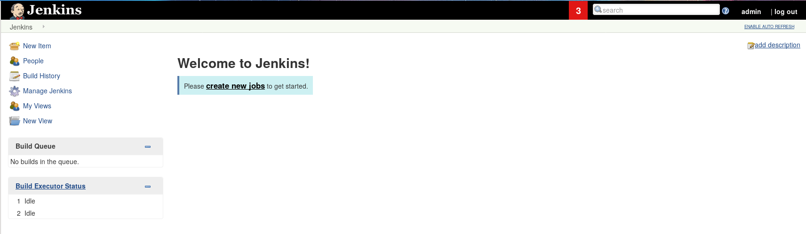
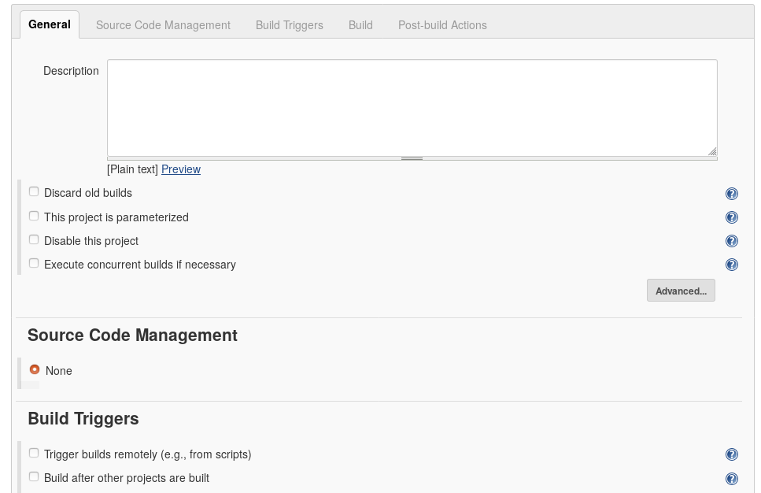
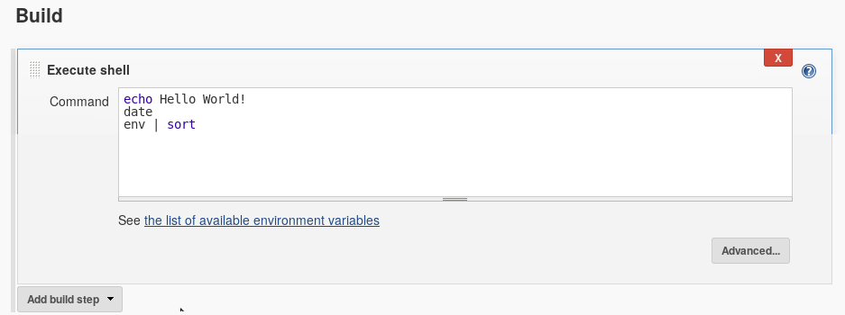
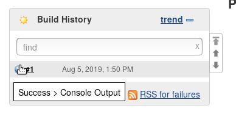
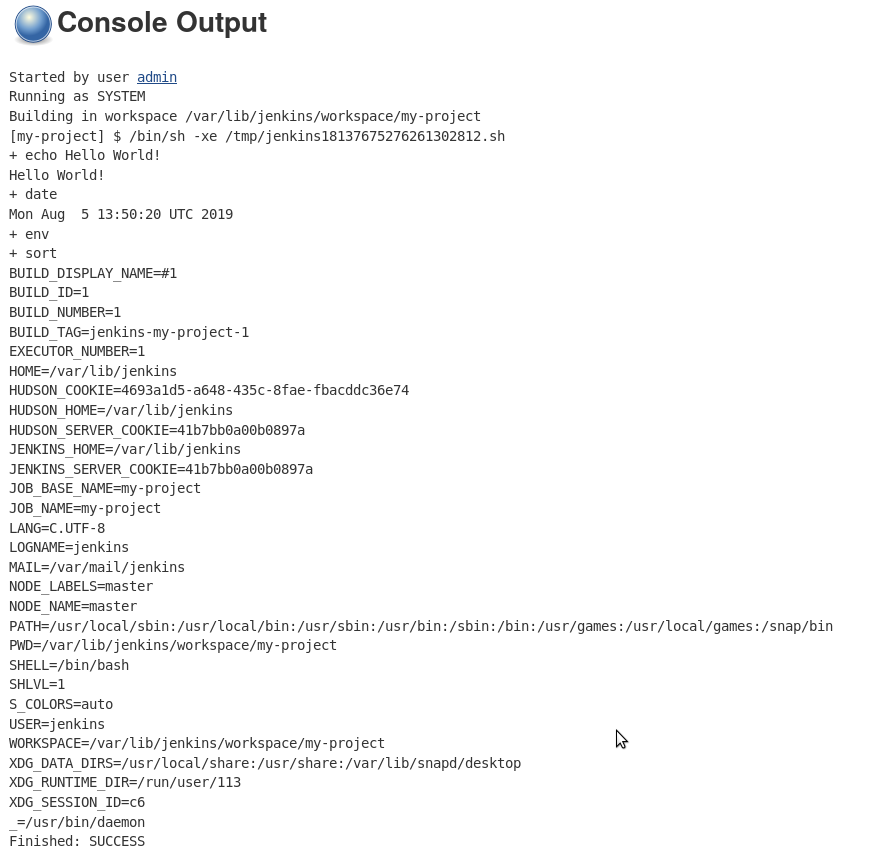
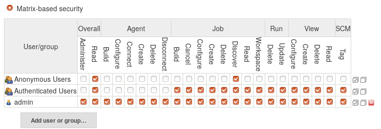

# Overview


Automation is a key component for making your life easier. There are dozens of regular, boring tasks involved in server administration, and many of these can be automated in order to make your life easier.
{CI} systems provide one way to accomplish this.
Many of these systems focus on testing and deploying code, and provide some built-in shortcuts to accomplish this.
Testing and deploying code boils down to "please run this command, when X happens", and they tend to function as "commands as a service".
You can often configure them to "test code when it is pushed to a branch on GitHub", or "test this code daily" or "deploy this code daily".
If you need to automatically run a command whenever some event happens, and then to report this back in some standardised way (GitHub PR statuses, automatically deploying, notifications in chat), then a CI system can do this for you.

There are many options for, some of these have different features which may be desirable in one or another scenario.
This tutorial will specifically cover automation with Jenkins as that is one of the tools `usegalaxy.*` use for a subset of their automation.

> <agenda-title></agenda-title>
>
> 1. TOC
> {:toc}
>
{: .agenda}

# Comparison of CI Systems

There are dozens of {CI} systems available meeting different needs, which CI system you want to use depends largely on the task you are trying to automate. A couple of key factors you may wish to consider are:

- How long will jobs run for? Free services often have time and log-output limits.
- Are you concerned about secret storage? Self-hosted can be a better option here, but it depends on your security posture and threat matrix.
- Do you have infrastructure available? Self-hosted could be worth it for the extra freedoms.

In general, self-hosted options have the overhead of managing and securing and updating the service, but offer significantly more freedom if you need it. They generally provide poor per-job isolation and assume you trust all of the jobs and people with access to build scripts used in the build pipeline. The free services (Travis, Circle CI) often have much better user-experiences and are easier to get started with and provide better out-of-the-box isolation.

We will look at setting up and managing a Jenkins server today, how to setup tasks, and some of the things that `usegalaxy.*` automate with their Jenkins servers.

# Infrastructure

As per many of the tutorials, we will use Ansible to setup and manage our Jenkins server so we can easily leverage the work of a large community. Jenkins is one choice, there are other self-hosted systems you could use, but it is the one with which many of us are familiar.

## Jenkins

> <hands-on-title>Setting up Jenkins</hands-on-title>
>
> 1. Edit your `requirements.yml` and add the following:
>
>    ```yaml
>    - src: geerlingguy.java
>      version: 1.10.0
>    - src: geerlingguy.jenkins
>      version: 3.7.0
>    ```
>
> 2. Install the requirements
>
>    ```
>    ansible-galaxy install -p roles -r requirements.yml
>    ```
>
> 3. Create a new playbook, `build.yml` with the following:
>
>    ```yaml
>    ---
>    - hosts: build
>      become: true
>      pre_tasks:
>        - name: Allow jenkins user to execute things as root
>          copy:
>            content: |
>              jenkins ALL=(ALL:ALL) NOPASSWD:ALL
>            dest: /etc/sudoers.d/jenkins
>            validate: 'visudo -cf %s'
>            mode: 0440
>      roles:
>        - geerlingguy.java
>        - geerlingguy.jenkins
>    ```
>
>    During this tutorial we will install everything on the same host, but often one keeps the build infrastructure on a separate host. We permit the Jenkins user to run everything as root, because later we will run Ansible with Jenkins, and we have `become: true` in our `galaxy.yml` playbook, so the `jenkins` user will need to be able to become root.
>
> 4. Edit the inventory file (`hosts`) an add a group for monitoring like:
>
>    ```ini
>    [build]
>    localhost ansible_connection=local
>    ```
>
> 5. Create and edit the group variables for the `build` group, `group_vars/build.yml`, and include the following:
>
>    ```yml
>    jenkins_http_port: 4000
>    jenkins_admin_username: admin
>    # Please change at least the password to something more suitable
>    jenkins_admin_password: admin
>    jenkins_url_prefix: /jenkins
>    jenkins_plugins:
>    - matrix-auth
>    ```
>
> 6. Run the build server playbook:
>
>    ```
>    ansible-playbook -i hosts build.yml
>    ```
>
> 7. Update the nginx configuration in `templates/nginx/galaxy.j2` to proxy jenkins with the following. Add it *before the last curly brace* at the end of the file.
>
>    ```nginx
>        location /jenkins {
>            proxy_set_header        Host $host:$server_port;
>            proxy_set_header        X-Real-IP $remote_addr;
>            proxy_set_header        X-Forwarded-For $proxy_add_x_forwarded_for;
>            proxy_set_header        X-Forwarded-Proto $scheme;
>
>            # Fix the "It appears that your reverse proxy set up is broken" error.
>            proxy_pass          http://127.0.0.1:4000;
>            proxy_read_timeout  90;
>        }
>    ```
>
> 8. Run the galaxy playbook which contains Nginx:
>
>    ```
>    ansible-playbook -i hosts galaxy.yml
>    ```
>
{: .hands_on}

With this, we're done, Jenkins is set up and ready to use!

# Building things with Jenkins

We will look at a couple basic cases of how to build things with Jenkins, and wrap up with some advanced usage documentation that is not so practical for a tutorial environment.

Start by **visiting your Jenkins instance**, at `https://your-domain/jenkins`



## A simple job

> <hands-on-title>Create a simple job</hands-on-title>
>
> 1. Visit your Jenkins and login with the credentials you set up in the group variables file
>
> 2. Click **New Item** in the left hand menu
>
> 3. Give your job a name like `my-project`, and select that it is a `freestyle project`, and click "OK"
>
>    
>
> 4. The job configuration interface is split into a few sections, visible in the tabs at the top of the page:
>
>    
>
> 5. In the **Build Triggers** section:
>
>    - Build Periodically
>        - *"Schedule"*: `H * * * * `
>
>    > <details-title>Cron syntax</details-title>
>    > Jenkins uses the [cron syntax](https://en.wikipedia.org/wiki/Cron#Overview), with the addition that `H` can be used to randomly choose a value for that place, rather than running at precisely that minute or hour. This allows you to spread the load of multiple jobs over a period of time, rather than having maybe 10 jobs all attempting to run simultaneously if they do not need to.
>    > For the above example it will choose one value for the `H`, a random minute in the hour, and then run every hour, every day, at that minute.
>    > You can enter different expressions to see when Jenkins would run it next.
>    {: .details}
>
> 6. Add a build step:
>
>    - Add build step
>        - **Click** "Execute shell"
>    - In the new step
>        - *"Command"*:
>          ```
>          echo Hello world!
>          date
>          env | sort
>          ```
>
>      
>
>    > <warning-title>Danger!</warning-title>
>    > This field allows you to execute arbitrary bash scripts. This is a reason Jenkins **must** be secured with HTTPS and a good username/password.
>    {: .warning}
>
>
> 7. Click **Save** at the bottom
>
> 8. You will be brought back to the job information page. Click **Build Now**
>
> 9. Your job will appear in the *Build History* box at the left. **Click** the ball associated with your job, to see the console.
>
>    
>
>    Clicking the number will bring you to a job information page, where you can click "Console Output" to see the jobs output
>
>    
{: .hands_on}

Setting up Jenkins jobs is as simple as setting up a cron job, but the results are stored in a nice visual interface that may provide better visibility than a `cron` job.

> <comment-title>Author's commentary</comment-title>
> Cron jobs are great and often useful, but most people ignore the emails that cron sends them. I know I have mailboxes across N servers with dozens and dozens of unread emails from cron jobs. Jenkins is an improvement here because it shows "success" and "failure" messages that are clear, while storing the output in case you later decide that you want to look at it. For the most part, cron jobs write output that is never read, and we really only want to see the output if something has failed, but writing a cron job that behaves like this is unnecessarily complex.
{: .comment}

## Ansible in Jenkins

We will now setup Jenkins to run Ansible on cron. In the [Galaxy Installation with Ansible]() tutorial we emphasised that it is useful to often run the entire playbook to ensure that all changes are applied. UseGalaxy.eu likes to accomplish this by having Jenkins run the playbooks every day. We know that even if our coworkers made some changes to the servers, that by tomorrow it will be reverted to a known-good configuration.

> <hands-on-title>Jenkins running Ansible</hands-on-title>
>
> 1. Go back to the Jenkins homepage (click the logo in the top left)
>
> 2. Click **New Item** in the left hand menu.
>
> 3. Give your job a name like "ansible-galaxy", and select that it is a "freestyle project", and click "OK"
>
> 4. Configure your job
>
>    - Build Triggers
>      - Build Periodically
>        - *"Schedule"*: `H * * * * `
>    - Build
>      - Add build step
>        - **Click** "Execute shell"
>      - In the new step
>        - *"Command"*:
>          ```
>          cd /home/ubuntu/galaxy/ # Change this to wherever your galaxy.yml is, you can check with the command pwd
>          ansible-playbook -i hosts galaxy.yml --diff
>          ```
>    - Save
>
> 5. Click **Build Now** and check the console output of the job
>
>    What do you see? It should look like Jenkins is running the playbook:
>
>    ```
>    Started by user admin
>    Running as SYSTEM
>    Building in workspace /var/lib/jenkins/workspace/ansible-galaxy
>    [ansible-galaxy] $ /bin/sh -xe /tmp/jenkins6010384499214486550.sh
>    + cd /home/ubuntu/galaxy/
>    + ansible-playbook -i hosts galaxy.yml --diff
>
>    PLAY [galaxyservers] ***********************************************************
>
>    TASK [Gathering Facts] *********************************************************
>    ok: [gcc-3.training.galaxyproject.eu]
>
>    TASK [Install Dependencies] ****************************************************
>     [WARNING]: Could not find aptitude. Using apt-get instead
>    ok: [gcc-3.training.galaxyproject.eu]
>    ```
>
{: .hands_on}

With this we have Jenkins running our playbook for us! You can imaging several steps you could take to follow up from this:

1. Storing your playbooks in `git` like UseGalaxy.\*
	- [UseGalaxy.eu's playbooks](https://github.com/usegalaxy-eu/infrastructure-playbook) are public, anyone can contribute and if the PR is merged, it is automatically applied to our infrastructure within the next day. We store our job configuration in here as well which specifies how much memory and how many CPUs tools receive. Our teammates often can contribute fixes themselves when they notice a tool needs more memory.
	- [UseGalaxy.org's playbooks](https://github.com/galaxyproject/infrastructure-playbook) are also public, but run manually.
2. Running this job regularly
	- This can prevent mistakes, if a coworker edits some configuration on the server and forgets to commit it, this ensures everything is reverted back to the expected state.
	- The amount of time the Galaxy playbook takes can be quite annoying when done manually but no one is upset if it takes 30 minutes when it is run on cron.
3. Alerting you if something went wrong
	- There are numerous plugins that can send notifications of build success/failure to various places like Slack, etc.

These are all next steps that are great to look into, and will make your systems more reliable and trustworthy as you will know when things change, and you can be certain that the code is configured how you specified.

# Securing Jenkins

You have already secured Jenkins in that it is protected with a good password and HTTPS. This is one important thing. The other portion is the visibility of jobs and their outputs. In the above Ansible Galaxy deployment job we set the parameter `--diff`, so we could see what changed. This is an extremely helpful thing to do to be able to audit changes from a particular run. But! If you change the `id_secret` or other secret variables, then this diff will be visible in the job's console logs. This is useful to see for admins but needs to be restricted so that the whole world cannot see this.

> <hands-on-title>Securing Jenkins</hands-on-title>
>
> 1. Return to the Jenkins home page
>
> 2. Click on **Manage Jenkins**
>
> 3. Click on **Configure Global Security**
>
>    1. In the first block *Access Control* Change the *Authorization* strategy from "Logged-in users can do anything" to "Matrix-based security"
>
>    2. Click "Add user or group" and add the `admin` user
>
>    3. Configure the permissions like below. Clicking on the checked checkbox icon at the right will allow you to enable/disable all of the checkboxes for that row.
>
>       
>
>       The matrix based security plugin is provided by a plugin, we installed this by setting the variable `jenkins_plugins: [matrix-auth]` in our group variables earlier.
>       The checkboxes give you the ability to grant or deny permissions to certain classes of users. Each column is an individual permission, and you can hover over each column to get more information about what that permission allows.
>
>       In the above example we have configured that:
>         - *Anonymous users* (not logged in) may `Read`, so they can access the Jenkins page, but by default will not see any jobs. The `Discover` permission is also granted so that if a user has bookmarked the ansible-galaxy job page, they will automatically be redirected through the login page, if they are not already logged in.
>         - Once they login and are *Authenticated Users*, they can see that `Manage` and `Run` Jobs and Views
>         - Only the *admin* user, however, can configure `Agents` to run those jobs.
>
>    3. Under **CSRF Protection**, check the box to prevent CSRF, and select the default crumb issuer, and then enable proxy compatibility.
>
> 4. Save
>
>    > <question-title></question-title>
>    >
>    > Try accessing your Jenkins from a private browsing session. How does it look?
>    >
>    > > <solution-title></solution-title>
>    > > It should appear as if there are no jobs, until you log in.
>    > {: .solution}
>    {: .question}
>
{: .hands_on}

# Advanced Topics

These topics are outside the scope of a training or do not lend themselves well to interesting exercises, but some discussion and configuration information will be provided below documenting common issues and questions that can be useful if you start using Jenkins "in anger".

## Updating Jenkins

Jenkins updates regularly due to security issues. We recommend that you either:

1. Regularly check the [Jenkins Changelog](https://jenkins.io/changelog/), and update the server whenever there are important security fixes
2. OR include some sort of yum or apt auto-updater on whichever system that Jenkins is running on

The downside of automatic updating is that Jenkins will restart and kill any jobs that had been running. Choose which works best for your environment. UseGalaxy.eu chose a completely automated setup because their jobs can be killed and few things are affected. UseGalaxy.org chose a more manual setup because their jobs are more critical, there if jobs fail, Galaxy pull request tests will fail unexpectedly and unhelpfully.

## Updating Plugins

Plugins also regularly receive updates due to security issues. You should either check in with your Jenkins server regularly and apply updates when they are available, or automate this as well. UseGalaxy.eu uses a script like:

```bash
#!/bin/bash
ARGS="-jar /opt/jenkins-cli.jar -s http://localhost:4000/ -auth user:password"
UPDATE_LIST=$(java $ARGS list-plugins | grep ')$' | awk '{print $1}')

if [ ! -z "${UPDATE_LIST}" ]; then
    echo Updating Jenkins Plugins: ${UPDATE_LIST};
    java $ARGS install-plugin ${UPDATE_LIST};
    java $ARGS safe-restart;
fi
```

And we run this on cron hourly. The `safe-restart` at the end causes Jenkins to stop processing new jobs, and wait until all jobs are complete before restarting. Unfortunately this is not an option for Jenkins server updates.

## Plugins

Jenkins provides an impressive number of plugins for a lot of different environments. Here are some of the ones we use and their purposes:

Plugin                           | Comments
------                           | --------
Git Plugin                       | Allow cloning git repositories to build
Build Timeout                    | Allows us to automatically kill jobs which run longer than we expect. We can use this to set per-build timeouts
Credentials Binding Plugin       | This can be used to inject secrets into builds, e.g. vault passwords. <!-- TODO: use this with vault in ansible-galaxy tuto -->
Embeddable Build Status Plugin   | Produces nice build statuses like Travis does, e.g. [UseGalaxy.eu's playbook statuses](https://github.com/usegalaxy-eu/infrastructure-playbook#build-statuses)
GitHub Authentication plugin     | The UseGalaxy.eu build server requires login with GitHub and ensures membership in the correct organisation to be able to access group secrets and build logs.
Job Configuration History plugin | This plugin tracks changes made in the configuration of jobs over time, so you can see what was changed in the Jenkins configuration which may have caused the job to start succeeding or failing.
ShiningPanda Plugin              | Allows easily running jobs within a per-job python virtualenv.
SSH Agent Plugin                 | Allows providing specific SSH credentials to a build

These plugins can be installed via the Ansible automation by expanding `jenkins_plugins` in your `group_vars/build.yml`, or installed with the web interface.

### Source Code Management

Jenkins supports most VCSs that are in use today. For the Git plugin, it allows you to clone a git repository into the job's directory, and then run scripts from there. It forms the foundation of most jobs.

You may need to specify credentials for cloning from private repositories, in this case you should beware that when you configure the SSH credentials you should specify the `user` as `git`. You will also need to ensure that the server's SSH public key is known to your Jenkins system which generally requires `su`ing as the Jenkins user and running `ssh git@...` once, and accepting the "Unknown host" key prompt. We recommend that you use repository URLs of the format `git@github.com:org/repo.git`, if you are using one of the GitHub PR builder plugins, then this URL has to match a value in the incoming webhook and it is not always obvious that this needs to be set like this.

The "Branches to build" section allows you to specify which branches. Whenever you click "Build now", Jenkins usually just picks the main branch to build, and doesn't run a build job per-branch. If you are automatically triggering Jenkins builds based on GitHub (or other) webhooks, then you can ensure that branches that should not be built are filtered out here. Real life example: UseGalaxy.eu has one Jenkins job which should only build the main branch of a repository, and another job that only builds the PRs for that repository. We know the first job will only ever build the main branch so we can hardcode that there. With the Git plugin, many "Additional Behaviours" are available. If you have submodules in your repository, you will need to enable one of these to ensure that the repository is cloned recursively. If you want to ensure a fresh start each time because you write out temporary files to the current working directory, then there is a behaviour to wipe out the repository before each build.

### Build Triggers

The GitHub Pull Request Builder plugin is not always easy to configure, here systems like Travis are generally significantly easier. Consider if that is an option. It is not a bad thing to use multiple {CI} systems, it provides some degree of redundancy where if one system is experiencing an outage it may not affect all CI jobs.

### Credential Binding

If you provide credentials to Jenkins builds, they will automatically be stripped from log outputs. So if your job will not "leak" any private information (e.g. in `--diff`) and you want to share the build logs with your users to prove that actions were taken or that things are working and automated, then the credential binding plugin ensures that any secrets will be stripped from output and replaced with `******`. They can be made available as environment variables, or in files that can be accessed.

We often upload a configuration file with secrets (e.g. `.parsec.yml` ), and then can just call our software `parsec -c $PARSEC_CONFIG_FILE_LOCATION ...` passing in that file, wherever Jenkins has stored it securely.

### SSH Agent

This allows you to automatically inject credentials into your build's SSH agent. If you want to `rsync` some build outputs to another server, or `ssh` to a server to run some one-off command, or to run `ansible`, then this is the feature you want. Beware that if you are pulling from and pushing to git repositories on GitHub with separate SSH credentials you may need to use a combination of the SSH Agent plugin, and injecting an SSH key through credential binding.

## Real Life Examples

Here are some examples of how Jenkins is used in the wild, maybe it can provide some reference for potential uses within your organisation or solutions to various problems. The examples are mostly pulled from UseGalaxy.eu's experiences, as the author is most familiar with those.

### Compute Nodes

We attach VMs as compute nodes for Jenkins to use as executors. We have an OpenStack cloud available so that is an easy option for us. We setup the VMs such that Jenkins just logs in as the default `centos` user and uses the home directory for building jobs. There is a Jenkins plugin to manage the VMs in the cloud automatically (scaling up/down as necessary, removing VMs with full disk) but our cloud was upgraded and we could not get this working. It is worth trying if that is an option! There are other cloud provider plugins available with similar features.

We also use a custom image that includes a lot of our requirements pre-installed. We include e.g. LaTeX, Ruby/RVM, Java, Node, anything we think we might need for our jobs. This also lets us reduce the privileges of the jobs, nothing *needs* `root` access to install packages globally. Python, Ruby, and Node all have something similar to virtualenvs.

### Job: Apollo Builder

This is a relatively straightforward job to build a WAR file and upload it to our depot server.

```console
# some env vars that are needed, it's kind of gross but it works :(
export JAVA_HOME=/usr/lib/jvm/java-1.8.0-openjdk-1.8.0.212.b04-0.el7_6.x86_64/
export PERL5LIB=/home/centos/workspace/usegalaxy-eu/apollo-builder/extlib/lib/perl5:$PERL5LIB
# setting a variable from some build data
APOLLO_VERSION=$(cat application.properties | grep app.version | sed 's/.*=//g')

# Check if this version needs to be built
curl --silent https://usegalaxy.eu/static/vgcn/ | \
	grep -F "apollo-${APOLLO_VERSION}" && echo "Already built!" && exit 0;

# Build the thing
./apollo deploy

# Deploy it to our server
scp -i $PRIV_KEY \
	target/*.war \
    user@server:/static/apollo-${APOLLO_VERSION}.war
```

- We use the "Secret file" binding to inject a specific private key (available in the build as `$PRIV_KEY`) but the SSH agent plugin would work equally well.
- We could also use the "Archive Artifacts" plugin to have Jenkins retain all of the artefacts (build outputs that you care about) but we wanted to have an Ansible role pull those files and it was simpler to have them accessible at predictable URLs.

### Job: Chado Schema Builder

Similar to the Apollo builder but it uploads outputs as GitHub releases which is useful for public projects with complex build pipelines. The CSB takes on average 5-6 hours to run so we cannot easily run this on free infrastructure.

Here we store both the [build](https://github.com/hexylena/chado-schema-builder/blob/master/.ci/run.sh) and [deploy](https://github.com/hexylena/chado-schema-builder/blob/master/.ci/upload.sh) scripts in the GitHub repository. If you do this, you have to be careful about building PRs, as anyone can edit the build scripts and access your internal infrastructure!

### Job: Website

We build our own Jekyll website because we have some plugins GitHub will not compile for us. The configuration here is more complex:

- Throttle builds, since GitHub will only accept so many deploy requests in a time period
- One SSH key used to clone the repository using the Git SCM, with "Wipe out repository & force clone" set.
- Triggers on both:
  - Cron, daily
  - GitHub webhooks notifying us of pushes to master
- SSH Agent is configured with a deploy SSH key (because git really prefers you provide keys in the SSH agent, I don't know if it is possible to pass a keyfile on the CLI)
- The [.build.sh](https://github.com/usegalaxy-eu/website/blob/master/.build.sh) is run which activates the RVM pre-installed on the VMs
- If the master branch is checked out, [`.publish.sh`](https://github.com/usegalaxy-eu/website/blob/master/.publish.sh) is run
- Empty [`.nojekyll`](https://github.com/usegalaxy-eu/website/blob/master/.nojekyll) file to prevent GitHub from trying to build this.

### Job: Install Tools

For this job we use Jenkin's "Trigger other builds" feature:
- We have one job that fetches all of the latest updates for IUC tools and writes those into yaml files. This job runs on cron every week.
- This triggers a separate job to actually apply the changes to our server.

By splitting these up, we can run the "actually apply" portion without having to fetch updates to the tools first. Additionally we can have the second portion run only if the first portion succeeds, so we have some check that everything looks OK before trying to apply it.

We include a Galaxy API key as a credential and then use a `Makefile` contained in the project to do the steps. We don't automatically test PRs so we don't care if people change the Makefile because we visually validate it before merging their PR.

### Configuration: Themes

Many people find the "blue/red ball" icons a bit hard to understand. Using the "Simple Theme Plugin" you can easily add custom CSS files or directly enter custom CSS. UseGalaxy.\* use the [jenkins-material-theme](http://afonsof.com/jenkins-material-theme/) as it provides a slightly cleaner view of Jenkins with better iconography.

### Configuration: Folder Permissions

We have the aforementioned problem that our playbooks run with `--diff` and while we want to capture this output and be able to review it, it is not necessary that the public can see it. So permissions are configured not only on the global Jenkins level, but also within a single folder of jobs. The folder permissions involve setting:

- Properties
  - *"Inheritance Strategy"*: `Do not inherit permission grants from other ACLs`
  - Allowing `Discover` and nothing else for Anonymous + Authenticated
  - Explicitly granting all permissions for the admins
