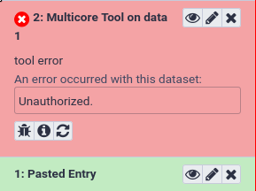

This tutorial heavily builds on the [Connecting Galaxy to a compute cluster]() and it's expected you have completed this tutorial first.

Now that you have a working scheduler, we will start configuring which jobs are sent to which destinations.



> <agenda-title></agenda-title>
>
> 1. TOC
> {:toc}
>
{: .agenda}



# Galaxy and Slurm - Statically Mapping a Job

We don't want to overload our training VMs trying to run real tools, so to demonstrate how to map a multicore tool to a multicore destination, we'll create a fake tool.

## Writing a testing tool

> <hands-on-title>Deploying a Tool</hands-on-title>
>
> 1. Create the directory `files/galaxy/tools/` if it doesn't exist and edit a new file in `files/galaxy/tools/testing.xml` with the following contents:
>
>    
>    ```diff
>    --- /dev/null
>    +++ b/files/galaxy/tools/testing.xml
>    @@ -0,0 +1,11 @@
>    +<tool id="testing" name="Testing Tool">
>    +    <command>
>    +        <![CDATA[echo "Running with '\${GALAXY_SLOTS:-1}' threads" > "$output1"]]>
>    +    </command>
>    +    <inputs>
>    +        <param name="input1" type="data" format="txt" label="Input Dataset"/>
>    +    </inputs>
>    +    <outputs>
>    +        <data name="output1" format="txt" />
>    +    </outputs>
>    +</tool>
>    
>    ```
>    {: data-commit="Add testing tool"}
>
>    
>
> 2. Add the tool to the Galaxy group variables under the new item `galaxy_local_tools` :
>
>    
>    ```diff
>    --- a/group_vars/galaxyservers.yml
>    +++ b/group_vars/galaxyservers.yml
>    @@ -96,6 +96,9 @@ galaxy_config_templates:
>       - src: templates/galaxy/config/dependency_resolvers_conf.xml
>         dest: "{{ galaxy_config.galaxy.dependency_resolvers_config_file }}"
>     
>    +galaxy_local_tools:
>    +- testing.xml
>    +
>     # systemd
>     galaxy_manage_systemd: true
>     galaxy_systemd_env: [DRMAA_LIBRARY_PATH="/usr/lib/slurm-drmaa/lib/libdrmaa.so.1"]
>    
>    ```
>    {: data-commit="Deploy testing tool"}
>
> 3. Run the Galaxy playbook.
>
>    > <code-in-title>Bash</code-in-title>
>    > ```bash
>    > ansible-playbook galaxy.yml
>    > ```
>    > {: data-cmd="true"}
>    {: .code-in}
>
> 4. Reload Galaxy in your browser and the new tool should now appear in the tool panel. If you have not already created a dataset in your history, upload a random text dataset. Once you have a dataset, click the tool's name in the tool panel, then click Execute.
>
>    > <question-title></question-title>
>    >
>    > What is the tool's output?
>    >
>    > > <solution-title></solution-title>
>    > >
>    > > ```
>    > > Running with '1' threads
>    > > ```
>    > >
>    > {: .solution }
>    >
>    {: .question}
{: .hands_on}

> ```bash
> 1.sh
> ```
> {: data-test="true"}
{: .hidden}

Of course, this tool doesn't actually *use* the allocated number of cores. In a real tool, you would call the tools's underlying command with whatever flag that tool provides to control the number of threads or processes it starts, such as `samtools sort -@ \${GALAXY_SLOTS:-1}`.

## Running with more resources

We want our tool to run with more than one core. To do this, we need to instruct Slurm to allocate more cores for this job. This is done in the job configuration file.


> <hands-on-title>Allocating more resources</hands-on-title>
>
> 1. Edit your `templates/galaxy/config/job_conf.yml.j2` and add the following destination. Then, map the new tool to the new destination using the tool ID (`<tool id="testing">`) and destination id (`<destination id="slurm-2c">`) by adding a new section to the job config, `<tools>`, below the destinations:
>
>    
>    ```diff
>    --- a/templates/galaxy/config/job_conf.yml.j2
>    +++ b/templates/galaxy/config/job_conf.yml.j2
>    @@ -20,6 +20,17 @@ execution:
>             value: /tmp/singularity
>           - name: SINGULARITY_TMPDIR
>             value: /tmp
>    +    slurm-2c:
>    +      runner: slurm
>    +      singularity_enabled: true
>    +      native_specification: --nodes=1 --ntasks=1 --cpus-per-task=2
>    +      env:
>    +      - name: LC_ALL
>    +        value: C
>    +      - name: SINGULARITY_CACHEDIR
>    +        value: /tmp/singularity
>    +      - name: SINGULARITY_TMPDIR
>    +        value: /tmp
>         singularity:
>           runner: local_runner
>           singularity_enabled: true
>    @@ -37,3 +48,5 @@ execution:
>     tools:
>     - class: local # these special tools that aren't parameterized for remote execution - expression tools, upload, etc
>       environment: local_dest
>    +- id: testing
>    +  environment: slurm-2c
>    
>    ```
>    {: data-commit="Configure testing tool in job conf"}
>
> 3. Run the Galaxy playbook. Because we modified `job_conf.yml`, Galaxy will be restarted to reread its config files.
>
>    > <code-in-title>Bash</code-in-title>
>    > ```bash
>    > ansible-playbook galaxy.yml
>    > ```
>    > {: data-cmd="true"}
>    {: .code-in}
>
> 4. Click the rerun button on the last history item, or click **Testing Tool** in the tool panel, and then click the tool's Execute button.
>
>    > <question-title></question-title>
>    >
>    > What is the tool's output?
>    >
>    > > <solution-title></solution-title>
>    > >
>    > > ```
>    > > Running with '2' threads
>    > > ```
>    > >
>    > {: .solution }
>    >
>    {: .question}
>
{: .hands_on}

> ```bash
> 2.sh
> ```
> {: data-test="true"}
{: .hidden}


# Dynamic Job Destinations

Dynamic destinations allow you to write custom python code to dispatch jobs based on whatever rules you like. For example, UseGalaxy.eu at one point used a very complex custom dispatching configuration to handle sorting jobs between multiple clusters. Galaxy has [extensive documentation](https://docs.galaxyproject.org/en/latest/admin/jobs.html#dynamic-destination-mapping-python-method) on how to write these sort of destinations.

> <hands-on-title>Writing a dynamic job destination</hands-on-title>
>
> 1. Create and open `files/galaxy/dynamic_job_rules/my_rules.py`
>
>    
>    ```diff
>    --- /dev/null
>    +++ b/files/galaxy/dynamic_job_rules/my_rules.py
>    @@ -0,0 +1,10 @@
>    +from galaxy.jobs import JobDestination
>    +from galaxy.jobs.mapper import JobMappingException
>    +import os
>    +
>    +def admin_only(app, user_email):
>    +    # Only allow the tool to be executed if the user is an admin
>    +    admin_users = app.config.get( "admin_users", "" ).split( "," )
>    +    if user_email not in admin_users:
>    +        raise JobMappingException("Unauthorized.")
>    +    return JobDestination(runner="slurm")
>    
>    ```
>    {: data-commit="Add my rules python script"}
>
>    This destination will check that the `user_email` is in the set of `admin_users` from your config file.
>
>    > <tip-title>Debugging dynamic destinations</tip-title>
>    > You can use `pdb` for more advanced debugging, but it requires some configuration. `print()` statements are usually sufficient and easier.
>    {: .tip}
>
> 2. As usual, we need to instruct Galaxy of where to find this file:
>
>    Edit your group variables file and add the following:
>
>    
>    ```diff
>    --- a/group_vars/galaxyservers.yml
>    +++ b/group_vars/galaxyservers.yml
>    @@ -98,6 +98,8 @@ galaxy_config_templates:
>     
>     galaxy_local_tools:
>     - testing.xml
>    +galaxy_dynamic_job_rules:
>    +- my_rules.py
>     
>     # systemd
>     galaxy_manage_systemd: true
>    
>    ```
>    {: data-commit="Deploy my_rules dynamic rule"}
>
> 3. We next need to configure this plugin in our job configuration:
>
>    
>    ```diff
>    --- a/templates/galaxy/config/job_conf.yml.j2
>    +++ b/templates/galaxy/config/job_conf.yml.j2
>    @@ -44,6 +44,9 @@ execution:
>           # Singularity uses a temporary directory to build the squashfs filesystem
>           - name: SINGULARITY_TMPDIR
>             value: /tmp
>    +    dynamic_admin_only:
>    +      runner: dynamic
>    +      function: admin_only
>     
>     tools:
>     - class: local # these special tools that aren't parameterized for remote execution - expression tools, upload, etc
>    
>    ```
>    {: data-commit="Add dynamic admin only destination"}
>
>    This is a **Python function dynamic destination**. Galaxy will load all python files in the `{{ galaxy_dynamic_rule_dir }}`, and all functions defined in those will be available `my_rules.py` to be used in the `job_conf.yml`
>
> 4. Finally, in `job_conf.yml`, update the `<tool>` definition and point it to this destination:
>
>    
>    ```diff
>    --- a/templates/galaxy/config/job_conf.yml.j2
>    +++ b/templates/galaxy/config/job_conf.yml.j2
>    @@ -52,4 +52,4 @@ tools:
>     - class: local # these special tools that aren't parameterized for remote execution - expression tools, upload, etc
>       environment: local_dest
>     - id: testing
>    -  environment: slurm-2c
>    +  environment: dynamic_admin_only
>    
>    ```
>    {: data-commit="Send testing tool to the dynamic admin only destination."}
>
> 5. Run the Galaxy playbook.
>
>    > <code-in-title>Bash</code-in-title>
>    > ```bash
>    > ansible-playbook galaxy.yml
>    > ```
>    > {: data-cmd="true"}
>    {: .code-in}
>
> 6. Try running the tool as both an admin user and a non-admin user, non-admins should not be able to run it. You can start a private browsing session to test as a non-admin, anonymous user. Anonymous users were enabled in your Galaxy configuration.
>
> 
>
{: .hands_on}


You can imagine extending this to [complex logic for permissions](https://galaxyproject.org/admin/config/access-control/), or for destination mapping depending on numerous factors. We did not cover it, but in the documentation you can add additional variables to your function signature, and they will be automatically supplied. Some useful variables are `tool`, `user`, `job`, and `app` if you need to load configuration information, and more [can be found in the documentation](https://docs.galaxyproject.org/en/master/admin/jobs.html#dynamic-destination-mapping-python-method).

# Dynamically map a tool to a job destination

If you don't want to write dynamic destinations yourself, Dynamic Tool Destinations (DTDs) utilize the dynamic job runner to provide dynamic job mapping functionality without having to explicitly write code to perform the mapping. The mapping functionality is mostly limited to input sizes, but often input size is the most important factor in deciding what resources to allocate for a job.

## Writing a Dynamic Tool Destination

> <hands-on-title>Writing a DTD</hands-on-title>
>
> 1. Dynamic tool destinations are configured via a YAML file. As before, we'll use a fake example but this is extremely useful in real-life scenarios. Create the file `templates/galaxy/config/tool_destinations.yml` with the following contents:
>
>    
>    ```diff
>    --- /dev/null
>    +++ b/templates/galaxy/config/tool_destinations.yml
>    @@ -0,0 +1,11 @@
>    +---
>    +tools:
>    +  testing:
>    +    rules:
>    +      - rule_type: file_size
>    +        lower_bound: 16
>    +        upper_bound: Infinity
>    +        destination: slurm-2c
>    +    default_destination: slurm
>    +default_destination: slurm
>    +verbose: True
>    
>    ```
>    {: data-commit="Add tool destinations conf"}
>
>    The rule says:
>    - If the tool has ID `testing`:
>      - If the input dataset is >=16 bytes, run on the destination `slurm-2c`
>      - If the input dataset is <16 bytes, run on the destination `slurm`
>    - Else, run on the destination `slurm`
>
> 2. We also need to inform Galaxy of the path to the file we've just created, which is done using the `tool_destinations_config_file` in `galaxy_config` > `galaxy`. Additionally we need to add a `galaxy_config_templates` entry to ensure it is deployed.
>
>    
>    ```diff
>    --- a/group_vars/galaxyservers.yml
>    +++ b/group_vars/galaxyservers.yml
>    @@ -29,6 +29,7 @@ miniconda_manage_dependencies: false
>     
>     galaxy_config:
>       galaxy:
>    +    tool_destinations_config_file: "{{ galaxy_config_dir }}/tool_destinations.yml"
>         library_import_dir: /libraries/admin
>         user_library_import_dir: /libraries/user
>         dependency_resolvers_config_file: "{{ galaxy_config_dir }}/dependency_resolvers_conf.xml"
>    @@ -95,6 +96,8 @@ galaxy_config_templates:
>         dest: "{{ galaxy_config.galaxy.containers_resolvers_config_file }}"
>       - src: templates/galaxy/config/dependency_resolvers_conf.xml
>         dest: "{{ galaxy_config.galaxy.dependency_resolvers_config_file }}"
>    +  - src: templates/galaxy/config/tool_destinations.yml
>    +    dest: "{{ galaxy_config.galaxy.tool_destinations_config_file }}"
>     
>     galaxy_local_tools:
>     - testing.xml
>    
>    ```
>    {: data-commit="Deploy tool destinations config file"}
>
> 3. We need to update Galaxy's job configuration to use this rule. Open `templates/galaxy/config/job_conf.yml.j2` and add a DTD destination.
>    Also, comment out or remove the previous `<tool>` definition for the `testing` tool, and replace it with a mapping to the dtd destination like so:
>
>    
>    ```diff
>    --- a/templates/galaxy/config/job_conf.yml.j2
>    +++ b/templates/galaxy/config/job_conf.yml.j2
>    @@ -47,9 +47,12 @@ execution:
>         dynamic_admin_only:
>           runner: dynamic
>           function: admin_only
>    +    dtd:
>    +      runner: dynamic
>    +      type: dtd
>     
>     tools:
>     - class: local # these special tools that aren't parameterized for remote execution - expression tools, upload, etc
>       environment: local_dest
>     - id: testing
>    -  environment: dynamic_admin_only
>    +  environment: dtd
>    
>    ```
>    {: data-commit="Configure dtd in job conf"}
>
> 4. Run the Galaxy playbook.
>
>    > <code-in-title>Bash</code-in-title>
>    > ```bash
>    > ansible-playbook galaxy.yml
>    > ```
>    > {: data-cmd="true"}
>    {: .code-in}
>
{: .hands_on}

## Testing the DTD

Our rule specified that any invocation of the `testing` tool with an input dataset with size <16 bytes would run on the 1 core destination, whereas any with >= 16 bytes would run on the 2 core destination.

> <hands-on-title>Testing the DTD</hands-on-title>
>
> 1. Create a dataset using the upload paste tool with a few (<16) characters
>
> 2. Create a dataset using the upload paste tool with >16 characters
>
> 3. Run the `Testing Tool` on both datasets.
>
{: .hands_on}

> ```bash
> 3.sh
> ```
> {: data-test="true"}
{: .hidden}

You can imagine using this to run large blast jobs on compute hardware with more resources, or giving them more CPU cores. Some tools require more memory as job inputs increase, you can use this to run tools with a larger memory limit, if you know it will need it to process a certain size of inputs.

# Job Resource Selectors

You may find that certain tools can benefit from having form elements added to them to allow for controlling certain job parameters, so that users can select based on their own knowledge. For example, a user might know that a particular set of parameters and inputs to a certain tool needs a larger memory allocation than the standard amount for a given tool. This of course assumes that your users are well behaved enough not to choose the maximum whenever available, although such concerns can be mitigated somewhat by the use of concurrency limits on larger memory destinations.

Such form elements can be added to tools without modifying each tool's configuration file through the use of the **job resource parameters configuration file**

> <hands-on-title>Configuring a Resource Selector</hands-on-title>
>
> 1. Create and open `templates/galaxy/config/job_resource_params_conf.xml.j2`
>
>    
>    ```diff
>    --- /dev/null
>    +++ b/templates/galaxy/config/job_resource_params_conf.xml.j2
>    @@ -0,0 +1,7 @@
>    +<parameters>
>    +    <param label="Cores" name="cores" type="select" help="Number of cores to run job on.">
>    +        <option value="1">1 (default)</option>
>    +        <option value="2">2</option>
>    +    </param>
>    +  <param label="Time" name="time" type="integer" size="3" min="1" max="24" value="1" help="Maximum job time in hours, 'walltime' value (1-24). Leave blank to use default value." />
>    +</parameters>
>    
>    ```
>    {: data-commit="Add job resource params configuration"}
>
>    This defines two resource fields, a select box where users can choose between 1 and 2 cores, and a text entry field where users can input an integer value from 1-24 to set the walltime for a job.
>
> 2. As usual, we need to instruct Galaxy of where to find this file:
>
>    
>    ```diff
>    --- a/group_vars/galaxyservers.yml
>    +++ b/group_vars/galaxyservers.yml
>    @@ -90,6 +90,8 @@ galaxy_config:
>               - workflow-scheduler
>     
>     galaxy_config_templates:
>    +  - src: templates/galaxy/config/job_resource_params_conf.xml.j2
>    +    dest: "{{ galaxy_config.galaxy.job_resource_params_file }}"
>       - src: templates/galaxy/config/job_conf.yml.j2
>         dest: "{{ galaxy_config.galaxy.job_config_file }}"
>       - src: templates/galaxy/config/container_resolvers_conf.xml.j2
>    
>    ```
>    {: data-commit="Deploy job resource params configuration"}
>
> 3. Next, we define a new section in `job_conf.yml`: `<resources>`. This groups together parameters that should appear together on a tool form. Add the following section to your `templates/galaxy/config/job_conf.yml.j2`:
>
>    
>    ```diff
>    --- a/templates/galaxy/config/job_conf.yml.j2
>    +++ b/templates/galaxy/config/job_conf.yml.j2
>    @@ -51,6 +51,12 @@ execution:
>           runner: dynamic
>           type: dtd
>     
>    +resources:
>    +  default: default
>    +  groups:
>    +    default: []
>    +    testing: [cores, time]
>    +
>     tools:
>     - class: local # these special tools that aren't parameterized for remote execution - expression tools, upload, etc
>       environment: local_dest
>    
>    ```
>    {: data-commit="Configure resources in job conf"}
>
>    The group ID will be used to map a tool to job resource parameters, and the text value of the `<group>` tag is a comma-separated list of `name`s from `job_resource_params_conf.xml` to include on the form of any tool that is mapped to the defined `<group>`.
>
>
> 4. Finally, in `job_conf.yml`, move the previous `<tool>` definition for the `testing` tool into the comment and define a new `<tool>` that defines the `resources` for the tool:
>
>    
>    ```diff
>    --- a/templates/galaxy/config/job_conf.yml.j2
>    +++ b/templates/galaxy/config/job_conf.yml.j2
>    @@ -61,4 +61,5 @@ tools:
>     - class: local # these special tools that aren't parameterized for remote execution - expression tools, upload, etc
>       environment: local_dest
>     - id: testing
>    -  environment: dtd
>    +  environment: dynamic_cores_time
>    +  resources: testing
>    
>    ```
>    {: data-commit="Configure resources in job conf"}
>
> 5. We have assigned the `testing` tool to a new destination: `dynamic_cores_time`, but this destination does not exist. We need to create it. Add the following destination in your job conf:
>
>    
>    ```diff
>    --- a/templates/galaxy/config/job_conf.yml.j2
>    +++ b/templates/galaxy/config/job_conf.yml.j2
>    @@ -50,6 +50,9 @@ execution:
>         dtd:
>           runner: dynamic
>           type: dtd
>    +    dynamic_cores_time:
>    +      runner: dynamic
>    +      function: dynamic_cores_time
>     
>     resources:
>       default: default
>    
>    ```
>    {: data-commit="Add dynamic_cores_time destination"}
>
>    This will be another dynamic destination. Galaxy will load all python files in the `{{ galaxy_dynamic_rule_dir }}`, and all functions defined in those will be available `dynamic_cores_time` to be used in the `job_conf.yml`
>
{: .hands_on}

This will set everything up to use the function. We have:

- A set of "job resources" defined which will let the user select the number of cores and walltime.
- A job configuration which says:
    - that our testing tool should allow selection of the cores and time parameters
    - directs it to use a new, `dynamic_cores_time` destination
    - and a has a new destination, `dynamic_cores_time`, which is defined as a dynamic destination which will call a python function we will load.

This is a lot but we're still missing the last piece for it to work:

## A dynamic destination

Lastly, we need to write the rule that will read the value of the job resource parameter form fields and decide how to submit the job.

> <hands-on-title>Writing a dynamic destination</hands-on-title>
>
> 1. Create and edit `files/galaxy/dynamic_job_rules/map_resources.py`. Create it with the following contents:
>
>    
>    ```diff
>    --- /dev/null
>    +++ b/files/galaxy/dynamic_job_rules/map_resources.py
>    @@ -0,0 +1,42 @@
>    +import logging
>    +from galaxy.jobs.mapper import JobMappingException
>    +
>    +log = logging.getLogger(__name__)
>    +
>    +DESTINATION_IDS = {
>    +    1 : 'slurm',
>    +    2 : 'slurm-2c'
>    +}
>    +FAILURE_MESSAGE = 'This tool could not be run because of a misconfiguration in the Galaxy job running system, please report this error'
>    +
>    +
>    +def dynamic_cores_time(app, tool, job, user_email):
>    +    destination = None
>    +    destination_id = 'slurm'
>    +
>    +    # build the param dictionary
>    +    param_dict = job.get_param_values(app)
>    +
>    +    if param_dict.get('__job_resource', {}).get('__job_resource__select') != 'yes':
>    +        log.info("Job resource parameters not seleted, returning default destination")
>    +        return destination_id
>    +
>    +    # handle job resource parameters
>    +    try:
>    +        # validate params
>    +        cores = int(param_dict['__job_resource']['cores'])
>    +        time = int(param_dict['__job_resource']['time'])
>    +        destination_id = DESTINATION_IDS[cores]
>    +        destination = app.job_config.get_destination(destination_id)
>    +        # set walltime
>    +        if 'nativeSpecification' not in destination.params:
>    +            destination.params['nativeSpecification'] = ''
>    +        destination.params['nativeSpecification'] += ' --time=%s:00:00' % time
>    +    except:
>    +        # resource param selector not sent with tool form, job_conf.yml misconfigured
>    +        log.warning('(%s) error, keys were: %s', job.id, param_dict.keys())
>    +        raise JobMappingException(FAILURE_MESSAGE)
>    +
>    +    log.info('returning destination: %s', destination_id)
>    +    log.info('native specification: %s', destination.params.get('nativeSpecification'))
>    +    return destination or destination_id
>    
>    ```
>    {: data-commit="Add map_resources python"}
>
>    It is important to note that **you are responsible for parameter validation, including the job resource selector**. This function only handles the job resource parameter fields, but it could do many other things - examine inputs, job queues, other tool parameters, etc.
>
>
> 2. As usual, we need to instruct Galaxy of where to find this file:
>
>    
>    ```diff
>    --- a/group_vars/galaxyservers.yml
>    +++ b/group_vars/galaxyservers.yml
>    @@ -29,6 +29,7 @@ miniconda_manage_dependencies: false
>     
>     galaxy_config:
>       galaxy:
>    +    job_resource_params_file: "{{ galaxy_config_dir }}/job_resource_params_conf.xml"
>         tool_destinations_config_file: "{{ galaxy_config_dir }}/tool_destinations.yml"
>         library_import_dir: /libraries/admin
>         user_library_import_dir: /libraries/user
>    @@ -105,6 +106,7 @@ galaxy_local_tools:
>     - testing.xml
>     galaxy_dynamic_job_rules:
>     - my_rules.py
>    +- map_resources.py
>     
>     # systemd
>     galaxy_manage_systemd: true
>    
>    ```
>    {: data-commit="Deploy map_resources.py"}
>
> 3. Run the Galaxy playbook.
>
>    > <code-in-title>Bash</code-in-title>
>    > ```bash
>    > ansible-playbook galaxy.yml
>    > ```
>    > {: data-cmd="true"}
>    {: .code-in}
>
> 4. Run the **Testing Tool** with various resource parameter selections
>
>    - Use default job resource parameters
>    - Specify job resource parameters:
>      - 1 core
>      - 2 cores
>      - Some value for walltime from 1-24
>
{: .hands_on}

The cores parameter can be verified from the output of the tool. The walltime can be verified with `scontrol`:

> <code-in-title>Bash</code-in-title>
> Your job number may be different.
> ```
> scontrol show job 24
> ```
{: .code-in}

> <code-out-title></code-out-title>
> Your output may look slightly different. Note that the `TimeLimit` for this job (which I gave a 12 hour time limit) was set to `12:00:00`.
> ```console
> JobId=24 JobName=g24_multi_anonymous_10_0_2_2
>    UserId=galaxy(999) GroupId=galaxy(999)
>    Priority=4294901747 Nice=0 Account=(null) QOS=(null)
>    JobState=COMPLETED Reason=None Dependency=(null)
>    Requeue=1 Restarts=0 BatchFlag=1 Reboot=0 ExitCode=0:0
>    RunTime=00:00:05 TimeLimit=12:00:00 TimeMin=N/A
>    SubmitTime=2016-11-05T22:01:09 EligibleTime=2016-11-05T22:01:09
>    StartTime=2016-11-05T22:01:09 EndTime=2016-11-05T22:01:14
>    PreemptTime=None SuspendTime=None SecsPreSuspend=0
>    Partition=debug AllocNode:Sid=gat2016:1860
>    ReqNodeList=(null) ExcNodeList=(null)
>    NodeList=localhost
>    BatchHost=localhost
>    NumNodes=1 NumCPUs=1 CPUs/Task=1 ReqB:S:C:T=0:0:*:*
>    TRES=cpu=1,node=1
>    Socks/Node=* NtasksPerN:B:S:C=0:0:*:* CoreSpec=*
>    MinCPUsNode=1 MinMemoryNode=0 MinTmpDiskNode=0
>    Features=(null) Gres=(null) Reservation=(null)
>    Shared=OK Contiguous=0 Licenses=(null) Network=(null)
>    Command=(null)
>    WorkDir=/srv/galaxy/server/database/jobs/000/24
>    StdErr=/srv/galaxy/server/database/jobs/000/24/galaxy_24.e
>    StdIn=StdIn=/dev/null
>    StdOut=/srv/galaxy/server/database/jobs/000/24/galaxy_24.o
>    Power= SICP=0
> ```
{: .code-out}



## Further Reading

- The [sample dynamic tool destination config file](https://github.com/galaxyproject/galaxy/blob/dev/config/tool_destinations.yml.sample) fully describes the configuration language
- [Dynamic destination documentation](https://docs.galaxyproject.org/en/latest/admin/jobs.html)
- Job resource parameters are not as well documented as they could be, but the [sample configuration file](https://github.com/galaxyproject/usegalaxy-playbook/blob/master/env/test/files/galaxy/config/job_resource_params_conf.xml) shows some of the possibilities.
- [usegalaxy.org's job_conf.yml](https://github.com/galaxyproject/usegalaxy-playbook/blob/master/env/common/templates/galaxy/config/job_conf.yml.j2) is publicly available for reference.
- [usegalaxy.eu's job_conf.xml](https://github.com/usegalaxy-eu/infrastructure-playbook/search?l=YAML&q=galaxy_jobconf) is likewise (see the `group_vars/galaxy.yml` result)
