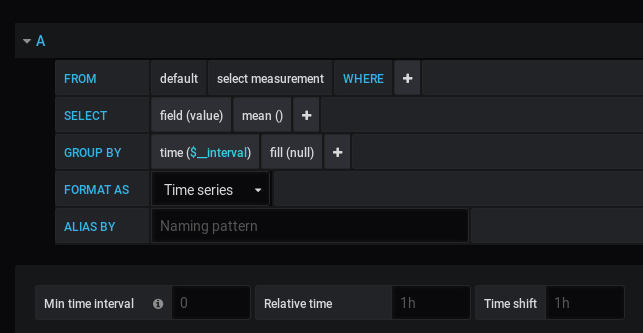
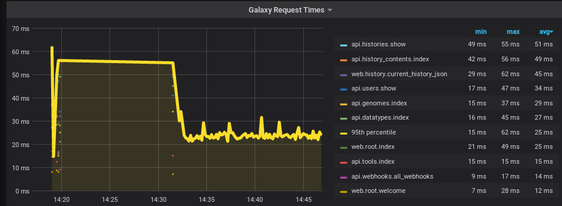
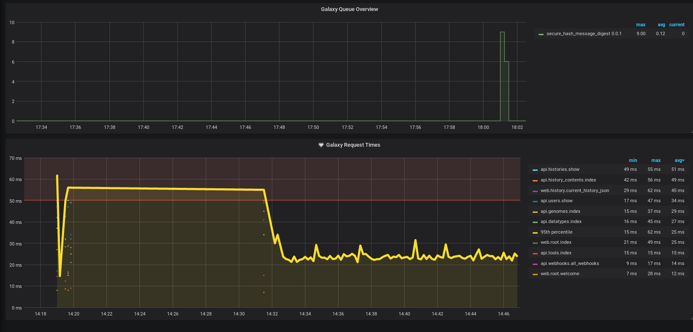

Monitoring is an incredibly important part of server monitoring and maintenance. Being able to observe trends and identify hot spots by collecting metrics gives you a significant ability to respond to any issues that arise in production. Monitoring is quite easy to get started with, it can be as simple as writing a quick shell script in order to start collecting metrics.


> <agenda-title></agenda-title>
>
> 1. TOC
> {:toc}
>
{: .agenda}



This tutorial explicitly assumes you are starting with a setup like that created in the *Galaxy installation with Ansible* tutorial

# Data Flow

The monitoring setup we (UseGalaxy.\*) use involves compute nodes collecting metrics and forwarding the data to a central collector. On each node we have a data collector running (Telegraf) which collects data from numerous sources before aggregating it and forwarding it onwards. On another, sometimes public, node we accept and collect all of these metrics (InfluxDB) and provide an interface to visualise and query that data (Grafana).

For UseGalaxy.eu, we pre-install Telegraf on our compute node images. Whenever we launch new compute nodes, they automatically start sending data to our central collection point. Telegraf additionally provides a nice feature of aggregating metrics it collects, batching them up before sending them off to InfluxDB. Telegraf has built in data collectors, or can run command line scripts and tools which output specifically formatted data.

Telegraf communicates with InfluxDB using a JSON based HTTP API, making it easy to write custom tooling to send data there, if need be. Grafana provides the visualisation component, the most interesting component for most consumers of the metrics and monitoring.


# Infrastructure

Setting up the infrastructure is quite simple thanks to the automation provided by Ansible. We will first setup a playbook for a "monitoring" machine, which will collect and visualize our data using InfluxDB and Grafana. We will then expand the Galaxy playbook to include Telegraf on the machine to monitor both it and Galaxy itself. In this tutorial we will do everything on the same machine. In practice you can separate these services to different machines, if you wish. The only requirement is that Telegraf run on the machine from which you wish to collect data.

## InfluxDB

[InfluxDB](https://www.influxdata.com/) provides the data storage for monitoring. It is a {TSDB}, so it has been designed specifically for storing time-series data like monitoring and metrics. There are other TSBD options for storing data but we have had good experiences with this one. TSBDs commonly feature some form of automatic data expiration after a set period of time. In InfluxDB these are known as "retention policies". Outside of this feature, it is a [relatively normal database](https://docs.influxdata.com/influxdb/v1.7/concepts/crosswalk/).

The available Ansible roles for InfluxDB unfortunately do not support configuring databases or users or retention policies. Ansible itself contains [several modules](https://docs.ansible.com/ansible/2.9/modules/list_of_database_modules.html#influxdb) you can use to write your own roles, but nothing generic. UseGalaxy.eu wrote [their own role](https://github.com/usegalaxy-eu/infrastructure-playbook/blob/master/roles/hxr.influxdb/tasks/main.yml) for setting up their InfluxDB database, but it is not reusable enough for it to be used here yet. If you plan to automate your entire setup, this tutorial can perhaps provide inspiration for writing your own Ansible role. However, in this case it is sufficient to manually create your users and retention policies as a one-off task.

> <hands-on-title>Setting up InfluxDB</hands-on-title>
>
> 1. Edit your `requirements.yml` and add the following:
>
>    
>    ```diff
>    --- a/requirements.yml
>    +++ b/requirements.yml
>    @@ -30,3 +30,5 @@
>       version: 1.0.8
>     - src: galaxyproject.gxadmin
>       version: 0.0.8
>    +- src: usegalaxy_eu.influxdb
>    +  version: v6.0.7
>    
>    ```
>    {: data-commit="Add requirement"}
>
>    
>
> 2. Install the role
>
>    > <code-in-title>Bash</code-in-title>
>    > ```bash
>    > ansible-galaxy install -p roles -r requirements.yml
>    > ```
>    > {: data-cmd="true"}
>    {: .code-in}
>
> 3. Create a new playbook, `monitoring.yml` with the following:
>
>    
>    ```diff
>    --- /dev/null
>    +++ b/monitoring.yml
>    @@ -0,0 +1,4 @@
>    +- hosts: monitoring
>    +  become: true
>    +  roles:
>    +    - usegalaxy_eu.influxdb
>    
>    ```
>    {: data-commit="Setup the monitoring playbook"}
>
>    During this tutorial we will install everything on the same host, but often one keeps the monitoring infrastructure (Grafana, InfluxDB) on a separate host.
>
> 4. Edit the inventory file (`hosts`) an add a group for monitoring like:
>
>    
>    ```diff
>    --- a/hosts
>    +++ b/hosts
>    @@ -2,3 +2,5 @@
>     gat-0.eu.training.galaxyproject.eu ansible_connection=local ansible_user=ubuntu
>     [pulsarservers]
>     gat-0.au.training.galaxyproject.eu ansible_user=ubuntu
>    +[monitoring]
>    +gat-0.eu.training.galaxyproject.eu ansible_connection=local ansible_user=ubuntu
>    
>    ```
>    {: data-commit="Add the monitoring host"}
>
>    **Ensure that the hostname is the full hostname of your machine.**
>
> 4. Run the playbook:
>
>    > <code-in-title>Bash</code-in-title>
>    > ```bash
>    > ansible-playbook monitoring.yml
>    > ```
>    > {: data-cmd="true"}
>    {: .code-in}
>
{: .hands_on}

> ```bash
> 1.sh
> ```
> {: data-test="true"}
{: .hidden}

This will setup an InfluxDB server listening on port `:8086`. The service is currently unauthenticated but it is only listening on `localhost` so it is less of a concern. The service can be authenticated and SSL configured quite easily but that is outside the scope of this tutorial.

You can access the InfluxDB service by running the command `influx`.

```sql
$ influx
Connected to http://localhost:8086 version 1.7.7
InfluxDB shell version: 1.7.7
> show databases
name: databases
name
----
_internal
> use _internal
Using database _internal
> show measurements
name: measurements
name
----
cq
database
httpd
queryExecutor
runtime
shard
subscriber
tsm1_cache
tsm1_engine
tsm1_filestore
tsm1_wal
write
```

The `influx` command provides command line access to InfluxDB in a similar fashion to `psql` for Postgresql. It provides commands like `show databases` and others, but we will not use this interface very often. Telegraf will automatically try to create any database needed, and no interaction is required to setup Grafana to talk to the database.

## Grafana

[Grafana](https://grafana.com/) provides a visual interface to our metrics. It includes a nice query builder that provides a uniform experience across multiple backend databases, along with many attractive graphing and other visualization options. Each page in the Grafana webserver display is called a "dashboard." Dashboards can each have multiple visualizations and graphs, all responding to the data collected by InfluxDB. Another benefit of using Grafana is that many of the UseGalaxy.\* servers share their dashboards publicly, and you can easily copy these and use them on your own server.

There are some nice examples of dashboards available from the public Galaxies, we recommend that you peruse them to get an idea of the possibilities:

- [UseGalaxy.eu](https://stats.galaxyproject.eu/)
- [UseGalaxy.org.au](https://stats.genome.edu.au/)

> <hands-on-title>Setting up Grafana</hands-on-title>
>
> 1. Edit your `requirements.yml` and add the following:
>
>    
>    ```diff
>    --- a/requirements.yml
>    +++ b/requirements.yml
>    @@ -32,3 +32,5 @@
>       version: 0.0.8
>     - src: usegalaxy_eu.influxdb
>       version: v6.0.7
>    +- src: cloudalchemy.grafana
>    +  version: 0.14.2
>    
>    ```
>    {: data-commit="Add grafana requirement"}
>
> 2. Install the role
>
>    > <code-in-title>Bash</code-in-title>
>    > ```bash
>    > ansible-galaxy install -p roles -r requirements.yml
>    > ```
>    > {: data-cmd="true"}
>    {: .code-in}
>
> 3. Add `cloudalchemy.grafana` to your `monitoring.yml` playbook:
>
>    
>    ```diff
>    --- a/monitoring.yml
>    +++ b/monitoring.yml
>    @@ -2,3 +2,4 @@
>       become: true
>       roles:
>         - usegalaxy_eu.influxdb
>    +    - cloudalchemy.grafana
>    
>    ```
>    {: data-commit="Add grafana to monitoring playbook"}
>
> 4. Edit the file `group_vars/monitoring.yml` and set the following variables:
>
>    
>    ```diff
>    --- /dev/null
>    +++ b/group_vars/monitoring.yml
>    @@ -0,0 +1,17 @@
>    +grafana_url: "https://{{ inventory_hostname }}/grafana/"
>    +
>    +grafana_security:
>    +    # Please change at least the password to something more suitable
>    +    admin_user: admin
>    +    admin_password: password
>    +
>    +# These datasources will be automatically included into Grafana
>    +grafana_datasources:
>    + - name: Galaxy
>    +   type: influxdb
>    +   access: proxy
>    +   url: http://127.0.0.1:8086
>    +   isDefault: true
>    +   version: 1
>    +   editable: false
>    +   database: telegraf
>    
>    ```
>    {: data-commit="Configure Grafana"}
>
> 5. Run the monitoring playbook:
>
>    > <code-in-title>Bash</code-in-title>
>    > ```bash
>    > ansible-playbook monitoring.yml
>    > ```
>    > {: data-cmd="true"}
>    {: .code-in}
>
> 5. Update the nginx configuration in `templates/nginx/galaxy.j2` to include the following at the end, before the last curly brace
>
>    
>    ```diff
>    --- a/templates/nginx/galaxy.j2
>    +++ b/templates/nginx/galaxy.j2
>    @@ -84,4 +84,10 @@ server {
>         location /training-material/ {
>             proxy_pass https://training.galaxyproject.org/training-material/;
>         }
>    +
>    +    location /grafana/ {
>    +        proxy_pass http://127.0.0.1:3000/;
>    +        proxy_set_header Host $http_host;
>    +    }
>    +
>     }
>    
>    ```
>    {: data-commit="Setup nginx location for grafana"}
>
>    Since we will setup everything on the same host, we will re-use the Nginx server we setup for Galaxy. If you had planned to run the Grafana and InfluxDB servers on a separate host, you would need to setup Nginx for this host separately.
>
> 5. Run the Galaxy playbook which includes Nginx:
>
>    > <code-in-title>Bash</code-in-title>
>    > ```bash
>    > ansible-playbook galaxy.yml
>    > ```
>    > {: data-cmd="true"}
>    {: .code-in}
>
{: .hands_on}

This has now deployed Grafana on your domain under `/grafana/`, with the username and password you set. The datasource, from which Grafana obtains data, is preconfigured. The Grafana web application will now be available, but currently there is no data available to it. We will return to Grafana shortly in the tutorial to configure dashboards once data is present.

> ```bash
> 2.sh
> ```
> {: data-test="true"}
{: .hidden}

## Telegraf

We use [Telegraf](https://github.com/influxdata/telegraf) for monitoring as it is incredibly easy to get started with, and it natively integrates with InfluxDB.

### Data Input

Telegraf has extensive documentation on how to configure different types of monitoring, and it supports [a huge array of inputs](https://github.com/influxdata/telegraf#input-plugins). If Telegraf doesn't support a specific data source you wish to query, you can write a bash script to query this data, and have Telegraf [execute it regularly](https://github.com/influxdata/telegraf/tree/master/plugins/inputs/exec). Telegraf supports several text formats here but the easiest to manage is the InfluxDB line protocol format. The InfluxDB format looks like:


```
weather,country=germany,city=freiburg temperature=25,wind=0 1453832006274169688
weather,country=usa,city=state-college temperature=33,wind=10 1453832006274169688
```

The first portion is the metric name, in both of these cases `weather`. This is just a unique key for a metric which describes the data being collected. Telegraf commonly collects metrics like `cpu`, or `disk`, or `mem`. After the metric name, up to the first space are tags. Tags are used to store categorical data usually, something that is [discrete](https://en.wikipedia.org/wiki/Continuous_or_discrete_variable) and [enumerable](https://en.wikipedia.org/wiki/Enumeration). If you're interested in the weather you would collect some information from a particular city, and then *tag* these values with information about where they're collected. After the space, are the various values or data points that are of interest. For weather this would be information like temperature, wind speed or direction, percentage cloud coverage, etc. After the final space is a timestamp, formatted as [Unix epoch](https://en.wikipedia.org/wiki/Unix_time) with nanosecond precision.

To apply this example to real world data, we'll look at the some example output of the [`disk` plugin](https://github.com/influxdata/telegraf/tree/master/plugins/inputs/disk), which measures information about disks mounted to a server:


```
disk,device=devtmpfs,fstype=devtmpfs,host=stats.galaxyproject.eu,mode=rw,path=/dev free=952795136i,inodes_free=232283i,inodes_total=232616i,inodes_used=333i,total=952795136i,used=0i,used_percent=0 1564485157000000000
disk,device=tmpfs,fstype=tmpfs,host=stats.galaxyproject.eu,mode=rw,path=/dev/shm free=963690496i,inodes_free=235275i,inodes_total=235276i,inodes_used=1i,total=963690496i,used=0i,used_percent=0 1564485157000000000
disk,device=tmpfs,fstype=tmpfs,host=stats.galaxyproject.eu,mode=rw,path=/run free=862007296i,inodes_free=234817i,inodes_total=235276i,inodes_used=459i,total=963690496i,used=101683200i,used_percent=10.551437460684472 1564485157000000000
disk,device=tmpfs,fstype=tmpfs,host=stats.galaxyproject.eu,mode=ro,path=/sys/fs/cgroup free=963690496i,inodes_free=235260i,inodes_total=235276i,inodes_used=16i,total=963690496i,used=0i,used_percent=0 1564485157000000000
disk,device=vda2,fstype=xfs,host=stats.galaxyproject.eu,mode=rw,path=/ free=6652604416i,inodes_free=6134444i,inodes_total=6290368i,inodes_used=155924i,total=12872298496i,used=6219694080i,used_percent=48.31844197780791 1564485157000000000
disk,device=vdb,fstype=xfs,host=stats.galaxyproject.eu,mode=rw,path=/vdb free=2013384704i,inodes_free=1044728i,inodes_total=1048576i,inodes_used=3848i,total=2136997888i,used=123613184i,used_percent=5.78443173454367 1564485157000000000
disk,device=tmpfs,fstype=tmpfs,host=stats.galaxyproject.eu,mode=rw,path=/run/user/0 free=192741376i,inodes_free=235275i,inodes_total=235276i,inodes_used=1i,total=192741376i,used=0i,used_percent=0 1564485157000000000
disk,device=tmpfs,fstype=tmpfs,host=stats.galaxyproject.eu,mode=rw,path=/run/user/1000 free=192741376i,inodes_free=235275i,inodes_total=235276i,inodes_used=1i,total=192741376i,used=0i,used_percent=0 1564485157000000000

```

Reformatting one of the lines to be a bit easier to read:

```
disk,
	device=vdb,
	fstype=xfs,
	host=stats.galaxyproject.eu,
	mode=rw,
	path=/vdb

	free=2013384704i,
	inodes_free=1044728i,
	inodes_total=1048576i,
	inodes_used=3848i,
	total=2136997888i,
	used=123613184i,
	used_percent=5.78443173454367

	1564485157000000000
```

The plugin generates a line of output per disk. It is tagged with the `fstype`, the type of the filesystem (e.g. `ext3`/`ext4`/`xfs`/`autofs`/etc.), the mode by which the filesystem was mounted (`rw` or `ro`), and the path to which the filesystem was mounted. Then various numbers are collected, the `i` suffix meaning an [integer](https://en.wikipedia.org/wiki/Integer). Those without a suffix are [floats](https://en.wikipedia.org/wiki/Floating-point_arithmetic). In this example, you can see that it is an `xfs` formatted device, available as vdb, mounted read-write on the path /vdb. Telegraf automatically tags values with the name of the host from which the data was collected.

The values collected usually have quite self-explanatory names. Here there are `2013384704` bytes free on the disk, 1044728 [inodes](https://en.wikipedia.org/wiki/Inode), so many bytes total and used, and finally 5.784% disk usage.

### `gxadmin`

In the Galaxy world, the InfluxDB line protocol format and [exec](https://github.com/influxdata/telegraf/tree/master/plugins/inputs/exec) plugin are commonly seen together in conjunction with [gxadmin](https://github.com/usegalaxy-eu/gxadmin) to run various database queries, and store the results into InfluxDB.

`gxadmin` provides various commands to inspect the database like `gxadmin query queue-detail`. It was written such that many of the queries can be automatically formatted for consumption by InfluxDB:

```
$ gxadmin iquery queue-overview --short-tool-id
queue-overview,tool_id=__SET_METADATA__,tool_version=1.0.1,state=new,handler=handler_main_9,destination_id=unknown,job_runner_name=unknown count=3
queue-overview,tool_id=iuc/mothur_pre_cluster/mothur_pre_cluster,tool_version=1.39.5.0,state=new,handler=handler_main_2,destination_id=unknown,job_runner_name=unknown count=1
```

If Telegraf runs this command in an exec block, the data will then be available for graphing. Here the only numeric value we're collecting is the *count* of how many jobs of that type are currently running.

```
queue-overview,
	tool_id=__SET_METADATA__,
	tool_version=1.0.1,
	state=new,
	handler=handler_main_9,
	destination_id=unknown,
	job_runner_name=unknown

	count=3
```

We capture information about what tool is running, the job state, and where it is running. This will allow us to produce nice graphs of the current queue status, how many jobs are new or queued or running.


### Configuring Telegraf

Setting up Telegraf is again very simple. We just add a single role to our playbook and set some variables.


> <hands-on-title>Dependencies</hands-on-title>
>
> 1. Edit your `requirements.yml` and add the following:
>
>    
>    ```diff
>    --- a/requirements.yml
>    +++ b/requirements.yml
>    @@ -34,3 +34,5 @@
>       version: v6.0.7
>     - src: cloudalchemy.grafana
>       version: 0.14.2
>    +- src: dj-wasabi.telegraf
>    +  version: 0.12.0
>    
>    ```
>    {: data-commit="Add Telegraf requirement"}
>
> 2. Install the requirements
>
>    > <code-in-title>Bash</code-in-title>
>    > ```bash
>    > ansible-galaxy install -p roles -r requirements.yml
>    > ```
>    > {: data-cmd="true"}
>    {: .code-in}
>
> 3. Add an entry to the *end* of your `galaxy.yml` playbook under `roles:`
>
>    
>    ```diff
>    --- a/galaxy.yml
>    +++ b/galaxy.yml
>    @@ -34,3 +34,4 @@
>         - galaxyproject.tusd
>         - galaxyproject.cvmfs
>         - galaxyproject.gxadmin
>    +    - dj-wasabi.telegraf
>    
>    ```
>    {: data-commit="Add telegraf to the monitoring playbook"}
>
> 4. Create and edit `group_vars/all.yml` and add the following variables:
>
>    
>    ```diff
>    --- a/group_vars/all.yml
>    +++ b/group_vars/all.yml
>    @@ -12,3 +12,28 @@ galaxy_job_metrics_plugins:
>       - type: env
>       - type: cgroup
>       - type: hostname
>    +
>    +# Telegraf
>    +telegraf_agent_package_state: latest
>    +
>    +# Configure the output to point to an InfluxDB
>    +# running on localhost, and # place data in the
>    +# database "telegraf" which will be created if need be.
>    +telegraf_agent_output:
>    +  - type: influxdb
>    +    config:
>    +    - urls = ["http://127.0.0.1:8086"]
>    +    - database = "telegraf"
>    +
>    +# The default plugins, applied to any telegraf-configured host
>    +telegraf_plugins_default:
>    +  - plugin: cpu
>    +  - plugin: disk
>    +  - plugin: kernel
>    +  - plugin: processes
>    +  - plugin: io
>    +  - plugin: mem
>    +  - plugin: system
>    +  - plugin: swap
>    +  - plugin: net
>    +  - plugin: netstat
>    
>    ```
>    {: data-commit="Setup telegraf's variables"}
>
>    This configures telegraf to output to the configured influxdb server in the `telegraf` database. A number of plugins are enabled as `defaults` like cpu or disk or memory, all of which is generically interesting to observe, across every host.
>
>    Any host that we setup Telegraf on, will have this base configuration. If you are setting up multiple hosts to be monitored, you will need to put the full hostname (or IP address) where InfluxDB will be available in the `telegraf_agent_output`, rather than `127.0.0.1`. That way every host with Telegraf will send data to the correct location.
>
> 5. Now with the generic configuration applied to all of our hosts, we will apply some specific configuration to the Galaxy server.
>
>    Open your `group_vars/galaxyservers.yml` file, and add the following variables at the end not under any category:
>
>    
>    ```diff
>    --- a/group_vars/galaxyservers.yml
>    +++ b/group_vars/galaxyservers.yml
>    @@ -210,6 +210,15 @@ rabbitmq_users:
>         password: "{{ vault_rabbitmq_password_vhost }}"
>         vhost: /pulsar/galaxy_au
>     
>    +# Telegraf
>    +telegraf_plugins_extra:
>    +  listen_galaxy_routes:
>    +    plugin: "statsd"
>    +    config:
>    +      - service_address = ":8125"
>    +      - metric_separator = "."
>    +      - allowed_pending_messages = 10000
>    +
>     # TUS
>     galaxy_tusd_port: 1080
>     tusd_instances:
>    
>    ```
>    {: data-commit="Add extra monitoring for Galaxy"}
>
>    We have configured the `statsd` plugin for telegraf, as we will use it to receive Galaxy timing data. [StatsD](https://github.com/statsd/statsd) was an earlier time series database and had an associated line protocol with a different format. Telegraf supports data sent in this format, allowing us to reuse the long-present Galaxy support for this with our newer Telegraf/InfluxDB setup. Telegraf parses the data and converts it into a format that InfluxDB can understand.
>
> 5. Lastly, we need to enable Galaxy to send data to Telegraf:
>
>    In `group_vars/galaxyservers.yml`, edit the `galaxy_config` block, and add `statsd_host: localhost` and `statsd_influxdb: true` under the `galaxy` subsection. It should look like:
>
>    
>    ```diff
>    --- a/group_vars/galaxyservers.yml
>    +++ b/group_vars/galaxyservers.yml
>    @@ -29,6 +29,8 @@ miniconda_manage_dependencies: false
>     
>     galaxy_config:
>       galaxy:
>    +    statsd_host: localhost
>    +    statsd_influxdb: true
>         job_resource_params_file: "{{ galaxy_config_dir }}/job_resource_params_conf.xml"
>         tool_destinations_config_file: "{{ galaxy_config_dir }}/tool_destinations.yml"
>         library_import_dir: /libraries/admin
>    
>    ```
>    {: data-commit="Add extra monitoring for Galaxy"}
>
> 6. Run the `galaxy.yml` playbook
>
{: .hands_on}

> ```bash
> 3.sh
> ```
> {: data-test="true"}
{: .hidden}

# Monitoring with Grafana

The stats have been collecting in InfluxDB for a few minutes, so now we will now configure Grafana with dashboards and alerting rules.

## Importing a dashboard

For any public Grafana dashboard, you can copy the dashboard for your own use. This is a nice feature of Grafana that has really helped it spread in the Galaxy community, any cool thing one of us builds, everyone else can copy and build upon.

> <hands-on-title>Import a dashboard</hands-on-title>
>
> 1. [Visit UseGalaxy.eu's Node Detail dashboard](https://stats.galaxyproject.eu/d/000000023/node-detail-infrastructure?orgId=1)
>
> 2. Look for the sharing icon at the top and click it
>
> 3. Under the "Export" tab, click "Save to file"
>
> 4. On your own Grafana server, on the home page, hover over the `+` icon and use "Import" from the menu.
>
> 5. Click "Upload .json file" and select the json dashboard you downloaded
>
> 6. Click "Import".
>
{: .hands_on}

With this, your first dashboard should be live! You should see some data from your Galaxy instance, like CPU/load/memory/etc. This can give you a nice `htop` like view into your systems, all collected in one easy dashboard. At the top you will see a box labelled "Host" with a dropdown. If you have more systems, you can click here to select between different machines.

## Setting up a Galaxy dashboard

Importing dashboards is a good start, but it's more interesting to create our own that's personalised to our needs.

> <hands-on-title>Create a dashboard</hands-on-title>
>
> 1. Again find the `+` icon in Grafana and create a dashboard. This will bring you to a new screen
>
> 2. Click *Add Query*, and you will be dropped into the Grafana query builder
>
>    
>
>    This is the query builder interface. The interface somewhat resembles a SQL query, selecting data *from* a database, *where* it meets some condition, *select*ing some specific data, and *grouping by* time period. If this isn't immediately clear how it behaves, hopefully it will become more clear once you have built some queries.
>
> 3. Let's build a query:
>    - From:
>      - *"select measurement"*: `galaxy.`
>    - Select:
>      - *"field(value)"*: `field(mean)`
>    - Group by:
>      - *"fill(null)"*: `fill(none)`
>      - add new (+): `tag(path)`
>    - Alias by: `[[tag_path]]`
>
> 4. At the top of the page it probably says "Last 6 hours", click this to change to "Last 30 minutes"
>
> 5. Remember to save the dashboard (using the  at the top), and give it a name like "Galaxy"
>
> 6. You can hit <kbd>Escape</kbd> to exit out of the graph editor, if need be.
>
{: .hands_on}

This will track how long it takes the interface to respond on various web routes and API routes. The collection of individual points is a bit hard to interpret the "feeling" of, so it's common to add a query like the [95th percentile](https://en.wikipedia.org/wiki/Percentile) of requests. This is a value that is calculated from all of the data points collected. The 95th percentile means that 95% of requests are responded to more quickly than this value.

> <hands-on-title>Add a second query to an existing graph</hands-on-title>
>
> 1. The top of the graph is probably labelled "Panel Title", unless you changed it. Click this to access a dropdown and click "Edit"
>
> 2. On the right side you will find a button **Add Query**, click it.
>
> 3. Let's build a query:
>    - From:
>      - *"select measurement"*: `galaxy.`
>    - Select:
>      - *"field(value)"*: `field(mean)`
>      - add new (+): Selectors → percentile
>    - Group by:
>      - *"fill(null)"*: `fill(none)`
>    - Alias by: `percentile`
>
> 4. Remember to save the dashboard
>
> 5. You can hit <kbd>Escape</kbd> to exit out of the graph editor
>
> 6. At any time you can drag the bottom right corner of the graph to resize it as needed.
>
{: .hands_on}

We should now have a graph that gives us not only individual data points, but also a more easily consumable overall representation. For many metrics there are so many data points individually collected that it can be overwhelming and so it is often useful to come up with an aggregate representation that summarises the points into a more easily consumed value. We will touch upon this again under the monitoring section.

## Styling

There is a significant amount of visual styling that one can do to the graphs to make data more or less prominent as you need.


We will update the panel we've added to highlight the important information and downplay less important facets, as well as configuring it to have a nicer title than "Panel Title"

> <hands-on-title>Styling the graph</hands-on-title>
>
> 1. Again edit the one graph we've added in our dashboard
>
> 2. On the left side, select the second icon, Visualisation
>
> 3. In the first section, we can edit some display attributes.
>
>    We are primarily interested in the 95th percentile line. Here we can change the display from points to lines or bars, change the tooltip that displays when we hover over the graph, among other facets.
>
>    - Click **Add series override**, click in the box that appears and type "percentile", to find the series we created early. Select it when it appears. We can now apply custom styling to this series.
>    - Click the "+" after the series override, and find **"Color → change"**, and choose a colour that you like.
>    - Click the "+" again, and find **"Line width → 5"** to make the line more visible. This is the most important facet of the graph for us, so we can emphasise it through colour and size.
>
> 3. In the second section, we can edit information about the Axes:
>
>    - Left Y
>      - *"Unit"*: Time → millisecond (ms)
>
>    This will cause the axis to display nicely at any scale. Before Grafana only knew it was a number, now it knows the type of number. If you have a request that takes 30 seconds, it will display as "30s" in Grafana, rather than "30000 ms".
>
>    This section is also useful for setting the scale if your data is better viewed with a logarithmic scale, or forcing specific axis bounds. Commonly on graphs that show things like "disk usage percentage", it can be useful to set the axis bounds to 0 and 100 to ensure that full context is available.
>
> 4. In the next section, "Legend" allows us to format the legend in more interesting ways.
>
>    - Options
>      - *"Show"*: yes
>      - *"As table"*: yes
>      - *"To right"*: yes
>    - Values
>      - *"Min"*: yes
>      - *"Max"*: yes
>      - *"Avg"*: yes
>
>    Clicking on the headers of the table that has appeared, you can force it to be sorted by one column or another.
>
> 5. On the left side, select the third icon, "General"
>
>    - *"Title"*: `Galaxy Request Times`
>
> 6. Save the dashboard
>
{: .hands_on}

Your graph should look something like the following:



## Monitoring

Collecting all of this data is interesting to visualise but as an administrator you surely have more interesting things to do than to watch graphs all day. Many organisations like to display these dashboards on large monitors, but again this assumes someone is watching it. Everyone has better things to do with their time! So we will setup monitoring on the most important aspects of our system.

Doing monitoring effectively, without causing undue burden to the administrators (extraneous alerts that are not actionable), or the users (unexpected/unnoticed downtime), is a very complex topic. Recommended reading here includes the [monitoring chapter](https://landing.google.com/sre/sre-book/chapters/monitoring-distributed-systems/) of the Google SRE book  which can provide some general guidance on the topic and what metrics may be interesting or annoying to alert upon.

> <comment-title>No generic advice</comment-title>
> We cannot easily provide generic and applicable recommendations, that work across every system and every scale. Some of these performance bounds or features you will need to discover yourself, either adding new metrics in support of this, or changing monitoring thresholds to match the values you need.
{: .comment }

We will add an example alert, to make you familiar with the process. This is not an alert that will probably be useful in production.

> <hands-on-title>Add an alert to your graph</hands-on-title>
>
> 1. Again edit the `Galaxy Request Times` graph
>
> 2. On the left side, select the last icon, Alerting
>
> 3. Click **Create Alert**
>
>    Alerts consist of a *Rule*, with some name, evaluated every N seconds, for a period of time. The *for* can be an important parameter, which you can read more about [in the Grafana documentation](https://grafana.com/docs/alerting/rules/).
>
>    Under some *conditions*, this alert will activate. We will change the conditions of the alert here:
>
>    - *"When"*: `avg()`
>    - *"OF"*: `query(B, 1m, now)`, here we select query B, the 95th percentile track, and the average over 1 minute
>    - *"IS ABOVE"*: `50`
>
>    We will not configure a notification channel in this tutorial. In practice, it is useful to do to ensure that the relevant people are notified automatically. If you and your team use [one of the many services](https://grafana.com/docs/alerting/notifications/), then you can configure this following their documentation.
>
> 4. Save the dashboard
>
{: .hands_on}

# Telegraf & `gxadmin`

Via this setup using `systemd` we collect metrics about Galaxy request times. To get statistics about other Galaxy-specific metrics such as the job queue status, we need to use `gxadmin` to query the Galaxy database and configure Telegraf to consume this data. In this section we will setup gxadmin, and to configure Telegraf to have permissions to run it.


## Installing gxadmin

It's simple to install gxadmin. Here's how you do it, if you haven't done it already:

> <hands-on-title>Installing gxadmin and configuring Telegraf</hands-on-title>
>
> 1. Edit your `requirements.yml` and add the following:
>
>    ```yml
>    - src: galaxyproject.gxadmin
>      version: 0.0.8
>    ```
>
> 2. Install the role with `ansible-galaxy install -p roles -r requirements.yml`
>
> 3. Add the role to your `galaxy.yml` playbook, it should come before the Telegraf role.
>
{: .hands_on}

You can run the playbook now, or wait until you have configured Telegraf below:

## Configuring Telegraf for gxadmin

> <hands-on-title>Configuring Telegraf</hands-on-title>
>
> 1. Edit the `group_vars/galaxyservers.yml`, we need to add some additional permissions to permit Telegraf to run `gxadmin`:
>
>    
>    ```diff
>    --- a/group_vars/galaxyservers.yml
>    +++ b/group_vars/galaxyservers.yml
>    @@ -7,9 +7,15 @@ pip_package: python3-pip                               # geerlingguy.pip
>     # PostgreSQL
>     postgresql_objects_users:
>       - name: galaxy
>    +  - name: telegraf
>     postgresql_objects_databases:
>       - name: galaxy
>         owner: galaxy
>    +postgresql_objects_privileges:
>    +  - database: galaxy
>    +    roles: telegraf
>    +    privs: SELECT
>    +    objs: ALL_IN_SCHEMA
>     # PostgreSQL Backups
>     postgresql_backup_dir: /data/backups
>     postgresql_backup_local_dir: "{{ '~postgres' | expanduser }}/backups"
>    
>    ```
>    {: data-commit="Configure database permissions for Telegraf"}
>
> 2. Again edit the `group_vars/galaxyservers.yml`, we need to configure Telegraf to run `gxadmin`
>
>    Under `telegraf_plugins_extra`, where we already have set a Galaxy StatsD listener, add a stanza to monitor the Galaxy queue
>
>    
>    ```diff
>    --- a/group_vars/galaxyservers.yml
>    +++ b/group_vars/galaxyservers.yml
>    @@ -226,6 +226,13 @@ telegraf_plugins_extra:
>           - service_address = ":8125"
>           - metric_separator = "."
>           - allowed_pending_messages = 10000
>    +  monitor_galaxy_queue:
>    +    plugin: "exec"
>    +    config:
>    +      - commands = ["/usr/bin/env PGDATABASE=galaxy /usr/local/bin/gxadmin iquery queue-overview --short-tool-id"]
>    +      - timeout = "10s"
>    +      - data_format = "influx"
>    +      - interval = "15s"
>     
>     # TUS
>     galaxy_tusd_port: 1080
>    
>    ```
>    {: data-commit="Add extra monitoring for Galaxy"}
>
>    This one is slightly more complex in the configuration. The command block does several things:
>
>    - it wraps the command with `env` which allows setting environment variables for a single command
>    - It sets the `PGDATABASE` to the Galaxy database, by default the `psql` will try and connect to a database with the same name of the user. So the `telegraf` user will attempt to connect to a (non-existent) `telegraf` database.
>    - Then it calls the gxadmin command `queue-overview`. By using `iquery` instead of `query`, the output is automatically converted to InfluxDB line protocol.
>    - The command is run every 15 seconds, and has a timeout of 10 seconds. If the command fails to finish in 10 seconds, it will be killed.
>
> 3. Run the Galaxy playbook
>
{: .hands_on}

With this, Telegraf will start monitoring the Galaxy queue by calling the query every few seconds to check the status every 15 seconds. This monitoring *will* miss jobs that complete within the 15 second interval, but for most servers this is not an issue. Most jobs are running for more than 15 seconds, and if not, it still gives an accurate point-in-time view.

We'll now create a graph for this, just like the one on [stats.galaxyproject.eu](https://stats.galaxyproject.eu)

> <hands-on-title>Building the queue graph</hands-on-title>
>
> 1. Click the **new graph** button at the top of Grafana's interface, and *Add a Query*
>
> 2. Let's build a query:
>    - From:
>      - *"select measurement"*: `queue-overview`
>    - Select:
>      - *"field(value)"*: `field(count)`
>      - add new (+): Aggregations → sum
>    - Group by:
>      - *"time(__interval)"*: `time(15s)`, because we set the interval to 15s
>      - add new (+): `tag(tool_id)`
>      - add new (+): `tag(tool_version)`
>    - Alias by: `[[tag_tool_id]]/[[tag_tool_version]]`
>
> 3. In the second tab on the left, Visualisation:
>
>    Under the first section:
>
>    - Draw Modes:
>      - *"Bars"*: `no`
>      - *"Lines"*: `yes`
>      - *"Points"*: `no`
>    - Mode Options:
>      - *"Staircase"*: `yes`
>    - Stacking & Null Value
>      - *"Stack"*: `yes`
>      - *"Null Value"*: `null as zero`
>
>    Below, under the *Legend* section,
>
>    - Options:
>      - *"Show"*: `yes`
>      - *"As table"*: `yes`
>      - *"To Right"*: `yes`
>    - Values:
>      - *"Max"*: `yes`
>      - *"Avg"*: `yes`
>      - *"Current"*: `yes`
>    - Hide Series:
>      - *"With only nulls"*: `yes`
>      - *"With only zeros"*: `yes`
>
> 4. In the third tab, General settings:
>
>    - *"Title"*: `Galaxy Queue Overview`
>
> 5. You can hit <kbd>Escape</kbd> to exit out of the graph editor, and remember to save your dashboard.
>
{: .hands_on}

Run some tools in Galaxy, try to generate a large number of jobs. It is relatively easy to upload a dataset, and then run the "Secure Hash / Message Digest" or another tool repeatedly, running it over every dataset in your history, repeating until you've generated a few dozen datasets. If you have a slower tool like `bwa` installed, this can be an option too.




You can also import a [copy of the dashboard]({{ site.baseurl }}{{ page.dir }}dashboard.json).



# Conclusion

Monitoring with Telegraf, InfluxDB, and Grafana can provide an easy solution to monitor your infrastructure. The UseGalaxy.\* servers use this stack and it has proven to be effective in production situations, with large Galaxy servers. The base monitoring done with Telegraf is easy to setup and extend on a per-site basis simply by adding scripts or commands to your servers which generate InfluxDB line protocol formatted output. Grafana provides an ideal visualisation solution as it encourages sharing, and allows you to import whatever dashboards have been developed by UseGalaxy.\*, and then to extend them to your own needs.

