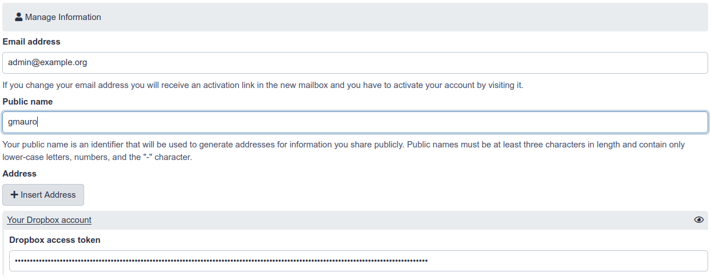
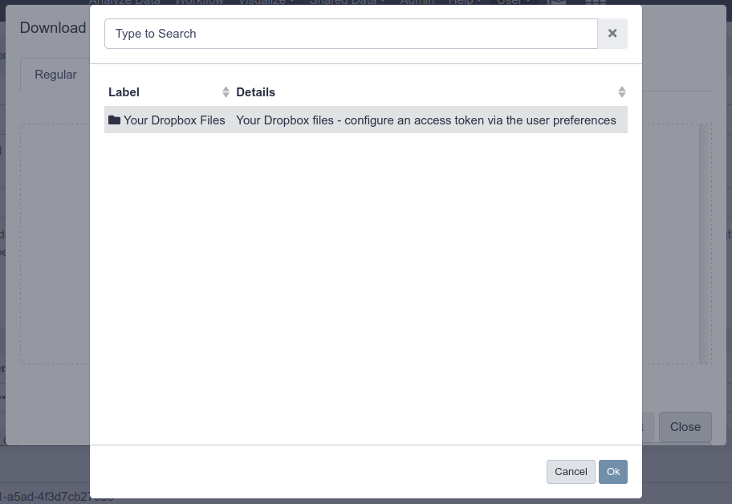

> <warning-title>switching object store types will cause issues</warning-title>
> Do not run this tutorial on your production instance! We will switch between object stores during this tutorial which has serious implications for production servers.
{: .warning}

# Expanding Storage


You may find that your Galaxy files directory has run out of space, but you don't want to move all of the files from one filesystem to another. One solution to this problem is to use Galaxy's hierarchical object store to add an additional file space for Galaxy.

Alternatively, you may wish to write new datasets to more than one filesystem. For this, you can use Galaxy's distributed object store.

This tutorial assumes you have done the "Ansible for installing Galaxy" tutorial, it references the base configuration set up in that tutorial in numerous places.

> <agenda-title></agenda-title>
>
> 1. TOC
> {:toc}
>
{: .agenda}


# Hierarchical Object Store

First, note that your Galaxy datasets have been created thus far in the directory `/data`, due to `galaxy_config: galaxy: file_path`. In some cases, we run out of storage in a particular location. Galaxy allows us to add additional storage locations where it will create new datasets, while still looking in the old locations for old datasets. You will not have to migrate any of your datasets, and can just "plug and play" with new storage pools.


> <hands-on-title>Adding Hierarchical Storage</hands-on-title>
>
> 1. Open your group variables file and set the `object_store_config_file` variable:
>
>    ```yaml
>    galaxy_config:
>      galaxy:
>        object_store_config_file: "{{ galaxy_config_dir }}/object_store_conf.xml"
>    ```
>
> 2. In your group variables file, add it to the `galaxy_config_templates` section:
>
>    ```yaml
>    galaxy_config_templates:
>      - src: templates/galaxy/config/object_store_conf.xml.j2
>        dest: "{{ galaxy_config.galaxy.object_store_config_file }}"
>    ```
>
> 3. Create and edit `templates/galaxy/config/object_store_conf.xml.j2` with the following contents:
>
>    ```xml
>    <?xml version="1.0"?>
>    <object_store type="hierarchical">
>        <backends>
>            <backend id="newdata" type="disk" order="0">
>                <files_dir path="/data2" />
>                <extra_dir type="job_work" path="/data2/job_work_dir" />
>            </backend>
>            <backend id="olddata" type="disk" order="1">
>                <files_dir path="/data" />
>                <extra_dir type="job_work" path="/data/job_work_dir" />
>            </backend>
>        </backends>
>    </object_store>
>    ```
>
> 4. Add a `pre_task` in your playbook `galaxy.yml` file to create the `/data2` folder [using the file module](https://docs.ansible.com/ansible/2.9/modules/file_module.html).
>
>    ```
>        - name: Create the second storage directory
>          file:
>            owner: galaxy
>            group: galaxy
>            path: /data2
>            state: directory
>            mode: '0755'
>    ```
>
>    We've hardcoded the user/group because creating a storage directory is unusual. In normal practice someone provides you with an NFS mount and you will simply point your Galaxy there.
>
> 5. Run the playbook and restart Galaxy
>
> 6. Run a couple of jobs after Galaxy has restarted.
>
>    > <question-title></question-title>
>    >
>    > Where is the data now stored?
>    >
>    > > <solution-title></solution-title>
>    > >
>    > > You should see `/data2` in the `Full Path`, if not, something went wrong. Check that your "order" is correct
>    > >
>    > {: .solution }
>    >
>    {: .question}
>
{: .hands_on}

# Distributed Object Store

Rather than searching a hierarchy of object stores until the dataset is found, Galaxy can store the ID (in the database) of the object store in which a dataset is located when the dataset is created. This allows Galaxy to write to more than one object store for new datasets.


> <hands-on-title>Distributed Object Store</hands-on-title>
>
> 1. Edit your `templates/galaxy/config/object_store_conf.xml.j2` file and replace the contents with:
>
>    ```xml
>    <?xml version="1.0"?>
>    <object_store type="distributed">
>        <backends>
>            <backend id="newdata" type="disk" weight="1">
>                <files_dir path="/data2"/>
>                <extra_dir type="job_work" path="/data2/job_work_dir"/>
>            </backend>
>            <backend id="olddata" type="disk" weight="1">
>                <files_dir path="/data"/>
>                <extra_dir type="job_work" path="/data/job_work_dir"/>
>            </backend>
>        </backends>
>    </object_store>
>    ```
>
> 2. Run the playbook, restart Galaxy
>
> 3. Run 4 or so jobs, and check where the output appear. You should see that they are split relatively evenly between the two data directories.
>
{: .hands_on}

Sites like UseGalaxy.eu use the distributed object store in order to balance dataset storage across 10 different storage pools.

> <details-title>More documentation</details-title>
>
> More information can be found in the [sample file](https://github.com/galaxyproject/galaxy/blob/dev/lib/galaxy/config/sample/object_store_conf.xml.sample).
>
{: .details}

> <tip-title>Can I distribute objects based on the user?</tip-title>
>
> Yes! You must write your own dynamic job handler code to handle this.
> See [PR#6552](https://github.com/galaxyproject/galaxy/pull/6552) and [PR#10233](https://github.com/galaxyproject/galaxy/pull/10233)
>
> If you implement something like this, please [let the GTN
> know](https://github.com/galaxyproject/training-material/issues/new) with
> some example code, and we can include this as a training module for everyone.
>
{: .tip}

> <warning-title>switching object store types will cause issues</warning-title>
> We have switched between two different object stores here, but this is not supported. If you need to do this, you will need to update datasets in Galaxy's database. Any datasets that were created as hierarchical will lack the `object_store_id`, and you will need to supply the correct one. Do not just blindly copy these instructions, please understand what they do before running them and talk to us on [Gitter](http://gitter.im/galaxyproject/Lobby) for more help
>
> 1. Move the datasets to their new location: `sudo -u galaxy rsync -avr /hierarchical/000/ /distributed/000/`
>
> 2. Update the database: `sudo -Hu galaxy psql galaxy -c "UPDATE dataset SET object_store_id='data';" `
>
> 3. Restart your Galaxy
>
{: .warning}


# S3 Object Store

Many sites have access to an S3 service (either public AWS, or something private like Swift or Ceph), and you can take advantage of this for data storage.

we will set up a local S3-compatible object store, and then talk to the API of this service.

> <hands-on-title>Setting up an S3-compatible Object Store</hands-on-title>
>
> 1. Edit your `requirements.yml` file and add:
>
>    ```yml
>    - src: atosatto.minio
>      version: v1.1.0
>    ```
>
> 2. ```ansible-galaxy install -p roles -r requirements.yml```
>
> 3. Edit your group variables to configure the object store:
>
>    ```
>    minio_server_datadirs: ["/minio-test"]
>    minio_access_key: "my-access-key"
>    minio_secret_key: "my-super-extra-top-secret-key"
>    ```
>
> 4. Edit your playbook and add the minio role **before** `galaxyproject.galaxy`:
>
>    ```
>        - atosatto.minio
>    ```
>
>    Galaxy will need to use the bucket, and will want it to be there when it boots, so we need to setup the object store first.
>
> 5. Edit the `templates/galaxy/config/object_store_conf.xml.j2`, and configure the object store as one of the hierarchical backends. The object store does not play nicely with the distributed backend during training preparation. Additionally, reset the orders of the disk backends to be higher than the order of the swift backend.
>
>    
>    ```diff
>    @@ -1,13 +1,21 @@
>     <?xml version="1.0"?>
>    - <object_store type="distributed">
>    + <object_store type="hierarchical">
>         <backends>
>    -        <backend id="newdata" type="disk" weight="1">
>    +        <backend id="newdata" type="disk" order="1">
>                 <files_dir path="/data2"/>
>                 <extra_dir type="job_work" path="/data2/job_work_dir"/>
>             </backend>
>    -        <backend id="olddata" type="disk" weight="1">
>    +        <backend id="olddata" type="disk" order="2">
>                 <files_dir path="/data"/>
>                 <extra_dir type="job_work" path="/data/job_work_dir"/>
>             </backend>
>    +        <object_store id="swifty" type="swift" order="0">
>    +            <auth access_key="{{ minio_access_key }}" secret_key="{{ minio_secret_key }}" />
>    +            <bucket name="galaxy" use_reduced_redundancy="False" max_chunk_size="250"/>
>    +            <connection host="127.0.0.1" port="9091" is_secure="False" conn_path="" multipart="True"/>
>    +            <cache path="{{ galaxy_mutable_data_dir }}/database/object_store_cache" size="1000" />
>    +            <extra_dir type="job_work" path="{{ galaxy_mutable_data_dir }}/database/job_working_directory_swift"/>
>    +            <extra_dir type="temp" path="{{ galaxy_mutable_data_dir }}/database/tmp_swift"/>
>    +        </object_store>
>         </backends>
>     </object_store>
>    ```
>    
>
>    
>
> 6. Run the playbook.
>
> 7. Galaxy should now be configure to use the object store!
>
> 8. When the playbook is done, upload a dataset to Galaxy, and check if it shows up in the bucket:
>
>    ```
>    $ sudo ls /minio-test/galaxy/000/
>    dataset_24.dat
>    ```
>
{: .hands_on}

# Dropbox

Dropbox is a well-known cloud storage service where you can store and share files with anyone.
As of [20.09](https://github.com/galaxyproject/galaxy/pull/9888), Galaxy has support for a couple of different file storage backends, including NextCloud (via webdavfs) and Dropbox.

This tutorial will help you setup the connection between Galaxy and Dropbox, allowing your users to add their account details and then access their Dropbox data within Galaxy

> <hands-on-title>Configure Galaxy to access the Dropbox service</hands-on-title>
>
> 1. If the folder does not exist, create `templates/galaxy/config` next to your `galaxy.yml` playbook.
>
>    > <code-in-title>Bash</code-in-title>
>    > ```
>    > mkdir -p templates/galaxy/config
>    > ```
>    {: .code-in}
>
> 2. Create `templates/galaxy/config/file_sources_conf.yml` with the following contents:
>
>    ```yaml
>    - type: dropbox
>      id: dropbox
>      label: Your Dropbox Files
>      doc: Your Dropbox files - configure an access token via the user preferences
>      accessToken: ${user.preferences.get('dropbox|access_token', '') if $user.preferences else ''}
>    ```
> 3. Create `templates/galaxy/config/user_preferences_extra_conf.yml` with the following contents:
>
>    ```yaml
>    preferences:
>        dropbox:
>            description: Your Dropbox account
>            inputs:
>                - name: access_token
>                  label: Dropbox access token
>                  type: password
>                  required: False
>    ```
> 4. Inform the `galaxyproject.galaxy` role of where you would like the `file_sources_conf.yml` and `user_preferences_extra_conf.yml` to reside, by setting it in your `group_vars/galaxyservers.yml`:
>
>    
>    ```diff
>    --- a/group_vars/galaxyservers.yml
>    +++ b/group_vars/galaxyservers.yml
>    @@ -35,6 +35,8 @@ galaxy_config:
>         tool_data_path: "{{ galaxy_mutable_data_dir }}/tool-data"
>         job_config_file: "{{ galaxy_config_dir }}/job_conf.yml"
>    +    file_sources_config_file: "{{ galaxy_config_dir }}/file_sources_conf.yml"
>    +    user_preferences_extra_conf_path: "{{ galaxy_config_dir }}/user_preferences_extra_conf.yml"
>    ```
>    
>
> 5. Deploy the new config files using the `galaxy_config_files` var (also from the `galaxyproject.galaxy` role) in your group vars:
>
>    
>    ```diff
>    --- a/group_vars/galaxyservers.yml
>    +++ b/group_vars/galaxyservers.yml
>    @@ -65,6 +67,12 @@ galaxy_config_templates:
>       - src: templates/galaxy/config/job_conf.yml.j2
>         dest: "{{ galaxy_config.galaxy.job_config_file }}"
>     
>    +galaxy_config_files:
>    +  - src: files/galaxy/config/user_preferences_extra_conf.yml
>    +    dest: "{{ galaxy_config.galaxy.user_preferences_extra_conf_path }}"
>    +  - src: files/galaxy/config/file_sources_conf.yml
>    +    dest: "{{ galaxy_config.galaxy.file_sources_config_file }}"
>    +
>    ```
>    
>
> 6. Run the playbook. At the very end, you should see output like the following indicating that Galaxy has been restarted:
>
>    > > <code-in-title>Bash</code-in-title>
>    > > ```
>    > > ansible-playbook galaxy.yml
>    > > ```
>    > {: .code-in}
>    >
>    > > <code-out-title>Output</code-out-title>
>    > > ```
>    > > ...
>    > > RUNNING HANDLER [restart galaxy] ****************************************
>    > > changed: [gat-88.training.galaxyproject.eu]
>    > > ```
>    > {: .code-out}
>    {: .code-2col}
>
{: .hands_on}

Now we are ready to configure a Galaxy's user account to upload dataset from Dropbox to the Galaxy server.

> <hands-on-title>Configure Galaxy to access the Dropbox service</hands-on-title>
>
> 1. Generate a Dropbox access token following the [Dropbox Oauth guide](https://www.dropbox.com/lp/developers/reference/oauth-guide)
>
> 2. Add the Dropbox access token in the Galaxy's user preferences
>    - Go to https://\<server\>/user/information
>    - Here you will find the form user will fill in with his own Dropbox access token:
>      
>
> 3. Click the upload icon toward the top left corner.
>    You will have a new "Choose remote files" button that will open the remote files windows with the link to reach your Dropbox files:
>     
>
{: .hands_on}
