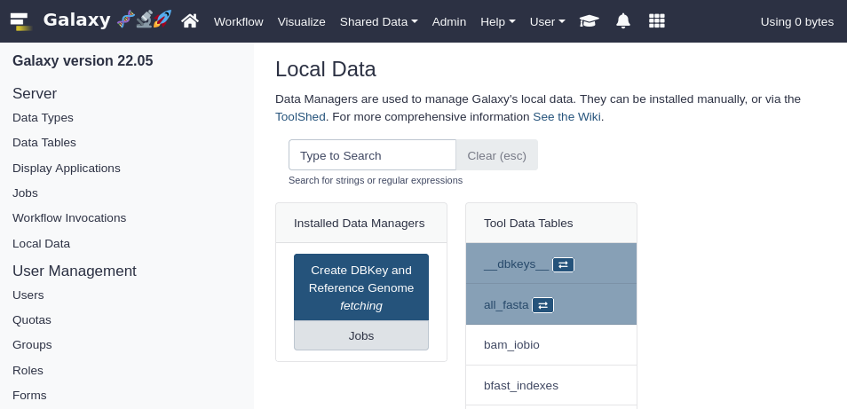
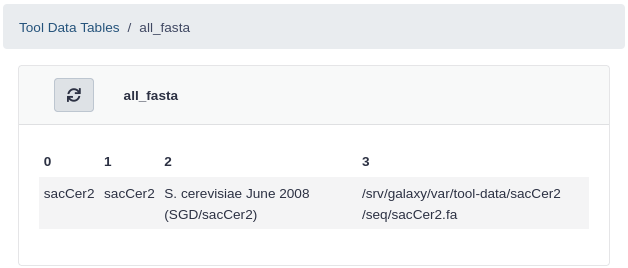

# Overview

## The problem

The Galaxy server administrator needed to know how to update each type of reference data, how to run the indexers, where to get the data from, and how to update Galaxy's *Tool Data Table* and *location* configuration files.

## Data managers to the rescue

Data Managers are a special class of Galaxy tool which allows for the download and/or creation of data that is stored within Tool Data Tables and their underlying flat location (e.g. .loc) files. These tools handle the creation of indices and the addition of entries/lines to the data table / .loc file via the Galaxy admin interface.

Data Managers can be defined locally in the data manager and tool data table configuration files or installed through the Tool Shed. When Data Managers are installed from the Tool Shed, their configuration is added to the shed versions of the data manager configuration and tool data table configuration files.

They are a flexible framework for adding reference data to Galaxy (not just genomic data). They are workflow compatible and can run via the Galaxy API. Data managers automatically update the appropriate location files when new data are installed.

For more background details on data managers, check out:
- [The data managers documentation on the hub](https://galaxyproject.org/admin/tools/data-managers/)
- [How to define a data manager for a tool](https://galaxyproject.org/admin/tools/data-managers/how-to/define/)
- There is also discussion of this topic in [the Reference Genomes in Galaxy slides]()

> <comment-title>Pre-built data are available</comment-title>
>
> The usegalaxy.\* servers and Galaxy Community have a large amount of reference data online and available for use by your Galaxy server. For instructions on how to access and use these data, see [the Reference Data with CVMFS tutorial]().
>
> If your data are not available as part of the CVMFS repository, Galaxy Data Managers can be used to locally install and build reference data.
>
{: .comment}

> <agenda-title></agenda-title>
>
> 1. TOC
> {:toc}
>
{: .agenda}



# Galaxy Reference Data Components

As discussed in the overview, Galaxy Data Managers handle the population of numerous Galaxy components. From the highest level to the lowest:

- Addition of tool data table entries into the shed version of the tool data table configuration file, `shed_tool_data_table_conf.xml`. Multiple data tables with the same `name` attribute are automatically merged by Galaxy.
- Population of the corresponding location (`.loc`) file when new reference data are installed. The `.loc` file used corresponds to the Data Manager and its specific version that was executed to install the data. The path to the location file can be found in the Data Manager's entry in the tool data table configuration file (above).
- Generation of the reference data on disk, underneath the directory specified by `tool_data_path` in `galaxy.yml`.

# Installing and Using Data Managers with the Galaxy UI

## Install a the Fetch Genome Data Manager from the Tool Shed

> <comment-title>Galaxy Configuration</comment-title>
>
> No special configuration for Galaxy beyond creating an admin user is necessary in order to use Data Managers. However, you may want to be aware of the `enable_data_manager_user_view` option, which enables unprivileged user to browse data installed via Data Managers. This option is not required, and users will be able to *use* data installed via Data Managers regardless.
>
> Data are installed in the path specified by `tool_data_path` in `galaxy.yml`. If you prefer to keep hand-managed reference data separate from DM-managed reference data, you can set `galaxy_data_manager_data_path` instead.
>
{: .comment}

> <tip-title>Intall with Ephemeris</tip-title>
> This hands-on exercise installs data managers and reference data through the Galaxy UI, but you are encouraged to install tools in a deterministic, recordable way through the use of Ephemeris, which is described in [the Installing and Using Data Managers from the command line with Ephemeris section](#installing-and-using-data-managers-from-the-command-line-with-ephemeris) below.
{: .tip}

We will install a data manager that can fetch the various genome sequences from multiple sources.

> <hands-on-title>Install the Fetch Genome Data Manager</hands-on-title>
>
> 1. Access the **Admin** menu from the top bar (you need to be logged-in with an email specified in the `admin_users` setting)
> 2. Click **Install and Uninstall**, which can be found on the left, under **Tool Management**
> 3. Enter `fetch_genome` in the search interface
> 4. Click on the first hit, having `devteam` as owner
> 5. Click the **Install** button for the latest revision
{: .hands_on}

View in the file system where the various elements land. Have a look in the configuration files located in config directory.

> <question-title></question-title>
>
> What did this tool installation change?
>
> > <solution-title></solution-title>
> >
> > - The data manager and its data tables are added to the Galaxy-managed "shed" versions of the data manager config (`/srv/galaxy/var/config/shed_data_manager_conf.xml`) and data table config (`/srv/galaxy/var/config/shed_tool_data_table_conf.xml`)
> > - The data manager tool is installed along side other Galaxy tools in the shed tools directory
> >
> > > <code-in-title>Bash</code-in-title>
> > > Let's investigate the data manager config file.
> > > ```bash
> > > cat /srv/galaxy/var/config/shed_data_manager_conf.xml
> > > ```
> > {: .code-in}
> >
> > > <code-out-title>Bash</code-out-title>
> > > ```xml
> > > <data_managers><data_manager id="fetch_genome_all_fasta_dbkeys" guid="toolshed.g2.bx.psu.edu/repos/devteam/data_manager_fetch_genome_dbkeys_all_fasta/data_manager/fetch_genome_all_fasta_dbkeys/0.0.1" shed_conf_file="/srv/galaxy/var/config/shed_tool_conf.xml">
> > >         <tool file="toolshed.g2.bx.psu.edu/repos/devteam/data_manager_fetch_genome_dbkeys_all_fasta/4d3eff1bc421/data_manager_fetch_genome_dbkeys_all_fasta/data_manager/data_manager_fetch_genome_all_fasta_dbkeys.xml" guid="toolshed.g2.bx.psu.edu/repos/devteam/data_manager_fetch_genome_dbkeys_all_fasta/data_manager_fetch_genome_all_fasta_dbkey/0.0.4"><tool_shed>toolshed.g2.bx.psu.edu</tool_shed><repository_name>data_manager_fetch_genome_dbkeys_all_fasta</repository_name><repository_owner>devteam</repository_owner><installed_changeset_revision>4d3eff1bc421</installed_changeset_revision><id>toolshed.g2.bx.psu.edu/repos/devteam/data_manager_fetch_genome_dbkeys_all_fasta/data_manager_fetch_genome_all_fasta_dbkey/0.0.4</id><version>0.0.4</version></tool><data_table name="all_fasta">
> > >             <output>
> > >                 <column name="value"/>
> > >                 <column name="dbkey"/>
> > >                 <column name="name"/>
> > >                 <column name="path" output_ref="out_file">
> > >                     <move type="file">
> > >                         <source>${path}</source>
> > >                         <target base="${GALAXY_DATA_MANAGER_DATA_PATH}">${dbkey}/seq/${path}</target>
> > >                     </move>
> > >                     <value_translation>${GALAXY_DATA_MANAGER_DATA_PATH}/${dbkey}/seq/${path}</value_translation>
> > >                     <value_translation type="function">abspath</value_translation>
> > >                 </column>
> > >             </output>
> > >         </data_table>
> > >         <data_table name="__dbkeys__">
> > >             <output>
> > >                 <column name="value"/>
> > >                 <column name="name"/>
> > >                 <column name="len_path" output_ref="out_file">
> > >                     <move type="file">
> > >                         <source>${len_path}</source>
> > >                         <target base="${GALAXY_DATA_MANAGER_DATA_PATH}">${value}/len/${len_path}</target>
> > >                     </move>
> > >                     <value_translation>${GALAXY_DATA_MANAGER_DATA_PATH}/${value}/len/${len_path}</value_translation>
> > >                     <value_translation type="function">abspath</value_translation>
> > >                 </column>
> > >             </output>
> > >         </data_table>
> > >     </data_manager>
> > > ```
> > {: .code-out.code-max-300}
> >
> > > <code-in-title>Bash</code-in-title>
> > > Let's also investigate the tool data table config file.
> > > ```bash
> > > cat /srv/galaxy/var/config/shed_tool_data_table_conf.xml
> > > ```
> > {: .code-in}
> >
> > > <code-out-title>Bash</code-out-title>
> > > ```xml
> > > <?xml version="1.0" ?>
> > > <tables>
> > >     <table name="all_fasta" comment_char="#">
> > >         <columns>value, dbkey, name, path</columns>
> > >         <file path="/srv/galaxy/var/tool-data/toolshed.g2.bx.psu.edu/repos/devteam/data_manager_fetch_genome_dbkeys_all_fasta/4d3eff1bc421/all_fasta.loc"/>
> > >         <tool_shed_repository>
> > >             <tool_shed>toolshed.g2.bx.psu.edu</tool_shed>
> > >             <repository_name>data_manager_fetch_genome_dbkeys_all_fasta</repository_name>
> > >             <repository_owner>devteam</repository_owner>
> > >             <installed_changeset_revision>4d3eff1bc421</installed_changeset_revision>
> > >         </tool_shed_repository>
> > >     </table>
> > >     <table name="__dbkeys__" comment_char="#">
> > >         <columns>value, name, len_path</columns>
> > >         <file path="/srv/galaxy/var/tool-data/toolshed.g2.bx.psu.edu/repos/devteam/data_manager_fetch_genome_dbkeys_all_fasta/4d3eff1bc421/dbkeys.loc"/>
> > >         <tool_shed_repository>
> > >             <tool_shed>toolshed.g2.bx.psu.edu</tool_shed>
> > >             <repository_name>data_manager_fetch_genome_dbkeys_all_fasta</repository_name>
> > >             <repository_owner>devteam</repository_owner>
> > >             <installed_changeset_revision>4d3eff1bc421</installed_changeset_revision>
> > >         </tool_shed_repository>
> > >     </table>
> > > </tables>
> > > ```
> > {: .code-out.code-max-300}
> >
> {: .solution }
>
{: .question}

## Download and install a reference genome sequence

Next, we will install some reference data. Specifically, we will grab sacCer2 (version 2 of the *Saccharomyces cerevisiae* genome).

> <hands-on-title>Download and install sacCer2</hands-on-title>
>
> 1. Access the Admin menu from the top bar
> 2. [Click **Local Data**](https://my.gat.galaxy.training/?path=/admin/data_manager), which can be found on the left, under **Server**
>
>    You should see something like this:
>
>    
>
>    If you instead see the message "You do not currently have any Data Managers installed," you may need to restart your Galaxy server.
>
> 3. [Click **all_fasta**](https://my.gat.galaxy.training/?path=/admin/data_manager/table/all_fasta) under **View Tool Data Table Entries**
>
>    You should see the current contents of `tool-data/all_fasta.loc`, which will be empty.
>
> 4. Click **Local Data** to return to the previous page
>
> 5. Click  under **Installed Data Managers**.
>    -  *"Use existing dbkey or create a new one"*: `Existing`
>    -  *"DBKEY to assign to data"*: `sacCer2`
>    -  *"Name of sequence"*: `S. cerevisiae June 2008 (SGD/sacCer2)`
>    -  *"Choose the source for the reference genome"*: `UCSC`
>
>    > <details-title>What do these fields mean?</details-title>
>    >
>    > The data manager tool form fields correspond to the columns in the tool data table, as referenced in `shed_tool_data_table_conf.xml`.
>    >
>    > Tool Field                | Tool Data Table Entry         | Purpose
>    > ---                       | -----                         | ---
>    > *ID for sequence*         | `value` column in `all_fasta` | Identifier of specific build of the genome, if it differs from the DBKEY. Used for variant builds such as the `hg19female` build of `hg19`.
>    > *DBKEY to assign to data* | `dbkey` column in `all_fasta` | Identifier of the genome, the UCSC build ID for UCSC builds like `hg19`.
>    > *Name of sequence*        | `name` column in `all_fasta`  | Display name of the genome, displayed in Galaxy tool dropdowns.
>    {: .details}
>
> 5. Click **Execute**. In your history, you will see a new dataset for the data manager run. When the job has finished, go back to the Data Manager view on the Galaxy Admin page (Click **Local Data**).
> 6. Click **all_fasta** under *View Tool Data Table Entries*
>
>    You should see that *sacCer2* has been added to all_fasta.
>
>    
>
{: .hands_on}

View in the file system where the changes to the location file and the reference genome fasta file.

> <question-title></question-title>
>
> What did this data manager execution change?
>
> > <solution-title></solution-title>
> >
> > - An entry for the *sacCer2* genome has been added to the `all_fasta.loc` file for the `data_manager_fetch_genome_all_fasta_dbkey` data manager. The path to the location file can be found in "shed" versions of the data manager config (`/srv/galaxy/var/config/shed_data_manager_conf.xml`) and data table config (`/srv/galaxy/var/config/shed_tool_data_table_conf.xml`)
> > - The data manager tool is installed along side other Galaxy tools in the shed tools directory
> >
> > > <code-in-title>Bash</code-in-title>
> > > Get the path to the `all_fasta.loc` file:
> > > ```bash
> > > grep 'data_manager_fetch_genome_dbkeys_all_fasta.*all_fasta.loc' /srv/galaxy/var/config/shed_tool_data_table_conf.xml
> > > ```
> > {: .code-in}
> >
> > > <code-out-title>Bash</code-out-title>
> > > ```xml
> > >         <file path="/srv/galaxy/var/tool-data/toolshed.g2.bx.psu.edu/repos/devteam/data_manager_fetch_genome_dbkeys_all_fasta/4d3eff1bc421/all_fasta.loc"/>
> > > ```
> > {: .code-out}
> >
> > > <code-in-title>Bash</code-in-title>
> > > Let's investigate the contents of the location file identified above (the path to yours may be different if you installed a different version of the data manager):
> > > ```bash
> > > cat /srv/galaxy/var/tool-data/toolshed.g2.bx.psu.edu/repos/devteam/data_manager_fetch_genome_dbkeys_all_fasta/4d3eff1bc421/all_fasta.loc
> > > ```
> > {: .code-in}
> >
> > > <code-out-title>Bash</code-out-title>
> > > ```bash
> > > #This file lists the locations and dbkeys of all the fasta files
> > > #under the "genome" directory (a directory that contains a directory
> > > #for each build). The script extract_fasta.py will generate the file
> > > #all_fasta.loc. This file has the format (white space characters are
> > > #TAB characters):
> > > #
> > > #<unique_build_id>  <dbkey>     <display_name>  <file_path>
> > > #
> > > #So, all_fasta.loc could look something like this:
> > > #
> > > #apiMel3    apiMel3 Honeybee (Apis mellifera): apiMel3      /path/to/genome/apiMel3/apiMel3.fa
> > > #hg19canon  hg19        Human (Homo sapiens): hg19 Canonical        /path/to/genome/hg19/hg19canon.fa
> > > #hg19full   hg19        Human (Homo sapiens): hg19 Full         /path/to/genome/hg19/hg19full.fa
> > > #
> > > #Your all_fasta.loc file should contain an entry for each individual
> > > #fasta file. So there will be multiple fasta files for each build,
> > > #such as with hg19 above.
> > > #
> > > sacCer2	sacCer2	S. cerevisiae June 2008 (SGD/sacCer2)	/srv/galaxy/var/tool-data/sacCer2/seq/sacCer2.fa
> > > ```
> > {: .code-out}
> >
> > > <code-in-title>Bash</code-in-title>
> > > Finally, verify that we have some sequences in the genome fasta file:
> > > ```bash
> > > grep '^>' /srv/galaxy/var/tool-data/sacCer2/seq/sacCer2.fa
> > > ```
> > {: .code-in}
> >
> > > <code-out-title>Bash</code-out-title>
> > > ```
> > > >2micron
> > > >chrI
> > > >chrII
> > > >chrIII
> > > >chrIV
> > > >chrIX
> > > >chrM
> > > >chrV
> > > >chrVI
> > > >chrVII
> > > >chrVIII
> > > >chrX
> > > >chrXI
> > > >chrXII
> > > >chrXIII
> > > >chrXIV
> > > >chrXV
> > > >chrXVI
> > > ```
> > {: .code-out}
> >
> {: .solution }
>
{: .question}

## Download and install the BWA data manager

Having the genome is a prerequisite for our ultimate goal, which is to use the sacCer2 genome as a *reference genome* for the BWA tool. BWA, like many tools, needs an *index* of the reference genome, and has its own format for that index. Thankfully, the BWA/BWA-MEM data manager will build that index for us.

In this part we will repeat the same process as when we installed the Fetch Genome data manager, except that we will install the BWA/BWA-MEM data manager this time.

> <hands-on-title>Install the BWA/BWA-MEM Data Manager </hands-on-title>
>
> 1. Access the **Admin** menu from the top bar
> 2. Click **Install and Uninstall**, which can be found on the left, under **Tool Management**
> 3. Enter `bwa_mem_index` in the search interface
> 4. Click on the first hit, having `devteam` as owner
> 5. Click the **Install** button for the latest revision
{: .hands_on}

## Build the BWA index for a reference genome

In this part we will actually build the BWA index for sacCer2. It will automatically be added to our list of available reference genomes in the BWA tool.

> <hands-on-title>Build the sacCer2 BWA index</hands-on-title>
>
> 1. Access the Admin menu from the top bar
> 2. Click **Local Data**, which can be found on the left, under **Server**
> 3. Click **** under **Installed Data Managers**.
>    -  *"Source Fasta Sequence"*: `S. cerevisiae June 2008 (SGD/sacCer2)`
> 4. Click **Execute**.
> 5. Verify that the new BWA index for sacCer2 has been built and the .loc file has been filled in. From the **Local Data** page in the Admin section, click on **bwa_mem_indexes** under *View Tool Data Table Entries*
>
>    *S. cerevisiae* sacCer2 should now appear in the list!
{: .hands_on}

> <question-title></question-title>
>
> What changes were made by the **BWA-MEM index builder**?
>
> > <solution-title></solution-title>
> >
> > - An entry for the *sacCer2* BWA/BWA-MEM index has been added to the `bwa_mem_index.loc` file for the `data_manager_bwa_mem_index_builder` data manager.
> > - A symlink to the sacCer2 genome fasta file installed by the Fetch Genome data manager above was created in the sacCer2 BWA index directory, `/srv/galaxy/var/tool-data/sacCer2/bwa_mem_index/sacCer2/`.
> > - The BWA/BWA-MEM index for the sacCer2 genome has been built.
> >
> > > <code-in-title>Bash</code-in-title>
> > >
> > > ```bash
> > > ls -l /srv/galaxy/var/tool-data/sacCer2/bwa_mem_index/sacCer2
> > > ```
> > {: .code-in}
> >
> > > <code-out-title>Bash</code-out-title>
> > > ```console
> > > total 20800
> > > lrwxrwxrwx 1 galaxy galaxy       20 Dec  9 18:29 sacCer2.fa -> ../../seq/sacCer2.fa
> > > -rw-r--r-- 1 galaxy galaxy       14 Dec  9 18:29 sacCer2.fa.amb
> > > -rw-r--r-- 1 galaxy galaxy      591 Dec  9 18:29 sacCer2.fa.ann
> > > -rw-r--r-- 1 galaxy galaxy 12163076 Dec  9 18:29 sacCer2.fa.bwt
> > > -rw-r--r-- 1 galaxy galaxy  3040750 Dec  9 18:29 sacCer2.fa.pac
> > > -rw-r--r-- 1 galaxy galaxy  6081552 Dec  9 18:29 sacCer2.fa.sa
> > > ```
> > {: .code-out}
> >
> {: .solution }
>
{: .question}

# Installing and Using Data Managers from the command line with Ephemeris

The same process described in the previous section can also be performed from the command line, e.g. in a CI/CD
pipeline, using Ephemeris. For a more in-depth look at Ephemeris, especially in the tool installation context, please see [the Galaxy Tool Management with Ephemeris tutorial]().

In order to accomplish this, you will need:

- The URL of your Galaxy server
- The API key for your account, which must be an admin



## Install a the Fetch Genome Data Manager from the Tool Shed

> <hands-on-title>Install the Fetch Genome Data Manager with Ephemeris</hands-on-title>
>
> 1. Re-activate the virtualenv you created for the [ephemeris tool management tutorial]().
>
>    > <code-in-title>Bash</code-in-title>
>    > ```
>    > . ~/ephemeris_venv/bin/activate
>    > ```
>    {: .code-in}
>
>    > <tip-title>missing?</tip-title>
>    >
>    > then you might need to re-run the steps:
>    >
>    > ```bash
>    > python3 -m venv ~/ephemeris_venv
>    > . ~/ephemeris_venv/bin/activate
>    > pip install ephemeris
>    > ```
>    {: .tip}
>
> 2. Install the `data_manager_fetch_genome_dbkeys_all_fasta` data manager tool owned by `devteam`.
>
>    > <code-in-title>Bash</code-in-title>
>    > Be sure to adjust the value of `-g` appropriately for your Galaxy server, and replace the value of `-a` with your API key.
>    > ```console
>    > shed-tools install -g https://galaxy.example.org -a <api-key> --name data_manager_fetch_genome_dbkeys_all_fasta --owner devteam
>    > ```
>    {: .code-in}
>
>    > <code-out-title></code-out-title>
>    > ```console
>    > Storing log file in: /tmp/ephemeris_x9xeu8ro
>    > (1/1) Installing repository data_manager_fetch_genome_dbkeys_all_fasta from devteam to section "None" at revision 4d3eff1bc421 (TRT: 0:00:00.401143)
>    > 	repository data_manager_fetch_genome_dbkeys_all_fasta installed successfully (in 0:00:25.530604) at revision 4d3eff1bc421
>    > Installed repositories (1): [('data_manager_fetch_genome_dbkeys_all_fasta', '4d3eff1bc421')]
>    > Skipped repositories (0): []
>    > Errored repositories (0): []
>    > All repositories have been installed.
>    > Total run time: 0:00:25.932659
>    > ```
>    {: .code-out}
>
{: .hands-on}

## Download and install a reference genome sequence

> <hands-on-title>Download and install sacCer3 with Ephemeris</hands-on-title>
>
> 1. Create a config file for `run-data-managers` named `fetch-sacCer3.yml`:
>
>    
>    ```yaml
>    data_managers:
>      - id: toolshed.g2.bx.psu.edu/repos/devteam/data_manager_fetch_genome_dbkeys_all_fasta/data_manager_fetch_genome_all_fasta_dbkey/0.0.4
>        params:
>          - 'dbkey_source|dbkey': '{{ item.dbkey }}'
>          - 'sequence_name': '{{ item.name }}'
>          - 'reference_source|reference_source_selector': 'ucsc'
>          - 'reference_source|requested_dbkey': '{{ item.dbkey }}'
>        items:
>          - dbkey: sacCer3
>            name: 'S. cerevisiae Apr. 2011 (SacCer_Apr2011/sacCer3)'
>        data_table_reload:
>          - all_fasta
>          - __dbkeys__
>    ```
>    
>
>    > <details-title>What do these config file compontents mean?</details-title>
>    >
>    > The `run-data-managers` config file options correspond to the options in the data manager tool XML file. To locate the tool XML file for the Fetch Genomes data manager, you can search for it in [the Tool Shed](https://toolshed.g2.bx.psu.edu) the same way you did when installing it via the UI. You can also open the data manager's tool form in the UI as if to run it, and, using the drop-down menu at the top right of the tool form, click "See in Tool Shed". From the Tool Shed, you can click the **Development repository** link and browse to the [tool XML file, `data_manager/data_manager_fetch_genome_all_fasta_dbkeys.xml`](https://github.com/galaxyproject/tools-iuc/blob/8487d2c73793be0afa5b34388b122e686ac8a094/data_managers/data_manager_fetch_genome_dbkeys_all_fasta/data_manager/data_manager_fetch_genome_all_fasta_dbkeys.xml).
>    >
>    > `run-data-managers` config file component          | Purpose
>    > ---                                                | ---
>    > `id`                                               | Data manager full (shed) tool ID, this can be found in `shed_data_manager_conf.xml`
>    > `params`                                           | Data manager tool params, these correspond to `<param>` tags in the tool XML file. Nested paramaters are specified using a pipe character (`|`).
>    > param `dbkey_source|dbkey`                         | Value of `<param name="dbkey" ...>` in `<conditional name="dbkey_source">`.
>    > param `sequence_name`                              | Value of `<param name="sequence_name" ...>`.
>    > param `reference_source|reference_source_selector` | Value of `<param name="reference_source_selector" ...>` in `<conditional name="reference_source">`.
>    > param `reference_source|requested_dbkey`           | Value of `<param name="requested_dbkey" ...>` in `<conditional name="reference_source">`.
>    > `items`                                            | A list of variables to template in to `params`, referenced in param fields with `{{ item }}`. In the case of genomes, for example, you can run this DM with multiple genomes, or you could give multiple URLs.
>    > `data_table_reload`                                | Names of the data tables you want to reload after your DMs are finished running. This can be important for subsequent data managers.
>    >
>    {: .details}
>
>
> 2. Run the Genome Fetch DM with `run-data-managers`:
>
>    > <code-in-title>Bash</code-in-title>
>    > ```console
>    > run-data-managers -g https://galaxy.example.org -a <api-key> --config fetch-sacCer3.yml
>    > ```
>    {: .code-in}
>
>    > <code-out-title></code-out-title>
>    > ```console
>    > Storing log file in: /tmp/ephemeris_f6klyy7v
>    > Running data managers that populate the following source data tables: ['all_fasta']
>    > Dispatched job 1. Running DM: "toolshed.g2.bx.psu.edu/repos/devteam/data_manager_fetch_genome_dbkeys_all_fasta/data_manager_fetch_genome_all_fasta_dbkey/0.0.4" with parameters: {'dbkey_source|dbkey': 'sacCer3', 'dbkey_source|dbkey_name': 'S. cerevisiae Apr. 2011 (SacCer_Apr2011/sacCer3)', 'reference_source|reference_source_selector': 'ucsc', 'reference_source|requested_dbkey': 'sacCer3'}
>    > Job 1 finished with state ok.
>    > Running data managers that index sequences.
>    > Finished running data managers. Results:
>    > Successful jobs: 1
>    > Skipped jobs: 0
>    > Failed jobs: 0
>    > ```
>    {: .code-out}
>
> 3. In the Galaxy UI, access the Admin menu from the top bar
> 4. Click **Local Data**, which can be found on the left, under **Server**
> 5. Click **all_fasta** under *View Tool Data Table Entries*
>
>    You should see that *sacCer3* has been added to all_fasta.
>
>    
>
>    > <question-title></question-title>
>    >
>    > Can we view the changes from the command line? Where are they located?
>    >
>    > > <solution-title></solution-title>
>    > >
>    > > The `all_fasta.loc` file contains the entry for our new genome. If you need a reminder on how to locate it, see the *What did this data manager execution change?* question in the UI section above.
>    > >
>    > > > <code-in-title>Bash</code-in-title>
>    > > > ```bash
>    > > > cat /srv/galaxy/var/tool-data/toolshed.g2.bx.psu.edu/repos/devteam/data_manager_fetch_genome_dbkeys_all_fasta/4d3eff1bc421/all_fasta.loc
>    > > > ```
>    > > {: .code-in}
>    > >
>    > > > <code-out-title>Bash</code-out-title>
>    > > > ```bash
>    > > > #This file lists the locations and dbkeys of all the fasta files
>    > > > #under the "genome" directory (a directory that contains a directory
>    > > > #for each build). The script extract_fasta.py will generate the file
>    > > > #all_fasta.loc. This file has the format (white space characters are
>    > > > #TAB characters):
>    > > > #
>    > > > #<unique_build_id>  <dbkey>     <display_name>  <file_path>
>    > > > #
>    > > > #So, all_fasta.loc could look something like this:
>    > > > #
>    > > > #apiMel3    apiMel3 Honeybee (Apis mellifera): apiMel3      /path/to/genome/apiMel3/apiMel3.fa
>    > > > #hg19canon  hg19        Human (Homo sapiens): hg19 Canonical        /path/to/genome/hg19/hg19canon.fa
>    > > > #hg19full   hg19        Human (Homo sapiens): hg19 Full         /path/to/genome/hg19/hg19full.fa
>    > > > #
>    > > > #Your all_fasta.loc file should contain an entry for each individual
>    > > > #fasta file. So there will be multiple fasta files for each build,
>    > > > #such as with hg19 above.
>    > > > #
>    > > > sacCer2	sacCer2	S. cerevisiae June 2008 (SGD/sacCer2)	/srv/galaxy/var/tool-data/sacCer2/seq/sacCer2.fa
>    > > > sacCer3	sacCer3	S. cerevisiae Apr. 2011 (SacCer_Apr2011/sacCer3)	/srv/galaxy/var/tool-data/sacCer3/seq/sacCer3.fa
>    > > > ```
>    > > {: .code-out}
>    > >
>    > {: .solution }
>    >
>    {: .question}
>
{: .hands-on}

> <warning-title>run-data-managers is not idempotent!</warning-title>
> Unlike `shed-tools install`, the Ephemeris `run-data-managers` utility is not idempotent. If run a second time on the same set of inputs, you will end up with two entries in your `all_fasta` data table, with the data from the second run overwriting the data from the first run.
>
> Please see [Galaxy issue #15188](https://github.com/galaxyproject/galaxy/issues/15188) for details.
>
{: .warning}

## Download and install the BWA data manager

> <hands-on-title>Install the BWA/BWA-MEM Data Manager </hands-on-title>
>
> 1. Install the `bwa_mem_index_builder_data_manager` data manager tool owned by `devteam`.
>
>    > <code-in-title>Bash</code-in-title>
>    > ```console
>    > shed-tools install -g https://galaxy.example.org -a <api-key> --name data_manager_bwa_mem_index_builder --owner devteam
>    > ```
>    {: .code-in}
>
>    > <code-out-title></code-out-title>
>    > ```console
>    > Storing log file in: /tmp/ephemeris_2dyujjvi
>    > (1/1) Installing repository data_manager_bwa_mem_index_builder from devteam to section "None" at revision 63d5652be07a (TRT: 0:00:00.204350)
>    > 	repository data_manager_bwa_mem_index_builder installed successfully (in 0:00:05.599382) at revision 63d5652be07a
>    > Installed repositories (1): [('data_manager_bwa_mem_index_builder', '63d5652be07a')]
>    > Skipped repositories (0): []
>    > Errored repositories (0): []
>    > All repositories have been installed.
>    > Total run time: 0:00:05.804217
>    > ```
>    {: .code-out}
>
{: .hands-on}

## Build the BWA index for a reference genome

> <hands-on-title>Build the sacCer3 BWA index</hands-on-title>
>
> 1. Create a config file for `run-data-managers` named `build-sacCer3-bwa.yml`:
>
>    
>    ```yaml
>    data_managers:
>      - id: toolshed.g2.bx.psu.edu/repos/devteam/data_manager_bwa_mem_index_builder/bwa_mem_index_builder_data_manager/0.0.5
>        params:
>          - 'all_fasta_source': '{{ item.dbkey }}'
>          - 'sequence_name': '{{ item.name }}'
>        items:
>          - dbkey: sacCer3
>            name: 'S. cerevisiae Apr. 2011 (SacCer_Apr2011/sacCer3)'
>        data_table_reload:
>          - bwa_mem_indexes
>    ```
>    
>
> 2. Run the BWA-MEM index builder DM with `run-data-managers`:
>
>    > <code-in-title>Bash</code-in-title>
>    > ```console
>    > run-data-managers -g https://galaxy.example.org -a <api-key> --config build-sacCer3-bwa.yml
>    > ```
>    {: .code-in}
>
>    > <code-out-title></code-out-title>
>    > ```console
>    > Storing log file in: /tmp/ephemeris_esecdef4
>    > Running data managers that populate the following source data tables: ['all_fasta']
>    > Running data managers that index sequences.
>    > Dispatched job 2. Running DM: "toolshed.g2.bx.psu.edu/repos/devteam/data_manager_bwa_mem_index_builder/bwa_mem_index_builder_data_manager/0.0.5" with parameters: {'all_fasta_source': 'sacCer3', 'sequence_name': 'S. cerevisiae Apr. 2011 (SacCer_Apr2011/sacCer3)'}
>    > Job 2 finished with state ok.
>    > Finished running data managers. Results:
>    > Successful jobs: 1
>    > Skipped jobs: 0
>    > Failed jobs: 0
>    > ```
>    {: .code-out}
>
> 3. In the Galaxy UI, access the Admin menu from the top bar
> 4. Click **Local Data**, which can be found on the left, under **Server**
> 5. Click **bwa_mem_indexes** under *View Tool Data Table Entries*
>
>    You should see that *sacCer3* has been added to bwa_mem_indexes. You can also verify this via the command line using the methods you've learned above.
>
{: .hands-on}

# Verify that BWA can access the new reference data

Finally, we will verify that the BWA tool can see the new genome indexes.

> <hands-on-title>Configure Galaxy</hands-on-title>
>
> 1. Install the BWA and BWA-MEM tools, if needed. If installing with Ephemeris, the repo name for the `--name` parameter is `bwa` and the owner is `devteam`.
>
>    
>
> 2. Click the "Home" icon at the top to return to the Galaxy analysis interface
>
> 3. Load the  tool and verify that the sacCer2 genome (if you completed the "Galaxy UI" section) and/or sacCer3 genome (if you completed the "command line with Ephemeris" section)  appears in the  *"Using reference genome"* option.
{: .hands_on}

How cool is that? No editing `.loc` files, no making sure you've got TABs instead of spaces. Fully auto!


