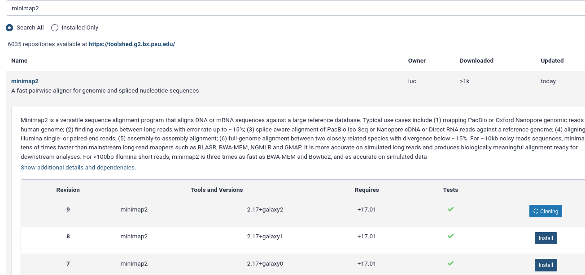

In this tutorial you will learn how to configure Galaxy to run jobs using [Singularity](https://sylabs.io/singularity/) containers provided by the [BioContainers](https://biocontainers.pro/) community.

## Background

> BioContainers is a community-driven project that provides the infrastructure and basic guidelines to create, manage and distribute bioinformatics packages (e.g conda) and containers (e.g docker, singularity). BioContainers is based on the popular frameworks Conda, Docker and Singularity.
>
> -- [https://biocontainers-edu.readthedocs.io/en/latest/what_is_biocontainers.html](https://biocontainers-edu.readthedocs.io/en/latest/what_is_biocontainers.html)
{: .quote}

Singularity is an alternative to Docker that is much friendlier for HPCs

> Singularity is a container platform. It allows you to create and run containers that package up pieces of software in a way that is portable and reproducible.
>
> -- [https://sylabs.io/guides/3.7/user-guide/introduction.html](https://sylabs.io/guides/3.7/user-guide/introduction.html)
{: .quote}

> <agenda-title></agenda-title>
>
> 1. TOC
> {:toc}
>
{: .agenda}



# Installing Singularity

First, we will install Singularity using Ansible. On most operating systems there is no package for singularity yet, so we must use a role which will compile it from source. If you're on CentOS7/8, it is available through the EPEL repository.

> <tip-title>CentOS7</tip-title>
> If you are using CentOS7, you can skip this hands-on section and instead install the `epel-release` and `singularity` system packages in your `pre_tasks`.
{: .tip}

> <hands-on-title>Installing Singularity with Ansible</hands-on-title>
>
> 1. In your working directory, add the Singularity role to your `requirements.yml` file:
>
>    
>    ```diff
>    --- a/requirements.yml
>    +++ b/requirements.yml
>    @@ -16,3 +16,7 @@
>       version: 0.0.1
>     - src: galaxyproject.cvmfs
>       version: 0.2.13
>    +- src: cyverse-ansible.singularity
>    +  version: 048c4f178077d05c1e67ae8d9893809aac9ab3b7
>    +- src: gantsign.golang
>    +  version: 2.6.3
>    
>    ```
>    {: data-commit="Add golang and singulary ansible roles"}
>
>    
>
> 2. Install the requirements with `ansible-galaxy`:
>
>    > <code-in-title>Bash</code-in-title>
>    > ```bash
>    > ansible-galaxy install -p roles -r requirements.yml
>    > ```
>    > {: data-cmd="true"}
>    {: .code-in}
>
> 4. Specify which version of Singularity you want to install, in `group_vars/galaxyservers.yml`:
>
>    
>    ```diff
>    --- a/group_vars/galaxyservers.yml
>    +++ b/group_vars/galaxyservers.yml
>    @@ -143,6 +143,12 @@ nginx_ssl_role: usegalaxy_eu.certbot
>     nginx_conf_ssl_certificate: /etc/ssl/certs/fullchain.pem
>     nginx_conf_ssl_certificate_key: /etc/ssl/user/privkey-nginx.pem
>     
>    +# Golang
>    +golang_gopath: '/opt/workspace-go'
>    +# Singularity target version
>    +singularity_version: "3.7.4"
>    +singularity_go_path: "{{ golang_install_dir }}"
>    +
>     # TUS
>     galaxy_tusd_port: 1080
>     tusd_instances:
>    
>    ```
>    {: data-commit="Configure golang and singularity"}
>
> 4. Add the new roles to your `galaxy.yml` playbook, before the Galaxy server itself. We'll do this bceause it's a dependency of Galaxy to run, so it needs to be there before Galaxy starts.
>
>    
>    ```diff
>    --- a/galaxy.yml
>    +++ b/galaxy.yml
>    @@ -14,6 +14,8 @@
>           become: true
>           become_user: postgres
>         - geerlingguy.pip
>    +    - gantsign.golang
>    +    - cyverse-ansible.singularity
>         - galaxyproject.galaxy
>         - role: uchida.miniconda
>           become: true
>    
>    ```
>    {: data-commit="Add the roles to the playbook"}
>
> 5. Run the playbook
>
>    > <code-in-title>Bash</code-in-title>
>    > ```bash
>    > ansible-playbook galaxy.yml
>    > ```
>    > {: data-cmd="true"}
>    {: .code-in}
>
> 6. Singularity should now be installed on your Galaxy server. You can test this by connecting
> to your server and run the following command:
>
>    > <code-in-title>Bash</code-in-title>
>    > ```
>    > singularity run docker://hello-world
>    > ```
>    {: .code-in}
>
>    > <code-out-title>Bash</code-out-title>
>    > ```
>    > INFO:    Converting OCI blobs to SIF format
>    > INFO:    Starting build...
>    > Getting image source signatures
>    > Copying blob 0e03bdcc26d7 done
>    > Copying config b23a8f6569 done
>    > Writing manifest to image destination
>    > Storing signatures
>    > 2021/01/08 11:25:12  info unpack layer: sha256:0e03bdcc26d7a9a57ef3b6f1bf1a210cff6239bff7c8cac72435984032851689
>    > INFO:    Creating SIF file...
>    > WARNING: passwd file doesn't exist in container, not updating
>    > WARNING: group file doesn't exist in container, not updating
>    >
>    > Hello from Docker!
>    > This message shows that your installation appears to be working correctly.
>    > ...
>    > ```
>    {: .code-out}
{: .hands_on}

## Configure Galaxy to use Singularity

Now, we will configure Galaxy to run tools using Singularity containers, which will be automatically fetched from [the BioContainers repository](https://quay.io/organization/biocontainers).

> <hands-on-title>Configure Galaxy to use Singularity</hands-on-title>
>
> 1. Edit the `group_vars/galaxyservers.yml` file and add a `dependency_resolvers_config_file` entry and a corresponding `galaxy_config_templatets` entry:
>
>    
>    ```diff
>    --- a/group_vars/galaxyservers.yml
>    +++ b/group_vars/galaxyservers.yml
>    @@ -29,6 +29,8 @@ miniconda_manage_dependencies: false
>     
>     galaxy_config:
>       galaxy:
>    +    dependency_resolvers_config_file: "{{ galaxy_config_dir }}/dependency_resolvers_conf.xml"
>    +    containers_resolvers_config_file: "{{ galaxy_config_dir }}/container_resolvers_conf.xml"
>         tool_data_table_config_path: /cvmfs/data.galaxyproject.org/byhand/location/tool_data_table_conf.xml,/cvmfs/data.galaxyproject.org/managed/location/tool_data_table_conf.xml
>         brand: "🧬🔬🚀"
>         admin_users: admin@example.org
>    @@ -87,6 +89,10 @@ galaxy_config:
>     galaxy_config_templates:
>       - src: templates/galaxy/config/job_conf.yml.j2
>         dest: "{{ galaxy_config.galaxy.job_config_file }}"
>    +  - src: templates/galaxy/config/container_resolvers_conf.xml.j2
>    +    dest: "{{ galaxy_config.galaxy.containers_resolvers_config_file }}"
>    +  - src: templates/galaxy/config/dependency_resolvers_conf.xml
>    +    dest: "{{ galaxy_config.galaxy.dependency_resolvers_config_file }}"
>     
>     # systemd
>     galaxy_manage_systemd: true
>    
>    ```
>    {: data-commit="Configure the container and dependency resolvers"}
>
> 2. Create the `templates/galaxy/config` directory if it doesn't exist:
>
>    > <code-in-title>Bash</code-in-title>
>    > ```bash
>    > mkdir -p templates/galaxy/config
>    > ```
>    > {: data-cmd="true"}
>    {: .code-in}
>
> 3. Create the new file `templates/galaxy/config/dependency_resolvers_conf.xml`. This will not enable any dependency resolvers like the legacy toolshed packages or Galaxy packages, and instead everything will be resolved through Singularity.
>
>    
>    ```diff
>    --- /dev/null
>    +++ b/templates/galaxy/config/dependency_resolvers_conf.xml
>    @@ -0,0 +1,2 @@
>    +<dependency_resolvers>
>    +</dependency_resolvers>
>    
>    ```
>    {: data-commit="Configure the dependency resolvers"}
>
> 3. Create the new file `templates/galaxy/config/container_resolvers_conf.xml.j2`, this specifies the order in which to attempt container resolution.
>
>    
>    ```diff
>    --- /dev/null
>    +++ b/templates/galaxy/config/container_resolvers_conf.xml.j2
>    @@ -0,0 +1,6 @@
>    +<containers_resolvers>
>    +  <explicit_singularity />
>    +  <cached_mulled_singularity cache_directory="{{ galaxy_mutable_data_dir }}/cache/singularity" />
>    +  <mulled_singularity auto_install="False" cache_directory="{{ galaxy_mutable_data_dir }}/cache/singularity" />
>    +  <build_mulled_singularity auto_install="False" cache_directory="{{ galaxy_mutable_data_dir }}/cache/singularity" />
>    +</containers_resolvers>
>    
>    ```
>    {: data-commit="Configure the container resolver"}
>
> 3. Now, we want to make Galaxy run jobs using Singularity. Modify the file `templates/galaxy/config/job_conf.yml.j2`, by adding the `singularity_enabled` parameter:
>
>    
>    ```diff
>    --- a/templates/galaxy/config/job_conf.yml.j2
>    +++ b/templates/galaxy/config/job_conf.yml.j2
>    @@ -4,10 +4,23 @@ runners:
>         workers: 4
>     
>     execution:
>    -  default: local_dest
>    +  default: singularity
>       environments:
>         local_dest:
>           runner: local_runner
>    +    singularity:
>    +      runner: local_runner
>    +      singularity_enabled: true
>    +      env:
>    +      # Ensuring a consistent collation environment is good for reproducibility.
>    +      - name: LC_ALL
>    +        value: C
>    +      # The cache directory holds the docker containers that get converted
>    +      - name: SINGULARITY_CACHEDIR
>    +        value: /tmp/singularity
>    +      # Singularity uses a temporary directory to build the squashfs filesystem
>    +      - name: SINGULARITY_TMPDIR
>    +        value: /tmp
>     
>     tools:
>     - class: local # these special tools that aren't parameterized for remote execution - expression tools, upload, etc
>    
>    ```
>    {: data-commit="Update the job_conf.yml with singularity destination"}
>
> 4. Re-run the playbook
>
>    > <code-in-title>Bash</code-in-title>
>    > ```bash
>    > ansible-playbook galaxy.yml
>    > ```
>    > {: data-cmd="true"}
>    {: .code-in}
>
> 5. In your Galaxy admin interface, install the minimap2 tool.
>
>    - Login to Galaxy as the admin user
>    - Click the "admin" menu at the top
>    - Under "Tool Management" on the left select "Install and Uninstall"
>    - search for `minimap2` and install the latest version with the Target Section "Mapping"
>
>    
>
> 6. Upload the following fasta file
>
>    ```
>    >testing
>    GATTACAGATHISISJUSTATESTGATTACA
>    ```
>
> 2. **Map with minimap2**  with the following parameters
>    - *"Will you select a reference genome from your history or use a built-in index"*: `Use a genome from history and build index`
>    - *"Use the following dataset as the reference sequence"*: The fasta file you uploaded
>    - *"Single or Paired-end reads"*: `Single`
>        -  *"Select fastq dataset"*: The fasta file you uploaded
>
>    Your job should be executed using Singularity with a BioContainer! You can watch the logs of Galaxy to see this happening.
>
>    > <code-in-title>Bash</code-in-title>
>    > ```
>    > journalctl -f
>    > ```
>    {: .code-in}
>
>    > <code-out-title></code-out-title>
>    > ```
>    > gunicorn[1190010]: galaxy.tool_util.deps.containers INFO 2021-01-08 13:37:30,342 [p:1190010,w:0,m:2] [LocalRunner.work_thread-1] Checking with container resolver [MulledSingularityContainerResolver[namespace=biocontainers]] found description [ContainerDescription[identifier=docker://quay.io/biocontainers/mulled-v2-66534bcbb7031a148b13e2ad42583020b9cd25c4:e1ea28074233d7265a5dc2111d6e55130dff5653-0,type=singularity]]
>    > gunicorn[1190010]: galaxy.jobs.command_factory INFO 2021-01-08 13:37:30,418 [p:1190010,w:0,m:2] [LocalRunner.work_thread-1] Built script [/srv/galaxy/jobs/000/23/tool_script.sh] for tool command [minimap2 --version > /srv/galaxy/jobs/000/23/outputs/COMMAND_VERSION 2>&1; ln -f -s '/data/000/dataset_22.dat' reference.fa && minimap2           -t ${GALAXY_SLOTS:-4} reference.fa '/data/000/dataset_22.dat' -a | samtools sort -@${GALAXY_SLOTS:-2} -T "${TMPDIR:-.}" -O BAM -o '/data/000/dataset_23.dat' > '/data/000/dataset_23.dat']
>    > gunicorn[1190010]: galaxy.jobs.runners DEBUG 2021-01-08 13:37:30,441 [p:1190010,w:0,m:2] [LocalRunner.work_thread-1] (23) command is: mkdir -p working outputs configs
>    > gunicorn[1190010]: if [ -d _working ]; then
>    > gunicorn[1190010]:     rm -rf working/ outputs/ configs/; cp -R _working working; cp -R _outputs outputs; cp -R _configs configs
>    > gunicorn[1190010]: else
>    > gunicorn[1190010]:     cp -R working _working; cp -R outputs _outputs; cp -R configs _configs
>    > gunicorn[1190010]: fi
>    > gunicorn[1190010]: cd working; SINGULARITYENV_GALAXY_SLOTS=$GALAXY_SLOTS SINGULARITYENV_HOME=$HOME SINGULARITYENV__GALAXY_JOB_HOME_DIR=$_GALAXY_JOB_HOME_DIR SINGULARITYENV__GALAXY_JOB_TMP_DIR=$_GALAXY_JOB_TMP_DIR SINGULARITYENV_TMPDIR=$TMPDIR SINGULARITYENV_TMP=$TMP SINGULARITYENV_TEMP=$TEMP singularity -s exec -B /srv/galaxy/server:/srv/galaxy/server:ro -B /srv/galaxy/var/shed_tools/toolshed.g2.bx.psu.edu/repos/iuc/minimap2/8c6cd2650d1f/minimap2:/srv/galaxy/var/shed_tools/toolshed.g2.bx.psu.edu/repos/iuc/minimap2/8c6cd2650d1f/minimap2:ro -B /srv/galaxy/jobs/000/23:/srv/galaxy/jobs/000/23 -B /srv/galaxy/jobs/000/23/outputs:/srv/galaxy/jobs/000/23/outputs -B /srv/galaxy/jobs/000/23/configs:/srv/galaxy/jobs/000/23/configs -B /srv/galaxy/jobs/000/23/working:/srv/galaxy/jobs/000/23/working -B /data:/data -B /srv/galaxy/var/tool-data:/srv/galaxy/var/tool-data:ro -B /srv/galaxy/var/tool-data:/srv/galaxy/var/tool-data:ro --home $HOME:$HOME docker://quay.io/biocontainers/mulled-v2-66534bcbb7031a148b13e2ad42583020b9cd25c4:e1ea28074233d7265a5dc2111d6e55130dff5653-0 /bin/bash /srv/galaxy/jobs/000/23/tool_script.sh > ../outputs/tool_stdout 2> ../outputs/tool_stderr; return_code=$?; cd '/srv/galaxy/jobs/000/23';
>    > ```
>    {: .code-out.code-max-300}
>
{: .hands_on}

> ```bash
> 1-run-minimap2.sh
> ```
> {: data-test="true"}
{: .hidden}

> <comment-title>Manage dependencies menu</comment-title>
> You can manually pull one or many containers for tools in the admin menu. Go to the admin menu, click Manage Dependencies and select the Containers tab. This will list all tools, their dependencies and whether containers are already pulled or can be pulled on demand.
>
> When a container has been resolved through Singularity, you'll see something like this:
> 
{: .comment}

> <tip-title>Singularity, Conda, something else?</tip-title>
> We often hear
>
> > What would be the best practice, use conda or Singularity?
> {: .quote}
>
> Many of us are moving towards Singularity. Conda environments can resolve differently if they were installed at different times, which isn't great for reproducibility. Singularity images are never updated after generation which makes them fantastic. Also the isolation that's there by default is an incredible improvement for less-trustworthy binaries.
{: .tip}

> <tip-title>Does Singularity fix issues with Conda dependencies resolution?</tip-title>
> Yes and no. Singularity images are built from conda environments. Only now you are no longer responsible for solving the conda environment, or ensuring that all of the dependencies are installed. The Galaxy project uses a system called "mulling" to bring together multiple conda dependencies together in a single environment, and Singularity images are produced for these dependencies as well. That said, complex or unresolvable conda environments are not solved by Singularity, because Singularity is really just packaging conda's environment into a single binary file.
{: .tip}


> <tip-title>Gateway Time-out (504) in Dependencies view</tip-title>
> When you open "Admin -> Tool Management -> Manage Dependencies -> Containers", it sometimes shows "Gateway Time-out (504)"
>
> Resolving all dependencies for all tools can take a bit, you can increase your timeout with the `uwsgi_read_timeout` setting in `templates/nginx/galaxy.j2`
{:.tip}

> <tip-title>Resolution is "unresolved"</tip-title>
> In "Admin -> Tool Management -> Manage Dependencies -> Dependencies", the Resolution for minimap2 @ 2.24 (as well as samtools @1.14) is "unresolved". How can I resolve this issue?
>
> Because our training uses containers for resolution it is expected that the non-container dependencies show as "unresolved". There is not currently a view which indicates if the containers have been resolved.
{: .tip}


<!--
## Use Singularity containers from CVMFS

Galaxy can be configured to use pre-made Singularity containers available from /cvmfs/singularity.galaxyproject.org/.
In order to do so, you will first need to set up CVMFS by doing the [CVMFS]({{ site.baseurl }}/topics/admin/tutorials/cvmfs/tutorial.html) tutorial.
After finishing the CVMFS tutorial, come back, and do this hands-on.

> <hands-on-title>Optional: Configure Galaxy to use Singularity containers from CVMFS</hands-on-title>
>
> 1. Edit the `group_vars/galaxyservers.yml` file and add `containers_resolvers_config_file` and `galaxy_singularity_images_cvmfs_path`:
>
>    ```yaml
>    galaxy_singularity_images_cvmfs_path: "/cvmfs/singularity.galaxyproject.org/all/"
>    galaxy_config:
>      galaxy:
>        ...
>        containers_resolvers_config_file: "{{ galaxy_config_dir }}/container_resolvers_conf.xml"
>    ```
>
>
> 2. Also in `group_vars/galaxyservers.yml`, add a `galaxy_config_templates` entry:
>
>    ```yaml
>    galaxy_config_templates:
>      - src: templates/galaxy/config/container_resolvers_conf.xml.j2
>        dest: "{{ galaxy_config_dir }}/container_resolvers_conf.xml"
>    ```
>
>
> 3. Create the new file `templates/galaxy/config/container_resolvers_conf.xml.j2`:
>
>    ```xml
>    <containers_resolvers>
>        <explicit_singularity />
>        <cached_mulled_singularity cache_directory="{{ galaxy_singularity_images_cvmfs_path }}"/>
>    </containers_resolvers>
>    ```
>
>
> 4. Re-run the playbook (`ansible-playbook galaxy.yml`)
>
> 5. Rerun your minimap2 job from the previous section. This time it should use a container served by CVMFS.
>
{: .hands_on}

> ```bash
> 1-run-minimap2.sh
> ```
> {: data-test="true"}
{: .hidden}

-->


