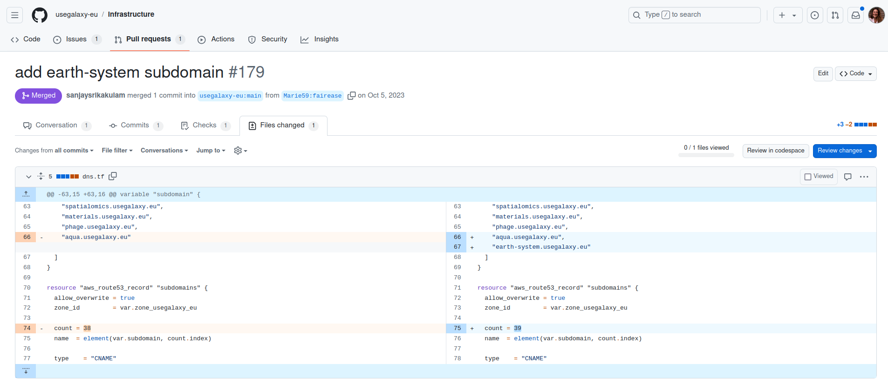
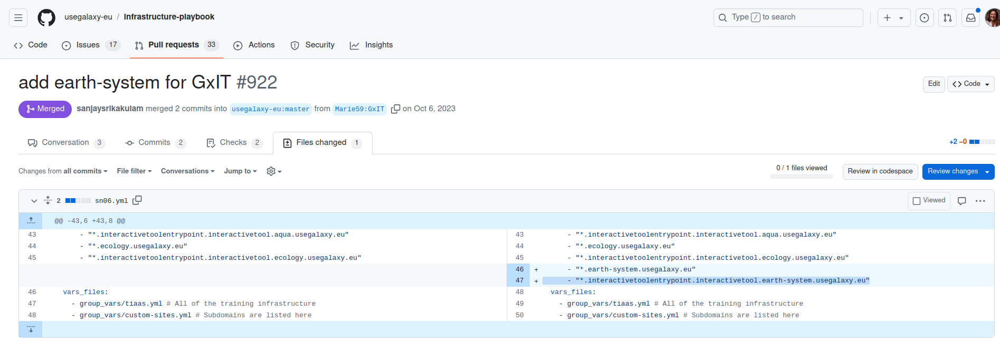
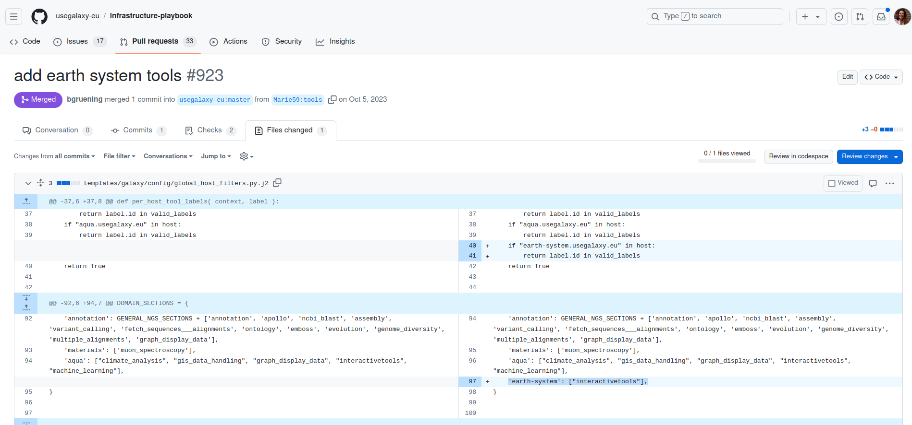
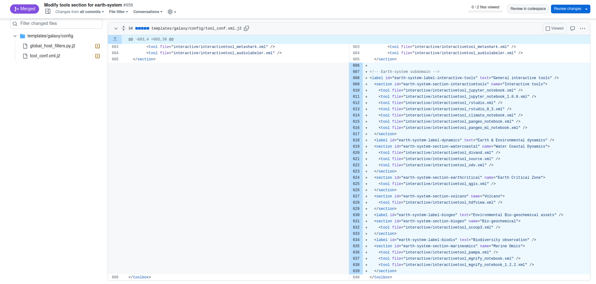
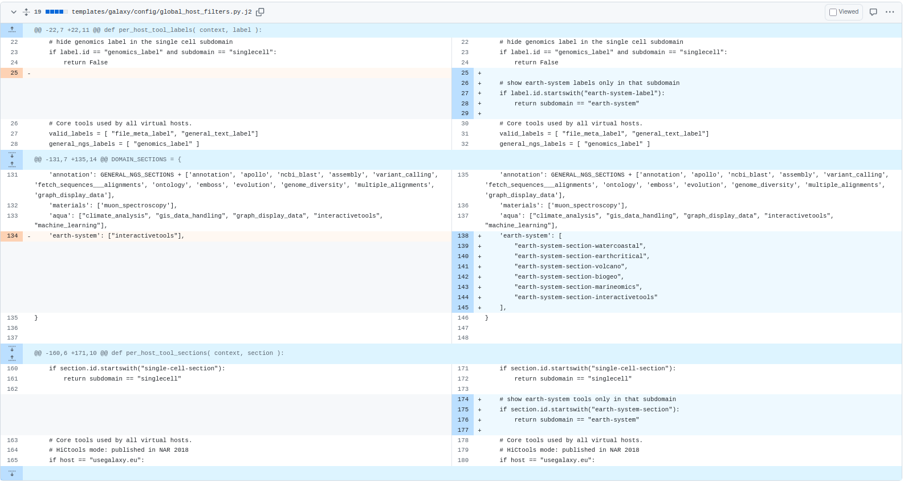

This tutorial covers how to set up a subdomain on usegalaxy.eu. We will take here the example of the [earth system subdomain](https://earth-system.usegalaxy.eu/) and follow the step one by one. 

> <agenda-title></agenda-title>
>
> In this tutorial, we will cover:
>
> 1. TOC
> {:toc}
>
{: .agenda}

# Add your subdomain on a Galaxy server

> <hands-on-title>Subdomain name</hands-on-title>
>    - Clone the Github repository of the Galaxy server (of where you want your subdomain to be attached)
>    - For Galaxy europe clone the [Infrastructure repo](https://github.com/usegalaxy-eu/infrastructure)
>    - Create a branch on your fork
>    - Open the file **dns.tf** and edit it 
>    - You should add the name of your subdomain to the list my_new_and_shiny_subdomain.usegalaxy.eu or for the example here earth-system.usegalaxy.eu AND update **count** (number of subdomains) as shown below.
> 
> 
>
>   - Then commit your changes and write a nice message for the admin when you open your Pull Request.
{: .hands_on}


# Enable the interactive tools 

> <hands-on-title>Galaxy Interactive Tool</hands-on-title>
>    - Clone the Github repository of the Galaxy server (of where you want your subdomain to be attached)
>    - For Galaxy europe clone the [Infrastructure-playbook repo](https://github.com/usegalaxy-eu/infrastructure-playbook/tree/master)
>    - Create a branch on your fork
>    - Open the file **sn06.yml** and edit it 
>    - You should add the name of your subdomain to the list "*.my_new_and_shiny_subdomain.usegalaxy.eu" or for the example here "*.earth-system.usegalaxy.eu" 
>    - AND add "*.interactivetoolentrypoint.interactivetool.earth-system.usegalaxy.eu" as shown below.
> 
> 
>
>   - Then commit your changes and write a nice message for the admin when you open your Pull Request.
{: .hands_on}

> <hands-on-title>Add the interactive tool section to the tool panel</hands-on-title>
>    - First, on your **Infrastructure-playbook** fork, create a new branch
>    - Go to **templates/galaxy/config/**
>    - Open the file **global_host_filters.py.j2** and edit it 
>    - In the function per_host_tool_labels add your subdomain as followed
> ```
> if "earth-system.usegalaxy.eu" in host:
>   return label.id in valid_labels"
> ```
>   - Then in the **DOMAIN_SECTIONS** add the the interactive tool section (this will allow to see on the subdomain interface the tool section "Interactive tools") as folowed:
> `'earth-system': ["interactivetools"],`
>
> 
>
>   - Second, on the same fork go to **files/traefik/rules/**
>   - Open and edit **template-subdomains.yml**, there you need to add the folowing line for your subdomain `{{template "subdomain" "my_new_and_shiny_subdomain"}}`
>
>   - Finally, commit all your changes and write a nice message for the admin when you open your Pull Request.
{: .hands_on}


# Make a nice tool panel (only for interactive tools)

> <hands-on-title>Customize the tool panel (only for the interactive tools)</hands-on-title>
>    - On your **Infrastructure-playbook** fork (don't forget to synchronize it)
>    - First, go to **templates/galaxy/config/**
>    - Open the file **tool_conf.xml.j2** and edit it 
>    - From there you can create your own tool sections where your different interactive tools can be organized. See the example of earth-system below.
> 
>
>   - Then, commit your changes
>   
>   - Secondly, still in **templates/galaxy/config/**
>   - Open the file **global_host_filters.py.j2** and edit it 
>   - Add the different new sections of tools created to your subdomain and prevent those new sections to appear in any other subdomain as shown below.
>  
>
>   - Then commit your changes and write a nice message for the admin when you open your Pull Request.
{: .hands_on}

# Customize the front page 

> <hands-on-title>Update the homepage</hands-on-title>
>    - For Galaxy europe clone the [website repo](https://github.com/usegalaxy-eu/website/tree/master)
>    - Create a branch on your fork
>    - Create an index file in markdown for instance "index-earth-system.md"
>    - Once created let your imagnination flows to make the looks and feel of your homepage (if needed here is a [PR example](https://github.com/usegalaxy-eu/website/pull/1149))
>    - If you want to add images to your front page add them as folowed **assets/media/my_incredidle_image.png**
>
>   - Then commit your changes, write a nice message for the admin when you open your Pull Request.
> If in the future you want to change the front page just update the index file.
{: .hands_on}

> <tip-title>Add a custom welcome.html</tip-title>
> There is also the possibility to add a custom welcome.html, as well as other custom static files like the [singlecell subdomain did](https://github.com/usegalaxy-eu/infrastructure-playbook/tree/master/files/galaxy/subdomains/singlecell/static)
{: .tip}

> <hands-on-title>Add a theme</hands-on-title>
>    - On your **Infrastructure-playbook** fork (don't forget to synchronize it)
>    - Go to **group_vars/sn06/**
>    - Open the file **subdomains.yml** and edit it. There you have to add the name of your subdomain.
>    - In this same file you can also customize a theme for your subdomain. 
{: .hands_on}

# Let people know

> <hands-on-title>Make some communication on your new subdomain</hands-on-title>
>    - Clone the [galaxy-hub repo](https://github.com/galaxyproject/galaxy-hub/tree/master)
>    - Create a branch on your fork
>    - In **content/news** create a folder for your news example "2023-10-17-earth-system" and in it create an **index.md** file 
>    - In this index file write your blog post don't hesitate to add some nice photos
>
>   - Then commit your changes and open your Pull Request.
{: .hands_on}

# Conclusion
Your Subdomain is ready to be used !
