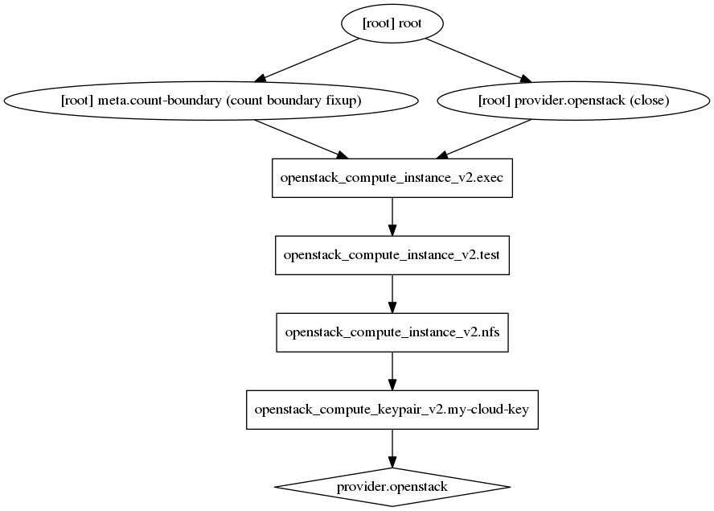
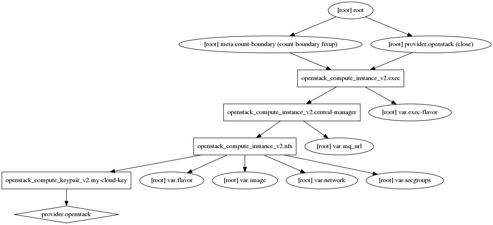

# Overview
{:.no_toc}

In this tutorial we will briefly cover what [Terraform](https://www.terraform.io) is and how you can leverage it for your needs. This will not make you an expert on Terraform but will give you the tools you need in order to maintain your cloud infrastructure as code.

This will be a very practical training with emphasis on looking at examples from modules and becoming self sufficient. This tutorial uses the OpenStack provider for Terraform. Other Cloud providers are available, but their invocation will be different from that which is described here.

> ### Agenda
>
> 1. TOC
> {:toc}
>
{: .agenda}

# Cattle vs. Pets

For those of you with more experience as System Administrators, you may have heard the term "cattle vs. pets."

Pets
:    These servers are managed by hand, with admins SSHing in to make changes directly on the machine, and no log of this. If a "pet" dies, everyone is sad.

Cattle
:    These servers are managed in bulk, you no longer own a beloved pet but hundreds of identical ones. You stop caring if an individual server lives or dies as you have many identical ones ready to take its place, and you can easily replace them.


# What is Terraform?

Terraform is a tool you can use to "sync" your infrastructure (VMs in Clouds, DNS records, etc.) with code you have written in configuration files. This is known as **infrastructure as code**.
Knowing that your infrastructure is exactly what you expect it to be can simplify your operations significantly. You can have confidence that if anything changes, any images crash or are accidentally deleted, that you can immediately re-build your infrastructure.

UseGalaxy.eu used Terraform to migrate easily between clouds, when our old cloud shut down and our new cloud was launched. We simply updated the credentials for connecting to the cloud, and ran Terraform. It recognised that none of our existing resources were there and recreated all of them. This made life incredibly easy for us, we knew that our infrastructure would be exactly correct relative to what it looked like in the previous cloud.

## What can be managed

Terraform supports [many providers](https://www.terraform.io/docs/providers/index.html), allowing you to easily manage resources no matter where they are located. Primarily this consists of resources like virtual machines and DNS records.

If you have VMs you are managing, whether for individual projects or for large scale infrastructure like UseGalaxy.eu, your work or research can be simpler and more reproducible if you are doing it with automation like Terraform.

## What should be managed

Support for certain databases and other software is available, but whether or not this is a good idea depends heavily on your workflow. UseGalaxy.eu found that managing databases and database users was not a good fit with our workflow. We launch VMs with terraform and then provision them with ansible. To then have a second step where we re-connect and provision the database with terraform was an awkward workflow, so we mostly let Ansible manage these resources.

Some groups use Ansible or Bash scripts in order to launch VMs. This can be a better workflow for certain cases. Launching VMs that manage themselves or are automatically scaled by some external process is not a good fit. Terraform expects the resource to be there the next time, with the same ID, with the same values, and will alert you if it isn't.

# Managing a Single VM

We will start small, by managing a single VM in our cloud account. Make sure you have your OpenStack credentials available.

> ###  Obtaining credentials from OpenStack dashboard
>
> You can download the environment file with the credentials from the OpenStack dashboard.
>
> - Log in to the OpenStack dashboard, choose the project for which you want to download the OpenStack RC file, and click "Access & Security".
> - Click "Download OpenStack RC File" and save the file.
{: .tip}

<!-- TODO(hxr): add example DO config? -->

## Keypair

Terraform reads all files with the extension `.tf` in your current directory. Resources can be in a single file, or organised across several different files. We had the best experience by separating out logical groups of resources:

- DNS entries in a single file
- Security groups in separate `.tf` files
- Keypairs in a single file
- Servers/Instances in individual files.

> ###  Hands-on: Setting up Terraform
>
> 1. [Install Terraform](https://www.terraform.io/downloads.html)
>
> 2. Create a new directory and go into it.
>
> 3. Create a `providers.tf` file with the following contents:
>
>    ```ini
>    provider "openstack" {}
>    ```
>
>    This specifies the configuration for the OpenStack plugin. You can either specify the configuration in the plugin, or it will automatically load the values from the normal OpenStack environment variable names.
>
> 4. Run `terraform init`
>
>    > ###  Question
>    >
>    > What did the output look like?
>    >
>    > > ###  Solution
>    > >
>    > > If this is not the first time you've run it, you will see Terraform download any missing providers:
>    > >
>    > > ```
>    > > Initializing provider plugins...
>    > > - Checking for available provider plugins on https://releases.hashicorp.com...
>    > > - Downloading plugin for provider "openstack" (1.10.0)...
>    > >
>    > > The following providers do not have any version constraints in configuration,
>    > > so the latest version was installed.
>    > >
>    > > To prevent automatic upgrades to new major versions that may contain breaking
>    > > changes, it is recommended to add version = "..." constraints to the
>    > > corresponding provider blocks in configuration, with the constraint strings
>    > > suggested below.
>    > >
>    > > * provider.openstack: version = "~> 1.10"
>    > >
>    > > Terraform has been successfully initialized!
>    > >
>    > > You may now begin working with Terraform. Try running "terraform plan" to see
>    > > any changes that are required for your infrastructure. All Terraform commands
>    > > should now work.
>    > >
>    > > If you ever set or change modules or backend configuration for Terraform,
>    > > rerun this command to reinitialize your working directory. If you forget, other
>    > > commands will detect it and remind you to do so if necessary.
>    > > ```
>    > >
>    > {: .solution }
>    {: .question}
{:.hands_on}

This is the minimum to get started with Terraform, defining which providers we will use and any parameters for them. We have two options now:

1. We can load the OpenStack credentials as environment variables
2. We can code the OpenStack credentials in the `providers.tf` file

We recommend the first option, as often Terraform plans are [made publicly available](https://github.com/usegalaxy-eu/infrastructure) in order to collaborate on them, and this prevents accidentally committing your credentials to the git repository where.

We will start by managing your SSH keypair for the cloud as this is an easy thing to add.

> ###  Your Operating System
>
> If you are on Windows and do not know your public key, please skip to the "Adding an Instance" section, as you probably do not have the tools installed to do this, and we cannot document how to do it. Instead you can simply reference the key by name later. We will point out this location.
>
{: .comment}

> ###  Hands-on: Keypairs
>
> 1. Find the public key you will use for connecting to the your new VM. It is usually known as `id_rsa.pub`
>
>    > ###  No public key
>    > If you can find the private key file (possibly a `cloud.pem` file you downloaded earlier from OpenStack), then you can find the public key by running the command:
>    >
>    > ```shell
>    > $ ssh-keygen -y -f /path/to/key.pem
>    > ```
>    {: .comment}
>
> 2. Create a new file, `main.tf` with the following structure. In `public_key`, write the complete value of your public key that you found in the first step.
>
>    ```ini
>    resource "openstack_compute_keypair_v2" "my-cloud-key" {
>      name       = "my-key"
>      public_key = "ssh-rsa AAAAB3Nz..."
>    }
>    ```
>
> 3. Run `terraform plan`
>
>    > ###  Question
>    >
>    > What does the output look like? Did it execute successfully?
>    >
>    > > ###  Solution
>    > >
>    > > If you have not sourced your OpenStack credentials file, you will see something like the following:
>    > >
>    > > ```
>    > > Error: Error running plan: 1 error(s) occurred:
>    > >
>    > > * provider.openstack: One of 'auth_url' or 'cloud' must be specified
>    > > ```
>    > >
>    > > You should source your openstack credentials first. This is the file which has lines like:
>    > >
>    > > ```bash
>    > > export OS_AUTH_URL=https://...
>    > > export OS_PROJECT_ID=...
>    > > export OS_PROJECT_NAME="..."
>    > > export OS_USER_DOMAIN_NAME="Default"
>    > > ```
>    > >
>    > > You should run `source /path/to/file.sh` in your terminal, and then re-run `terraform plan`:
>    > >
>    > > ```
>    > > An execution plan has been generated and is shown below.
>    > > Resource actions are indicated with the following symbols:
>    > >   + create
>    > >
>    > > Terraform will perform the following actions:
>    > >
>    > >   + openstack_compute_keypair_v2.my-cloud-key
>    > >       id:          <computed>
>    > >       fingerprint: <computed>
>    > >       name:        "my-key"
>    > >       private_key: <computed>
>    > >       public_key:  "ssh-rsa AAAAB...."
>    > >       region:      <computed>
>    > >
>    > >
>    > > Plan: 1 to add, 0 to change, 0 to destroy.
>    > > ```
>    > >
>    > > If you see this, then everything ran successfully
>    > >
>    > {: .solution }
>    {: .question}
>
{: .hands_on }

Let's look at the output in detail:

```
An execution plan has been generated and is shown below.
Resource actions are indicated with the following symbols:
  + create

Terraform will perform the following actions:

  + openstack_compute_keypair_v2.my-cloud-key
      id:          <computed>
      fingerprint: <computed>
      name:        "my-key"
      private_key: <computed>
      public_key:  "ssh-rsa AAAAB..."
      region:      <computed>


Plan: 1 to add, 0 to change, 0 to destroy.

------------------------------------------------------------------------

Note: You didn't specify an "-out" parameter to save this plan, so Terraform
can't guarantee that exactly these actions will be performed if
"terraform apply" is subsequently run.
```

Terraform informs us first about the different symbols used. Here it tells us that it will `+ create` a resource. Sometimes it will `- delete` or `~ update in-place`. Next it describes in detail what will be done and why. For creating a resource it does not give us much information, we will see more types of changes later.

Lastly it informs us that we did not save our plan. Terraform can maintain a concept of what the remote resource's state looks like between your `terraform plan` and `terraform apply` steps. This is a more advanced feature and will not be covered today.

> ###  Hands-on: Applying our plan
>
> Now that you've reviewed the plan and everything looks good, we're ready to apply our changes.
>
> 1. Run `terraform apply`. Because we did not re-use our plan from the previous step, terraform will re-run the plan step first, and request your confirmation:
>
>    ```
>    An execution plan has been generated and is shown below.
>    Resource actions are indicated with the following symbols:
>      + create
>
>    Terraform will perform the following actions:
>
>      + openstack_compute_keypair_v2.my-cloud-key
>          id:          <computed>
>          fingerprint: <computed>
>          name:        "my-key"
>          private_key: <computed>
>          public_key:  "" => "ssh-rsa AAAAB3..."
>          region:      <computed>
>
>
>    Plan: 1 to add, 0 to change, 0 to destroy.
>
>    Do you want to perform these actions?
>      Terraform will perform the actions described above.
>      Only 'yes' will be accepted to approve.
>
>      Enter a value:
>    ```
>
> 2. Confirm that everything looks good and enter the value 'yes', and hit enter.
>
>    ```
>    openstack_compute_keypair_v2.my-cloud-key: Creating...
>      fingerprint: "" => "<computed>"
>      name:        "" => "my-key"
>      private_key: "" => "<computed>"
>      public_key:  "" => "ssh-rsa AAAAB3..."
>      region:      "" => "<computed>"
>    openstack_compute_keypair_v2.my-cloud-key: Creation complete after 3s (ID: my-key)
>
>    Apply complete! Resources: 1 added, 0 changed, 0 destroyed.
>    ```
>
>
>    > ###  "Key pair 'my-key' already exists"
>    >
>    > If you see an error message that says:
>    >
>    > ```
>    > {"conflictingRequest": {"message": "Key pair 'my-key' already exists.", "code": 409}}
>    > ```
>    >
>    > Then you already have a keypair with this name. You should update the `name = "my-key"` to use a different name.
>    {: .comment}
>
{: .hands_on}

We should now have a keypair in our cloud!

## Adding an Instance

We now have:

- Terraform installed
- The OpenStack plugin initialized
- A keypair in OpenStack

> ###  Doing this training outside of a training event
> If you are doing this training outside of an event, then you will likely need to do some additional steps specific to your Cloud:
>
> 1. Identify a small image flavor that you can use for your testing.
>
> 2. Upload this `raw` format image available from [UseGalaxy.eu](https://usegalaxy.eu/static/vgcn/denbi-centos7-j10-2e08aa4bfa33-master.raw) to your OpenStack
>
> You will need to do both of these things before you can proceed.
{: .comment}

You are now ready to launch an instance!

> ###  Hands-on: Launching an Instance
>
> 1. Open your `main.tf` in your text editor and add the following.
>
>    > ###  Warning: Correct image/flavor/network/security_group names
>    > The documentation below notes some specific values for the `image_name`, `flavor_name`, `security_groups`, and `network` properties. These *may not be correct* for your training, instead your instructor will provide these values to you.
>    {: .warning}
>
>    ```ini
>    resource "openstack_compute_instance_v2" "test" {
>      name            = "test-vm"
>      image_name      = "denbi-centos7-j10-2e08aa4bfa33-master"
>      flavor_name     = "m1.tiny"
>      key_pair        = "${openstack_compute_keypair_v2.my-cloud-key.name}"
>      security_groups = ["default"]
>
>      network {
>        name = "public"
>      }
>    }
>    ```
>
>    There are some important things to note, we reproduce the above configuration but with comments:
>
>    "openstack_compute_instance_v2" is the 'type' of a resource, 'test' is the name of this specific resource.
>    ```
>    resource "openstack_compute_instance_v2" "test" {
>    ```
>
>    This will become the server name
>    ```
>      name            = "test-vm"
>    ```
>
>    The image which will be launched
>    ```
>      image_name      = "denbi-centos7-j10-2e08aa4bfa33-master"
>    ```
>
>    Which flavor
>    ```
>      flavor_name     = "m1.tiny"
>    ```
>
>    This uses Terraform's knowledge of the
>    `openstack_compute_keypair_v2.my-cloud-key` resource which you
>    previously described. Then it accesses the `.name` attribute.
>    This allow your to update the name at any time, and still have your
>    resource definitions be correct.
>    ```
>      key_pair        = "${openstack_compute_keypair_v2.my-cloud-key.name}"
>    ```
>
>    The security group to apply. This is a comma separated list, but
>    `default` should work for most OpenStack clouds.
>    ```
>      security_groups = ["default"]
>    ```
>
>    A network that is accessible to you.
>    ```
>      network {
>        name = "public"
>      }
>    ```
>
> 2. Run `terraform apply`. Running the `plan` step is not necessary, it is just useful to see what changes will be applied without starting the apply process.
>
>    Note that first terraform "refreshes" the state of the remote resources that it already manages, before checking what changes need to be made.
>
>    ```
>    $ terraform apply
>    openstack_compute_keypair_v2.my-cloud-key: Refreshing state... (ID: my-key)
>
>    An execution plan has been generated and is shown below.
>    Resource actions are indicated with the following symbols:
>      + create
>
>    Terraform will perform the following actions:
>
>      + openstack_compute_instance_v2.test
>          id:                         <computed>
>          access_ip_v4:               <computed>
>          access_ip_v6:               <computed>
>          all_metadata.%:             <computed>
>          availability_zone:          <computed>
>          flavor_id:                  <computed>
>          flavor_name:                "m1.tiny"
>          force_delete:               "false"
>          image_id:                   <computed>
>          image_name:                 "denbi-centos7-j10-2e08aa4bfa33-master"
>          key_pair:                   "my-key"
>          name:                       "test-vm"
>          network.#:                  "1"
>          network.0.access_network:   "false"
>          network.0.fixed_ip_v4:      <computed>
>          network.0.fixed_ip_v6:      <computed>
>          network.0.floating_ip:      <computed>
>          network.0.mac:              <computed>
>          network.0.name:             "public"
>          network.0.port:             <computed>
>          network.0.uuid:             <computed>
>          power_state:                "active"
>          region:                     <computed>
>          security_groups.#:          "1"
>          security_groups.3814588639: "default"
>          stop_before_destroy:        "false"
>
>
>    Plan: 1 to add, 0 to change, 0 to destroy.
>
>    Do you want to perform these actions?
>      Terraform will perform the actions described above.
>      Only 'yes' will be accepted to approve.
>
>      Enter a value:
>    ```
>
> 3. If everything looks good, enter 'yes'.
>
>    ```
>    openstack_compute_instance_v2.test: Creating...
>      access_ip_v4:               "" => "<computed>"
>      access_ip_v6:               "" => "<computed>"
>      all_metadata.%:             "" => "<computed>"
>      availability_zone:          "" => "<computed>"
>      flavor_id:                  "" => "<computed>"
>      flavor_name:                "" => "m1.tiny"
>      force_delete:               "" => "false"
>      image_id:                   "" => "<computed>"
>      image_name:                 "" => "denbi-centos7-j10-2e08aa4bfa33-master"
>      key_pair:                   "" => "my-key"
>      name:                       "" => "test-vm"
>      network.#:                  "" => "1"
>      network.0.access_network:   "" => "false"
>      network.0.fixed_ip_v4:      "" => "<computed>"
>      network.0.fixed_ip_v6:      "" => "<computed>"
>      network.0.floating_ip:      "" => "<computed>"
>      network.0.mac:              "" => "<computed>"
>      network.0.name:             "" => "public"
>      network.0.port:             "" => "<computed>"
>      network.0.uuid:             "" => "<computed>"
>      power_state:                "" => "active"
>      region:                     "" => "<computed>"
>      security_groups.#:          "" => "1"
>      security_groups.3814588639: "" => "default"
>      stop_before_destroy:        "" => "false"
>    openstack_compute_instance_v2.test: Still creating... (10s elapsed)
>    openstack_compute_instance_v2.test: Still creating... (20s elapsed)
>    openstack_compute_instance_v2.test: Creation complete after 30s (ID: 7a2ed5ba-0801-49b5-bf1b-9bf9cec733fa)
>
>    Apply complete! Resources: 1 added, 0 changed, 0 destroyed.
>    ```
{: .hands_on}

You now have a running instance! We do not know the IP address so we cannot login yet. You can obtain that from the OpenStack dashboard, or via the `terraform show` command


> ###  `terraform show` and logging in
>
> 1. Run `terraform show`
>
>    The values in the following output will not match yours.
>
>    ```
>    openstack_compute_instance_v2.test:
>      id = 7a2ed5ba-0801-49b5-bf1b-9bf9cec733fa
>      access_ip_v4 = 192.52.32.231
>      access_ip_v6 =
>      all_metadata.% = 0
>      availability_zone = nova
>      flavor_id = a9a58bcf-29a3-47f4-b4c3-e71e40127833
>      flavor_name = m1.tiny
>      force_delete = false
>      image_id = 922ae172-275b-4e6a-bb9d-c7ace52fc8d4
>      image_name = denbi-centos7-j10-2e08aa4bfa33-master
>      key_pair = my-key
>      name = test-vm
>      network.# = 1
>      network.0.access_network = false
>      network.0.fixed_ip_v4 = 192.52.32.231
>      network.0.fixed_ip_v6 =
>      network.0.floating_ip =
>      network.0.mac = fa:16:3e:e6:cd:6c
>      network.0.name = public
>      network.0.port =
>      network.0.uuid = 6a68b40c-356f-4d4c-95e9-e5c72855fb35
>      power_state = active
>      region = Freiburg
>      security_groups.# = 1
>      security_groups.3814588639 = default
>      stop_before_destroy = false
>    openstack_compute_keypair_v2.my-cloud-key:
>      id = my-key
>      fingerprint = 4a:72:2c:7e:d2:b7:f2:c4:5a:9e:bb:ca:c7:8f:d7:a3
>      name = my-key
>      private_key =
>      public_key = ssh-rsa AAAAB3...
>      region = Freiburg
>    ```
>
> 2. Here we can obtain the IP address. In the above output, it is `192.52.32.231`
>
> 3. Login with `ssh`: `ssh centos@<your-ip-address>`. You should see something like the following:
>
>    ```
>    The authenticity of host '192.52.32.231 (192.52.32.231)' can't be established.
>    ECDSA key fingerprint is SHA256:oEHgotonwT3a47K0kLdsNVd/QqctBjDK7F829J0VnwQ.
>    Are you sure you want to continue connecting (yes/no)? yes
>    Warning: Permanently added '192.52.32.231' (ECDSA) to the list of known hosts.
>          _        _   _ ____ _____
>         | |      | \ | |  _ \_   _| ██      ██
>       __| | ___  |  \| | |_) || |     ██████
>      / _' |/ _ \ | . ' |  _ < | |     ██████
>     | (_| |  __/_| |\  | |_) || |_  ██  ██  ██
>      \__,_|\___(_)_| \_|____/_____| ██  ██  ██
>    ====================================================
>    Hostname..........: test-vm.novalocal
>    Release...........: CentOS Linux release 7.5.1804 (Core)
>    Build.............: de.NBI Generic denbi-centos7-j10-2e08aa4bfa33-master
>    Build Date........: 2018-10-24T14:28:38Z
>    Current user......: centos
>    Load..............: 0.00 0.07 0.05 2/148 1644
>    Uptime............: up 5 minutes
>    ====================================================
>    [centos@test-vm ~]$
>    ```
>
{: .hands_on}

With this, you're done. You've launched a single VM with Terraform. The image we are using comes with:

- HTCondor
- Docker
- Singularity
- Conda
- CVMFS connected to Galaxyproject's biological databases and Singularity containers

This is very similar to the standard image that UseGalaxy.eu uses for all of its compute nodes.

# Managing a Cluster of VMs

When you are done playing around with the individual VM, we're ready to explore launching an entire cluster.

- We will launch a VM to act as our HTCondor central manager
- We will launch a VM to act as an NFS server for our "cluster"
- We will launch two execution nodes to process jobs

We use a very similar setup for our production cloud cluster that powers UseGalaxy.eu's compute and training infrastructure.

## Configuration

We will start by setting up the new nodes and launching them as a test:

> ###  Hands-on: Adding configuration for other nodes
>
> 1. Update the name of the instance you already have, `test` to `name = "central-manager"`. This will be our scheduler central manager.
>
>    ```
>    resource "openstack_compute_instance_v2" "test" {
>      name            = "central-manager"
>      ...
>    }
>    ```
>
> 2. Add the NFS server. It is mostly the same configuration you've done before, just with a different `name` and resource name.
>
>    ```
>    resource "openstack_compute_instance_v2" "nfs" {
>      name            = "nfs-server"
>      image_name      = "denbi-centos7-j10-2e08aa4bfa33-master"
>      flavor_name     = "m1.tiny"
>      key_pair        = "${openstack_compute_keypair_v2.my-cloud-key.name}"
>      security_groups = ["default"]
>
>      network {
>        name = "public"
>      }
>    }
>    ```
>
> 3. Lastly, we'll add the execution nodes. Here we will launch two servers at once by using the `count` parameter. We can add `count` in the main portion of a Terraform resource definition and it will create that many copies of that same resource. In the case where we wish to be able to distinguish between them, we can use `${count.index}` in the name or another field to distinguish them.
>
>    ```ini
>    resource "openstack_compute_instance_v2" "exec" {
>      name            = "exec-${count.index}"
>      image_name      = "denbi-centos7-j10-2e08aa4bfa33-master"
>      flavor_name     = "m1.tiny"
>      key_pair        = "${openstack_compute_keypair_v2.my-cloud-key.name}"
>      security_groups = ["default"]
>      count           = 2
>
>      network {
>        name = "public"
>      }
>    }
>    ```
>
> 4. Run `terraform apply`
>
>    You will see something like the following:
>
>    ```
>    openstack_compute_keypair_v2.my-cloud-key: Refreshing state... (ID: my-key)
>    openstack_compute_instance_v2.test: Refreshing state... (ID: 7a2ed5ba-0801-49b5-bf1b-9bf9cec733fa)
>
>    An execution plan has been generated and is shown below.
>    Resource actions are indicated with the following symbols:
>      + create
>      ~ update in-place
>
>    Terraform will perform the following actions:
>
>      + openstack_compute_instance_v2.exec[0]
>          id:                         <computed>
>          access_ip_v4:               <computed>
>          access_ip_v6:               <computed>
>          all_metadata.%:             <computed>
>          availability_zone:          <computed>
>          ...
>
>      ~ openstack_compute_instance_v2.test
>          name:                       "test-vm" => "central-manager"
>
>
>    Plan: 3 to add, 1 to change, 0 to destroy.
>
>    Do you want to perform these actions?
>      Terraform will perform the actions described above.
>      Only 'yes' will be accepted to approve.
>
>      Enter a value:
>    ```
>
>    This time, Terraform is able to modify the `openstack_compute_instance_v2.test` resource in place, it can just update the name of the VM. It will also create the other three requested resources.
>
> 5. Enter `yes` and terraform will make the requested changes
>
> 6. It should complete successfully
>
>    > ###  Question
>    >
>    > What did the output look like?
>    >
>    > > ###  Solution
>    > >
>    > > ```
>    > > openstack_compute_instance_v2.nfs: Creation complete after 2m55s (ID: 421f0899-f2c1-43c9-8bbe-9b0415c8f4f4)
>    > > openstack_compute_instance_v2.exec[0]: Creation complete after 2m57s (ID: 1ae02775-a0ff-47a5-907f-513190a8548e)
>    > > openstack_compute_instance_v2.exec[1]: Creation complete after 2m59s (ID: d339ebeb-4288-498c-9923-42fce32a3808)
>    > >
>    > > Apply complete! Resources: 3 added, 0 changed, 0 destroyed.
>    > > ```
>    > {: .solution}
>    {: .question}
{: .hands_on}

## `cloud-init`

These VMs that we have launched currently are all absolutely identical, except for the host name. There is no specialisation. They all do nothing. We will fix that and make these machines have individual roles by booting them with metadata attached to each instance.

[`cloud-init`](https://cloud-init.io/) is used for this process, it allows for injecting files and executing commands as part of the boot process.


> ###  Other actions
> cloud-init allows for many more actions to be executed as well, you can read about them in [the documentation](https://cloudinit.readthedocs.io/en/latest/).
{: .details}

The `cloud-init` configuration is a YAML file. Here we can see an example of how it is used, we have a YAML array at the top level. Inside, a hash of `content`, `owner`, `path`, and `permissions`.

```yaml
#cloud-config
write_files:
- content: |
    CONDOR_HOST = 127.0.0.1
    ALLOW_WRITE = *
    ALLOW_READ = $(ALLOW_WRITE)
    ALLOW_NEGOTIATOR = $(ALLOW_WRITE)
    DAEMON_LIST = COLLECTOR, MASTER, NEGOTIATOR, SCHEDD
    FILESYSTEM_DOMAIN = denbi
    UID_DOMAIN = denbi
    TRUST_UID_DOMAIN = True
    SOFT_UID_DOMAIN = True
  owner: root:root
  path: /etc/condor/condor_config.local
  permissions: '0644'
```

This will create a file with the value from `content`, owned by root/group root, in `/etc/condor/condor_config.local`. So let's re-structure our `main.tf` file to have some configuration:

> ###  Hands-on: cloud-init
>
> 1. Edit your central-manager server and add a block like the following at the end.
>
>    ```
>    user_data = <<-EOF
>      #cloud-config
>      write_files:
>      - content: |
>          CONDOR_HOST = localhost
>          ALLOW_WRITE = *
>          ALLOW_READ = $(ALLOW_WRITE)
>          ALLOW_NEGOTIATOR = $(ALLOW_WRITE)
>          DAEMON_LIST = COLLECTOR, MASTER, NEGOTIATOR, SCHEDD
>          FILESYSTEM_DOMAIN = terraform-training
>          UID_DOMAIN = terraform-training
>          TRUST_UID_DOMAIN = True
>          SOFT_UID_DOMAIN = True
>        owner: root:root
>        path: /etc/condor/condor_config.local
>        permissions: '0644'
>      - content: |
>          /data           /etc/auto.data          nfsvers=3
>        owner: root:root
>        path: /etc/auto.master.d/data.autofs
>        permissions: '0644'
>      - content: |
>          share  -rw,hard,intr,nosuid,quota  ${openstack_compute_instance_v2.nfs.access_ip_v4}:/data/share
>        owner: root:root
>        path: /etc/auto.data
>        permissions: '0644'
>    EOF
>    ```
>
>    Near the end we see an interesting thing, `${openstack_compute_instance_v2.nfs.access_ip_v4}`, this will template the `user_data` that is passed to `cloud-init`, with the IP address of the NFS server.
>
> 2. Edit your NFS server and add a user data block like:
>
>    ```
>    user_data = <<-EOF
>      #cloud-config
>      write_files:
>      - content: |
>          /data/share *(rw,sync)
>        owner: root:root
>        path: /etc/exports
>        permissions: '0644'
>      runcmd:
>       - [ mkdir, -p, /data/share ]
>       - [ chown, "centos:centos", -R, /data/share ]
>       - [ systemctl, enable, nfs-server ]
>       - [ systemctl, start, nfs-server ]
>       - [ exportfs, -avr ]
>    EOF
>    ```
>
>    This will:
>
>    1. Make the `/data/share` directory
>    2. Set permissions on it
>    3. Launch the NFS service
>    4. Export `/data/share` to the network
>
> 3. Edit the `exec` node and add a user data block like:
>
>    ```
>    user_data = <<-EOF
>      #cloud-config
>      write_files:
>      - content: |
>          CONDOR_HOST = ${openstack_compute_instance_v2.test.access_ip_v4}
>          ALLOW_WRITE = *
>          ALLOW_READ = $(ALLOW_WRITE)
>          ALLOW_ADMINISTRATOR = *
>          ALLOW_NEGOTIATOR = $(ALLOW_ADMINISTRATOR)
>          ALLOW_CONFIG = $(ALLOW_ADMINISTRATOR)
>          ALLOW_DAEMON = $(ALLOW_ADMINISTRATOR)
>          ALLOW_OWNER = $(ALLOW_ADMINISTRATOR)
>          ALLOW_CLIENT = *
>          DAEMON_LIST = MASTER, SCHEDD, STARTD
>          FILESYSTEM_DOMAIN = terraform-training
>          UID_DOMAIN = terraform-training
>          TRUST_UID_DOMAIN = True
>          SOFT_UID_DOMAIN = True
>          # run with partitionable slots
>          CLAIM_PARTITIONABLE_LEFTOVERS = True
>          NUM_SLOTS = 1
>          NUM_SLOTS_TYPE_1 = 1
>          SLOT_TYPE_1 = 100%
>          SLOT_TYPE_1_PARTITIONABLE = True
>          ALLOW_PSLOT_PREEMPTION = False
>          STARTD.PROPORTIONAL_SWAP_ASSIGNMENT = True
>        owner: root:root
>        path: /etc/condor/condor_config.local
>        permissions: '0644'
>      - content: |
>          /data           /etc/auto.data          nfsvers=3
>        owner: root:root
>        path: /etc/auto.master.d/data.autofs
>        permissions: '0644'
>      - content: |
>          share  -rw,hard,intr,nosuid,quota  ${openstack_compute_instance_v2.nfs.access_ip_v4}:/data/share
>        owner: root:root
>        path: /etc/auto.data
>        permissions: '0644'
>    EOF
>    ```
> 4. Compare your final configuration against ours:
>
>    > ###  Final Configuration
>    > ```
>    > resource "openstack_compute_keypair_v2" "my-cloud-key" {
>    >   name       = "my-key"
>    >   public_key = "ssh-rsa AAAAB3..."
>    > }
>    >
>    > resource "openstack_compute_instance_v2" "test" {
>    >   name            = "central-manager"
>    >   image_name      = "denbi-centos7-j10-2e08aa4bfa33-master"
>    >   flavor_name     = "m1.tiny"
>    >   key_pair        = "${openstack_compute_keypair_v2.my-cloud-key.name}"
>    >   security_groups = ["default"]
>    >
>    >   network {
>    >     name = "public"
>    >   }
>    >
>    >   user_data = <<-EOF
>    >     #cloud-config
>    >     write_files:
>    >     - content: |
>    >         CONDOR_HOST = localhost
>    >         ALLOW_WRITE = *
>    >         ALLOW_READ = $(ALLOW_WRITE)
>    >         ALLOW_NEGOTIATOR = $(ALLOW_WRITE)
>    >         DAEMON_LIST = COLLECTOR, MASTER, NEGOTIATOR, SCHEDD
>    >         FILESYSTEM_DOMAIN = terraform-training
>    >         UID_DOMAIN = terraform-training
>    >         TRUST_UID_DOMAIN = True
>    >         SOFT_UID_DOMAIN = True
>    >       owner: root:root
>    >       path: /etc/condor/condor_config.local
>    >       permissions: '0644'
>    >     - content: |
>    >         /data           /etc/auto.data          nfsvers=3
>    >       owner: root:root
>    >       path: /etc/auto.master.d/data.autofs
>    >       permissions: '0644'
>    >     - content: |
>    >         share  -rw,hard,intr,nosuid,quota  ${openstack_compute_instance_v2.nfs.access_ip_v4}:/data/share
>    >       owner: root:root
>    >       path: /etc/auto.data
>    >       permissions: '0644'
>    >   EOF
>    > }
>    >
>    > resource "openstack_compute_instance_v2" "nfs" {
>    >   name            = "nfs-server"
>    >   image_name      = "denbi-centos7-j10-2e08aa4bfa33-master"
>    >   flavor_name     = "m1.tiny"
>    >   key_pair        = "${openstack_compute_keypair_v2.my-cloud-key.name}"
>    >   security_groups = ["default"]
>    >
>    >   network {
>    >     name = "public"
>    >   }
>    >
>    >   user_data = <<-EOF
>    >     #cloud-config
>    >     write_files:
>    >     - content: |
>    >         /data/share *(rw,sync)
>    >       owner: root:root
>    >       path: /etc/exports
>    >       permissions: '0644'
>    >     runcmd:
>    >      - [ mkdir, -p, /data/share ]
>    >      - [ chown, "centos:centos", -R, /data/share ]
>    >      - [ systemctl, enable, nfs-server ]
>    >      - [ systemctl, start, nfs-server ]
>    >      - [ exportfs, -avr ]
>    >   EOF
>    > }
>    >
>    > resource "openstack_compute_instance_v2" "exec" {
>    >   name            = "exec-${count.index}"
>    >   image_name      = "denbi-centos7-j10-2e08aa4bfa33-master"
>    >   flavor_name     = "m1.tiny"
>    >   key_pair        = "${openstack_compute_keypair_v2.my-cloud-key.name}"
>    >   security_groups = ["default"]
>    >   count           = 2
>    >
>    >   network {
>    >     name = "public"
>    >   }
>    >
>    >   user_data = <<-EOF
>    >     #cloud-config
>    >     write_files:
>    >     - content: |
>    >         CONDOR_HOST = ${openstack_compute_instance_v2.test.access_ip_v4}
>    >         ALLOW_WRITE = *
>    >         ALLOW_READ = $(ALLOW_WRITE)
>    >         ALLOW_ADMINISTRATOR = *
>    >         ALLOW_NEGOTIATOR = $(ALLOW_ADMINISTRATOR)
>    >         ALLOW_CONFIG = $(ALLOW_ADMINISTRATOR)
>    >         ALLOW_DAEMON = $(ALLOW_ADMINISTRATOR)
>    >         ALLOW_OWNER = $(ALLOW_ADMINISTRATOR)
>    >         ALLOW_CLIENT = *
>    >         DAEMON_LIST = MASTER, SCHEDD, STARTD
>    >         FILESYSTEM_DOMAIN = terraform-training
>    >         UID_DOMAIN = terraform-training
>    >         TRUST_UID_DOMAIN = True
>    >         SOFT_UID_DOMAIN = True
>    >         # run with partitionable slots
>    >         CLAIM_PARTITIONABLE_LEFTOVERS = True
>    >         NUM_SLOTS = 1
>    >         NUM_SLOTS_TYPE_1 = 1
>    >         SLOT_TYPE_1 = 100%
>    >         SLOT_TYPE_1_PARTITIONABLE = True
>    >         ALLOW_PSLOT_PREEMPTION = False
>    >         STARTD.PROPORTIONAL_SWAP_ASSIGNMENT = True
>    >       owner: root:root
>    >       path: /etc/condor/condor_config.local
>    >       permissions: '0644'
>    >     - content: |
>    >         /data           /etc/auto.data          nfsvers=3
>    >       owner: root:root
>    >       path: /etc/auto.master.d/data.autofs
>    >       permissions: '0644'
>    >     - content: |
>    >         share  -rw,hard,intr,nosuid,quota  ${openstack_compute_instance_v2.nfs.access_ip_v4}:/data/share
>    >       owner: root:root
>    >       path: /etc/auto.data
>    >       permissions: '0644'
>    >   EOF
>    > }
>    > ```
>    >
>    {: .solution}
>
> 5. Run `terraform apply`
>
>    It will look slightly different this time:
>
>    ```
>    $ terraform apply
>    openstack_compute_keypair_v2.my-cloud-key: Refreshing state... (ID: my-key)
>    openstack_compute_instance_v2.nfs: Refreshing state... (ID: 421f0899-f2c1-43c9-8bbe-9b0415c8f4f4)
>    openstack_compute_instance_v2.test: Refreshing state... (ID: 7a2ed5ba-0801-49b5-bf1b-9bf9cec733fa)
>    openstack_compute_instance_v2.exec[0]: Refreshing state... (ID: 1ae02775-a0ff-47a5-907f-513190a8548e)
>    openstack_compute_instance_v2.exec[1]: Refreshing state... (ID: d339ebeb-4288-498c-9923-42fce32a3808)
>
>    An execution plan has been generated and is shown below.
>    Resource actions are indicated with the following symbols:
>    -/+ destroy and then create replacement
>
>    Terraform will perform the following actions:
>
>    -/+ openstack_compute_instance_v2.exec[0] (new resource required)
>          id:                         "1ae02775-a0ff-47a5-907f-513190a8548e" => <computed> (forces new resource)
>          access_ip_v4:               "192.52.32.255" => <computed>
>          ...
>          user_data:                  "" => "07d27d50dbdf12a5647d9fd12a3510861d32203c" (forces new resource)
>
>    ...
>    Plan: 4 to add, 0 to change, 4 to destroy.
>
>    Do you want to perform these actions?
>      Terraform will perform the actions described above.
>      Only 'yes' will be accepted to approve.
>
>      Enter a value:
>    ```
>
>    Here Terraform has detected that the userdata has changed. It cannot change this dynamically at runtime, only at boot time. So it decides that it must destroy and then replace that resource.
>
{:.hands_on}

## Login / HTCondor / A Test Job

We now have a running cluster! Let's log in

> ###  Hands-on: Cluster Usage
>
> 1. Now that we have a cluster in the cloud, let's login. Look through the output of `terraform show` to find your `central-manager` server and its IP address.
>
> 2. `ssh centos@<your manager ip>`
>
> 3. Run `condor_status` which will show you the status of your cluster.
>
>    After your central manager VM booted, the executor nodes booted as well. Then, using the IP address of the central manager, the executors contacted that machine, and advertised their availability to run jobs.
>
>    > ###  Question
>    >
>    > What does the output look like? How many executor nodes do you see?
>    >
>    > > ###  Solution
>    > > ```
>    > > [centos@central-manager share]$ condor_status
>    > > Name                   OpSys      Arch   State     Activity LoadAv Mem   ActvtyTime
>    > >
>    > > slot1@exec-0.novalocal LINUX      X86_64 Unclaimed Idle      0.150  991  0+00:15:28
>    > > slot1@exec-1.novalocal LINUX      X86_64 Unclaimed Idle      0.000  991  0+00:15:32
>    > >
>    > >                      Machines Owner Claimed Unclaimed Matched Preempting  Drain
>    > >
>    > >         X86_64/LINUX        2     0       0         2       0          0      0
>    > >
>    > >                Total        2     0       0         2       0          0      0
>    > > ```
>    > {: .solution}
>    {: .question}
>
> 4. Change into the `/data/share/`
>
> 5. Create a file, `test.job` with the following contents:
>
>    ```
>    Universe = vanilla
>    Executable = /data/share/test.sh
>    Log = test.$(process).log
>    Output = test.$(process).out
>    Error = test.$(process).err
>    request_cpus = 1
>    Queue 10
>    ```
>
> 6. Create a file `test.sh` with the following:
>
>    ```
>    #!/bin/bash
>    echo "$(hostname)"
>    sleep 1
>    ```
> 7. Run `chmod +x test.sh`
>
> 8. Run `condor_submit test.job`
>
> 9. (Quickly) Run `condor_q` to see the queue status. You can invoke this repeatedly to watch the queue update.
>
> 10. Run `cat *.out` and you should see the hostnames where the jobs were run
>
{:.hands_on}

# Infrastructure Graph

Terraform has the ability to produce a graph showing the relationship of resources in your infrastructure. We will produce a graphic for our current terraform plan:

> ###  Hands-on: Infrastructure Graph
>
> 1. Run:
>
>    ```
>    terraform graph | dot -Tpng > graph.png
>    ```
>
>    You may need the `graphviz` package installed in order to produce the graph
>
> 2. Open up `graph.png` in an image viewer
>
>    > ###  Question
>    >
>    > What did the output look like?
>    >
>    > > ###  Solution
>    > > 
>    > {: .solution}
>    {: .question}
>
{: .hands_on}

This is a very simple resrouce graph:


The dependencies follow the arrows, the NFS depends on the keypair being setup. The `test` machine (central manager) depends on the NFS server being available (and having an IP), the exec nodes depend on the central manager server. This is a somewhat simplified view, there are more dependencies which are not shown for simplicity (e.g. the exec nodes depend on NFS)

If you have variables this can produce a more complex dependency graph:



Once you develop complex infrastructure, these graphics become less useful.

# Tearing Everything Down

> ###  Hands-on: Cleanup
>
> 1. Simple delete your `main.tf` file (or rename it without the `.tf` extension)
>
> 2. Run `terraform apply`. Terraform will see that the resource is no longer part of your code and remove it.
>
>    ```
>    openstack_compute_keypair_v2.my-cloud-key: Refreshing state... (ID: my-key)
>    openstack_compute_instance_v2.nfs: Refreshing state... (ID: 0b58d613-48f2-49c4-9d8a-3623d17f1c93)
>    openstack_compute_instance_v2.test: Refreshing state... (ID: e433f772-6f17-4609-aa61-053f7602533f)
>    openstack_compute_instance_v2.exec[0]: Refreshing state... (ID: 034a4206-b0ad-4d0e-9c75-27d3966f99ac)
>    openstack_compute_instance_v2.exec[1]: Refreshing state... (ID: fe576776-397e-4f1f-a8e7-4a9203764567)
>
>    An execution plan has been generated and is shown below.
>    Resource actions are indicated with the following symbols:
>      - destroy
>
>    Terraform will perform the following actions:
>
>      - openstack_compute_instance_v2.exec[0]
>
>      - openstack_compute_instance_v2.exec[1]
>
>      - openstack_compute_instance_v2.nfs
>
>      - openstack_compute_instance_v2.test
>
>      - openstack_compute_keypair_v2.my-cloud-key
>
>
>    Plan: 0 to add, 0 to change, 5 to destroy.
>
>    Do you want to perform these actions?
>      Terraform will perform the actions described above.
>      Only 'yes' will be accepted to approve.
>
>      Enter a value:
>    ```
{: .hands_on}

## Destroy time provisioners

Sometimes, immediately terminating the VM is not ideal behaviour. Especially if you're managing a cluster like HTCondor which can gracefully terminate jobs, you might want to permit that. Terraform provides 'destroy-time provisioners', code snippets that are run before the VM is destroyed. If they return successfully, destruction continues. If they exit with an error code, then destruction is halted. We can write a simple one for HTCondor like so:

```bash
set -ex
condor_drain $(hostname) || true;
my_ip=$(/sbin/ifconfig eth0 | grep 'inet ' | awk '{print $2}')
# Find slots which have an address associated with us.
slots=$(condor_status -autoformat Name State MyAddress | grep "<${my_ip}?9618" | wc -l)
# If there are more than one slots, leave it.
if (( slots > 1 )); then
    exit 1;
else
    # Otherwise, poweroff.
    /usr/sbin/condor_off -graceful
    exit 0;
fi
```

Which can be provided to your VM like:

```
provisioner "remote-exec" {
  when = "destroy"

  scripts = [
    "prepare-restart.sh",
  ]

  connection {
    type        = "ssh"
    user        = "centos"
    private_key = "${file("~/.ssh/id_rsa")}"
  }
}
```

Terraform will SSH in with those credentials, copy over the script in `prepare-restart.sh`, and execute it.

# UseGalaxy.eu's Terraform Usage

All of [our virtual infrastructure](https://github.com/usegalaxy-eu/infrastructure/) is managed, publicly, with Terraform. We hope that this can inspire others and give people ideas of the sort of things they can accomplish with Terraform. If you have questions over the way we have done certain things, feel free to file an issue and ask us!
