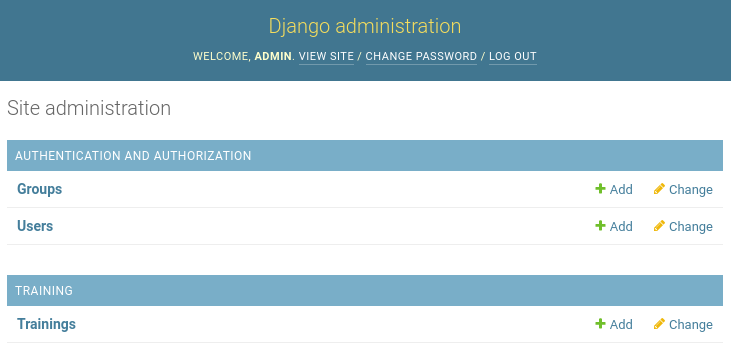
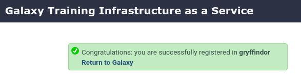
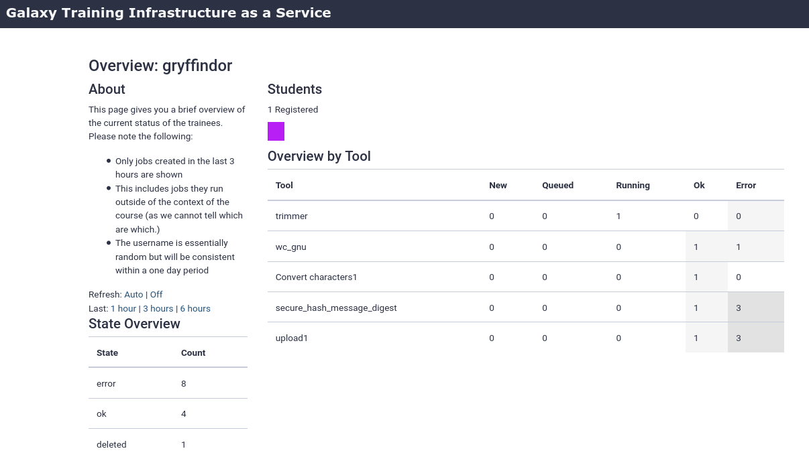

Galaxy is widely used for teaching. In order to facilitate instructors, the Galaxy Project has developed {TIaaS}.
Workshop instructors can apply for {TIaaS}, and on the day of their workshop, their participants will be placed in a special group and use dedicated
resources, thus reducing queue times on the day of the training.

{: width="70%"}

This tutorial will go cover how to set up such a service on your own Galaxy server.


> <agenda-title></agenda-title>
>
> 1. TOC
> {:toc}
>
{: .agenda}




# Setting up TIaaS

> <hands-on-title>Setup TIaaS</hands-on-title>
>
> 1. In your `requirements.yml` add the {TIaaS} ansible role:
>
>    
>    ```diff
>    --- a/requirements.yml
>    +++ b/requirements.yml
>    @@ -36,3 +36,5 @@
>       version: 0.14.2
>     - src: dj-wasabi.telegraf
>       version: 0.12.0
>    +- src: galaxyproject.tiaas2
>    +  version: 2.1.3
>    
>    ```
>    {: data-commit="Add tiaas2 requirement"}
>
>    And run the install step:
>
>    > <code-in-title>Bash</code-in-title>
>    > ```bash
>    > ansible-galaxy install -p roles -r requirements.yml
>    > ```
>    > {: data-cmd="true"}
>    {: .code-in}
>
>    
>
> 2. In your `galaxyservers` group variables file, add the following:
>
>    
>    ```diff
>    --- a/group_vars/galaxyservers.yml
>    +++ b/group_vars/galaxyservers.yml
>    @@ -234,6 +234,11 @@ telegraf_plugins_extra:
>           - data_format = "influx"
>           - interval = "15s"
>     
>    +# TIaaS setup
>    +tiaas_dir: /srv/tiaas
>    +tiaas_admin_user: admin
>    +tiaas_admin_pass: changeme
>    +
>     # TUS
>     galaxy_tusd_port: 1080
>     tusd_instances:
>    
>    ```
>    {: data-commit="Configure tiaas"}
>
> 2. In the `galaxyservers` group variables file, we also need to set the database permissions correctly for TIaaS. It needs to be able to access some Galaxy tables, and we will carefully define only the ones we really need:
>
>    
>    ```diff
>    --- a/group_vars/galaxyservers.yml
>    +++ b/group_vars/galaxyservers.yml
>    @@ -8,6 +8,7 @@ pip_package: python3-pip                               # geerlingguy.pip
>     postgresql_objects_users:
>       - name: galaxy
>       - name: telegraf
>    +  - name: tiaas
>     postgresql_objects_databases:
>       - name: galaxy
>         owner: galaxy
>    @@ -16,6 +17,27 @@ postgresql_objects_privileges:
>         roles: telegraf
>         privs: SELECT
>         objs: ALL_IN_SCHEMA
>    +  - database: galaxy
>    +    roles: tiaas
>    +    objs: galaxy_user,galaxy_session,job,history,workflow,workflow_invocation
>    +    type: table
>    +    privs: SELECT
>    +  - database: galaxy
>    +    roles: tiaas
>    +    objs: user_group_association,galaxy_group,role,group_role_association
>    +    type: table
>    +    privs: SELECT,INSERT
>    +  - database: galaxy
>    +    roles: tiaas
>    +    objs: group_role_association
>    +    type: table
>    +    privs: DELETE
>    +  - database: galaxy
>    +    roles: tiaas
>    +    objs: role_id_seq,galaxy_group_id_seq,group_role_association_id_seq,user_group_association_id_seq
>    +    type: sequence
>    +    privs: USAGE,SELECT
>    +
>     # PostgreSQL Backups
>     postgresql_backup_dir: /data/backups
>     postgresql_backup_local_dir: "{{ '~postgres' | expanduser }}/backups"
>    
>    ```
>    {: data-commit="Add database privileges for TIaaS"}
>
>    > <tip-title>Why does TIaaS get `DELETE` privileges on Galaxy's Database?</tip-title>
>    > The `DELETE` privilege is limited in scope to one table: `group_role_association`. This allows TIaaS to
>    > disassociate training groups from roles in the Galaxy database after the training event date has passed, so that
>    > users who participated in a training return to using normal (non-training) resources after the training ends.
>    >
>    > The `galaxyproject.tiaas2` role will create a [cron](https://manpages.debian.org/stable/cron/cron.8.en.html) job
>    > to perform this process every night at midnight. You can control when this runs (or disable it) using
>    > [the tiaas_disassociate_training_roles variable](https://github.com/galaxyproject/ansible-tiaas2/blob/d5be2a064c49e010f67bfcea18e36812da23d7d8/defaults/main.yml#L20).
>    >
>    {: .tip}
>
>    > <tip-title>Running the playbook from scratch</tip-title>
>    > This is one of the few statements we've provided that presents difficulties when running the playbook completely from scratch on a blank machine. Setting postgresql roles is one of the first steps in our playbook, but the rules we've provided above depend on the Galaxy tables existing in that database. If those tables aren't there, it will fail. If you do someday run this from scratch, you'll find that you need to comment out those roles.
>    {: .tip}
>
> 3. We need to add the `galaxyproject.tiaas2` role before the `nginx` role, as TIaaS defines variables that Nginx needs.
>    
>    ```diff
>    --- a/galaxy.yml
>    +++ b/galaxy.yml
>    @@ -30,6 +30,7 @@
>           become: true
>           become_user: "{{ galaxy_user.name }}"
>         - usegalaxy_eu.rabbitmq
>    +    - galaxyproject.tiaas2
>         - galaxyproject.nginx
>         - galaxyproject.tusd
>         - galaxyproject.cvmfs
>    
>    ```
>    {: data-commit="Add TIaaS role to the Galaxy playbook"}
>
> 4. Lastly we should add the routes for TIaaS to the NGINX template for Galaxy. TIaaS provides a set of default nginx routes that can be used.
>
>    
>    ```diff
>    --- a/templates/nginx/galaxy.j2
>    +++ b/templates/nginx/galaxy.j2
>    @@ -90,4 +90,5 @@ server {
>             proxy_set_header Host $http_host;
>         }
>     
>    +    {{ tiaas_nginx_routes }}
>     }
>    
>    ```
>    {: data-commit="Add nginx routes for TIaaS"}
>
> 5. Run the playbook
>
>    > <code-in-title>Bash</code-in-title>
>    > ```bash
>    > ansible-playbook galaxy.yml
>    > ```
>    > {: data-cmd="true"}
>    {: .code-in}
>
{: .hands_on}

> ```bash
> 1.sh
> ```
> {: data-test="true"}
{: .hidden}


{TIaaS} should be available now! The following routes on your server are now configured (we will run through these in the next section)


|URL | Use | Who |
|:----|----|-----|
|https://\<server\>/tiaas/new/ | Request a new TIaaS training | Instructors |
|https://\<server\>/tiaas/admin/ | Approve and Manage requests | Admin |
|https://\<server\>/tiaas/stats/ | Overall TIaaS statistics ([EU Stats](https://usegalaxy.eu/tiaas/stats/)) | Admins, Funding Agencies |
|https://\<server\>/tiaas/calendar/ | Calendar of trainings ([EU Calendar](https://usegalaxy.eu/tiaas/calendar/))| Admins, Funding Agencies |
|https://\<server\>/join-training/\<training-id\> | Join an TIaaS training | Participants |
|https://\<server\>/join-training/\<training-id\>/status | Dashboard with job states of trainees.| Instructors|


Let's see it in action!

> <hands-on-title>Using TIaaS</hands-on-title>
>
> 1. **Create a new TIaaS request**
>    - Go to https://\<server\>/tiaas/new/
>    - Here you will find the request form users will fill in to request TIaaS:
>      
>    - For *"Training Identifier"*, fill in `gryffindor` (or remember this value if you enter something different)
>      - This is the `<training-id>` used in the URLs listed above used for:
>        1. Workshop participants to join the tiaas group
>        2. Workshop instructors to monitor the progress of their participants.
>    - Fill in the rest of the form as you like
>    - Submit the form and you should see a confirmation dialog:
>      
>
> 2. **Approve TIaaS request**
>    - Next, the request will have to be approved by an admin
>    - Go to https://\<server\>/tiaas/admin
>    - **Log in** using the values you configured `tiaas_admin_user` and `tiaas_admin_pass` in your group variables file
>      - Default values were `admin:changeme`
>    - You should now see the admin panel:
>      
>    - Click on **Trainings**, you should see the TIaaS request listed here:
>      
>    - **Approve the request**
>      - Click on the training
>      - Scroll down to the bottom
>      - Change *"Processed"* to `Approved` and **Save**
>        
>    - At this point, you would likely email the person who made the request to inform them of approval
>
> 3. **Join TIaaS Training**
>    - Make sure you are logged in to Galaxy
>    - On the day of the workshop, participants will visit a following URL to join the TIaaS group
>      - https://\<server\>/join-training/gryffindor
>      - A confirmation dialog should appear if all went well:
>        
>
> 4. **Monitor TIaaS status**
>    - This is very useful for instructors to monitor the job state of their participants
>    - Go to https://\<server\>/join-training/gryffindor/status
>    - In the Dasboard you should see that one user (you) has joined the training \
>    - Run some jobs to see the dashboard in action
>      
>    - Scroll down to get some more information on a per-user level (anonymized)
>      - Every user designated by their own identifier and colour, but no personal information
>      
>
{: .hands_on}


> <comment-title>Note: GDPR assistance</comment-title>
>
> Since this setup tracks additional personal information (submitter name & email, users in the queue view), TIaaS includes some always-on features to assist with your GDPR compliance.
>
>  - Users in public status dashboard are only visible by an anonymized identifier and colour
>  - Email addressses in the TIaaS admin panel will be automatically expunged 60 days after a training event
>
>  Of course you need to review any GDPR compliance concerns with your group's legal representative(s), this only attempts to ensure some protections exist for the users of the system.
>
{: .comment}


# Job Configuration

While observability for teachers or trainers is already a huge benefit, one of the primary benefits of {TIaaS} is that your jobs get sent to dedicated compute resources, which won't be used by anyone else, during the period of the training. We will send all of the training jobs to pulsar if you have completed that tutorial, or one of the slurm destinations from the job configuration training.

In order to achieve this, we first need some way to *sort* the jobs of the training users into these private queues, while letting the other jobs continue on. So let's create a *sorting hat* to figure out where jobs belong.


> <hands-on-title>Writing a dynamic job destination</hands-on-title>
>
> 1. Create and open `templates/galaxy/dynamic_job_rules/hogwarts.py`
>
>    
>    ```diff
>    --- /dev/null
>    +++ b/templates/galaxy/dynamic_job_rules/hogwarts.py
>    @@ -0,0 +1,19 @@
>    +from galaxy.jobs import JobDestination
>    +from galaxy.jobs.mapper import JobMappingException
>    +import os
>    +
>    +def sorting_hat(app, user):
>    +    # Check that the user is not anonymous
>    +    if not user:
>    +        return app.job_config.get_destination('slurm')
>    +
>    +    # Collect the user's roles
>    +    user_roles = [role.name for role in user.all_roles() if not role.deleted]
>    +
>    +    # If any of these are prefixed with 'training-'
>    +    if any([role.startswith('training-') for role in user_roles]):
>    +        # Then they are a training user, we will send their jobs to pulsar,
>    +        # Or give them extra resources
>    +        return app.job_config.get_destination('slurm-2c') # or pulsar, if available
>    +
>    +    return app.job_config.get_destination('slurm')
>    
>    ```
>    {: data-commit="Setup sorting hat for jobs"}
>
>    This destination will check that the `user_email` is in a training group (role starting with `training-`).
>
> 2. As usual, we need to instruct Galaxy of where to find this file. Edit your group variables file and add the following:
>
>    
>    ```diff
>    --- a/group_vars/galaxyservers.yml
>    +++ b/group_vars/galaxyservers.yml
>    @@ -137,6 +137,7 @@ galaxy_local_tools:
>     galaxy_dynamic_job_rules:
>     - my_rules.py
>     - map_resources.py
>    +- hogwarts.py
>     
>     # systemd
>     galaxy_manage_systemd: true
>    
>    ```
>    {: data-commit="Add to list of deployed rules"}
>
> 3. We next need to configure this plugin in our job configuration (`templates/galaxy/config/job_conf.yml.j2`):
>
>    
>    ```diff
>    --- a/templates/galaxy/config/job_conf.yml.j2
>    +++ b/templates/galaxy/config/job_conf.yml.j2
>    @@ -16,7 +16,7 @@ runners:
>         manager: _default_
>     
>     execution:
>    -  default: slurm
>    +  default: sorting_hat
>       environments:
>         local_dest:
>           runner: local_runner
>    @@ -73,6 +73,10 @@ execution:
>         dynamic_cores_time:
>           runner: dynamic
>           function: dynamic_cores_time
>    +    # Next year this will be replaced with the TPV.
>    +    sorting_hat:
>    +      runner: dynamic
>    +      function: sorting_hat
>     
>     resources:
>       default: default
>    
>    ```
>    {: data-commit="Setup job conf"}
>
>    This is a **Python function dynamic destination**. Galaxy will load all python files in the `{{ galaxy_dynamic_rule_dir }}`, and all functions defined in those will be available to be used in the `job_conf.yml.j2`. Additionally it will send all jobs through the sorting hat, but we want upload jobs to stay local. They should always run locally.
>
> 6. Run the playbook
>
>    > <code-in-title>Bash</code-in-title>
>    > ```bash
>    > ansible-playbook galaxy.yml
>    > ```
>    > {: data-cmd="true"}
>    {: .code-in}
>
> 7. Ensure your user is joined to a training
>
> 8. Run a job and observe the logs to see where it goes (`journalctl -u galaxy -f`)
>
{: .hands_on}

Congratulations! you have now set up {TIaaS} on your Galaxy server.

> ```bash
> 2.sh
> ```
> {: data-test="true"}
{: .hidden}


