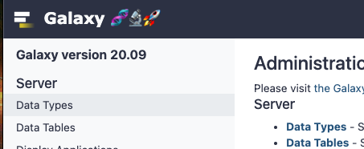

# Overview


One of the most important and recurring tasks for a Galaxy server admin is to keep the server up to date with security patches, minor fixes and major version upgrades.

Luckily for us, by using the best practice Ansible installation method that we have used throughout these tutorials, keeping our Galaxy server up to date is extremely easy.

We can get all the latest patches and fixes for our currently installed version of Galaxy by just re-running the Ansible playbook on a regular basis.

We can upgrade our Galaxy version by modifying the Ansible var files and re-running the playbook. It's that simple.

This tutorial will show you how and discuss some of the things you need to keep in mind whenever you are updating or upgrading your Galaxy server.

**Some notes on Galaxy versioning and releases.**

* As at June 2021, Galaxy has three new version releases per year - in each of January, May and September. The versions are denominated by the year and month - `YY.MM`. i.e. January 2021's Galaxy release is version *21.01*.
* Official Galaxy versions are tagged on the [Galaxy Project's GitHub releases page](https://github.com/galaxyproject/galaxy/releases) as `vYY.MM`. e.g. *v21.01*
* Each version also has an official branch in the GitHub repo named `release_YY.MM`. e.g. *release_21.01*
* Galaxy versions will be supported with security fixes, bug patches and other improvements for [one year](https://github.com/galaxyproject/galaxy/blob/dev/SECURITY_POLICY.md#supported-versions) from the time of release at which time they will become "End of Life" and will no longer be supported.

> <agenda-title></agenda-title>
>
> 1. TOC
> {:toc}
>
{: .agenda}

**This tutorial assumes that:**

- You have a VM or machine where you you have Galaxy installed.
- You have completed at least the "Galaxy Installation with Ansible" tutorial.
- You have command line and sudo access to the VM/computer where it is installed.

> <tip-title>Galaxy server version installed by the tutorials</tip-title>
> At the time of writing, the version of Galaxy that was installed with the "Galaxy Installation with Ansible" tutorial is *20.09*. This tutorial is designed to upgrade the server to *21.01*. If you already have a version equal to or higher than *21.01* running on your server, never fear! The process outlined below can still be used to upgrade to the latest version of Galaxy - just swap out *21.01* used below for the current latest version.
{: .tip}

# Find your current Galaxy server version

The first thing we will do in this tutorial is find the current installed version of the Galaxy. There are a few methods for determining this - You can find it in the GUI if you are an admin user or you can get it via the server API.

Once we know what our current version is, we can compare it with the latest available version

> <hands-on-title>Get the current server version</hands-on-title>
>
> **Method 1: Via the Admin UI page**
> The currently installed version of Galaxy is shown on the Galaxy server's Admin UI page.
> 1. Click on the **Admin** menu item to bring up the Admin UI.
>
> 2. The version of Galaxy currently running is displayed in the top left corner of the screen.
>
> 
>
> **Method 2: Via the API**
>
> 1. In your browser - go to the following URL: `https://your-galaxy/api/version`. The version will be displayed as follows:
>
>    > <code-in-title>Bash</code-in-title>
>    > ```shell
>    > curl https://your-galaxy/api/version
>    > ```
>    > {: data-cmd="true"}
>    {: .code-in}
>
>    > <code-out-title>Browser window</code-out-title>
>    > ```JSON
>    > {
>    >   "version_major": "20.09",
>    >   "extra": {}
>    > }
>    > ```
>    {: .code-out}
>
> Both methods above show the version of Galaxy that has been installed. At the time of writing, on this server it's *20.09*. Your version may differ depending on which version you installed initially.
{: .hands_on}


# Finding the latest release version

So, we have found out which version we are running on our server. But what is the current latest version of Galaxy that is available? There are quite a few ways of finding out.

* Galaxy is released 3 times per year. If the time of year is around January/February, April/May or September/October there may be a new release about to be announced.
* You can check the Galaxy Project Newsletter and home page [https://galaxyproject.org](https://galaxyproject.org)

Probably the easiest way of finding the version number of the latest release is via the extensive Galaxy Documentation Website located at: [https://docs.galaxyproject.org](https://docs.galaxyproject.org).

This site shows all of the release notes of all the available Galaxy versions and always has the latest release at the top of the list.

 showing the release versions. The latest version is at the top of the 'Releases' list.")

We can see from this page that the latest release version of Galaxy is *21.01* (at the time of writing.)

> <question-title>What is the current latest version?</question-title>
> As previously mentioned, the current latest release of Galaxy may not be *21.01*. What version is the latest that you can see?
{: .question}

## The importance of the release notes

Each release of Galaxy is accompanied by extensive release notes in two different "flavours."

* "Full release notes" which have extensive detail about all changes made since the last release. This version of the release notes is targetted to Administrators who may need to know about minor fixes, configuration details, security issues, new features and other things found in the latest version.
* "User facing" release notes which provide an visual and interactive summary of the release highlights, additions and new features targetted towards end users, trainers and funders etc.

Before upgrading your Galaxy server to the latest version (or even a new version for that matter) - It is **HIGHLY recommended** that you read the release notes for that version. The notes are *very extensive* and may contain important information on any new features, links  and how to configure them for your server.


# Back up the Galaxy database

At the heart of every Galaxy server beats its database. The database is the most important part of the Galaxy server as it contains all of the metadata required for the server to operate and records details of all users, jobs, datasets etc since the server was started.

Sometimes new versions of Galaxy make changes to the database schema that require a database upgrade.

It is highly important that we back it up before making any substantial changes to the Galaxy server as things sometimes go wrong (inopportune power failures, disk crashes etc) and losing or corrupting the database is possible during an upgrade operation.

In a production environment it is really important to make regular backups of the database in any case. The **usegalaxy.\*** servers all perform at least daily backups of their respective databases and even have replicate database servers *just in case.*

> <hands-on-title>Back up the Galaxy database</hands-on-title>
>
> We will be using the PostgreSQL `pg_dump` command to dump the complete contents of the Galaxy database to a file. From the usage text of the command:
>
>   
>   ```
>   pg_dump --help
>   pg_dump dumps a database as a text file or to other formats.
>
>   Usage:
>     pg_dump [OPTION]... [DBNAME]
>   ```
>   
>
> We will use `pg_dump` and pipe its output through `gzip` to an output file to create a compressed text (SQL) representation of the database. We will need to do this as the `galaxy` user. It's a good idea to create the backup file name with a sensible name and then copy it somewhere else like a cloud service.
>
> From your terminal -
>
>    > <code-in-title>Bash</code-in-title>
>    > ```bash
>    > sudo su -l galaxy
>    > pg_dump galaxy | gzip > galaxy_database-2009-1.sql.gz
>    > ls -lah galaxy_database*
>    > ```
>    > {: data-cmd="true"}
>    {: .code-in}
>
>    > <code-out-title>Bash</code-out-title>
>    > ```bash
>    > -rw-rw-r-- 1 galaxy galaxy 94K Jun  8 04:12 galaxy_database_2009-1.sql.gz
>    > ```
>    {: .code-out}
>
> As you can see, the database on our server isn't currently huge though this will changes as your server gets more users, runs more jobs and stores more data. The current size for Galaxy Australia's compressed database backup is ~11GB and growing.
{: .hands_on}

Now that we have backed up our database we can move on to upgrading our Galaxy server to the latest version. For the sake of this tutorial, we will assume that the installed version is different to the latest version (at the time of writing - *20.09* vs *21.01*). If that is not the case for you, then you can instead use this tutorial as a reference in the future.

# Upgrading Galaxy to a new version

If you've been following best practices and using Ansible to install and configure your Galaxy server then you're in luck - this step is going to be very easy! We just need to adjust the Galaxy version number in our `group_vars/galaxyservers.yml` file and re-run the playbook. If you haven't been using Ansible then there are some notes on performing an upgrade located at: [https://galaxyproject.org/admin/maintenance/](https://galaxyproject.org/admin/maintenance/). The Ansible method is much preferred and simple!

There are however a few things to consider before doing the actual upgrade, especially in a production environment.

* Galaxy will be restarted.
    * Is this an appropriate time for that to happen?
    * Does it need to be scheduled with your users?
* The database schema may change
    * Have you backed up the database?

Once you've made sure of these things, it's time to do it!

> <hands-on-title>Back up the Galaxy database</hands-on-title>
>
> In this tutorial we will upgrade the server to version *21.01*. This may be different for you. Please use the latest version instead.
>
> 1. Edit the `group_vars/galaxyservers.yml` file and change the `galaxy_commit_id` to the latest version. Use the form `release_YY.MM` or in this case `release_21.01`.
>
>    
>    ```diff
>    --- a/group_vars/galaxyservers.yml
>    +++ b/group_vars/galaxyservers.yml
>    @@ -21,7 +21,7 @@ galaxy_manage_paths: true
>     galaxy_layout: root-dir
>     galaxy_root: /srv/galaxy
>     galaxy_user: {name: galaxy, shell: /bin/bash}
>    -galaxy_commit_id: release_20.09
>    +galaxy_commit_id: release_21.01
>     galaxy_force_checkout: true
>     miniconda_prefix: "{{ galaxy_tool_dependency_dir }}/_conda"
>     miniconda_version: 4.7.12
>    ```
>    
>
>    
>
> 2. Now run the playbook!
>
>    > <code-in-title>Bash</code-in-title>
>    > ```bash
>    > ansible-playbook galaxy.yml
>    > ```
>    > {: data-cmd="true"}
>    {: .code-in}
>
{: .hands_on}

You should see in the Ansible output that Galaxy had to rebuild the client, update the database, rebuild its virtual environment and restart. If you weren't using Ansible, these steps would all be manual and important not to get wrong. Ansible makes the entire process super simple for us.

Congratulations, you're Galaxy server should now be updated to the latest version. You can check this by going to the Admin UI page or by using the API as described above.

# Ongoing maintenance

The Galaxy development community continually support release versions of Galaxy [for 1 year.](https://github.com/galaxyproject/galaxy/blob/dev/SECURITY_POLICY.md#supported-versions) They regularly update releases with bug fixes, patches and security enhancements. Therefore it is important that we as administrators keep our Galaxy servers up to date regardless of which release we are running.

The easiest way to do this is to regularly re-run the Ansible playbook. It will check with GitHub and grab any new changes to Galaxy since the last time you ran it and automatically keep everything up to date. The large **usegalaxy.\*** servers all re-run the playbook on a regular schedule for this purpose.

Regular running of the playbook also encourages you and your team members to make changes to the Ansible scripts not the live system (as live changes will be overwritten). This leads to a much more robust and consistent production Galaxy server for your users.

# Conclusion

This tutorial has shown you how to keep your Galaxy server up to date with the latest version painlessly and simply following current best practice. We hope you enjoyed this tutorial and got something out of it.