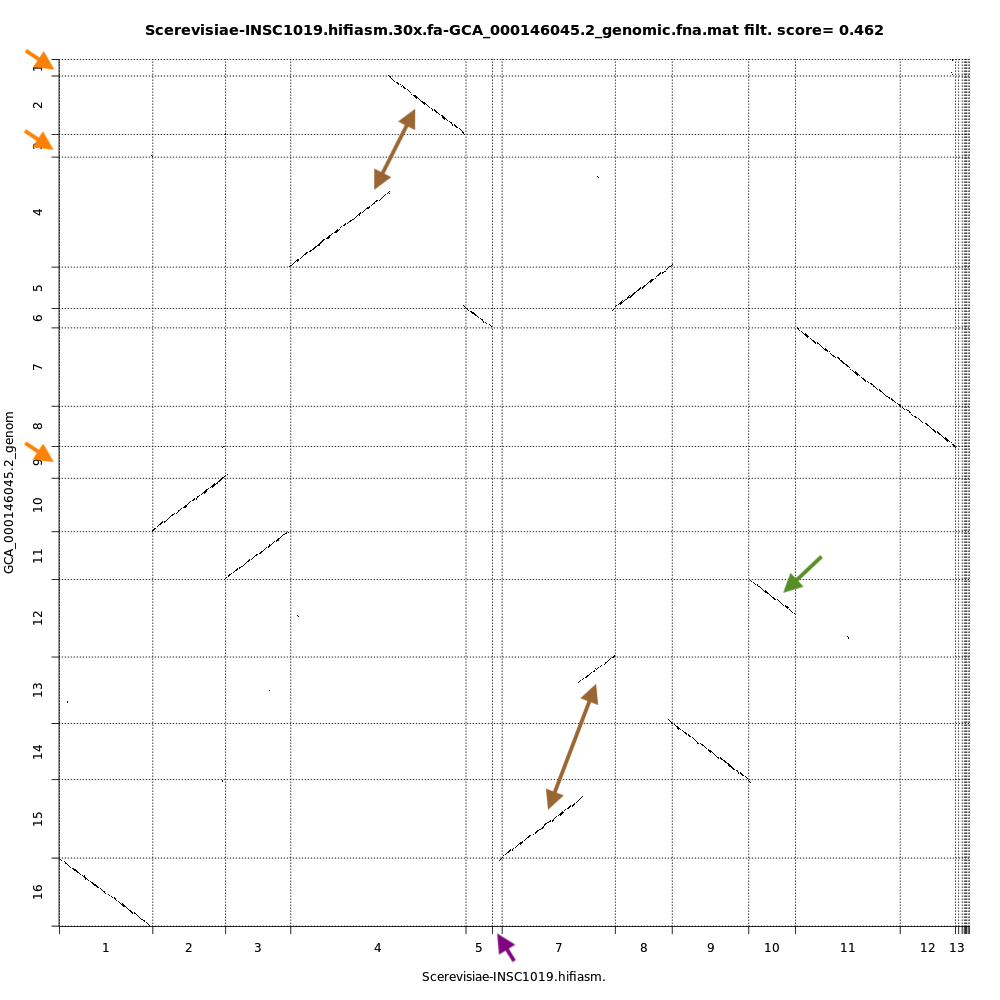

# Introduction


In this tutorial, we will assess the assembly quality of 2 assemblies generated with Hifiasm and Flye using PacBio HiFi reads of a species of fungi, *Saccharomyces cerevisiae* INSC1019 and compare the results with the actual reference genome [*Saccharomyces cerevisiae* S288C](https://www.ncbi.nlm.nih.gov/genome/?term=Saccharomyces%20cerevisiae).

> <agenda-title></agenda-title>
>
> In this tutorial, we will cover:
>
> 1. TOC
> {:toc}
>
{: .agenda}

# Get data

We will use long quality reads sequencing data from PacBio HiFi sequencing of *Saccharomyces cerevisiae* INSC1019 genome. This data is a subset of data from ENA repository [SRR13577847](https://www.ebi.ac.uk/ena/browser/view/SRR13577847?show=reads). We will also use the reference genome assembly downloaded from the [NCBI website](https://www.ncbi.nlm.nih.gov/genome/?term=Saccharomyces%20cerevisiae) and we will use it as a comparison with our own assemblies.

## Get data from Zenodo

> <hands-on-title>Data upload from Zenodo</hands-on-title>
>
> 1. Create a new history for this tutorial
> 2. Import the files from [Zenodo](https://zenodo.org/record/5702408)
>
>    ```
>    https://zenodo.org/record/6947782/files/GCA_000146045.2_genomic.fna
>    https://zenodo.org/record/6947782/files/Scerevisiae-INSC1019.flye.30x.fa
>    https://zenodo.org/record/6947782/files/Scerevisiae-INSC1019.hifiasm.30x.fa
>    https://zenodo.org/record/6947782/files/SRR13577847_subreads.30x.fastq.gz
>    ```
>
>    
>
> 3. Check that the datatype is `fastqsanger.gz` for `SRR13577847_subreads.30x.fastq.gz`
>
>    
>
{: .hands_on}

# Evaluation of assembly contiguity and correctness with **Quast**

A way to calculate metrics assembly is to use **QUAST = QUality ASsessment Tool**. Quast is a tool to evaluate genome assemblies by computing various metrics and to compare genome assembly with a reference genome. The manual of Quast is here: [Quast](http://quast.sourceforge.net/docs/manual.html#sec3)

> <comment-title>QUAST statistics</comment-title>
>
> QUAST will provide us with the following statistics:
>
> - Contigs: The total number of contigs in the assembly.
> - Largest contig: The length of the largest contig in the assembly.
> - Total length: The total number of bases in the assembly.
> - Nx: The largest contig length, *L*, such that contigs of length >= *L* account for at least *x*% of the bases of the assembly.
> - NGx: The contig length such that using equal or longer length contigs produces *x*% of the length of the reference genome, rather than *x*% of the assembly length.
> - GC content: the percentage of nitrogenous bases which are either guanine or cytosine.
>
> If a reference genome is provided, the report also indicates:
> - Genome fraction (%): total number of aligned bases in the reference genome, divided by the genome size
> - Duplication ratio: total number of aligned bases in the assembly, divided by the total number of aligned bases in the reference genome
> - NGA50: NG50 where the lengths of aligned blocks are counted instead of contig lengths. i.e., if a contig has a misassembly with respect to the reference, the contig is broken into smaller pieces. This metric is computed only if a reference genome is provided.
> LGA50: LG50 where aligned blocks are counted instead of contigs. i.e., if a contig has a misassembly with respect to the reference, the contig is broken into smaller pieces
>
> Many other metrics are available when clicking on `Extended report`!
{: .comment}

> <hands-on-title>assembly evaluation with Quast</hands-on-title>
>
> 1.  with the following parameters:
>    - *"Use customized names for the input files?"*: `No, use datasets names`
>    -  *"Contigs/scaffolds file"*: `Scerevisiae-INSC1019.flye.30x.fa` and `Scerevisiae-INSC1019.hifiasm.30x.fa`
>    - *"Reads options"*: `Pacbio SMRT reads`
>        -  *"FASTQ file"*: `SRR13577847_subreads.30x.fastq.gz`
>    - *"Type of assembly"*: `Genome`
>        - *"Use a reference genome?"*: `Yes`
>            -  *"Reference genome"*: `GCA_000146045.2_genomic.fna`
>    - *"Is genome large (>100Mpb)?"*: `No`
>
{: .hands_on}

> <question-title></question-title>
>
> With the informations generated by Quast, compare the two assemblies to the reference genome
>
> 1. Which assembly is closest to the reference genome?
> 2. What is the longest contig of the Flye and Hifiasm assemblies?
> 3. What is the N50 of the Flye assembly?
> 4. Which percentage of reads mapped to each assembly?
>
> > <solution-title></solution-title>
> >
> > 1. The Flye assembly, with a genome fraction of 99.57% while Hifiasm have a low genome fraction (75.15%) which can indicate a problematic assembly.
> > 2. The longest contig is 1,438,238 bp for Flye assembly while is 1,795,653 bp for Hifiasm
> > 3. The N50 of the Flye assembly is 929,061 bp.
> > 4. A total of 99.96% of reads mapped were mapped to the Flye assembly while only 91.02% against the Hifiasm assembly.
> >
> > Without a reference genome, it would have been harder to determine that assembly with Hifiasm is problematic. Metrics on the assembly itself are not always sufficient and therefore it is necessary to use other methodologies to ensure the quality of an assembly.
> {: .solution}
>
{: .question}

# Evaluation of assembly completness

## Core genes completness with **BUSCO**

**BUSCO (Benchmarking Universal Single-Copy Orthologs)** allows a measure for quantitative assessment of genome assembly based on evolutionarily informed expectations of gene content. Details for this tool are here: [Busco website](https://busco.ezlab.org/)

> <hands-on-title>assessing assembly completness with BUSCO</hands-on-title>
>
> 1.  with the following parameters:
>    -  *"Sequences to analyse"*:`Scerevisiae-INSC1019.flye.30x.fa`, `Scerevisiae-INSC1019.hifiasm.30x.fa` and `GCA_000146045.2_genomic.fna`
>    - *"Mode"*: `Genome assemblies (DNA)`
>        - *"Use Augustus instead of Metaeuk"*: `Use Metaeuk`
>    - *"Auto-detect or select lineage?"*: `Select lineage`
>       - *"Lineage"*: `Saccharomycetes`
>    - *"Which outputs should be generated"*: `short summary text` and `summary image`
>
{: .hands_on}

> <question-title></question-title>
>
> Compare the number of BUSCO genes identified in the Flye and Hifiasm assembly to the reference genome. What do you observe ?
>
> > <solution-title></solution-title>
> >
> > Short summary generated by BUSCO indicates that reference genome contains:
> > 1. 2129 Complete BUSCOs (of which 2128 are single-copy and 49 are duplicated),
> > 2. 2 fragmented BUSCOs,
> > 3. 6 missing BUSCOs.
> >
> > Short summary generated by BUSCO indicates that Flye assembly contains:
> > 1. 2127 complete BUSCOs (2127 single-copy and 49 duplicated),
> > 2. 2 fragmented BUSCOs
> > 3. 8 missing BUSCOs.
> >
> > Short summary generated by BUSCO indicates that Hifiasm assembly contains:
> > 1. 1663 complete BUSCOs (1662 single-copy and 27 duplicated),
> > 2. 5 fragmented BUSCOs
> > 3. 469 missing BUSCOs.
> >
> >
> > BUSCO analysis confirms that Flye assembly is better than Hifiasm assembly. Flye is also similar in completness to the reference genome with similar number of complete, fragmented and missing BUSCOs genes.
> >
> {: .solution}
>
{: .question}

Despite BUSCO being robust for species that have been widely studied, it can be inaccurate when the newly assembled genome belongs to a taxonomic group that is not well represented in [OrthoDB](https://www.orthodb.org/). Even in a well-represented taxonomic group, the bias on the selection of reference genomes selected to create OrthoDB can lead to an under-scoring of the newly assembled genome and is dependent on the evolution of the genomes. For example, in microsporidia, basal genomes have much lower scores due to the strong drive on gene loss and gain in these organisms.

## k-mer based assembly evaluation with **Merqury**

Meryl will allow us to generate the k-mer profile by decomposing the sequencing data into k-length substrings, counting the occurrence of each k-mer and determining its frequency. Meryl comprises three main modules: one for generating k-mer databases, one for filtering and combining databases, and one for searching databases.

> <hands-on-title>Generate k-mers count distribution</hands-on-title>
>
> 1.  with the following parameters:
>    - *"Operation type selector"*: `Count operations`
>        - *"Count operations"*: `Count: count the ocurrences of canonical k-mers`
>        -  *"Input sequences"*: `SRR13577847_subreads.30x.fastq.gz`
>        - *"K-mer size selector"*: `Estimate the best k-mer size`
>            - "*Genome size*": `12000000`
>
{: .hands_on}

Merqury is used for reference-free assembly evaluation based on k-mer set operations. By comparing k-mers in a de novo assembly to those found in unassembled high-accuracy reads, Merqury estimates base-level accuracy and completeness. For trios, Merqury can also evaluate haplotype-specific accuracy, completeness, phase block continuity, and switch errors. Multiple visualizations and tables, such as k-mer spectrum plots, are generated for evaluation of the assembly quality.

> <hands-on-title>K-mer based evaluation with Merqury</hands-on-title>
>
> 1.  with the following parameters:
>    - *"Evaluation mode"*: `Default mode`
>        -  *"K-mer counts database"*: `Meryldb` (output of **Meryl** )
>        - *"Number of assemblies"*: `One assembly`
>            -  *"Genome assembly"*: `Scerevisiae-INSC1019.flye.30x.fa`, `Scerevisiae-INSC1019.hifiasm.30x.fa` and `GCA_000146045.2_genomic.fna`
>
{: .hands_on}

By default, Merqury generates three collections as output: stats, plots and QV stats. The "stats" and "plots" collection contains the completeness statistics, while the "QV stats" collection contains the quality value statistics.

> <question-title></question-title>
>
> Compare the k-mers plots for the Flye and Hifiasm assembly and the reference genome. What do you observe ?
>
> > <solution-title></solution-title>
> >
> > Merqury analysis confirms that Flye assembly is better than Hifiasm assembly. Hifiasm `assembly.spectra-cn.fl` shows that part of the data is specific to reads (black peak overlapping the red peak) indicating an absence of contigs in the assembly to represent these data.
> >
> > Flye it's similar in completness to the reference genome with a single read peak. We note however that part of the reference genome assembly is specific and absent from the reads (red barplot on the left). This is because the sequencing data is from a different strain (INSC1019) than the reference genome (S288C).
> >
> {: .solution}
>
{: .question}

# Evaluation against reference genome with **Chromeister**

Chromeister is used to generate dotplots to quickly compare sequence sets, even for large genomes. This is provide a synthetic similarity overview, highlighting repetitions, breaks and inversions.

> <hands-on-title>Synteny evaluation with Chromeister</hands-on-title>
>
> 1.  with the following parameters:
>    -  *"Query sequence"*: `Scerevisiae-INSC1019.flye.30x.fa` and `Scerevisiae-INSC1019.hifiasm.30x.fa`
>    -  *"Reference sequence"*: `GCA_000146045.2_genomic.fna`
>
{: .hands_on}

> <question-title></question-title>
>
> Compare the dotplots for the Hifiasm assembly and the reference genome. What do you observe ?
>
> > <solution-title></solution-title>
> >
> > 
> >
> > With dotplots, we can quickly detect several inconsistencies between the assembly generated by Hifiasm and the reference genome:
> > - Orange arrows indicate contigs in the reference genome that are absent in the Hifiasm assembly
> > - Purple arrow indicates a contig specific to the Hifiasm assembly. This is not necessarily an inconsistency as it is 2 different strains of the same species.
> > - Brown arrows indicate contigs that are merged into the Hifiasm assembly. In the case of the top arrow, there is a fusion and a partial inversion.
> > - Green arrow indicates a contig partially assembled by Hifiasm.
> >
> {: .solution}
>
{: .question}

# Conclusion


This pipeline shows how to evaluate a genome assembly. Once you are satisfied with your genome sequence, you might want to purge it, make scaffolding and directly starting the annotation process!
